# 聊天模块深度文档

<cite>
**本文档引用的文件**
- [src/channels/registry.ts](file://src/channels/registry.ts)
- [src/channels/session.ts](file://src/channels/session.ts)
- [src/channels/chat-type.ts](file://src/channels/chat-type.ts)
- [src/channels/targets.ts](file://src/channels/targets.ts)
- [src/channels/thread-binding-id.ts](file://src/channels/thread-binding-id.ts)
- [src/channels/thread-bindings-policy.ts](file://src/channels/thread-bindings-policy.ts)
- [src/channels/thread-bindings-messages.ts](file://src/channels/thread-bindings-messages.ts)
- [src/channels/plugins/types.ts](file://src/channels/plugins/types.ts)
- [src/channels/plugins/helpers.ts](file://src/channels/plugins/helpers.ts)
- [src/utils/message-channel.ts](file://src/utils/message-channel.ts)
- [src/commands/agent/delivery.ts](file://src/commands/agent/delivery.ts)
- [extensions/imessage/src/channel.ts](file://extensions/imessage/src/channel.ts)
- [ui-react/src/components/channels/constants.ts](file://ui-react/src/components/channels/constants.ts)
- [ui/src/ui/views/channels.ts](file://ui/src/ui/views/channels.ts)
- [docs/zh-CN/channels/index.md](file://docs/zh-CN/channels/index.md)
</cite>

## 目录
1. [简介](#简介)
2. [项目结构](#项目结构)
3. [核心组件](#核心组件)
4. [架构概览](#架构概览)
5. [详细组件分析](#详细组件分析)
6. [依赖关系分析](#依赖关系分析)
7. [性能考虑](#性能考虑)
8. [故障排除指南](#故障排除指南)
9. [结论](#结论)

## 简介

OpenClaw聊天模块是一个高度模块化的消息传递系统，支持多种通信渠道（Telegram、WhatsApp、Discord、IRC、Google Chat、Slack、Signal、iMessage、LINE等）。该模块采用插件架构设计，提供了统一的接口来处理不同渠道的消息发送、接收和会话管理。

聊天模块的核心目标是为用户提供一个统一的界面来管理多个消息渠道，同时保持每个渠道的独特功能和配置选项。系统通过会话绑定机制实现了智能的消息路由和上下文管理。

## 项目结构

聊天模块主要分布在以下目录中：

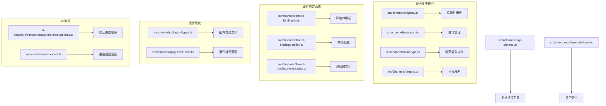

**图表来源**
- [src/channels/registry.ts:1-207](file://src/channels/registry.ts#L1-L207)
- [src/channels/session.ts:1-82](file://src/channels/session.ts#L1-L82)
- [src/channels/thread-bindings-policy.ts:1-202](file://src/channels/thread-bindings-policy.ts#L1-L202)

**章节来源**
- [src/channels/registry.ts:1-207](file://src/channels/registry.ts#L1-L207)
- [src/channels/session.ts:1-82](file://src/channels/session.ts#L1-L82)
- [src/channels/thread-bindings-policy.ts:1-202](file://src/channels/thread-bindings-policy.ts#L1-L202)

## 核心组件

### 渠道注册表系统

渠道注册表负责管理所有支持的消息渠道，包括渠道元数据、别名映射和标准化处理。

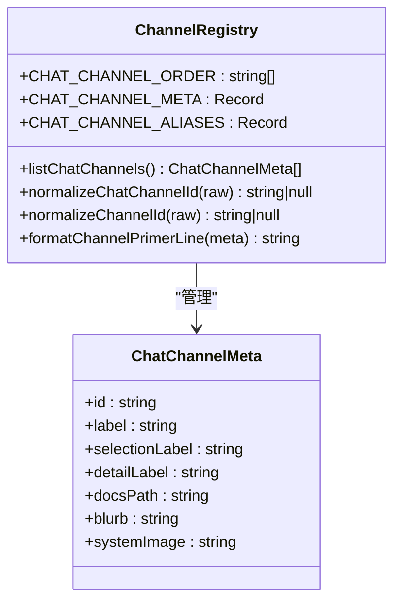

**图表来源**
- [src/channels/registry.ts:27-123](file://src/channels/registry.ts#L27-L123)

### 会话管理系统

会话管理系统负责跟踪用户与不同渠道的交互历史，并维护消息路由信息。

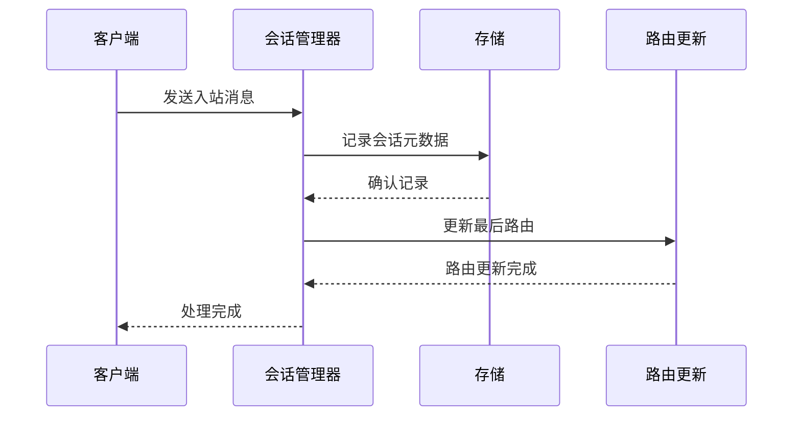

**图表来源**
- [src/channels/session.ts:41-81](file://src/channels/session.ts#L41-L81)

### 线程绑定策略

线程绑定系统允许将特定的会话绑定到渠道的线程或对话中，提供持久的消息上下文。

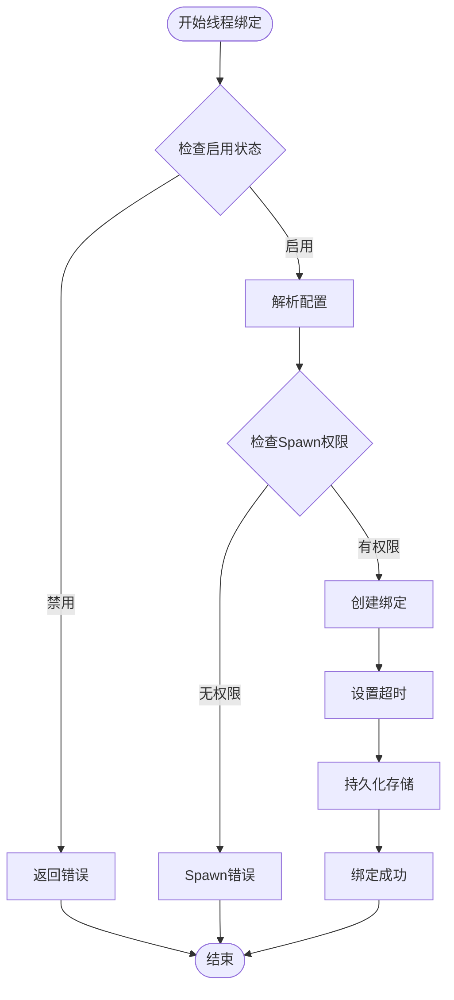

**图表来源**
- [src/channels/thread-bindings-policy.ts:75-138](file://src/channels/thread-bindings-policy.ts#L75-L138)

**章节来源**
- [src/channels/registry.ts:1-207](file://src/channels/registry.ts#L1-L207)
- [src/channels/session.ts:1-82](file://src/channels/session.ts#L1-L82)
- [src/channels/thread-bindings-policy.ts:1-202](file://src/channels/thread-bindings-policy.ts#L1-L202)

## 架构概览

OpenClaw聊天模块采用分层架构设计，从底层的渠道插件到上层的UI界面都有清晰的职责分离。

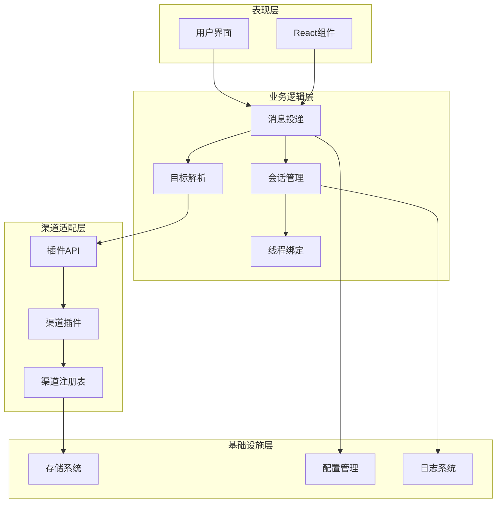

**图表来源**
- [src/commands/agent/delivery.ts:96-117](file://src/commands/agent/delivery.ts#L96-L117)
- [src/channels/plugins/types.ts:1-66](file://src/channels/plugins/types.ts#L1-L66)

## 详细组件分析

### 渠道标准化系统

渠道标准化系统确保不同输入格式的一致性处理：

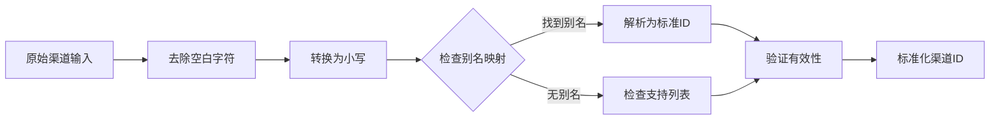

**图表来源**
- [src/channels/registry.ts:149-158](file://src/channels/registry.ts#L149-L158)

### 消息目标解析器

消息目标解析器支持多种目标格式，包括提及、前缀和用户ID：

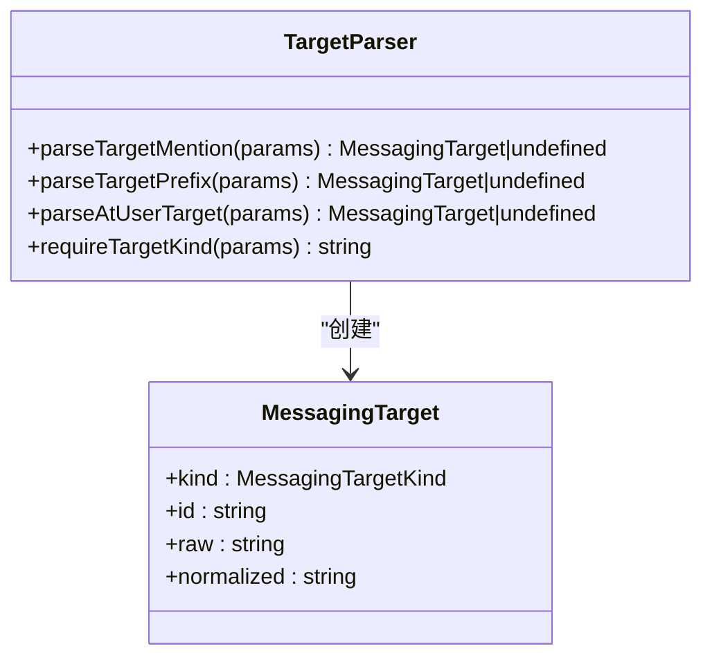

**图表来源**
- [src/channels/targets.ts:6-147](file://src/channels/targets.ts#L6-L147)

### 会话绑定管理器

会话绑定管理器提供完整的线程绑定生命周期管理：

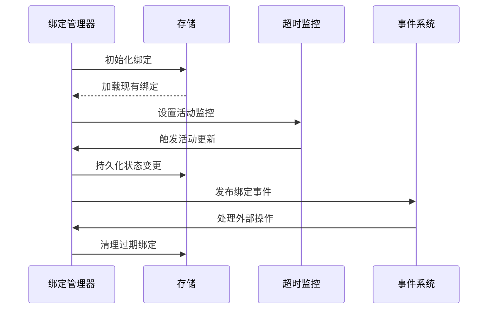

**图表来源**
- [src/channels/thread-bindings-policy.ts:109-138](file://src/channels/thread-bindings-policy.ts#L109-L138)

**章节来源**
- [src/channels/registry.ts:125-164](file://src/channels/registry.ts#L125-L164)
- [src/channels/targets.ts:1-147](file://src/channels/targets.ts#L1-147)
- [src/channels/thread-bindings-policy.ts:109-138](file://src/channels/thread-bindings-policy.ts#L109-L138)

### 插件系统架构

插件系统为不同渠道提供统一的接口规范：

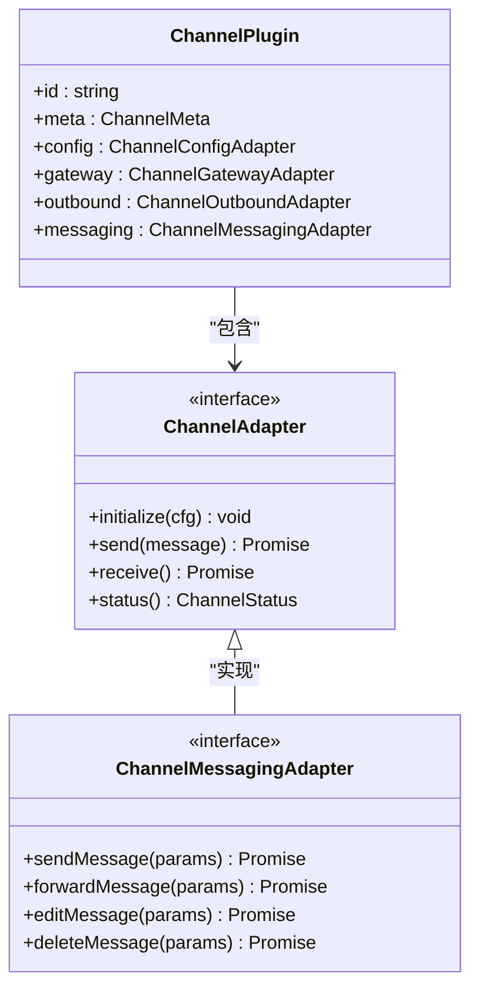

**图表来源**
- [src/channels/plugins/types.ts:7-66](file://src/channels/plugins/types.ts#L7-L66)

**章节来源**
- [src/channels/plugins/types.ts:1-66](file://src/channels/plugins/types.ts#L1-L66)
- [src/channels/plugins/helpers.ts:1-59](file://src/channels/plugins/helpers.ts#L1-L59)

## 依赖关系分析

聊天模块的依赖关系呈现清晰的层次结构：

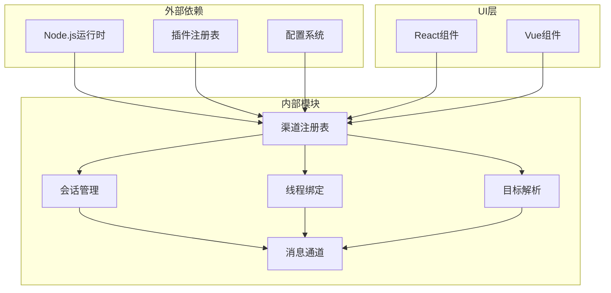

**图表来源**
- [src/channels/registry.ts:1-7](file://src/channels/registry.ts#L1-L7)
- [src/utils/message-channel.ts:95-133](file://src/utils/message-channel.ts#L95-L133)

**章节来源**
- [src/channels/registry.ts:1-7](file://src/channels/registry.ts#L1-L7)
- [src/utils/message-channel.ts:95-133](file://src/utils/message-channel.ts#L95-L133)

## 性能考虑

聊天模块在设计时充分考虑了性能优化：

### 内存管理
- 使用弱引用和缓存机制减少内存占用
- 按需加载渠道插件，避免不必要的初始化
- 实现连接池管理，复用网络连接

### 并发处理
- 异步消息处理，支持高并发场景
- 消息队列机制，保证消息有序处理
- 超时控制，防止阻塞操作影响整体性能

### 缓存策略
- 会话状态缓存，减少磁盘I/O
- 渠道元数据缓存，提高查询效率
- 配置参数缓存，降低配置解析开销

## 故障排除指南

### 常见问题诊断

**渠道连接问题**
- 检查渠道认证配置是否正确
- 验证网络连接和防火墙设置
- 查看渠道API限制和配额情况

**消息路由问题**
- 确认会话键的唯一性和一致性
- 检查目标解析规则是否匹配
- 验证线程绑定状态是否正常

**性能问题**
- 监控内存使用情况和垃圾回收
- 分析消息处理延迟
- 检查数据库连接池状态

### 调试工具

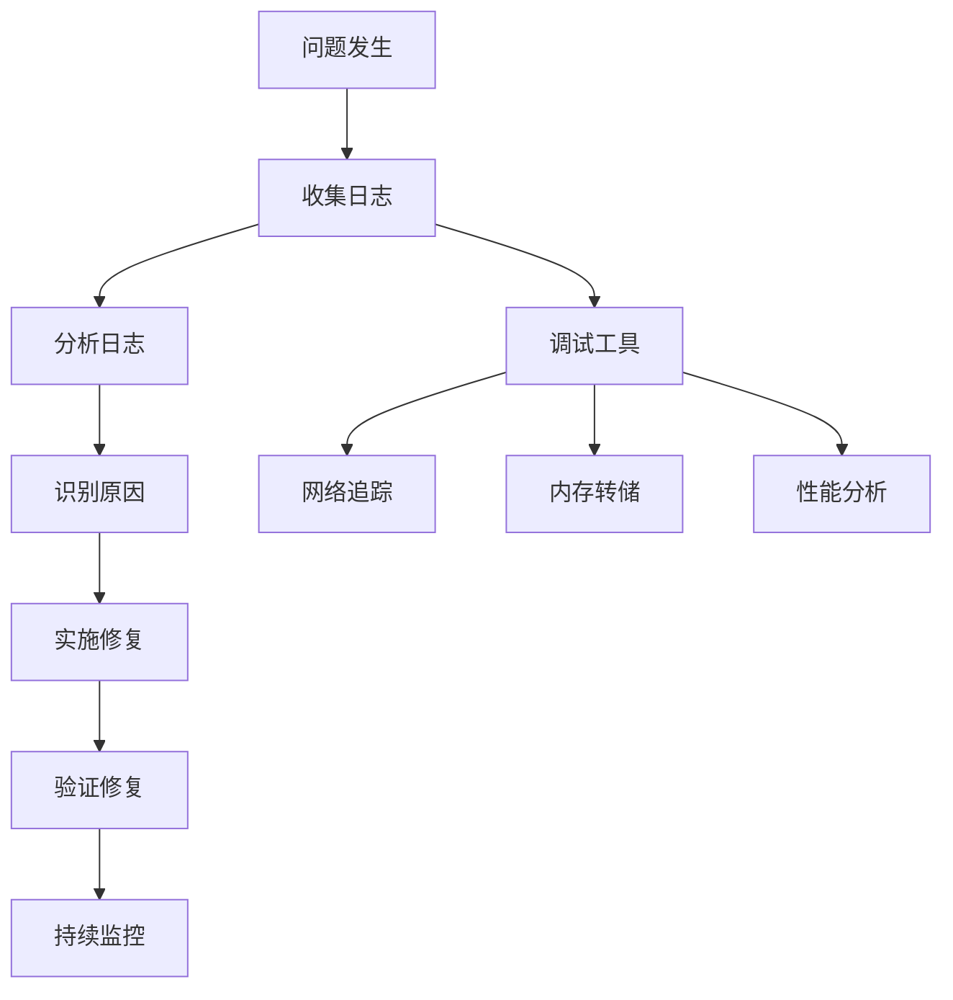

**章节来源**
- [src/channels/session.ts:26-39](file://src/channels/session.ts#L26-L39)
- [src/channels/thread-bindings-messages.ts:178-201](file://src/channels/thread-bindings-messages.ts#L178-L201)

## 结论

OpenClaw聊天模块通过其模块化设计和插件架构，为多渠道消息传递提供了强大而灵活的解决方案。系统的核心优势包括：

1. **统一抽象**：通过标准化接口处理不同渠道的差异
2. **可扩展性**：插件系统支持新渠道的快速集成
3. **智能化管理**：会话绑定和路由机制提供智能消息处理
4. **性能优化**：多层次的缓存和异步处理机制
5. **用户体验**：直观的UI界面和丰富的配置选项

该模块为构建复杂的多渠道通信应用奠定了坚实的基础，既满足了当前的需求，也为未来的扩展预留了充足的空间。