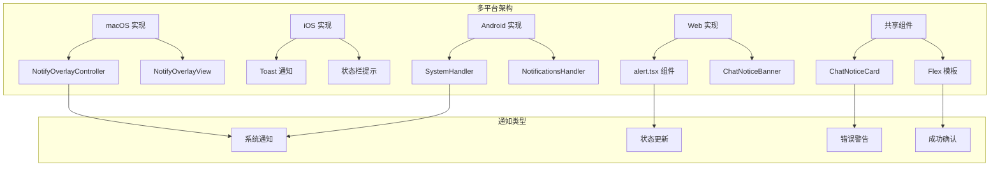
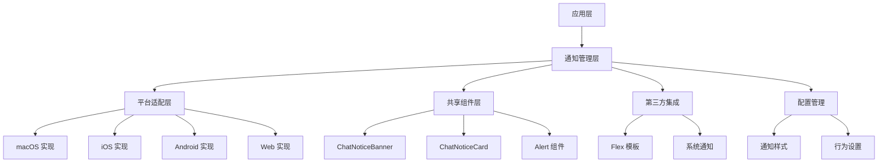
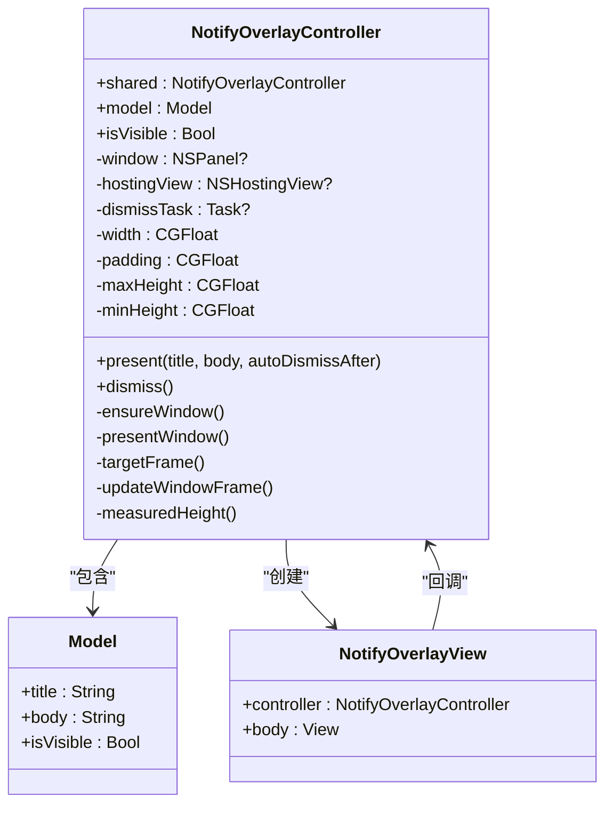
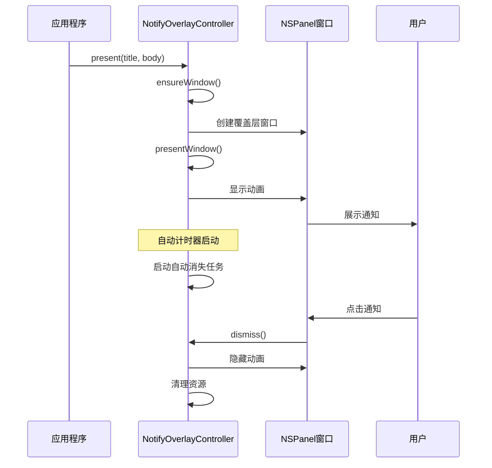
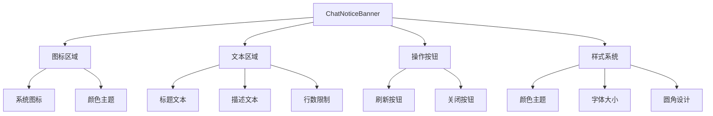
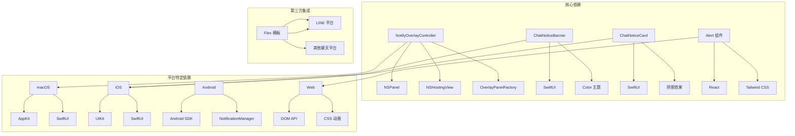
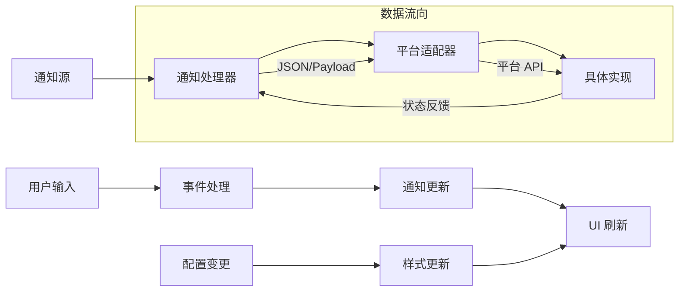

# 警告提示组件

<cite>
**本文档引用的文件**
- [NotifyOverlay.swift](file://apps/macos/Sources/OpenClaw/NotifyOverlay.swift)
- [ChatView.swift](file://apps/shared/OpenClawKit/Sources/OpenClawChatUI/ChatView.swift)
- [alert.tsx](file://ui-react/src/components/ui/alert.tsx)
- [basic-cards.ts](file://src/line/flex-templates/basic-cards.ts)
- [MacNodeRuntime.swift](file://apps/macos/Sources/OpenClaw/NodeMode/MacNodeRuntime.swift)
- [SystemHandler.kt](file://apps/android/app/src/main/java/ai/openclaw/app/node/SystemHandler.kt)
- [NotificationsHandler.kt](file://apps/android/app/src/main/java/ai/openclaw/app/node/NotificationsHandler.kt)
</cite>

## 目录

1. [简介](#简介)
2. [项目结构](#项目结构)
3. [核心组件](#核心组件)
4. [架构概览](#架构概览)
5. [详细组件分析](#详细组件分析)
6. [依赖关系分析](#依赖关系分析)
7. [性能考虑](#性能考虑)
8. [故障排除指南](#故障排除指南)
9. [结论](#结论)

## 简介

警告提示组件是 OpenClaw 项目中用于向用户传达重要信息、状态更新和系统通知的核心 UI 组件。该组件在多个平台（macOS、iOS、Android、Web）上提供了一致的用户体验，支持多种通知类型和交互方式。

该组件系统包括三种主要类型的通知显示方式：

- **轻量级覆盖层通知**：用于系统级通知和状态更新
- **聊天界面横幅**：用于对话场景中的信息提示
- **Flex 模板通知**：用于第三方平台的消息格式化

## 项目结构

OpenClaw 的警告提示组件采用跨平台架构设计，每个平台都有专门的实现：

**图表来源**

- [NotifyOverlay.swift:1-154](file://apps/macos/Sources/OpenClaw/NotifyOverlay.swift#L1-L154)
- [ChatView.swift:496-592](file://apps/shared/OpenClawKit/Sources/OpenClawChatUI/ChatView.swift#L496-L592)
- [alert.tsx:1-60](file://ui-react/src/components/ui/alert.tsx#L1-L60)

## 核心组件

### macOS 轻量级覆盖层通知

NotifyOverlayController 是 macOS 平台的核心通知控制器，提供了轻量级的覆盖层通知功能。

**关键特性：**

- **自动定位**：智能计算屏幕位置，避免遮挡
- **动画效果**：平滑的显示和隐藏动画
- **自动消失**：可配置的自动关闭时间
- **响应式布局**：根据内容动态调整尺寸

**图表来源**

- [NotifyOverlay.swift:9-124](file://apps/macos/Sources/OpenClaw/NotifyOverlay.swift#L9-L124)

### 聊天界面通知组件

OpenClawKit 提供了两种聊天界面通知组件：

**ChatNoticeBanner（横幅通知）**

- 适用于对话界面的状态提示
- 支持刷新和关闭操作
- 响应式设计，适配不同屏幕尺寸

**ChatNoticeCard（卡片通知）**

- 适用于重要信息的突出显示
- 支持操作按钮和视觉层次
- 圆角设计和阴影效果

**图表来源**

- [ChatView.swift:542-592](file://apps/shared/OpenClawKit/Sources/OpenClawChatUI/ChatView.swift#L542-L592)
- [ChatView.swift:496-540](file://apps/shared/OpenClawKit/Sources/OpenClawChatUI/ChatView.swift#L496-L540)

### Web 平台通知组件

**Alert 组件**
基于 React 和 Tailwind CSS 构建，提供语义化的警告提示功能。

**关键变体：**

- **默认样式**：标准信息提示
- **破坏性样式**：错误和危险状态

**图表来源**

- [alert.tsx:21-59](file://ui-react/src/components/ui/alert.tsx#L21-L59)

### 第三方平台通知模板

**Flex 模板通知**
为 LINE 等第三方平台提供标准化的通知格式。

**支持的通知类型：**

- 信息通知（蓝色主题）
- 成功通知（绿色主题）
- 警告通知（黄色主题）
- 错误通知（红色主题）

**图表来源**

- [basic-cards.ts:325-396](file://src/line/flex-templates/basic-cards.ts#L325-L396)

## 架构概览

OpenClaw 的警告提示组件采用分层架构设计，确保跨平台一致性和可维护性：

**图表来源**

- [NotifyOverlay.swift:1-154](file://apps/macos/Sources/OpenClaw/NotifyOverlay.swift#L1-L154)
- [ChatView.swift:496-592](file://apps/shared/OpenClawKit/Sources/OpenClawChatUI/ChatView.swift#L496-L592)
- [alert.tsx:1-60](file://ui-react/src/components/ui/alert.tsx#L1-L60)

## 详细组件分析

### macOS 通知控制器分析

NotifyOverlayController 是整个通知系统的核心控制器，实现了以下关键功能：

#### 类结构图

**图表来源**

- [NotifyOverlay.swift:9-153](file://apps/macos/Sources/OpenClaw/NotifyOverlay.swift#L9-L153)

#### 核心功能实现

**自动定位算法**
控制器使用智能算法计算最佳显示位置：

- 获取主屏幕可见区域
- 计算内容高度和宽度
- 应用边距和间距规则
- 避免与其他 UI 元素冲突

**动画管理系统**

- 使用异步任务管理自动消失
- 支持平滑的显示和隐藏动画
- 处理用户交互事件
- 内存资源的正确释放

**图表来源**

- [NotifyOverlay.swift:90-123](file://apps/macos/Sources/OpenClaw/NotifyOverlay.swift#L90-L123)

### 跨平台通知接口

#### 通知类型定义

| 通知类型 | 颜色主题       | 使用场景 | 视觉特征   |
| -------- | -------------- | -------- | ---------- |
| Info     | 蓝色 (#3B82F6) | 一般信息 | 蓝色侧边栏 |
| Success  | 绿色 (#06C755) | 成功操作 | 绿色背景   |
| Warning  | 黄色 (#F59E0B) | 警告信息 | 黄色背景   |
| Error    | 红色 (#EF4444) | 错误状态 | 红色强调   |

**图表来源**

- [basic-cards.ts:334-339](file://src/line/flex-templates/basic-cards.ts#L334-L339)

#### 通知生命周期

**图表来源**

- [NotifyOverlay.swift:32-56](file://apps/macos/Sources/OpenClaw/NotifyOverlay.swift#L32-L56)

### Web 平台组件分析

#### Alert 组件架构

Alert 组件基于 React 构建，使用 Tailwind CSS 进行样式控制：

**组件结构**

- **Alert**：主容器组件
- **AlertTitle**：标题文本
- **AlertDescription**：描述文本

**样式变体系统**
组件使用 `class-variance-authority` 实现灵活的样式变体：

**图表来源**

- [alert.tsx:5-19](file://ui-react/src/components/ui/alert.tsx#L5-L19)

### 聊天界面通知组件

#### ChatNoticeBanner 组件

**图表来源**

- [ChatView.swift:542-592](file://apps/shared/OpenClawKit/Sources/OpenClawChatUI/ChatView.swift#L542-L592)

## 依赖关系分析

### 组件间依赖关系

**图表来源**

- [NotifyOverlay.swift:1-5](file://apps/macos/Sources/OpenClaw/NotifyOverlay.swift#L1-L5)
- [ChatView.swift:1-5](file://apps/shared/OpenClawKit/Sources/OpenClawChatUI/ChatView.swift#L1-L5)
- [alert.tsx:1-3](file://ui-react/src/components/ui/alert.tsx#L1-L3)

### 数据流分析

#### 通知数据流

**图表来源**

- [MacNodeRuntime.swift:775](file://apps/macos/Sources/OpenClaw/NodeMode/MacNodeRuntime.swift#L775)
- [SystemHandler.kt:105-138](file://apps/android/app/src/main/java/ai/openclaw/app/node/SystemHandler.kt#L105-L138)

## 性能考虑

### 内存管理优化

**macOS 实现的内存优化策略：**

- 使用弱引用避免循环引用
- 及时清理定时器和任务
- 合理的视图层级管理
- 资源使用后的及时释放

**Web 实现的性能优化：**

- React 组件的合理拆分
- 条件渲染减少不必要的更新
- CSS 动画的硬件加速
- 事件委托减少监听器数量

### 渲染性能优化

**响应式设计优化：**

- 自适应布局减少重排
- 文本换行和截断优化
- 图标和样式的缓存机制
- 动画帧率的控制

**平台特定优化：**

- iOS 的视差滚动优化
- Android 的硬件加速利用
- Web 的 GPU 加速启用

## 故障排除指南

### 常见问题诊断

#### macOS 通知不显示

**可能原因：**

- 权限不足导致的通知权限被拒绝
- 窗口层级设置问题
- 屏幕边界计算错误

**解决方案：**

- 检查通知权限设置
- 验证窗口层级配置
- 调试屏幕边界计算逻辑

#### Web 组件样式异常

**可能原因：**

- CSS 样式冲突
- Tailwind 配置问题
- 浏览器兼容性问题

**解决方案：**

- 检查样式优先级
- 验证 Tailwind 配置
- 测试不同浏览器兼容性

#### 跨平台一致性问题

**诊断步骤：**

1. 比较各平台的实现差异
2. 检查平台特定的 API 使用
3. 验证响应式设计的一致性
4. 测试不同设备和分辨率

**图表来源**

- [NotifyOverlay.swift:48-56](file://apps/macos/Sources/OpenClaw/NotifyOverlay.swift#L48-L56)
- [alert.tsx:21-34](file://ui-react/src/components/ui/alert.tsx#L21-L34)

### 调试工具和方法

**macOS 调试：**

- 使用调试器检查窗口层级
- 监控内存使用情况
- 验证动画性能

**Web 调试：**

- Chrome DevTools 分析样式
- React DevTools 检查组件树
- 性能面板分析渲染时间

## 结论

OpenClaw 的警告提示组件展现了优秀的跨平台设计和实现。通过模块化架构和平台适配层，该组件系统在保持功能一致性的同时，充分利用了各平台的特性和优势。

**主要优势：**

- **跨平台一致性**：统一的用户体验和交互模式
- **模块化设计**：清晰的组件分离和职责划分
- **性能优化**：针对各平台的特定优化策略
- **可扩展性**：易于添加新的通知类型和平台支持

**未来改进方向：**

- 增强国际化支持
- 优化无障碍访问功能
- 扩展更多通知样式和动画效果
- 改进性能监控和分析工具

该组件系统为 OpenClaw 项目提供了坚实的基础，支持从简单信息提示到复杂状态管理的各种需求场景。
