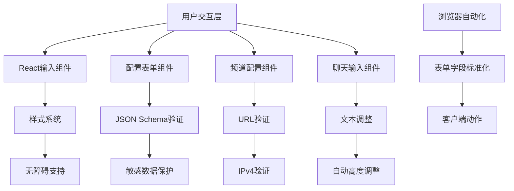
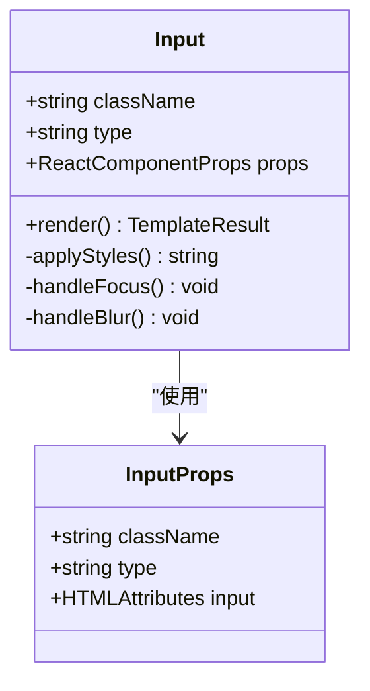
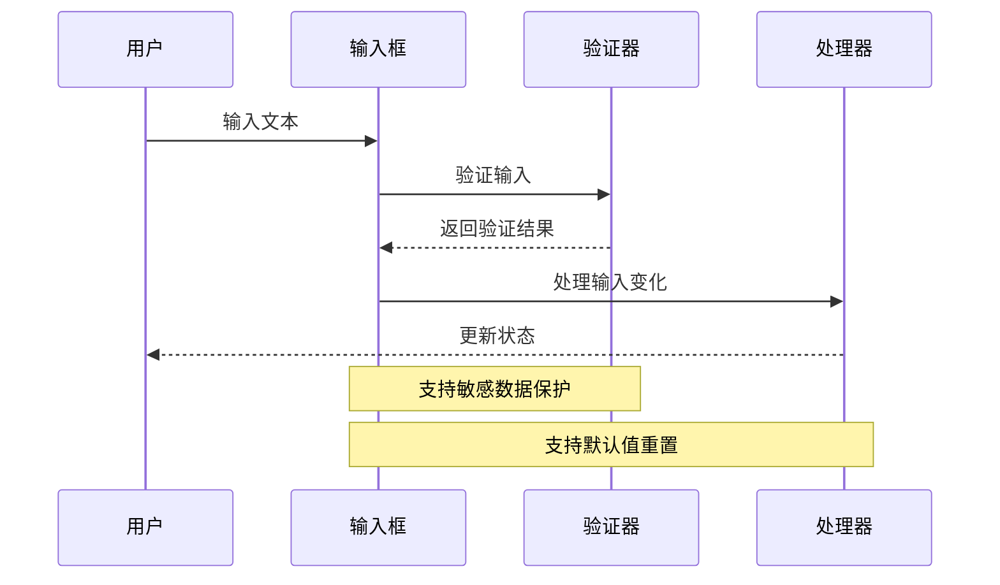
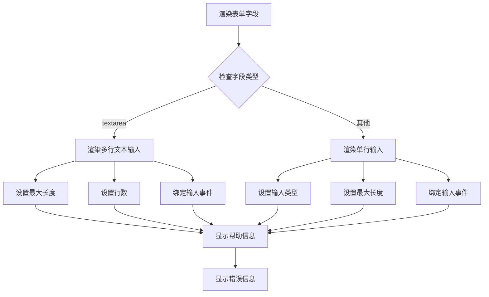
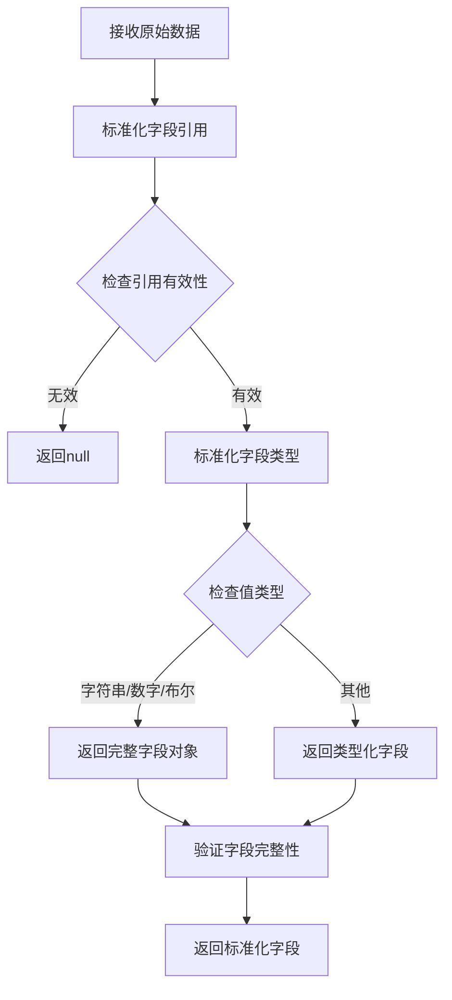
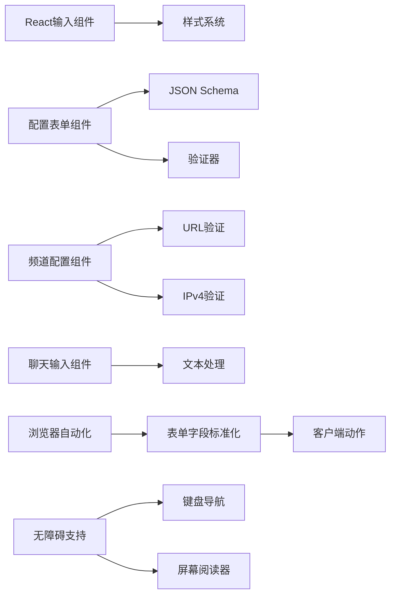

# 输入框组件

<cite>
**本文档引用的文件**
- [input.tsx](file://ui-react/src/components/ui/input.tsx)
- [config-form.node.ts](file://ui/src/ui/views/config-form.node.ts)
- [channels.nostr-profile-form.ts](file://ui/src/ui/views/channels.nostr-profile-form.ts)
- [form-fields.ts](file://src/browser/form-fields.ts)
- [ipv4.ts](file://src/shared/net/ipv4.ts)
- [chat.ts](file://ui/src/ui/views/chat.ts)
</cite>

## 目录

1. [简介](#简介)
2. [项目结构](#项目结构)
3. [核心组件](#核心组件)
4. [架构概览](#架构概览)
5. [详细组件分析](#详细组件分析)
6. [依赖关系分析](#依赖关系分析)
7. [性能考虑](#性能考虑)
8. [故障排除指南](#故障排除指南)
9. [结论](#结论)

## 简介

输入框组件是OpenClaw项目中用户界面的重要组成部分，负责处理各种类型的用户输入数据。该项目提供了多种输入框实现，包括React基础输入组件、配置表单输入框、频道配置输入框以及浏览器自动化输入字段等。

这些输入框组件具有以下特点：

- 支持多种输入类型（文本、数字、密码、URL等）
- 内置验证和错误处理机制
- 响应式设计和无障碍访问支持
- 统一的样式系统和用户体验
- 类型安全的TypeScript实现

## 项目结构

OpenClaw项目的输入框组件分布在多个目录中：

```mermaid
graph TB
subgraph "前端UI层"
A[ui-react/] --> B[input.tsx]
C[ui/src/ui/views/] --> D[config-form.node.ts]
C --> E[channels.nostr-profile-form.ts]
C --> F[chat.ts]
end
subgraph "共享功能层"
G[src/browser/] --> H[form-fields.ts]
I[src/shared/net/] --> J[ipv4.ts]
end
subgraph "应用层"
K[apps/] --> L[electron/]
M[apps/android/] --> N[]
O[apps/ios/] --> P[]
end
B --> D
D --> H
E --> J
```

**图表来源**

- [input.tsx:1-21](file://ui-react/src/components/ui/input.tsx#L1-L21)
- [config-form.node.ts:532-608](file://ui/src/ui/views/config-form.node.ts#L532-L608)
- [channels.nostr-profile-form.ts:90-139](file://ui/src/ui/views/channels.nostr-profile-form.ts#L90-L139)

**章节来源**

- [input.tsx:1-21](file://ui-react/src/components/ui/input.tsx#L1-L21)
- [config-form.node.ts:532-608](file://ui/src/ui/views/config-form.node.ts#L532-L608)
- [channels.nostr-profile-form.ts:90-139](file://ui/src/ui/views/channels.nostr-profile-form.ts#L90-L139)

## 核心组件

### React基础输入组件

React输入组件提供了一个简洁的基础输入框实现，支持多种输入类型和样式定制。

**章节来源**

- [input.tsx:1-21](file://ui-react/src/components/ui/input.tsx#L1-L21)

### 配置表单输入组件

配置表单输入组件专门用于处理复杂的配置参数，支持敏感数据保护和默认值管理。

**章节来源**

- [config-form.node.ts:532-608](file://ui/src/ui/views/config-form.node.ts#L532-L608)

### 频道配置输入组件

频道配置输入组件用于特定渠道的配置，如Nostr频道的个人资料设置。

**章节来源**

- [channels.nostr-profile-form.ts:90-139](file://ui/src/ui/views/channels.nostr-profile-form.ts#L90-L139)

## 架构概览

输入框组件的整体架构采用分层设计，从底层的浏览器自动化到上层的用户界面组件：



**图表来源**

- [input.tsx:1-21](file://ui-react/src/components/ui/input.tsx#L1-L21)
- [config-form.node.ts:532-608](file://ui/src/ui/views/config-form.node.ts#L532-L608)
- [channels.nostr-profile-form.ts:90-139](file://ui/src/ui/views/channels.nostr-profile-form.ts#L90-L139)
- [form-fields.ts:1-32](file://src/browser/form-fields.ts#L1-L32)
- [ipv4.ts:1-16](file://src/shared/net/ipv4.ts#L1-L16)

## 详细组件分析

### React输入组件分析

React输入组件是一个轻量级的输入框实现，提供了统一的样式和行为：



**图表来源**

- [input.tsx:4-18](file://ui-react/src/components/ui/input.tsx#L4-L18)

**章节来源**

- [input.tsx:1-21](file://ui-react/src/components/ui/input.tsx#L1-L21)

### 配置表单输入组件分析

配置表单输入组件支持多种输入类型和高级功能：



**图表来源**

- [config-form.node.ts:532-608](file://ui/src/ui/views/config-form.node.ts#L532-L608)

**章节来源**

- [config-form.node.ts:532-608](file://ui/src/ui/views/config-form.node.ts#L532-L608)

### 频道配置输入组件分析

频道配置输入组件专门处理特定渠道的配置需求：



**图表来源**

- [channels.nostr-profile-form.ts:90-139](file://ui/src/ui/views/channels.nostr-profile-form.ts#L90-L139)

**章节来源**

- [channels.nostr-profile-form.ts:90-139](file://ui/src/ui/views/channels.nostr-profile-form.ts#L90-L139)

### 浏览器自动化输入组件分析

浏览器自动化输入组件处理复杂的表单字段标准化：



**图表来源**

- [form-fields.ts:22-32](file://src/browser/form-fields.ts#L22-L32)

**章节来源**

- [form-fields.ts:1-32](file://src/browser/form-fields.ts#L1-L32)

## 依赖关系分析

输入框组件之间的依赖关系如下：



**图表来源**

- [input.tsx:1-21](file://ui-react/src/components/ui/input.tsx#L1-L21)
- [config-form.node.ts:532-608](file://ui/src/ui/views/config-form.node.ts#L532-L608)
- [channels.nostr-profile-form.ts:90-139](file://ui/src/ui/views/channels.nostr-profile-form.ts#L90-L139)
- [form-fields.ts:1-32](file://src/browser/form-fields.ts#L1-L32)
- [ipv4.ts:1-16](file://src/shared/net/ipv4.ts#L1-L16)

**章节来源**

- [input.tsx:1-21](file://ui-react/src/components/ui/input.tsx#L1-L21)
- [config-form.node.ts:532-608](file://ui/src/ui/views/config-form.node.ts#L532-L608)
- [channels.nostr-profile-form.ts:90-139](file://ui/src/ui/views/channels.nostr-profile-form.ts#L90-L139)
- [form-fields.ts:1-32](file://src/browser/form-fields.ts#L1-L32)
- [ipv4.ts:1-16](file://src/shared/net/ipv4.ts#L1-L16)

## 性能考虑

输入框组件在设计时考虑了以下性能因素：

1. **事件处理优化**：使用防抖和节流技术减少频繁更新
2. **虚拟化支持**：对于大量输入场景提供虚拟化选项
3. **内存管理**：及时清理事件监听器和DOM引用
4. **渲染优化**：使用React.memo避免不必要的重新渲染
5. **懒加载**：按需加载大型输入组件

## 故障排除指南

### 常见问题及解决方案

1. **输入验证失败**
   - 检查输入格式是否符合要求
   - 验证必填字段是否已填写
   - 确认数据类型是否正确

2. **样式显示异常**
   - 检查CSS类名是否正确
   - 验证主题变量是否定义
   - 确认响应式断点设置

3. **事件处理问题**
   - 检查事件监听器是否正确绑定
   - 验证事件处理器的执行上下文
   - 确认异步操作的正确处理

**章节来源**

- [ipv4.ts:1-16](file://src/shared/net/ipv4.ts#L1-L16)
- [config-form.node.ts:532-608](file://ui/src/ui/views/config-form.node.ts#L532-L608)

## 结论

OpenClaw项目的输入框组件展现了现代Web应用的最佳实践，通过模块化设计、类型安全和丰富的功能集，为用户提供了一致且可靠的输入体验。组件架构清晰，易于扩展和维护，同时充分考虑了性能和可访问性要求。

未来可以进一步优化的方向包括：

- 增强移动端适配
- 扩展输入类型支持
- 优化大数量数据处理
- 加强国际化支持
