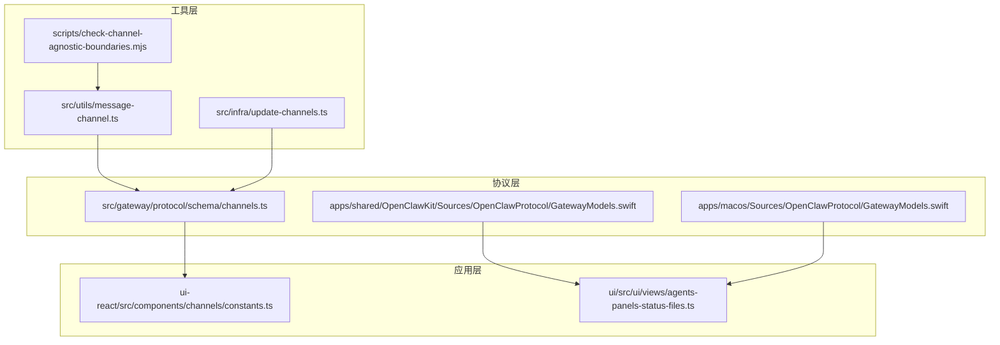
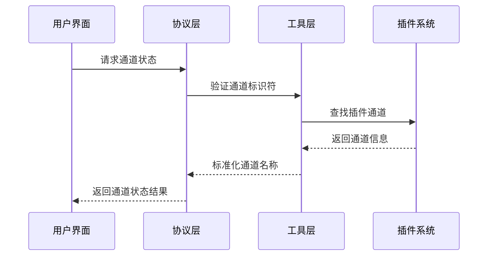
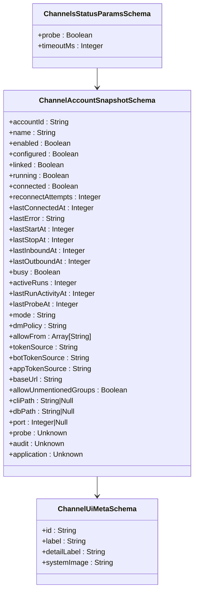
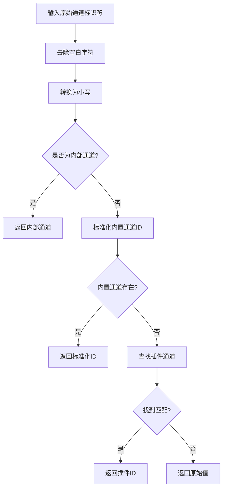
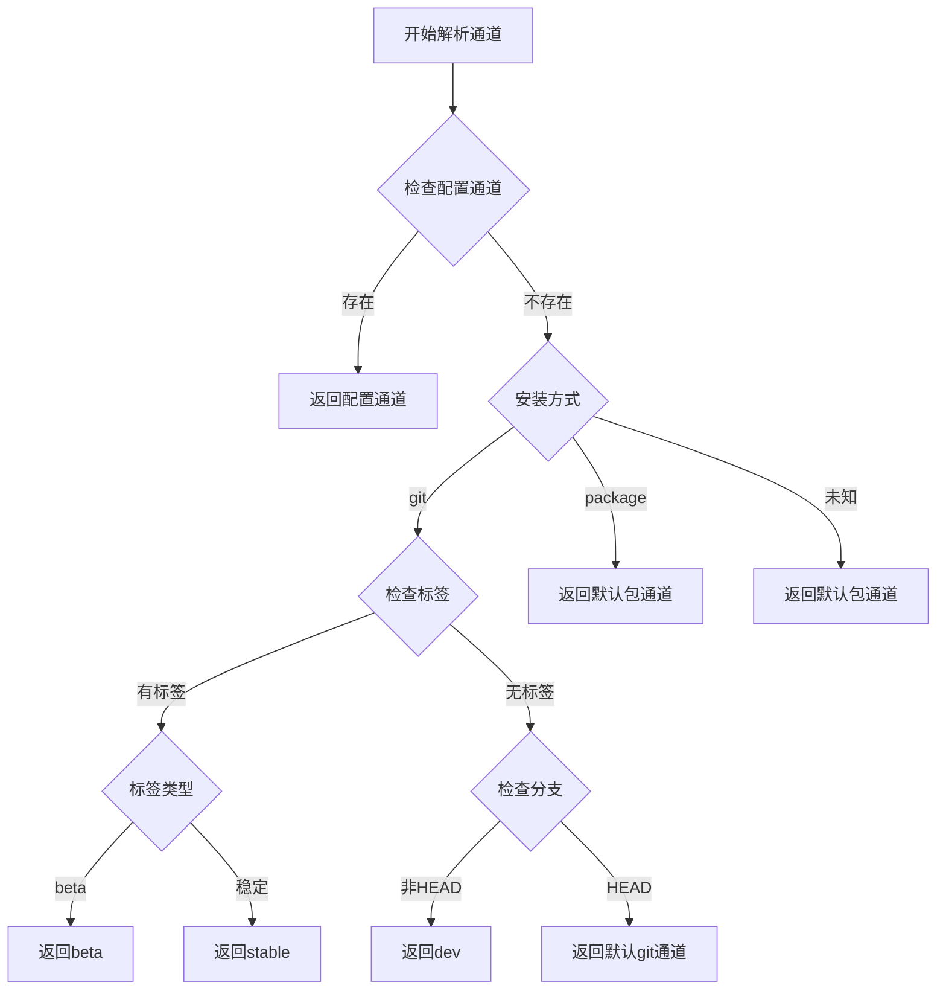
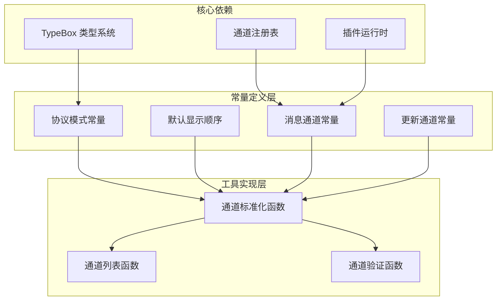

# 通道常量定义

<cite>
**本文档引用的文件**
- [channels.ts](file://src/gateway/protocol/schema/channels.ts)
- [constants.ts](file://ui-react/src/components/channels/constants.ts)
- [message-channel.ts](file://src/utils/message-channel.ts)
- [update-channels.ts](file://src/infra/update-channels.ts)
- [channels.ts](file://ui/src/ui/views/agents-panels-status-files.ts)
- [channels.ts](file://apps/shared/OpenClawKit/Sources/OpenClawProtocol/GatewayModels.swift)
- [channels.ts](file://apps/macos/Sources/OpenClawProtocol/GatewayModels.swift)
- [channels.ts](file://scripts/check-channel-agnostic-boundaries.mjs)
</cite>

## 目录
1. [简介](#简介)
2. [项目结构](#项目结构)
3. [核心组件](#核心组件)
4. [架构概览](#架构概览)
5. [详细组件分析](#详细组件分析)
6. [依赖关系分析](#依赖关系分析)
7. [性能考虑](#性能考虑)
8. [故障排除指南](#故障排除指南)
9. [结论](#结论)

## 简介

本文档全面分析了 OpenClaw 项目中的通道常量定义系统。通道常量是消息传递系统的核心配置元素，定义了支持的消息通道类型、默认显示顺序、协议规范以及相关的行为约束。该系统涵盖了从底层协议定义到用户界面展示的完整链路。

OpenClaw 是一个开源的多平台消息代理系统，支持多种通信渠道（如 Discord、Telegram、Slack 等）的集成。通道常量定义确保了系统的可扩展性和一致性，为开发者提供了清晰的接口规范和最佳实践指导。

## 项目结构

OpenClaw 项目采用模块化架构设计，通道常量定义分布在多个层次中：



**图表来源**
- [channels.ts:1-241](file://src/gateway/protocol/schema/channels.ts#L1-L241)
- [constants.ts:1-17](file://ui-react/src/components/channels/constants.ts#L1-L17)
- [message-channel.ts:1-149](file://src/utils/message-channel.ts#L1-L149)

## 核心组件

### 协议级通道常量

通道协议定义位于 `src/gateway/protocol/schema/channels.ts` 文件中，包含了完整的 TypeBox 模式定义：

- **通道状态参数模式**：定义了 `ChannelsStatusParamsSchema`，包含探测标志和超时参数
- **通道账户快照模式**：定义了 `ChannelAccountSnapshotSchema`，描述账户的完整状态信息
- **通道元数据模式**：定义了 `ChannelUiMetaSchema`，提供用户界面友好的标签和图标信息
- **通道启用参数模式**：定义了 `ChannelsEnableParamsSchema` 和 `ChannelsEnableResultSchema`

### 默认通道显示顺序

UI 层的默认通道顺序定义在 `ui-react/src/components/channels/constants.ts` 中：

```typescript
export const DEFAULT_CHANNEL_ORDER = [
  "feishu",
  "openclaw-weixin", 
  "whatsapp",
  "telegram",
  "discord",
  "googlechat",
  "slack",
  "signal",
  "imessage",
  "nostr",
] as const;
```

这个顺序反映了项目文档中记录的核心内置通道，并作为网关快照未提供元数据时的回退显示顺序。

### 消息通道工具常量

消息通道处理工具 `src/utils/message-channel.ts` 定义了多个重要常量：

- **内部消息通道**：`INTERNAL_MESSAGE_CHANNEL = "webchat"`
- **Markdown 支持通道集合**：包含 Slack、Telegram、Signal、Discord、Google Chat、TUI 和 Webchat
- **网关客户端模式**：定义了 CLI 和 WEBCHAT 模式的标准化

**章节来源**
- [channels.ts:95-184](file://src/gateway/protocol/schema/channels.ts#L95-L184)
- [constants.ts:1-17](file://ui-react/src/components/channels/constants.ts#L1-L17)
- [message-channel.ts:17-28](file://src/utils/message-channel.ts#L17-L28)

## 架构概览

通道常量系统采用分层架构设计，确保了跨平台兼容性和类型安全：



**图表来源**
- [channels.ts:105-141](file://src/gateway/protocol/schema/channels.ts#L105-L141)
- [message-channel.ts:55-77](file://src/utils/message-channel.ts#L55-L77)

## 详细组件分析

### 通道协议模式定义

通道协议使用 TypeBox 库进行严格的类型验证，确保数据传输的一致性：



**图表来源**
- [channels.ts:95-166](file://src/gateway/protocol/schema/channels.ts#L95-L166)

### 通道工具函数体系

消息通道工具提供了完整的通道识别和标准化功能：



**图表来源**
- [message-channel.ts:55-77](file://src/utils/message-channel.ts#L55-L77)

**章节来源**
- [channels.ts:1-241](file://src/gateway/protocol/schema/channels.ts#L1-L241)
- [message-channel.ts:55-149](file://src/utils/message-channel.ts#L55-L149)

### 更新通道管理

更新通道系统提供了灵活的版本控制机制：

| 通道类型 | 默认值 | NPM 标签映射 |
|---------|--------|-------------|
| stable | "stable" | "latest" |
| beta | "beta" | "beta" |
| dev | "dev" | "dev" |

通道解析逻辑根据安装方式和配置动态确定有效通道：



**图表来源**
- [update-channels.ts:37-63](file://src/infra/update-channels.ts#L37-L63)

**章节来源**
- [update-channels.ts:1-110](file://src/infra/update-channels.ts#L1-L110)

## 依赖关系分析

通道常量系统展现了清晰的依赖层次结构：



**图表来源**
- [channels.ts:1-3](file://src/gateway/protocol/schema/channels.ts#L1-L3)
- [message-channel.ts:1-15](file://src/utils/message-channel.ts#L1-L15)

**章节来源**
- [channels.ts:1-241](file://src/gateway/protocol/schema/channels.ts#L1-L241)
- [message-channel.ts:1-149](file://src/utils/message-channel.ts#L1-L149)

## 性能考虑

通道常量系统在设计时充分考虑了性能优化：

1. **常量预计算**：所有通道标识符都预先定义为常量，避免运行时重复计算
2. **集合查找优化**：使用 Set 数据结构进行 O(1) 时间复杂度的通道存在性检查
3. **延迟加载**：插件通道信息仅在需要时通过运行时注册表获取
4. **类型缓存**：TypeBox 模式在编译时进行类型检查，运行时无需额外验证开销

## 故障排除指南

### 常见问题及解决方案

**问题1：通道标识符标准化失败**
- 检查输入字符串是否为空或只包含空白字符
- 验证通道是否存在于内置通道注册表中
- 确认插件系统是否正确初始化

**问题2：默认显示顺序不正确**
- 确认网关快照是否提供了有效的 `channelMeta` 或 `channelOrder`
- 检查 `DEFAULT_CHANNEL_ORDER` 常量是否与文档保持同步
- 验证 UI 组件是否正确处理回退逻辑

**问题3：插件通道无法识别**
- 检查插件注册表是否正确加载
- 验证插件的 `meta.aliases` 配置
- 确认插件 ID 的大小写敏感性处理

**章节来源**
- [message-channel.ts:55-77](file://src/utils/message-channel.ts#L55-L77)
- [channels.ts:1-17](file://ui-react/src/components/channels/constants.ts#L1-L17)

## 结论

OpenClaw 项目的通道常量定义系统展现了优秀的软件工程实践：

1. **类型安全**：通过 TypeBox 实现严格的运行时类型验证
2. **可扩展性**：支持内置通道和插件通道的统一管理
3. **跨平台兼容**：Swift 和 TypeScript 版本的协议模型保持一致
4. **性能优化**：合理的数据结构选择和算法设计
5. **维护性**：清晰的模块划分和依赖关系

该系统为 OpenClaw 的多通道消息传递能力奠定了坚实的基础，为未来的功能扩展和平台移植提供了良好的架构支撑。