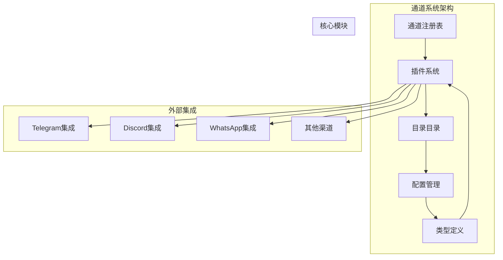
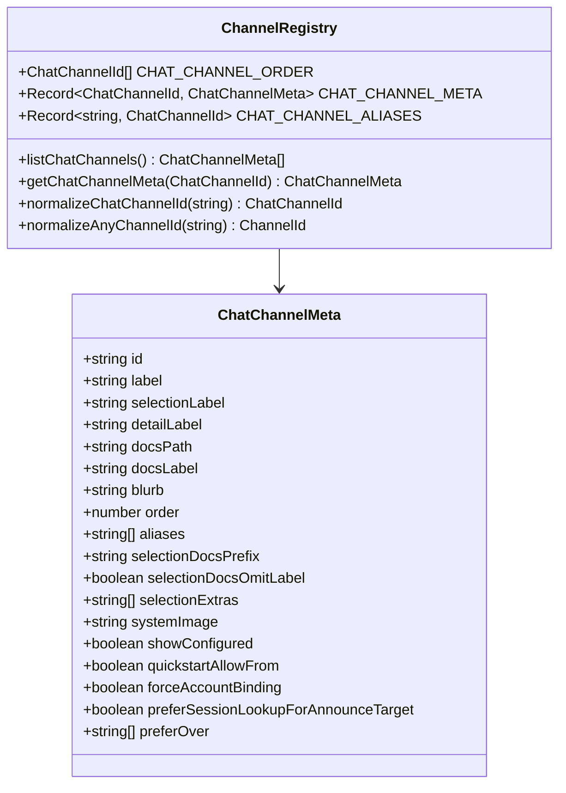
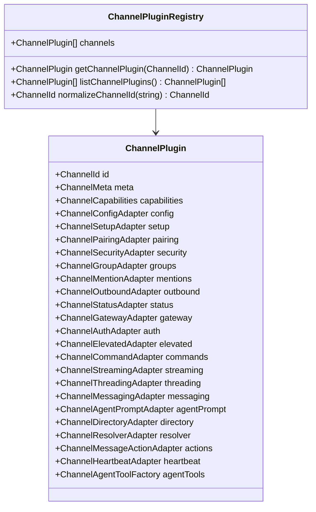
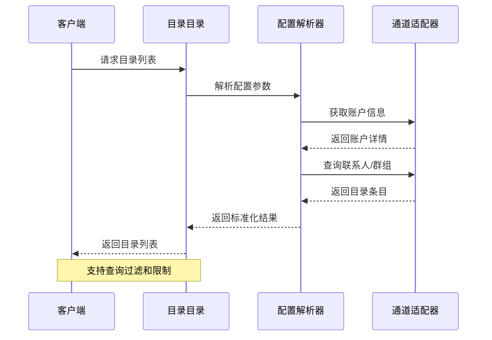
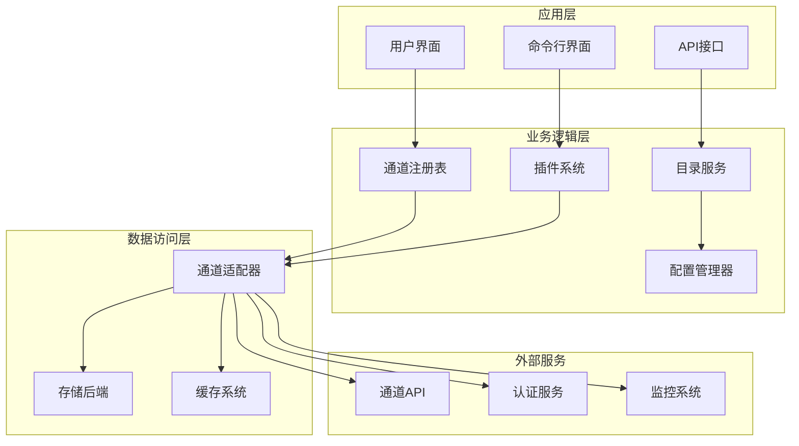
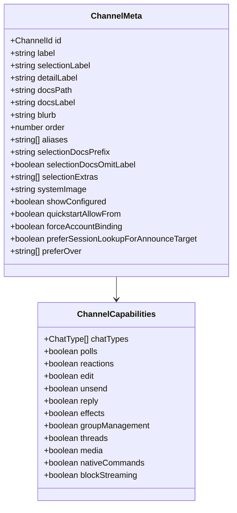
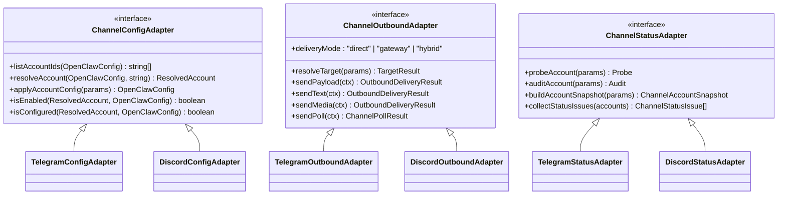
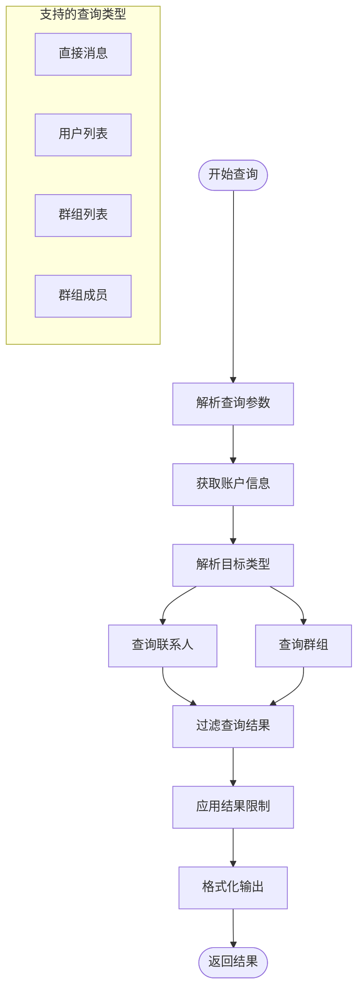
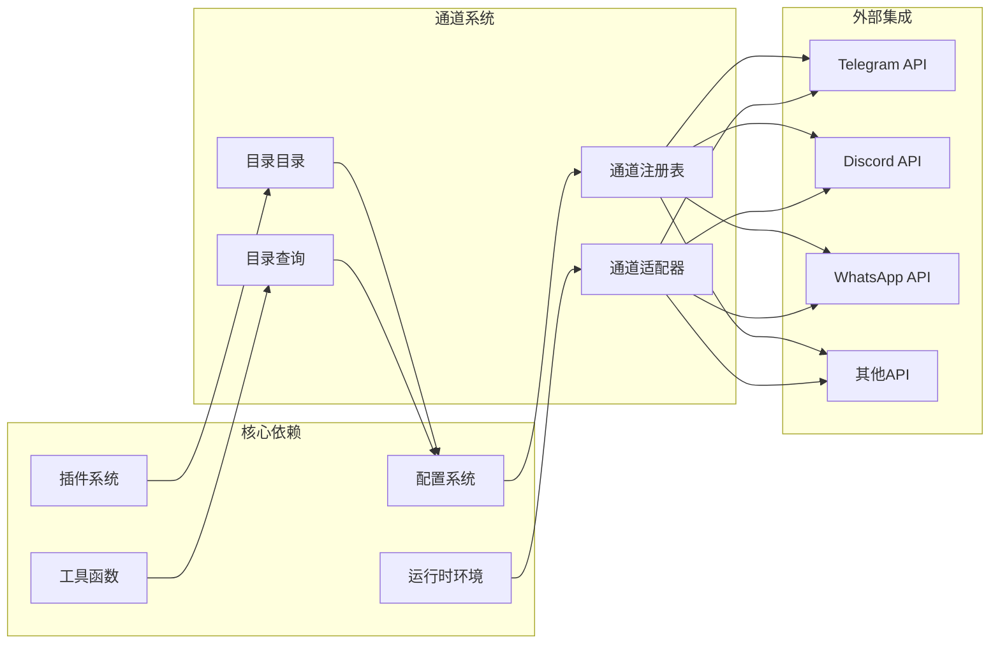

# 通道目录管理系统

<cite>
**本文档引用的文件**
- [registry.ts](file://src/channels/registry.ts)
- [index.ts](file://src/channels/plugins/index.ts)
- [catalog.ts](file://src/channels/plugins/catalog.ts)
- [directory-config.ts](file://src/channels/plugins/directory-config.ts)
- [types.ts](file://src/channels/plugins/types.ts)
- [types.core.ts](file://src/channels/plugins/types.core.ts)
- [types.adapters.ts](file://src/channels/plugins/types.adapters.ts)
- [types.plugin.ts](file://src/channels/plugins/types.plugin.ts)
- [index.md](file://docs/channels/index.md)
- [telegram.md](file://docs/channels/telegram.md)
- [discord.md](file://docs/channels/discord.md)
</cite>

## 目录
1. [简介](#简介)
2. [项目结构](#项目结构)
3. [核心组件](#核心组件)
4. [架构概览](#架构概览)
5. [详细组件分析](#详细组件分析)
6. [依赖关系分析](#依赖关系分析)
7. [性能考虑](#性能考虑)
8. [故障排除指南](#故障排除指南)
9. [结论](#结论)

## 简介

通道目录管理系统是 OpenClaw 项目中的一个核心子系统，负责管理和组织各种消息渠道（如 Telegram、Discord、WhatsApp 等）的配置和元数据。该系统提供了统一的接口来处理不同渠道的连接、认证、路由和状态管理。

OpenClaw 是一个个人 AI 助手平台，支持多种消息渠道，包括但不限于：
- Telegram、WhatsApp、Discord、Slack、Google Chat、Signal
- iMessage、IRC、Microsoft Teams、Matrix、Feishu
- LINE、Mattermost、Nextcloud Talk、Nostr、Synology Chat、Tlon
- Twitch、Zalo、Zalo Personal、WebChat

## 项目结构

通道目录管理系统主要位于 `src/channels/` 目录下，包含以下关键组件：

**图表来源**
- [registry.ts:1-201](file://src/channels/registry.ts#L1-L201)
- [index.ts:1-118](file://src/channels/plugins/index.ts#L1-L118)

**章节来源**
- [registry.ts:1-201](file://src/channels/registry.ts#L1-L201)
- [index.ts:1-118](file://src/channels/plugins/index.ts#L1-L118)

## 核心组件

### 通道注册表 (Channel Registry)

通道注册表是整个系统的核心，负责维护所有支持的通道类型及其元数据信息。

**图表来源**
- [registry.ts:27-121](file://src/channels/registry.ts#L27-L121)

### 插件系统 (Plugin System)

插件系统提供了统一的接口来管理不同类型的通道插件，支持动态加载和缓存机制。

**图表来源**
- [types.plugin.ts:49-85](file://src/channels/plugins/types.plugin.ts#L49-L85)
- [index.ts:78-84](file://src/channels/plugins/index.ts#L78-L84)

### 目录目录 (Directory Catalog)

目录目录功能允许用户查询和管理不同通道中的联系人和群组信息。

**图表来源**
- [directory-config.ts:11-16](file://src/channels/plugins/directory-config.ts#L11-L16)

**章节来源**
- [registry.ts:1-201](file://src/channels/registry.ts#L1-L201)
- [index.ts:1-118](file://src/channels/plugins/index.ts#L1-L118)
- [catalog.ts:1-308](file://src/channels/plugins/catalog.ts#L1-L308)
- [directory-config.ts:1-223](file://src/channels/plugins/directory-config.ts#L1-L223)

## 架构概览

通道目录管理系统采用分层架构设计，确保了良好的可扩展性和维护性：

**图表来源**
- [types.adapters.ts:1-384](file://src/channels/plugins/types.adapters.ts#L1-L384)
- [types.core.ts:1-403](file://src/channels/plugins/types.core.ts#L1-L403)

## 详细组件分析

### 通道元数据管理

每个通道都有详细的元数据描述，包括显示标签、文档路径、图标等信息。

**图表来源**
- [types.core.ts:76-95](file://src/channels/plugins/types.core.ts#L76-L95)
- [types.core.ts:181-194](file://src/channels/plugins/types.core.ts#L181-L194)

### 通道适配器模式

通道适配器提供了统一的接口来处理不同通道的特定功能：

**图表来源**
- [types.adapters.ts:52-81](file://src/channels/plugins/types.adapters.ts#L52-L81)
- [types.adapters.ts:108-125](file://src/channels/plugins/types.adapters.ts#L108-L125)
- [types.adapters.ts:127-166](file://src/channels/plugins/types.adapters.ts#L127-L166)

### 目录查询系统

目录查询系统支持在不同通道中搜索和管理联系人、群组等实体：

**图表来源**
- [directory-config.ts:65-70](file://src/channels/plugins/directory-config.ts#L65-L70)

**章节来源**
- [types.ts:1-66](file://src/channels/plugins/types.ts#L1-L66)
- [types.core.ts:1-403](file://src/channels/plugins/types.core.ts#L1-L403)
- [types.adapters.ts:1-384](file://src/channels/plugins/types.adapters.ts#L1-L384)
- [types.plugin.ts:1-86](file://src/channels/plugins/types.plugin.ts#L1-L86)

## 依赖关系分析

通道目录管理系统与其他 OpenClaw 组件存在紧密的依赖关系：

**图表来源**
- [index.ts:1-118](file://src/channels/plugins/index.ts#L1-L118)
- [catalog.ts:1-308](file://src/channels/plugins/catalog.ts#L1-L308)

**章节来源**
- [index.ts:1-118](file://src/channels/plugins/index.ts#L1-L118)
- [catalog.ts:1-308](file://src/channels/plugins/catalog.ts#L1-L308)

## 性能考虑

通道目录管理系统在设计时充分考虑了性能优化：

### 缓存策略
- 插件注册表使用内存缓存避免重复加载
- 通道元数据按需解析和缓存
- 目录查询结果进行智能缓存

### 异步处理
- 所有通道操作都采用异步模式
- 支持并发查询和批量处理
- 连接池管理减少资源消耗

### 内存优化
- 懒加载机制只在需要时加载插件
- 对象池减少垃圾回收压力
- 流式处理大文件和媒体内容

## 故障排除指南

### 常见问题诊断

#### 通道连接问题
1. **检查网络连接**：确保能够访问各通道的 API 服务
2. **验证认证凭据**：确认令牌和密钥的有效性
3. **查看日志输出**：分析错误堆栈和调试信息

#### 配置问题
1. **验证配置格式**：确保 JSON 配置语法正确
2. **检查权限设置**：确认账户权限配置完整
3. **测试配置变更**：使用 `openclaw doctor` 进行配置验证

#### 性能问题
1. **监控资源使用**：观察 CPU 和内存占用情况
2. **分析查询性能**：识别慢查询和瓶颈
3. **调整缓存策略**：优化缓存大小和过期时间

**章节来源**
- [index.md:1-48](file://docs/channels/index.md#L1-L48)
- [telegram.md:1-800](file://docs/channels/telegram.md#L1-L800)
- [discord.md:1-800](file://docs/channels/discord.md#L1-L800)

## 结论

通道目录管理系统为 OpenClaw 提供了一个强大而灵活的消息渠道管理框架。通过模块化的架构设计、统一的接口抽象和完善的扩展机制，该系统能够有效支持多种消息渠道，并为用户提供一致的使用体验。

系统的主要优势包括：
- **高度可扩展**：支持新通道的快速集成和现有通道的功能扩展
- **统一管理**：提供统一的配置、认证和状态管理接口
- **性能优化**：通过缓存、异步处理和资源管理确保高效运行
- **安全可靠**：内置安全策略和权限控制机制

未来的发展方向可能包括：
- 更多通道的支持和优化
- 增强的自动化配置和部署能力
- 改进的监控和诊断工具
- 更好的用户体验和易用性改进