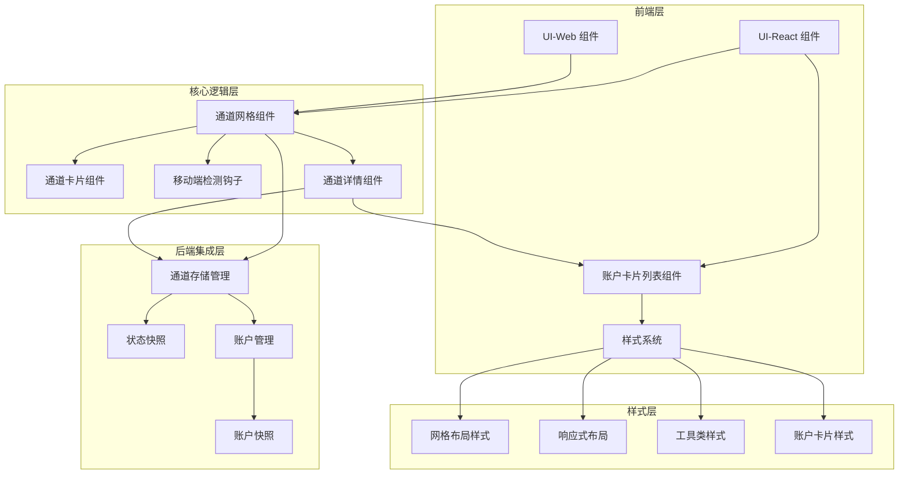
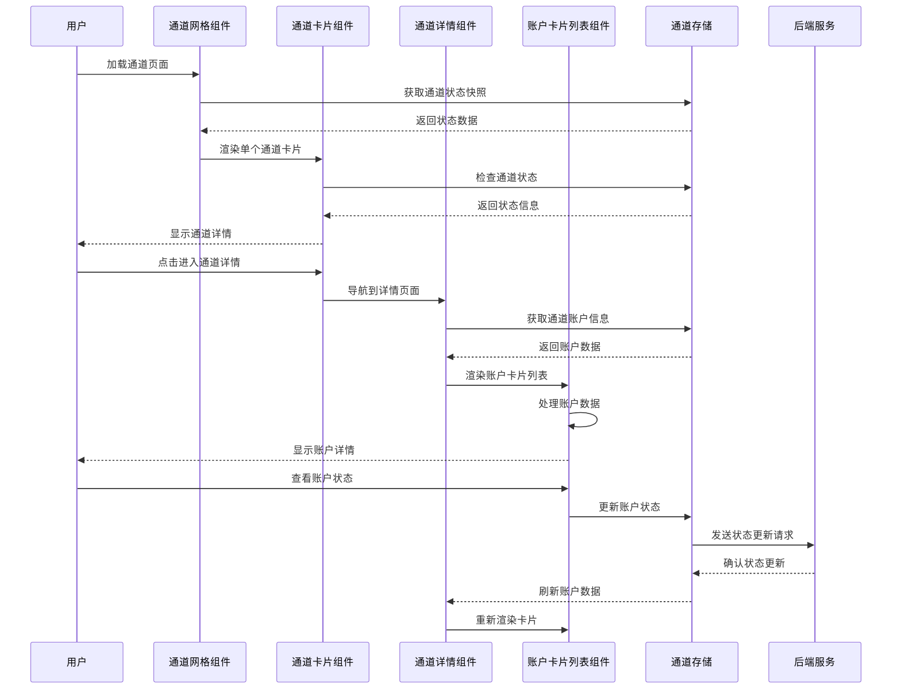
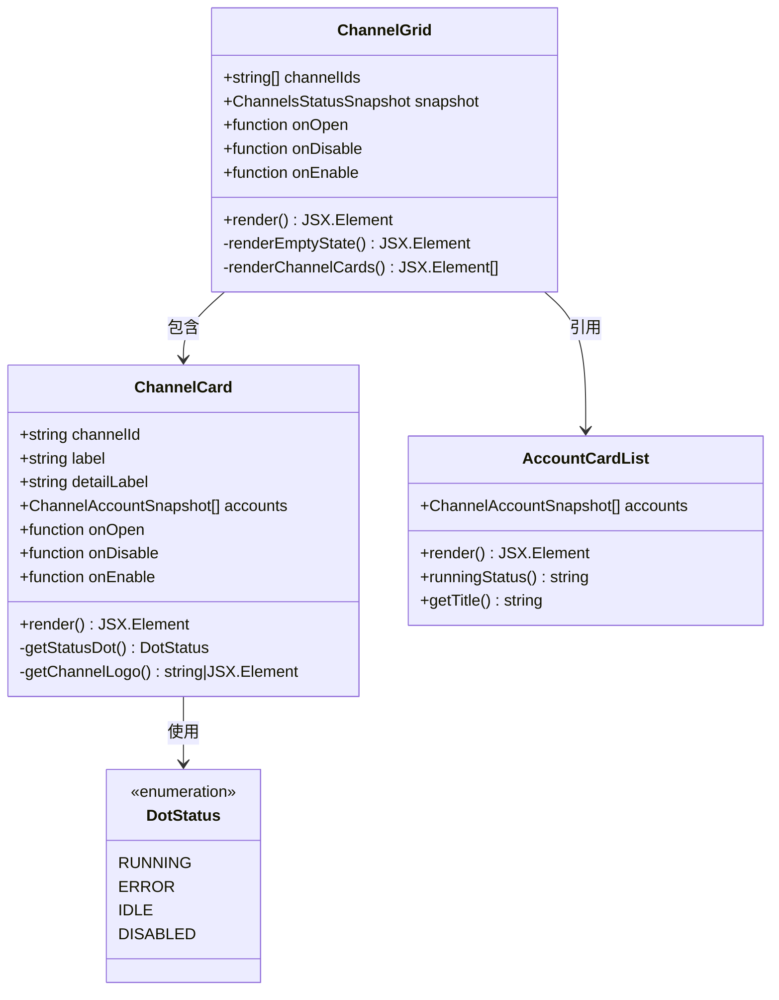
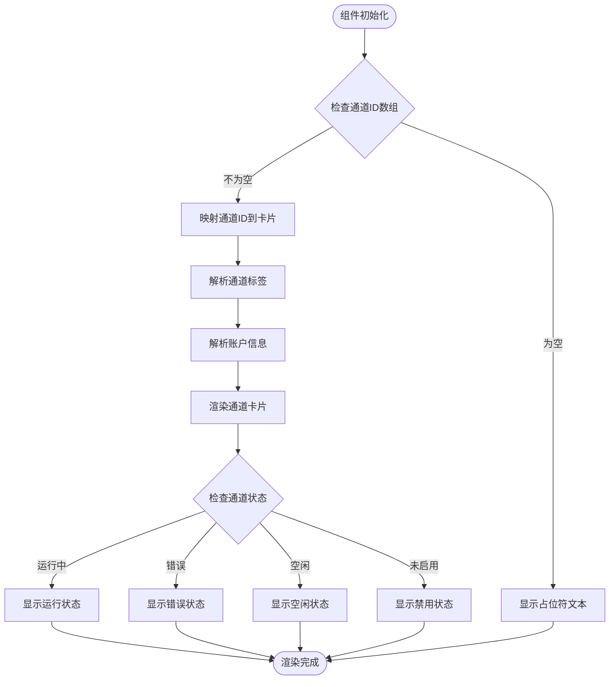
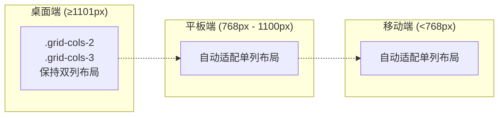
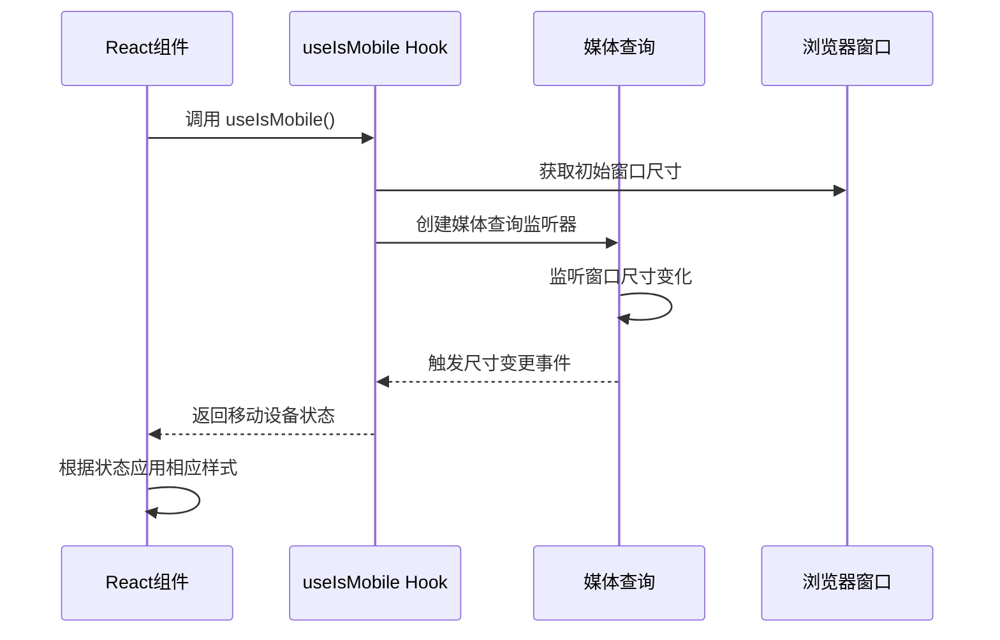
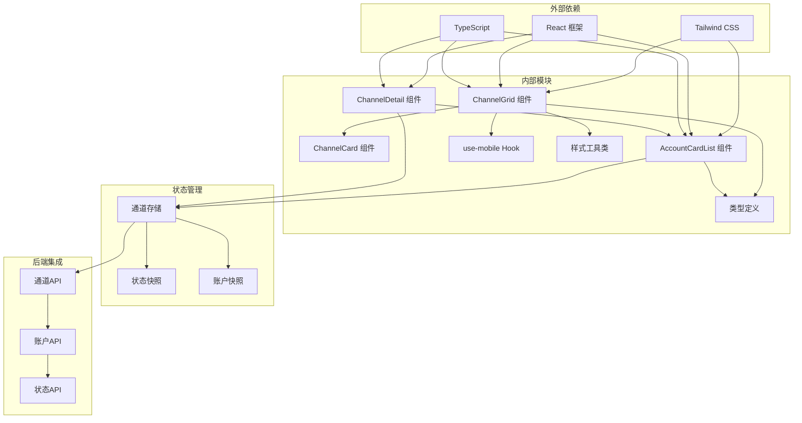

# 通道网格布局系统

<cite>
**本文档引用的文件**
- [ChannelGrid.tsx](file://ui-react/src/components/channels/ChannelGrid.tsx)
- [ChannelCard.tsx](file://ui-react/src/components/channels/ChannelCard.tsx)
- [AccountCardList.tsx](file://ui-react/src/components/channels/shared/AccountCardList.tsx)
- [ChannelDetail.tsx](file://ui-react/src/components/channels/ChannelDetail.tsx)
- [channels.ts](file://ui/src/ui/views/channels.ts)
- [components.css](file://ui/src/styles/components.css)
- [layout.css](file://ui/src/styles/layout.css)
- [use-mobile.ts](file://ui-react/src/hooks/use-mobile.ts)
- [channels.ts](file://ui/src/ui/views/channels.ts)
- [channels.ts](file://ui/src/ui/views/channels.nostr.ts)
- [channels.ts](file://src/channels/plugins/status.ts)
- [channels.ts](file://src/channels/account-snapshot-fields.ts)
- [channels.ts](file://src/gateway/protocol/schema/channels.ts)
- [channels.ts](file://ui/src/ui/views/channels.ts)
- [channels.ts](file://ui/src/styles/components.css)
- [channels.ts](file://ui/src/styles/layout.css)
</cite>

## 更新摘要
**变更内容**
- 新增AccountCardList组件，用于展示账户卡片列表
- 增强响应式网格布局系统，支持更灵活的布局控制
- 改进文本对齐和默认账户标识的显示逻辑
- 优化样式系统，提供更好的视觉层次和一致性

## 目录
1. [简介](#简介)
2. [项目结构](#项目结构)
3. [核心组件](#核心组件)
4. [架构概览](#架构概览)
5. [详细组件分析](#详细组件分析)
6. [新增AccountCardList组件](#新增accountcardlist组件)
7. [样式系统增强](#样式系统增强)
8. [依赖关系分析](#依赖关系分析)
9. [性能考虑](#性能考虑)
10. [故障排除指南](#故障排除指南)
11. [结论](#结论)

## 简介

通道网格布局系统是 OpenClaw 项目中的一个关键组件，负责在用户界面中以网格形式展示和管理各种通信渠道（Channels）。该系统采用响应式设计原则，支持桌面端和移动端的自适应布局，为用户提供统一且直观的通道管理体验。

系统的核心功能包括：
- 基于 CSS Grid 的响应式网格布局
- 通道状态的可视化展示
- 移动端和桌面端的差异化适配
- 通道启用/禁用的状态管理
- 实时状态更新和错误处理
- **新增**：账户卡片列表的详细展示功能

## 项目结构

通道网格布局系统分布在多个技术栈中，形成了完整的前端到后端解决方案：



**图表来源**
- [ChannelGrid.tsx:1-49](file://ui-react/src/components/channels/ChannelGrid.tsx#L1-L49)
- [AccountCardList.tsx:1-87](file://ui-react/src/components/channels/shared/AccountCardList.tsx#L1-L87)
- [ChannelDetail.tsx:1-170](file://ui-react/src/components/channels/ChannelDetail.tsx#L1-L170)
- [layout.css:518-545](file://ui/src/styles/layout.css#L518-L545)
- [use-mobile.ts:1-19](file://ui-react/src/hooks/use-mobile.ts#L1-L19)

**章节来源**
- [ChannelGrid.tsx:1-49](file://ui-react/src/components/channels/ChannelGrid.tsx#L1-L49)
- [AccountCardList.tsx:1-87](file://ui-react/src/components/channels/shared/AccountCardList.tsx#L1-L87)
- [ChannelDetail.tsx:1-170](file://ui-react/src/components/channels/ChannelDetail.tsx#L1-L170)
- [layout.css:518-545](file://ui/src/styles/layout.css#L518-L545)
- [use-mobile.ts:1-19](file://ui-react/src/hooks/use-mobile.ts#L1-L19)

## 核心组件

### ChannelGrid 组件

ChannelGrid 是整个网格布局系统的核心组件，负责渲染通道列表的网格视图。该组件实现了以下关键功能：

- **响应式网格布局**：使用 CSS Grid 实现自适应的网格布局
- **条件渲染**：当通道列表为空时显示占位符文本
- **状态管理**：通过 snapshot 参数获取通道的实时状态信息
- **事件处理**：提供打开、启用、禁用通道的回调函数

### ChannelCard 组件

ChannelCard 提供了每个通道的详细信息展示，包含以下特性：

- **状态指示器**：通过彩色圆点显示通道的运行状态
- **账户统计**：显示已配置和正在运行的账户数量
- **操作按钮**：提供启用/禁用通道的交互功能
- **错误处理**：显示通道操作过程中的错误信息

### **新增** AccountCardList 组件

AccountCardList 是新增的账户卡片列表组件，专门用于展示通道下的所有账户信息。该组件提供了更加详细的账户状态展示：

- **响应式网格布局**：使用 `grid grid-cols-[minmax(120px,1fr)_auto]` 实现灵活的两列布局
- **智能标题生成**：根据账户类型自动选择合适的显示名称
- **状态信息展示**：显示运行状态、配置状态、连接状态和最后消息时间
- **错误处理**：显示账户相关的错误信息
- **默认账户标识**：特殊标识默认账户，提供更好的用户体验

**章节来源**
- [ChannelGrid.tsx:8-48](file://ui-react/src/components/channels/ChannelGrid.tsx#L8-L48)
- [ChannelCard.tsx:21-147](file://ui-react/src/components/channels/ChannelCard.tsx#L21-L147)
- [AccountCardList.tsx:16-86](file://ui-react/src/components/channels/shared/AccountCardList.tsx#L16-L86)

## 架构概览

通道网格布局系统采用了分层架构设计，确保了良好的可维护性和扩展性：



**图表来源**
- [ChannelGrid.tsx:25-46](file://ui-react/src/components/channels/ChannelGrid.tsx#L25-L46)
- [ChannelCard.tsx:42-49](file://ui-react/src/components/channels/ChannelCard.tsx#L42-L49)
- [ChannelDetail.tsx:34-35](file://ui-react/src/components/channels/ChannelDetail.tsx#L34-L35)
- [AccountCardList.tsx:22-84](file://ui-react/src/components/channels/shared/AccountCardList.tsx#L22-L84)

## 详细组件分析

### ChannelGrid 组件深度分析

ChannelGrid 组件实现了基于 Tailwind CSS 的响应式网格布局系统：



**图表来源**
- [ChannelGrid.tsx:8-48](file://ui-react/src/components/channels/ChannelGrid.tsx#L8-L48)
- [ChannelCard.tsx:7-19](file://ui-react/src/components/channels/ChannelCard.tsx#L7-L19)
- [AccountCardList.tsx:16-86](file://ui-react/src/components/channels/shared/AccountCardList.tsx#L16-L86)

#### 响应式布局实现

系统采用了多层次的响应式设计策略：

1. **桌面端布局**：使用 `grid-cols-2` 类实现两列网格布局
2. **移动端适配**：通过媒体查询自动切换到单列布局
3. **动态断点**：使用 768px 作为移动端断点阈值
4. ****新增**：AccountCardList 使用 `grid-cols-[minmax(120px,1fr)_auto]` 实现智能两列布局

#### 状态管理机制



**图表来源**
- [ChannelGrid.tsx:21-46](file://ui-react/src/components/channels/ChannelGrid.tsx#L21-L46)
- [ChannelCard.tsx:13-19](file://ui-react/src/components/channels/ChannelCard.tsx#L13-L19)

**章节来源**
- [ChannelGrid.tsx:1-49](file://ui-react/src/components/channels/ChannelGrid.tsx#L1-L49)
- [ChannelCard.tsx:1-147](file://ui-react/src/components/channels/ChannelCard.tsx#L1-L147)

### 样式系统分析

样式系统基于 CSS Grid 和自定义属性构建，提供了灵活的布局控制能力：

#### 网格工具类

系统定义了多种网格相关的 CSS 工具类：

- `.grid`：基础网格容器，设置默认间距
- `.grid-cols-2`：两列等宽网格布局
- `.grid-cols-3`：三列等宽网格布局
- `.stat-grid`：统计信息网格，最小宽度 150px
- `.note-grid`：笔记信息网格，最小宽度 220px
- **新增**：`.account-card-list`：账户卡片列表网格布局

#### 响应式断点



**图表来源**
- [layout.css:568-623](file://ui/src/styles/layout.css#L568-L623)

**章节来源**
- [layout.css:518-545](file://ui/src/styles/layout.css#L518-L545)
- [layout.css:568-623](file://ui/src/styles/layout.css#L568-L623)

### 移动端适配机制

移动端检测通过自定义 Hook 实现，提供了精确的设备识别能力：



**图表来源**
- [use-mobile.ts:8-16](file://ui-react/src/hooks/use-mobile.ts#L8-L16)

**章节来源**
- [use-mobile.ts:1-19](file://ui-react/src/hooks/use-mobile.ts#L1-L19)

## 新增AccountCardList组件

### 组件架构设计

AccountCardList 是一个专门用于展示通道账户信息的组件，具有以下特点：

- **智能标题生成**：根据账户类型自动选择合适的显示名称
- **响应式布局**：使用 CSS Grid 实现灵活的两列布局
- **状态信息展示**：提供运行状态、配置状态、连接状态和最后消息时间
- **错误处理**：显示账户相关的错误信息

### 标题生成逻辑

组件实现了智能的标题生成逻辑，优先级如下：

1. **机器人用户名**：如果账户有机器人用户名，显示为 `@username` 格式
2. **默认账户**：如果账户ID为 "default"，显示 "Default account"
3. **自定义名称**：如果账户有自定义名称，显示名称
4. **账户ID**：作为最后的选择，显示账户ID

### 响应式网格布局

AccountCardList 使用了先进的 CSS Grid 技术：

```css
.grid-cols-\[minmax\(120px,1fr\)_auto\]
```

这个布局规则：
- 第一列：最小宽度 120px，剩余空间按比例分配
- 第二列：自动宽度，适合显示账户ID
- `items-center`：垂直居中对齐
- `gap-3`：列间距 12px

### 状态信息展示

组件展示了四个关键的状态信息：

1. **Running**：账户是否正在运行
2. **Configured**：账户是否已配置
3. **Connected**：账户是否已连接（可选）
4. **Last inbound**：最后接收消息的时间

### 错误处理机制

对于有错误信息的账户，组件会显示一个带有背景色的错误提示框，提供更好的用户体验。

**章节来源**
- [AccountCardList.tsx:16-86](file://ui-react/src/components/channels/shared/AccountCardList.tsx#L16-L86)

## 样式系统增强

### 账户卡片样式

新增的账户卡片样式系统提供了更好的视觉层次：

- `.account-card-list`：账户卡片列表容器，使用网格布局
- `.account-card`：单个账户卡片，带边框和圆角
- `.account-card-header`：头部区域，使用 Flex 布局
- `.account-card-title`：标题文本，加粗显示
- `.account-card-id`：账户ID，使用等宽字体
- `.account-card-status`：状态信息区域
- `.account-card-error`：错误信息样式

### 状态列表样式

状态列表使用了新的网格布局系统：

```css
.status-list {
  display: grid;
  gap: 8px;
}

.status-list div {
  display: flex;
  justify-content: space-between;
  gap: 12px;
  padding: 8px 0;
  border-bottom: 1px solid var(--border);
}
```

这种设计提供了更好的对齐和间距控制。

### 响应式改进

样式系统进行了多项响应式改进：

1. **智能断点**：使用 `minmax()` 函数实现更灵活的布局
2. **间距调整**：根据不同屏幕尺寸调整间距
3. **字体优化**：针对不同设备优化字体大小和行高

**章节来源**
- [components.css:156-214](file://ui/src/styles/components.css#L156-214)

## 依赖关系分析

通道网格布局系统的依赖关系展现了清晰的分层架构：



**图表来源**
- [ChannelGrid.tsx:1-2](file://ui-react/src/components/channels/ChannelGrid.tsx#L1-L2)
- [ChannelCard.tsx:1-5](file://ui-react/src/components/channels/ChannelCard.tsx#L1-L5)
- [AccountCardList.tsx:1-4](file://ui-react/src/components/channels/shared/AccountCardList.tsx#L1-L4)
- [ChannelDetail.tsx:10-11](file://ui-react/src/components/channels/ChannelDetail.tsx#L10-L11)

**章节来源**
- [ChannelGrid.tsx:1-49](file://ui-react/src/components/channels/ChannelGrid.tsx#L1-L49)
- [ChannelCard.tsx:1-147](file://ui-react/src/components/channels/ChannelCard.tsx#L1-L147)
- [AccountCardList.tsx:1-87](file://ui-react/src/components/channels/shared/AccountCardList.tsx#L1-L87)

## 性能考虑

通道网格布局系统在设计时充分考虑了性能优化：

### 渲染优化策略

1. **条件渲染**：空状态时只渲染占位符，避免不必要的 DOM 操作
2. **状态缓存**：利用 React 的状态提升减少重复计算
3. **懒加载**：图片资源使用懒加载避免阻塞主渲染流程
4. **事件防抖**：移动端触摸事件经过优化处理
5. ****新增**：AccountCardList 使用 `grid-cols-[minmax(120px,1fr)_auto]` 实现高效的布局计算

### 内存管理

- **组件卸载清理**：自动清理媒体查询监听器和事件处理器
- **状态重置**：组件卸载时重置相关状态避免内存泄漏
- **引用优化**：使用 React.memo 优化子组件渲染

### 网络性能

- **批量请求**：通道状态更新采用批量处理减少网络请求
- **缓存策略**：合理使用浏览器缓存减少重复加载
- **CDN 优化**：静态资源通过 CDN 分发提升加载速度

## 故障排除指南

### 常见问题及解决方案

#### 网格布局异常

**问题描述**：通道卡片在某些屏幕尺寸下显示错位

**可能原因**：
- CSS Grid 属性设置不当
- 容器宽度计算错误
- 媒体查询断点配置问题

**解决步骤**：
1. 检查父容器的 `display: grid` 设置
2. 验证 `grid-template-columns` 属性值
3. 确认媒体查询断点是否正确
4. 使用浏览器开发者工具检查盒模型

#### **新增** AccountCardList 布局问题

**问题描述**：账户卡片在小屏幕上显示拥挤或重叠

**诊断方法**：
1. 检查 `grid-cols-[minmax(120px,1fr)_auto]` 属性是否正确应用
2. 验证 `items-center` 和 `gap-3` 样式是否生效
3. 确认文本截断 (`truncate`) 是否按预期工作

**修复方案**：
- 调整 `minmax()` 函数中的最小宽度值
- 优化 `gap` 属性以适应不同屏幕尺寸
- 添加适当的媒体查询断点

#### 移动端适配问题

**问题描述**：在移动设备上布局不符合预期

**诊断方法**：
1. 检查 `useIsMobile` Hook 的断点设置
2. 验证媒体查询规则是否生效
3. 确认触摸事件处理逻辑

**修复方案**：
- 调整断点阈值以适应目标设备
- 优化触摸事件的响应时间
- 添加适当的回退样式

#### 性能问题

**症状表现**：页面滚动卡顿或渲染延迟

**优化措施**：
- 实施虚拟滚动处理大量通道
- 减少不必要的 re-render
- 优化图片资源大小
- 使用 React Profiler 分析性能瓶颈

**章节来源**
- [ChannelGrid.tsx:21-23](file://ui-react/src/components/channels/ChannelGrid.tsx#L21-L23)
- [ChannelCard.tsx:32-49](file://ui-react/src/components/channels/ChannelCard.tsx#L32-L49)
- [AccountCardList.tsx:40-44](file://ui-react/src/components/channels/shared/AccountCardList.tsx#L40-L44)

## 结论

通道网格布局系统展现了现代前端开发的最佳实践，通过合理的架构设计和优化策略，为用户提供了优秀的跨平台体验。系统的主要优势包括：

1. **响应式设计**：完美适配从移动端到桌面端的各种设备
2. **组件化架构**：清晰的职责分离便于维护和扩展
3. **性能优化**：多层面的性能优化确保流畅的用户体验
4. **错误处理**：完善的错误处理机制提升系统稳定性
5. ****新增**：AccountCardList 提供了更详细的账户信息展示**
6. ****新增**：增强的样式系统支持更好的视觉层次和一致性**

### 主要改进

- **AccountCardList 组件**：提供了专门的账户卡片展示功能
- **智能标题生成**：根据账户类型自动选择合适的显示名称
- **响应式网格布局**：使用先进的 CSS Grid 技术实现灵活布局
- **改进的文本对齐**：通过 `items-center` 和 `text-right` 实现更好的对齐
- **更好的默认账户标识**：特殊标识默认账户，提升用户体验

### 未来发展方向

- 实施虚拟滚动处理超大数量的通道
- 添加更多的动画效果提升用户体验
- 优化国际化支持以适应多语言环境
- 增强可访问性功能满足不同用户需求
- **考虑**：进一步优化 AccountCardList 的响应式行为

该系统为 OpenClaw 项目提供了一个坚实的基础，能够有效支撑各种通信渠道的管理和展示需求，同时新增的账户卡片功能为用户提供了更丰富的信息展示能力。