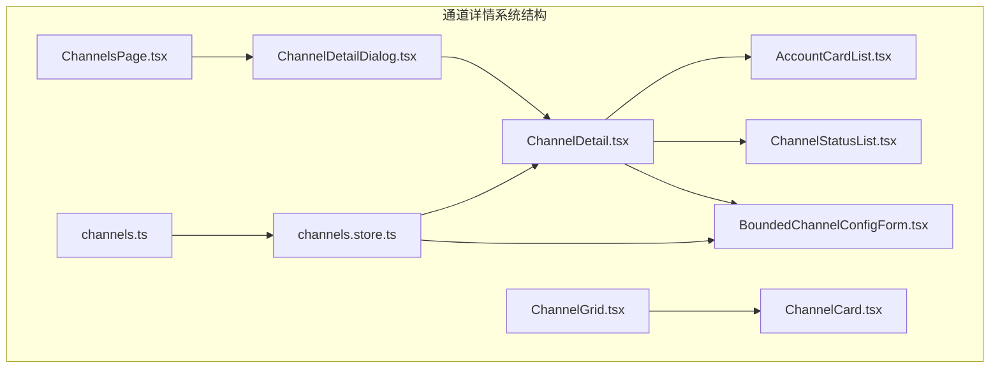
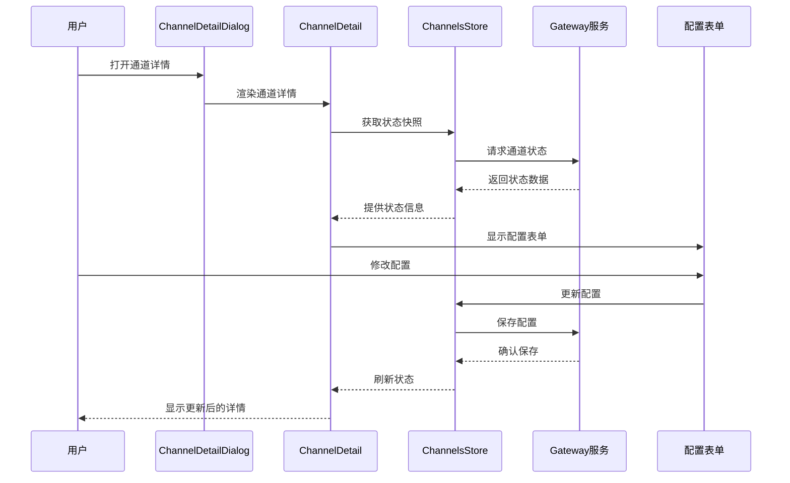
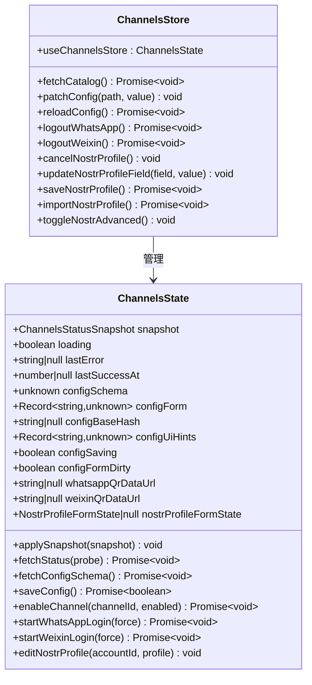
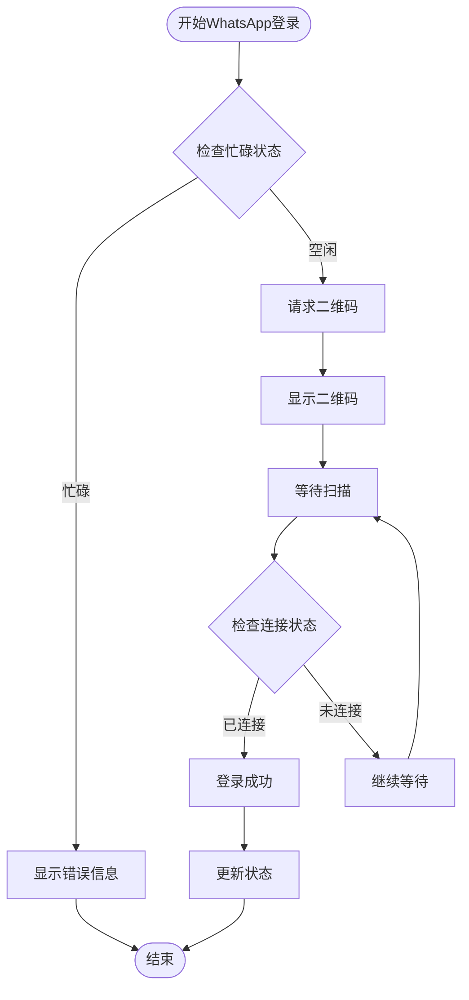
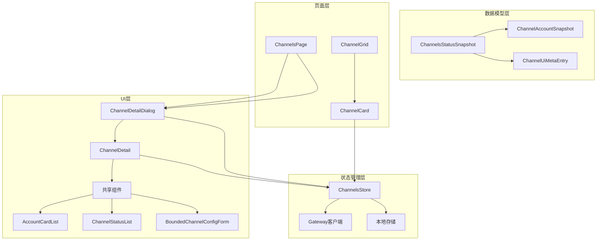

# 通道详情对话框系统

<cite>
**本文档引用的文件**
- [ChannelDetailDialog.tsx](file://ui-react/src/components/channels/ChannelDetailDialog.tsx)
- [ChannelDetail.tsx](file://ui-react/src/components/channels/ChannelDetail.tsx)
- [channels.store.ts](file://ui-react/src/store/channels.store.ts)
- [channels.ts](file://ui-react/src/types/channels.ts)
- [AccountCardList.tsx](file://ui-react/src/components/channels/shared/AccountCardList.tsx)
- [ChannelStatusList.tsx](file://ui-react/src/components/channels/shared/ChannelStatusList.tsx)
- [BoundChannelConfigForm.tsx](file://ui-react/src/components/channels/shared/BoundChannelConfigForm.tsx)
- [ChannelGrid.tsx](file://ui-react/src/components/channels/ChannelGrid.tsx)
- [ChannelCard.tsx](file://ui-react/src/components/channels/ChannelCard.tsx)
- [ChannelsPage.tsx](file://ui-react/src/pages/ChannelsPage.tsx)
</cite>

## 更新摘要
**所做更改**
- 增强了通道详情对话框的焦点管理机制
- 改进了生命周期处理和状态获取逻辑
- 新增了自动焦点防止功能
- 优化了对话框的可访问性和用户体验

## 目录
1. [简介](#简介)
2. [项目结构](#项目结构)
3. [核心组件](#核心组件)
4. [架构概览](#架构概览)
5. [详细组件分析](#详细组件分析)
6. [依赖关系分析](#依赖关系分析)
7. [性能考虑](#性能考虑)
8. [故障排除指南](#故障排除指南)
9. [结论](#结论)

## 简介

通道详情对话框系统是OpenClaw项目中用于展示和管理消息通道详细信息的核心UI组件。该系统提供了统一的界面来查看各个消息平台（如WhatsApp、Telegram、Discord等）的状态、配置和账户信息，并支持实时更新和交互操作。

该系统采用React + TypeScript构建，结合Zustand状态管理库，实现了响应式的通道管理界面。用户可以通过对话框深入了解每个通道的运行状态、连接情况、错误信息以及配置参数。

**更新** 本次更新增强了对话框的焦点管理和生命周期处理，包括自动焦点防止和状态获取逻辑的改进，提升了用户体验和可访问性。

## 项目结构

通道详情对话框系统主要位于ui-react项目的components/channels目录下，包含以下关键文件：



**图表来源**
- [ChannelDetailDialog.tsx:1-55](file://ui-react/src/components/channels/ChannelDetailDialog.tsx#L1-L55)
- [ChannelDetail.tsx:1-170](file://ui-react/src/components/channels/ChannelDetail.tsx#L1-L170)
- [channels.store.ts:1-508](file://ui-react/src/store/channels.store.ts#L1-L508)

**章节来源**
- [ChannelDetailDialog.tsx:1-55](file://ui-react/src/components/channels/ChannelDetailDialog.tsx#L1-L55)
- [ChannelDetail.tsx:1-170](file://ui-react/src/components/channels/ChannelDetail.tsx#L1-L170)
- [channels.store.ts:1-508](file://ui-react/src/store/channels.store.ts#L1-L508)

## 核心组件

### ChannelDetailDialog 组件

ChannelDetailDialog是整个系统的入口组件，负责控制对话框的显示和隐藏，并提供标题解析功能。

**主要特性：**
- 响应式对话框设计，支持最大宽度和高度限制
- 动态标题解析，优先使用标签映射，其次使用元数据，最后回退到频道ID
- 滚动区域支持，确保内容超出时可滚动查看
- 关闭事件处理，支持用户手动关闭对话框
- **新增** 自动焦点防止机制，通过onOpenAutoFocus事件处理器阻止默认焦点行为

**更新** 新增了onOpenAutoFocus事件处理器，使用preventDefault()方法防止对话框打开时的自动焦点行为，确保用户可以更好地控制焦点流向。

**章节来源**
- [ChannelDetailDialog.tsx:6-54](file://ui-react/src/components/channels/ChannelDetailDialog.tsx#L6-L54)

### ChannelDetail 组件

ChannelDetail组件根据不同的通道类型渲染相应的详情视图，支持通用模板和特定通道的定制化界面。

**支持的通道类型：**
- **通用通道**：显示基础状态信息、账户列表和配置表单
- **WhatsApp通道**：包含登录面板和连接状态管理
- **微信通道**：提供扫码登录和会话管理功能
- **Nostr通道**：支持个人资料编辑和公钥管理

**章节来源**
- [ChannelDetail.tsx:19-169](file://ui-react/src/components/channels/ChannelDetail.tsx#L19-L169)

## 架构概览

通道详情对话框系统采用分层架构设计，各组件职责明确，通过状态管理实现松耦合的数据流。



**图表来源**
- [ChannelDetailDialog.tsx:26-53](file://ui-react/src/components/channels/ChannelDetailDialog.tsx#L26-L53)
- [ChannelDetail.tsx:161-169](file://ui-react/src/components/channels/ChannelDetail.tsx#L161-L169)
- [channels.store.ts:163-180](file://ui-react/src/store/channels.store.ts#L163-L180)

## 详细组件分析

### 状态管理系统

ChannelsStore是整个系统的核心状态管理器，负责协调所有通道相关数据的获取、更新和持久化。



**图表来源**
- [channels.store.ts:41-104](file://ui-react/src/store/channels.store.ts#L41-L104)
- [channels.store.ts:108-491](file://ui-react/src/store/channels.store.ts#L108-L491)

**章节来源**
- [channels.store.ts:108-491](file://ui-react/src/store/channels.store.ts#L108-L491)

### 数据模型定义

系统使用TypeScript接口定义了完整的通道数据模型，确保类型安全和开发体验。

```mermaid
erDiagram
ChannelsStatusSnapshot {
number ts
string[] channelOrder
Record~string,string~ channelLabels
Record~string,string~ channelDetailLabels
Record~string,string~ channelSystemImages
ChannelUiMetaEntry[] channelMeta
Record~string,unknown~ channels
Record~string,ChannelAccountSnapshot[]~ channelAccounts
Record~string,string~ channelDefaultAccountId
}
ChannelAccountSnapshot {
string accountId
boolean|null enabled
boolean|null configured
boolean|null linked
boolean|null running
boolean|null connected
number|null reconnectAttempts
number|null lastConnectedAt
string|null lastError
number|null lastStartAt
number|null lastStopAt
number|null lastInboundAt
number|null lastOutboundAt
number|null lastProbeAt
string|null mode
string|null dmPolicy
string[]|null allowFrom
string|null tokenSource
string|null botTokenSource
string|null appTokenSource
string|null credentialSource
string|null audienceType
string|null audience
string|null webhookPath
string|null webhookUrl
string|null baseUrl
string|null cliPath
string|null dbPath
number|null port
unknown probe
}
ChannelUiMetaEntry {
string id
string label
string detailLabel
string|null systemImage
}
ChannelsStatusSnapshot ||--o{ ChannelAccountSnapshot : 包含
ChannelsStatusSnapshot ||--o{ ChannelUiMetaEntry : 描述
```

**图表来源**
- [channels.ts:50-60](file://ui-react/src/types/channels.ts#L50-L60)
- [channels.ts:15-48](file://ui-react/src/types/channels.ts#L15-L48)
- [channels.ts:8-13](file://ui-react/src/types/channels.ts#L8-L13)

**章节来源**
- [channels.ts:50-60](file://ui-react/src/types/channels.ts#L50-L60)
- [channels.ts:15-48](file://ui-react/src/types/channels.ts#L15-L48)
- [channels.ts:8-13](file://ui-react/src/types/channels.ts#L8-L13)

### 专用通道详情组件

系统为不同类型的通道提供了专门的详情组件，以满足特定的功能需求。

#### WhatsApp 详情组件

WhatsApp详情组件提供了完整的登录流程管理，包括二维码生成、扫描等待和登出功能。



**图表来源**
- [channels.store.ts:278-330](file://ui-react/src/store/channels.store.ts#L278-L330)

#### 微信 详情组件

微信详情组件支持多语言界面，提供扫码登录和会话管理功能。

**章节来源**
- [channels.store.ts:334-393](file://ui-react/src/store/channels.store.ts#L334-L393)

#### Nostr 详情组件

Nostr详情组件允许用户编辑和管理个人资料，支持高级字段的显示和隐藏。

**章节来源**
- [channels.store.ts:397-490](file://ui-react/src/store/channels.store.ts#L397-L490)

### 共享组件

系统还包含多个共享组件，用于构建统一的用户界面体验。

#### 账户卡片列表

AccountCardList组件展示了通道中所有账户的详细信息，包括运行状态、配置状态和连接信息。

**章节来源**
- [AccountCardList.tsx:16-84](file://ui-react/src/components/channels/shared/AccountCardList.tsx#L16-L84)

#### 通道状态列表

ChannelStatusList组件提供了统一的状态信息展示格式，支持危险状态的高亮显示。

**章节来源**
- [ChannelStatusList.tsx:9-34](file://ui-react/src/components/channels/shared/ChannelStatusList.tsx#L9-L34)

#### 绑定配置表单

BoundChannelConfigForm组件作为配置表单的包装器，自动从状态管理器读取配置数据并处理保存操作。

**章节来源**
- [BoundChannelConfigForm.tsx:9-35](file://ui-react/src/components/channels/shared/BoundChannelConfigForm.tsx#L9-L35)

## 依赖关系分析

通道详情对话框系统具有清晰的依赖层次结构，各模块间通过接口进行通信，避免了紧耦合。



**图表来源**
- [ChannelDetailDialog.tsx:1-55](file://ui-react/src/components/channels/ChannelDetailDialog.tsx#L1-L55)
- [channels.store.ts:1-508](file://ui-react/src/store/channels.store.ts#L1-L508)
- [channels.ts:50-60](file://ui-react/src/types/channels.ts#L50-L60)

**章节来源**
- [ChannelDetailDialog.tsx:1-55](file://ui-react/src/components/channels/ChannelDetailDialog.tsx#L1-L55)
- [channels.store.ts:1-508](file://ui-react/src/store/channels.store.ts#L1-L508)
- [channels.ts:50-60](file://ui-react/src/types/channels.ts#L50-L60)

## 性能考虑

### 状态管理优化

系统采用Zustand作为状态管理库，相比Redux具有更轻量的实现和更好的性能表现。通过细粒度的状态分割，减少了不必要的组件重渲染。

### 异步操作处理

所有异步操作都采用了适当的错误处理和加载状态管理，确保用户体验的流畅性。

### 内存管理

组件在卸载时自动清理订阅和定时器，避免内存泄漏问题。

### **新增** 焦点管理优化

**更新** 新增的自动焦点防止机制避免了对话框打开时的意外焦点转移，提升了键盘导航的可用性。onOpenAutoFocus事件处理器确保用户可以更好地控制焦点流向，特别是在复杂的表单环境中。

## 故障排除指南

### 常见问题及解决方案

**对话框无法打开**
- 检查channelId是否为null或undefined
- 确认snapshot对象是否正确加载
- 验证onClose回调函数的正确性

**状态信息不更新**
- 检查fetchStatus方法的调用频率
- 确认Gateway连接状态正常
- 验证applySnapshot方法的执行

**配置保存失败**
- 检查configBaseHash参数是否正确传递
- 确认Gateway权限设置
- 验证配置格式的正确性

**焦点管理问题**
- **新增** 检查onOpenAutoFocus事件处理器是否正确阻止默认焦点行为
- 确认对话框内容的可访问性标签设置
- 验证键盘导航的焦点顺序

**章节来源**
- [channels.store.ts:163-180](file://ui-react/src/store/channels.store.ts#L163-L180)
- [channels.store.ts:224-247](file://ui-react/src/store/channels.store.ts#L224-L247)

## 结论

通道详情对话框系统通过精心设计的架构和组件结构，为用户提供了强大而直观的消息通道管理界面。系统的主要优势包括：

1. **模块化设计**：清晰的组件分离和职责划分
2. **类型安全**：完整的TypeScript类型定义
3. **状态管理**：高效的Zustand状态管理方案
4. **扩展性**：支持新通道类型的快速集成
5. **用户体验**：响应式的界面和流畅的操作体验

**更新** 本次更新进一步增强了系统的可访问性和用户体验，特别是通过改进的焦点管理和生命周期处理，确保了更好的键盘导航支持和更稳定的用户交互体验。新增的自动焦点防止功能使得对话框在各种使用场景下都能提供一致且可预测的用户体验。

该系统为OpenClaw项目的消息通道管理提供了坚实的技术基础，能够有效支持多种消息平台的集成和管理需求。