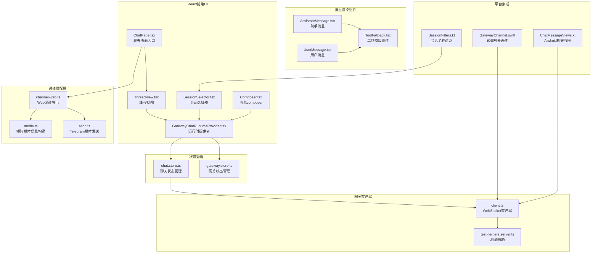
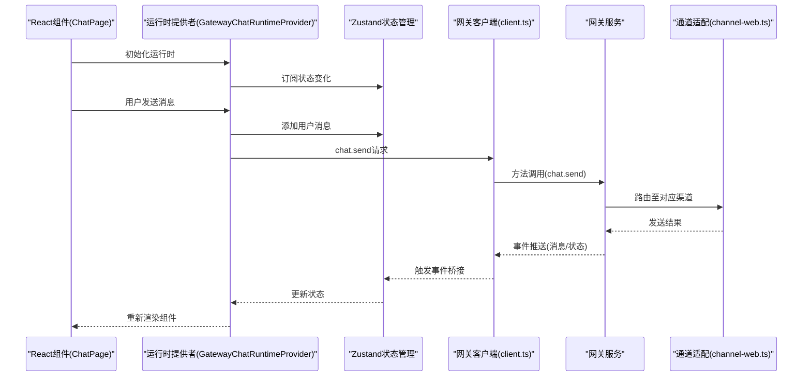
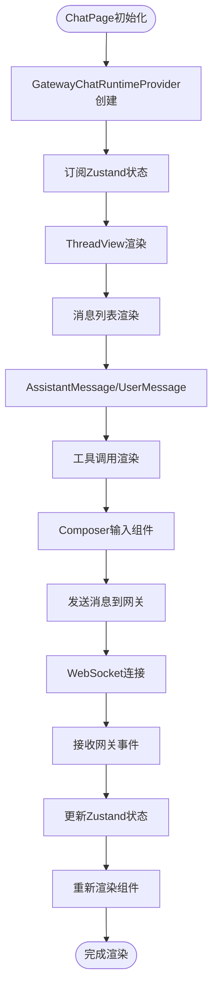
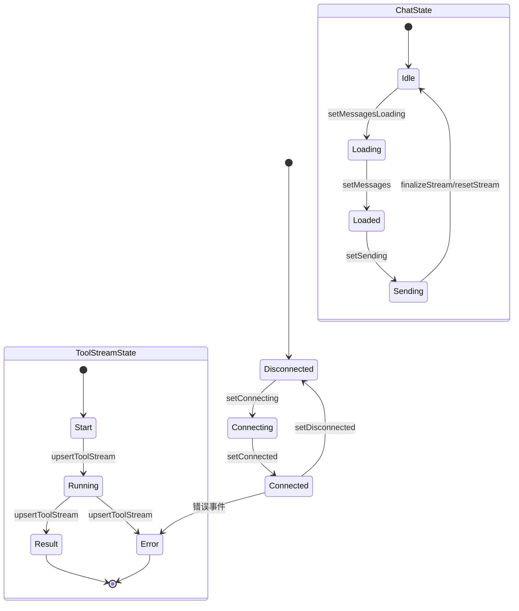
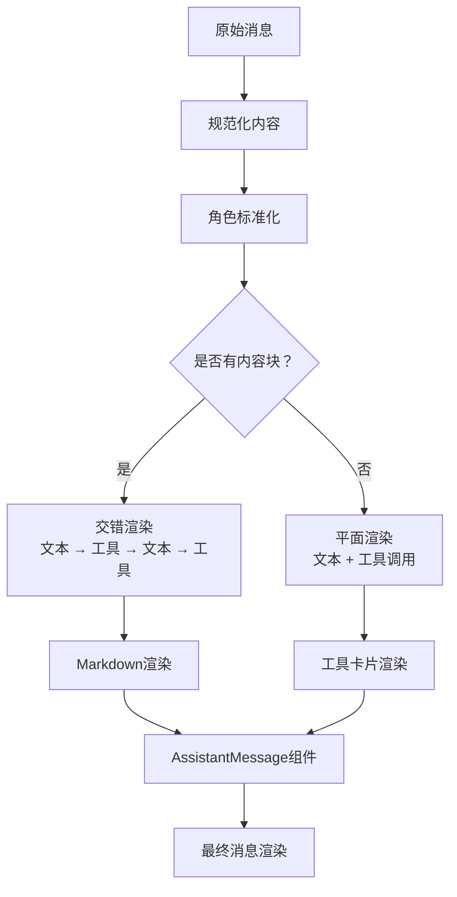
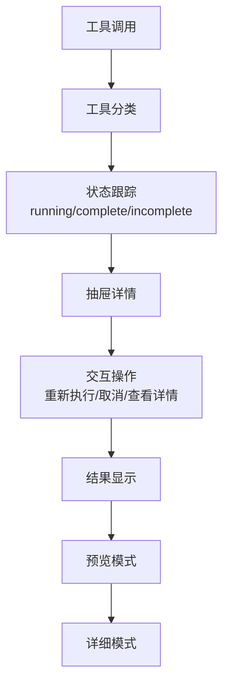
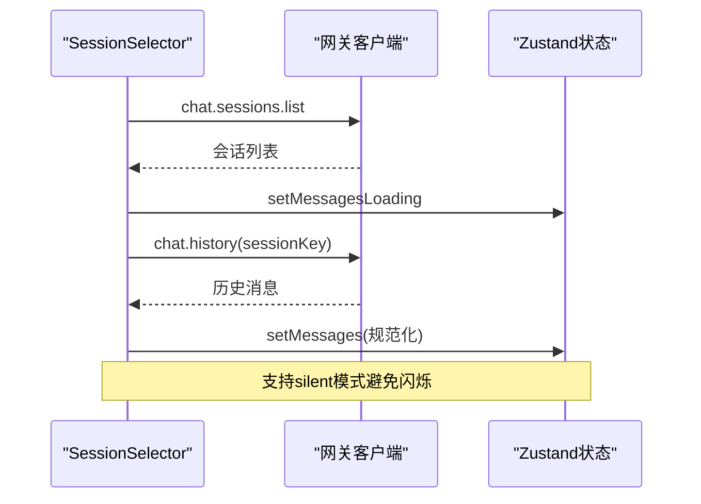
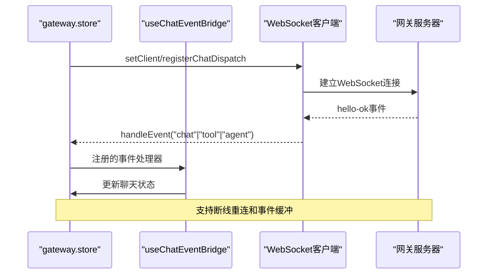
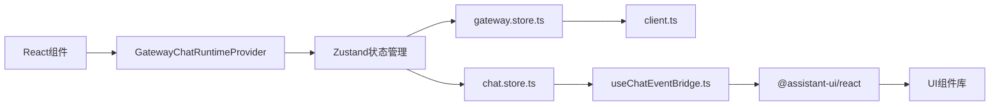

# WebChat界面

<cite>
**本文档引用的文件**
- [chat.ts](file://ui/src/ui/views/chat.ts)
- [webchat.md](file://docs/web/webchat.md)
- [channel-web.ts](file://src/channel-web.ts)
- [client.ts](file://src/gateway/client.ts)
- [sessions.ts](file://ui/src/ui/controllers/sessions.ts)
- [sessions-history-tool.ts](file://src/agents/tools/sessions-history-tool.ts)
- [layout.css](file://ui/src/styles/chat/layout.css)
- [ChatPage.tsx](file://ui-react/src/pages/ChatPage.tsx)
- [chat.store.ts](file://ui-react/src/store/chat.store.ts)
- [useChatEventBridge.ts](file://ui-react/src/hooks/useChatEventBridge.ts)
- [GatewayChatRuntimeProvider.tsx](file://ui-react/src/components/chat/GatewayChatRuntimeProvider.tsx)
- [ThreadView.tsx](file://ui-react/src/components/chat/ThreadView.tsx)
- [SessionSelector.tsx](file://ui-react/src/components/chat/SessionSelector.tsx)
- [Composer.tsx](file://ui-react/src/components/chat/Composer.tsx)
- [AssistantMessage.tsx](file://ui-react/src/components/chat/AssistantMessage.tsx)
- [UserMessage.tsx](file://ui-react/src/components/chat/UserMessage.tsx)
- [ToolFallback.tsx](file://ui-react/src/components/chat/ToolFallback.tsx)
- [gateway.store.ts](file://ui-react/src/store/gateway.store.ts)
- [router.tsx](file://ui-react/src/router.tsx)
- [vite.config.ts](file://ui-react/vite.config.ts)
- [package.json](file://ui-react/package.json)
- [ChatMessageViews.kt](file://apps/android/app/src/main/java/ai/openclaw/app/ui/chat/ChatMessageViews.kt)
- [SessionFilters.kt](file://apps/android/app/src/main/java/ai/openclaw/app/ui/chat/SessionFilters.kt)
- [test-helpers.server.ts](file://src/gateway/test-helpers.server.ts)
- [GatewayChannel.swift](file://apps/shared/OpenClawKit/Sources/OpenClawKit/GatewayChannel.swift)
- [media.ts](file://extensions/matrix/src/matrix/send/media.ts)
- [send.ts](file://src/telegram/send.ts)
- [groups.md](file://docs/channels/groups.md)
- [bluebubbles reactions.ts](file://extensions/bluebubbles/src/reactions.ts)
- [status-reaction-variants.ts](file://src/telegram/status-reaction-variants.ts)
</cite>

## 更新摘要

**所做更改**

- 新增React架构聊天组件系统的详细分析
- 更新聊天组件系统架构图以反映新的React组件结构
- 新增Zustand状态管理系统的说明
- 更新消息渲染机制以支持新的内容块系统
- 新增工具调用流式处理和状态管理
- 更新会话管理和工具集成功能说明
- 新增React Hooks和组件生命周期的说明

## 目录

1. [简介](#简介)
2. [项目结构](#项目结构)
3. [核心组件](#核心组件)
4. [架构总览](#架构总览)
5. [详细组件分析](#详细组件分析)
6. [依赖关系分析](#依赖关系分析)
7. [性能考虑](#性能考虑)
8. [故障排除指南](#故障排除指南)
9. [结论](#结论)
10. [附录](#附录)

## 简介

本文件系统性阐述WebChat界面的设计与实现，覆盖实时聊天、消息收发、界面布局、消息历史、输入框功能、多媒体消息、文件传输、表情反应、聊天室与群组管理、隐私策略以及WebSocket连接、消息同步与离线处理等主题。文档基于仓库中的UI实现、网关协议、通道适配层与平台集成进行综合分析，帮助开发者与运维人员快速理解并部署WebChat。

**更新** 本版本重点反映了从传统Lit框架向现代React架构的迁移，包括新的聊天组件系统、增强的消息渲染能力、会话管理和工具集成功能。

## 项目结构

WebChat界面现已迁移到React架构，由前端UI、网关客户端、通道适配层与平台集成四部分组成：

- 前端UI（React架构）：使用React 19、Zustand状态管理、Assistant UI组件库，负责渲染聊天线程、输入框、附件预览、队列与占位提示等。
- 网关客户端：封装WebSocket连接、请求/响应、事件订阅与重连逻辑。
- 通道适配层：抽象Web渠道的登录、会话、入站监听与出站发送。
- 平台集成：在不同平台上通过原生UI或移动端框架接入网关。

**图表来源**

- [ChatPage.tsx:1-21](file://ui-react/src/pages/ChatPage.tsx#L1-L21)
- [ThreadView.tsx:1-82](file://ui-react/src/components/chat/ThreadView.tsx#L1-L82)
- [chat.store.ts:1-230](file://ui-react/src/store/chat.store.ts#L1-L230)
- [GatewayChatRuntimeProvider.tsx:1-237](file://ui-react/src/components/chat/GatewayChatRuntimeProvider.tsx#L1-L237)
- [client.ts:43-96](file://src/gateway/client.ts#L43-L96)
- [channel-web.ts:1-34](file://src/channel-web.ts#L1-L34)

**章节来源**

- [ChatPage.tsx:1-21](file://ui-react/src/pages/ChatPage.tsx#L1-L21)
- [chat.store.ts:1-230](file://ui-react/src/store/chat.store.ts#L1-L230)
- [GatewayChatRuntimeProvider.tsx:1-237](file://ui-react/src/components/chat/GatewayChatRuntimeProvider.tsx#L1-L237)
- [webchat.md:1-62](file://docs/web/webchat.md#L1-L62)
- [channel-web.ts:1-34](file://src/channel-web.ts#L1-L34)

## 核心组件

- **React聊天页面**：ChatPage作为根组件，整合会话选择器和线程视图，提供完整的聊天界面。
- **状态管理系统**：使用Zustand管理聊天状态、网关连接状态和设置状态，避免组件间复杂的数据传递。
- **消息渲染组件**：AssistantMessage、UserMessage和ToolFallback提供丰富的消息渲染能力，支持Markdown、工具调用和附件。
- **运行时提供者**：GatewayChatRuntimeProvider桥接Zustand状态与Assistant UI组件库，实现消息转换和事件处理。
- **事件桥接**：useChatEventBridge将网关事件转换为Zustand状态更新，保持组件解耦。
- **会话管理**：SessionSelector提供会话切换、创建和历史加载功能。
- **Composer组件**：提供富文本输入、附件上传和发送控制功能。
- **工具降级组件**：ToolFallback展示工具调用的分类、状态和详细信息。

**章节来源**

- [ChatPage.tsx:1-21](file://ui-react/src/pages/ChatPage.tsx#L1-L21)
- [chat.store.ts:1-230](file://ui-react/src/store/chat.store.ts#L1-L230)
- [useChatEventBridge.ts:1-472](file://ui-react/src/hooks/useChatEventBridge.ts#L1-L472)
- [GatewayChatRuntimeProvider.tsx:1-237](file://ui-react/src/components/chat/GatewayChatRuntimeProvider.tsx#L1-L237)
- [SessionSelector.tsx:1-212](file://ui-react/src/components/chat/SessionSelector.tsx#L1-L212)
- [Composer.tsx:1-90](file://ui-react/src/components/chat/Composer.tsx#L1-L90)
- [AssistantMessage.tsx:1-240](file://ui-react/src/components/chat/AssistantMessage.tsx#L1-L240)
- [ToolFallback.tsx:1-451](file://ui-react/src/components/chat/ToolFallback.tsx#L1-L451)

## 架构总览

WebChat采用"React前端 + Zustand状态管理 + Assistant UI组件库"的现代化架构，通过GatewayChatRuntimeProvider桥接网关事件与React组件。前端通过WebSocket与网关通信，使用标准方法如chat.history、chat.send、chat.inject进行消息同步与交互。群组策略与提及门禁在通道层统一处理，确保跨渠道一致性。

**图表来源**

- [ChatPage.tsx:1-21](file://ui-react/src/pages/ChatPage.tsx#L1-L21)
- [GatewayChatRuntimeProvider.tsx:167-213](file://ui-react/src/components/chat/GatewayChatRuntimeProvider.tsx#L167-L213)
- [useChatEventBridge.ts:273-471](file://ui-react/src/hooks/useChatEventBridge.ts#L273-L471)
- [client.ts:43-96](file://src/gateway/client.ts#L43-L96)
- [channel-web.ts:1-34](file://src/channel-web.ts#L1-L34)

**章节来源**

- [webchat.md:24-32](file://docs/web/webchat.md#L24-L32)
- [ChatPage.tsx:1-21](file://ui-react/src/pages/ChatPage.tsx#L1-L21)
- [GatewayChatRuntimeProvider.tsx:1-237](file://ui-react/src/components/chat/GatewayChatRuntimeProvider.tsx#L1-L237)

## 详细组件分析

### React聊天组件系统

- **ChatPage入口组件**：整合会话选择器和线程视图，提供完整的聊天界面布局。
- **ThreadView线程视图**：使用Assistant UI的ThreadPrimitive组件，支持消息列表、滚动控制和composer集成。
- **SessionSelector会话管理**：提供会话切换、创建新会话和历史加载功能。
- **Composer消息输入**：支持文本输入、附件上传、拖拽操作和发送控制。
- **消息渲染组件**：AssistantMessage和UserMessage分别处理不同类型消息的渲染。

**图表来源**

- [ChatPage.tsx:6-20](file://ui-react/src/pages/ChatPage.tsx#L6-L20)
- [GatewayChatRuntimeProvider.tsx:112-236](file://ui-react/src/components/chat/GatewayChatRuntimeProvider.tsx#L112-L236)
- [ThreadView.tsx:15-49](file://ui-react/src/components/chat/ThreadView.tsx#L15-L49)

**章节来源**

- [ChatPage.tsx:1-21](file://ui-react/src/pages/ChatPage.tsx#L1-L21)
- [ThreadView.tsx:1-82](file://ui-react/src/components/chat/ThreadView.tsx#L1-L82)
- [SessionSelector.tsx:1-212](file://ui-react/src/components/chat/SessionSelector.tsx#L1-L212)
- [Composer.tsx:1-90](file://ui-react/src/components/chat/Composer.tsx#L1-L90)

### Zustand状态管理系统

- **聊天状态管理**：chat.store.ts管理消息列表、流式输出、工具调用流和输入状态。
- **网关状态管理**：gateway.store.ts管理连接状态、事件日志和客户端实例。
- **状态同步**：通过useChatEventBridge将网关事件转换为状态更新，保持组件解耦。
- **工具流管理**：支持工具调用的完整生命周期，包括开始、运行、结果和错误状态。

**图表来源**

- [gateway.store.ts:72-183](file://ui-react/src/store/gateway.store.ts#L72-L183)
- [chat.store.ts:135-229](file://ui-react/src/store/chat.store.ts#L135-L229)
- [useChatEventBridge.ts:273-471](file://ui-react/src/hooks/useChatEventBridge.ts#L273-L471)

**章节来源**

- [chat.store.ts:1-230](file://ui-react/src/store/chat.store.ts#L1-L230)
- [gateway.store.ts:1-184](file://ui-react/src/store/gateway.store.ts#L1-L184)
- [useChatEventBridge.ts:1-472](file://ui-react/src/hooks/useChatEventBridge.ts#L1-L472)

### 增强的消息渲染能力

- **内容块系统**：支持交错的文本和工具调用渲染，保持原始消息顺序。
- **Markdown支持**：AssistantMessage组件集成Markdown渲染，支持GFM语法。
- **工具调用可视化**：ToolFallback组件提供工具调用的分类、状态和详细信息展示。
- **附件支持**：UserMessage组件支持图片附件的预览和渲染。
- **流式渲染**：支持实时流式消息的增量更新和最终合并。

**图表来源**

- [GatewayChatRuntimeProvider.tsx:16-100](file://ui-react/src/components/chat/GatewayChatRuntimeProvider.tsx#L16-L100)
- [AssistantMessage.tsx:22-150](file://ui-react/src/components/chat/AssistantMessage.tsx#L22-L150)
- [ToolFallback.tsx:45-150](file://ui-react/src/components/chat/ToolFallback.tsx#L45-L150)

**章节来源**

- [GatewayChatRuntimeProvider.tsx:1-237](file://ui-react/src/components/chat/GatewayChatRuntimeProvider.tsx#L1-L237)
- [AssistantMessage.tsx:1-240](file://ui-react/src/components/chat/AssistantMessage.tsx#L1-L240)
- [ToolFallback.tsx:1-451](file://ui-react/src/components/chat/ToolFallback.tsx#L1-L451)

### 工具集成功能

- **工具分类系统**：根据工具名称自动分类为read、write、exec、search、web、database、file、function等类别。
- **状态跟踪**：支持工具调用的完整生命周期状态跟踪和可视化。
- **详细信息展示**：通过抽屉式对话框展示工具调用的参数、结果和错误信息。
- **交互式操作**：支持工具调用的重新执行、取消和查看详情操作。

**图表来源**

- [ToolFallback.tsx:45-150](file://ui-react/src/components/chat/ToolFallback.tsx#L45-L150)
- [ToolFallback.tsx:214-316](file://ui-react/src/components/chat/ToolFallback.tsx#L214-L316)
- [useChatEventBridge.ts:419-459](file://ui-react/src/hooks/useChatEventBridge.ts#L419-L459)

**章节来源**

- [ToolFallback.tsx:1-451](file://ui-react/src/components/chat/ToolFallback.tsx#L1-L451)
- [useChatEventBridge.ts:1-472](file://ui-react/src/hooks/useChatEventBridge.ts#L1-L472)

### 会话管理

- **会话列表**：通过chat.sessions.list获取会话列表，支持动态刷新。
- **会话切换**：切换会话时自动加载对应的历史消息。
- **新会话创建**：支持创建新会话并自动切换到新会话。
- **历史加载**：支持按会话键加载历史消息，处理同步和异步响应。

**图表来源**

- [SessionSelector.tsx:34-90](file://ui-react/src/components/chat/SessionSelector.tsx#L34-L90)
- [useChatEventBridge.ts:344-361](file://ui-react/src/hooks/useChatEventBridge.ts#L344-L361)

**章节来源**

- [SessionSelector.tsx:1-212](file://ui-react/src/components/chat/SessionSelector.tsx#L1-L212)
- [useChatEventBridge.ts:1-472](file://ui-react/src/hooks/useChatEventBridge.ts#L1-L472)

### WebSocket连接、消息同步与离线处理

- **连接管理**：gateway.store.ts管理连接状态、事件处理和错误恢复。
- **事件桥接**：useChatEventBridge将网关事件转换为状态更新，支持聊天、工具和代理事件。
- **状态同步**：通过注册回调函数实现跨模块的状态同步，避免循环依赖。
- **离线策略**：连接断开时提供清晰的错误状态和重连机制。

**图表来源**

- [gateway.store.ts:128-167](file://ui-react/src/store/gateway.store.ts#L128-L167)
- [useChatEventBridge.ts:273-471](file://ui-react/src/hooks/useChatEventBridge.ts#L273-L471)
- [GatewayChannel.swift:592-622](file://apps/shared/OpenClawKit/Sources/OpenClawKit/GatewayChannel.swift#L592-L622)

**章节来源**

- [gateway.store.ts:1-184](file://ui-react/src/store/gateway.store.ts#L1-L184)
- [useChatEventBridge.ts:1-472](file://ui-react/src/hooks/useChatEventBridge.ts#L1-L471)
- [client.ts:43-96](file://src/gateway/client.ts#L43-L96)

## 依赖关系分析

- **React组件依赖**：所有React组件通过GatewayChatRuntimeProvider访问状态管理，避免直接导入Zustand。
- **状态管理解耦**：useChatEventBridge通过回调函数注册机制避免循环依赖，保持模块边界清晰。
- **Assistant UI集成**：使用@assistant-ui/react系列包提供统一的UI组件和运行时支持。
- **Tailwind CSS**：使用Tailwind 4.x提供现代化的样式系统，支持响应式设计。

**图表来源**

- [ChatPage.tsx:1-21](file://ui-react/src/pages/ChatPage.tsx#L1-L21)
- [GatewayChatRuntimeProvider.tsx:1-237](file://ui-react/src/components/chat/GatewayChatRuntimeProvider.tsx#L1-L237)
- [chat.store.ts:1-230](file://ui-react/src/store/chat.store.ts#L1-L230)
- [gateway.store.ts:1-184](file://ui-react/src/store/gateway.store.ts#L1-L184)

**章节来源**

- [ChatPage.tsx:1-21](file://ui-react/src/pages/ChatPage.tsx#L1-L21)
- [GatewayChatRuntimeProvider.tsx:1-237](file://ui-react/src/components/chat/GatewayChatRuntimeProvider.tsx#L1-L237)
- [chat.store.ts:1-230](file://ui-react/src/store/chat.store.ts#L1-L230)
- [gateway.store.ts:1-184](file://ui-react/src/store/gateway.store.ts#L1-L184)

## 性能考虑

- **状态管理优化**：使用Zustand替代Redux，减少不必要的状态更新和组件重渲染。
- **组件懒加载**：React.lazy和Suspense支持大型组件的按需加载。
- **虚拟化支持**：Assistant UI组件支持消息列表的虚拟化渲染，提高大数据量场景下的性能。
- **事件桥接优化**：useChatEventBridge通过事件过滤和状态缓存减少重复渲染。
- **资源复用**：vite.config.ts配置公共资源目录，避免重复构建静态资源。

**章节来源**

- [vite.config.ts:13-14](file://ui-react/vite.config.ts#L13-L14)
- [package.json:11-42](file://ui-react/package.json#L11-L42)

## 故障排除指南

- **连接失败**：检查网关端口与认证配置，确认WebSocket握手成功，查看gateway.store的错误状态。
- **无消息**：确认已订阅chat.subscribe并成功拉取chat.history，检查useChatEventBridge的事件处理。
- **组件渲染问题**：检查GatewayChatRuntimeProvider的运行时配置，验证消息转换函数的正确性。
- **状态同步问题**：确认useChatEventBridge的回调注册正常，检查Zustand状态的更新时机。
- **工具调用异常**：检查ToolFallback的分类和状态处理，验证工具调用的生命周期管理。

**章节来源**

- [gateway.store.ts:115-126](file://ui-react/src/store/gateway.store.ts#L115-L126)
- [useChatEventBridge.ts:273-471](file://ui-react/src/hooks/useChatEventBridge.ts#L273-L471)
- [GatewayChatRuntimeProvider.tsx:227-236](file://ui-react/src/components/chat/GatewayChatRuntimeProvider.tsx#L227-L236)

## 结论

WebChat界面已完成从传统Lit框架向现代React架构的重大迁移，采用"React + Zustand + Assistant UI"的技术栈实现了更加现代化和可维护的聊天体验。新的架构通过组件化设计、状态管理和事件桥接机制，提供了更好的开发体验和用户体验。通过增强的消息渲染能力、工具集成功能和会话管理，系统在性能与可用性之间取得了更好的平衡，为未来的功能扩展奠定了坚实的基础。

## 附录

- **配置参考**：WebChat使用网关端点与认证参数，React构建配置独立于传统UI，输出到独立的dist目录。
- **开发环境**：使用Vite 7.3.1提供开发服务器，支持热重载和TypeScript编译。
- **生产部署**：构建输出到dist/control-ui-react目录，避免与现有Lit UI冲突。

**章节来源**

- [vite.config.ts:21-28](file://ui-react/vite.config.ts#L21-L28)
- [package.json:5-10](file://ui-react/package.json#L5-L10)
- [router.tsx:19-41](file://ui-react/src/router.tsx#L19-L41)
