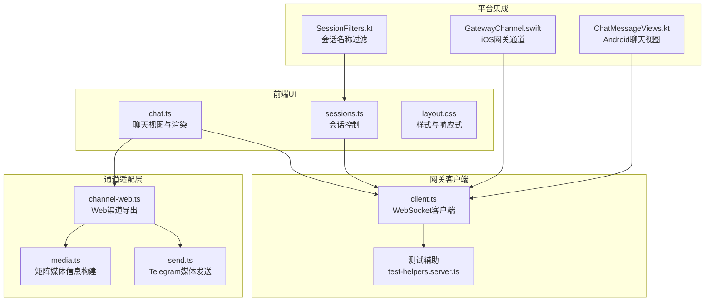
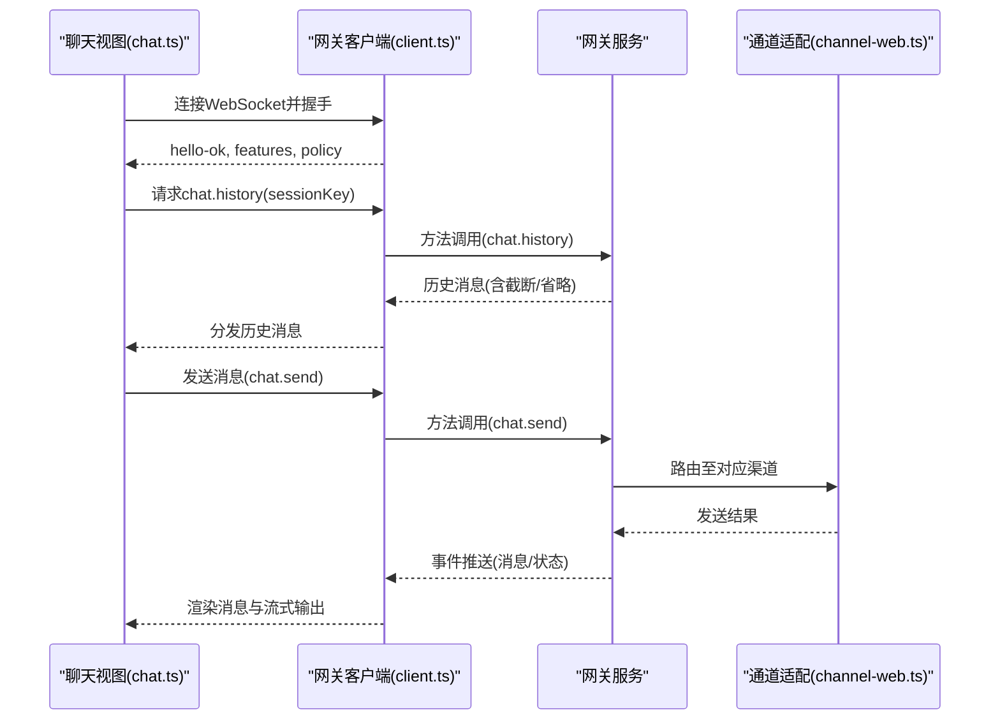
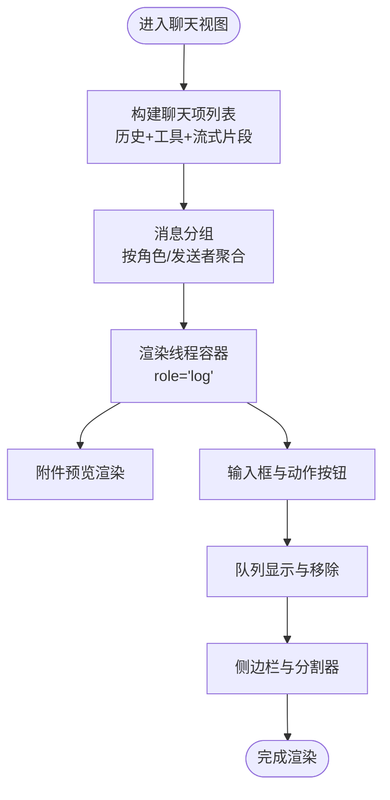
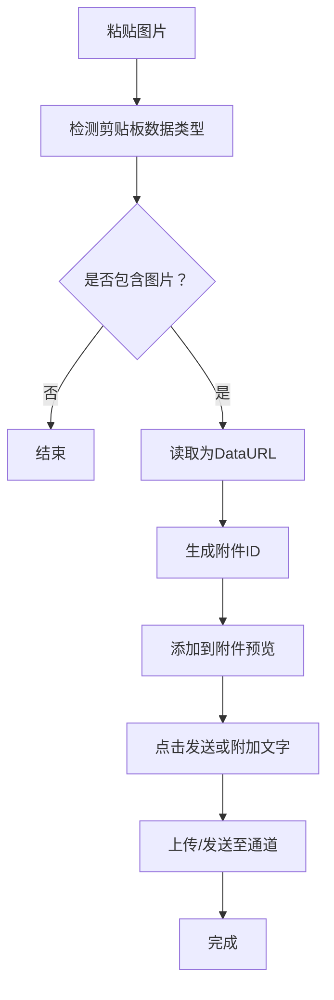
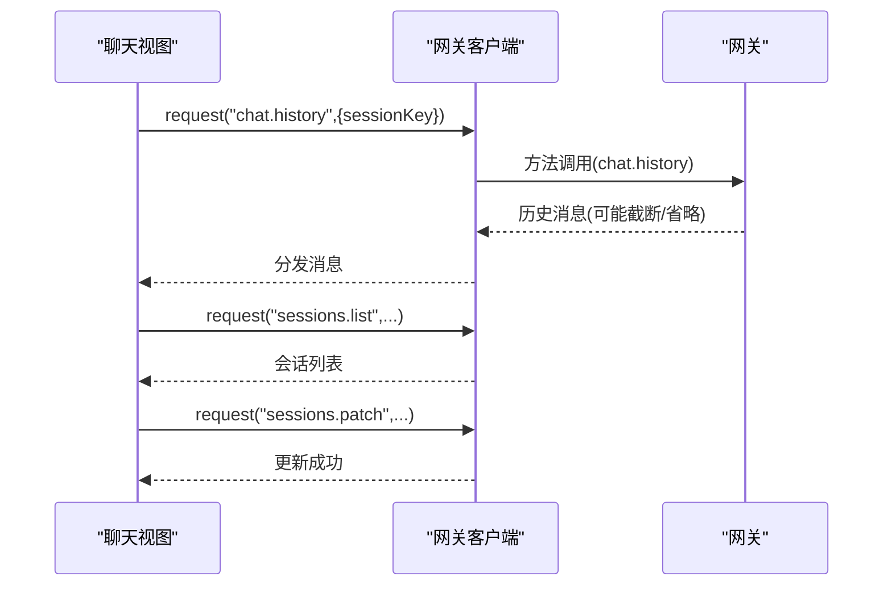
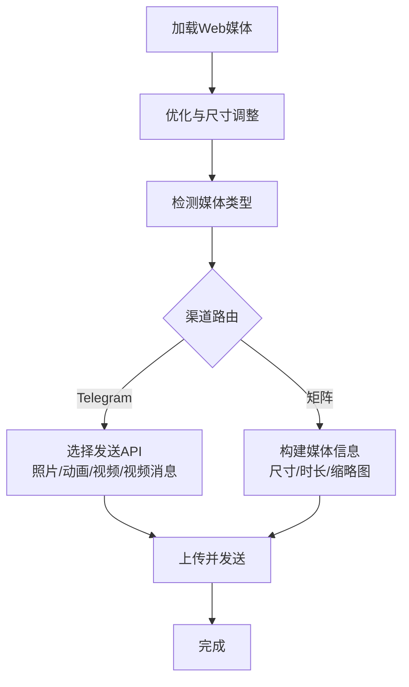
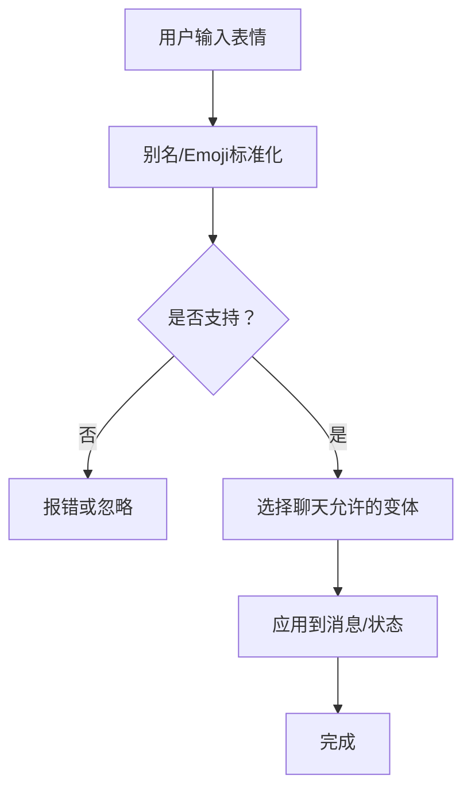
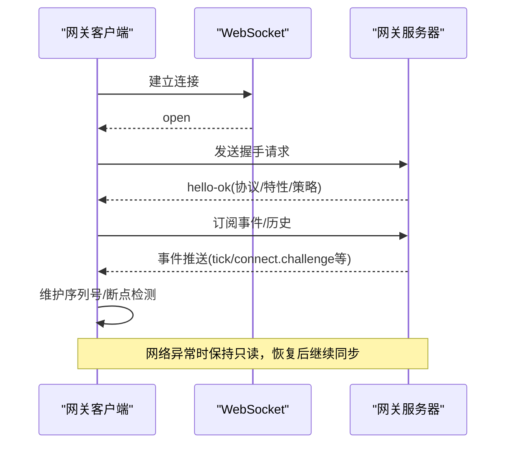
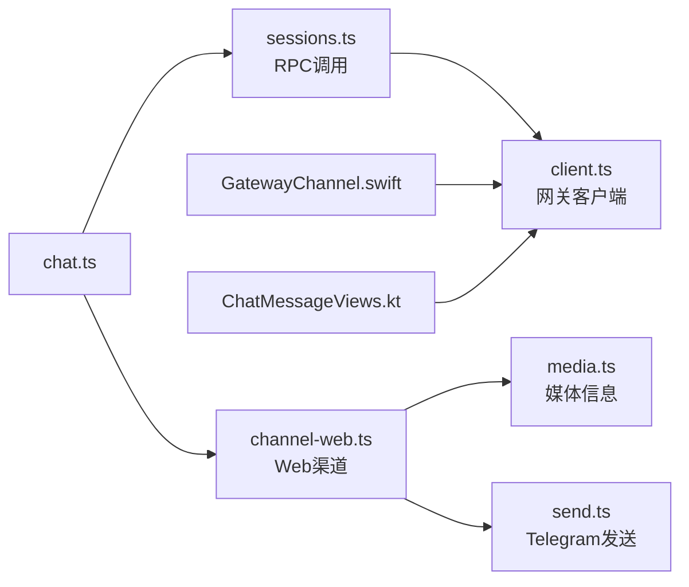

# WebChat界面

<cite>
**本文档引用的文件**
- [chat.ts](file://ui/src/ui/views/chat.ts)
- [webchat.md](file://docs/web/webchat.md)
- [channel-web.ts](file://src/channel-web.ts)
- [client.ts](file://src/gateway/client.ts)
- [sessions.ts](file://ui/src/ui/controllers/sessions.ts)
- [sessions-history-tool.ts](file://src/agents/tools/sessions-history-tool.ts)
- [layout.css](file://ui/src/styles/chat/layout.css)
- [chat.ts](file://apps/android/app/src/main/java/ai/openclaw/app/ui/chat/ChatMessageViews.kt)
- [SessionFilters.kt](file://apps/android/app/src/main/java/ai/openclaw/app/ui/chat/SessionFilters.kt)
- [test-helpers.server.ts](file://src/gateway/test-helpers.server.ts)
- [GatewayChannel.swift](file://apps/shared/OpenClawKit/Sources/OpenClawKit/GatewayChannel.swift)
- [media.ts](file://extensions/matrix/src/matrix/send/media.ts)
- [send.ts](file://src/telegram/send.ts)
- [groups.md](file://docs/channels/groups.md)
- [bluebubbles reactions.ts](file://extensions/bluebubbles/src/reactions.ts)
- [status-reaction-variants.ts](file://src/telegram/status-reaction-variants.ts)
</cite>

## 目录

1. [简介](#简介)
2. [项目结构](#项目结构)
3. [核心组件](#核心组件)
4. [架构总览](#架构总览)
5. [详细组件分析](#详细组件分析)
6. [依赖关系分析](#依赖关系分析)
7. [性能考虑](#性能考虑)
8. [故障排除指南](#故障排除指南)
9. [结论](#结论)
10. [附录](#附录)

## 简介

本文件系统性阐述WebChat界面的设计与实现，覆盖实时聊天、消息收发、界面布局、消息历史、输入框功能、多媒体消息、文件传输、表情反应、聊天室与群组管理、隐私策略以及WebSocket连接、消息同步与离线处理等主题。文档基于仓库中的UI实现、网关协议、通道适配层与平台集成进行综合分析，帮助开发者与运维人员快速理解并部署WebChat。

## 项目结构

WebChat界面由前端UI、网关客户端、通道适配层与平台集成四部分组成：

- 前端UI：负责渲染聊天线程、输入框、附件预览、队列与占位提示等。
- 网关客户端：封装WebSocket连接、请求/响应、事件订阅与重连逻辑。
- 通道适配层：抽象Web渠道的登录、会话、入站监听与出站发送。
- 平台集成：在不同平台上通过原生UI或移动端框架接入网关。

**图表来源**

- [chat.ts:241-481](file://ui/src/ui/views/chat.ts#L241-L481)
- [client.ts:43-96](file://src/gateway/client.ts#L43-L96)
- [channel-web.ts:1-34](file://src/channel-web.ts#L1-L34)
- [media.ts:1-60](file://extensions/matrix/src/matrix/send/media.ts#L1-L60)
- [send.ts:760-857](file://src/telegram/send.ts#L760-L857)
- [GatewayChannel.swift:592-622](file://apps/shared/OpenClawKit/Sources/OpenClawKit/GatewayChannel.swift#L592-L622)
- [ChatMessageViews.kt:71-108](file://apps/android/app/src/main/java/ai/openclaw/app/ui/chat/ChatMessageViews.kt#L71-L108)
- [SessionFilters.kt:1-29](file://apps/android/app/src/main/java/ai/openclaw/app/ui/chat/SessionFilters.kt#L1-L29)
- [test-helpers.server.ts:661-704](file://src/gateway/test-helpers.server.ts#L661-L704)

**章节来源**

- [chat.ts:241-481](file://ui/src/ui/views/chat.ts#L241-L481)
- [webchat.md:1-62](file://docs/web/webchat.md#L1-L62)
- [channel-web.ts:1-34](file://src/channel-web.ts#L1-L34)

## 核心组件

- 聊天视图与渲染：负责消息分组、流式输出、占位提示、附件预览、滚动控制与侧边栏。
- 会话控制器：提供会话列表、会话补丁更新、删除会话等操作。
- 网关客户端：封装WebSocket连接、心跳、事件广播、序列号断点检测与重连。
- 通道适配层：统一Web渠道的登录、会话、入站监听与出站发送接口。
- 多媒体与文件传输：针对不同渠道的媒体类型识别、尺寸与格式转换、上传与发送。
- 表情反应：跨渠道的表情别名标准化与变体选择。
- 群组与隐私策略：群组访问控制、提及门禁与工具策略。

**章节来源**

- [chat.ts:1-120](file://ui/src/ui/views/chat.ts#L1-L120)
- [sessions.ts:60-127](file://ui/src/ui/controllers/sessions.ts#L60-L127)
- [client.ts:43-96](file://src/gateway/client.ts#L43-L96)
- [channel-web.ts:1-34](file://src/channel-web.ts#L1-L34)
- [media.ts:1-60](file://extensions/matrix/src/matrix/send/media.ts#L1-L60)
- [send.ts:760-857](file://src/telegram/send.ts#L760-L857)
- [bluebubbles reactions.ts:16-133](file://extensions/bluebubbles/src/reactions.ts#L16-L133)
- [status-reaction-variants.ts:175-226](file://src/telegram/status-reaction-variants.ts#L175-L226)
- [groups.md:1-39](file://docs/channels/groups.md#L1-L39)

## 架构总览

WebChat采用“前端UI + 网关客户端 + 通道适配层”的分层设计，前端通过WebSocket与网关通信，使用标准方法如chat.history、chat.send、chat.inject进行消息同步与交互。群组策略与提及门禁在通道层统一处理，确保跨渠道一致性。

**图表来源**

- [chat.ts:241-481](file://ui/src/ui/views/chat.ts#L241-L481)
- [client.ts:43-96](file://src/gateway/client.ts#L43-L96)
- [channel-web.ts:1-34](file://src/channel-web.ts#L1-L34)
- [webchat.md:24-32](file://docs/web/webchat.md#L24-L32)

**章节来源**

- [webchat.md:24-32](file://docs/web/webchat.md#L24-L32)
- [chat.ts:241-481](file://ui/src/ui/views/chat.ts#L241-L481)

## 详细组件分析

### 聊天界面布局与消息渲染

- 线程容器：承载消息、分隔符、阅读指示与流式片段，支持滚动与可访问性标注。
- 消息分组：按角色与发送者聚合连续消息，减少渲染碎片。
- 流式输出：将分段文本与工具卡片交错展示，保证视觉顺序正确。
- 占位提示：根据连接状态与附件数量动态调整输入框提示文案。
- 侧边栏与分割：支持可调整比例的主侧布局，便于查看上下文。
- 队列与占位：显示待发送队列，支持移除与跳转到底部。

**图表来源**

- [chat.ts:485-637](file://ui/src/ui/views/chat.ts#L485-L637)
- [chat.ts:241-481](file://ui/src/ui/views/chat.ts#L241-L481)

**章节来源**

- [chat.ts:241-481](file://ui/src/ui/views/chat.ts#L241-L481)
- [chat.ts:485-637](file://ui/src/ui/views/chat.ts#L485-L637)

### 输入框与附件功能

- 文本域自适应高度：输入时自动调整高度，粘贴图片时生成附件预览。
- 快捷键支持：回车发送、Shift+回车换行；组合输入法中止。
- 附件管理：支持多张图片粘贴，生成临时ID，支持移除与批量发送。
- 提示文案：根据连接状态与附件数量动态提示。

**图表来源**

- [chat.ts:166-205](file://ui/src/ui/views/chat.ts#L166-L205)
- [chat.ts:207-239](file://ui/src/ui/views/chat.ts#L207-L239)

**章节来源**

- [chat.ts:166-205](file://ui/src/ui/views/chat.ts#L166-L205)
- [chat.ts:207-239](file://ui/src/ui/views/chat.ts#L207-L239)

### 消息历史记录与同步

- 历史获取：通过chat.history按会话键拉取最近消息，支持限制数量。
- 截断与省略：长文本字段可能被截断，重型元数据可能被省略，超大条目替换为占位提示。
- 同步策略：UI始终从网关获取历史，不依赖本地文件监控；网关持久化中断后的部分输出并在UI中标记。
- 会话管理：sessions.list列出会话，sessions.patch更新会话属性，sessions.delete删除会话并归档转录。

**图表来源**

- [chat.ts:532-614](file://ui/src/ui/views/chat.ts#L532-L614)
- [sessions.ts:60-127](file://ui/src/ui/controllers/sessions.ts#L60-L127)
- [sessions-history-tool.ts:235-270](file://src/agents/tools/sessions-history-tool.ts#L235-L270)
- [webchat.md:26-32](file://docs/web/webchat.md#L26-L32)

**章节来源**

- [chat.ts:532-614](file://ui/src/ui/views/chat.ts#L532-L614)
- [sessions.ts:60-127](file://ui/src/ui/controllers/sessions.ts#L60-L127)
- [sessions-history-tool.ts:235-270](file://src/agents/tools/sessions-history-tool.ts#L235-L270)
- [webchat.md:26-32](file://docs/web/webchat.md#L26-L32)

### 多媒体消息与文件传输

- 图像优化：Web渠道对图像进行压缩与尺寸调整，遵循渠道最大字节数限制。
- 媒体类型识别：根据MIME类型与文件名推断媒体种类，区分图片、视频、音频与文档。
- 渠道特定发送：Telegram根据媒体类型选择具体API（照片、动画、视频、视频消息等）。
- 矩阵媒体信息：构建尺寸、时长、缩略图等元信息，确保兼容性。

**图表来源**

- [send.ts:760-857](file://src/telegram/send.ts#L760-L857)
- [media.ts:1-60](file://extensions/matrix/src/matrix/send/media.ts#L1-L60)

**章节来源**

- [send.ts:760-857](file://src/telegram/send.ts#L760-L857)
- [media.ts:1-60](file://extensions/matrix/src/matrix/send/media.ts#L1-L60)

### 表情反应与群组功能

- 表情别名标准化：支持多种别名与Emoji映射，统一到标准类型（like/love/laugh等）。
- 变体选择：在Telegram中根据聊天允许的Emoji集合选择最合适的变体。
- 群组策略：群组默认限制（allowlist），需要提及才触发回复；支持房间级配置与通配符配置。

**图表来源**

- [bluebubbles reactions.ts:16-133](file://extensions/bluebubbles/src/reactions.ts#L16-L133)
- [status-reaction-variants.ts:175-226](file://src/telegram/status-reaction-variants.ts#L175-L226)
- [groups.md:17-39](file://docs/channels/groups.md#L17-L39)

**章节来源**

- [bluebubbles reactions.ts:16-133](file://extensions/bluebubbles/src/reactions.ts#L16-L133)
- [status-reaction-variants.ts:175-226](file://src/telegram/status-reaction-variants.ts#L175-L226)
- [groups.md:17-39](file://docs/channels/groups.md#L17-L39)

### WebSocket连接、消息同步与离线处理

- 连接握手：客户端发起连接，等待hello-ok确认，获取协议版本、特性与策略。
- 事件处理：区分响应帧与事件帧，维护序列号，检测断点并广播gap事件。
- 心跳与保活：周期性tick事件用于保活与健康检查。
- 离线策略：网关不可达时，WebChat为只读；连接恢复后继续同步历史与事件。

**图表来源**

- [client.ts:43-96](file://src/gateway/client.ts#L43-L96)
- [GatewayChannel.swift:592-622](file://apps/shared/OpenClawKit/Sources/OpenClawKit/GatewayChannel.swift#L592-L622)
- [test-helpers.server.ts:661-704](file://src/gateway/test-helpers.server.ts#L661-L704)
- [webchat.md:24-32](file://docs/web/webchat.md#L24-L32)

**章节来源**

- [client.ts:43-96](file://src/gateway/client.ts#L43-L96)
- [GatewayChannel.swift:592-622](file://apps/shared/OpenClawKit/Sources/OpenClawKit/GatewayChannel.swift#L592-L622)
- [test-helpers.server.ts:661-704](file://src/gateway/test-helpers.server.ts#L661-L704)
- [webchat.md:24-32](file://docs/web/webchat.md#L24-L32)

## 依赖关系分析

- UI依赖网关客户端进行消息同步与会话管理；会话控制器通过RPC调用sessions.\*方法。
- 通道适配层统一Web渠道能力，向网关暴露login、monitor、sendMessage等接口。
- 不同平台（iOS、Android）通过各自原生UI接入网关，共享相同的网关协议与策略。

**图表来源**

- [chat.ts:241-481](file://ui/src/ui/views/chat.ts#L241-L481)
- [sessions.ts:60-127](file://ui/src/ui/controllers/sessions.ts#L60-L127)
- [client.ts:43-96](file://src/gateway/client.ts#L43-L96)
- [channel-web.ts:1-34](file://src/channel-web.ts#L1-L34)
- [media.ts:1-60](file://extensions/matrix/src/matrix/send/media.ts#L1-L60)
- [send.ts:760-857](file://src/telegram/send.ts#L760-L857)
- [GatewayChannel.swift:592-622](file://apps/shared/OpenClawKit/Sources/OpenClawKit/GatewayChannel.swift#L592-L622)
- [ChatMessageViews.kt:71-108](file://apps/android/app/src/main/java/ai/openclaw/app/ui/chat/ChatMessageViews.kt#L71-L108)

**章节来源**

- [chat.ts:241-481](file://ui/src/ui/views/chat.ts#L241-L481)
- [sessions.ts:60-127](file://ui/src/ui/controllers/sessions.ts#L60-L127)
- [client.ts:43-96](file://src/gateway/client.ts#L43-L96)
- [channel-web.ts:1-34](file://src/channel-web.ts#L1-L34)

## 性能考虑

- 历史渲染限制：UI仅渲染最近N条消息，隐藏多余条目并通过系统提示告知。
- 媒体优化：图像压缩与尺寸调整降低传输开销，避免超限。
- 流式渲染：交错展示流式文本与工具卡片，提升感知性能。
- 响应式布局：移动端堆叠输入区域与按钮，减少重排成本。

**章节来源**

- [chat.ts:483-484](file://ui/src/ui/views/chat.ts#L483-L484)
- [layout.css:446-481](file://ui/src/styles/chat/layout.css#L446-L481)

## 故障排除指南

- 连接失败：检查网关端口与认证配置，确认WebSocket握手成功。
- 无消息：确认已订阅chat.subscribe并成功拉取chat.history。
- 离线只读：网关不可达时UI为只读，恢复网络后自动同步。
- 序列断点：客户端检测到事件序列异常时会广播gap事件，需关注重连与重放策略。

**章节来源**

- [webchat.md:24-32](file://docs/web/webchat.md#L24-L32)
- [GatewayChannel.swift:603-622](file://apps/shared/OpenClawKit/Sources/OpenClawKit/GatewayChannel.swift#L603-L622)
- [test-helpers.server.ts:661-704](file://src/gateway/test-helpers.server.ts#L661-L704)

## 结论

WebChat界面以清晰的分层架构实现了跨平台的实时聊天体验：前端负责渲染与交互，网关客户端保障连接稳定与事件同步，通道适配层统一多渠道能力，配合群组策略与表情反应机制，满足多样化的消息场景。通过历史截断、媒体优化与响应式布局，系统在性能与可用性之间取得平衡。

## 附录

- 配置参考：WebChat使用网关端点与认证参数，无需独立配置块。
- 远程使用：可通过SSH/Tailscale隧道访问远程网关WebSocket。

**章节来源**

- [webchat.md:42-62](file://docs/web/webchat.md#L42-L62)
