# WebChat界面

<cite>
**本文档引用的文件**
- [chat.ts](file://ui/src/ui/views/chat.ts)
- [webchat.md](file://docs/web/webchat.md)
- [channel-web.ts](file://src/channel-web.ts)
- [client.ts](file://src/gateway/client.ts)
- [sessions.ts](file://ui/src/ui/controllers/sessions.ts)
- [sessions-history-tool.ts](file://src/agents/tools/sessions-history-tool.ts)
- [layout.css](file://ui/src/styles/chat/layout.css)
- [ChatPage.tsx](file://ui-react/src/pages/ChatPage.tsx)
- [ChatSidebar.tsx](file://ui-react/src/components/chat/ChatSidebar.tsx)
- [markdown-components.tsx](file://ui-react/src/components/chat/markdown-components.tsx)
- [chat.store.ts](file://ui-react/src/store/chat.store.ts)
- [useChatEventBridge.ts](file://ui-react/src/hooks/useChatEventBridge.ts)
- [useSessionManager.ts](file://ui-react/src/hooks/useSessionManager.ts)
- [GatewayChatRuntimeProvider.tsx](file://ui-react/src/components/chat/GatewayChatRuntimeProvider.tsx)
- [ThreadView.tsx](file://ui-react/src/components/chat/ThreadView.tsx)
- [SessionSelector.tsx](file://ui-react/src/components/chat/SessionSelector.tsx)
- [Composer.tsx](file://ui-react/src/components/chat/Composer.tsx)
- [AssistantMessage.tsx](file://ui-react/src/components/chat/AssistantMessage.tsx)
- [UserMessage.tsx](file://ui-react/src/components/chat/UserMessage.tsx)
- [ToolFallback.tsx](file://ui-react/src/components/chat/ToolFallback.tsx)
- [gateway.store.ts](file://ui-react/src/store/gateway.store.ts)
- [settings.store.ts](file://ui-react/src/store/settings.store.ts)
- [router.tsx](file://ui-react/src/router.tsx)
- [vite.config.ts](file://ui-react/vite.config.ts)
- [package.json](file://ui-react/package.json)
- [ChatMessageViews.kt](file://apps/android/app/src/main/java/ai/openclaw/app/ui/chat/ChatMessageViews.kt)
- [SessionFilters.kt](file://apps/android/app/src/main/java/ai/openclaw/app/ui/chat/SessionFilters.kt)
- [test-helpers.server.ts](file://src/gateway/test-helpers.server.ts)
- [GatewayChannel.swift](file://apps/shared/OpenClawKit/Sources/OpenClawKit/GatewayChannel.swift)
- [media.ts](file://extensions/matrix/src/matrix/send/media.ts)
- [send.ts](file://src/telegram/send.ts)
- [groups.md](file://docs/channels/groups.md)
- [bluebubbles reactions.ts](file://extensions/bluebubbles/src/reactions.ts)
- [status-reaction-variants.ts](file://src/telegram/status-reaction-variants.ts)
- [chat-attachments.ts](file://src/gateway/chat-attachments.ts)
- [attachments.normalize.ts](file://src/media-understanding/attachments.normalize.ts)
</cite>

## 更新摘要
**所做更改**
- 新增Composer组件的拖拽上传、实时预览、文件类型验证等重大改进功能
- 更新UserMessage组件对附件的改进显示功能
- 新增文件大小限制、数量限制和MIME类型验证的详细说明
- 更新附件预览组件的实时删除和错误处理功能
- 新增拖拽上传状态指示和视觉反馈机制

## 目录
1. [简介](#简介)
2. [项目结构](#项目结构)
3. [核心组件](#核心组件)
4. [架构总览](#架构总览)
5. [详细组件分析](#详细组件分析)
6. [依赖关系分析](#依赖关系分析)
7. [性能考虑](#性能考虑)
8. [故障排除指南](#故障排除指南)
9. [结论](#结论)
10. [附录](#附录)

## 简介
本文件系统性阐述WebChat界面的设计与实现，覆盖实时聊天、消息收发、界面布局、消息历史、输入框功能、多媒体消息、文件传输、表情反应、聊天室与群组管理、隐私策略以及WebSocket连接、消息同步与离线处理等主题。文档基于仓库中的UI实现、网关协议、通道适配层与平台集成进行综合分析，帮助开发者与运维人员快速理解并部署WebChat。

**更新** 本版本重点反映了聊天组件的重大改进，包括Composer组件的拖拽上传、实时预览、文件类型验证等功能，以及UserMessage组件对附件的改进显示。

## 项目结构
WebChat界面现已迁移到React架构，由前端UI、网关客户端、通道适配层与平台集成四部分组成：
- 前端UI（React架构）：使用React 19、Zustand状态管理、Assistant UI组件库，负责渲染聊天线程、输入框、附件预览、队列与占位提示等。
- 网关客户端：封装WebSocket连接、请求/响应、事件订阅与重连逻辑。
- 通道适配层：抽象Web渠道的登录、会话、入站监听与出站发送。
- 平台集成：在不同平台上通过原生UI或移动端框架接入网关。

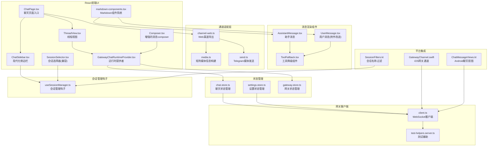

**图表来源**
- [ChatPage.tsx:1-96](file://ui-react/src/pages/ChatPage.tsx#L1-L96)
- [ChatSidebar.tsx:1-117](file://ui-react/src/components/chat/ChatSidebar.tsx#L1-L117)
- [markdown-components.tsx:1-174](file://ui-react/src/components/chat/markdown-components.tsx#L1-L174)
- [useSessionManager.ts:1-139](file://ui-react/src/hooks/useSessionManager.ts#L1-L139)
- [GatewayChatRuntimeProvider.tsx:1-270](file://ui-react/src/components/chat/GatewayChatRuntimeProvider.tsx#L1-L270)
- [chat.store.ts:1-247](file://ui-react/src/store/chat.store.ts#L1-L247)
- [settings.store.ts:1-222](file://ui-react/src/store/settings.store.ts#L1-L222)

**章节来源**
- [ChatPage.tsx:1-96](file://ui-react/src/pages/ChatPage.tsx#L1-L96)
- [ChatSidebar.tsx:1-117](file://ui-react/src/components/chat/ChatSidebar.tsx#L1-L117)
- [markdown-components.tsx:1-174](file://ui-react/src/components/chat/markdown-components.tsx#L1-L174)
- [useSessionManager.ts:1-139](file://ui-react/src/hooks/useSessionManager.ts#L1-L139)
- [GatewayChatRuntimeProvider.tsx:1-270](file://ui-react/src/components/chat/GatewayChatRuntimeProvider.tsx#L1-L270)

## 核心组件
- **React聊天页面**：ChatPage作为根组件，整合会话选择器和线程视图，提供完整的聊天界面。
- **现代化侧边栏**：ChatSidebar提供品牌标识、会话列表管理和网关状态指示，替代传统的SessionSelector组件。
- **Markdown组件系统**：markdown-components.tsx提供共享的Markdown组件定义，支持assistant-ui上下文和独立使用两种模式。
- **会话管理钩子**：useSessionManager集中管理会话列表、历史加载、会话切换和新会话创建功能。
- **状态管理系统**：使用Zustand管理聊天状态、网关连接状态和设置状态，避免组件间复杂的数据传递。
- **消息渲染组件**：AssistantMessage、UserMessage和ToolFallback提供丰富的消息渲染能力，支持Markdown、工具调用和附件。
- **运行时提供者**：GatewayChatRuntimeProvider桥接Zustand状态与Assistant UI组件库，实现消息转换和事件处理。
- **事件桥接**：useChatEventBridge将网关事件转换为Zustand状态更新，保持组件解耦。
- **Composer组件**：提供富文本输入、附件上传和发送控制功能，支持拖拽上传、实时预览和文件类型验证。
- **增强的UserMessage组件**：改进的附件显示功能，支持文件标签和预览。
- **工具降级组件**：ToolFallback展示工具调用的分类、状态和详细信息。

**章节来源**
- [ChatPage.tsx:1-96](file://ui-react/src/pages/ChatPage.tsx#L1-L96)
- [ChatSidebar.tsx:1-117](file://ui-react/src/components/chat/ChatSidebar.tsx#L1-L117)
- [markdown-components.tsx:1-174](file://ui-react/src/components/chat/markdown-components.tsx#L1-L174)
- [useSessionManager.ts:1-139](file://ui-react/src/hooks/useSessionManager.ts#L1-L139)
- [chat.store.ts:1-247](file://ui-react/src/store/chat.store.ts#L1-L247)
- [GatewayChatRuntimeProvider.tsx:1-270](file://ui-react/src/components/chat/GatewayChatRuntimeProvider.tsx#L1-L270)
- [Composer.tsx:1-334](file://ui-react/src/components/chat/Composer.tsx#L1-L334)
- [UserMessage.tsx:1-152](file://ui-react/src/components/chat/UserMessage.tsx#L1-L152)

## 架构总览
WebChat采用"React前端 + Zustand状态管理 + Assistant UI组件库"的现代化架构，通过GatewayChatRuntimeProvider桥接网关事件与React组件。前端通过WebSocket与网关通信，使用标准方法如chat.history、chat.send、chat.inject进行消息同步与交互。群组策略与提及门禁在通道层统一处理，确保跨渠道一致性。

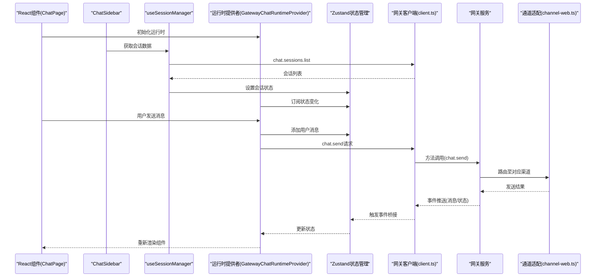

**图表来源**
- [ChatPage.tsx:9-12](file://ui-react/src/pages/ChatPage.tsx#L9-L12)
- [ChatSidebar.tsx:19-22](file://ui-react/src/components/chat/ChatSidebar.tsx#L19-L22)
- [useSessionManager.ts:19-139](file://ui-react/src/hooks/useSessionManager.ts#L19-L139)
- [GatewayChatRuntimeProvider.tsx:112-270](file://ui-react/src/components/chat/GatewayChatRuntimeProvider.tsx#L112-L270)

**章节来源**
- [webchat.md:24-32](file://docs/web/webchat.md#L24-L32)
- [ChatPage.tsx:1-96](file://ui-react/src/pages/ChatPage.tsx#L1-L96)
- [ChatSidebar.tsx:1-117](file://ui-react/src/components/chat/ChatSidebar.tsx#L1-L117)
- [useSessionManager.ts:1-139](file://ui-react/src/hooks/useSessionManager.ts#L1-L139)
- [GatewayChatRuntimeProvider.tsx:1-270](file://ui-react/src/components/chat/GatewayChatRuntimeProvider.tsx#L1-L270)

## 详细组件分析

### 增强的Composer组件
**更新** Composer组件现已实现拖拽上传、实时预览、文件类型验证等重大改进功能。

- **拖拽上传支持**：使用ComposerPrimitive.AttachmentDropzone实现拖拽上传功能，支持拖拽状态指示和视觉反馈。
- **实时文件预览**：AttachmentPreview组件提供待上传文件的实时预览，包括文件名、大小和删除按钮。
- **文件类型验证**：支持多种文件类型的验证，包括图片、PDF、Office文档等。
- **文件大小限制**：单文件5MB限制，总文件20MB限制，最多10个文件。
- **错误处理机制**：完善的错误处理，包括文件类型不支持、大小超限等错误提示。
- **删除功能**：支持实时删除待上传文件，提供一键移除功能。

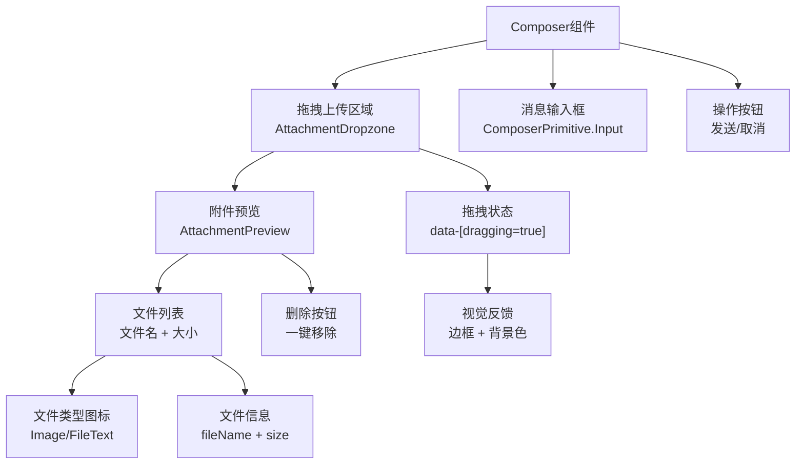

**图表来源**
- [Composer.tsx:237-334](file://ui-react/src/components/chat/Composer.tsx#L237-L334)
- [Composer.tsx:70-120](file://ui-react/src/components/chat/Composer.tsx#L70-L120)

**章节来源**
- [Composer.tsx:1-334](file://ui-react/src/components/chat/Composer.tsx#L1-L334)

### 改进的UserMessage组件
**更新** UserMessage组件现已改进附件显示功能。

- **附件标签显示**：在消息气泡上方右对齐显示附件标签，支持图片和文档类型。
- **文件类型图标**：根据文件类型显示相应的图标，图片使用Image图标，文档使用FileText图标。
- **文件信息展示**：显示文件名和文件大小，支持截断显示长文件名。
- **状态管理优化**：通过Zustand状态管理直接获取消息附件信息，绕过assistant-ui的复杂类型要求。
- **空附件处理**：当没有附件时自动隐藏附件区域，避免空白空间。

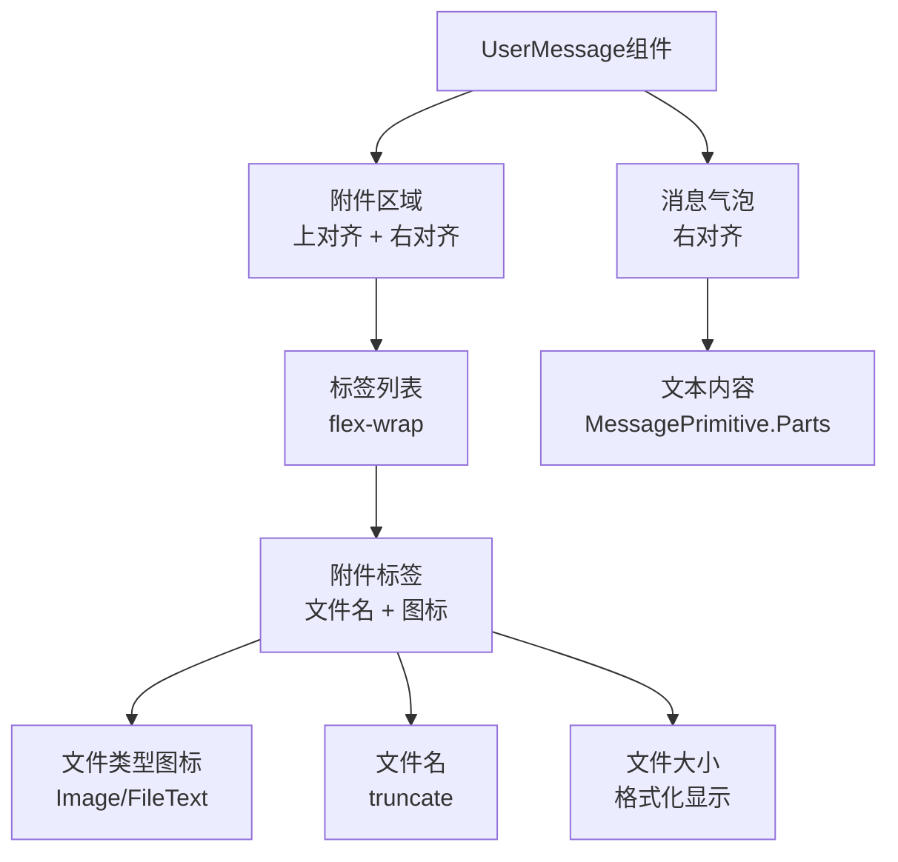

**图表来源**
- [UserMessage.tsx:15-152](file://ui-react/src/components/chat/UserMessage.tsx#L15-L152)
- [UserMessage.tsx:117-152](file://ui-react/src/components/chat/UserMessage.tsx#L117-L152)

**章节来源**
- [UserMessage.tsx:1-152](file://ui-react/src/components/chat/UserMessage.tsx#L1-L152)

### 文件上传验证系统
**更新** 新增完整的文件上传验证系统，包括大小限制、类型验证和错误处理。

- **文件大小验证**：单文件5MB限制，总文件20MB限制，实时计算当前总大小。
- **文件数量限制**：最多10个文件，防止过多文件同时上传。
- **MIME类型验证**：支持图片、PDF、Office文档等多种类型验证。
- **实时错误提示**：上传过程中实时显示错误信息，包括类型不支持、大小超限等。
- **Base64编码**：自动将文件转换为Base64格式，移除data URL前缀。

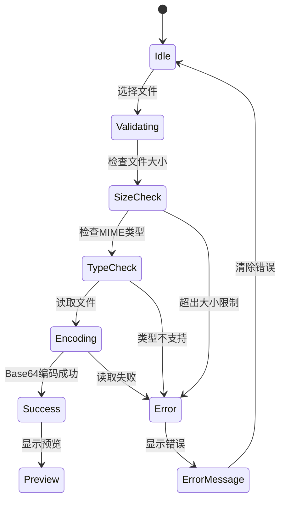

**图表来源**
- [Composer.tsx:135-207](file://ui-react/src/components/chat/Composer.tsx#L135-L207)

**章节来源**
- [Composer.tsx:12-52](file://ui-react/src/components/chat/Composer.tsx#L12-L52)
- [Composer.tsx:135-207](file://ui-react/src/components/chat/Composer.tsx#L135-L207)

### 增强的GatewayChatRuntimeProvider
- **内容块系统**：支持交错的文本和工具调用渲染，保持原始消息顺序。
- **流式渲染增强**：实时流式消息的增量更新和工具调用的有序插入。
- **消息转换优化**：convertMessage函数处理contentBlocks和toolCalls的复杂转换。
- **附件支持**：支持图像附件的解析和传输，增强多媒体消息功能。
- **运行时管理**：集成assistant-ui的ExternalStoreRuntime，提供完整的运行时支持。

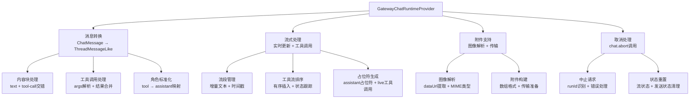

**图表来源**
- [GatewayChatRuntimeProvider.tsx:16-270](file://ui-react/src/components/chat/GatewayChatRuntimeProvider.tsx#L16-L270)

**章节来源**
- [GatewayChatRuntimeProvider.tsx:1-270](file://ui-react/src/components/chat/GatewayChatRuntimeProvider.tsx#L1-L270)

### Zustand状态管理系统
- **聊天状态管理**：chat.store.ts管理消息列表、流式输出、工具调用流和输入状态。
- **设置状态管理**：settings.store.ts管理用户偏好设置、网关配置和主题设置。
- **网关状态管理**：gateway.store.ts管理连接状态、事件日志和客户端实例。
- **状态同步**：通过useChatEventBridge将网关事件转换为状态更新，保持组件解耦。
- **工具流管理**：支持工具调用的完整生命周期，包括开始、运行、结果和错误状态。

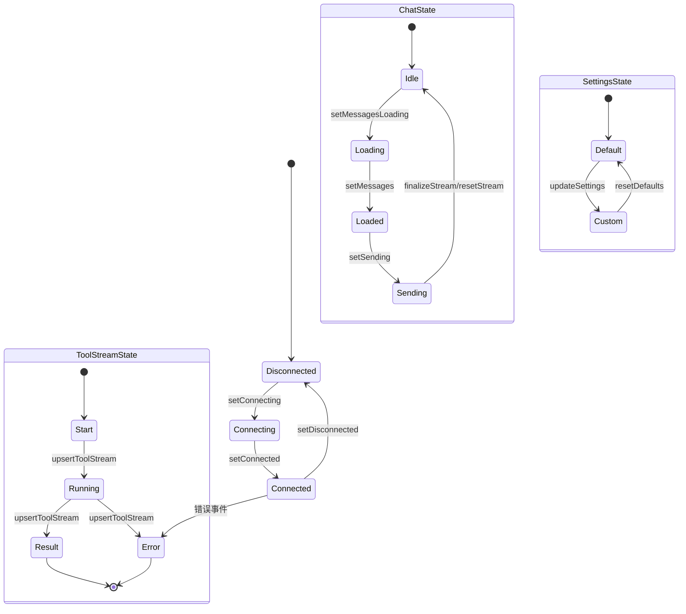

**图表来源**
- [gateway.store.ts:72-183](file://ui-react/src/store/gateway.store.ts#L72-L183)
- [chat.store.ts:135-229](file://ui-react/src/store/chat.store.ts#L135-L229)
- [settings.store.ts:193-222](file://ui-react/src/store/settings.store.ts#L193-L222)

**章节来源**
- [chat.store.ts:1-247](file://ui-react/src/store/chat.store.ts#L1-L247)
- [settings.store.ts:1-222](file://ui-react/src/store/settings.store.ts#L1-L222)
- [gateway.store.ts:1-184](file://ui-react/src/store/gateway.store.ts#L1-L184)

### 增强的消息渲染能力
- **内容块系统**：支持交错的文本和工具调用渲染，保持原始消息顺序。
- **Markdown支持**：AssistantMessage组件集成Markdown渲染，支持GFM语法。
- **工具调用可视化**：ToolFallback组件提供工具调用的分类、状态和详细信息展示。
- **附件支持**：UserMessage组件支持图片附件的预览和渲染。
- **流式渲染**：支持实时流式消息的增量更新和最终合并。

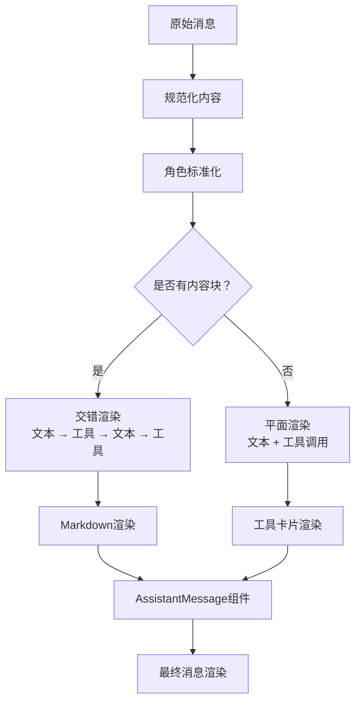

**图表来源**
- [GatewayChatRuntimeProvider.tsx:16-100](file://ui-react/src/components/chat/GatewayChatRuntimeProvider.tsx#L16-L100)
- [AssistantMessage.tsx:22-150](file://ui-react/src/components/chat/AssistantMessage.tsx#L22-L150)
- [ToolFallback.tsx:45-150](file://ui-react/src/components/chat/ToolFallback.tsx#L45-L150)

**章节来源**
- [GatewayChatRuntimeProvider.tsx:1-270](file://ui-react/src/components/chat/GatewayChatRuntimeProvider.tsx#L1-L270)
- [AssistantMessage.tsx:1-240](file://ui-react/src/components/chat/AssistantMessage.tsx#L1-L240)
- [ToolFallback.tsx:1-451](file://ui-react/src/components/chat/ToolFallback.tsx#L1-L451)

### 工具集成功能
- **工具分类系统**：根据工具名称自动分类为read、write、exec、search、web、database、file、function等类别。
- **状态跟踪**：支持工具调用的完整生命周期状态跟踪和可视化。
- **详细信息展示**：通过抽屉式对话框展示工具调用的参数、结果和错误信息。
- **交互式操作**：支持工具调用的重新执行、取消和查看详情操作。

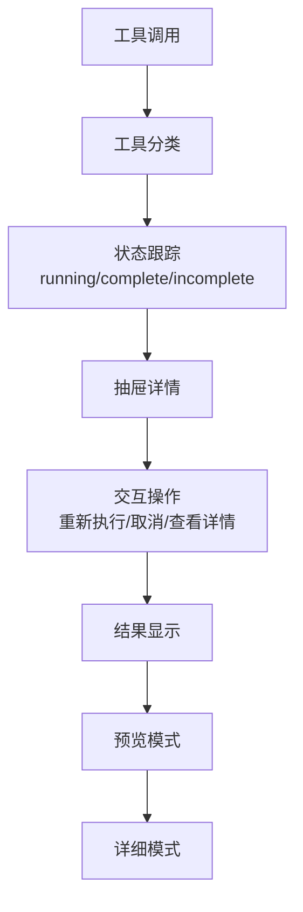

**图表来源**
- [ToolFallback.tsx:45-150](file://ui-react/src/components/chat/ToolFallback.tsx#L45-L150)
- [ToolFallback.tsx:214-316](file://ui-react/src/components/chat/ToolFallback.tsx#L214-L316)

**章节来源**
- [ToolFallback.tsx:1-451](file://ui-react/src/components/chat/ToolFallback.tsx#L1-L451)

### 会话管理
- **会话列表**：通过chat.sessions.list获取会话列表，支持动态刷新。
- **会话切换**：切换会话时自动加载对应的历史消息。
- **新会话创建**：支持创建新会话并自动切换到新会话。
- **历史加载**：支持按会话键加载历史消息，处理同步和异步响应。

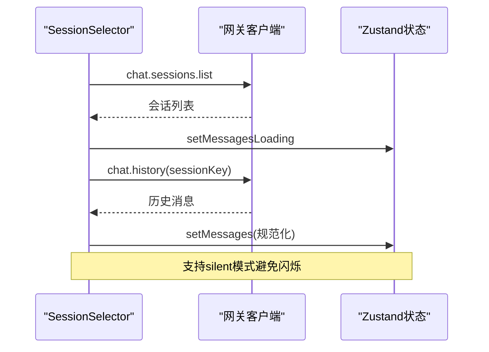

**图表来源**
- [SessionSelector.tsx:34-90](file://ui-react/src/components/chat/SessionSelector.tsx#L34-L90)

**章节来源**
- [SessionSelector.tsx:1-212](file://ui-react/src/components/chat/SessionSelector.tsx#L1-L212)

### WebSocket连接、消息同步与离线处理
- **连接管理**：gateway.store.ts管理连接状态、事件处理和错误恢复。
- **事件桥接**：useChatEventBridge将网关事件转换为状态更新，支持聊天、工具和代理事件。
- **状态同步**：通过注册回调函数实现跨模块的状态同步，避免循环依赖。
- **离线策略**：连接断开时提供清晰的错误状态和重连机制。

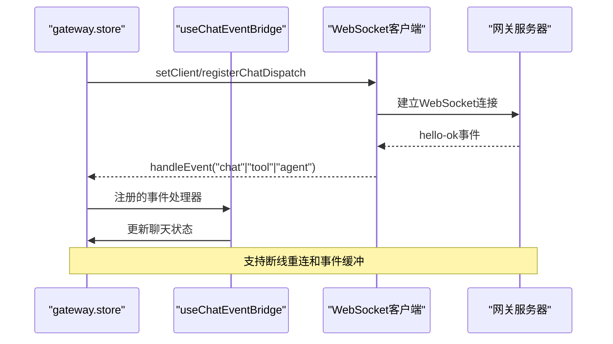

**图表来源**
- [gateway.store.ts:128-167](file://ui-react/src/store/gateway.store.ts#L128-L167)
- [useChatEventBridge.ts:273-471](file://ui-react/src/hooks/useChatEventBridge.ts#L273-L471)

**章节来源**
- [gateway.store.ts:1-184](file://ui-react/src/store/gateway.store.ts#L1-L184)
- [useChatEventBridge.ts:1-472](file://ui-react/src/hooks/useChatEventBridge.ts#L1-L472)

## 依赖关系分析
- **React组件依赖**：所有React组件通过GatewayChatRuntimeProvider访问状态管理，避免直接导入Zustand。
- **状态管理解耦**：useChatEventBridge通过回调函数注册机制避免循环依赖，保持模块边界清晰。
- **Assistant UI集成**：使用@assistant-ui/react系列包提供统一的UI组件和运行时支持。
- **Tailwind CSS**：使用Tailwind 4.x提供现代化的样式系统，支持响应式设计。
- **组件系统集成**：ChatSidebar替代SessionSelector，提供更丰富的会话管理功能。
- **文件上传依赖**：Composer组件依赖FileReader API进行文件读取和Base64编码。

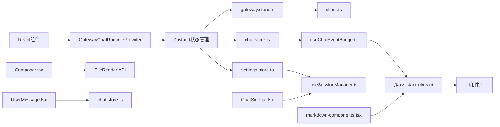

**图表来源**
- [ChatPage.tsx:1-96](file://ui-react/src/pages/ChatPage.tsx#L1-L96)
- [GatewayChatRuntimeProvider.tsx:1-270](file://ui-react/src/components/chat/GatewayChatRuntimeProvider.tsx#L1-L270)
- [chat.store.ts:1-247](file://ui-react/src/store/chat.store.ts#L1-L247)
- [settings.store.ts:1-222](file://ui-react/src/store/settings.store.ts#L1-L222)
- [gateway.store.ts:1-184](file://ui-react/src/store/gateway.store.ts#L1-L184)

**章节来源**
- [ChatPage.tsx:1-96](file://ui-react/src/pages/ChatPage.tsx#L1-L96)
- [GatewayChatRuntimeProvider.tsx:1-270](file://ui-react/src/components/chat/GatewayChatRuntimeProvider.tsx#L1-L270)
- [chat.store.ts:1-247](file://ui-react/src/store/chat.store.ts#L1-L247)
- [settings.store.ts:1-222](file://ui-react/src/store/settings.store.ts#L1-L222)
- [gateway.store.ts:1-184](file://ui-react/src/store/gateway.store.ts#L1-L184)

## 性能考虑
- **状态管理优化**：使用Zustand替代Redux，减少不必要的状态更新和组件重渲染。
- **组件懒加载**：React.lazy和Suspense支持大型组件的按需加载。
- **虚拟化支持**：Assistant UI组件支持消息列表的虚拟化渲染，提高大数据量场景下的性能。
- **事件桥接优化**：useChatEventBridge通过事件过滤和状态缓存减少重复渲染。
- **资源复用**：vite.config.ts配置公共资源目录，避免重复构建静态资源。
- **内容块优化**：GatewayChatRuntimeProvider优化contentBlocks的处理，减少不必要的渲染。
- **会话管理缓存**：useSessionManager实现会话列表缓存，避免频繁的API调用。
- **文件上传优化**：Composer组件使用Base64编码，避免大文件阻塞UI线程。
- **实时预览优化**：AttachmentPreview组件使用虚拟化列表，支持大量文件的高效渲染。

**章节来源**
- [vite.config.ts:13-14](file://ui-react/vite.config.ts#L13-L14)
- [package.json:11-42](file://ui-react/package.json#L11-L42)
- [GatewayChatRuntimeProvider.tsx:132-197](file://ui-react/src/components/chat/GatewayChatRuntimeProvider.tsx#L132-L197)
- [useSessionManager.ts:28-42](file://ui-react/src/hooks/useSessionManager.ts#L28-L42)
- [Composer.tsx:135-207](file://ui-react/src/components/chat/Composer.tsx#L135-L207)

## 故障排除指南
- **连接失败**：检查网关端口与认证配置，确认WebSocket握手成功，查看gateway.store的错误状态。
- **无消息**：确认已订阅chat.subscribe并成功拉取chat.history，检查useChatEventBridge的事件处理。
- **组件渲染问题**：检查GatewayChatRuntimeProvider的运行时配置，验证消息转换函数的正确性。
- **状态同步问题**：确认useChatEventBridge的回调注册正常，检查Zustand状态的更新时机。
- **工具调用异常**：检查ToolFallback的分类和状态处理，验证工具调用的生命周期管理。
- **会话管理问题**：检查useSessionManager的API调用，确认chat.sessions.list和chat.history的成功响应。
- **侧边栏显示问题**：确认ChatSidebar的依赖注入正常，检查useSessionManager钩子的状态返回。
- **文件上传失败**：检查文件大小限制、MIME类型验证和Base64编码过程，确认FileReader API正常工作。
- **拖拽上传无效**：检查ComposerPrimitive.AttachmentDropzone的CSS类和data-[dragging]状态，确认拖拽事件处理正常。

**章节来源**
- [gateway.store.ts:115-126](file://ui-react/src/store/gateway.store.ts#L115-L126)
- [useChatEventBridge.ts:273-471](file://ui-react/src/hooks/useChatEventBridge.ts#L273-L471)
- [GatewayChatRuntimeProvider.tsx:227-236](file://ui-react/src/components/chat/GatewayChatRuntimeProvider.tsx#L227-L236)
- [useSessionManager.ts:28-42](file://ui-react/src/hooks/useSessionManager.ts#L28-L42)
- [ChatSidebar.tsx:19-22](file://ui-react/src/components/chat/ChatSidebar.tsx#L19-L22)
- [Composer.tsx:135-207](file://ui-react/src/components/chat/Composer.tsx#L135-L207)

## 结论
WebChat界面已完成从传统Lit框架向现代React架构的重大迁移，采用"React + Zustand + Assistant UI"的技术栈实现了更加现代化和可维护的聊天体验。新的架构通过组件化设计、状态管理和事件桥接机制，提供了更好的开发体验和用户体验。

**更新** 本次更新重点反映了聊天组件的重大改进，包括Composer组件的拖拽上传、实时预览、文件类型验证等功能，以及UserMessage组件对附件的改进显示。这些改进显著提升了文件上传的用户体验，提供了更直观的文件管理界面和更严格的文件验证机制。

通过新增的ChatSidebar组件、增强的useSessionManager钩子、markdown-components.tsx组件系统，以及GatewayChatRuntimeProvider的全面增强，系统在性能与可用性之间取得了更好的平衡，为未来的功能扩展奠定了坚实的基础。

## 附录
- **配置参考**：WebChat使用网关端点与认证参数，React构建配置独立于传统UI，输出到独立的dist目录。
- **开发环境**：使用Vite 7.3.1提供开发服务器，支持热重载和TypeScript编译。
- **生产部署**：构建输出到dist/control-ui-react目录，避免与现有Lit UI冲突。
- **组件兼容性**：SessionSelector组件保留向后兼容性，但不再作为独立组件使用。
- **文件上传限制**：单文件5MB，总文件20MB，最多10个文件，支持多种文件类型验证。

**章节来源**
- [vite.config.ts:21-28](file://ui-react/vite.config.ts#L21-L28)
- [package.json:5-10](file://ui-react/package.json#L5-L10)
- [router.tsx:19-41](file://ui-react/src/router.tsx#L19-L41)
- [SessionSelector.tsx:1-7](file://ui-react/src/components/chat/SessionSelector.tsx#L1-L7)
- [Composer.tsx:12-39](file://ui-react/src/components/chat/Composer.tsx#L12-L39)