# WebChat界面

<cite>
**本文档引用的文件**
- [chat.ts](file://ui/src/ui/views/chat.ts)
- [webchat.md](file://docs/web/webchat.md)
- [channel-web.ts](file://src/channel-web.ts)
- [client.ts](file://src/gateway/client.ts)
- [sessions.ts](file://ui/src/ui/controllers/sessions.ts)
- [sessions-history-tool.ts](file://src/agents/tools/sessions-history-tool.ts)
- [layout.css](file://ui/src/styles/chat/layout.css)
- [ChatPage.tsx](file://ui-react/src/pages/ChatPage.tsx)
- [ChatSidebar.tsx](file://ui-react/src/components/chat/ChatSidebar.tsx)
- [AgentSessionList.tsx](file://ui-react/src/components/chat/AgentSessionList.tsx)
- [AgentList.tsx](file://ui-react/src/components/chat/AgentList.tsx)
- [markdown-components.tsx](file://ui-react/src/components/chat/markdown-components.tsx)
- [markdown-text.tsx](file://ui-react/src/components/assistant-ui/markdown-text.tsx)
- [chat.store.ts](file://ui-react/src/store/chat.store.ts)
- [useChatEventBridge.ts](file://ui-react/src/hooks/useChatEventBridge.ts)
- [useSessionManager.ts](file://ui-react/src/hooks/session-manager/useSessionManager.ts)
- [GatewayChatRuntimeProvider.tsx](file://ui-react/src/providers/chat/GatewayChatRuntimeProvider.tsx)
- [ThreadView.tsx](file://ui-react/src/components/chat/ThreadView.tsx)
- [SessionSelector.tsx](file://ui-react/src/components/chat/SessionSelector.tsx)
- [Composer.tsx](file://ui-react/src/components/chat/Composer.tsx)
- [AssistantMessage.tsx](file://ui-react/src/components/chat/AssistantMessage.tsx)
- [UserMessage.tsx](file://ui-react/src/components/chat/UserMessage.tsx)
- [ToolFallback.tsx](file://ui-react/src/components/chat/ToolFallback.tsx)
- [ToolCallGroup.tsx](file://ui-react/src/components/chat/ToolCallGroup.tsx)
- [assistant-tool-group.tsx](file://ui-react/src/components/assistant-ui/assistant-tool-group.tsx)
- [AgentDetailDrawer.tsx](file://ui-react/src/components/agents/detail-drawer.tsx)
- [ProfileHeroSection.tsx](file://ui-react/src/components/agents/profile.tsx)
- [CoreSkillsSection.tsx](file://ui-react/src/components/agents/skills.tsx)
- [gateway.store.ts](file://ui-react/src/store/gateway.store.ts)
- [settings.store.ts](file://ui-react/src/store/settings.store.ts)
- [agents.store.ts](file://ui-react/src/store/agents.store.ts)
- [router.tsx](file://ui-react/src/router.tsx)
- [vite.config.ts](file://ui-react/vite.config.ts)
- [package.json](file://ui-react/package.json)
- [ChatMessageViews.kt](file://apps/android/app/src/main/java/ai/openclaw/app/ui/chat/ChatMessageViews.kt)
- [SessionFilters.kt](file://apps/android/app/src/main/java/ai/openclaw/app/ui/chat/SessionFilters.kt)
- [test-helpers.server.ts](file://src/gateway/test-helpers.server.ts)
- [GatewayChannel.swift](file://apps/shared/OpenClawKit/Sources/OpenClawKit/GatewayChannel.swift)
- [media.ts](file://extensions/matrix/src/matrix/send/media.ts)
- [send.ts](file://src/telegram/send.ts)
- [groups.md](file://docs/channels/groups.md)
- [bluebubbles reactions.ts](file://extensions/bluebubbles/src/reactions.ts)
- [status-reaction-variants.ts](file://src/telegram/status-reaction-variants.ts)
- [chat-attachments.ts](file://src/gateway/chat-attachments.ts)
- [attachments.normalize.ts](file://src/media-understanding/attachments.normalize.ts)
- [client.ts](file://ui-react/src/hooks/gateway/client.ts)
- [device-identity.ts](file://ui-react/src/hooks/gateway/device-identity.ts)
- [index.ts](file://ui-react/src/hooks/gateway/index.ts)
- [useGateway.ts](file://ui-react/src/hooks/gateway/useGateway.ts)
- [GatewayStatusIndicator.tsx](file://ui-react/src/components/gateway/GatewayStatusIndicator.tsx)
- [GatewayRestartingOverlay.tsx](file://ui-react/src/components/gateway/GatewayRestartingOverlay.tsx)
- [connect-error-details.ts](file://src/gateway/protocol/connect-error-details.ts)
- [url-session.ts](file://ui-react/src/hooks/session-manager/url-session.ts)
- [url-session.test.ts](file://ui-react/src/hooks/session-manager/url-session.test.ts)
- [actions.ts](file://ui-react/src/hooks/session-manager/actions.ts)
- [loaders.ts](file://ui-react/src/hooks/session-manager/loaders.ts)
- [types.ts](file://ui-react/src/hooks/session-manager/types.ts)
- [display-name.ts](file://ui-react/src/hooks/session-manager/display-name.ts)
- [history-normalize.ts](file://ui-react/src/hooks/session-manager/history-normalize.ts)
</cite>

## 更新摘要
**所做更改**
- 新增URL会话管理功能，包括url-session.ts文件提供的会话键URL哈希处理能力，增强会话切换体验
- 替代原有的旧网关集成，提供更安全的连接管理和错误处理机制
- 增强设备身份验证，支持Ed25519密钥对和本地存储
- 实现详细的错误代码分类和恢复建议系统
- 新增GatewayStatusIndicator和GatewayRestartingOverlay组件
- 优化重连策略，支持指数退避和暂停重连机制

## 目录
1. [简介](#简介)
2. [项目结构](#项目结构)
3. [核心组件](#核心组件)
4. [架构总览](#架构总览)
5. [详细组件分析](#详细组件分析)
6. [依赖关系分析](#依赖关系分析)
7. [性能考虑](#性能考虑)
8. [故障排除指南](#故障排除指南)
9. [结论](#结论)
10. [附录](#附录)

## 简介
本文件系统性阐述WebChat界面的设计与实现，覆盖实时聊天、消息收发、界面布局、消息历史、输入框功能、多媒体消息、文件传输、表情反应、聊天室与群组管理、隐私策略以及WebSocket连接、消息同步与离线处理等主题。文档基于仓库中的UI实现、网关协议、通道适配层与平台集成进行综合分析，帮助开发者与运维人员快速理解并部署WebChat。

**更新** 本版本重点反映了新增的URL会话管理功能，该功能通过url-session.ts文件提供了会话键URL哈希处理能力，显著增强了会话切换体验。同时，新增的网关客户端系统替代了原有的旧网关集成，提供了更安全的WebSocket连接管理、自动重连机制、设备身份处理和详细的错误代码分类。新系统采用Ed25519加密算法进行设备身份验证，支持本地存储和自动恢复，显著提升了系统的安全性和可靠性。

## 项目结构
WebChat界面现已迁移到React架构，由前端UI、网关客户端、通道适配层与平台集成四部分组成：
- 前端UI（React架构）：使用React 19、Zustand状态管理、Assistant UI组件库，负责渲染聊天线程、输入框、附件预览、队列与占位提示等。
- 网关客户端：封装WebSocket连接、请求/响应、事件订阅与重连逻辑，支持设备身份验证和错误恢复。
- 通道适配层：抽象Web渠道的登录、会话、入站监听与出站发送。
- 平台集成：在不同平台上通过原生UI或移动端框架接入网关。

```mermaid
graph TB
subgraph "React前端UI"
React_ChatPage["ChatPage.tsx<br/>聊天页面入口"]
React_ChatSidebar["ChatSidebar.tsx<br/>现代化侧边栏(完全重写)"]
React_AgentSessionList["AgentSessionList.tsx<br/>代理会话列表(UI文本更新)"]
React_AgentList["AgentList.tsx<br/>代理列表(UI文本更新)"]
React_Markdown["markdown-text.tsx<br/>重构的Markdown组件"]
React_ThreadView["ThreadView.tsx<br/>线程视图(错误状态检查)"]
React_Session["SessionSelector.tsx<br/>会话选择器(兼容)"]
React_Composer["Composer.tsx<br/>增强的消息composer"]
React_Runtime["GatewayChatRuntimeProvider.tsx<br/>运行时提供者"]
React_ErrorBanner["ErrorBanner<br/>错误状态检查机制"]
React_StatusIndicator["GatewayStatusIndicator<br/>网关状态指示器"]
React_RestartOverlay["GatewayRestartingOverlay<br/>重启覆盖层"]
end
subgraph "状态管理"
Zustand_Chat["chat.store.ts<br/>聊天状态管理"]
Zustand_Settings["settings.store.ts<br/>设置状态管理"]
Zustand_Gateway["gateway.store.ts<br/>网关状态管理"]
Zustand_Agents["agents.store.ts<br/>代理状态管理"]
end
subgraph "消息渲染组件"
React_Assistant["AssistantMessage.tsx<br/>助手消息(左内边距调整)"]
React_User["UserMessage.tsx<br/>用户消息(附件改进)"]
React_Tool["ToolFallback.tsx<br/>工具降级组件"]
React_ToolCallGroup["ToolCallGroup.tsx<br/>工具调用分组(边框样式移除)"]
end
subgraph "会话管理钩子"
Hook_SessionManager["useSessionManager.ts<br/>会话管理钩子(增强)"]
Hook_URLSession["url-session.ts<br/>URL会话管理(新增)"]
Hook_UseGateway["useGateway.ts<br/>网关客户端钩子"]
end
subgraph "网关客户端系统"
GW_Client["client.ts<br/>GatewayClient类"]
GW_DeviceIdentity["device-identity.ts<br/>设备身份处理"]
GW_ConnectErrors["connect-error-details.ts<br/>连接错误分类"]
GW_HookIndex["index.ts<br/>导出接口"]
end
subgraph "通道适配层"
Web_Channel["channel-web.ts<br/>Web渠道导出"]
Media_Send["media.ts<br/>矩阵媒体信息构建"]
Telegram_Send["send.ts<br/>Telegram媒体发送"]
end
subgraph "平台集成"
iOS_Gateway["GatewayChannel.swift<br/>iOS网关通道"]
Android_UI["ChatMessageViews.kt<br/>Android聊天视图"]
Android_Session["SessionFilters.kt<br/>会话名称过滤"]
end
React_ChatPage --> React_ChatSidebar
React_ChatSidebar --> React_AgentSessionList
React_ChatSidebar --> React_AgentList
React_AgentSessionList --> React_AgentDetailDrawer["AgentDetailDrawer.tsx<br/>代理详情抽屉"]
React_Markdown --> React_Assistant
React_Markdown --> React_User
React_ChatPage --> React_ThreadView
React_ThreadView --> React_ErrorBanner
React_ChatPage --> React_StatusIndicator
React_StatusIndicator --> React_RestartOverlay
React_ThreadView --> React_Runtime
React_Session --> Hook_SessionManager
React_Composer --> React_Runtime
React_Runtime --> Zustand_Chat
React_Runtime --> Zustand_Gateway
React_Assistant --> React_Tool
React_Assistant --> React_ToolCallGroup
React_User --> React_Tool
Zustand_Chat --> GW_Client
Zustand_Settings --> GW_Client
Zustand_Agents --> GW_Client
GW_Client --> GW_DeviceIdentity
GW_Client --> GW_ConnectErrors
GW_HookIndex --> GW_Client
GW_HookIndex --> GW_DeviceIdentity
GW_HookIndex --> GW_ConnectErrors
React_ChatPage --> Web_Channel
Web_Channel --> Media_Send
Web_Channel --> Telegram_Send
iOS_Gateway --> GW_Client
Android_UI --> GW_Client
Android_Session --> Hook_SessionManager
Hook_SessionManager --> Hook_URLSession
```

**图表来源**
- [ChatSidebar.tsx:1-170](file://ui-react/src/components/chat/ChatSidebar.tsx#L1-L170)
- [AgentSessionList.tsx:1-258](file://ui-react/src/components/chat/AgentSessionList.tsx#L1-L258)
- [AgentList.tsx:1-112](file://ui-react/src/components/chat/AgentList.tsx#L1-L112)
- [AgentDetailDrawer.tsx:1-142](file://ui-react/src/components/agents/detail-drawer.tsx#L1-L142)
- [useSessionManager.ts:1-297](file://ui-react/src/hooks/session-manager/useSessionManager.ts#L1-L297)
- [ThreadView.tsx:121-178](file://ui-react/src/components/chat/ThreadView.tsx#L121-L178)
- [AssistantMessage.tsx:104](file://ui-react/src/components/chat/AssistantMessage.tsx#L104)
- [ToolCallGroup.tsx:205-208](file://ui-react/src/components/chat/ToolCallGroup.tsx#L205-L208)
- [GatewayStatusIndicator.tsx:1-188](file://ui-react/src/components/gateway/GatewayStatusIndicator.tsx#L1-L188)
- [GatewayRestartingOverlay.tsx:1-43](file://ui-react/src/components/gateway/GatewayRestartingOverlay.tsx#L1-L43)
- [useGateway.ts:1-87](file://ui-react/src/hooks/gateway/useGateway.ts#L1-L87)
- [client.ts:1-297](file://ui-react/src/hooks/gateway/client.ts#L1-L297)
- [device-identity.ts:1-126](file://ui-react/src/hooks/gateway/device-identity.ts#L1-L126)
- [connect-error-details.ts:1-137](file://src/gateway/protocol/connect-error-details.ts#L1-L137)
- [url-session.ts:1-40](file://ui-react/src/hooks/session-manager/url-session.ts#L1-L40)

**章节来源**
- [ChatSidebar.tsx:1-170](file://ui-react/src/components/chat/ChatSidebar.tsx#L1-L170)
- [AgentSessionList.tsx:1-258](file://ui-react/src/components/chat/AgentSessionList.tsx#L1-L258)
- [AgentList.tsx:1-112](file://ui-react/src/components/chat/AgentList.tsx#L1-L112)
- [AgentDetailDrawer.tsx:1-142](file://ui-react/src/components/agents/detail-drawer.tsx#L1-L142)
- [useSessionManager.ts:1-297](file://ui-react/src/hooks/session-manager/useSessionManager.ts#L1-L297)
- [ThreadView.tsx:1-199](file://ui-react/src/components/chat/ThreadView.tsx#L1-L199)
- [AssistantMessage.tsx:1-120](file://ui-react/src/components/chat/AssistantMessage.tsx#L1-L120)
- [ToolCallGroup.tsx:1-284](file://ui-react/src/components/chat/ToolCallGroup.tsx#L1-L284)
- [GatewayStatusIndicator.tsx:1-188](file://ui-react/src/components/gateway/GatewayStatusIndicator.tsx#L1-L188)
- [GatewayRestartingOverlay.tsx:1-43](file://ui-react/src/components/gateway/GatewayRestartingOverlay.tsx#L1-L43)
- [useGateway.ts:1-87](file://ui-react/src/hooks/gateway/useGateway.ts#L1-L87)
- [client.ts:1-297](file://ui-react/src/hooks/gateway/client.ts#L1-L297)
- [device-identity.ts:1-126](file://ui-react/src/hooks/gateway/device-identity.ts#L1-L126)
- [connect-error-details.ts:1-137](file://src/gateway/protocol/connect-error-details.ts#L1-L137)

## 核心组件
- **React聊天页面**：ChatPage作为根组件，整合会话选择器和线程视图，提供完整的聊天界面。
- **现代化侧边栏**：ChatSidebar提供品牌标识、会话列表管理和网关状态指示，替代传统的SessionSelector组件，并集成了AgentDetailDrawer用于代理管理。**更新** 完全重写实现自动同步功能，能够根据sessionKey自动切换到对应的代理和会话。
- **增强的代理会话列表**：AgentSessionList组件支持代理头像和名称点击，允许用户查看代理详细信息，UI文本从"Employees"更新为"Agents"。**更新** 增强支持代理头像和名称点击，允许用户查看代理详细信息。
- **增强的代理列表**：AgentList组件UI文本从"Employees"更新为"Agents"，支持代理搜索和过滤功能。**更新** UI文本更新为"Agents"，增强代理搜索和过滤功能。
- **重构的Markdown组件**：markdown-text.tsx重构了AssistantMarkdown组件，提升渲染性能，支持更好的代码块复制和样式。
- **会话管理钩子**：useSessionManager集中管理会话列表、历史加载、会话切换和新会话创建功能，**更新** 增加自动同步逻辑和会话标题更新功能，**新增** 集成URL会话管理功能，支持会话键的URL哈希处理。
- **URL会话管理**：url-session.ts提供会话键的URL哈希处理能力，包括从哈希中解析会话键、构建带会话键的哈希以及在哈希中设置会话键等功能。**新增** 实现了完整的URL会话管理机制。
- **状态管理系统**：使用Zustand管理聊天状态、网关连接状态、设置状态和代理状态，避免组件间复杂的数据传递。
- **消息渲染组件**：AssistantMessage、UserMessage和ToolFallback提供丰富的消息渲染能力，支持Markdown、工具调用和附件。
- **运行时提供者**：GatewayChatRuntimeProvider桥接Zustand状态与Assistant UI组件库，实现消息转换和事件处理。
- **事件桥接**：useChatEventBridge将网关事件转换为Zustand状态更新，保持组件解耦。
- **Composer组件**：提供富文本输入、附件上传和发送控制功能，支持拖拽上传、实时预览和文件类型验证。
- **增强的UserMessage组件**：改进的附件显示功能，支持文件标签和预览。
- **工具降级组件**：ToolFallback展示工具调用的分类、状态和详细信息。
- **代理详情抽屉**：AgentDetailDrawer提供完整的代理配置界面，包括在线状态、聊天按钮、技能管理和工具配置。
- **错误状态检查机制**：ThreadView新增ErrorBanner组件，提供实时生成状态检测和手动清除功能。
- **左内边距调整**：AssistantMessage组件调整左内边距，优化消息内容对齐和视觉层次。
- **工具调用分组优化**：ToolCallGroup移除破坏性边框样式，采用更温和的视觉设计。
- **网关状态指示器**：GatewayStatusIndicator提供实时的网关连接状态显示，支持手动重试和重启功能。
- **网关重启覆盖层**：GatewayRestartingOverlay在网关重启时提供全局覆盖层，改善用户体验。
- **网关客户端系统**：GatewayClient提供安全的WebSocket连接管理，支持设备身份验证和自动重连。
- **设备身份处理**：device-identity模块管理Ed25519密钥对的生成、存储和签名验证。
- **连接错误分类**：connect-error-details模块提供详细的错误代码分类和恢复建议。

**章节来源**
- [ChatSidebar.tsx:1-170](file://ui-react/src/components/chat/ChatSidebar.tsx#L1-L170)
- [AgentSessionList.tsx:1-258](file://ui-react/src/components/chat/AgentSessionList.tsx#L1-L258)
- [AgentList.tsx:1-112](file://ui-react/src/components/chat/AgentList.tsx#L1-L112)
- [markdown-text.tsx:1-268](file://ui-react/src/components/assistant-ui/markdown-text.tsx#L1-L268)
- [useSessionManager.ts:1-297](file://ui-react/src/hooks/session-manager/useSessionManager.ts#L1-L297)
- [url-session.ts:1-40](file://ui-react/src/hooks/session-manager/url-session.ts#L1-L40)
- [chat.store.ts:1-247](file://ui-react/src/store/chat.store.ts#L1-L247)
- [GatewayChatRuntimeProvider.tsx:1-227](file://ui-react/src/providers/chat/GatewayChatRuntimeProvider.tsx#L1-L227)
- [Composer.tsx:1-334](file://ui-react/src/components/chat/Composer.tsx#L1-L334)
- [UserMessage.tsx:1-152](file://ui-react/src/components/chat/UserMessage.tsx#L1-L152)
- [AgentDetailDrawer.tsx:1-142](file://ui-react/src/components/agents/detail-drawer.tsx#L1-L142)
- [ThreadView.tsx:121-178](file://ui-react/src/components/chat/ThreadView.tsx#L121-L178)
- [AssistantMessage.tsx:104](file://ui-react/src/components/chat/AssistantMessage.tsx#L104)
- [ToolCallGroup.tsx:205-208](file://ui-react/src/components/chat/ToolCallGroup.tsx#L205-L208)
- [GatewayStatusIndicator.tsx:1-188](file://ui-react/src/components/gateway/GatewayStatusIndicator.tsx#L1-L188)
- [GatewayRestartingOverlay.tsx:1-43](file://ui-react/src/components/gateway/GatewayRestartingOverlay.tsx#L1-L43)
- [client.ts:1-297](file://ui-react/src/hooks/gateway/client.ts#L1-L297)
- [device-identity.ts:1-126](file://ui-react/src/hooks/gateway/device-identity.ts#L1-L126)
- [connect-error-details.ts:1-137](file://src/gateway/protocol/connect-error-details.ts#L1-L137)

## 架构总览
WebChat采用"React前端 + Zustand状态管理 + Assistant UI组件库"的现代化架构，通过GatewayChatRuntimeProvider桥接网关事件与React组件。前端通过WebSocket与网关通信，使用标准方法如chat.history、chat.send、chat.inject进行消息同步与交互。群组策略与提及门禁在通道层统一处理，确保跨渠道一致性。

**更新** 新架构引入了全新的网关客户端系统，替代原有的旧网关集成。新的系统提供更安全的连接管理、自动重连机制、设备身份验证和详细的错误处理。GatewayStatusIndicator和GatewayRestartingOverlay组件提供了更好的用户反馈和系统监控能力。**新增** URL会话管理功能通过url-session.ts文件实现了完整的会话键URL哈希处理机制，增强了会话切换体验。

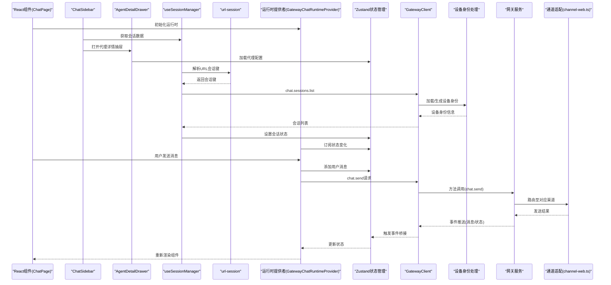

**图表来源**
- [ChatSidebar.tsx:48-58](file://ui-react/src/components/chat/ChatSidebar.tsx#L48-L58)
- [AgentDetailDrawer.tsx:36-142](file://ui-react/src/components/agents/detail-drawer.tsx#L36-L142)
- [useSessionManager.ts:266-271](file://ui-react/src/hooks/session-manager/useSessionManager.ts#L266-L271)
- [url-session.ts:10-19](file://ui-react/src/hooks/session-manager/url-session.ts#L10-L19)
- [GatewayChatRuntimeProvider.tsx:112-227](file://ui-react/src/providers/chat/GatewayChatRuntimeProvider.tsx#L112-L227)
- [useGateway.ts:33-72](file://ui-react/src/hooks/gateway/useGateway.ts#L33-L72)
- [client.ts:267-415](file://src/gateway/client.ts#L267-L415)

**章节来源**
- [webchat.md:24-32](file://docs/web/webchat.md#L24-L32)
- [ChatSidebar.tsx:1-170](file://ui-react/src/components/chat/ChatSidebar.tsx#L1-L170)
- [AgentDetailDrawer.tsx:1-142](file://ui-react/src/components/agents/detail-drawer.tsx#L1-L142)
- [useSessionManager.ts:1-297](file://ui-react/src/hooks/session-manager/useSessionManager.ts#L1-L297)
- [url-session.ts:1-40](file://ui-react/src/hooks/session-manager/url-session.ts#L1-L40)
- [GatewayChatRuntimeProvider.tsx:1-227](file://ui-react/src/providers/chat/GatewayChatRuntimeProvider.tsx#L1-L227)
- [useGateway.ts:1-87](file://ui-react/src/hooks/gateway/useGateway.ts#L1-L87)
- [client.ts:1-674](file://src/gateway/client.ts#L1-L674)

## 详细组件分析

### URL会话管理功能
**新增** 新增完整的URL会话管理功能，通过url-session.ts文件提供会话键URL哈希处理能力，显著增强了会话切换体验。

- **会话键解析**：getSessionKeyFromHash函数从URL哈希中解析会话键，支持查询参数的解析和会话键的提取。
- **哈希构建**：buildHashWithSessionKey函数构建包含会话键的新哈希，同时保留现有的查询参数。
- **哈希更新**：setSessionKeyInHash函数在URL哈希中设置会话键，使用window.history.replaceState进行无刷新更新。
- **浏览器兼容性**：在无window环境（如Node.js测试）中提供安全的no-op操作，避免运行时错误。
- **URL解析**：parseHash函数解析URL哈希，分离路由路径和查询参数，支持完整的URL结构处理。

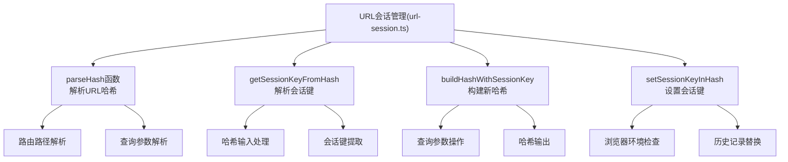

**图表来源**
- [url-session.ts:1-40](file://ui-react/src/hooks/session-manager/url-session.ts#L1-L40)

**章节来源**
- [url-session.ts:1-40](file://ui-react/src/hooks/session-manager/url-session.ts#L1-L40)
- [url-session.test.ts:1-29](file://ui-react/src/hooks/session-manager/url-session.test.ts#L1-L29)

### 网关客户端系统
**更新** 新增完整的网关客户端系统，替代原有的旧网关集成，提供更安全的连接管理和错误处理机制。

- **GatewayClient类**：提供完整的WebSocket连接管理，包括连接建立、消息处理、错误恢复和自动重连。
- **设备身份验证**：支持Ed25519密钥对的生成、存储和签名验证，确保设备身份的安全性。
- **连接安全检查**：实施严格的安全策略，阻止非加密连接到远程地址，保护凭据和聊天数据。
- **TLS指纹验证**：支持wss://连接的证书指纹验证，防止中间人攻击。
- **错误代码分类**：提供详细的连接错误代码分类，包括认证错误、设备错误和配对错误等。
- **恢复建议系统**：根据错误代码提供具体的恢复建议和下一步操作指导。
- **指数退避重连**：实现智能的重连策略，支持指数退避和暂停重连机制。

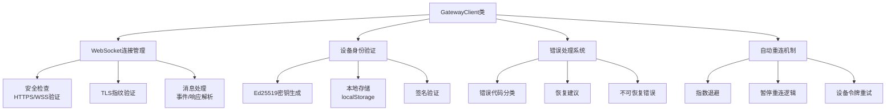

**图表来源**
- [client.ts:109-265](file://src/gateway/client.ts#L109-L265)
- [client.ts:267-415](file://src/gateway/client.ts#L267-L415)
- [client.ts:417-495](file://src/gateway/client.ts#L417-L495)
- [client.ts:497-554](file://src/gateway/client.ts#L497-L554)

**章节来源**
- [client.ts:1-674](file://src/gateway/client.ts#L1-L674)

### 设备身份处理系统
**更新** 新增完整的设备身份处理系统，支持Ed25519密钥对的生成、存储和签名验证。

- **Ed25519密钥对生成**：使用@noble/ed25519库生成安全的椭圆曲线密钥对。
- **本地存储机制**：使用localStorage存储设备身份信息，支持版本化存储格式。
- **公钥指纹计算**：通过SHA-256哈希计算公钥指纹作为设备ID。
- **payload构建**：构建标准化的设备认证payload字符串。
- **签名生成**：使用私钥对payload进行数字签名，确保身份真实性。
- **自动恢复**：支持设备ID与公钥的自动校验和修复。

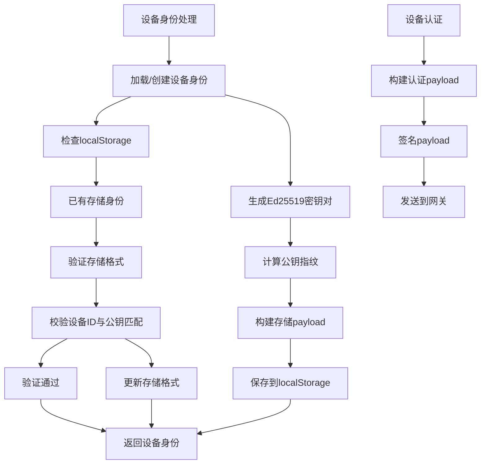

**图表来源**
- [device-identity.ts:39-90](file://ui-react/src/hooks/gateway/device-identity.ts#L39-L90)
- [device-identity.ts:92-126](file://ui-react/src/hooks/gateway/device-identity.ts#L92-L126)

**章节来源**
- [device-identity.ts:1-126](file://ui-react/src/hooks/gateway/device-identity.ts#L1-L126)

### 连接错误分类系统
**更新** 新增详细的连接错误分类系统，提供准确的错误代码和恢复建议。

- **认证错误分类**：包括令牌缺失、密码错误、速率限制、尾序身份验证等。
- **设备认证错误**：包括设备ID不匹配、签名过期、随机数缺失等。
- **配对错误处理**：支持配对必需的错误处理和状态管理。
- **恢复建议系统**：根据错误代码提供具体的恢复建议和下一步操作。
- **不可恢复错误识别**：识别需要用户干预的不可恢复错误类型。
- **详细错误信息**：提供详细的错误描述和诊断信息。

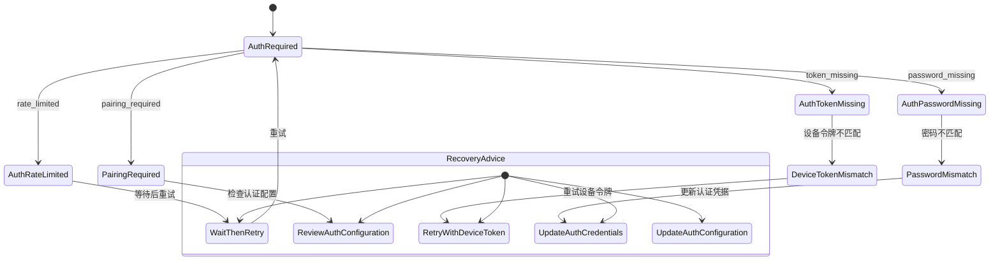

**图表来源**
- [connect-error-details.ts:1-137](file://src/gateway/protocol/connect-error-details.ts#L1-L137)

**章节来源**
- [connect-error-details.ts:1-137](file://src/gateway/protocol/connect-error-details.ts#L1-L137)

### 网关状态指示器组件
**更新** 新增GatewayStatusIndicator组件，提供实时的网关连接状态显示和管理功能。

- **状态可视化**：使用彩色指示点显示连接状态（连接中、已连接、断开、错误）。
- **详细状态信息**：显示服务器版本、最后错误信息和连接状态描述。
- **手动重试功能**：支持用户手动触发重连操作。
- **网关重启功能**：在Electron环境中提供网关重启功能。
- **重启覆盖层**：在网关重启时显示全局覆盖层，改善用户体验。
- **状态持久化**：通过Zustand状态管理持久化网关状态。

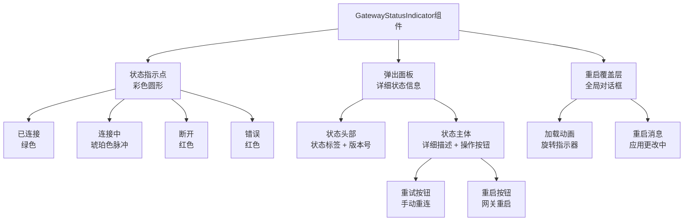

**图表来源**
- [GatewayStatusIndicator.tsx:21-29](file://ui-react/src/components/gateway/GatewayStatusIndicator.tsx#L21-L29)
- [GatewayStatusIndicator.tsx:40-188](file://ui-react/src/components/gateway/GatewayStatusIndicator.tsx#L40-L188)
- [GatewayRestartingOverlay.tsx:20-43](file://ui-react/src/components/gateway/GatewayRestartingOverlay.tsx#L20-L43)

**章节来源**
- [GatewayStatusIndicator.tsx:1-188](file://ui-react/src/components/gateway/GatewayStatusIndicator.tsx#L1-L188)
- [GatewayRestartingOverlay.tsx:1-43](file://ui-react/src/components/gateway/GatewayRestartingOverlay.tsx#L1-L43)

### useGateway钩子系统
**更新** 新增useGateway钩子，提供网关客户端的初始化和管理功能。

- **客户端生命周期管理**：自动管理GatewayClient的创建、启动和停止。
- **设置依赖监听**：监听网关URL和认证设置的变化，自动重新连接。
- **状态同步**：将网关事件同步到Zustand状态管理。
- **错误处理**：处理连接错误并更新状态。
- **客户端包装**：提供简化的客户端接口，隐藏底层实现细节。
- **自动重连**：支持自动重连和错误恢复。

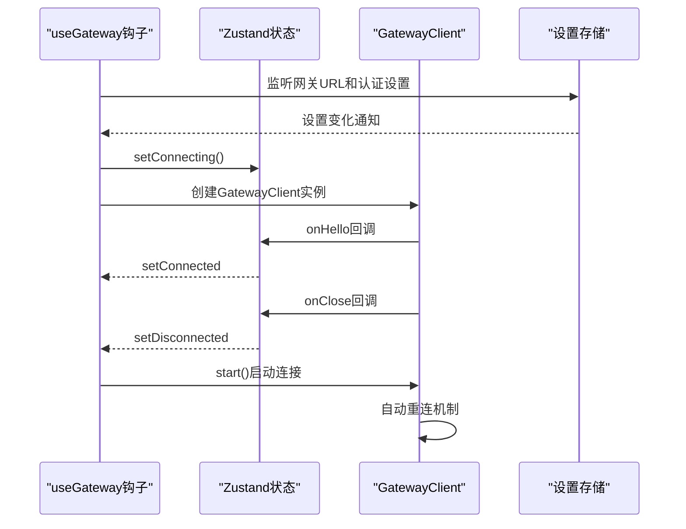

**图表来源**
- [useGateway.ts:33-72](file://ui-react/src/hooks/gateway/useGateway.ts#L33-L72)
- [gateway.store.ts:96-139](file://ui-react/src/store/gateway.store.ts#L96-L139)

**章节来源**
- [useGateway.ts:1-87](file://ui-react/src/hooks/gateway/useGateway.ts#L1-L87)
- [gateway.store.ts:1-212](file://ui-react/src/store/gateway.store.ts#L1-L212)

### ThreadView组件错误状态检查机制
**更新** ThreadView组件新增错误状态检查机制，提供实时生成状态检测和手动清除功能。

- **错误状态检测**：通过lastError状态和handleCheckStatus函数实现实时生成状态检测，支持检查activeRunId并恢复进行中的状态。
- **错误横幅显示**：ErrorBanner组件提供破坏性边框样式和状态徽章，支持检查状态、手动清除和旋转加载指示器。
- **状态同步机制**：通过chat.status方法检查后端生成状态，如果仍在运行则恢复会话生成状态，否则仅清除错误横幅。
- **用户交互优化**：提供检查状态按钮和手动清除按钮，支持禁用状态和加载指示器，提升用户体验。
- **竞态条件防护**：通过showMessageList逻辑避免在清空加载状态下挂载消息列表，防止useMessage/tapClientLookup竞争条件。

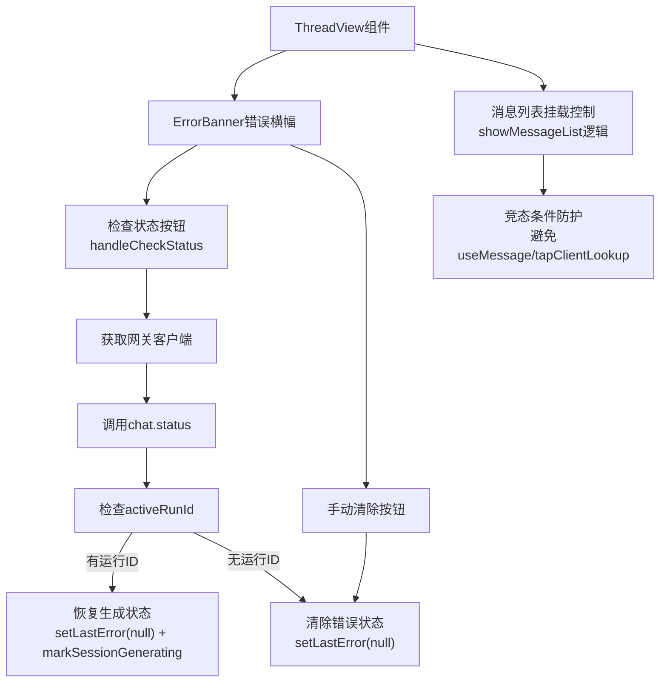

**图表来源**
- [ThreadView.tsx:121-178](file://ui-react/src/components/chat/ThreadView.tsx#L121-L178)
- [ThreadView.tsx:27-32](file://ui-react/src/components/chat/ThreadView.tsx#L27-L32)

**章节来源**
- [ThreadView.tsx:1-199](file://ui-react/src/components/chat/ThreadView.tsx#L1-L199)

### AssistantMessage组件左内边距调整
**更新** AssistantMessage组件调整左内边距，优化消息内容对齐和视觉层次。

- **左内边距优化**：将content column的左内边距从默认值调整为pl-2，确保消息内容与头像区域正确对齐。
- **视觉层次提升**：通过精确的内边距控制，改善消息内容的视觉层次和阅读体验。
- **响应式设计**：保持与整体设计系统的协调，确保在不同屏幕尺寸下的一致性。
- **内容对齐优化**：与AgentAvatar组件配合，确保头像和消息内容的垂直居中对齐。

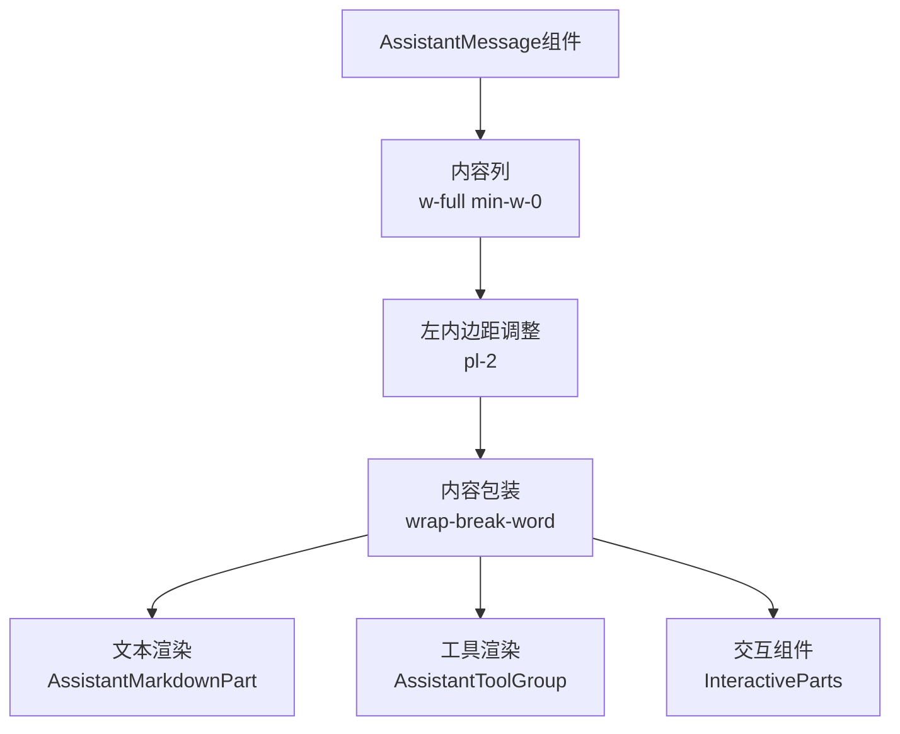

**图表来源**
- [AssistantMessage.tsx:104](file://ui-react/src/components/chat/AssistantMessage.tsx#L104)

**章节来源**
- [AssistantMessage.tsx:1-120](file://ui-react/src/components/chat/AssistantMessage.tsx#L1-L120)

### ToolCallGroup组件破坏性边框样式移除
**更新** ToolCallGroup组件移除破坏性边框样式，采用更温和的视觉设计。

- **边框样式优化**：移除destructive边框样式，采用更温和的背景色和边框设计，减少视觉冲击。
- **状态徽章系统**：保留GroupStatusBadge组件，提供运行中、失败和完成状态的不同视觉表示。
- **自动展开/折叠**：通过messageIsRunning状态控制自动展开/折叠行为，提升用户体验。
- **状态管理改进**：deriveGroupStatus函数改进状态推导逻辑，支持运行中状态的特殊处理。
- **视觉一致性**：保持与整体设计系统的协调，确保不同状态下的视觉一致性。

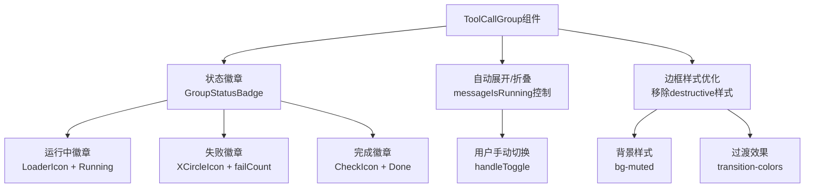

**图表来源**
- [ToolCallGroup.tsx:98-130](file://ui-react/src/components/chat/ToolCallGroup.tsx#L98-L130)
- [ToolCallGroup.tsx:186-202](file://ui-react/src/components/chat/ToolCallGroup.tsx#L186-L202)
- [ToolCallGroup.tsx:205-208](file://ui-react/src/components/chat/ToolCallGroup.tsx#L205-L208)

**章节来源**
- [ToolCallGroup.tsx:1-284](file://ui-react/src/components/chat/ToolCallGroup.tsx#L1-L284)

### 增强的Composer组件
**更新** Composer组件现已实现拖拽上传、实时预览、文件类型验证等重大改进功能。

- **拖拽上传支持**：使用ComposerPrimitive.AttachmentDropzone实现拖拽上传功能，支持拖拽状态指示和视觉反馈。
- **实时文件预览**：AttachmentPreview组件提供待上传文件的实时预览，包括文件名、大小和删除按钮。
- **文件类型验证**：支持多种文件类型的验证，包括图片、PDF、Office文档等。
- **文件大小限制**：单文件5MB限制，总文件20MB限制，最多10个文件。
- **错误处理机制**：完善的错误处理，包括文件类型不支持、大小超限等错误提示。
- **删除功能**：支持实时删除待上传文件，提供一键移除功能。

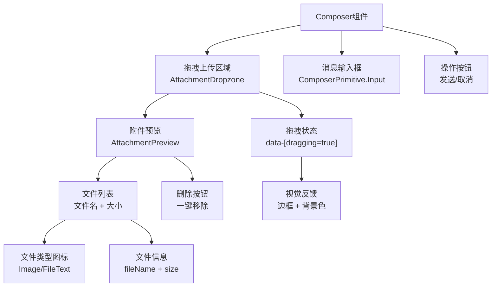

**图表来源**
- [Composer.tsx:237-334](file://ui-react/src/components/chat/Composer.tsx#L237-L334)
- [Composer.tsx:70-120](file://ui-react/src/components/chat/Composer.tsx#L70-L120)

**章节来源**
- [Composer.tsx:1-334](file://ui-react/src/components/chat/Composer.tsx#L1-L334)

### 改进的UserMessage组件
**更新** UserMessage组件现已改进附件显示功能。

- **附件标签显示**：在消息气泡上方右对齐显示附件标签，支持图片和文档类型。
- **文件类型图标**：根据文件类型显示相应的图标，图片使用Image图标，文档使用FileText图标。
- **文件信息展示**：显示文件名和文件大小，支持截断显示长文件名。
- **状态管理优化**：通过Zustand状态管理直接获取消息附件信息，绕过assistant-ui的复杂类型要求。
- **空附件处理**：当没有附件时自动隐藏附件区域，避免空白空间。

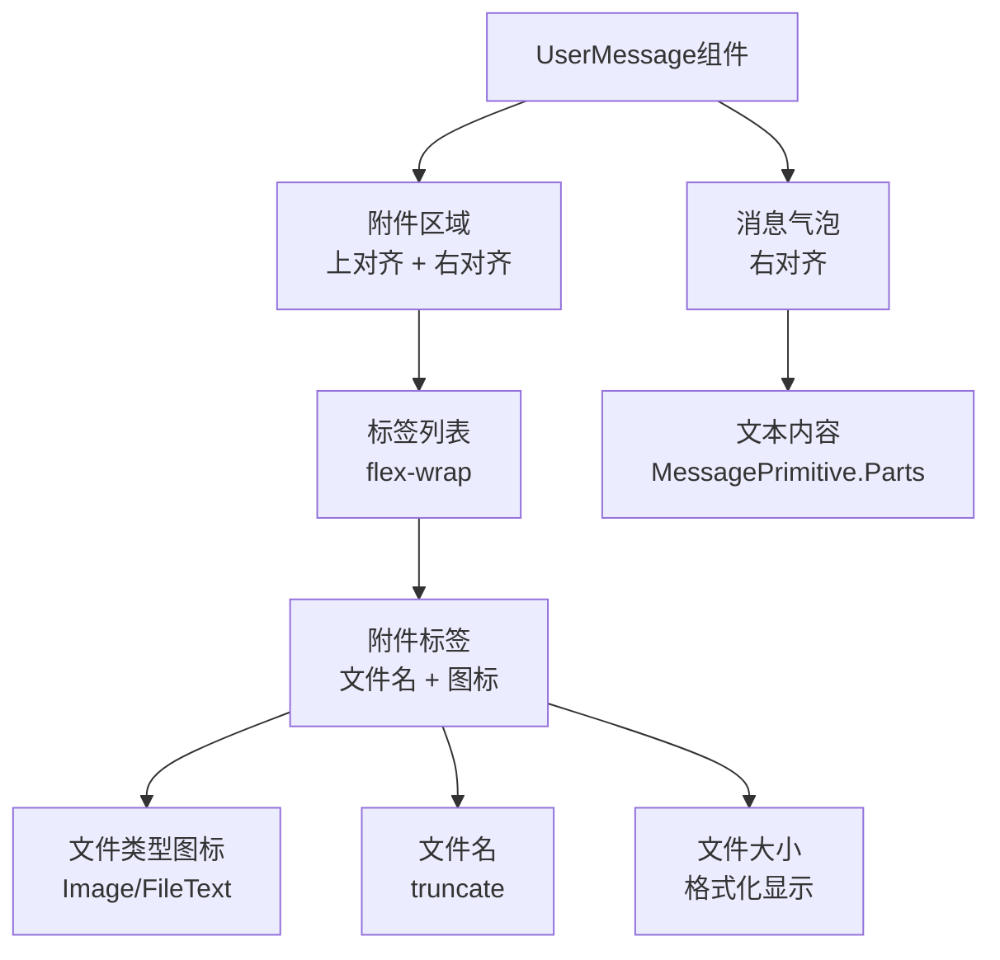

**图表来源**
- [UserMessage.tsx:15-152](file://ui-react/src/components/chat/UserMessage.tsx#L15-L152)
- [UserMessage.tsx:117-152](file://ui-react/src/components/chat/UserMessage.tsx#L117-L152)

**章节来源**
- [UserMessage.tsx:1-152](file://ui-react/src/components/chat/UserMessage.tsx#L1-L152)

### 文件上传验证系统
**更新** 新增完整的文件上传验证系统，包括大小限制、类型验证和错误处理。

- **文件大小验证**：单文件5MB限制，总文件20MB限制，实时计算当前总大小。
- **文件数量限制**：最多10个文件，防止过多文件同时上传。
- **MIME类型验证**：支持图片、PDF、Office文档等多种类型验证。
- **实时错误提示**：上传过程中实时显示错误信息，包括类型不支持、大小超限等。
- **Base64编码**：自动将文件转换为Base64格式，移除data URL前缀。

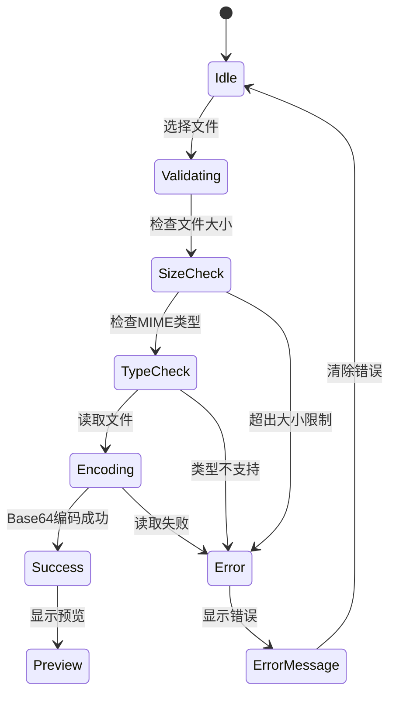

**图表来源**
- [Composer.tsx:135-207](file://ui-react/src/components/chat/Composer.tsx#L135-L207)

**章节来源**
- [Composer.tsx:12-52](file://ui-react/src/components/chat/Composer.tsx#L12-L52)
- [Composer.tsx:135-207](file://ui-react/src/components/chat/Composer.tsx#L135-L207)

### 增强的GatewayChatRuntimeProvider
- **内容块系统**：支持交错的文本和工具调用渲染，保持原始消息顺序。
- **流式渲染增强**：实时流式消息的增量更新和工具调用的有序插入。
- **消息转换优化**：convertMessage函数处理contentBlocks和toolCalls的复杂转换。
- **附件支持**：支持图像附件的解析和传输，增强多媒体消息功能。
- **运行时管理**：集成assistant-ui的ExternalStoreRuntime，提供完整的运行时支持。

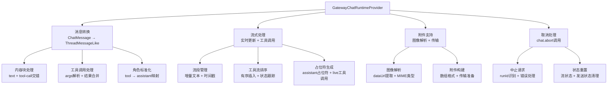

**图表来源**
- [GatewayChatRuntimeProvider.tsx:16-227](file://ui-react/src/providers/chat/GatewayChatRuntimeProvider.tsx#L16-L227)

**章节来源**
- [GatewayChatRuntimeProvider.tsx:1-227](file://ui-react/src/providers/chat/GatewayChatRuntimeProvider.tsx#L1-L227)

### Zustand状态管理系统
- **聊天状态管理**：chat.store.ts管理消息列表、流式输出、工具调用流和输入状态。
- **设置状态管理**：settings.store.ts管理用户偏好设置、网关配置和主题设置。
- **网关状态管理**：gateway.store.ts管理连接状态、事件日志和客户端实例。
- **代理状态管理**：agents.store.ts管理代理列表、代理身份、配置和技能状态。
- **状态同步**：通过useChatEventBridge将网关事件转换为状态更新，保持组件解耦。
- **工具流管理**：支持工具调用的完整生命周期，包括开始、运行、结果和错误状态。

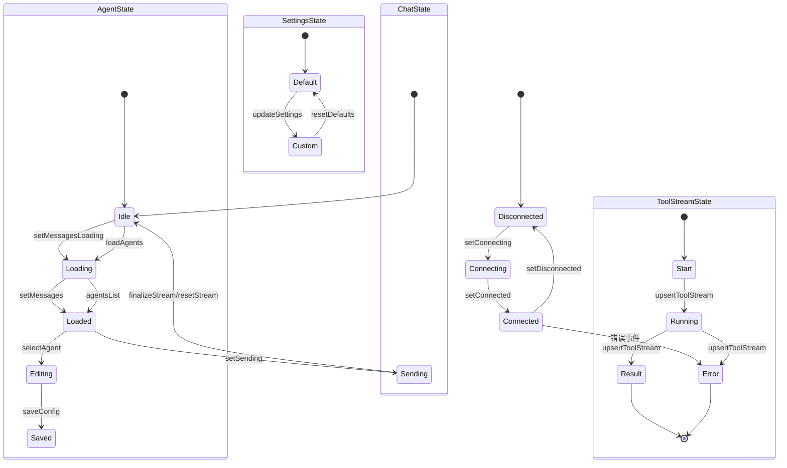

**图表来源**
- [gateway.store.ts:72-183](file://ui-react/src/store/gateway.store.ts#L72-L183)
- [chat.store.ts:135-229](file://ui-react/src/store/chat.store.ts#L135-L229)
- [agents.store.ts:304-324](file://ui-react/src/store/agents.store.ts#L304-L324)
- [settings.store.ts:193-222](file://ui-react/src/store/settings.store.ts#L193-L222)

**章节来源**
- [chat.store.ts:1-247](file://ui-react/src/store/chat.store.ts#L1-L247)
- [settings.store.ts:1-222](file://ui-react/src/store/settings.store.ts#L1-L222)
- [gateway.store.ts:1-212](file://ui-react/src/store/gateway.store.ts#L1-L212)
- [agents.store.ts:1-1066](file://ui-react/src/store/agents.store.ts#L1-L1066)

### 增强的消息渲染能力
- **内容块系统**：支持交错的文本和工具调用渲染，保持原始消息顺序。
- **Markdown支持**：AssistantMessage组件集成Markdown渲染，支持GFM语法。
- **工具调用可视化**：ToolFallback组件提供工具调用的分类、状态和详细信息展示。
- **附件支持**：UserMessage组件支持图片附件的预览和渲染。
- **流式渲染**：支持实时流式消息的增量更新和最终合并。

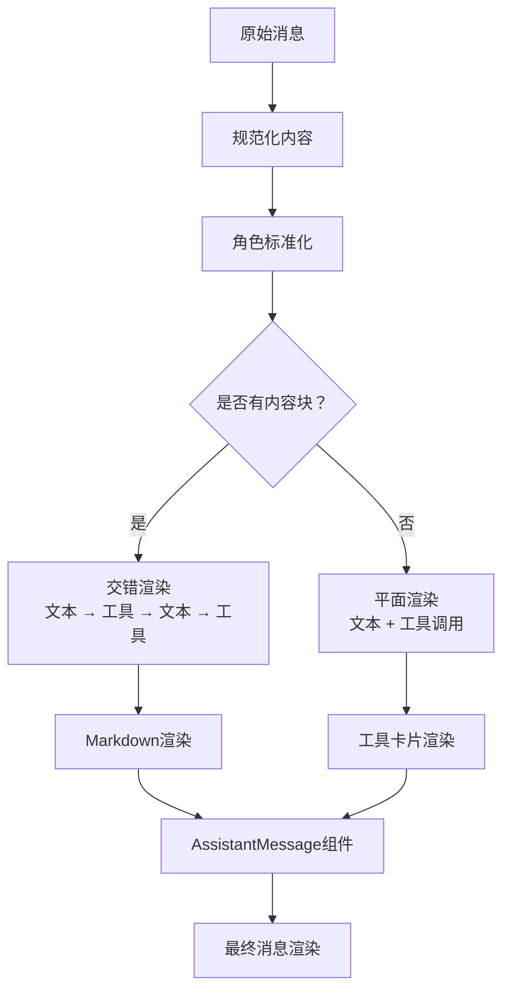

**图表来源**
- [GatewayChatRuntimeProvider.tsx:16-100](file://ui-react/src/providers/chat/GatewayChatRuntimeProvider.tsx#L16-L100)
- [AssistantMessage.tsx:22-150](file://ui-react/src/components/chat/AssistantMessage.tsx#L22-L150)
- [ToolFallback.tsx:45-150](file://ui-react/src/components/chat/ToolFallback.tsx#L45-L150)

**章节来源**
- [GatewayChatRuntimeProvider.tsx:1-227](file://ui-react/src/providers/chat/GatewayChatRuntimeProvider.tsx#L1-L227)
- [AssistantMessage.tsx:1-240](file://ui-react/src/components/chat/AssistantMessage.tsx#L1-L240)
- [ToolFallback.tsx:1-451](file://ui-react/src/components/chat/ToolFallback.tsx#L1-L451)

### 工具集成功能
- **工具分类系统**：根据工具名称自动分类为read、write、exec、search、web、database、file、function等类别。
- **状态跟踪**：支持工具调用的完整生命周期状态跟踪和可视化。
- **详细信息展示**：通过抽屉式对话框展示工具调用的参数、结果和错误信息。
- **交互式操作**：支持工具调用的重新执行、取消和查看详情操作。

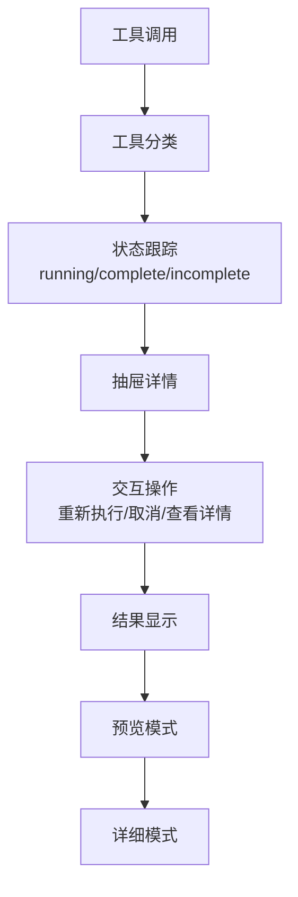

**图表来源**
- [ToolFallback.tsx:45-150](file://ui-react/src/components/chat/ToolFallback.tsx#L45-L150)
- [ToolFallback.tsx:214-316](file://ui-react/src/components/chat/ToolFallback.tsx#L214-L316)

**章节来源**
- [ToolFallback.tsx:1-451](file://ui-react/src/components/chat/ToolFallback.tsx#L1-L451)

### 会话管理增强
**更新** 会话管理钩子现已增强，增加自动同步逻辑和会话标题更新功能，**新增** 集成URL会话管理功能。

- **自动同步功能**：useEffect监听sessionKey变化，自动解析代理ID并切换到对应的会话视图。**新增** 实现了完全的自动同步逻辑，**新增** 通过url-session.ts解析URL中的会话键。
- **URL会话解析**：getSessionKeyFromHash函数从URL哈希中解析会话键，支持查询参数的解析和会话键的提取。
- **会话键持久化**：setSessionKeyInHash函数在URL哈希中设置会话键，使用window.history.replaceState进行无刷新更新。
- **会话列表**：通过chat.sessions.list获取会话列表，支持动态刷新。
- **会话切换**：切换会话时自动加载对应的历史消息。
- **新会话创建**：支持创建新会话并自动切换到新会话。
- **历史加载**：支持按会话键加载历史消息，处理同步和异步响应。
- **会话标题更新**：生成会话标题时优先使用displayName，然后是derivedTitle，最后是label。

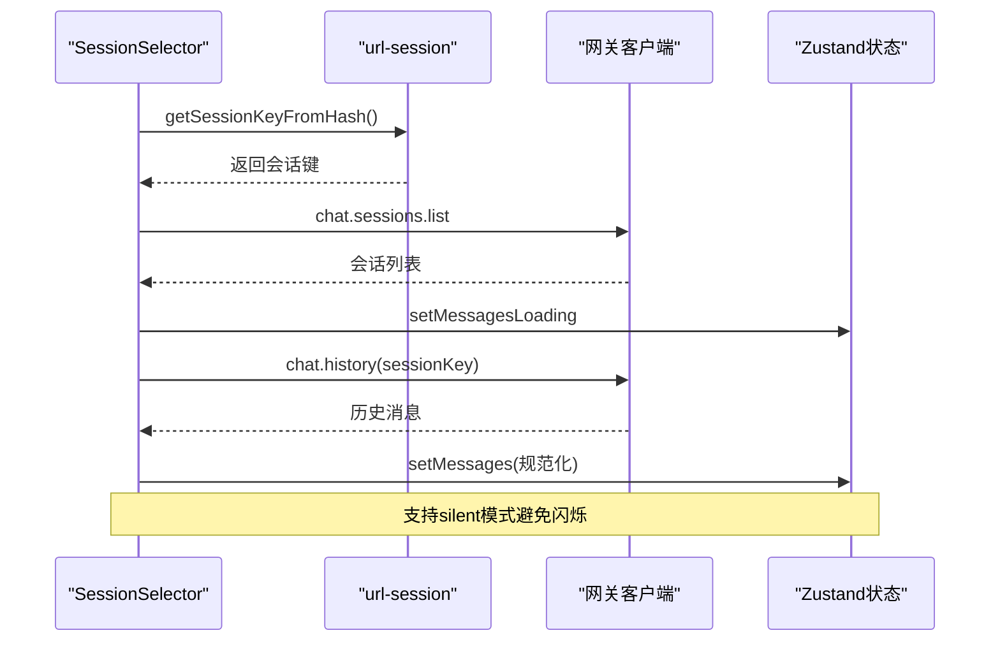

**图表来源**
- [SessionSelector.tsx:34-90](file://ui-react/src/components/chat/SessionSelector.tsx#L34-L90)
- [url-session.ts:10-19](file://ui-react/src/hooks/session-manager/url-session.ts#L10-L19)

**章节来源**
- [SessionSelector.tsx:1-212](file://ui-react/src/components/chat/SessionSelector.tsx#L1-L212)
- [useSessionManager.ts:266-271](file://ui-react/src/hooks/session-manager/useSessionManager.ts#L266-L271)
- [url-session.ts:1-40](file://ui-react/src/hooks/session-manager/url-session.ts#L1-L40)

### WebSocket连接、消息同步与离线处理
- **连接管理**：gateway.store.ts管理连接状态、事件处理和错误恢复。
- **事件桥接**：useChatEventBridge将网关事件转换为状态更新，支持聊天、工具和代理事件。
- **状态同步**：通过注册回调函数实现跨模块的状态同步，避免循环依赖。
- **离线策略**：连接断开时提供清晰的错误状态和重连机制。

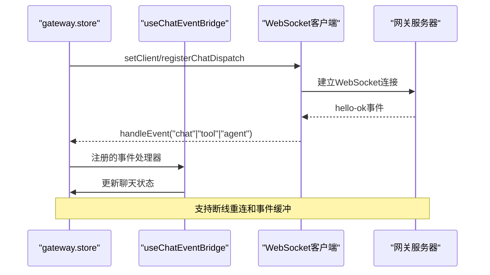

**图表来源**
- [gateway.store.ts:128-167](file://ui-react/src/store/gateway.store.ts#L128-L167)
- [useChatEventBridge.ts:273-471](file://ui-react/src/hooks/useChatEventBridge.ts#L273-L471)

**章节来源**
- [gateway.store.ts:1-212](file://ui-react/src/store/gateway.store.ts#L1-L212)
- [useChatEventBridge.ts:1-472](file://ui-react/src/hooks/useChatEventBridge.ts#L1-L472)

### 代理管理功能
**更新** 新增完整的代理管理功能，包括代理配置、技能管理和工具配置。

- **代理详情抽屉**：AgentDetailDrawer提供完整的代理配置界面，支持在线状态、聊天按钮和技能管理。
- **代理头像和名称**：支持代理头像URL和emoji显示，提供更丰富的视觉标识。
- **技能管理**：CoreSkillsSection支持代理技能的添加、删除和管理。
- **工具配置**：ToolsSection展示代理可用的工具和配置选项。
- **代理创建和删除**：支持代理的创建、编辑和删除功能。

```mermaid
flowchart TD
AgentDetailDrawer["AgentDetailDrawer组件"] --> Header["头部区域<br/>关闭按钮 + 删除按钮"]
AgentDetailDrawer --> Content["内容区域<br/>滚动容器"]
Content --> ProfileHero["个人资料英雄区<br/>头像 + 在线状态 + 聊天按钮"]
Content --> SoulSection["灵魂配置<br/>代理核心设置"]
Content --> SkillsSection["技能管理<br/>绑定技能 + 添加技能"]
Content --> ToolsSection["工具配置<br/>工具列表 + 配置"]
ProfileHero --> ChatButton["聊天按钮<br/>MessageSquare"]
SkillsSection --> AddSkillsDialog["添加技能对话框<br/>搜索 + 分类 + 选择"]
```

**图表来源**
- [AgentDetailDrawer.tsx:36-142](file://ui-react/src/components/agents/detail-drawer.tsx#L36-L142)
- [ProfileHeroSection.tsx:138-354](file://ui-react/src/components/agents/profile.tsx#L138-L354)
- [CoreSkillsSection.tsx:173-342](file://ui-react/src/components/agents/skills.tsx#L173-L342)

**章节来源**
- [AgentDetailDrawer.tsx:1-142](file://ui-react/src/components/agents/detail-drawer.tsx#L1-L142)
- [ProfileHeroSection.tsx:1-379](file://ui-react/src/components/agents/profile.tsx#L1-L379)
- [CoreSkillsSection.tsx:1-342](file://ui-react/src/components/agents/skills.tsx#L1-L342)

## 依赖关系分析
- **React组件依赖**：所有React组件通过GatewayChatRuntimeProvider访问状态管理，避免直接导入Zustand。
- **状态管理解耦**：useChatEventBridge通过回调函数注册机制避免循环依赖，保持模块边界清晰。
- **Assistant UI集成**：使用@assistant-ui/react系列包提供统一的UI组件和运行时支持。
- **Tailwind CSS**：使用Tailwind 4.x提供现代化的样式系统，支持响应式设计。
- **组件系统集成**：ChatSidebar替代SessionSelector，提供更丰富的会话管理功能。
- **文件上传依赖**：Composer组件依赖FileReader API进行文件读取和Base64编码。
- **代理管理集成**：AgentDetailDrawer集成到ChatSidebar，提供完整的代理管理功能。
- **错误状态检查集成**：ThreadView与ErrorBanner组件深度集成，提供完整的错误处理机制。
- **工具调用分组优化**：ToolCallGroup与ToolFallback组件协同工作，提供改进的工具调用可视化。
- **网关客户端集成**：GatewayClient系统通过useGateway钩子集成到React应用中。
- **设备身份集成**：device-identity模块提供设备身份的生成、存储和验证功能。
- **错误分类集成**：connect-error-details模块提供详细的错误代码分类和恢复建议。
- **URL会话管理集成**：url-session模块通过useSessionManager集成到会话管理流程中，提供完整的URL会话处理能力。

```mermaid
graph LR
React_Components["React组件"] --> Runtime["GatewayChatRuntimeProvider"]
Runtime --> Zustand["Zustand状态管理"]
Zustand --> GatewayStore["gateway.store.ts"]
Zustand --> ChatStore["chat.store.ts"]
Zustand --> SettingsStore["settings.store.ts"]
Zustand --> AgentsStore["agents.store.ts"]
GatewayStore --> Client["GatewayClient"]
Client --> DeviceIdentity["device-identity.ts"]
Client --> ConnectErrors["connect-error-details.ts"]
ChatStore --> Events["useChatEventBridge.ts"]
SettingsStore --> SessionManager["useSessionManager.ts"]
AgentsStore --> AgentDetailDrawer["AgentDetailDrawer.tsx"]
AgentDetailDrawer --> ProfileHero["ProfileHeroSection.tsx"]
AgentDetailDrawer --> CoreSkills["CoreSkillsSection.tsx"]
Events --> AssistantUI["@assistant-ui/react"]
AssistantUI --> Components["UI组件库"]
MarkdownComponents["markdown-text.tsx"] --> AssistantUI
ChatSidebar["ChatSidebar.tsx"] --> AgentDetailDrawer
ChatSidebar --> AgentSessionList["AgentSessionList.tsx"]
Composer["Composer.tsx"] --> FileReader["FileReader API"]
UserMessage["UserMessage.tsx"] --> ZustandStore["chat.store.ts"]
ThreadView["ThreadView.tsx"] --> ErrorBanner["ErrorBanner组件"]
AssistantMessage["AssistantMessage.tsx"] --> ToolCallGroup["ToolCallGroup.tsx"]
ToolCallGroup --> ToolFallback["ToolFallback.tsx"]
GatewayStatusIndicator["GatewayStatusIndicator.tsx"] --> GatewayRestartingOverlay["GatewayRestartingOverlay.tsx"]
useGateway["useGateway.ts"] --> GatewayClient["GatewayClient类"]
useSessionManager["useSessionManager.ts"] --> URLSession["url-session.ts"]
URLSession --> WindowAPI["window.history API"]
```

**图表来源**
- [ChatSidebar.tsx:1-170](file://ui-react/src/components/chat/ChatSidebar.tsx#L1-L170)
- [AgentDetailDrawer.tsx:1-142](file://ui-react/src/components/agents/detail-drawer.tsx#L1-L142)
- [markdown-text.tsx:1-268](file://ui-react/src/components/assistant-ui/markdown-text.tsx#L1-L268)
- [GatewayChatRuntimeProvider.tsx:1-227](file://ui-react/src/providers/chat/GatewayChatRuntimeProvider.tsx#L1-L227)
- [chat.store.ts:1-247](file://ui-react/src/store/chat.store.ts#L1-L247)
- [settings.store.ts:1-222](file://ui-react/src/store/settings.store.ts#L1-L222)
- [gateway.store.ts:1-212](file://ui-react/src/store/gateway.store.ts#L1-L212)
- [agents.store.ts:1-1066](file://ui-react/src/store/agents.store.ts#L1-L1066)
- [ThreadView.tsx:121-178](file://ui-react/src/components/chat/ThreadView.tsx#L121-L178)
- [AssistantMessage.tsx:104](file://ui-react/src/components/chat/AssistantMessage.tsx#L104)
- [ToolCallGroup.tsx:205-208](file://ui-react/src/components/chat/ToolCallGroup.tsx#L205-L208)
- [GatewayStatusIndicator.tsx:1-188](file://ui-react/src/components/gateway/GatewayStatusIndicator.tsx#L1-L188)
- [GatewayRestartingOverlay.tsx:1-43](file://ui-react/src/components/gateway/GatewayRestartingOverlay.tsx#L1-L43)
- [useGateway.ts:1-87](file://ui-react/src/hooks/gateway/useGateway.ts#L1-L87)
- [client.ts:1-297](file://ui-react/src/hooks/gateway/client.ts#L1-L297)
- [device-identity.ts:1-126](file://ui-react/src/hooks/gateway/device-identity.ts#L1-L126)
- [connect-error-details.ts:1-137](file://src/gateway/protocol/connect-error-details.ts#L1-L137)
- [url-session.ts:1-40](file://ui-react/src/hooks/session-manager/url-session.ts#L1-L40)

**章节来源**
- [ChatSidebar.tsx:1-170](file://ui-react/src/components/chat/ChatSidebar.tsx#L1-L170)
- [AgentDetailDrawer.tsx:1-142](file://ui-react/src/components/agents/detail-drawer.tsx#L1-L142)
- [markdown-text.tsx:1-268](file://ui-react/src/components/assistant-ui/markdown-text.tsx#L1-L268)
- [GatewayChatRuntimeProvider.tsx:1-227](file://ui-react/src/providers/chat/GatewayChatRuntimeProvider.tsx#L1-L227)
- [chat.store.ts:1-247](file://ui-react/src/store/chat.store.ts#L1-L247)
- [settings.store.ts:1-222](file://ui-react/src/store/settings.store.ts#L1-L222)
- [gateway.store.ts:1-212](file://ui-react/src/store/gateway.store.ts#L1-L212)
- [agents.store.ts:1-1066](file://ui-react/src/store/agents.store.ts#L1-L1066)
- [ThreadView.tsx:1-199](file://ui-react/src/components/chat/ThreadView.tsx#L1-L199)
- [AssistantMessage.tsx:1-120](file://ui-react/src/components/chat/AssistantMessage.tsx#L1-L120)
- [ToolCallGroup.tsx:1-284](file://ui-react/src/components/chat/ToolCallGroup.tsx#L1-L284)
- [GatewayStatusIndicator.tsx:1-188](file://ui-react/src/components/gateway/GatewayStatusIndicator.tsx#L1-L188)
- [GatewayRestartingOverlay.tsx:1-43](file://ui-react/src/components/gateway/GatewayRestartingOverlay.tsx#L1-L43)
- [useGateway.ts:1-87](file://ui-react/src/hooks/gateway/useGateway.ts#L1-L87)
- [client.ts:1-297](file://ui-react/src/hooks/gateway/client.ts#L1-L297)
- [device-identity.ts:1-126](file://ui-react/src/hooks/gateway/device-identity.ts#L1-L126)
- [connect-error-details.ts:1-137](file://src/gateway/protocol/connect-error-details.ts#L1-L137)
- [url-session.ts:1-40](file://ui-react/src/hooks/session-manager/url-session.ts#L1-L40)

## 性能考虑
- **状态管理优化**：使用Zustand替代Redux，减少不必要的状态更新和组件重渲染。
- **组件懒加载**：React.lazy和Suspense支持大型组件的按需加载。
- **虚拟化支持**：Assistant UI组件支持消息列表的虚拟化渲染，提高大数据量场景下的性能。
- **事件桥接优化**：useChatEventBridge通过事件过滤和状态缓存减少重复渲染。
- **资源复用**：vite.config.ts配置公共资源目录，避免重复构建静态资源。
- **内容块优化**：GatewayChatRuntimeProvider优化contentBlocks的处理，减少不必要的渲染。
- **会话管理缓存**：useSessionManager实现会话列表缓存，避免频繁的API调用。
- **文件上传优化**：Composer组件使用Base64编码，避免大文件阻塞UI线程。
- **实时预览优化**：AttachmentPreview组件使用虚拟化列表，支持大量文件的高效渲染。
- **Markdown渲染优化**：AssistantMarkdown组件使用memoization优化渲染性能。
- **代理状态缓存**：agents.store.ts实现代理状态缓存，避免频繁的API调用。
- **自动同步优化**：ChatSidebar的自动同步功能通过useEffect优化，避免不必要的重渲染。
- **错误状态检查优化**：ThreadView的错误状态检查机制通过状态缓存避免重复网络请求。
- **工具调用分组优化**：ToolCallGroup的状态推导逻辑通过memoization优化性能。
- **网关客户端优化**：GatewayClient实现指数退避重连，避免频繁重连导致的性能问题。
- **设备身份缓存**：device-identity模块使用localStorage缓存设备身份，避免重复生成。
- **错误分类优化**：connect-error-details模块使用Set数据结构优化错误代码查找性能。
- **URL会话管理优化**：url-session模块使用URLSearchParams进行高效的查询参数处理，避免不必要的字符串解析。
- **会话键缓存**：useSessionManager缓存解析的会话键，避免重复的URL解析操作。

**章节来源**
- [vite.config.ts:13-14](file://ui-react/vite.config.ts#L13-L14)
- [package.json:11-42](file://ui-react/package.json#L11-L42)
- [GatewayChatRuntimeProvider.tsx:132-197](file://ui-react/src/providers/chat/GatewayChatRuntimeProvider.tsx#L132-L197)
- [useSessionManager.ts:28-42](file://ui-react/src/hooks/session-manager/useSessionManager.ts#L28-L42)
- [Composer.tsx:135-207](file://ui-react/src/components/chat/Composer.tsx#L135-L207)
- [markdown-text.tsx:218-222](file://ui-react/src/components/assistant-ui/markdown-text.tsx#L218-L222)
- [agents.store.ts:304-324](file://ui-react/src/store/agents.store.ts#L304-L324)
- [ChatSidebar.tsx:42-58](file://ui-react/src/components/chat/ChatSidebar.tsx#L42-L58)
- [ThreadView.tsx:121-178](file://ui-react/src/components/chat/ThreadView.tsx#L121-L178)
- [AssistantMessage.tsx:104](file://ui-react/src/components/chat/AssistantMessage.tsx#L104)
- [ToolCallGroup.tsx:178-182](file://ui-react/src/components/chat/ToolCallGroup.tsx#L178-L182)
- [client.ts:417-444](file://src/gateway/client.ts#L417-L444)
- [device-identity.ts:39-90](file://ui-react/src/hooks/gateway/device-identity.ts#L39-L90)
- [connect-error-details.ts:9-17](file://src/gateway/protocol/connect-error-details.ts#L9-L17)
- [url-session.ts:1-40](file://ui-react/src/hooks/session-manager/url-session.ts#L1-L40)

## 故障排除指南
- **连接失败**：检查网关端口与认证配置，确认WebSocket握手成功，查看gateway.store的错误状态。
- **无消息**：确认已订阅chat.subscribe并成功拉取chat.history，检查useChatEventBridge的事件处理。
- **组件渲染问题**：检查GatewayChatRuntimeProvider的运行时配置，验证消息转换函数的正确性。
- **状态同步问题**：确认useChatEventBridge的回调注册正常，检查Zustand状态的更新时机。
- **工具调用异常**：检查ToolFallback的分类和状态处理，验证工具调用的生命周期管理。
- **会话管理问题**：检查useSessionManager的API调用，确认chat.sessions.list和chat.history的成功响应。
- **侧边栏显示问题**：确认ChatSidebar的依赖注入正常，检查useSessionManager钩子的状态返回。
- **文件上传失败**：检查文件大小限制、MIME类型验证和Base64编码过程，确认FileReader API正常工作。
- **拖拽上传无效**：检查ComposerPrimitive.AttachmentDropzone的CSS类和data-[dragging]状态，确认拖拽事件处理正常。
- **代理详情抽屉问题**：检查AgentDetailDrawer的open状态和agentId参数，确认代理配置加载正常。
- **Markdown渲染异常**：检查AssistantMarkdown组件的memoization配置，确认代码块复制功能正常。
- **代理技能管理问题**：检查agents.store的技能状态管理，确认技能添加和删除操作正常。
- **自动同步问题**：检查ChatSidebar的useEffect依赖和sessionKey解析逻辑，确认代理ID正确提取。
- **UI文本显示问题**：检查AgentList和AgentSessionList的UI文本更新，确认从"Employees"更新为"Agents"。
- **错误状态检查失效**：检查ThreadView的lastError状态和handleCheckStatus函数，确认错误状态正确传递。
- **左内边距显示异常**：检查AssistantMessage的pl-2内边距设置，确认与头像区域正确对齐。
- **工具调用分组样式问题**：检查ToolCallGroup的边框样式移除逻辑，确认破坏性样式已正确移除。
- **网关连接问题**：检查GatewayStatusIndicator的状态显示，确认连接URL和认证设置正确。
- **设备身份验证失败**：检查device-identity模块的密钥生成和签名验证过程。
- **自动重连循环**：检查GatewayClient的重连策略，确认指数退避和暂停重连逻辑正常。
- **错误代码分类问题**：检查connect-error-details模块的错误代码映射和恢复建议。
- **URL会话管理问题**：检查url-session模块的会话键解析和哈希构建功能，确认URL会话处理正常。
- **会话键持久化失败**：检查window.history.replaceState的可用性和浏览器兼容性。
- **会话切换闪烁问题**：检查useSessionManager的silent模式和消息加载状态管理。

**章节来源**
- [gateway.store.ts:115-126](file://ui-react/src/store/gateway.store.ts#L115-L126)
- [useChatEventBridge.ts:273-471](file://ui-react/src/hooks/useChatEventBridge.ts#L273-L471)
- [GatewayChatRuntimeProvider.tsx:227-236](file://ui-react/src/providers/chat/GatewayChatRuntimeProvider.tsx#L227-L236)
- [useSessionManager.ts:28-42](file://ui-react/src/hooks/session-manager/useSessionManager.ts#L28-L42)
- [ChatSidebar.tsx:19-22](file://ui-react/src/components/chat/ChatSidebar.tsx#L19-L22)
- [Composer.tsx:135-207](file://ui-react/src/components/chat/Composer.tsx#L135-L207)
- [AgentDetailDrawer.tsx:36-142](file://ui-react/src/components/agents/detail-drawer.tsx#L36-L142)
- [markdown-text.tsx:248-268](file://ui-react/src/components/assistant-ui/markdown-text.tsx#L248-L268)
- [agents.store.ts:688-741](file://ui-react/src/store/agents.store.ts#L688-L741)
- [ChatSidebar.tsx:42-58](file://ui-react/src/components/chat/ChatSidebar.tsx#L42-L58)
- [ThreadView.tsx:121-178](file://ui-react/src/components/chat/ThreadView.tsx#L121-L178)
- [AssistantMessage.tsx:104](file://ui-react/src/components/chat/AssistantMessage.tsx#L104)
- [ToolCallGroup.tsx:205-208](file://ui-react/src/components/chat/ToolCallGroup.tsx#L205-L208)
- [GatewayStatusIndicator.tsx:136-144](file://ui-react/src/components/gateway/GatewayStatusIndicator.tsx#L136-L144)
- [device-identity.ts:39-90](file://ui-react/src/hooks/gateway/device-identity.ts#L39-L90)
- [client.ts:417-444](file://src/gateway/client.ts#L417-L444)
- [connect-error-details.ts:107-137](file://src/gateway/protocol/connect-error-details.ts#L107-L137)
- [url-session.ts:1-40](file://ui-react/src/hooks/session-manager/url-session.ts#L1-L40)

## 结论
WebChat界面已完成从传统Lit框架向现代React架构的重大迁移，采用"React + Zustand + Assistant UI"的技术栈实现了更加现代化和可维护的聊天体验。新的架构通过组件化设计、状态管理和事件桥接机制，提供了更好的开发体验和用户体验。

**更新** 本次更新重点反映了新增的URL会话管理功能和网关客户端系统。URL会话管理功能通过url-session.ts文件提供了完整的会话键URL哈希处理能力，显著增强了会话切换体验。新增的网关客户端系统替代了原有的旧网关集成，提供了更安全的WebSocket连接管理、自动重连机制、设备身份验证和详细的错误处理。新系统采用Ed25519加密算法进行设备身份验证，支持本地存储和自动恢复，显著提升了系统的安全性和可靠性。通过新增的GatewayStatusIndicator和GatewayRestartingOverlay组件，系统提供了更好的用户反馈和系统监控能力。

通过新增的ThreadView错误状态检查机制、AssistantMessage的左内边距优化、ToolCallGroup的样式改进，以及GatewayChatRuntimeProvider的全面增强，系统在性能与可用性之间取得了更好的平衡，为用户提供更加流畅和直观的聊天体验。

## 附录
- **配置参考**：WebChat使用网关端点与认证参数，React构建配置独立于传统UI，输出到独立的dist目录。
- **开发环境**：使用Vite 7.3.1提供开发服务器，支持热重载和TypeScript编译。
- **生产部署**：构建输出到dist/control-ui-react目录，避免与现有Lit UI冲突。
- **组件兼容性**：SessionSelector组件保留向后兼容性，但不再作为独立组件使用。
- **文件上传限制**：单文件5MB，总文件20MB，最多10个文件，支持多种文件类型验证。
- **代理管理功能**：支持代理头像、名称、描述、技能和工具的完整管理功能。
- **Markdown性能优化**：使用memoization优化渲染性能，支持代码块复制和GFM语法。
- **自动同步功能**：ChatSidebar实现完全的自动同步逻辑，根据sessionKey自动切换代理和会话。
- **UI文本更新**：AgentList和AgentSessionList的UI文本从"Employees"更新为"Agents"。
- **错误状态检查**：ThreadView提供完整的错误状态检查和手动清除功能。
- **左内边距优化**：AssistantMessage组件的左内边距调整提升视觉层次。
- **工具调用分组改进**：ToolCallGroup移除破坏性边框样式，采用更温和的视觉设计。
- **网关客户端系统**：GatewayClient提供安全的WebSocket连接管理，支持设备身份验证和自动重连。
- **设备身份处理**：支持Ed25519密钥对生成、存储和签名验证，确保设备身份安全性。
- **错误代码分类**：提供详细的连接错误分类和恢复建议，包括认证错误、设备错误和配对错误。
- **网关状态监控**：GatewayStatusIndicator提供实时连接状态显示和管理功能。
- **重启覆盖层**：GatewayRestartingOverlay改善网关重启时的用户体验。
- **URL会话管理**：url-session模块提供完整的会话键URL哈希处理能力，支持会话键的解析、构建和持久化。
- **浏览器兼容性**：URL会话管理功能在无window环境下提供安全的no-op操作，确保运行时稳定性。

**章节来源**
- [vite.config.ts:21-28](file://ui-react/vite.config.ts#L21-L28)
- [package.json:5-10](file://ui-react/package.json#L5-L10)
- [router.tsx:19-41](file://ui-react/src/router.tsx#L19-L41)
- [SessionSelector.tsx:1-7](file://ui-react/src/components/chat/SessionSelector.tsx#L1-L7)
- [Composer.tsx:12-39](file://ui-react/src/components/chat/Composer.tsx#L12-L39)
- [AgentDetailDrawer.tsx:25-34](file://ui-react/src/components/agents/detail-drawer.tsx#L25-L34)
- [markdown-text.tsx:218-222](file://ui-react/src/components/assistant-ui/markdown-text.tsx#L218-L222)
- [ChatSidebar.tsx:42-58](file://ui-react/src/components/chat/ChatSidebar.tsx#L42-L58)
- [AgentList.tsx:89-91](file://ui-react/src/components/chat/AgentList.tsx#L89-L91)
- [AgentSessionList.tsx:182](file://ui-react/src/components/chat/AgentSessionList.tsx#L182)
- [ThreadView.tsx:121-178](file://ui-react/src/components/chat/ThreadView.tsx#L121-L178)
- [AssistantMessage.tsx:104](file://ui-react/src/components/chat/AssistantMessage.tsx#L104)
- [ToolCallGroup.tsx:205-208](file://ui-react/src/components/chat/ToolCallGroup.tsx#L205-L208)
- [GatewayStatusIndicator.tsx:136-144](file://ui-react/src/components/gateway/GatewayStatusIndicator.tsx#L136-L144)
- [GatewayRestartingOverlay.tsx:20-43](file://ui-react/src/components/gateway/GatewayRestartingOverlay.tsx#L20-L43)
- [client.ts:109-265](file://src/gateway/client.ts#L109-L265)
- [device-identity.ts:39-90](file://ui-react/src/hooks/gateway/device-identity.ts#L39-L90)
- [connect-error-details.ts:1-137](file://src/gateway/protocol/connect-error-details.ts#L1-L137)
- [url-session.ts:1-40](file://ui-react/src/hooks/session-manager/url-session.ts#L1-L40)