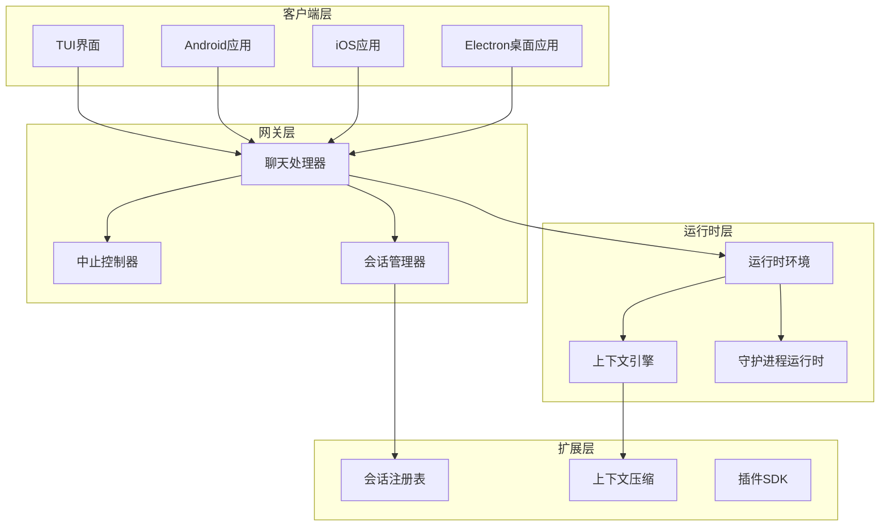
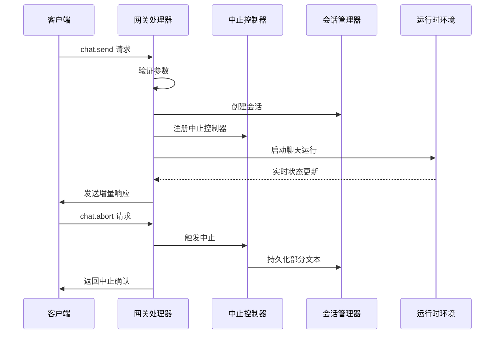
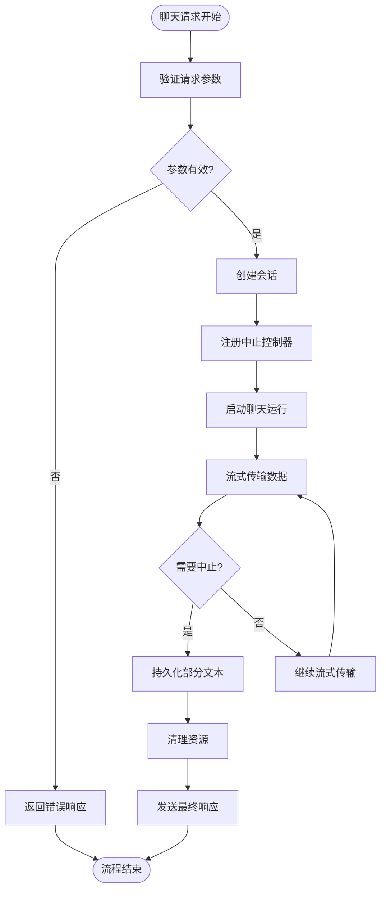
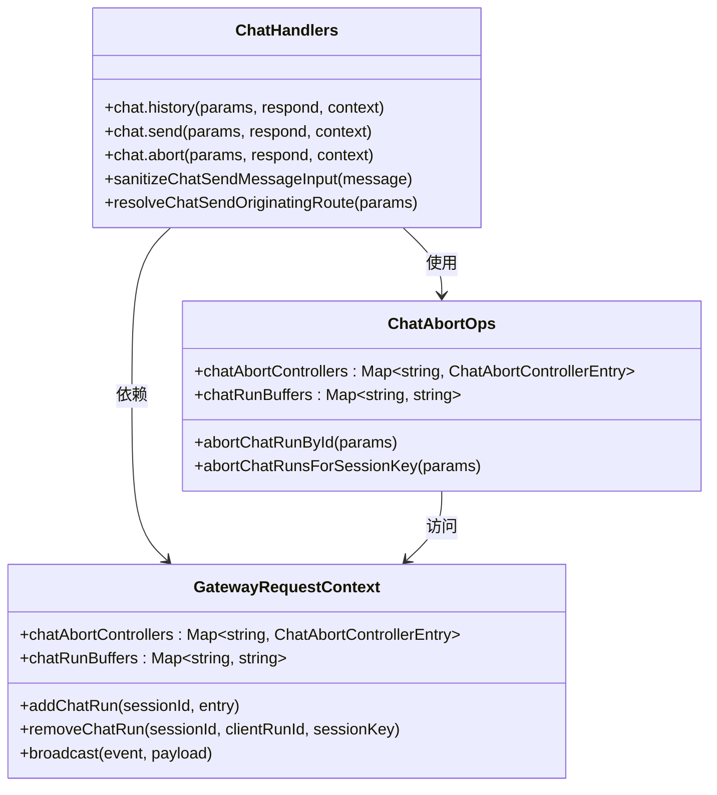
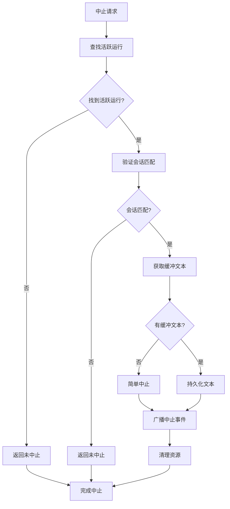
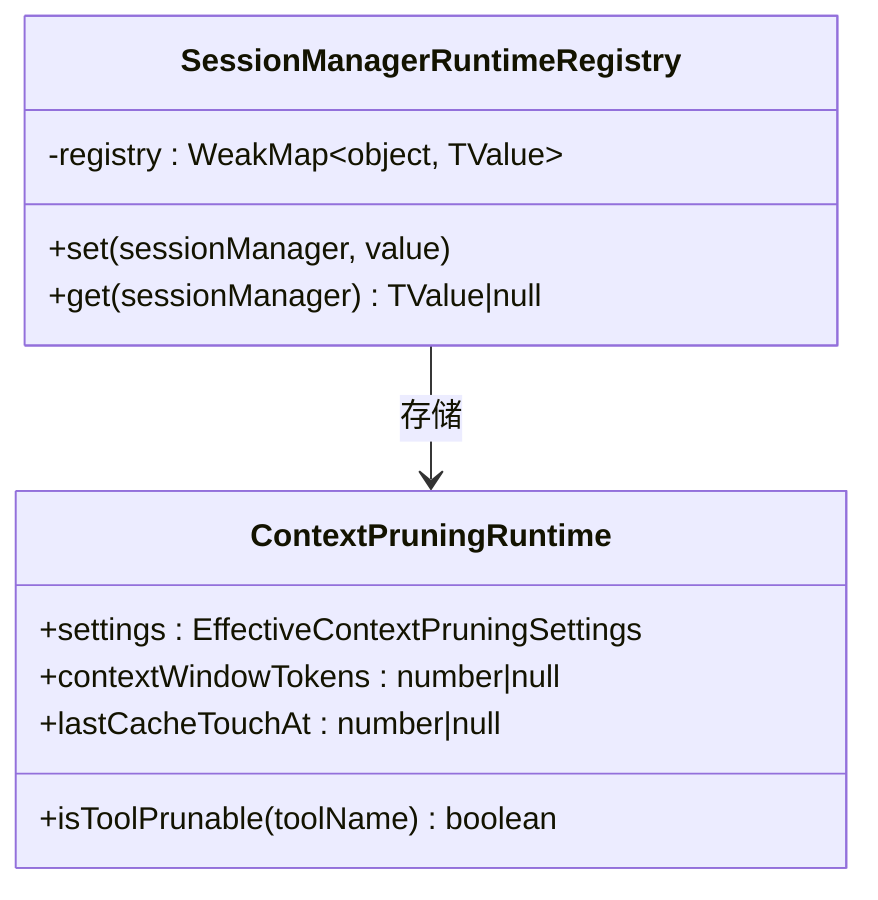
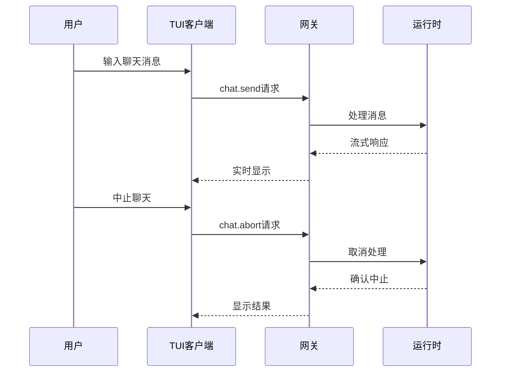
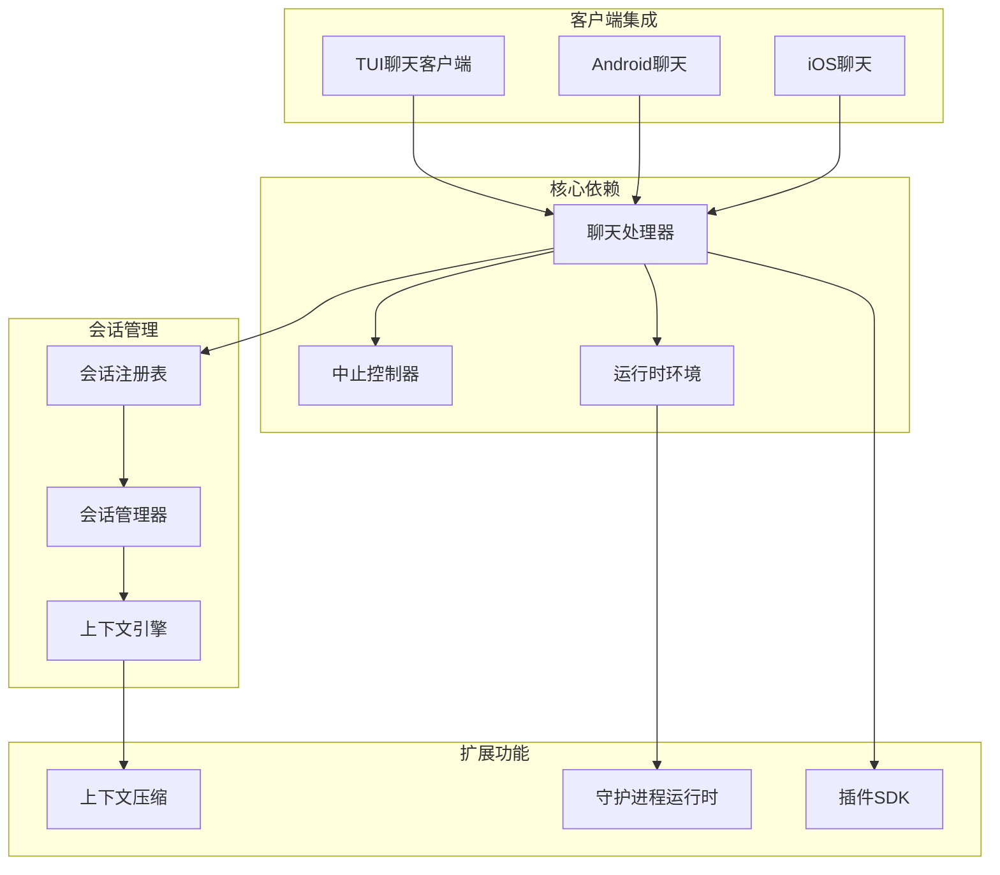
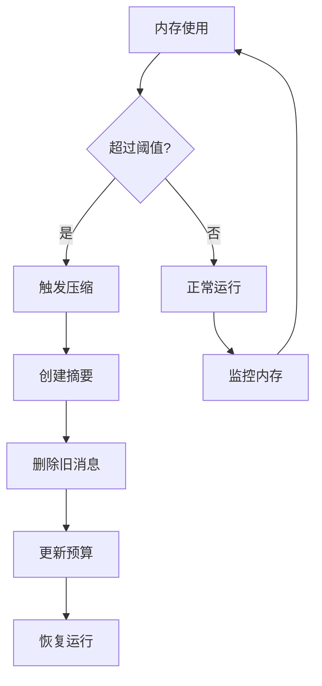

# 聊天运行时提供者增强

<cite>
**本文档引用的文件**
- [src/gateway/server-methods/chat.ts](file://src/gateway/server-methods/chat.ts)
- [src/gateway/chat-abort.ts](file://src/gateway/chat-abort.ts)
- [src/gateway/server-methods/types.ts](file://src/gateway/server-methods/types.ts)
- [src/runtime.ts](file://src/runtime.ts)
- [src/tui/gateway-chat.ts](file://src/tui/gateway-chat.ts)
- [apps/android/app/src/main/java/ai/openclaw/app/voice/TalkModeManager.kt](file://apps/android/app/src/main/java/ai/openclaw/app/voice/TalkModeManager.kt)
- [src/agents/pi-extensions/session-manager-runtime-registry.ts](file://src/agents/pi-extensions/session-manager-runtime-registry.ts)
- [src/agents/pi-extensions/context-pruning/runtime.ts](file://src/agents/pi-extensions/context-pruning/runtime.ts)
- [src/context-engine/types.ts](file://src/context-engine/types.ts)
- [src/commands/daemon-runtime.ts](file://src/commands/daemon-runtime.ts)
</cite>

## 目录
1. [简介](#简介)
2. [项目结构](#项目结构)
3. [核心组件](#核心组件)
4. [架构概览](#架构概览)
5. [详细组件分析](#详细组件分析)
6. [依赖关系分析](#依赖关系分析)
7. [性能考虑](#性能考虑)
8. [故障排除指南](#故障排除指南)
9. [结论](#结论)

## 简介

OpenClaw是一个强大的聊天代理平台，提供了完整的聊天运行时提供者增强功能。本文档深入分析了聊天运行时提供者的架构设计、实现细节和最佳实践，重点关注会话管理、运行时上下文处理、错误恢复机制和多平台支持。

该系统通过统一的聊天运行时接口，为各种客户端（包括TUI界面、Android应用、iOS应用等）提供一致的聊天体验。系统采用模块化设计，支持动态会话管理、智能上下文压缩、运行时状态跟踪和优雅的错误处理机制。

## 项目结构

OpenClaw项目采用分层架构设计，主要包含以下核心层次：

**图表来源**
- [src/gateway/server-methods/chat.ts:741-800](file://src/gateway/server-methods/chat.ts#L741-L800)
- [src/gateway/server-methods/types.ts:33-91](file://src/gateway/server-methods/types.ts#L33-L91)
- [src/runtime.ts:4-54](file://src/runtime.ts#L4-L54)

**章节来源**
- [src/gateway/server-methods/chat.ts:1-1305](file://src/gateway/server-methods/chat.ts#L1-L1305)
- [src/gateway/server-methods/types.ts:1-113](file://src/gateway/server-methods/types.ts#L1-L113)
- [src/runtime.ts:1-54](file://src/runtime.ts#L1-L54)

## 核心组件

### 聊天运行时提供者

聊天运行时提供者是整个系统的中枢，负责处理所有聊天相关的请求和响应。其核心功能包括：

- **请求验证**：对所有传入的聊天请求进行参数验证和格式检查
- **会话管理**：维护活跃会话的状态和生命周期
- **消息路由**：将消息正确路由到相应的处理管道
- **状态同步**：确保所有客户端都能获得最新的聊天状态

### 中止控制机制

系统实现了完善的聊天运行中止机制，支持多种中止场景：

- **RPC中止**：通过远程过程调用触发的中止
- **停止命令**：用户输入特定停止命令触发的中止
- **超时中止**：超过预设时间限制自动中止
- **部分文本持久化**：在中止时保存未完成的文本内容

### 会话管理器

会话管理器提供基于对象身份的会话作用域运行时注册表，确保：

- **稳定性**：SessionManager实例在整个生命周期内保持稳定
- **隔离性**：不同会话之间的运行时状态相互隔离
- **可追踪性**：每个会话的运行时状态都可以被追踪和调试

**章节来源**
- [src/gateway/server-methods/chat.ts:741-901](file://src/gateway/server-methods/chat.ts#L741-L901)
- [src/gateway/chat-abort.ts:30-126](file://src/gateway/chat-abort.ts#L30-L126)
- [src/agents/pi-extensions/session-manager-runtime-registry.ts:1-30](file://src/agents/pi-extensions/session-manager-runtime-registry.ts#L1-L30)

## 架构概览

OpenClaw的聊天运行时提供者采用事件驱动的架构模式，通过以下关键组件协同工作：

**图表来源**
- [src/gateway/server-methods/chat.ts:876-901](file://src/gateway/server-methods/chat.ts#L876-L901)
- [src/gateway/chat-abort.ts:73-104](file://src/gateway/chat-abort.ts#L73-L104)

### 数据流架构

系统采用双向数据流设计，确保实时性和一致性：

**图表来源**
- [src/gateway/server-methods/chat.ts:850-875](file://src/gateway/server-methods/chat.ts#L850-L875)
- [src/gateway/chat-abort.ts:61-104](file://src/gateway/chat-abort.ts#L61-L104)

## 详细组件分析

### 聊天处理器实现

聊天处理器是系统的核心组件，负责处理所有聊天相关的RPC请求：

#### 主要功能模块

1. **请求验证模块**
   - 参数类型验证
   - 会话键长度检查
   - 附件格式验证

2. **会话路由模块**
   - 外部交付路由继承
   - 通道特定会话形状
   - 主会话范围解析

3. **消息安全模块**
   - 控制字符清理
   - 内容标签剥离
   - 历史记录截断

#### 关键实现特性

**图表来源**
- [src/gateway/server-methods/chat.ts:741-800](file://src/gateway/server-methods/chat.ts#L741-L800)
- [src/gateway/chat-abort.ts:30-43](file://src/gateway/chat-abort.ts#L30-L43)
- [src/gateway/server-methods/types.ts:33-91](file://src/gateway/server-methods/types.ts#L33-L91)

**章节来源**
- [src/gateway/server-methods/chat.ts:1-1305](file://src/gateway/server-methods/chat.ts#L1-L1305)
- [src/gateway/server-methods/types.ts:1-113](file://src/gateway/server-methods/types.ts#L1-L113)

### 中止控制机制详解

中止控制机制提供了灵活的运行时控制能力：

#### 中止控制器结构

| 字段 | 类型 | 描述 |
|------|------|------|
| controller | AbortController | 标准AbortController实例 |
| sessionId | string | 关联的会话ID |
| sessionKey | string | 会话键值 |
| startedAtMs | number | 开始时间戳（毫秒） |
| expiresAtMs | number | 过期时间戳（毫秒） |

#### 中止流程

**图表来源**
- [src/gateway/chat-abort.ts:73-104](file://src/gateway/chat-abort.ts#L73-L104)

**章节来源**
- [src/gateway/chat-abort.ts:1-126](file://src/gateway/chat-abort.ts#L1-L126)

### 会话管理器运行时注册表

会话管理器运行时注册表提供了基于WeakMap的会话作用域存储机制：

#### 注册表实现原理

**图表来源**
- [src/agents/pi-extensions/session-manager-runtime-registry.ts:1-30](file://src/agents/pi-extensions/session-manager-runtime-registry.ts#L1-L30)
- [src/agents/pi-extensions/context-pruning/runtime.ts:4-17](file://src/agents/pi-extensions/context-pruning/runtime.ts#L4-L17)

#### 关键设计原则

1. **对象身份键控**：使用WeakMap确保只有对象身份作为键
2. **内存安全**：避免循环引用导致的内存泄漏
3. **会话隔离**：每个SessionManager实例拥有独立的运行时状态
4. **类型安全**：泛型支持确保类型安全的值存储

**章节来源**
- [src/agents/pi-extensions/session-manager-runtime-registry.ts:1-30](file://src/agents/pi-extensions/session-manager-runtime-registry.ts#L1-L30)
- [src/agents/pi-extensions/context-pruning/runtime.ts:1-17](file://src/agents/pi-extensions/context-pruning/runtime.ts#L1-L17)

### 上下文引擎接口

上下文引擎提供了高级的上下文管理功能：

#### 核心接口方法

| 方法名 | 参数 | 返回值 | 描述 |
|--------|------|--------|------|
| assemble | sessionId, messages, tokenBudget | AssembleResult | 在令牌预算下组装模型上下文 |
| compact | sessionId, sessionFile, tokenBudget | CompactResult | 压缩上下文以减少令牌使用 |
| afterTurn | sessionId, sessionFile, messages | void | 在运行尝试完成后执行后置工作 |
| prepareSubagentSpawn | parentSessionKey, childSessionKey | SubagentSpawnPreparation | 准备子代理状态 |
| onSubagentEnded | childSessionKey, reason | void | 通知子代理生命周期结束 |

#### 上下文压缩策略

上下文引擎支持多种压缩策略来优化令牌使用：

1. **主动压缩**：根据当前令牌使用情况主动触发压缩
2. **阈值触发**：当令牌使用超过阈值时自动压缩
3. **预算驱动**：基于模型上下文窗口大小进行预算管理
4. **智能摘要**：创建对话摘要以减少冗余信息

**章节来源**
- [src/context-engine/types.ts:97-168](file://src/context-engine/types.ts#L97-L168)

### 多平台客户端集成

系统支持多种客户端平台，每种平台都有专门的集成实现：

#### TUI客户端实现

TUI客户端提供了命令行界面的聊天功能：

**图表来源**
- [src/tui/gateway-chat.ts:204-229](file://src/tui/gateway-chat.ts#L204-L229)

#### Android客户端实现

Android客户端提供了移动设备的聊天功能：

| 功能特性 | 实现细节 | 配置选项 |
|----------|----------|----------|
| 语音聊天 | TalkModeManager | timeoutMs: 30000 |
| 连接管理 | GatewaySession | idempotencyKey自动生成 |
| 缓存机制 | pendingRunStates | 最大缓存100个运行状态 |
| 超时处理 | withTimeout(120000ms) | 自动取消挂起操作 |

**章节来源**
- [src/tui/gateway-chat.ts:187-229](file://src/tui/gateway-chat.ts#L187-L229)
- [apps/android/app/src/main/java/ai/openclaw/app/voice/TalkModeManager.kt:696-744](file://apps/android/app/src/main/java/ai/openclaw/app/voice/TalkModeManager.kt#L696-L744)

### 运行时环境管理

运行时环境提供了统一的日志记录和错误处理接口：

#### 运行时接口定义

| 方法 | 参数 | 行为 | 用途 |
|------|------|------|------|
| log | ...args: unknown[] | 清理进度线并输出日志 | 标准输出 |
| error | ...args: unknown[] | 清理进度线并输出错误 | 错误报告 |
| exit | code: number | 恢复终端状态并退出 | 程序终止 |

#### 非退出运行时

系统还提供了非退出运行时变体，用于测试和特殊场景：

- **createNonExitingRuntime()**：创建不实际退出进程的运行时
- **错误处理**：抛出包含退出码的错误而不是直接退出
- **测试友好**：便于单元测试和集成测试

**章节来源**
- [src/runtime.ts:4-54](file://src/runtime.ts#L4-L54)

## 依赖关系分析

### 组件依赖图

**图表来源**
- [src/gateway/server-methods/chat.ts:1-68](file://src/gateway/server-methods/chat.ts#L1-L68)
- [src/agents/pi-extensions/session-manager-runtime-registry.ts:1-30](file://src/agents/pi-extensions/session-manager-runtime-registry.ts#L1-L30)
- [src/commands/daemon-runtime.ts:1-19](file://src/commands/daemon-runtime.ts#L1-L19)

### 关键依赖关系

1. **聊天处理器依赖**：
   - 参数验证模块
   - 会话管理模块
   - 中止控制模块
   - 日志记录模块

2. **会话管理依赖**：
   - 运行时注册表
   - 上下文引擎
   - 附件处理模块

3. **客户端集成依赖**：
   - RPC通信协议
   - 会话状态同步
   - 错误恢复机制

**章节来源**
- [src/gateway/server-methods/chat.ts:1-68](file://src/gateway/server-methods/chat.ts#L1-L68)
- [src/gateway/server-methods/types.ts:1-14](file://src/gateway/server-methods/types.ts#L1-L14)

## 性能考虑

### 令牌预算管理

系统实现了智能的令牌预算管理机制：

1. **动态预算调整**：根据模型能力和会话历史动态调整预算
2. **预压缩策略**：在达到阈值前主动进行上下文压缩
3. **增量处理**：支持增量式上下文处理，避免一次性加载大量数据

### 内存优化策略

### 并发处理优化

系统支持高并发的聊天处理：

- **无序列化**：相同频道的消息可以并发处理
- **资源池管理**：合理管理连接和资源池
- **超时控制**：防止长时间阻塞操作

## 故障排除指南

### 常见问题诊断

#### 聊天中止问题

**症状**：聊天无法正常中止或中止后出现异常

**诊断步骤**：
1. 检查中止控制器是否正确注册
2. 验证会话键匹配性
3. 确认缓冲文本是否正确持久化
4. 查看广播事件是否正常发送

**解决方案**：
- 重新初始化中止控制器
- 验证会话状态一致性
- 检查网络连接稳定性

#### 会话管理问题

**症状**：会话状态不一致或内存泄漏

**诊断步骤**：
1. 检查WeakMap注册表状态
2. 验证SessionManager实例稳定性
3. 确认对象身份键的正确性
4. 查看是否有循环引用

**解决方案**：
- 重新创建会话管理器实例
- 清理注册表中的无效条目
- 实施适当的垃圾回收策略

#### 客户端连接问题

**症状**：客户端无法连接或连接不稳定

**诊断步骤**：
1. 检查网关服务状态
2. 验证RPC协议版本兼容性
3. 确认防火墙和网络配置
4. 查看客户端认证状态

**解决方案**：
- 重启网关服务
- 更新客户端到最新版本
- 检查网络配置和证书

**章节来源**
- [src/gateway/chat-abort.ts:73-104](file://src/gateway/chat-abort.ts#L73-L104)
- [src/agents/pi-extensions/session-manager-runtime-registry.ts:1-30](file://src/agents/pi-extensions/session-manager-runtime-registry.ts#L1-L30)

## 结论

OpenClaw的聊天运行时提供者通过精心设计的架构和实现，为现代聊天应用提供了强大而灵活的基础。系统的主要优势包括：

1. **模块化设计**：清晰的组件分离和职责划分
2. **可扩展性**：支持多种客户端平台和扩展功能
3. **可靠性**：完善的错误处理和恢复机制
4. **性能优化**：智能的资源管理和并发处理
5. **开发友好**：清晰的API设计和丰富的工具支持

通过会话管理器运行时注册表、智能上下文压缩和完善的中止控制机制，系统能够高效地处理复杂的聊天场景，同时保持良好的性能和稳定性。这些特性使得OpenClaw成为构建企业级聊天应用的理想选择。

未来的发展方向包括进一步优化上下文处理算法、增强多模态支持和改进移动端用户体验。随着技术的不断演进，OpenClaw将继续为聊天应用开发提供强有力的技术支撑。