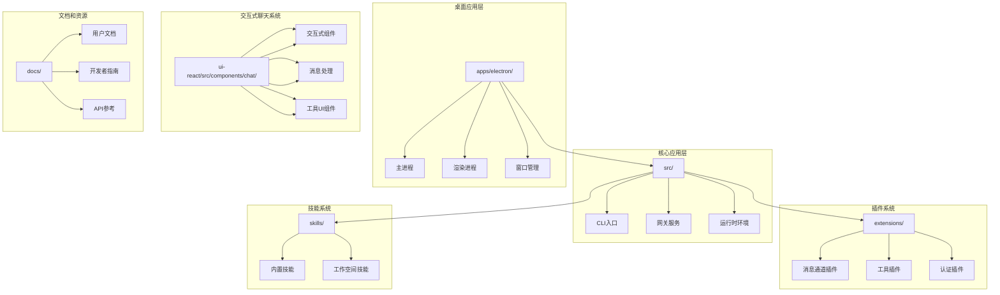
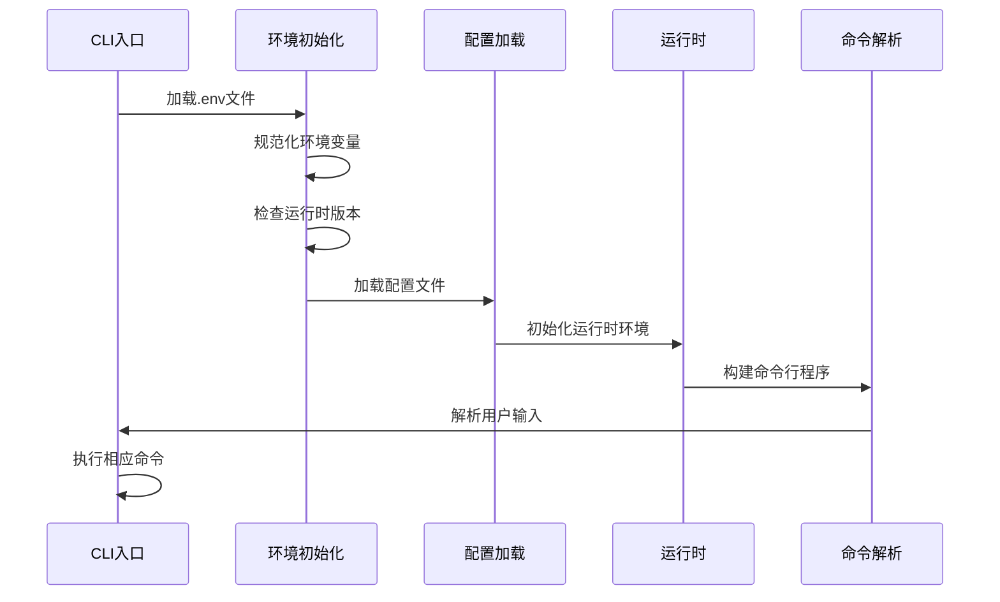
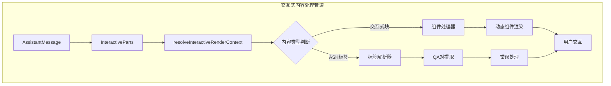
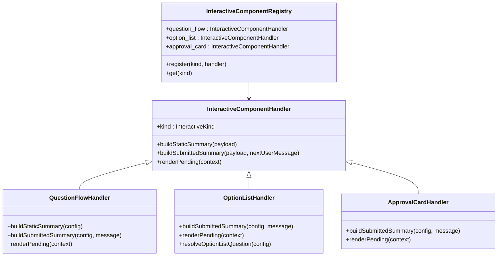

# 交互式聊天系统增强

<cite>
**本文档引用的文件**
- [README.md](file://README.md)
- [src/index.ts](file://src/index.ts)
- [src/runtime.ts](file://src/runtime.ts)
- [apps/electron/src/main/index.ts](file://apps/electron/src/main/index.ts)
- [package.json](file://package.json)
- [ui-react/src/components/chat/interactive/InteractiveParts.tsx](file://ui-react/src/components/chat/interactive/InteractiveParts.tsx)
- [ui-react/src/components/chat/AssistantMessage.tsx](file://ui-react/src/components/chat/AssistantMessage.tsx)
- [ui-react/src/components/chat/interactive/interactive-registry.tsx](file://ui-react/src/components/chat/interactive/interactive-registry.tsx)
- [ui-react/src/components/chat/interactive/ask-tag.ts](file://ui-react/src/components/chat/interactive/ask-tag.ts)
- [ui-react/src/components/chat/interactive/qa-format.ts](file://ui-react/src/components/chat/interactive/qa-format.ts)
- [ui-react/src/components/chat/interactive/interactive-shared.ts](file://ui-react/src/components/chat/interactive/interactive-shared.ts)
- [ui-react/src/components/chat/interactive/index.ts](file://ui-react/src/components/chat/interactive/index.ts)
- [skills/openclaw-interactions/SKILL.md](file://skills/openclaw-interactions/SKILL.md)
</cite>

## 更新摘要
**所做更改**
- 新增了交互式聊天系统架构分析，包括 InteractiveParts.tsx 组件的详细说明
- 更新了核心组件部分，增加了新的交互式内容处理能力
- 新增了交互式组件注册表和问答格式化系统
- 更新了架构概览图，反映新的交互式聊天系统结构
- 增强了详细组件分析，涵盖完整的交互式内容处理流程
- **新增** 交互式系统增强功能：humanizeInteractionId 和 resolveOptionListQuestion 函数优化了交互提示的可读性

## 目录
1. [项目概述](#项目概述)
2. [项目结构](#项目结构)
3. [核心组件](#核心组件)
4. [架构概览](#架构概览)
5. [详细组件分析](#详细组件分析)
6. [交互式聊天系统架构](#交互式聊天系统架构)
7. [依赖关系分析](#依赖关系分析)
8. [性能考虑](#性能考虑)
9. [故障排除指南](#故障排除指南)
10. [结论](#结论)

## 项目概述

OpenClaw是一个个人AI助手平台，可在用户的设备上运行。该项目提供了多渠道消息传递集成、可扩展的消息通道插件系统，以及增强的交互式聊天体验。

### 主要特性
- **多平台支持**：支持macOS、iOS、Android、Windows和Linux
- **多渠道集成**：支持WhatsApp、Telegram、Slack、Discord、Google Chat、Signal、iMessage等多种消息平台
- **本地优先**：强调本地运行和隐私保护
- **可扩展架构**：基于插件系统的模块化设计
- **增强的聊天体验**：支持语音唤醒、实时画布、工具集成等功能
- **交互式内容处理**：全新的 InteractiveParts.tsx 组件提供强大的交互式内容处理能力
- **智能交互提示**：**新增** humanizeInteractionId 和 resolveOptionListQuestion 函数显著改善了交互提示的可读性和用户体验

**章节来源**
- [README.md:21-176](file://README.md#L21-L176)

## 项目结构

项目采用模块化的组织方式，主要包含以下核心目录：



**图表来源**
- [package.json:23-34](file://package.json#L23-L34)
- [README.md:141-184](file://README.md#L141-L184)

**章节来源**
- [package.json:1-477](file://package.json#L1-L477)
- [README.md:141-184](file://README.md#L141-L184)

## 核心组件

### CLI入口组件
CLI入口是整个系统的启动点，负责初始化运行时环境、加载配置和构建命令行程序。

### 网关服务组件
网关服务作为系统的控制平面，提供WebSocket通信、会话管理和事件路由功能。

### 运行时环境组件
运行时环境负责处理日志输出、错误处理和终端状态管理。

### 桌面应用组件
Electron桌面应用提供图形用户界面，集成网关服务和配置向导。

### 交互式聊天组件
**新增** 全新的交互式聊天系统，基于 InteractiveParts.tsx 组件提供强大的交互式内容处理能力，包括：
- 交互式内容块渲染
- 动态组件注册表
- 问答格式化系统
- 交互式元数据管理
- **智能交互提示优化**：**新增** humanizeInteractionId 函数将原始ID转换为用户友好的提示文本，resolveOptionListQuestion 函数智能确定选项列表的问题标题

**章节来源**
- [src/index.ts:1-94](file://src/index.ts#L1-L94)
- [src/runtime.ts:1-54](file://src/runtime.ts#L1-L54)
- [ui-react/src/components/chat/interactive/InteractiveParts.tsx:184-293](file://ui-react/src/components/chat/interactive/InteractiveParts.tsx#L184-L293)

## 架构概览

OpenClaw采用分层架构设计，从底层的网关服务到顶层的应用界面，现在包含了全新的交互式聊天系统：

```mermaid
graph TD
subgraph "用户界面层"
UI[Web界面<br/>Electron应用<br/>移动应用]
end
subgraph "应用服务层"
GW[网关服务<br/>WebSocket控制平面]
RT[运行时环境<br/>日志和错误处理]
end
subgraph "交互式聊天系统"
IP[InteractiveParts组件<br/>交互式内容渲染]
IR[交互式组件注册表<br/>动态组件管理]
AF[问答格式化系统<br/>QA对处理]
AT[ASK标签解析<br/>交互式内容提取]
HI[智能交互提示<br/>humanizeInteractionId]
ROLQ[选项列表问题解析<br/>resolveOptionListQuestion]
end
subgraph "插件系统层"
CH[消息通道插件<br/>Telegram/WhatsApp/Slack等]
TK[工具插件<br/>浏览器/节点/会话]
AU[认证插件<br/>OAuth/API密钥]
end
subgraph "基础设施层"
CFG[配置管理]
MEM[内存存储<br/>交互式流状态]
LOG[日志系统]
END
UI --> GW
GW --> RT
GW --> IP
GW --> CH
GW --> TK
GW --> AU
IP --> IR
IP --> AF
IP --> AT
IP --> HI
IP --> ROLQ
IR --> TK
AF --> MEM
AT --> MEM
HI --> ROLQ
GW --> CFG
GW --> MEM
GW --> LOG
RT --> LOG
CFG --> MEM
```

**图表来源**
- [README.md:185-254](file://README.md#L185-L254)
- [src/index.ts:46-73](file://src/index.ts#L46-L73)
- [ui-react/src/components/chat/interactive/InteractiveParts.tsx:184-293](file://ui-react/src/components/chat/interactive/InteractiveParts.tsx#L184-L293)

## 详细组件分析

### CLI入口组件分析

CLI入口组件是系统的核心启动器，负责以下关键功能：

#### 组件职责
- 环境初始化和验证
- 配置加载和会话管理
- 错误处理和异常捕获
- 全局依赖注入

#### 关键流程


**图表来源**
- [src/index.ts:36-44](file://src/index.ts#L36-L44)
- [src/index.ts:79-93](file://src/index.ts#L79-L93)

**章节来源**
- [src/index.ts:1-94](file://src/index.ts#L1-L94)

### 运行时环境组件分析

运行时环境组件提供统一的日志记录和错误处理机制：

#### 日志处理机制
- 结构化日志输出
- 进度条状态管理
- 测试环境兼容性

#### 错误处理策略
- 未捕获异常处理
- 未处理拒绝处理
- 优雅的进程退出

**章节来源**
- [src/runtime.ts:1-54](file://src/runtime.ts#L1-L54)

### 桌面应用组件分析

Electron桌面应用提供完整的GUI体验，集成了网关服务和配置向导：

#### 核心功能模块
- **网关管理**：启动、停止和重启网关服务
- **配置向导**：首次启动时的设置流程
- **OAuth认证**：多种认证方式的支持
- **自动更新**：应用版本管理和更新机制

#### 应用生命周期


**图表来源**
- [apps/electron/src/main/index.ts:461-479](file://apps/electron/src/main/index.ts#L461-L479)
- [apps/electron/src/main/index.ts:431-447](file://apps/electron/src/main/index.ts#L431-L447)

**章节来源**
- [apps/electron/src/main/index.ts:1-505](file://apps/electron/src/main/index.ts#L1-L505)

### 交互式聊天系统组件分析

**新增** OpenClaw现在包含一个全新的交互式聊天系统，基于 InteractiveParts.tsx 组件提供强大的交互式内容处理能力。

#### InteractiveParts 组件架构

InteractiveParts 组件是交互式聊天系统的核心，负责处理和渲染交互式内容块：

```mermaid
flowchart TD
subgraph "InteractiveParts 渲染流程"
A[接收 messageId] --> B[获取聊天状态]
B --> C[解析交互式渲染上下文]
C --> D{是否有交互块？}
D --> |是| E[获取组件处理器]
D --> |否| F{是否解析失败？}
E --> G[检查提交状态]
G --> H{是否已提交？}
H --> |是| I[显示QA摘要]
H --> |否| J[渲染待处理组件]
F --> |是| K[显示错误信息]
F --> |否| L[返回空]
K --> M[提供重新生成选项]
J --> N[组件处理器渲染]
I --> O[完成渲染]
M --> P[用户交互]
N --> O
```

**图表来源**
- [ui-react/src/components/chat/interactive/InteractiveParts.tsx:184-293](file://ui-react/src/components/chat/interactive/InteractiveParts.tsx#L184-L293)
- [ui-react/src/components/chat/interactive/interactive-registry.tsx:257-264](file://ui-react/src/components/chat/interactive/interactive-registry.tsx#L257-L264)

#### 核心功能特性

1. **动态组件注册**：通过 INTERACTIVE_COMPONENT_REGISTRY 实现组件的动态注册和管理
2. **智能渲染决策**：根据交互式内容的状态智能选择渲染方式
3. **QA对格式化**：提供标准化的问答对显示格式
4. **错误处理机制**：完善的ASK标签解析错误处理和用户指导
5. **智能交互提示**：**新增** humanizeInteractionId 和 resolveOptionListQuestion 函数优化交互提示可读性

#### 交互提示优化系统

**新增** 交互式系统现在包含智能的交互提示优化机制：

```mermaid
flowchart TD
subgraph "交互提示优化流程"
A[原始交互ID] --> B[humanizeInteractionId函数]
B --> C[规范化处理]
C --> D{ID是否为空？}
D --> |是| E[返回默认提示]
D --> |否| F[替换下划线和连字符]
F --> G[去除多余空白]
G --> H[首字母大写化]
H --> I[返回友好提示]
E --> J[用户选择]
F --> J
G --> J
H --> J
I --> J
```

**图表来源**
- [ui-react/src/components/chat/interactive/interactive-registry.tsx:61-70](file://ui-react/src/components/chat/interactive/interactive-registry.tsx#L61-L70)

#### 组件处理器系统

交互式组件处理器系统提供了三种核心组件类型：

- **QuestionFlow（问题流程）**：支持前置模式和渐进模式的问题收集
- **OptionList（选项列表）**：提供单选或多选的选项处理，**新增** 智能问题解析
- **ApprovalCard（审批卡片）**：处理批准/拒绝的确认流程

**章节来源**
- [ui-react/src/components/chat/interactive/InteractiveParts.tsx:184-293](file://ui-react/src/components/chat/interactive/InteractiveParts.tsx#L184-L293)
- [ui-react/src/components/chat/interactive/interactive-registry.tsx:77-255](file://ui-react/src/components/chat/interactive/interactive-registry.tsx#L77-L255)
- [ui-react/src/components/chat/interactive/ask-tag.ts:72-159](file://ui-react/src/components/chat/interactive/ask-tag.ts#L72-L159)
- [ui-react/src/components/chat/interactive/qa-format.ts:5-22](file://ui-react/src/components/chat/interactive/qa-format.ts#L5-L22)

## 交互式聊天系统架构

### 系统设计原理

OpenClaw的交互式聊天系统采用了模块化和可扩展的设计原则：

#### 核心架构模式



**图表来源**
- [ui-react/src/components/chat/AssistantMessage.tsx:114-115](file://ui-react/src/components/chat/AssistantMessage.tsx#L114-L115)
- [ui-react/src/components/chat/interactive/InteractiveParts.tsx:83-182](file://ui-react/src/components/chat/interactive/InteractiveParts.tsx#L83-L182)

#### 数据流架构

1. **消息合并**：将同一轮对话中的多个助手消息合并为单一显示单元
2. **内容提取**：从合并后的消息中提取交互式内容块
3. **组件匹配**：根据内容类型匹配相应的组件处理器
4. **状态管理**：维护交互式内容的提交状态和用户反馈
5. **渲染优化**：根据用户交互状态选择最优的渲染策略

### 组件注册机制

交互式组件通过统一的注册表进行管理，支持动态扩展：

#### 注册表结构



**图表来源**
- [ui-react/src/components/chat/interactive/interactive-registry.tsx:35-53](file://ui-react/src/components/chat/interactive/interactive-registry.tsx#L35-L53)
- [ui-react/src/components/chat/interactive/interactive-registry.tsx:257-264](file://ui-react/src/components/chat/interactive/interactive-registry.tsx#L257-L264)

### 交互提示优化系统

**新增** 交互式系统现在包含两个关键的优化函数：

#### humanizeInteractionId 函数
将原始的交互ID转换为用户友好的提示文本：
- 替换下划线和连字符为空格
- 去除多余空白字符
- 首字母大写化处理
- 空ID时返回默认提示"Your choice"

#### resolveOptionListQuestion 函数
智能确定选项列表的问题标题：
- 优先使用配置中的标题
- 其次使用描述文本
- 最后回退到humanizeInteractionId处理的ID
- 确保每个选项列表都有清晰的问题提示

**章节来源**
- [ui-react/src/components/chat/interactive/interactive-registry.tsx:1-291](file://ui-react/src/components/chat/interactive/interactive-registry.tsx#L1-L291)
- [ui-react/src/components/chat/interactive/interactive-shared.ts:3-18](file://ui-react/src/components/chat/interactive/interactive-shared.ts#L3-L18)

## 依赖关系分析

项目使用现代化的包管理策略，依赖关系清晰且维护良好，现在包含了交互式聊天系统的相关依赖：

```mermaid
graph LR
subgraph "核心依赖"
A[node >= 22.12.0]
B[@mariozechner/pi-*]
C[commander]
D[chokidar]
E[assistant-ui/react]
end
subgraph "消息通道依赖"
F[@whiskeysockets/baileys]
G[@grammyjs/*]
H[@slack/bolt]
I[discord.js]
end
subgraph "工具和实用程序"
J[ws]
K[express]
L[yaml]
M[zod]
N[react]
O[react-dom]
end
subgraph "开发工具"
P[vitest]
Q[oxlint]
R[typescript]
S[tsx]
end
subgraph "交互式聊天系统"
T[InteractiveParts]
U[组件注册表]
V[ASK标签解析]
W[QA格式化]
X[工具UI组件]
Y[humanizeInteractionId]
Z[resolveOptionListQuestion]
end
A --> B
A --> C
A --> D
C --> F
C --> G
C --> H
C --> I
E --> T
T --> U
T --> V
T --> W
U --> X
U --> Y
U --> Z
Y --> Z
```

**图表来源**
- [package.json:432-434](file://package.json#L432-L434)
- [package.json:344-404](file://package.json#L344-L404)
- [ui-react/src/components/chat/interactive/InteractiveParts.tsx:1-18](file://ui-react/src/components/chat/interactive/InteractiveParts.tsx#L1-L18)

**章节来源**
- [package.json:1-477](file://package.json#L1-L477)

## 性能考虑

### 启动性能优化
- **延迟加载**：按需加载插件和模块
- **并行初始化**：环境预热和静态服务器启动并行进行
- **缓存策略**：配置和会话数据的智能缓存
- **组件懒加载**：交互式组件按需渲染，减少初始加载负担

### 内存管理
- **垃圾回收优化**：合理管理大型对象和数组
- **资源清理**：及时释放WebSocket连接和文件句柄
- **内存泄漏防护**：监控和防止常见的内存泄漏模式
- **状态管理优化**：交互式流状态的高效存储和访问

### 网络性能
- **连接池管理**：复用HTTP和WebSocket连接
- **超时配置**：合理的请求超时和重试策略
- **流量控制**：限制并发请求数量
- **增量渲染**：交互式内容的增量更新机制

### 交互式系统性能
- **组件缓存**：已渲染的交互式组件缓存避免重复计算
- **状态同步**：交互式状态的高效同步机制
- **错误恢复**：ASK标签解析失败的快速恢复策略
- **用户反馈**：即时的用户交互响应机制
- **智能提示优化**：**新增** humanizeInteractionId 和 resolveOptionListQuestion 函数的高效字符串处理算法

## 故障排除指南

### 常见问题诊断

#### 网关连接问题
- 检查端口占用情况
- 验证防火墙设置
- 确认令牌有效性

#### 插件加载失败
- 检查插件兼容性
- 验证依赖完整性
- 查看插件日志输出

#### 性能问题
- 监控内存使用情况
- 分析CPU使用率
- 检查磁盘I/O性能

#### 交互式系统问题
- **组件渲染失败**：检查组件注册表配置和组件处理器实现
- **ASK标签解析错误**：验证ASK标签格式和JSON有效性的检查
- **用户交互无响应**：检查交互式元数据的正确设置和状态同步
- **QA对显示异常**：验证QA格式化函数和用户输入的匹配
- **交互提示不友好**：**新增** 检查humanizeInteractionId和resolveOptionListQuestion函数的ID格式和配置

**章节来源**
- [src/index.ts:24-29](file://src/index.ts#L24-L29)
- [apps/electron/src/main/index.ts:440-443](file://apps/electron/src/main/index.ts#L440-L443)
- [ui-react/src/components/chat/interactive/ask-tag.ts:30-43](file://ui-react/src/components/chat/interactive/ask-tag.ts#L30-L43)

## 结论

OpenClaw交互式聊天系统展现了现代AI助手平台的完整架构。通过模块化的插件系统、强大的多平台支持、优雅的用户体验设计，以及全新的交互式内容处理能力，该系统为用户提供了强大而灵活的聊天助手解决方案。

### 技术优势
- **高度模块化**：插件系统允许轻松扩展新功能
- **跨平台兼容**：统一的代码库支持多个操作系统
- **安全优先**：本地运行和严格的权限控制
- **可扩展性**：良好的架构设计支持未来功能扩展
- **交互式创新**：全新的 InteractiveParts.tsx 组件提供强大的交互式内容处理能力
- **智能用户体验**：**新增** humanizeInteractionId 和 resolveOptionListQuestion 函数显著提升了交互提示的可读性和用户友好性

### 新架构特点
- **组件化设计**：交互式内容通过组件处理器系统实现模块化
- **动态注册**：支持新的交互式组件类型的动态添加
- **智能渲染**：根据内容状态和用户交互智能选择渲染策略
- **错误恢复**：完善的错误处理和用户指导机制
- **交互提示优化**：**新增** 智能的交互提示系统，将技术性ID转换为用户友好的提示文本

### 发展方向
- **AI能力增强**：集成更先进的语言模型和多模态能力
- **生态建设**：丰富的插件生态系统和技能库
- **性能优化**：持续改进启动速度和运行效率
- **用户体验**：进一步简化配置流程和提升交互体验
- **交互式扩展**：支持更多样化的交互式内容类型和交互模式
- **智能优化**：**新增** 基于用户行为的学习算法，进一步个性化交互提示

该系统为构建下一代交互式AI助手奠定了坚实的技术基础，具有广阔的发展前景和应用价值。新的交互式聊天系统不仅增强了用户体验，还为未来的功能扩展提供了强大的技术支撑。

**章节来源**
- [skills/openclaw-interactions/SKILL.md:211-218](file://skills/openclaw-interactions/SKILL.md#L211-L218)
- [ui-react/src/components/chat/interactive/index.ts:1-13](file://ui-react/src/components/chat/interactive/index.ts#L1-L13)