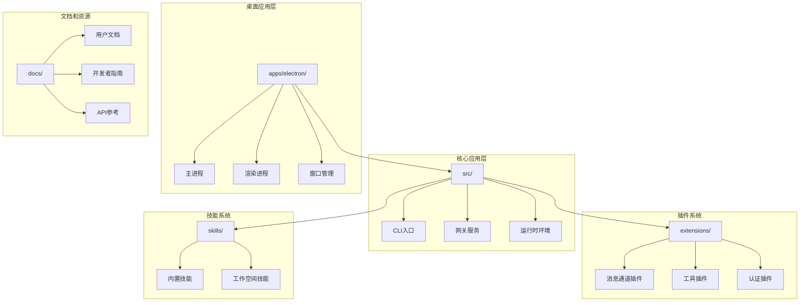
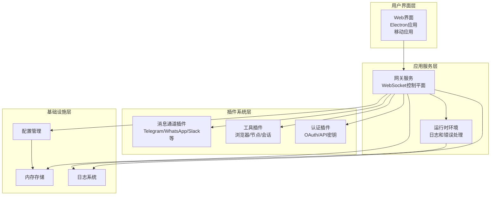
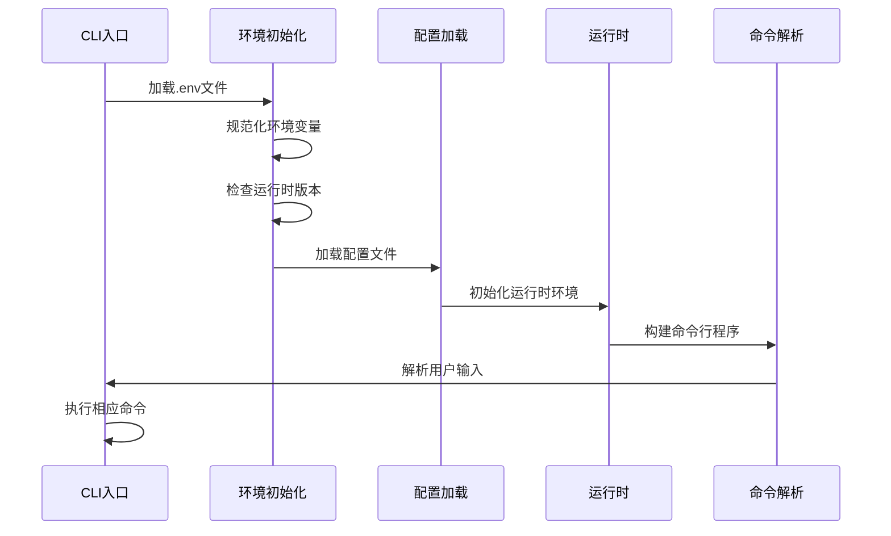
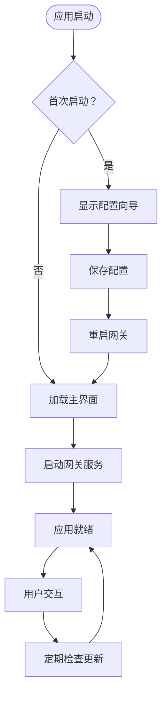

# 交互式聊天系统增强

<cite>
**本文档引用的文件**
- [README.md](file://README.md)
- [src/index.ts](file://src/index.ts)
- [src/runtime.ts](file://src/runtime.ts)
- [apps/electron/src/main/index.ts](file://apps/electron/src/main/index.ts)
- [package.json](file://package.json)
</cite>

## 目录
1. [项目概述](#项目概述)
2. [项目结构](#项目结构)
3. [核心组件](#核心组件)
4. [架构概览](#架构概览)
5. [详细组件分析](#详细组件分析)
6. [依赖关系分析](#依赖关系分析)
7. [性能考虑](#性能考虑)
8. [故障排除指南](#故障排除指南)
9. [结论](#结论)

## 项目概述

OpenClaw是一个个人AI助手平台，可在用户的设备上运行。该项目提供了多渠道消息传递集成、可扩展的消息通道插件系统，以及增强的交互式聊天体验。

### 主要特性
- **多平台支持**：支持macOS、iOS、Android、Windows和Linux
- **多渠道集成**：支持WhatsApp、Telegram、Slack、Discord、Google Chat、Signal、iMessage等多种消息平台
- **本地优先**：强调本地运行和隐私保护
- **可扩展架构**：基于插件系统的模块化设计
- **增强的聊天体验**：支持语音唤醒、实时画布、工具集成等功能

**章节来源**
- [README.md:21-176](file://README.md#L21-L176)

## 项目结构

项目采用模块化的组织方式，主要包含以下核心目录：



**图表来源**
- [package.json:23-34](file://package.json#L23-L34)
- [README.md:141-184](file://README.md#L141-L184)

**章节来源**
- [package.json:1-477](file://package.json#L1-L477)
- [README.md:141-184](file://README.md#L141-L184)

## 核心组件

### CLI入口组件
CLI入口是整个系统的启动点，负责初始化运行时环境、加载配置和构建命令行程序。

### 网关服务组件
网关服务作为系统的控制平面，提供WebSocket通信、会话管理和事件路由功能。

### 运行时环境组件
运行时环境负责处理日志输出、错误处理和终端状态管理。

### 桌面应用组件
Electron桌面应用提供图形用户界面，集成网关服务和配置向导。

**章节来源**
- [src/index.ts:1-94](file://src/index.ts#L1-L94)
- [src/runtime.ts:1-54](file://src/runtime.ts#L1-L54)

## 架构概览

OpenClaw采用分层架构设计，从底层的网关服务到顶层的应用界面：



**图表来源**
- [README.md:185-254](file://README.md#L185-L254)
- [src/index.ts:46-73](file://src/index.ts#L46-L73)

## 详细组件分析

### CLI入口组件分析

CLI入口组件是系统的核心启动器，负责以下关键功能：

#### 组件职责
- 环境初始化和验证
- 配置加载和会话管理
- 错误处理和异常捕获
- 全局依赖注入

#### 关键流程


**图表来源**
- [src/index.ts:36-44](file://src/index.ts#L36-L44)
- [src/index.ts:79-93](file://src/index.ts#L79-L93)

**章节来源**
- [src/index.ts:1-94](file://src/index.ts#L1-L94)

### 运行时环境组件分析

运行时环境组件提供统一的日志记录和错误处理机制：

#### 日志处理机制
- 结构化日志输出
- 进度条状态管理
- 测试环境兼容性

#### 错误处理策略
- 未捕获异常处理
- 未处理拒绝处理
- 优雅的进程退出

**章节来源**
- [src/runtime.ts:1-54](file://src/runtime.ts#L1-L54)

### 桌面应用组件分析

Electron桌面应用提供完整的GUI体验，集成了网关服务和配置向导：

#### 核心功能模块
- **网关管理**：启动、停止和重启网关服务
- **配置向导**：首次启动时的设置流程
- **OAuth认证**：多种认证方式的支持
- **自动更新**：应用版本管理和更新机制

#### 应用生命周期


**图表来源**
- [apps/electron/src/main/index.ts:461-479](file://apps/electron/src/main/index.ts#L461-L479)
- [apps/electron/src/main/index.ts:431-447](file://apps/electron/src/main/index.ts#L431-L447)

**章节来源**
- [apps/electron/src/main/index.ts:1-505](file://apps/electron/src/main/index.ts#L1-L505)

## 依赖关系分析

项目使用现代化的包管理策略，依赖关系清晰且维护良好：

```mermaid
graph LR
subgraph "核心依赖"
A[node >= 22.12.0]
B[@mariozechner/pi-*]
C[commander]
D[chokidar]
end
subgraph "消息通道依赖"
E[@whiskeysockets/baileys]
F[@grammyjs/*]
G[@slack/bolt]
H[discord.js]
end
subgraph "工具和实用程序"
I[ws]
J[express]
K[yaml]
L[zod]
end
subgraph "开发工具"
M[vitest]
N[oxlint]
O[typescript]
P[tsx]
end
A --> B
A --> C
A --> D
C --> E
C --> F
C --> G
C --> H
I --> J
K --> L
```

**图表来源**
- [package.json:432-434](file://package.json#L432-L434)
- [package.json:344-404](file://package.json#L344-L404)

**章节来源**
- [package.json:1-477](file://package.json#L1-L477)

## 性能考虑

### 启动性能优化
- **延迟加载**：按需加载插件和模块
- **并行初始化**：环境预热和静态服务器启动并行进行
- **缓存策略**：配置和会话数据的智能缓存

### 内存管理
- **垃圾回收优化**：合理管理大型对象和数组
- **资源清理**：及时释放WebSocket连接和文件句柄
- **内存泄漏防护**：监控和防止常见的内存泄漏模式

### 网络性能
- **连接池管理**：复用HTTP和WebSocket连接
- **超时配置**：合理的请求超时和重试策略
- **流量控制**：限制并发请求数量

## 故障排除指南

### 常见问题诊断

#### 网关连接问题
- 检查端口占用情况
- 验证防火墙设置
- 确认令牌有效性

#### 插件加载失败
- 检查插件兼容性
- 验证依赖完整性
- 查看插件日志输出

#### 性能问题
- 监控内存使用情况
- 分析CPU使用率
- 检查磁盘I/O性能

**章节来源**
- [src/index.ts:24-29](file://src/index.ts#L24-L29)
- [apps/electron/src/main/index.ts:440-443](file://apps/electron/src/main/index.ts#L440-L443)

## 结论

OpenClaw交互式聊天系统展现了现代AI助手平台的完整架构。通过模块化的插件系统、强大的多平台支持和优雅的用户体验设计，该系统为用户提供了强大而灵活的聊天助手解决方案。

### 技术优势
- **高度模块化**：插件系统允许轻松扩展新功能
- **跨平台兼容**：统一的代码库支持多个操作系统
- **安全优先**：本地运行和严格的权限控制
- **可扩展性**：良好的架构设计支持未来功能扩展

### 发展方向
- **AI能力增强**：集成更先进的语言模型和多模态能力
- **生态建设**：丰富的插件生态系统和技能库
- **性能优化**：持续改进启动速度和运行效率
- **用户体验**：进一步简化配置流程和提升交互体验

该系统为构建下一代交互式AI助手奠定了坚实的技术基础，具有广阔的发展前景和应用价值。