# 聊天事件桥接增强

<cite>
**本文档引用的文件**
- [src/channels/registry.ts](file://src/channels/registry.ts)
- [src/utils/message-channel.ts](file://src/utils/message-channel.ts)
- [src/infra/outbound/deliver.ts](file://src/infra/outbound/deliver.ts)
- [src/infra/outbound/bound-delivery-router.ts](file://src/infra/outbound/bound-delivery-router.ts)
- [src/infra/outbound/channel-adapters.ts](file://src/infra/outbound/channel-adapters.ts)
- [src/channels/plugins/outbound/load.ts](file://src/channels/plugins/outbound/load.ts)
- [src/channels/plugins/registry-loader.ts](file://src/channels/plugins/registry-loader.ts)
- [src/auto-reply/reply/route-reply.ts](file://src/auto-reply/reply/route-reply.ts)
- [src/infra/outbound/target-normalization.ts](file://src/infra/outbound/target-normalization.ts)
- [src/web/inbound/monitor.ts](file://src/web/inbound/monitor.ts)
- [src/web/auto-reply/monitor/process-message.ts](file://src/web/auto-reply/monitor/process-message.ts)
- [src/imessage/monitor/monitor-provider.ts](file://src/imessage/monitor/monitor-provider.ts)
- [src/discord/monitor/message-handler.inbound-contract.test.ts](file://src/discord/monitor/message-handler.inbound-contract.test.ts)
- [docs/gateway/bridge-protocol.md](file://docs/gateway/bridge-protocol.md)
- [docs/zh-CN/gateway/bridge-protocol.md](file://docs/zh-CN/gateway/bridge-protocol.md)
- [src/globals.ts](file://src/globals.ts)
- [src/logging/logger.ts](file://src/logging/logger.ts)
- [docs/zh-CN/help/debugging.md](file://docs/zh-CN/help/debugging.md)
- [docs/zh-CN/concepts/session-tool.md](file://docs/zh-CN/concepts/session-tool.md)
- [ui-react/src/hooks/chat-event-bridge/useChatEventBridge.ts](file://ui-react/src/hooks/chat-event-bridge/useChatEventBridge.ts)
- [ui-react/src/hooks/chat-event-bridge/interactive-blocks.ts](file://ui-react/src/hooks/chat-event-bridge/interactive-blocks.ts)
- [ui-react/src/hooks/chat-event-bridge/tool-blocks.ts](file://ui-react/src/hooks/chat-event-bridge/tool-blocks.ts)
- [ui-react/src/store/chat.store.ts](file://ui-react/src/store/chat.store.ts)
- [ui-react/src/components/tool-ui/question-flow/schema.ts](file://ui-react/src/components/tool-ui/question-flow/schema.ts)
- [ui-react/src/components/tool-ui/option-list/schema.ts](file://ui-react/src/components/tool-ui/option-list/schema.ts)
- [ui-react/src/hooks/chat-event-bridge/types.ts](file://ui-react/src/hooks/chat-event-bridge/types.ts)
- [ui-react/test/useChatEventBridge.session-scope.test.ts](file://ui-react/test/useChatEventBridge.session-scope.test.ts)
- [ui-react/docs/chat-module-deep-dive.md](file://ui-react/docs/chat-module-deep-dive.md)
</cite>

## 更新摘要
**所做更改**
- 增强了UI组件中的类型守卫过滤器，提高了交互式负载提取的类型安全性
- 添加了运行时错误防护机制，防止从聊天事件中处理文本条目时出现类型不匹配
- 改进了交互式工具的负载解析和验证流程
- 优化了工具UI组件的类型安全性和错误处理

## 目录
1. [简介](#简介)
2. [项目结构](#项目结构)
3. [核心组件](#核心组件)
4. [架构概览](#架构概览)
5. [详细组件分析](#详细组件分析)
6. [UI组件类型安全增强](#ui组件类型安全增强)
7. [依赖关系分析](#依赖关系分析)
8. [性能考虑](#性能考虑)
9. [故障排除指南](#故障排除指南)
10. [结论](#结论)

## 简介

OpenClaw 是一个个人AI助手平台，支持多种聊天渠道（WhatsApp、Telegram、Slack、Discord等）。本文档重点分析"聊天事件桥接增强"功能，这是一个关键的系统组件，负责处理来自不同聊天渠道的消息事件并将其路由到适当的处理流程。

该功能的核心价值在于提供统一的事件桥接机制，使得新渠道可以无缝集成到现有的消息处理管道中，同时保持系统的可扩展性和稳定性。本次更新重点关注UI组件中的类型守卫过滤器增强，提高了交互式负载提取的类型安全性，防止从聊天事件中处理文本条目时出现运行时错误。

## 项目结构

OpenClaw项目采用模块化的架构设计，主要分为以下几个核心层次：

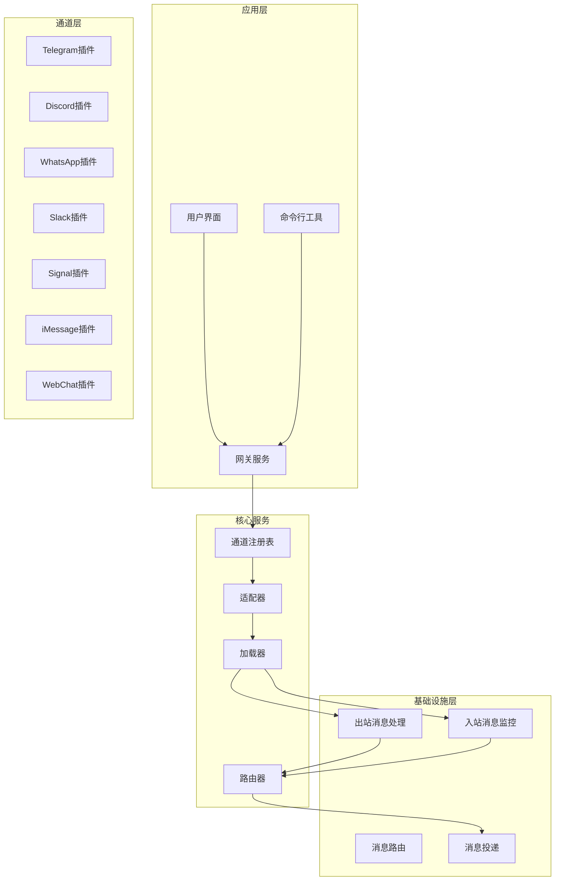

**图表来源**
- [src/channels/registry.ts:1-207](file://src/channels/registry.ts#L1-L207)
- [src/infra/outbound/deliver.ts:1-829](file://src/infra/outbound/deliver.ts#L1-L829)

**章节来源**
- [src/channels/registry.ts:1-207](file://src/channels/registry.ts#L1-L207)
- [src/utils/message-channel.ts:95-133](file://src/utils/message-channel.ts#L95-L133)

## 核心组件

### 通道注册表系统

通道注册表是整个聊天事件桥接系统的核心基础设施，负责管理所有支持的聊天渠道及其元数据信息。

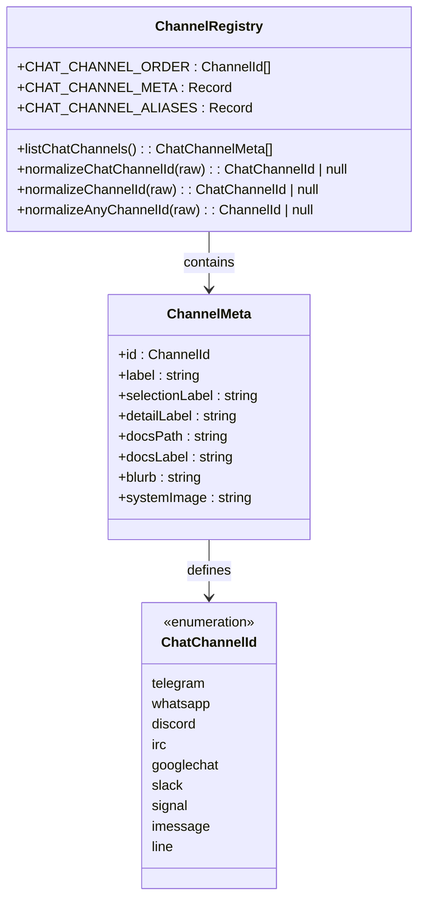

**图表来源**
- [src/channels/registry.ts:1-207](file://src/channels/registry.ts#L1-L207)

### 出站消息处理管道

出站消息处理管道负责将AI生成的回复内容发送到指定的聊天渠道，支持多种格式和媒体类型。

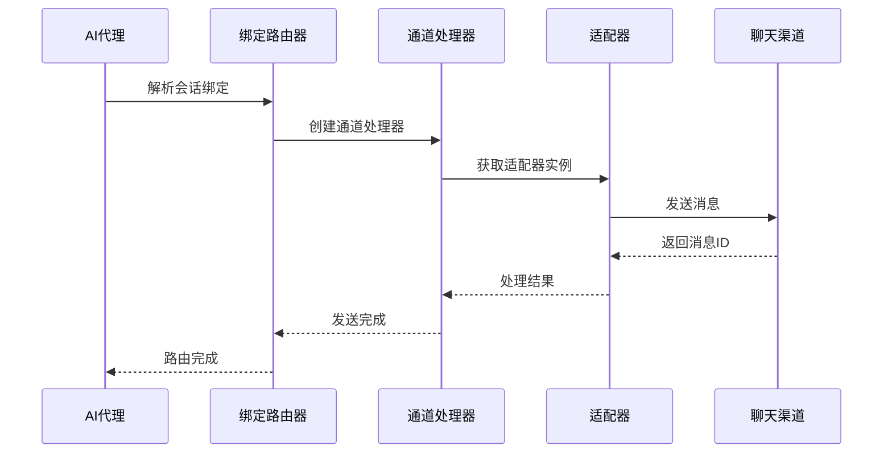

**图表来源**
- [src/infra/outbound/deliver.ts:470-829](file://src/infra/outbound/deliver.ts#L470-L829)
- [src/infra/outbound/bound-delivery-router.ts:55-132](file://src/infra/outbound/bound-delivery-router.ts#L55-L132)

**章节来源**
- [src/infra/outbound/deliver.ts:1-829](file://src/infra/outbound/deliver.ts#L1-L829)
- [src/infra/outbound/bound-delivery-router.ts:1-132](file://src/infra/outbound/bound-delivery-router.ts#L1-L132)

## 架构概览

聊天事件桥接系统采用分层架构设计，确保了良好的可扩展性和维护性：

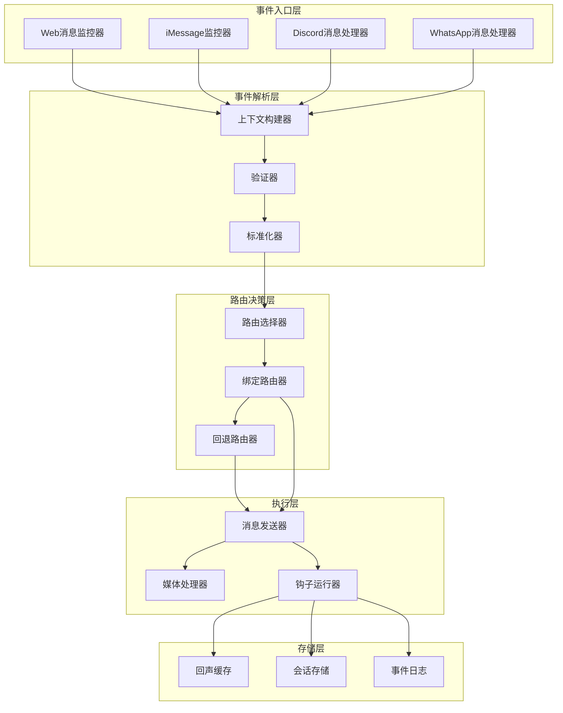

**图表来源**
- [src/web/inbound/monitor.ts:107-489](file://src/web/inbound/monitor.ts#L107-L489)
- [src/imessage/monitor/monitor-provider.ts:28-534](file://src/imessage/monitor/monitor-provider.ts#L28-L534)
- [src/auto-reply/reply/route-reply.ts:178-191](file://src/auto-reply/reply/route-reply.ts#L178-L191)

## 详细组件分析

### 通道适配器系统

通道适配器是实现具体聊天渠道功能的核心组件，每个适配器都实现了统一的接口规范。

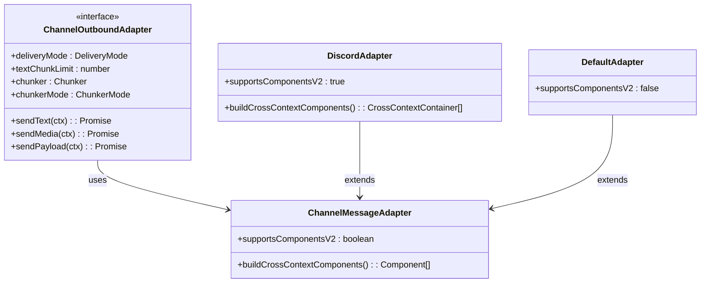

**图表来源**
- [src/infra/outbound/channel-adapters.ts:40-56](file://src/infra/outbound/channel-adapters.ts#L40-L56)

### 绑定消息路由器

绑定消息路由器负责根据会话绑定状态智能选择消息投递目标，确保消息能够准确送达正确的对话上下文中。

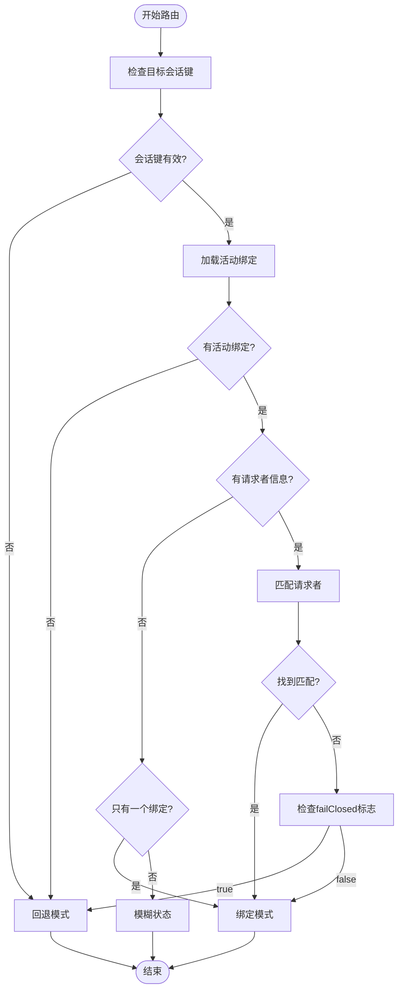

**图表来源**
- [src/infra/outbound/bound-delivery-router.ts:55-132](file://src/infra/outbound/bound-delivery-router.ts#L55-L132)

**章节来源**
- [src/infra/outbound/bound-delivery-router.ts:1-132](file://src/infra/outbound/bound-delivery-router.ts#L1-L132)

### 消息标准化系统

消息标准化系统确保来自不同渠道的消息格式统一，为后续处理提供一致的数据结构。

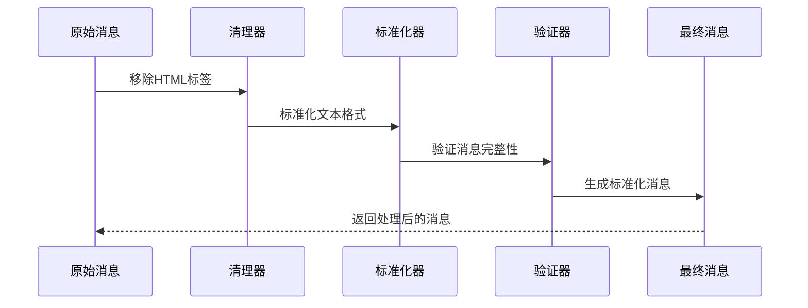

**图表来源**
- [src/infra/outbound/target-normalization.ts:32-61](file://src/infra/outbound/target-normalization.ts#L32-L61)

**章节来源**
- [src/infra/outbound/target-normalization.ts:1-61](file://src/infra/outbound/target-normalization.ts#L1-L61)

### 入站消息监控器

入站消息监控器负责实时监控各个聊天渠道的新消息，并触发相应的处理流程。

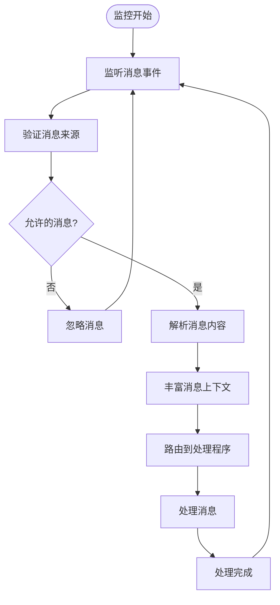

**图表来源**
- [src/web/inbound/monitor.ts:107-489](file://src/web/inbound/monitor.ts#L107-L489)

**章节来源**
- [src/web/inbound/monitor.ts:107-489](file://src/web/inbound/monitor.ts#L107-L489)

### 调试功能增强

系统现在提供了更强大的调试功能，包括详细的日志记录和运行时调试覆盖。

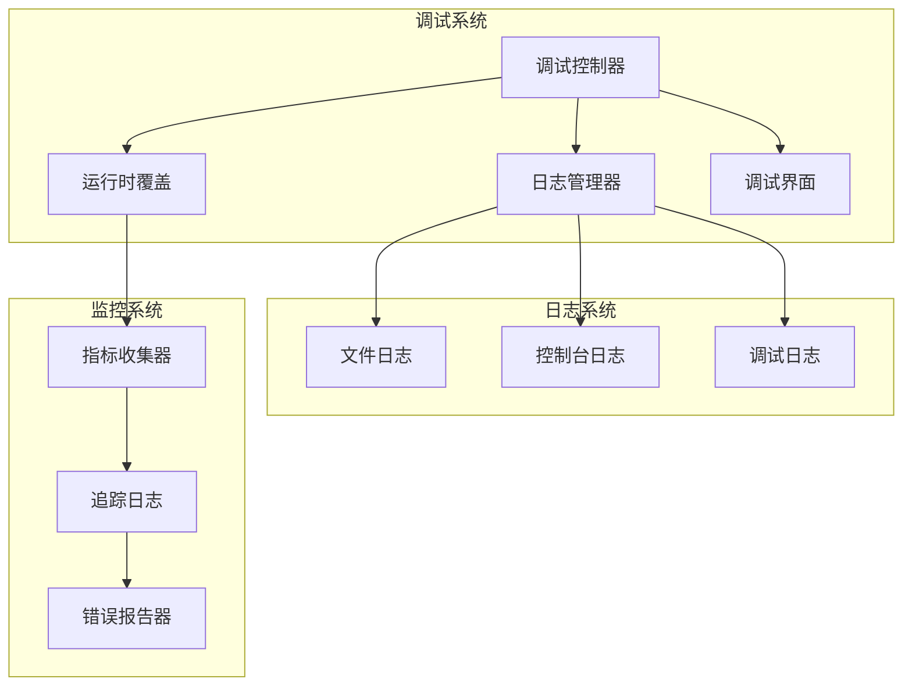

**图表来源**
- [src/globals.ts:1-53](file://src/globals.ts#L1-L53)
- [src/logging/logger.ts:1-348](file://src/logging/logger.ts#L1-L348)

**章节来源**
- [src/globals.ts:1-53](file://src/globals.ts#L1-L53)
- [src/logging/logger.ts:1-348](file://src/logging/logger.ts#L1-L348)
- [docs/zh-CN/help/debugging.md:1-52](file://docs/zh-CN/help/debugging.md#L1-L52)

### 错误处理机制改进

系统增强了错误处理机制，提供了更完善的异常捕获和恢复策略。

```mermaid
flowchart TD
Start([错误发生]) --> Capture[捕获异常]
Capture --> Classify{分类错误类型}
Classify --> |网络错误| NetworkRetry[网络重试]
Classify --> |配置错误| ConfigFix[配置修复]
Classify --> |权限错误| PermissionFix[权限处理]
Classify --> |业务逻辑错误| BusinessLogic[业务逻辑处理]
NetworkRetry --> RetryCount{重试次数}
RetryCount --> |达到上限| Fallback[回退策略]
RetryCount --> |未达上限| Retry[重新尝试]
ConfigFix --> NotifyUser[通知用户]
PermissionFix --> RequestPermission[请求权限]
BusinessLogic --> LogError[记录错误]
Fallback --> LogError
NotifyUser --> LogError
RequestPermission --> LogError
Retry --> Success([处理成功])
LogError --> Complete([处理完成])
```

**图表来源**
- [src/web/inbound/monitor.ts:441-444](file://src/web/inbound/monitor.ts#L441-L444)
- [src/imessage/monitor/monitor-provider.ts:200-203](file://src/imessage/monitor/monitor-provider.ts#L200-L203)

**章节来源**
- [src/web/inbound/monitor.ts:441-444](file://src/web/inbound/monitor.ts#L441-L444)
- [src/imessage/monitor/monitor-provider.ts:200-203](file://src/imessage/monitor/monitor-provider.ts#L200-L203)

### 会话管理优化

会话管理系统得到了显著改进，增强了会话状态跟踪和工具调用处理能力。

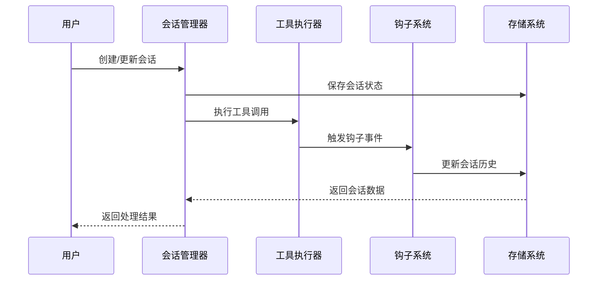

**图表来源**
- [src/auto-reply/reply/route-reply.ts:72-176](file://src/auto-reply/reply/route-reply.ts#L72-L176)
- [docs/zh-CN/concepts/session-tool.md:1-45](file://docs/zh-CN/concepts/session-tool.md#L1-L45)

**章节来源**
- [src/auto-reply/reply/route-reply.ts:72-176](file://src/auto-reply/reply/route-reply.ts#L72-L176)
- [docs/zh-CN/concepts/session-tool.md:1-45](file://docs/zh-CN/concepts/session-tool.md#L1-L45)

## UI组件类型安全增强

### 类型守卫过滤器系统

UI组件中的类型守卫过滤器系统是本次更新的核心改进，专门用于提高交互式负载提取的类型安全性。

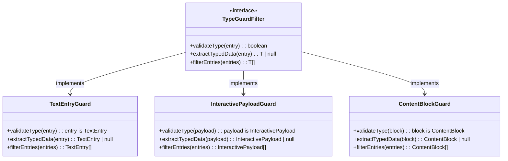

**图表来源**
- [ui-react/src/hooks/chat-event-bridge/useChatEventBridge.ts:34-59](file://ui-react/src/hooks/chat-event-bridge/useChatEventBridge.ts#L34-L59)
- [ui-react/src/hooks/chat-event-bridge/interactive-blocks.ts:5-7](file://ui-react/src/hooks/chat-event-bridge/interactive-blocks.ts#L5-L7)

### 交互式负载提取增强

交互式负载提取过程现在包含双重类型验证，确保从聊天事件中提取的数据具有正确的类型结构。

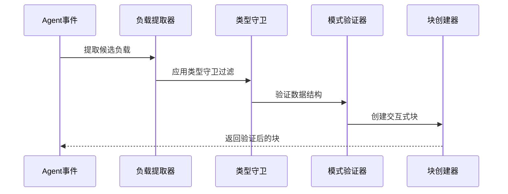

**图表来源**
- [ui-react/src/hooks/chat-event-bridge/useChatEventBridge.ts:274-299](file://ui-react/src/hooks/chat-event-bridge/useChatEventBridge.ts#L274-L299)
- [ui-react/src/hooks/chat-event-bridge/interactive-blocks.ts:9-37](file://ui-react/src/hooks/chat-event-bridge/interactive-blocks.ts#L9-L37)

### 运行时错误防护机制

系统现在包含运行时错误防护机制，防止从聊天事件中处理文本条目时出现类型不匹配的运行时错误。

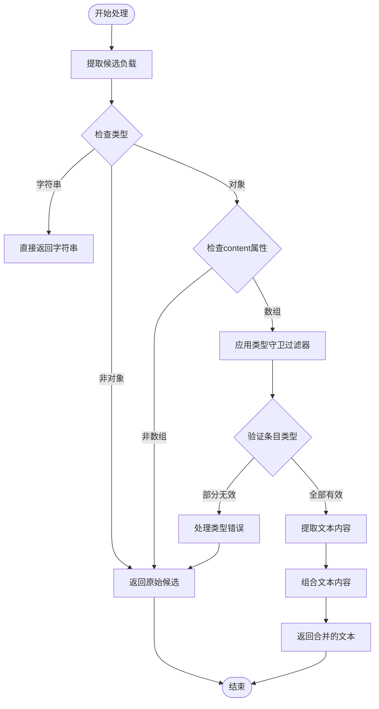

**图表来源**
- [ui-react/src/hooks/chat-event-bridge/useChatEventBridge.ts:34-59](file://ui-react/src/hooks/chat-event-bridge/useChatEventBridge.ts#L34-L59)

**章节来源**
- [ui-react/src/hooks/chat-event-bridge/useChatEventBridge.ts:34-59](file://ui-react/src/hooks/chat-event-bridge/useChatEventBridge.ts#L34-L59)
- [ui-react/src/hooks/chat-event-bridge/interactive-blocks.ts:5-37](file://ui-react/src/hooks/chat-event-bridge/interactive-blocks.ts#L5-L37)

### 工具UI组件类型安全

工具UI组件现在使用Zod模式验证器进行类型安全检查，确保交互式负载的结构符合预期。

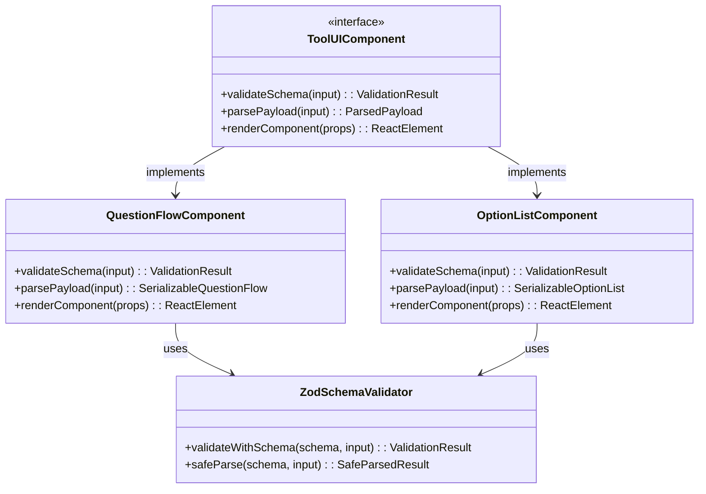

**图表来源**
- [ui-react/src/components/tool-ui/question-flow/schema.ts:87-99](file://ui-react/src/components/tool-ui/question-flow/schema.ts#L87-L99)
- [ui-react/src/components/tool-ui/option-list/schema.ts:198-210](file://ui-react/src/components/tool-ui/option-list/schema.ts#L198-L210)

**章节来源**
- [ui-react/src/components/tool-ui/question-flow/schema.ts:87-99](file://ui-react/src/components/tool-ui/question-flow/schema.ts#L87-L99)
- [ui-react/src/components/tool-ui/option-list/schema.ts:198-210](file://ui-react/src/components/tool-ui/option-list/schema.ts#L198-L210)

## 依赖关系分析

聊天事件桥接系统的依赖关系呈现清晰的层次结构：

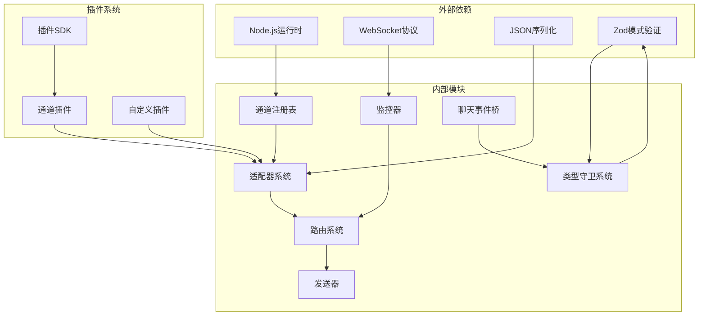

**图表来源**
- [src/channels/plugins/registry-loader.ts:1-36](file://src/channels/plugins/registry-loader.ts#L1-L36)
- [src/channels/plugins/outbound/load.ts:1-17](file://src/channels/plugins/outbound/load.ts#L1-L17)

**章节来源**
- [src/channels/plugins/registry-loader.ts:1-36](file://src/channels/plugins/registry-loader.ts#L1-L36)
- [src/channels/plugins/outbound/load.ts:1-17](file://src/channels/plugins/outbound/load.ts#L1-L17)

## 性能考虑

聊天事件桥接系统在设计时充分考虑了性能优化：

### 并发处理
- 使用异步处理模型避免阻塞
- 实现消息队列确保有序处理
- 支持批量消息处理提高吞吐量

### 缓存策略
- 通道插件实例缓存减少加载开销
- 消息回声检测缓存提升响应速度
- 会话状态缓存降低查询延迟

### 资源管理
- 连接池管理数据库和API调用
- 内存使用监控防止泄漏
- 超时机制避免资源锁定

### 调试性能优化
- 条件日志记录避免不必要的性能开销
- 运行时调试覆盖仅在需要时启用
- 指标收集系统最小化对主流程的影响

### 类型安全性能优化
- 类型守卫过滤器在编译时优化
- Zod模式验证的缓存机制
- 运行时错误防护减少异常处理开销

## 故障排除指南

### 常见问题诊断

**通道连接问题**
- 检查通道认证配置是否正确
- 验证网络连接和防火墙设置
- 确认API密钥和访问令牌有效性

**消息路由失败**
- 查看绑定路由器日志了解失败原因
- 验证会话绑定状态
- 检查请求者信息的完整性

**性能问题**
- 监控消息处理延迟
- 分析内存使用情况
- 检查并发连接数限制

**调试和日志问题**
- 使用 `/debug` 命令进行运行时配置覆盖
- 启用详细日志记录进行问题诊断
- 利用网关监视模式进行快速迭代开发

**类型安全问题**
- 检查类型守卫过滤器的配置
- 验证Zod模式验证器的正确性
- 确认运行时错误防护机制的有效性

**章节来源**
- [docs/gateway/bridge-protocol.md:1-92](file://docs/gateway/bridge-protocol.md#L1-L92)
- [docs/zh-CN/gateway/bridge-protocol.md:1-87](file://docs/zh-CN/gateway/bridge-protocol.md#L1-L87)
- [docs/zh-CN/help/debugging.md:1-52](file://docs/zh-CN/help/debugging.md#L1-L52)

## 结论

聊天事件桥接增强功能为OpenClaw平台提供了强大的多渠道消息处理能力。通过模块化的架构设计、标准化的适配器接口和智能的路由机制，系统能够高效地处理来自各种聊天渠道的消息事件。

本次更新的主要改进包括：

1. **增强的UI组件类型安全** - 在UI组件中添加了类型守卫过滤器，提高了交互式负载提取的类型安全性
2. **运行时错误防护** - 防止从聊天事件中处理文本条目时出现运行时错误
3. **改进的调试功能** - 提供了更详细的日志记录、运行时调试覆盖和监控工具
4. **改进的错误处理** - 更完善的异常捕获、分类和恢复机制
5. **优化的会话管理** - 增强的会话状态跟踪和工具调用处理能力
6. **更好的性能表现** - 通过缓存优化和并发处理提升整体性能

该系统的主要优势包括：

1. **高度可扩展性** - 新增聊天渠道只需实现标准适配器接口
2. **稳定的性能表现** - 通过缓存和并发处理优化性能
3. **可靠的错误处理** - 完善的异常捕获和恢复机制
4. **灵活的路由策略** - 支持多种消息路由场景
5. **强大的调试能力** - 详细的日志记录和运行时调试工具
6. **严格的类型安全** - 通过类型守卫过滤器和Zod模式验证确保数据完整性

未来的发展方向包括进一步优化消息处理性能、增强对新兴聊天渠道的支持，以及改进监控和诊断功能。