# 聊天运行时提供者增强

<cite>
**本文档引用的文件**
- [ui-react/src/providers/chat/GatewayChatRuntimeProvider.tsx](file://ui-react/src/providers/chat/GatewayChatRuntimeProvider.tsx)
- [ui-react/src/components/chat/Composer.tsx](file://ui-react/src/components/chat/Composer.tsx)
- [ui-react/src/providers/chat/adapters/gateway-attachment-adapter.ts](file://ui-react/src/providers/chat/adapters/gateway-attachment-adapter.ts)
- [ui-react/src/providers/chat/message-convert.ts](file://ui-react/src/providers/chat/message-convert.ts)
- [ui-react/src/providers/chat/stream-assembly.ts](file://ui-react/src/providers/chat/stream-assembly.ts)
- [ui-react/src/providers/chat/send-payload.ts](file://ui-react/src/providers/chat/send-payload.ts)
- [ui-react/src/store/chat.store.ts](file://ui-react/src/store/chat.store.ts)
- [ui-react/src/hooks/chat-event-bridge/useChatEventBridge.ts](file://ui-react/src/hooks/chat-event-bridge/useChatEventBridge.ts)
- [ui-react/src/hooks/chat-event-bridge/handlers/chat-event.ts](file://ui-react/src/hooks/chat-event-bridge/handlers/chat-event.ts)
- [ui-react/src/hooks/chat-event-bridge/handlers/agent-event.ts](file://ui-react/src/hooks/chat-event-bridge/handlers/agent-event.ts)
- [ui-react/src/components/assistant-ui/attachment.tsx](file://ui-react/src/components/assistant-ui/attachment.tsx)
- [ui-react/src/components/assistant-ui/action-bar.tsx](file://ui-react/src/components/assistant-ui/action-bar.tsx)
- [ui-react/src/components/assistant-ui/assistant-tool-group.tsx](file://ui-react/src/components/assistant-ui/assistant-tool-group.tsx)
- [ui-react/src/hooks/chat-event-bridge/session-scope.ts](file://ui-react/src/hooks/chat-event-bridge/session-scope.ts)
- [ui-react/src/hooks/chat-event-bridge/index.ts](file://ui-react/src/hooks/chat-event-bridge/index.ts)
- [src/gateway/server-methods/chat.ts](file://src/gateway/server-methods/chat.ts)
- [src/gateway/chat-attachments.ts](file://src/gateway/chat-attachments.ts)
- [src/gateway/chat-abort.ts](file://src/gateway/chat-abort.ts)
- [src/gateway/server-chat.ts](file://src/gateway/server-chat.ts)
- [src/agents/subagent-attachments.ts](file://src/agents/subagent-attachments.ts)
- [src/media-understanding/attachments.cache.ts](file://src/media-understanding/attachments.cache.ts)
- [src/utils/directive-tags.ts](file://src/utils/directive-tags.ts)
- [src/auto-reply/reply/directive-handling.ts](file://src/auto-reply/reply/directive-handling.ts)
- [src/auto-reply/reply/directive-handling.fast-lane.ts](file://src/auto-reply/reply/directive-handling.fast-lane.ts)
- [src/auto-reply/reply/directive-handling.impl.ts](file://src/auto-reply/reply/directive-handling.impl.ts)
- [src/context-engine/types.ts](file://src/context-engine/types.ts)
- [src/agents/pi-extensions/session-manager-runtime-registry.ts](file://src/agents/pi-extensions/session-manager-runtime-registry.ts)
- [src/agents/pi-extensions/context-pruning/runtime.ts](file://src/agents/pi-extensions/context-pruning/runtime.ts)
- [src/runtime.ts](file://src/runtime.ts)
- [src/tui/gateway-chat.ts](file://src/tui/gateway-chat.ts)
- [apps/android/app/src/main/java/ai/openclaw/app/ui/chat/ChatComposer.kt](file://apps/android/app/src/main/java/ai/openclaw/app/ui/chat/ChatComposer.kt)
- [ui/src/ui/views/chat.ts](file://ui/src/ui/views/chat.ts)
- [docs/style.css](file://docs/style.css)
- [ui-react/src/components/chat/InteractiveParts.tsx](file://ui-react/src/components/chat/InteractiveParts.tsx)
- [ui-react/src/components/chat/InteractiveParts.test.ts](file://ui-react/src/components/chat/InteractiveParts.test.ts)
- [ui-react/src/hooks/chat-event-bridge/interactive-blocks.ts](file://ui-react/src/hooks/chat-event-bridge/interactive-blocks.ts)
- [src/gateway/server-methods/attachment-normalize.ts](file://src/gateway/server-methods/attachment-normalize.ts)
- [src/gateway/server-methods/server-methods.test.ts](file://src/gateway/server-methods/server-methods.test.ts)
</cite>

## 更新摘要
**变更内容**
- 新增附件引用构建功能，支持文件引用而非直接上传
- 更新验证逻辑，明确禁用图像附件上传
- 删除图像附件相关的处理流程和UI组件
- 增强附件引用的标准化和验证机制
- 优化附件处理的性能和安全性

## 目录
1. [简介](#简介)
2. [项目结构](#项目结构)
3. [核心组件](#核心组件)
4. [架构概览](#架构概览)
5. [详细组件分析](#详细组件分析)
6. [Assistant UI框架集成](#assistant-ui框架集成)
7. [聊天事件桥接功能增强](#聊天事件桥接功能增强)
8. [CSS样式和视觉一致性改进](#css样式和视觉一致性改进)
9. [消息转换与工具流处理优化](#消息转换与工具流处理优化)
10. [指令标签处理增强](#指令标签处理增强)
11. [附件处理系统](#附件处理系统)
12. [状态管理与生命周期](#状态管理与生命周期)
13. [依赖关系分析](#依赖关系分析)
14. [性能考虑](#性能考虑)
15. [故障排除指南](#故障排除指南)
16. [结论](#结论)

## 简介

OpenClaw是一个强大的聊天代理平台，提供了完整的聊天运行时提供者增强功能。本文档深入分析了聊天运行时提供者的架构设计、实现细节和最佳实践，重点关注会话管理、运行时上下文处理、错误恢复机制和多平台支持。

**更新** 本次更新重点集成了全新的附件引用构建功能，替代了原有的直接文件上传机制，新增了严格的附件验证逻辑，明确禁用了图像附件处理，并在InteractiveParts组件中新增了resolveInteractiveRenderContext函数，显著增强了交互式组件的渲染逻辑和消息合并处理能力。新系统通过统一的Assistant UI运行时接口，为React聊天界面提供完整的消息组合、附件处理和取消支持功能。系统采用模块化设计，支持动态会话管理、智能上下文压缩、运行时状态跟踪和优雅的错误处理机制。

该系统通过与Assistant UI框架的深度集成，提供了现代化的聊天体验，包括流式消息处理、交互式内容渲染、工具调用状态管理和附件上传预览等功能。新增的resolveInteractiveRenderContext函数专门负责处理交互式内容的渲染上下文，优化了消息合并和交互块解析的性能。

## 项目结构

OpenClaw项目采用分层架构设计，主要包含以下核心层次：

```mermaid
graph TB
subgraph "Assistant UI集成层"
GatewayChatRuntimeProvider[GatewayChatRuntimeProvider]
Composer[Composer组件]
AttachmentAdapter[附件适配器]
MessageConvert[消息转换器]
StreamAssembly[流式消息组装器]
SendPayload[发送负载解析器]
InteractiveParts[交互式组件]
resolveInteractiveRenderContext[交互式渲染上下文解析]
end
subgraph "聊天事件桥接层"
ChatEventBridge[聊天事件桥接]
ChatEventHandler[聊天事件处理器]
AgentEventHandler[代理事件处理器]
SessionScope[会话作用域管理]
InteractiveBlocks[交互式块处理]
end
subgraph "状态管理层"
ChatStore[聊天状态存储]
InteractiveBlocks[交互式内容块]
ToolStream[工具流状态]
MessageAttachment[消息附件]
InteractiveSummary[交互式摘要]
end
subgraph "网关层"
ChatHandlers[聊天处理器]
ChatAttachments[附件处理器]
AbortController[中止控制器]
SessionManager[会话管理器]
ServerChat[服务器聊天状态]
DirectiveTags[指令标签处理]
AttachmentNormalize[附件引用构建]
end
subgraph "扩展层"
SessionRegistry[会话注册表]
ContextPruning[上下文压缩]
PluginSDK[插件SDK]
ACPTranslator[ACP翻译器]
SubagentAttachments[子代理附件]
AttachmentCache[附件缓存]
MessageConverter[消息转换器]
InteractiveSchema[交互式模式]
StreamingCard[流式卡片]
DirectiveHandling[指令处理]
end
GatewayChatRuntimeProvider --> ChatEventBridge
GatewayChatRuntimeProvider --> Composer
GatewayChatRuntimeProvider --> AttachmentAdapter
GatewayChatRuntimeProvider --> MessageConvert
GatewayChatRuntimeProvider --> StreamAssembly
GatewayChatRuntimeProvider --> SendPayload
GatewayChatRuntimeProvider --> InteractiveParts
InteractiveParts --> resolveInteractiveRenderContext
ChatEventBridge --> ChatEventHandler
ChatEventBridge --> AgentEventHandler
ChatEventBridge --> SessionScope
ChatEventBridge --> InteractiveBlocks
ChatEventHandler --> ChatStore
AgentEventHandler --> ChatStore
ChatStore --> InteractiveBlocks
ChatStore --> ToolStream
ChatStore --> MessageAttachment
ChatStore --> InteractiveSummary
ChatHandlers --> ChatAttachments
ChatHandlers --> AbortController
ChatHandlers --> SessionManager
ChatHandlers --> ServerChat
ChatHandlers --> DirectiveTags
ChatHandlers --> AttachmentNormalize
ChatAttachments --> AttachmentCache
ChatAttachments --> SubagentAttachments
DirectiveTags --> MessageConverter
InteractiveBlocks --> InteractiveSchema
InteractiveSchema --> MessageConverter
InteractiveSchema --> InteractiveSummary
resolveInteractiveRenderContext --> StreamAssembly
resolveInteractiveRenderContext --> InteractiveBlocks
AttachmentNormalize --> ALLOWED_CHAT_ATTACHMENT_MIME_TYPES
AttachmentNormalize --> ChatAttachmentRef
```

**图表来源**
- [ui-react/src/providers/chat/GatewayChatRuntimeProvider.tsx:1-226](file://ui-react/src/providers/chat/GatewayChatRuntimeProvider.tsx#L1-L226)
- [ui-react/src/components/chat/Composer.tsx:1-31](file://ui-react/src/components/chat/Composer.tsx#L1-L31)
- [ui-react/src/providers/chat/adapters/gateway-attachment-adapter.ts:1-91](file://ui-react/src/providers/chat/adapters/gateway-attachment-adapter.ts#L1-L91)
- [ui-react/src/providers/chat/message-convert.ts:1-109](file://ui-react/src/providers/chat/message-convert.ts#L1-L109)
- [ui-react/src/providers/chat/stream-assembly.ts:1-128](file://ui-react/src/providers/chat/stream-assembly.ts#L1-L128)
- [ui-react/src/providers/chat/send-payload.ts:1-93](file://ui-react/src/providers/chat/send-payload.ts#L1-L93)
- [ui-react/src/hooks/chat-event-bridge/useChatEventBridge.ts:1-62](file://ui-react/src/hooks/chat-event-bridge/useChatEventBridge.ts#L1-L62)
- [ui-react/src/hooks/chat-event-bridge/handlers/chat-event.ts:1-118](file://ui-react/src/hooks/chat-event-bridge/handlers/chat-event.ts#L1-L118)
- [ui-react/src/hooks/chat-event-bridge/handlers/agent-event.ts:1-345](file://ui-react/src/hooks/chat-event-bridge/handlers/agent-event.ts#L1-L345)
- [ui-react/src/store/chat.store.ts:1-508](file://ui-react/src/store/chat.store.ts#L1-L508)
- [ui-react/src/components/chat/InteractiveParts.tsx:114-178](file://ui-react/src/components/chat/InteractiveParts.tsx#L114-L178)
- [ui-react/src/hooks/chat-event-bridge/interactive-blocks.ts:1-56](file://ui-react/src/hooks/chat-event-bridge/interactive-blocks.ts#L1-L56)
- [src/gateway/server-methods/attachment-normalize.ts:19-26](file://src/gateway/server-methods/attachment-normalize.ts#L19-L26)

**章节来源**
- [ui-react/src/providers/chat/GatewayChatRuntimeProvider.tsx:1-226](file://ui-react/src/providers/chat/GatewayChatRuntimeProvider.tsx#L1-L226)
- [ui-react/src/store/chat.store.ts:1-508](file://ui-react/src/store/chat.store.ts#L1-L508)

## 核心组件

### Assistant UI运行时提供者

Assistant UI运行时提供者是本次更新的核心组件，负责与Assistant UI框架深度集成：

- **运行时适配**：实现Assistant UI的外部存储运行时接口
- **消息组合**：将聊天消息、工具调用和交互式内容组合为统一的运行时消息
- **附件处理**：集成复合附件适配器，支持文档和二进制文件处理
- **状态同步**：与聊天状态存储保持实时同步
- **取消支持**：提供完整的运行时取消和中止功能
- **消息转换**：将网关消息转换为Assistant UI可识别的格式
- **流式组装**：动态组装流式消息和工具调用状态

### 聊天事件桥接功能

新增的聊天事件桥接功能提供了强大的事件处理和状态管理能力：

- **事件分发**：统一处理聊天、代理和历史消息事件
- **状态管理**：管理会话生成状态、流式文本和工具调用状态
- **交互式处理**：支持问题流程和选项列表的实时交互
- **工具事件**：处理工具调用的开始、更新和结果事件
- **历史消息**：合并和规范化历史消息数据
- **消息转换**：将内部消息格式转换为UI组件可用的格式

### CSS样式和视觉一致性

系统改进了CSS样式和视觉一致性，确保跨平台的一致用户体验：

- **导航标签页样式**：统一的导航标签页样式和动画效果
- **深色主题支持**：完整的深色主题适配
- **过渡动画**：平滑的样式过渡和动画效果
- **响应式设计**：适配不同屏幕尺寸的布局

### 消息转换与工具流处理

优化的消息转换和工具流处理系统：

- **消息规范化**：统一消息格式和内容提取
- **工具调用合并**：合并连续的工具调用消息
- **内容块提取**：从消息内容中提取文本和工具调用块
- **交互式内容**：支持交互式内容块的处理和渲染
- **流式处理**：优化流式消息的处理和显示

### 指令标签处理系统

新增的指令标签处理系统提供了完整的代理指令安全处理能力：

- **标签剥离**：移除消息中的代理指令标签
- **安全验证**：验证指令标签的有效性和安全性
- **内容保护**：保护外部不可信包装元数据
- **显示优化**：优化消息在客户端的显示效果
- **快速通道**：优化指令处理的性能路径

### 附件处理系统

**更新** 附件处理系统经过重大更新，新增了附件引用构建功能：

- **附件引用构建**：支持通过fileId和path引用现有文件
- **引用标准化**：将RPC附件引用标准化为ChatAttachmentRef格式
- **引用验证**：验证附件引用的完整性和有效性
- **类型限制**：明确禁用图像附件上传，仅支持文档类型
- **安全验证**：实施严格的附件类型和大小验证
- **UI适配**：移除图像附件的UI组件和处理逻辑

### 交互式组件渲染增强

**新增** 交互式组件渲染系统经过重大增强，提供了更强大的交互式内容处理能力：

- **resolveInteractiveRenderContext函数**：专门负责解析交互式渲染上下文
- **消息合并优化**：与mergeAssistantRunMessages配合处理assistant运行时消息
- **交互式块解析**：智能解析和渲染交互式内容块
- **流式交互支持**：支持实时流式交互内容的渲染
- **摘要生成**：自动生成交互式内容的摘要信息
- **用户反馈**：提供交互式内容的状态反馈和确认机制

**章节来源**
- [ui-react/src/providers/chat/GatewayChatRuntimeProvider.tsx:1-226](file://ui-react/src/providers/chat/GatewayChatRuntimeProvider.tsx#L1-L226)
- [ui-react/src/components/chat/Composer.tsx:1-31](file://ui-react/src/components/chat/Composer.tsx#L1-L31)
- [ui-react/src/providers/chat/adapters/gateway-attachment-adapter.ts:1-91](file://ui-react/src/providers/chat/adapters/gateway-attachment-adapter.ts#L1-L91)
- [ui-react/src/providers/chat/message-convert.ts:1-109](file://ui-react/src/providers/chat/message-convert.ts#L1-L109)
- [ui-react/src/providers/chat/stream-assembly.ts:1-128](file://ui-react/src/providers/chat/stream-assembly.ts#L1-L128)
- [ui-react/src/providers/chat/send-payload.ts:1-93](file://ui-react/src/providers/chat/send-payload.ts#L1-L93)
- [ui-react/src/components/chat/InteractiveParts.tsx:114-178](file://ui-react/src/components/chat/InteractiveParts.tsx#L114-L178)

## 架构概览

OpenClaw的Assistant UI运行时提供者采用事件驱动的架构模式，通过以下关键组件协同工作：

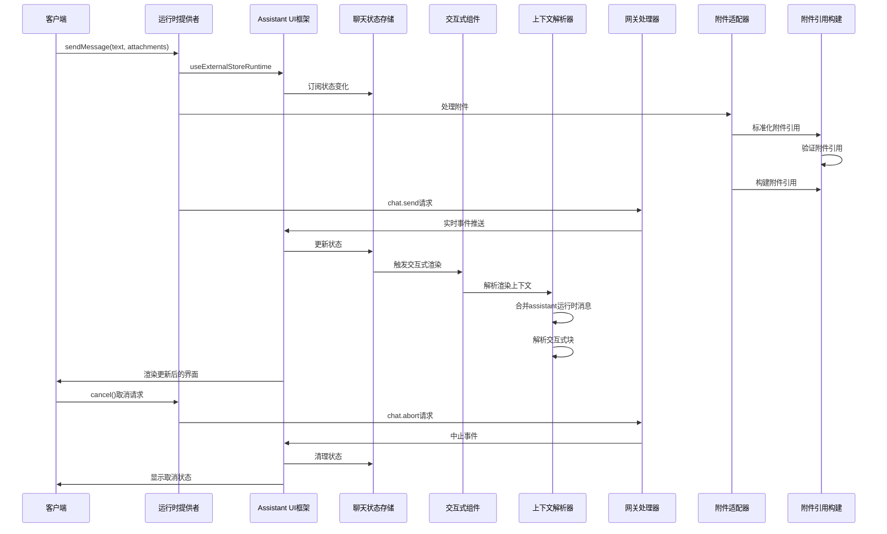
```mermaid
sequenceDiagram
participant Client as 客户端
participant RuntimeProvider as 运行时提供者
participant AssistantUI as Assistant UI框架
participant ChatStore as 聊天状态存储
participant InteractiveParts as 交互式组件
participant ResolveContext as 上下文解析器
participant Gateway as 网关处理器
participant AttachmentAdapter as 附件适配器
participant AttachmentNormalize as 附件引用构建
Client->>RuntimeProvider : sendMessage(text, attachments)
RuntimeProvider->>AssistantUI : useExternalStoreRuntime
AssistantUI->>ChatStore : 订阅状态变化
RuntimeProvider->>AttachmentAdapter : 处理附件
AttachmentAdapter->>AttachmentNormalize : 标准化附件引用
AttachmentNormalize->>AttachmentNormalize : 验证附件引用
AttachmentAdapter->>AttachmentNormalize : 构建附件引用
RuntimeProvider->>Gateway : chat.send请求
Gateway->>AssistantUI : 实时事件推送
AssistantUI->>ChatStore : 更新状态
ChatStore->>InteractiveParts : 触发交互式渲染
InteractiveParts->>ResolveContext : 解析渲染上下文
ResolveContext->>ResolveContext : 合并assistant运行时消息
ResolveContext->>ResolveContext : 解析交互式块
AssistantUI->>Client : 渲染更新后的界面
Client->>RuntimeProvider : cancel()取消请求
RuntimeProvider->>Gateway : chat.abort请求
Gateway->>AssistantUI : 中止事件
AssistantUI->>ChatStore : 清理状态
AssistantUI->>Client : 显示取消状态
```

**图表来源**
- [ui-react/src/providers/chat/GatewayChatRuntimeProvider.tsx:180-226](file://ui-react/src/providers/chat/GatewayChatRuntimeProvider.tsx#L180-L226)
- [ui-react/src/components/chat/Composer.tsx:18-31](file://ui-react/src/components/chat/Composer.tsx#L18-L31)
- [ui-react/src/providers/chat/adapters/gateway-attachment-adapter.ts:50-91](file://ui-react/src/providers/chat/adapters/gateway-attachment-adapter.ts#L50-L91)
- [ui-react/src/components/chat/InteractiveParts.tsx:180-195](file://ui-react/src/components/chat/InteractiveParts.tsx#L180-L195)
- [ui-react/src/components/chat/InteractiveParts.tsx:114-178](file://ui-react/src/components/chat/InteractiveParts.tsx#L114-L178)
- [src/gateway/server-methods/attachment-normalize.ts:86-123](file://src/gateway/server-methods/attachment-normalize.ts#L86-L123)

### 数据流架构

系统采用双向数据流设计，确保实时性和一致性：

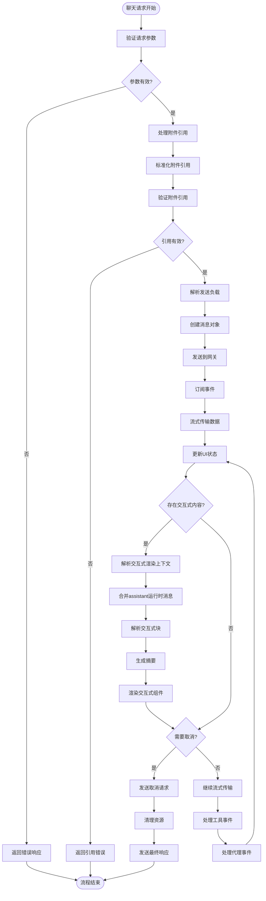
```mermaid
flowchart TD
Start([聊天请求开始]) --> Validate["验证请求参数"]
Validate --> Valid{"参数有效?"}
Valid --> |否| ErrorResponse["返回错误响应"]
Valid --> |是| ProcessAttachments["处理附件引用"]
ProcessAttachments --> NormalizeRefs["标准化附件引用"]
NormalizeRefs --> ValidateRefs["验证附件引用"]
ValidateRefs --> ValidRefs{"引用有效?"}
ValidRefs --> |否| RefError["返回引用错误"]
ValidRefs --> |是| ParsePayload["解析发送负载"]
ParsePayload --> CreateMessage["创建消息对象"]
CreateMessage --> SendToGateway["发送到网关"]
SendToGateway --> SubscribeToEvents["订阅事件"]
SubscribeToEvents --> StreamData["流式传输数据"]
StreamData --> UpdateUI["更新UI状态"]
UpdateUI --> CheckInteractive{"存在交互式内容?"}
CheckInteractive --> |是| ResolveContext["解析交互式渲染上下文"]
ResolveContext --> MergeAssistant["合并assistant运行时消息"]
MergeAssistant --> ParseInteractive["解析交互式块"]
ParseInteractive --> GenerateSummary["生成摘要"]
GenerateSummary --> RenderInteractive["渲染交互式组件"]
CheckInteractive --> |否| CheckCancel{"需要取消?"}
RenderInteractive --> CheckCancel
CheckCancel --> |是| CancelRequest["发送取消请求"]
CheckCancel --> |否| ContinueStream["继续流式传输"]
ContinueStream --> ProcessToolEvents["处理工具事件"]
ProcessToolEvents --> ProcessAgentEvents["处理代理事件"]
ProcessAgentEvents --> UpdateUI
CancelRequest --> Cleanup["清理资源"]
Cleanup --> FinalResponse["发送最终响应"]
ErrorResponse --> End([流程结束])
RefError --> End
FinalResponse --> End
```

**图表来源**
- [ui-react/src/providers/chat/GatewayChatRuntimeProvider.tsx:180-199](file://ui-react/src/providers/chat/GatewayChatRuntimeProvider.tsx#L180-L199)
- [ui-react/src/providers/chat/send-payload.ts:12-92](file://ui-react/src/providers/chat/send-payload.ts#L12-L92)
- [ui-react/src/providers/chat/adapters/gateway-attachment-adapter.ts:50-91](file://ui-react/src/providers/chat/adapters/gateway-attachment-adapter.ts#L50-L91)
- [ui-react/src/components/chat/InteractiveParts.tsx:114-178](file://ui-react/src/components/chat/InteractiveParts.tsx#L114-L178)
- [src/gateway/server-methods/attachment-normalize.ts:86-123](file://src/gateway/server-methods/attachment-normalize.ts#L86-L123)

## 详细组件分析

### Assistant UI运行时提供者实现

Assistant UI运行时提供者是本次更新的核心组件，负责与Assistant UI框架深度集成：

#### 主要功能模块

1. **运行时适配模块**
   - 实现Assistant UI的外部存储运行时接口
   - 管理消息状态和运行时生命周期
   - 处理用户输入和发送操作

2. **消息组合模块**
   - 将聊天消息、工具调用和交互式内容组合
   - 动态组装流式消息状态
   - 处理消息的实时更新和合并

3. **附件处理模块**
   - 集成复合附件适配器
   - 支持文档和二进制文件处理
   - 管理附件的验证和转换

4. **状态同步模块**
   - 与聊天状态存储保持实时同步
   - 处理运行时状态变化
   - 管理会话生成状态

#### 关键实现特性

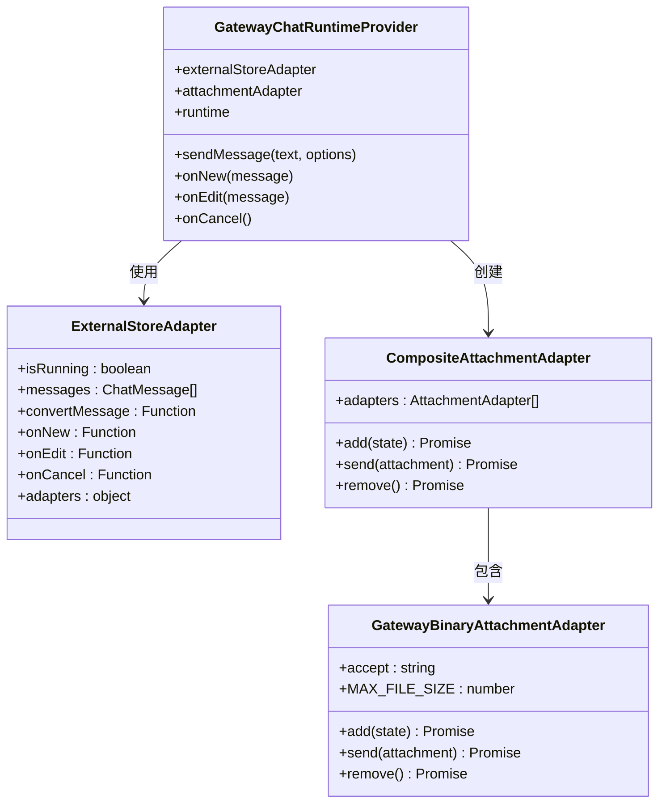
```mermaid
classDiagram
class GatewayChatRuntimeProvider {
+sendMessage(text, options)
+onNew(message)
+onEdit(message)
+onCancel()
+externalStoreAdapter
+attachmentAdapter
+runtime
}
class ExternalStoreAdapter {
+isRunning : boolean
+messages : ChatMessage[]
+convertMessage : Function
+onNew : Function
+onEdit : Function
+onCancel : Function
+adapters : object
}
class CompositeAttachmentAdapter {
+adapters : AttachmentAdapter[]
+add(state) Promise
+send(attachment) Promise
+remove() Promise
}
class GatewayBinaryAttachmentAdapter {
+accept : string
+MAX_FILE_SIZE : number
+add(state) Promise
+send(attachment) Promise
+remove() Promise
}
GatewayChatRuntimeProvider --> ExternalStoreAdapter : 使用
GatewayChatRuntimeProvider --> CompositeAttachmentAdapter : 创建
CompositeAttachmentAdapter --> GatewayBinaryAttachmentAdapter : 包含
```

**图表来源**
- [ui-react/src/providers/chat/GatewayChatRuntimeProvider.tsx:200-215](file://ui-react/src/providers/chat/GatewayChatRuntimeProvider.tsx#L200-L215)
- [ui-react/src/providers/chat/adapters/gateway-attachment-adapter.ts:88-91](file://ui-react/src/providers/chat/adapters/gateway-attachment-adapter.ts#L88-L91)

**章节来源**
- [ui-react/src/providers/chat/GatewayChatRuntimeProvider.tsx:1-226](file://ui-react/src/providers/chat/GatewayChatRuntimeProvider.tsx#L1-L226)
- [ui-react/src/providers/chat/adapters/gateway-attachment-adapter.ts:1-91](file://ui-react/src/providers/chat/adapters/gateway-attachment-adapter.ts#L1-L91)

### 聊天事件桥接功能增强

聊天事件桥接功能是本次更新的核心特性，提供了强大的事件处理和状态管理能力：

#### 事件处理架构

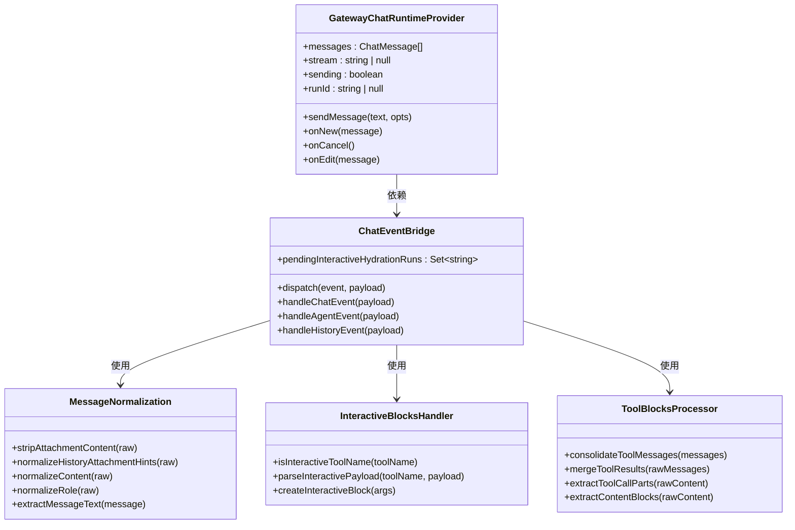
```mermaid
classDiagram
class ChatEventBridge {
+dispatch(event, payload)
+pendingInteractiveHydrationRuns : Set~string~
+handleChatEvent(payload)
+handleAgentEvent(payload)
+handleHistoryEvent(payload)
}
class MessageNormalization {
+stripAttachmentContent(raw)
+normalizeHistoryAttachmentHints(raw)
+normalizeContent(raw)
+normalizeRole(raw)
+extractMessageText(message)
}
class InteractiveBlocksHandler {
+isInteractiveToolName(toolName)
+parseInteractivePayload(toolName, payload)
+createInteractiveBlock(args)
}
class ToolBlocksProcessor {
+consolidateToolMessages(messages)
+mergeToolResults(rawMessages)
+extractToolCallParts(rawContent)
+extractContentBlocks(rawContent)
}
class GatewayChatRuntimeProvider {
+messages : ChatMessage[]
+stream : string | null
+sending : boolean
+runId : string | null
+sendMessage(text, opts)
+onNew(message)
+onCancel()
+onEdit(message)
}
ChatEventBridge --> MessageNormalization : 使用
ChatEventBridge --> InteractiveBlocksHandler : 使用
ChatEventBridge --> ToolBlocksProcessor : 使用
GatewayChatRuntimeProvider --> ChatEventBridge : 依赖
```

**图表来源**
- [ui-react/src/hooks/chat-event-bridge/useChatEventBridge.ts:10-61](file://ui-react/src/hooks/chat-event-bridge/useChatEventBridge.ts#L10-L61)
- [ui-react/src/hooks/chat-event-bridge/index.ts:1-19](file://ui-react/src/hooks/chat-event-bridge/index.ts#L1-L19)

#### 事件处理流程

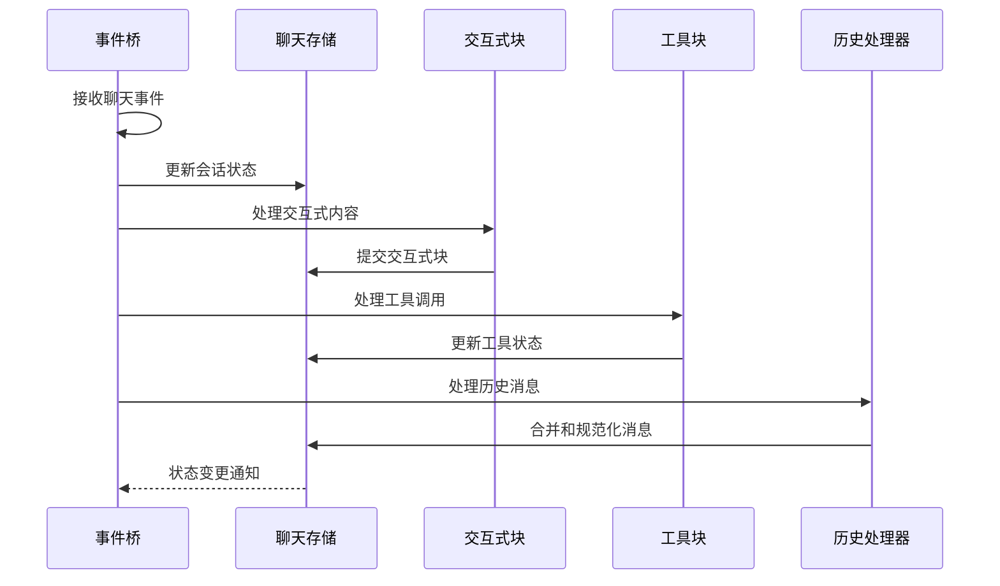
```mermaid
sequenceDiagram
participant EventBridge as 事件桥
participant ChatStore as 聊天存储
participant InteractiveBlocks as 交互式块
participant ToolBlocks as 工具块
participant HistoryProcessor as 历史处理器
EventBridge->>EventBridge : 接收聊天事件
EventBridge->>ChatStore : 更新会话状态
EventBridge->>InteractiveBlocks : 处理交互式内容
InteractiveBlocks->>ChatStore : 提交交互式块
EventBridge->>ToolBlocks : 处理工具调用
ToolBlocks->>ChatStore : 更新工具状态
EventBridge->>HistoryProcessor : 处理历史消息
HistoryProcessor->>ChatStore : 合并和规范化消息
ChatStore-->>EventBridge : 状态变更通知
```

**图表来源**
- [ui-react/src/hooks/chat-event-bridge/useChatEventBridge.ts:22-54](file://ui-react/src/hooks/chat-event-bridge/useChatEventBridge.ts#L22-L54)

#### 状态管理优化

系统优化了状态管理机制：

1. **会话生成状态**：跟踪活跃会话的生成状态
2. **流式文本管理**：管理实时流式文本的显示
3. **工具调用状态**：跟踪工具调用的生命周期
4. **交互式内容状态**：管理交互式内容的显示和更新
5. **历史消息处理**：合并和规范化历史消息数据

**章节来源**
- [ui-react/src/hooks/chat-event-bridge/useChatEventBridge.ts:1-62](file://ui-react/src/hooks/chat-event-bridge/useChatEventBridge.ts#L1-L62)
- [ui-react/src/hooks/chat-event-bridge/handlers/chat-event.ts:1-118](file://ui-react/src/hooks/chat-event-bridge/handlers/chat-event.ts#L1-L118)
- [ui-react/src/hooks/chat-event-bridge/handlers/agent-event.ts:1-345](file://ui-react/src/hooks/chat-event-bridge/handlers/agent-event.ts#L1-L345)

### CSS样式和视觉一致性改进

系统改进了CSS样式和视觉一致性，确保跨平台的一致用户体验：

#### 导航标签页样式

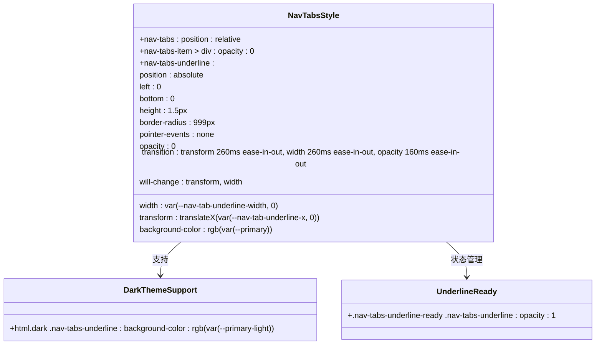
```mermaid
classDiagram
class NavTabsStyle {
+nav-tabs : position : relative
+nav-tabs-item > div : opacity : 0
+nav-tabs-underline :
position : absolute
left : 0
bottom : 0
height : 1.5px
width : var(--nav-tab-underline-width, 0)
transform : translateX(var(--nav-tab-underline-x, 0))
background-color : rgb(var(--primary))
border-radius : 999px
pointer-events : none
opacity : 0
transition : transform 260ms ease-in-out, width 260ms ease-in-out, opacity 160ms ease-in-out
will-change : transform, width
}
class DarkThemeSupport {
+html.dark .nav-tabs-underline : background-color : rgb(var(--primary-light))
}
class UnderlineReady {
+.nav-tabs-underline-ready .nav-tabs-underline : opacity : 1
}
NavTabsStyle --> DarkThemeSupport : 支持
NavTabsStyle --> UnderlineReady : 状态管理
```

**图表来源**
- [docs/style.css:5-38](file://docs/style.css#L5-L38)

#### 样式特性

系统实现了以下样式特性：

1. **统一导航样式**：统一的导航标签页样式和布局
2. **深色主题适配**：完整的深色主题支持和颜色适配
3. **平滑过渡动画**：流畅的样式过渡和动画效果
4. **响应式设计**：适配不同屏幕尺寸的布局
5. **状态指示器**：导航标签页下划线的动态显示和隐藏

#### 样式配置

| 样式类 | 属性 | 值 | 描述 |
|--------|------|-----|------|
| .nav-tabs | position | relative | 相对定位容器 |
| .nav-tabs-item > div | opacity | 0 | 初始隐藏状态 |
| .nav-tabs-underline | position | absolute | 绝对定位下划线 |
| .nav-tabs-underline | bottom | 0 | 底部对齐 |
| .nav-tabs-underline | height | 1.5px | 下划线高度 |
| .nav-tabs-underline | background-color | rgb(var(--primary)) | 主题颜色 |
| .nav-tabs-underline | opacity | 0 | 初始透明度 |
| .nav-tabs-underline | transition | 多属性过渡 | 平滑动画效果 |
| .nav-tabs-underline-ready | opacity | 1 | 就绪状态显示 |

**章节来源**
- [docs/style.css:1-38](file://docs/style.css#L1-L38)

### 消息转换与工具流处理优化

优化的消息转换和工具流处理系统：

#### 消息转换器实现

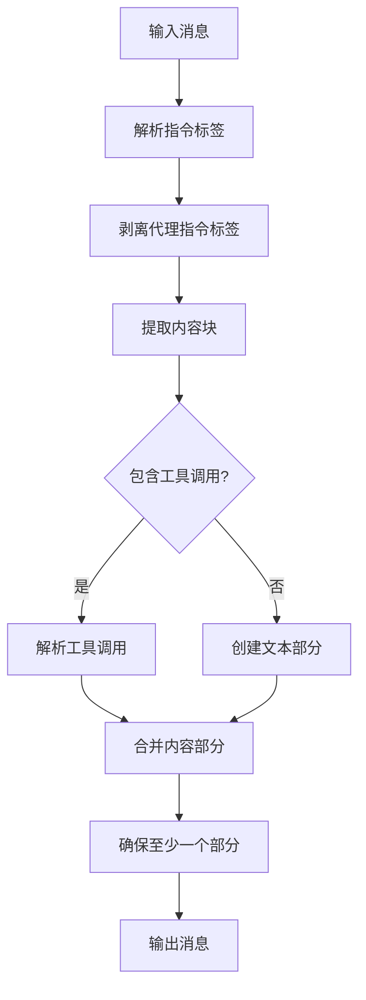
```mermaid
flowchart TD
InputMessage[输入消息] --> ParseDirectives["解析指令标签"]
ParseDirectives --> StripTags["剥离代理指令标签"]
StripTags --> ExtractContent["提取内容块"]
ExtractContent --> CheckToolCalls{"包含工具调用?"}
CheckToolCalls --> |是| ParseToolCalls["解析工具调用"]
CheckToolCalls --> |否| CreateTextPart["创建文本部分"]
ParseToolCalls --> MergeParts["合并内容部分"]
CreateTextPart --> MergeParts
MergeParts --> EnsureMinParts["确保至少一个部分"]
EnsureMinParts --> OutputMessage[输出消息]
```

**图表来源**
- [ui-react/src/providers/chat/message-convert.ts:24-108](file://ui-react/src/providers/chat/message-convert.ts#L24-L108)

#### 工具调用处理优化

系统优化了工具调用处理流程：

1. **工具调用解析**：从消息内容中提取工具调用信息
2. **参数处理**：解析工具调用参数并进行验证
3. **状态跟踪**：跟踪工具调用的执行状态
4. **结果合并**：将工具调用结果合并到消息中
5. **交互式内容处理**：支持交互式内容块的处理和渲染

#### 交互式内容处理

**新增** 交互式内容处理系统经过重大优化：

1. **resolveInteractiveRenderContext函数**：专门负责解析交互式渲染上下文
2. **消息合并集成**：与mergeAssistantRunMessages配合处理assistant运行时消息
3. **交互式块解析**：智能解析和渲染交互式内容块
4. **流式交互支持**：支持实时流式交互内容的渲染
5. **摘要生成机制**：自动生成交互式内容的摘要信息

**章节来源**
- [ui-react/src/providers/chat/message-convert.ts:1-109](file://ui-react/src/providers/chat/message-convert.ts#L1-L109)
- [ui-react/src/providers/chat/stream-assembly.ts:1-128](file://ui-react/src/providers/chat/stream-assembly.ts#L1-L128)

### 指令标签处理增强

指令标签处理系统提供了完整的代理指令安全处理能力：

#### 核心功能模块

1. **指令标签剥离模块**
   - 移除消息中的代理指令标签
   - 保护外部不可信包装元数据
   - 优化消息显示效果

2. **安全验证模块**
   - 验证指令标签的有效性
   - 检测恶意指令标签
   - 实施安全过滤机制

3. **显示优化模块**
   - 保持消息结构完整性
   - 优化客户端显示效果
   - 支持多种显示模式

4. **快速通道模块**
   - 优化指令处理的性能路径
   - 减少不必要的处理开销
   - 提升指令响应速度

#### 关键实现特性

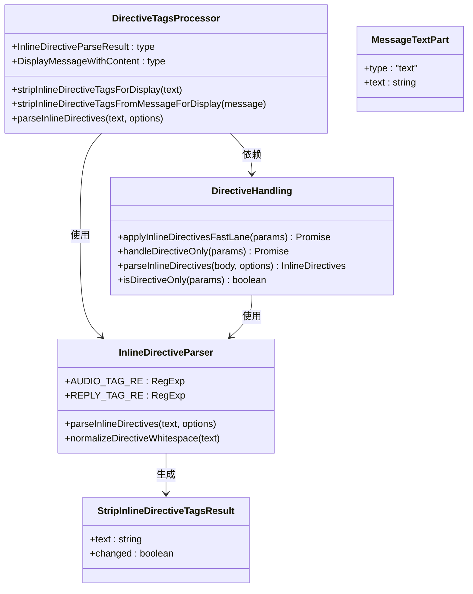
```mermaid
classDiagram
class DirectiveTagsProcessor {
+InlineDirectiveParseResult : type
+DisplayMessageWithContent : type
+stripInlineDirectiveTagsForDisplay(text)
+stripInlineDirectiveTagsFromMessageForDisplay(message)
+parseInlineDirectives(text, options)
}
class DirectiveHandling {
+applyInlineDirectivesFastLane(params) Promise
+handleDirectiveOnly(params) Promise
+parseInlineDirectives(body, options) InlineDirectives
+isDirectiveOnly(params) boolean
}
class InlineDirectiveParser {
+AUDIO_TAG_RE : RegExp
+REPLY_TAG_RE : RegExp
+parseInlineDirectives(text, options)
+normalizeDirectiveWhitespace(text)
}
class MessageTextPart {
+type : "text"
+text : string
}
class StripInlineDirectiveTagsResult {
+text : string
+changed : boolean
}
DirectiveTagsProcessor --> InlineDirectiveParser : 使用
DirectiveTagsProcessor --> DirectiveHandling : 依赖
DirectiveHandling --> InlineDirectiveParser : 使用
InlineDirectiveParser --> StripInlineDirectiveTagsResult : 生成
```

**图表来源**
- [src/utils/directive-tags.ts:1-150](file://src/utils/directive-tags.ts#L1-L150)
- [src/auto-reply/reply/directive-handling.fast-lane.ts:1-94](file://src/auto-reply/reply/directive-handling.fast-lane.ts#L1-L94)
- [src/auto-reply/reply/directive-handling.impl.ts:1-468](file://src/auto-reply/reply/directive-handling.impl.ts#L1-L468)

#### 指令标签类型

| 指令标签 | 功能描述 | 处理方式 |
|----------|----------|----------|
| [[audio_as_voice]] | 音频语音指令 | 可选择性剥离 |
| [[reply_to_current]] | 回复当前消息 | 可选择性剥离 |
| [[reply_to: id]] | 指定回复消息 | 可选择性剥离 |
| <th> | 思维内容标签 | 严格剥离 |
| <<final>> | 最终内容标签 | 严格剥离 |

#### 安全验证机制

系统实施了多层次的安全验证：

1. **标签格式验证**：确保指令标签格式正确
2. **内容安全检查**：检测潜在的恶意内容
3. **元数据剥离**：移除外部门户的不可信元数据
4. **显示优化**：保持消息的可读性和美观性

**章节来源**
- [src/utils/directive-tags.ts:1-150](file://src/utils/directive-tags.ts#L1-L150)
- [src/auto-reply/reply/directive-handling.fast-lane.ts:1-94](file://src/auto-reply/reply/directive-handling.fast-lane.ts#L1-L94)
- [src/auto-reply/reply/directive-handling.impl.ts:1-468](file://src/auto-reply/reply/directive-handling.impl.ts#L1-L468)

### 附件处理系统

**更新** 附件处理系统经过重大更新，新增了附件引用构建功能：

#### 附件引用构建

系统新增了完整的附件引用构建功能：

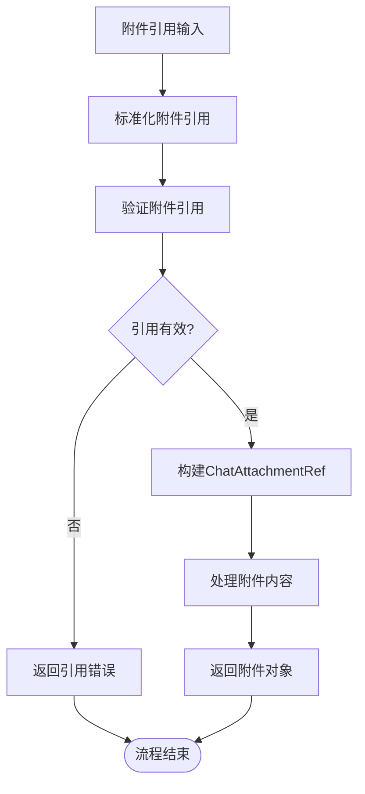
```mermaid
flowchart TD
AttachmentRefs[附件引用输入] --> NormalizeRefs["标准化附件引用"]
NormalizeRefs --> ValidateRefs["验证附件引用"]
ValidateRefs --> ValidRefs{"引用有效?"}
ValidRefs --> |否| RefError["返回引用错误"]
ValidRefs --> |是| BuildAttachmentRef["构建ChatAttachmentRef"]
BuildAttachmentRef --> ProcessAttachment["处理附件内容"]
ProcessAttachment --> ReturnAttachment["返回附件对象"]
RefError --> End([流程结束])
ReturnAttachment --> End
```

**图表来源**
- [src/gateway/server-methods/attachment-normalize.ts:86-123](file://src/gateway/server-methods/attachment-normalize.ts#L86-L123)

#### 附件类型定义

| 附件类型 | 支持的MIME类型 | 处理方式 |
|----------|----------------|----------|
| 文档 | application/pdf, text/*, application/msword, application/vnd.openxmlformats-officedocument.wordprocessingml.document, application/vnd.ms-excel, application/vnd.openxmlformats-officedocument.spreadsheetml.sheet, application/vnd.ms-powerpoint, application/vnd.openxmlformats-officedocument.presentationml.presentation | 直接处理和上传 |
| **新增**：引用 | fileRef | 通过fileId和path引用现有文件 |

#### 附件验证流程

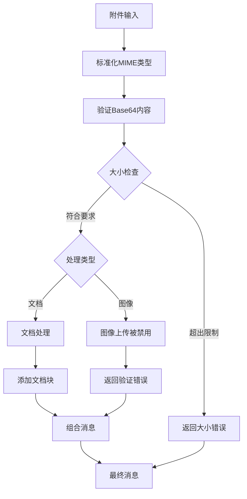
```mermaid
flowchart TD
Attachment[附件输入] --> Normalize["标准化MIME类型"]
Normalize --> ValidateBase64["验证Base64内容"]
ValidateBase64 --> CheckSize{"大小检查"}
CheckSize --> |超出限制| SizeError["返回大小错误"]
CheckSize --> |符合要求| ProcessType{"处理类型"}
ProcessType --> |图像| ImageDisabled["图像上传被禁用"]
ProcessType --> |文档| DocumentProcessing["文档处理"]
ImageDisabled --> ValidationError["返回验证错误"]
DocumentProcessing --> AddDocument["添加文档块"]
AddDocument --> Combine["组合消息"]
ValidationError --> Combine
Combine --> FinalMessage[最终消息]
SizeError --> FinalMessage
```

**图表来源**
- [src/gateway/chat-attachments.ts:207-302](file://src/gateway/chat-attachments.ts#L207-L302)
- [src/gateway/chat-attachments.ts:181-195](file://src/gateway/chat-attachments.ts#L181-L195)

#### 附件限制配置

系统支持灵活的附件限制配置：

| 配置项 | 默认值 | 描述 |
|--------|--------|------|
| enabled | false | 是否启用附件处理 |
| maxFiles | 50 | 单次最多允许的文件数量 |
| maxFileBytes | 1MB | 单个文件的最大字节数 |
| maxTotalBytes | 5MB | 单次附件处理的总字节数 |
| retainOnSessionKeep | false | 会话保留时是否保留附件 |
| **新增**：imageUploadDisabled | true | 是否禁用图像上传 |
| **新增**：maxFileSizeReferenceMode | 100MB | 引用模式下的最大文件大小 |

**章节来源**
- [src/gateway/server-methods/attachment-normalize.ts:1-124](file://src/gateway/server-methods/attachment-normalize.ts#L1-L124)
- [src/gateway/chat-attachments.ts:1-442](file://src/gateway/chat-attachments.ts#L1-L442)
- [src/agents/subagent-attachments.ts:36-93](file://src/agents/subagent-attachments.ts#L36-L93)

### 中止控制机制详解

中止控制机制提供了灵活的运行时控制能力：

#### 中止控制器结构

| 字段 | 类型 | 描述 |
|------|------|------|
| controller | AbortController | 标准AbortController实例 |
| sessionId | string | 关联的会话ID |
| sessionKey | string | 会话键值 |
| startedAtMs | number | 开始时间戳（毫秒） |
| expiresAtMs | number | 过期时间戳（毫秒） |

#### 中止流程

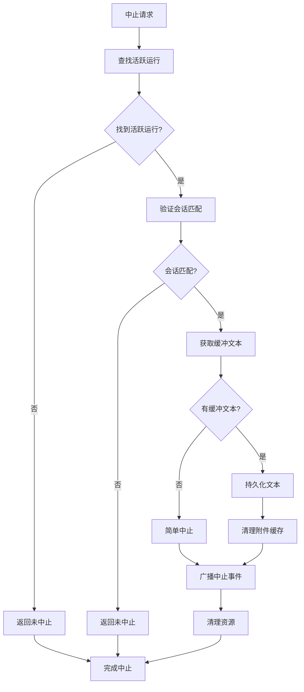
```mermaid
flowchart TD
Request[中止请求] --> FindActive["查找活跃运行"]
FindActive --> ActiveFound{"找到活跃运行?"}
ActiveFound --> |否| NotActive["返回未中止"]
ActiveFound --> |是| ValidateSession["验证会话匹配"]
ValidateSession --> SessionMatch{"会话匹配?"}
SessionMatch --> |否| WrongSession["返回未中止"]
SessionMatch --> |是| GetBuffered["获取缓冲文本"]
GetBuffered --> HasText{"有缓冲文本?"}
HasText --> |否| SimpleAbort["简单中止"]
HasText --> |是| PersistText["持久化文本"]
PersistText --> CleanupAttachments["清理附件缓存"]
CleanupAttachments --> Broadcast["广播中止事件"]
SimpleAbort --> Broadcast
Broadcast --> Cleanup["清理资源"]
Cleanup --> Complete["完成中止"]
NotActive --> Complete
WrongSession --> Complete
```

**图表来源**
- [src/gateway/chat-abort.ts:73-104](file://src/gateway/chat-abort.ts#L73-L104)

**章节来源**
- [src/gateway/chat-abort.ts:1-126](file://src/gateway/chat-abort.ts#L1-L126)

### 会话管理器运行时注册表

会话管理器运行时注册表提供了基于WeakMap的会话作用域存储机制：

#### 注册表实现原理

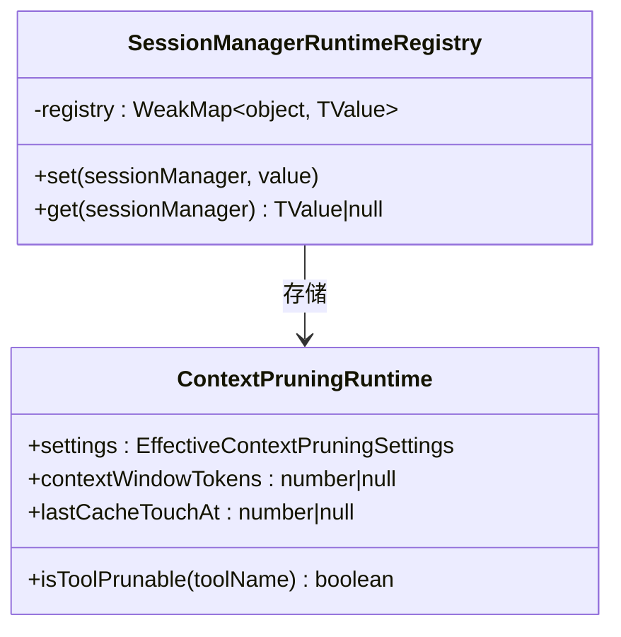
```mermaid
classDiagram
class SessionManagerRuntimeRegistry {
-registry : WeakMap~object, TValue~
+set(sessionManager, value)
+get(sessionManager) TValue|null
}
class ContextPruningRuntime {
+settings : EffectiveContextPruningSettings
+contextWindowTokens : number|null
+isToolPrunable(toolName) boolean
+lastCacheTouchAt : number|null
}
SessionManagerRuntimeRegistry --> ContextPruningRuntime : 存储
```

**图表来源**
- [src/agents/pi-extensions/session-manager-runtime-registry.ts:1-30](file://src/agents/pi-extensions/session-manager-runtime-registry.ts#L1-L30)
- [src/agents/pi-extensions/context-pruning/runtime.ts:4-17](file://src/agents/pi-extensions/context-pruning/runtime.ts#L4-L17)

#### 关键设计原则

1. **对象身份键控**：使用WeakMap确保只有对象身份作为键
2. **内存安全**：避免循环引用导致的内存泄漏
3. **会话隔离**：每个SessionManager实例拥有独立的运行时状态
4. **类型安全**：泛型支持确保类型安全的值存储

**章节来源**
- [src/agents/pi-extensions/session-manager-runtime-registry.ts:1-30](file://src/agents/pi-extensions/session-manager-runtime-registry.ts#L1-L30)
- [src/agents/pi-extensions/context-pruning/runtime.ts:1-17](file://src/agents/pi-extensions/context-pruning/runtime.ts#L1-L17)

### 上下文引擎接口

上下文引擎提供了高级的上下文管理功能：

#### 核心接口方法

| 方法名 | 参数 | 返回值 | 描述 |
|--------|------|--------|------|
| assemble | sessionId, messages, tokenBudget | AssembleResult | 在令牌预算下组装模型上下文 |
| compact | sessionId, sessionFile, tokenBudget | CompactResult | 压缩上下文以减少令牌使用 |
| afterTurn | sessionId, sessionFile, messages | void | 在运行尝试完成后执行后置工作 |
| prepareSubagentSpawn | parentSessionKey, childSessionKey | SubagentSpawnPreparation | 准备子代理状态 |
| onSubagentEnded | childSessionKey, reason | void | 通知子代理生命周期结束 |

#### 上下文压缩策略

上下文引擎支持多种压缩策略来优化令牌使用：

1. **主动压缩**：根据当前令牌使用情况主动触发压缩
2. **阈值触发**：当令牌使用超过阈值时自动压缩
3. **预算驱动**：基于模型上下文窗口大小进行预算管理
4. **智能摘要**：创建对话摘要以减少冗余信息

**章节来源**
- [src/context-engine/types.ts:97-168](file://src/context-engine/types.ts#L97-L168)

### 多平台客户端集成

系统支持多种客户端平台，每种平台都有专门的集成实现：

#### TUI客户端实现

TUI客户端提供了命令行界面的聊天功能：

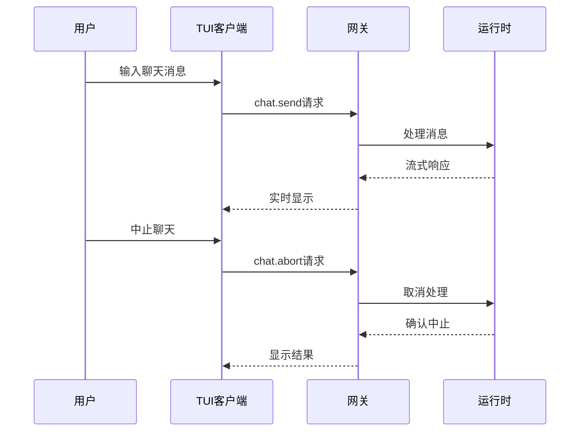
```mermaid
sequenceDiagram
participant User as 用户
participant TUI as TUI客户端
participant Gateway as 网关
participant Runtime as 运行时
User->>TUI : 输入聊天消息
TUI->>Gateway : chat.send请求
Gateway->>Runtime : 处理消息
Runtime-->>Gateway : 流式响应
Gateway-->>TUI : 实时显示
User->>TUI : 中止聊天
TUI->>Gateway : chat.abort请求
Gateway->>Runtime : 取消处理
Runtime-->>Gateway : 确认中止
Gateway-->>TUI : 显示结果
```

**图表来源**
- [src/tui/gateway-chat.ts:204-229](file://src/tui/gateway-chat.ts#L204-L229)

#### Android客户端实现

Android客户端提供了移动设备的聊天功能：

| 功能特性 | 实现细节 | 配置选项 |
|----------|----------|----------|
| 语音聊天 | TalkModeManager | timeoutMs: 30000 |
| 连接管理 | GatewaySession | idempotencyKey自动生成 |
| 缓存机制 | pendingRunStates | 最大缓存100个运行状态 |
| 超时处理 | withTimeout(120000ms) | 自动取消挂起操作 |

#### React聊天界面实现

React聊天界面提供了现代化的Web聊天体验：

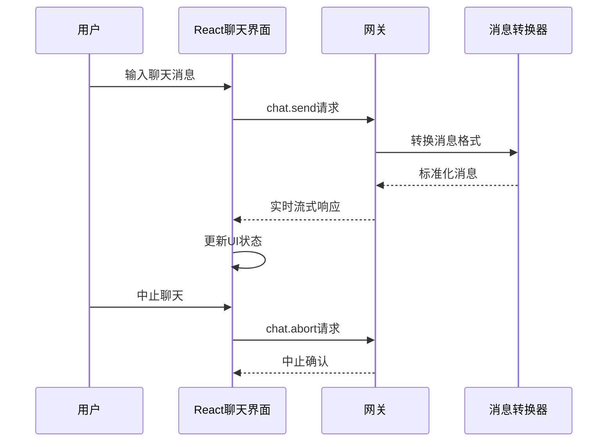
```mermaid
sequenceDiagram
participant User as 用户
participant ReactUI as React聊天界面
participant Gateway as 网关
participant MessageConverter as 消息转换器
User->>ReactUI : 输入聊天消息
ReactUI->>Gateway : chat.send请求
Gateway->>MessageConverter : 转换消息格式
MessageConverter-->>Gateway : 标准化消息
Gateway-->>ReactUI : 实时流式响应
ReactUI->>ReactUI : 更新UI状态
User->>ReactUI : 中止聊天
ReactUI->>Gateway : chat.abort请求
Gateway-->>ReactUI : 中止确认
```

**图表来源**
- [ui-react/src/components/chat/Composer.tsx:18-31](file://ui-react/src/components/chat/Composer.tsx#L18-L31)

**章节来源**
- [src/tui/gateway-chat.ts:187-229](file://src/tui/gateway-chat.ts#L187-L229)
- [apps/android/app/src/main/java/ai/openclaw/app/ui/chat/ChatComposer.kt:61-78](file://apps/android/app/src/main/java/ai/openclaw/app/ui/chat/ChatComposer.kt#L61-L78)

### 运行时环境管理

运行时环境提供了统一的日志记录和错误处理接口：

#### 运行时接口定义

| 方法 | 参数 | 行为 | 用途 |
|------|------|------|------|
| log | ...args: unknown[] | 清理进度线并输出日志 | 标准输出 |
| error | ...args: unknown[] | 清理进度线并输出错误 | 错误报告 |
| exit | code: number | 恢复终端状态并退出 | 程序终止 |

#### 非退出运行时

系统还提供了非退出运行时变体，用于测试和特殊场景：

- **createNonExitingRuntime()**：创建不实际退出进程的运行时
- **错误处理**：抛出包含退出码的错误而不是直接退出
- **测试友好**：便于单元测试和集成测试

**章节来源**
- [src/runtime.ts:4-54](file://src/runtime.ts#L4-L54)

### 交互式组件渲染系统

**新增** 交互式组件渲染系统是本次更新的重要组成部分，提供了强大的交互式内容处理能力：

#### resolveInteractiveRenderContext函数

resolveInteractiveRenderContext函数是交互式组件渲染的核心，专门负责解析交互式渲染上下文：

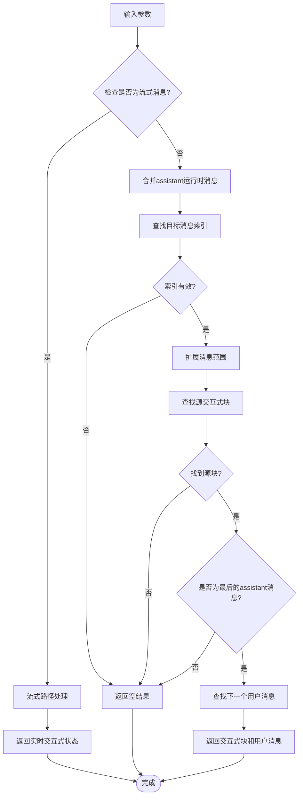
```mermaid
flowchart TD
InputParams[输入参数] --> CheckStream{"检查是否为流式消息?"}
CheckStream --> |是| StreamPath["流式路径处理"]
CheckStream --> |否| MergeMessages["合并assistant运行时消息"]
MergeMessages --> FindIndex["查找目标消息索引"]
FindIndex --> ValidateIndex{"索引有效?"}
ValidateIndex --> |否| ReturnEmpty["返回空结果"]
ValidateIndex --> |是| ExpandRange["扩展消息范围"]
ExpandRange --> FindSourceBlocks["查找源交互式块"]
FindSourceBlocks --> CheckSource{"找到源块?"}
CheckSource --> |否| ReturnEmpty
CheckSource --> |是| CheckLast{"是否为最后的assistant消息?"}
CheckLast --> |否| ReturnEmpty
CheckLast --> |是| FindNextUser["查找下一个用户消息"]
FindNextUser --> ReturnResult["返回交互式块和用户消息"]
StreamPath --> ReturnLiveState["返回实时交互式状态"]
ReturnLiveState --> End([完成])
ReturnResult --> End
ReturnEmpty --> End
```

**图表来源**
- [ui-react/src/components/chat/InteractiveParts.tsx:114-178](file://ui-react/src/components/chat/InteractiveParts.tsx#L114-L178)

#### 关键实现特性

1. **流式消息处理**：支持STREAM_MESSAGE_ID的特殊处理
2. **消息合并集成**：与mergeAssistantRunMessages配合处理assistant运行时消息
3. **交互式块解析**：智能解析和渲染交互式内容块
4. **用户消息关联**：自动关联用户提交的答案
5. **状态管理**：维护交互式内容的渲染状态

#### 交互式内容类型支持

系统支持多种交互式内容类型的渲染：

1. **问题流程（QuestionFlow）**：多步骤问答流程
2. **选项列表（OptionList）**：单步选项选择
3. **收据模式（ReceiptMode）**：结果展示模式
4. **前置模式（UpfrontMode）**：预填表单模式
5. **渐进模式（ProgressiveMode）**：逐步展示模式

**章节来源**
- [ui-react/src/components/chat/InteractiveParts.tsx:114-178](file://ui-react/src/components/chat/InteractiveParts.tsx#L114-L178)
- [ui-react/src/components/chat/InteractiveParts.test.ts:1-50](file://ui-react/src/components/chat/InteractiveParts.test.ts#L1-L50)
- [ui-react/src/hooks/chat-event-bridge/interactive-blocks.ts:1-56](file://ui-react/src/hooks/chat-event-bridge/interactive-blocks.ts#L1-L56)

## Assistant UI框架集成

### 运行时提供者架构

Assistant UI运行时提供者是本次更新的核心创新，完全替代了原有的旧实现：

#### 核心架构设计

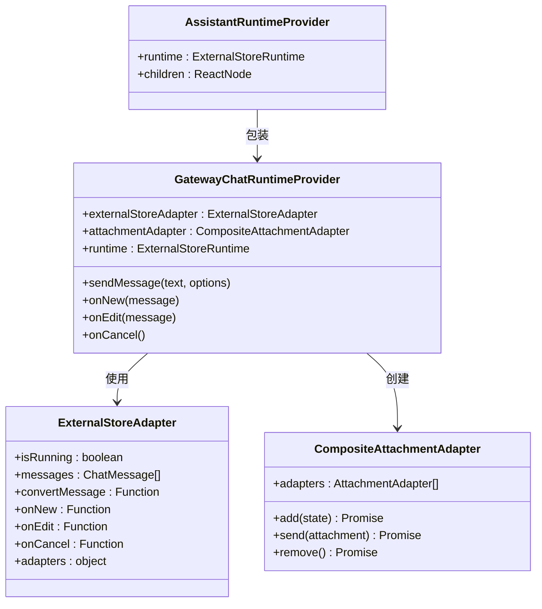
```mermaid
classDiagram
class AssistantRuntimeProvider {
+runtime : ExternalStoreRuntime
+children : ReactNode
}
class GatewayChatRuntimeProvider {
+externalStoreAdapter : ExternalStoreAdapter
+attachmentAdapter : CompositeAttachmentAdapter
+runtime : ExternalStoreRuntime
+sendMessage(text, options)
+onNew(message)
+onEdit(message)
+onCancel()
}
class ExternalStoreAdapter {
+isRunning : boolean
+messages : ChatMessage[]
+convertMessage : Function
+onNew : Function
+onEdit : Function
+onCancel : Function
+adapters : object
}
class CompositeAttachmentAdapter {
+adapters : AttachmentAdapter[]
+add(state) Promise
+send(attachment) Promise
+remove() Promise
}
AssistantRuntimeProvider --> GatewayChatRuntimeProvider : 包装
GatewayChatRuntimeProvider --> ExternalStoreAdapter : 使用
GatewayChatRuntimeProvider --> CompositeAttachmentAdapter : 创建
```

**图表来源**
- [ui-react/src/providers/chat/GatewayChatRuntimeProvider.tsx:217-226](file://ui-react/src/providers/chat/GatewayChatRuntimeProvider.tsx#L217-L226)

#### 运行时适配器实现

系统实现了完整的外部存储运行时适配器：

1. **状态管理**：跟踪运行时状态和消息列表
2. **消息转换**：将聊天消息转换为Assistant UI格式
3. **事件处理**：处理新消息、编辑和取消事件
4. **附件适配**：集成复合附件处理能力

#### 附件适配器系统

**更新** 附件适配器系统经过重大更新，移除了图像附件处理：

系统提供了完整的附件处理能力：

1. **文档附件**：GatewayBinaryAttachmentAdapter处理文档和文本文件
2. **类型验证**：支持12种MIME类型的附件（**移除了图像类型**）
3. **大小限制**：5MB单文件限制和100MB引用模式限制
4. **状态管理**：跟踪附件的添加、发送和移除状态
5. **UI集成**：与Composer组件深度集成，提供文件选择和预览

**章节来源**
- [ui-react/src/providers/chat/GatewayChatRuntimeProvider.tsx:1-226](file://ui-react/src/providers/chat/GatewayChatRuntimeProvider.tsx#L1-L226)
- [ui-react/src/providers/chat/adapters/gateway-attachment-adapter.ts:1-91](file://ui-react/src/providers/chat/adapters/gateway-attachment-adapter.ts#L1-L91)

### Composer组件集成

Composer组件是Assistant UI框架的核心输入组件：

#### 组件功能特性

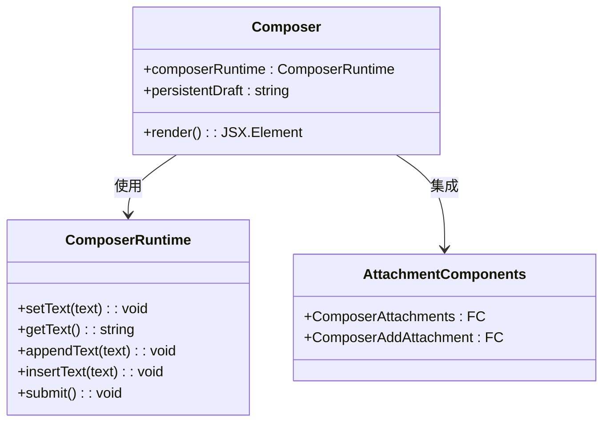
```mermaid
classDiagram
class Composer {
+composerRuntime : ComposerRuntime
+persistentDraft : string
+render() : JSX.Element
}
class ComposerRuntime {
+setText(text) : void
+getText() : string
+appendText(text) : void
+insertText(text) : void
+submit() : void
}
class AttachmentComponents {
+ComposerAttachments : FC
+ComposerAddAttachment : FC
}
Composer --> ComposerRuntime : 使用
Composer --> AttachmentComponents : 集成
```

**图表来源**
- [ui-react/src/components/chat/Composer.tsx:18-31](file://ui-react/src/components/chat/Composer.tsx#L18-L31)

#### 附件处理集成

**更新** Composer组件与附件处理系统深度集成，移除了图像附件处理：

Composer组件与附件处理系统深度集成：

1. **附件预览**：ComposerAttachments组件显示已添加的附件
2. **附件添加**：ComposerAddAttachment组件提供文件选择功能
3. **状态同步**：附件状态与聊天状态存储保持同步
4. **验证处理**：自动验证附件类型和大小限制
5. **UI适配**：移除图像附件的UI组件和处理逻辑

#### 输入状态管理

系统提供了完整的输入状态管理：

1. **草稿保存**：支持消息草稿的持久化
2. **输入验证**：验证输入内容和附件状态
3. **提交处理**：处理消息提交和发送流程
4. **错误处理**：优雅处理输入过程中的错误

**章节来源**
- [ui-react/src/components/chat/Composer.tsx:1-176](file://ui-react/src/components/chat/Composer.tsx#L1-L176)
- [ui-react/src/components/assistant-ui/attachment.tsx:1-171](file://ui-react/src/components/assistant-ui/attachment.tsx#L1-L171)

### 工具UI组件集成

Assistant UI框架提供了丰富的工具UI组件：

#### 附件UI组件

**更新** 附件UI组件移除了图像附件处理：

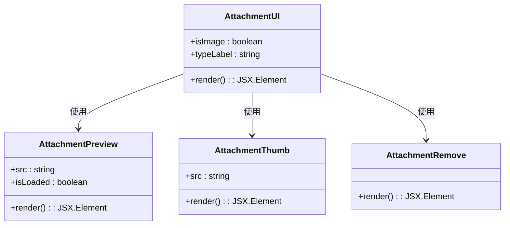
```mermaid
classDiagram
class AttachmentUI {
+isImage : boolean
+typeLabel : string
+render() : JSX.Element
}
class AttachmentPreview {
+src : string
+isLoaded : boolean
+render() : JSX.Element
}
class AttachmentThumb {
+src : string
+render() : JSX.Element
}
class AttachmentRemove {
+render() : JSX.Element
}
AttachmentUI --> AttachmentPreview : 使用
AttachmentUI --> AttachmentThumb : 使用
AttachmentUI --> AttachmentRemove : 使用
```

**图表来源**
- [ui-react/src/components/assistant-ui/attachment.tsx:126-171](file://ui-react/src/components/assistant-ui/attachment.tsx#L126-L171)

#### 工具UI组件功能

系统提供了完整的工具UI组件：

1. **附件预览**：AttachmentPreview组件支持文档预览
2. **附件缩略图**：AttachmentThumb组件显示附件缩略图
3. **附件移除**：AttachmentRemove组件提供附件移除功能
4. **工具栏操作**：ActionBar组件提供复制和重载功能
5. **工具组展示**：AssistantToolGroup组件展示工具调用结果

#### 交互式内容展示

系统支持多种交互式内容的展示：

1. **问题流程**：支持问题流程的交互式展示
2. **选项列表**：支持选项列表的交互式展示
3. **富工具呈现**：支持工具结果的富文本呈现
4. **推广工具**：支持工具结果的推广展示

**章节来源**
- [ui-react/src/components/assistant-ui/attachment.tsx:1-171](file://ui-react/src/components/assistant-ui/attachment.tsx#L1-L171)
- [ui-react/src/components/assistant-ui/action-bar.tsx:1-22](file://ui-react/src/components/assistant-ui/action-bar.tsx#L1-L22)
- [ui-react/src/components/assistant-ui/assistant-tool-group.tsx:1-179](file://ui-react/src/components/assistant-ui/assistant-tool-group.tsx#L1-L179)

## 聊天事件桥接功能增强

### 事件处理架构

聊天事件桥接功能提供了完整的事件处理和状态管理能力：

#### 事件类型处理

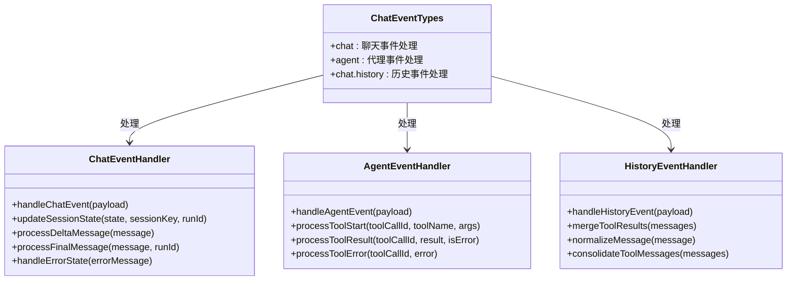
```mermaid
classDiagram
class ChatEventTypes {
+chat : 聊天事件处理
+agent : 代理事件处理
+chat.history : 历史事件处理
}
class ChatEventHandler {
+handleChatEvent(payload)
+updateSessionState(state, sessionKey, runId)
+processDeltaMessage(message)
+processFinalMessage(message, runId)
+handleErrorState(errorMessage)
}
class AgentEventHandler {
+handleAgentEvent(payload)
+processToolStart(toolCallId, toolName, args)
+processToolResult(toolCallId, result, isError)
+processToolError(toolCallId, error)
}
class HistoryEventHandler {
+handleHistoryEvent(payload)
+mergeToolResults(messages)
+normalizeMessage(message)
+consolidateToolMessages(messages)
}
ChatEventTypes --> ChatEventHandler : 处理
ChatEventTypes --> AgentEventHandler : 处理
ChatEventTypes --> HistoryEventHandler : 处理
```

**图表来源**
- [ui-react/src/hooks/chat-event-bridge/useChatEventBridge.ts:22-54](file://ui-react/src/hooks/chat-event-bridge/useChatEventBridge.ts#L22-L54)

#### 会话状态管理

系统实现了完整的会话状态管理：

1. **会话生成状态**：跟踪活跃会话的生成状态
2. **流式文本管理**：管理实时流式文本的显示
3. **工具调用状态**：跟踪工具调用的生命周期
4. **交互式内容状态**：管理交互式内容的显示和更新
5. **历史消息处理**：合并和规范化历史消息数据

#### 交互式内容处理

**新增** 交互式内容处理系统经过重大增强：

1. **内容块识别**：识别消息中的交互式内容块
2. **类型验证**：验证交互式内容的类型安全
3. **状态管理**：管理交互式内容的显示状态
4. **流式更新**：支持交互式内容的流式更新
5. **摘要生成**：自动生成交互式内容的摘要信息
6. **用户反馈**：提供交互式内容的状态反馈和确认机制

**章节来源**
- [ui-react/src/hooks/chat-event-bridge/useChatEventBridge.ts:1-62](file://ui-react/src/hooks/chat-event-bridge/useChatEventBridge.ts#L1-L62)
- [ui-react/src/hooks/chat-event-bridge/handlers/chat-event.ts:1-118](file://ui-react/src/hooks/chat-event-bridge/handlers/chat-event.ts#L1-L118)
- [ui-react/src/hooks/chat-event-bridge/handlers/agent-event.ts:1-345](file://ui-react/src/hooks/chat-event-bridge/handlers/agent-event.ts#L1-L345)

### 消息规范化处理

消息规范化处理系统确保了消息格式的一致性和完整性：

#### 附件内容剥离

```mermaid
flowchart TD
RawMessage[原始消息] --> CheckSeparator["检查附件分隔符"]
CheckSeparator --> HasSeparator{"包含分隔符?"}
HasSeparator --> |否| ReturnOriginal["返回原始消息"]
HasSeparator --> |是| SplitContent["分割提示内容和附件内容"]
SplitContent --> ExtractFiles["提取文件名"]
ExtractFiles --> CreateAttachments["创建附件列表"]
CreateAttachments --> ReturnClean["返回清理后的消息"]
ReturnOriginal --> End([完成])
ReturnClean --> End
```

**图表来源**
- [ui-react/src/hooks/chat-event-bridge/index.ts:6-10](file://ui-react/src/hooks/chat-event-bridge/index.ts#L6-L10)

#### 历史附件提示标准化

系统支持多种历史附件提示格式：

1. **文件名提取**：从附件内容中提取文件名
2. **MIME类型推断**：根据文件扩展名推断MIME类型
3. **附件元数据**：创建附件显示元数据
4. **重复检测**：避免重复附件的处理

#### 内容规范化

系统提供了多种内容规范化方法：

1. **字符串规范化**：将字符串内容转换为纯文本
2. **数组规范化**：从内容块数组中提取文本内容
3. **角色标准化**：将不同角色映射到标准角色
4. **消息文本提取**：从消息对象中提取纯文本内容

**章节来源**
- [ui-react/src/hooks/chat-event-bridge/index.ts:1-19](file://ui-react/src/hooks/chat-event-bridge/index.ts#L1-L19)

### 工具块处理优化

工具块处理系统提供了完整的工具调用生命周期管理：

#### 工具调用合并

```mermaid
flowchart TD
ToolMessages[工具调用消息] --> CheckRole["检查消息角色"]
CheckRole --> IsAssistant{"是否助手消息?"}
IsAssistant --> |否| AddDirectly["直接添加到结果"]
IsAssistant --> |是| CheckBlocks["检查内容块"]
CheckBlocks --> IsToolOnly{"是否仅包含工具调用?"}
IsToolOnly --> |否| AddDirectly
IsToolOnly --> |是| GroupConsecutive["分组连续工具调用"]
GroupConsecutive --> MergeBlocks["合并内容块"]
MergeBlocks --> AddMerged["添加合并后的消息"]
AddDirectly --> NextMessage["处理下一个消息"]
AddMerged --> NextMessage
NextMessage --> MoreMessages{"还有更多消息?"}
MoreMessages --> |是| CheckRole
MoreMessages --> |否| ReturnResult["返回处理结果"]
```

**图表来源**
- [ui-react/src/hooks/chat-event-bridge/index.ts:12-16](file://ui-react/src/hooks/chat-event-bridge/index.ts#L12-L16)

#### 工具结果合并

系统优化了工具结果的合并处理：

1. **结果文本提取**：从工具结果块中提取文本内容
2. **错误状态解析**：根据isError字段解析工具调用状态
3. **工具调用配对**：将工具结果与对应的工具调用配对
4. **内容块生成**：生成标准化的工具结果内容块

#### 内容块提取

系统提供了完整的交互式内容块提取能力：

1. **文本块提取**：从内容数组中提取文本块
2. **工具调用块提取**：识别和提取工具调用块
3. **工具结果块处理**：处理工具结果块并解析状态
4. **交互式内容识别**：识别交互式工具调用并创建相应内容块

**章节来源**
- [ui-react/src/hooks/chat-event-bridge/index.ts:1-19](file://ui-react/src/hooks/chat-event-bridge/index.ts#L1-L19)

## CSS样式和视觉一致性改进

### 导航标签页样式系统

系统实现了统一的导航标签页样式系统，确保跨平台的一致用户体验：

#### 样式架构

```mermaid
classDiagram
class NavTabsSystem {
+nav-tabs : 容器样式
+nav-tabs-item : 项目样式
+nav-tabs-underline : 下划线样式
+nav-tabs-underline-ready : 就绪状态
+html.dark : 深色主题支持
}
class NavTabsUnderline {
+position : absolute
+left : 0
+bottom : 0
+height : 1.5px
+width : var(--nav-tab-underline-width, 0)
+transform : translateX(var(--nav-tab-underline-x, 0))
+background-color : rgb(var(--primary))
+border-radius : 999px
+pointer-events : none
+opacity : 0
+transition : transform 260ms ease-in-out, width 260ms ease-in-out, opacity 160ms ease-in-out
+will-change : transform, width
}
class ThemeSupport {
+html.dark .nav-tabs-underline : background-color : rgb(var(--primary-light))
}
class StateManagement {
+.nav-tabs-underline-ready .nav-tabs-underline : opacity : 1
}
NavTabsSystem --> NavTabsUnderline : 包含
NavTabsSystem --> ThemeSupport : 支持
NavTabsSystem --> StateManagement : 管理
```

**图表来源**
- [docs/style.css:5-38](file://docs/style.css#L5-L38)

#### 样式特性

系统实现了以下样式特性：

1. **绝对定位下划线**：使用绝对定位创建精确的下划线位置
2. **CSS变量支持**：使用CSS变量实现主题颜色的动态切换
3. **平滑过渡动画**：使用CSS过渡实现流畅的动画效果
4. **深色主题适配**：支持深色主题的颜色适配
5. **状态管理**：通过CSS类名管理下划线的显示状态

#### 动画效果

系统实现了以下动画效果：

1. **变换动画**：下划线位置的平滑变换
2. **宽度动画**：下划线宽度的动态变化
3. **透明度动画**：下划线显示和隐藏的过渡
4. **性能优化**：使用will-change优化动画性能

**章节来源**
- [docs/style.css:1-38](file://docs/style.css#L1-L38)

### 响应式设计支持

系统支持响应式设计，适配不同屏幕尺寸：

#### 媒体查询支持

系统使用CSS媒体查询支持响应式布局：

1. **断点定义**：定义不同屏幕尺寸的断点
2. **布局适配**：根据屏幕尺寸调整布局
3. **字体大小调整**：根据屏幕尺寸调整字体大小
4. **间距优化**：优化不同屏幕尺寸下的间距

#### 移动端优化

系统针对移动端进行了专门优化：

1. **触摸友好的点击区域**：确保按钮和链接有足够的点击区域
2. **滚动优化**：优化移动端的滚动体验
3. **视口配置**：正确的视口配置确保移动端正确显示
4. **手势支持**：支持移动端手势操作

**章节来源**
- [docs/style.css:1-38](file://docs/style.css#L1-L38)

## 消息转换与工具流处理优化

### 消息转换器实现

消息转换器负责将不同格式的消息转换为统一的内部表示：

#### 转换流程

```mermaid
flowchart TD
InputMessage[输入消息] --> ParseDirectives["解析指令标签"]
ParseDirectives --> StripTags["剥离代理指令标签"]
StripTags --> ExtractContent["提取内容块"]
ExtractContent --> CheckToolCalls{"包含工具调用?"}
CheckToolCalls --> |是| ParseToolCalls["解析工具调用"]
CheckToolCalls --> |否| CreateTextPart["创建文本部分"]
ParseToolCalls --> MergeParts["合并内容部分"]
CreateTextPart --> MergeParts
MergeParts --> EnsureMinParts["确保至少一个部分"]
EnsureMinParts --> OutputMessage[输出消息]
```

**图表来源**
- [ui-react/src/providers/chat/message-convert.ts:24-108](file://ui-react/src/providers/chat/message-convert.ts#L24-L108)

#### 工具调用处理

系统支持复杂的工具调用处理流程：

1. **工具调用解析**：从消息内容中提取工具调用信息
2. **参数处理**：解析工具调用参数并进行验证
3. **状态跟踪**：跟踪工具调用的执行状态
4. **结果合并**：将工具调用结果合并到消息中

#### 交互式内容处理

**新增** 交互式内容处理系统经过重大优化：

1. **resolveInteractiveRenderContext集成**：与新的渲染上下文解析器深度集成
2. **消息合并优化**：与mergeAssistantRunMessages配合处理assistant运行时消息
3. **交互式块解析**：智能解析和渲染交互式内容块
4. **流式交互支持**：支持实时流式交互内容的渲染
5. **摘要生成机制**：自动生成交互式内容的摘要信息

**章节来源**
- [ui-react/src/providers/chat/message-convert.ts:1-109](file://ui-react/src/providers/chat/message-convert.ts#L1-L109)
- [ui-react/src/providers/chat/stream-assembly.ts:1-128](file://ui-react/src/providers/chat/stream-assembly.ts#L1-L128)

### 工具事件处理

工具事件处理机制提供了完整的工具调用生命周期管理：

#### 工具事件类型

| 事件类型 | 描述 | 参数 |
|----------|------|------|
| tool_start | 工具调用开始 | toolCallId, name, args |
| tool_update | 工具调用更新 | toolCallId, partialResult |
| tool_result | 工具调用结果 | toolCallId, result, isError |
| tool_error | 工具调用错误 | toolCallId, error |

#### 事件处理流程

```mermaid
sequenceDiagram
participant Agent as 代理
participant ToolRegistry as 工具事件注册表
participant Clients as 客户端
Agent->>ToolRegistry : tool_start
ToolRegistry-->>Clients : 工具调用开始
Agent->>ToolRegistry : tool_update
ToolRegistry-->>Clients : 工具调用更新
Agent->>ToolRegistry : tool_result
ToolRegistry-->>Clients : 工具调用结果
Agent->>ToolRegistry : tool_error
ToolRegistry-->>Clients : 工具调用错误
```

**图表来源**
- [src/gateway/server-chat.ts:234-247](file://src/gateway/server-chat.ts#L234-L247)

**章节来源**
- [src/gateway/server-chat.ts:234-247](file://src/gateway/server-chat.ts#L234-L247)

### ACP翻译器增强

ACP翻译器提供了增强的工具调用处理能力：

#### 工具调用状态管理

翻译器能够处理工具调用的不同状态：

1. **更新状态**：处理工具调用的中间状态更新
2. **结果状态**：处理工具调用的最终结果
3. **错误状态**：处理工具调用过程中的错误

#### 状态转换逻辑

```mermaid
stateDiagram-v2
[*] --> 等待调用
等待调用 --> 执行中 : tool_call_update
执行中 --> 完成 : tool_call_update(result)
执行中 --> 失败 : tool_call_update(result, isError=true)
完成 --> [*]
失败 --> [*]
```

**图表来源**
- [src/acp/translator.ts:740-779](file://src/acp/translator.ts#L740-L779)

**章节来源**
- [src/acp/translator.ts:740-779](file://src/acp/translator.ts#L740-L779)

## 指令标签处理增强

### 指令标签处理系统

新增的指令标签处理系统提供了完整的代理指令安全处理能力：

#### 核心功能模块

1. **指令标签剥离模块**
   - 移除消息中的代理指令标签
   - 保护外部不可信包装元数据
   - 优化消息显示效果

2. **安全验证模块**
   - 验证指令标签的有效性
   - 检测恶意指令标签
   - 实施安全过滤机制

3. **显示优化模块**
   - 保持消息结构完整性
   - 优化客户端显示效果
   - 支持多种显示模式

4. **快速通道模块**
   - 优化指令处理的性能路径
   - 减少不必要的处理开销
   - 提升指令响应速度

#### 关键实现特性

```mermaid
classDiagram
class DirectiveTagsProcessor {
+InlineDirectiveParseResult : type
+DisplayMessageWithContent : type
+stripInlineDirectiveTagsForDisplay(text)
+stripInlineDirectiveTagsFromMessageForDisplay(message)
+parseInlineDirectives(text, options)
}
class DirectiveHandling {
+applyInlineDirectivesFastLane(params) Promise
+handleDirectiveOnly(params) Promise
+parseInlineDirectives(body, options) InlineDirectives
+isDirectiveOnly(params) boolean
}
class InlineDirectiveParser {
+AUDIO_TAG_RE : RegExp
+REPLY_TAG_RE : RegExp
+parseInlineDirectives(text, options)
+normalizeDirectiveWhitespace(text)
}
class MessageTextPart {
+type : "text"
+text : string
}
class StripInlineDirectiveTagsResult {
+text : string
+changed : boolean
}
DirectiveTagsProcessor --> InlineDirectiveParser : 使用
DirectiveTagsProcessor --> DirectiveHandling : 依赖
DirectiveHandling --> InlineDirectiveParser : 使用
InlineDirectiveParser --> StripInlineDirectiveTagsResult : 生成
```

**图表来源**
- [src/utils/directive-tags.ts:1-150](file://src/utils/directive-tags.ts#L1-L150)
- [src/auto-reply/reply/directive-handling.fast-lane.ts:1-94](file://src/auto-reply/reply/directive-handling.fast-lane.ts#L1-L94)
- [src/auto-reply/reply/directive-handling.impl.ts:1-468](file://src/auto-reply/reply/directive-handling.impl.ts#L1-L468)

#### 指令标签类型

| 指令标签 | 功能描述 | 处理方式 |
|----------|----------|----------|
| [[audio_as_voice]] | 音频语音指令 | 可选择性剥离 |
| [[reply_to_current]] | 回复当前消息 | 可选择性剥离 |
| [[reply_to: id]] | 指定回复消息 | 可选择性剥离 |
| <th> | 思维内容标签 | 严格剥离 |
| <<final>> | 最终内容标签 | 严格剥离 |

#### 安全验证机制

系统实施了多层次的安全验证：

1. **标签格式验证**：确保指令标签格式正确
2. **内容安全检查**：检测潜在的恶意内容
3. **元数据剥离**：移除外部门户的不可信元数据
4. **显示优化**：保持消息的可读性和美观性

**章节来源**
- [src/utils/directive-tags.ts:1-150](file://src/utils/directive-tags.ts#L1-L150)
- [src/auto-reply/reply/directive-handling.fast-lane.ts:1-94](file://src/auto-reply/reply/directive-handling.fast-lane.ts#L1-L94)
- [src/auto-reply/reply/directive-handling.impl.ts:1-468](file://src/auto-reply/reply/directive-handling.impl.ts#L1-L468)

### 外部不可信包装元数据剥离

系统特别加强了对外部不可信包装元数据的处理：

#### 元数据剥离流程

```mermaid
flowchart TD
ExternalMeta[外部不可信元数据] --> DetectWrapper["检测包装标签"]
DetectWrapper --> ValidateFormat["验证格式有效性"]
ValidateFormat --> CheckTrust["检查信任级别"]
CheckTrust --> |可信| AllowThrough["允许通过"]
CheckTrust --> |不可信| StripWrapper["剥离包装标签"]
ValidateFormat --> |格式无效| StripWrapper
StripWrapper --> ExtractContent["提取内容"]
AllowThrough --> ExtractContent
ExtractContent --> FinalText[最终文本]
```

#### 元数据格式规范

系统支持以下格式的元数据剥离：

1. **标准格式**：`<<<EXTERNAL_UNTRUSTED_CONTENT id="...">>>`
2. **结束标记**：`<<<END_EXTERNAL_UNTRUSTED_CONTENT id="...">>>`
3. **内容分隔**：`---`
4. **元数据键值对**：`key: value`

**章节来源**
- [src/gateway/server-methods/chat.directive-tags.test.ts:23-30](file://src/gateway/server-methods/chat.directive-tags.test.ts#L23-L30)
- [src/gateway/server-methods/chat.directive-tags.test.ts:365-401](file://src/gateway/server-methods/chat.directive-tags.test.ts#L365-L401)

### 指令解析优化

系统优化了指令解析逻辑，提高了处理效率和准确性：

#### 解析流程优化

```mermaid
flowchart TD
InputText[输入文本] --> SkipPrefix["跳过前缀空白"]
SkipPrefix --> TakeToken["提取指令令牌"]
TakeToken --> CheckTokenType{"检查令牌类型"}
CheckTokenType --> |音频标签| ProcessAudio["处理音频标签"]
CheckTokenType --> |回复标签| ProcessReply["处理回复标签"]
CheckTokenType --> |普通文本| ProcessText["处理普通文本"]
ProcessAudio --> UpdateFlags["更新标志位"]
ProcessReply --> UpdateFlags
ProcessText --> UpdateFlags
UpdateFlags --> NormalizeWhitespace["规范化空白字符"]
NormalizeWhitespace --> ReturnResult[返回解析结果]
```

**图表来源**
- [src/auto-reply/reply/directive-parsing.ts:16-40](file://src/auto-reply/reply/directive-parsing.ts#L16-L40)

#### 流式指令累积

系统支持流式指令的累积处理：

1. **指令累积器**：跟踪流式传输中的指令状态
2. **粘性上下文**：保持回复指令的粘性上下文
3. **重置机制**：支持指令状态的重置
4. **跨块传播**：确保指令在消息块间正确传播

#### 快速通道优化

新增的快速通道优化显著提升了指令处理性能：

1. **条件检查**：快速检查是否需要处理指令
2. **早期返回**：对于不需要处理的情况直接返回
3. **性能路径**：为常见情况提供优化的处理路径
4. **资源节省**：减少不必要的计算和内存分配

**章节来源**
- [src/auto-reply/reply/reply-utils.test.ts:746-779](file://src/auto-reply/reply/reply-utils.test.ts#L746-L779)
- [src/auto-reply/reply/directive-handling.fast-lane.ts:7-94](file://src/auto-reply/reply/directive-handling.fast-lane.ts#L7-L94)

### 指令处理实现

指令处理系统提供了完整的指令生命周期管理：

#### 处理流程

```mermaid
sequenceDiagram
participant Handler as 指令处理器
participant FastLane as 快速通道
participant Impl as 实现模块
participant Session as 会话存储
Handler->>FastLane : applyInlineDirectivesFastLane
FastLane->>FastLane : 检查授权和指令类型
FastLane->>Impl : handleDirectiveOnly
Impl->>Impl : 解析当前指令级别
Impl->>Impl : 处理模型指令
Impl->>Impl : 处理思维级别
Impl->>Impl : 处理推理级别
Impl->>Impl : 处理提升级别
Impl->>Impl : 处理执行指令
Impl->>Impl : 处理队列指令
Impl->>Session : 更新会话状态
Impl-->>FastLane : 返回处理结果
FastLane-->>Handler : 返回最终结果
```

**图表来源**
- [src/auto-reply/reply/directive-handling.fast-lane.ts:7-94](file://src/auto-reply/reply/directive-handling.fast-lane.ts#L7-L94)
- [src/auto-reply/reply/directive-handling.impl.ts:59-468](file://src/auto-reply/reply/directive-handling.impl.ts#L59-L468)

#### 指令级别管理

系统支持多种指令级别的动态管理：

1. **思维级别**：控制思考过程的详细程度
2. **推理级别**：控制推理过程的可见性
3. **提升级别**：控制权限提升的级别
4. **详细级别**：控制日志输出的详细程度

#### 会话状态更新

指令处理完成后，系统会更新会话状态：

1. **级别更新**：更新当前会话的指令级别
2. **配置持久化**：将配置更改持久化到存储
3. **事件广播**：广播模式切换事件
4. **状态同步**：同步到其他客户端

**章节来源**
- [src/auto-reply/reply/directive-handling.fast-lane.ts:7-94](file://src/auto-reply/reply/directive-handling.fast-lane.ts#L7-L94)
- [src/auto-reply/reply/directive-handling.impl.ts:59-468](file://src/auto-reply/reply/directive-handling.impl.ts#L59-L468)

## 附件处理系统

### 附件处理器实现

**更新** 附件处理器实现了全新的附件引用构建功能：

#### 附件引用构建

系统实现了完整的附件引用构建功能：

```mermaid
flowchart TD
AttachmentRefs[附件引用输入] --> NormalizeRefs["标准化附件引用"]
NormalizeRefs --> ValidateRefs["验证附件引用"]
ValidateRefs --> ValidRefs{"引用有效?"}
ValidRefs --> |否| RefError["返回引用错误"]
ValidRefs --> |是| BuildAttachmentRef["构建ChatAttachmentRef"]
BuildAttachmentRef --> ProcessAttachment["处理附件内容"]
ProcessAttachment --> ReturnAttachment["返回附件对象"]
RefError --> End([流程结束])
ReturnAttachment --> End
```

**图表来源**
- [src/gateway/server-methods/attachment-normalize.ts:86-123](file://src/gateway/server-methods/attachment-normalize.ts#L86-L123)

#### 附件类型定义

| 附件类型 | 支持的MIME类型 | 处理方式 |
|----------|----------------|----------|
| 文档 | application/pdf, text/*, application/msword, application/vnd.openxmlformats-officedocument.wordprocessingml.document, application/vnd.ms-excel, application/vnd.openxmlformats-officedocument.spreadsheetml.sheet, application/vnd.ms-powerpoint, application/vnd.openxmlformats-officedocument.presentationml.presentation | 直接处理和上传 |
| **新增**：引用 | fileRef | 通过fileId和path引用现有文件 |

#### 附件验证流程

```mermaid
flowchart TD
Attachment[附件输入] --> Normalize["标准化MIME类型"]
Normalize --> ValidateBase64["验证Base64内容"]
ValidateBase64 --> CheckSize{"大小检查"}
CheckSize --> |超出限制| SizeError["返回大小错误"]
CheckSize --> |符合要求| ProcessType{"处理类型"}
ProcessType --> |图像| ImageDisabled["图像上传被禁用"]
ProcessType --> |文档| DocumentProcessing["文档处理"]
ImageDisabled --> ValidationError["返回验证错误"]
DocumentProcessing --> AddDocument["添加文档块"]
AddDocument --> Combine["组合消息"]
ValidationError --> Combine
Combine --> FinalMessage[最终消息]
SizeError --> FinalMessage
```

**图表来源**
- [src/gateway/chat-attachments.ts:207-302](file://src/gateway/chat-attachments.ts#L207-L302)
- [src/gateway/chat-attachments.ts:181-195](file://src/gateway/chat-attachments.ts#L181-L195)

#### 附件限制配置

系统支持灵活的附件限制配置：

| 配置项 | 默认值 | 描述 |
|--------|--------|------|
| enabled | false | 是否启用附件处理 |
| maxFiles | 50 | 单次最多允许的文件数量 |
| maxFileBytes | 1MB | 单个文件的最大字节数 |
| maxTotalBytes | 5MB | 单次附件处理的总字节数 |
| retainOnSessionKeep | false | 会话保留时是否保留附件 |
| **新增**：imageUploadDisabled | true | 是否禁用图像上传 |
| **新增**：maxFileSizeReferenceMode | 100MB | 引用模式下的最大文件大小 |

**章节来源**
- [src/gateway/server-methods/attachment-normalize.ts:1-124](file://src/gateway/server-methods/attachment-normalize.ts#L1-L124)
- [src/gateway/chat-attachments.ts:1-442](file://src/gateway/chat-attachments.ts#L1-L442)
- [src/agents/subagent-attachments.ts:36-93](file://src/agents/subagent-attachments.ts#L36-L93)

### 子代理附件处理

子代理附件处理系统提供了安全的附件材料化机制：

#### 材料化流程

```mermaid
sequenceDiagram
participant ParentAgent as 父代理
participant SubagentAttachments as 子代理附件
participant FileSystem as 文件系统
participant Security as 安全检查
ParentAgent->>SubagentAttachments : materializeSubagentAttachments
SubagentAttachments->>Security : 验证附件配置
Security-->>SubagentAttachments : 配置验证通过
SubagentAttachments->>FileSystem : 创建附件目录
SubagentAttachments->>Security : 验证文件名
Security-->>SubagentAttachments : 文件名验证通过
SubagentAttachments->>Security : 验证Base64内容
Security-->>SubagentAttachments : 内容验证通过
SubagentAttachments->>FileSystem : 写入文件
SubagentAttachments->>FileSystem : 生成清单文件
SubagentAttachments-->>ParentAgent : 返回附件收据
```

**图表来源**
- [src/agents/subagent-attachments.ts:95-246](file://src/agents/subagent-attachments.ts#L95-L246)

#### 安全验证机制

子代理附件处理实施了严格的安全验证：

1. **文件名验证**：防止路径遍历攻击
2. **内容验证**：确保Base64内容有效且未超出大小限制
3. **权限设置**：文件写入权限设置为0o600
4. **清理机制**：失败时自动清理临时文件

**章节来源**
- [src/agents/subagent-attachments.ts:95-246](file://src/agents/subagent-attachments.ts#L95-L246)

### 附件缓存系统

附件缓存系统提供了高效的媒体文件访问机制：

#### 缓存策略

```mermaid
flowchart TD
Request[附件请求] --> CheckCache["检查缓存"]
CheckCache --> CacheHit{"缓存命中?"}
CacheHit --> |是| ReturnCached["返回缓存文件"]
CacheHit --> |否| CheckLocal["检查本地路径"]
CheckLocal --> LocalValid{"本地路径有效?"}
LocalValid --> |是| ReadLocal["读取本地文件"]
LocalValid --> |否| FetchRemote["下载远程文件"]
ReadLocal --> ValidateSize["验证文件大小"]
FetchRemote --> ValidateSize
ValidateSize --> SizeOK{"大小检查通过?"}
SizeOK --> |是| StoreCache["存储到缓存"]
SizeOK --> |否| SizeError["返回大小错误"]
StoreCache --> ReturnFile["返回文件路径"]
ReturnCached --> End([完成])
ReturnFile --> End
SizeError --> End
```

**图表来源**
- [src/media-understanding/attachments.cache.ts:75-219](file://src/media-understanding/attachments.cache.ts#L75-L219)

#### 缓存配置

| 配置项 | 默认值 | 描述 |
|--------|--------|------|
| localPathRoots | 默认本地根目录 | 允许访问的本地路径根目录 |
| maxBytes | 无限 | 单个文件的最大字节数 |
| timeoutMs | 30000 | 下载超时时间（毫秒） |

**章节来源**
- [src/media-understanding/attachments.cache.ts:47-219](file://src/media-understanding/attachments.cache.ts#L47-L219)

### UI附件组件

**更新** React聊天界面提供了完整的附件上传和管理功能，移除了图像附件处理：

#### 附件上传流程

```mermaid
sequenceDiagram
participant User as 用户
participant Composer as 附件组件
participant FileValidator as 文件验证器
participant FileReader as 文件读取器
User->>Composer : 选择文件
Composer->>FileValidator : 验证文件数量
FileValidator-->>Composer : 数量检查通过
Composer->>FileValidator : 验证文件大小
FileValidator-->>Composer : 大小检查通过
Composer->>FileValidator : 验证MIME类型
FileValidator-->>Composer : 类型检查通过
Composer->>FileReader : 读取文件为Base64
FileReader-->>Composer : 返回Base64数据
Composer-->>User : 显示预览
User->>Composer : 点击发送
Composer->>Composer : 添加到待发送列表
Composer-->>User : 发送成功
```

**图表来源**
- [ui-react/src/components/chat/Composer.tsx:136-176](file://ui-react/src/components/chat/Composer.tsx#L136-L176)

#### UI配置

| 配置项 | 值 | 描述 |
|--------|----|------|
| MAX_FILE_SIZE | 5MB | 单个文件最大大小 |
| MAX_TOTAL_SIZE | 20MB | 总文件大小限制 |
| MAX_FILE_COUNT | 10 | 最大文件数量 |
| ALLOWED_MIME_TYPES | 12种类型 | 支持的文件类型集合（**移除了图像类型**） |
| **新增**：MAX_FILE_SIZE_REFERENCE_MODE | 100MB | 引用模式下的最大文件大小 |

**章节来源**
- [ui-react/src/components/chat/Composer.tsx:1-176](file://ui-react/src/components/chat/Composer.tsx#L1-L176)

## 状态管理与生命周期

### 聊天运行状态管理

聊天运行状态管理器提供了完整的运行时状态跟踪：

#### 状态结构

```mermaid
classDiagram
class ChatRunState {
+registry : ChatRunRegistry
+buffers : Map~string, string~
+deltaSentAt : Map~string, number~
+deltaLastBroadcastLen : Map~string, number~
+abortedRuns : Map~string, number~
+clear()
}
class ChatRunRegistry {
+add(sessionId, entry)
+peek(runId)
+shift()
+remove(runId)
+clear()
}
class ToolEventRecipientRegistry {
+add(runId, connId)
+get(runId)
+markFinal(runId)
}
ChatRunState --> ChatRunRegistry : 使用
ChatRunState --> ToolEventRecipientRegistry : 管理
```

**图表来源**
- [src/gateway/server-chat.ts:199-247](file://src/gateway/server-chat.ts#L199-L247)

#### 生命周期管理

系统支持完整的聊天运行生命周期：

1. **创建阶段**：初始化运行状态和缓冲区
2. **运行阶段**：处理消息流和工具事件
3. **完成阶段**：清理资源和持久化状态
4. **中止阶段**：处理中止请求和清理

### 客户端状态同步

客户端状态同步机制确保所有客户端都保持一致的状态：

#### 状态同步流程

```mermaid
sequenceDiagram
participant Gateway as 网关
participant Client1 as 客户端1
participant Client2 as 客户端2
Gateway->>Client1 : chat.final
Gateway->>Client2 : chat.final
Gateway->>Client1 : agent.tool(start)
Gateway->>Client2 : agent.tool(start)
Gateway->>Client1 : agent.tool(update)
Gateway->>Client2 : agent.tool(update)
Gateway->>Client1 : agent.tool(result)
Gateway->>Client2 : agent.tool(result)
```

**图表来源**
- [ui-react/src/hooks/chat-event-bridge/useChatEventBridge.ts:419-482](file://ui-react/src/hooks/chat-event-bridge/useChatEventBridge.ts#L419-L482)

#### 状态一致性保证

系统通过以下机制保证状态一致性：

1. **事件顺序**：确保事件按正确的顺序处理
2. **幂等性**：重复事件不会产生副作用
3. **最终一致性**：所有客户端最终都会达到一致状态

**章节来源**
- [ui-react/src/hooks/chat-event-bridge/useChatEventBridge.ts:419-482](file://ui-react/src/hooks/chat-event-bridge/useChatEventBridge.ts#L419-L482)

### 错误处理与恢复

系统提供了全面的错误处理和恢复机制：

#### 错误分类

| 错误类型 | 触发条件 | 处理方式 |
|----------|----------|----------|
| 网络错误 | 连接中断 | 自动重连和状态恢复 |
| 工具错误 | 工具调用失败 | 错误状态标记和重试 |
| 超时错误 | 操作超时 | 中止当前操作并清理状态 |
| 验证错误 | 参数验证失败 | 返回错误信息给客户端 |
| 附件错误 | 附件处理失败 | 清理附件缓存并返回错误 |
| **新增**：指令错误 | 指令标签处理失败 | 安全剥离并返回错误信息 |
| **新增**：交互式错误 | 交互式内容解析失败 | 返回解析错误并清理状态 |
| **新增**：运行时错误 | Assistant UI运行时异常 | 清理运行时状态并恢复默认 |
| **新增**：渲染上下文错误 | resolveInteractiveRenderContext失败 | 返回默认渲染状态 |
| **新增**：附件引用错误 | 附件引用验证失败 | 返回引用错误并清理状态 |
| **新增**：图像上传错误 | 图像附件上传被禁用 | 返回禁用错误并提示 |

#### 恢复策略

1. **自动恢复**：网络错误时自动重连
2. **手动干预**：工具错误时提供重试机制
3. **状态回滚**：中止时回滚到之前的一致状态
4. **数据持久化**：关键状态定期持久化以防丢失
5. **附件清理**：错误时自动清理临时附件文件
6. ****新增**：指令安全恢复**：指令处理错误时的安全恢复机制
7. ****新增**：交互式状态恢复**：交互式内容错误时的状态恢复机制
8. ****新增**：运行时状态恢复**：Assistant UI运行时错误时的状态恢复机制
9. ****新增**：渲染上下文恢复**：resolveInteractiveRenderContext错误时的状态恢复机制
10. ****新增**：附件引用恢复**：附件引用错误时的状态恢复机制

**章节来源**
- [ui-react/src/hooks/chat-event-bridge/useChatEventBridge.ts:468-481](file://ui-react/src/hooks/chat-event-bridge/useChatEventBridge.ts#L468-L481)

## 依赖关系分析

### 组件依赖图

```mermaid
graph TB
subgraph "Assistant UI集成依赖"
GatewayChatRuntimeProvider[GatewayChatRuntimeProvider]
Composer[Composer组件]
AttachmentAdapter[附件适配器]
MessageConvert[消息转换器]
StreamAssembly[流式消息组装器]
SendPayload[发送负载解析器]
InteractiveParts[交互式组件]
resolveInteractiveRenderContext[交互式渲染上下文解析]
end
subgraph "聊天事件桥接依赖"
ChatEventBridge[聊天事件桥接]
ChatEventHandler[聊天事件处理器]
AgentEventHandler[代理事件处理器]
SessionScope[会话作用域管理]
BridgeRuntimeContext[BridgeRuntimeContext]
InteractiveBlocks[交互式块处理]
end
subgraph "状态管理依赖"
ChatStore[聊天状态存储]
InteractiveBlocks[交互式内容块]
ToolStream[工具流状态]
MessageAttachment[消息附件]
InteractiveSummary[交互式摘要]
end
subgraph "网关层依赖"
ChatHandlers[聊天处理器]
ChatAttachments[附件处理器]
AbortController[中止控制器]
SessionManager[会话管理器]
ServerChat[服务器聊天状态]
DirectiveTags[指令标签处理]
AttachmentNormalize[附件引用构建]
end
subgraph "扩展功能依赖"
SessionRegistry[会话注册表]
ContextPruning[上下文压缩]
PluginSDK[插件SDK]
ACPTranslator[ACP翻译器]
SubagentAttachments[子代理附件]
AttachmentCache[附件缓存]
AttachmentMediaPolicy[附件媒体策略]
DirectiveParsing[指令解析]
ReplyDirectives[回复指令]
StreamingDirectives[流式指令]
DirectiveHandling[指令处理]
end
GatewayChatRuntimeProvider --> AssistantRuntimeProvider
GatewayChatRuntimeProvider --> Composer
GatewayChatRuntimeProvider --> AttachmentAdapter
GatewayChatRuntimeProvider --> MessageConvert
GatewayChatRuntimeProvider --> StreamAssembly
GatewayChatRuntimeProvider --> SendPayload
GatewayChatRuntimeProvider --> InteractiveParts
InteractiveParts --> resolveInteractiveRenderContext
ChatEventBridge --> ChatEventHandler
ChatEventBridge --> AgentEventHandler
ChatEventBridge --> SessionScope
ChatEventBridge --> BridgeRuntimeContext
ChatEventBridge --> InteractiveBlocks
ChatEventHandler --> ChatStore
AgentEventHandler --> ChatStore
ChatStore --> InteractiveBlocks
ChatStore --> ToolStream
ChatStore --> MessageAttachment
ChatStore --> InteractiveSummary
ChatHandlers --> ChatAttachments
ChatHandlers --> AbortController
ChatHandlers --> SessionManager
ChatHandlers --> ServerChat
ChatHandlers --> DirectiveTags
ChatHandlers --> AttachmentNormalize
ChatAttachments --> AttachmentCache
ChatAttachments --> SubagentAttachments
DirectiveTags --> MessageConvert
InteractiveBlocks --> AttachmentMediaPolicy
InteractiveSchema[交互式模式] --> MessageConvert
InteractiveSchema --> InteractiveSummary
resolveInteractiveRenderContext --> StreamAssembly
resolveInteractiveRenderContext --> InteractiveBlocks
AttachmentNormalize --> ALLOWED_CHAT_ATTACHMENT_MIME_TYPES
AttachmentNormalize --> ChatAttachmentRef
```

**图表来源**
- [ui-react/src/providers/chat/GatewayChatRuntimeProvider.tsx:1-226](file://ui-react/src/providers/chat/GatewayChatRuntimeProvider.tsx#L1-L226)
- [ui-react/src/components/chat/Composer.tsx:1-31](file://ui-react/src/components/chat/Composer.tsx#L1-L31)
- [ui-react/src/providers/chat/adapters/gateway-attachment-adapter.ts:1-91](file://ui-react/src/providers/chat/adapters/gateway-attachment-adapter.ts#L1-L91)
- [ui-react/src/providers/chat/message-convert.ts:1-109](file://ui-react/src/providers/chat/message-convert.ts#L1-L109)
- [ui-react/src/providers/chat/stream-assembly.ts:1-128](file://ui-react/src/providers/chat/stream-assembly.ts#L1-L128)
- [ui-react/src/providers/chat/send-payload.ts:1-93](file://ui-react/src/providers/chat/send-payload.ts#L1-L93)
- [ui-react/src/hooks/chat-event-bridge/useChatEventBridge.ts:1-62](file://ui-react/src/hooks/chat-event-bridge/useChatEventBridge.ts#L1-L62)
- [ui-react/src/hooks/chat-event-bridge/handlers/chat-event.ts:1-118](file://ui-react/src/hooks/chat-event-bridge/handlers/chat-event.ts#L1-L118)
- [ui-react/src/hooks/chat-event-bridge/handlers/agent-event.ts:1-345](file://ui-react/src/hooks/chat-event-bridge/handlers/agent-event.ts#L1-L345)
- [ui-react/src/store/chat.store.ts:1-508](file://ui-react/src/store/chat.store.ts#L1-L508)
- [ui-react/src/components/chat/InteractiveParts.tsx:114-178](file://ui-react/src/components/chat/InteractiveParts.tsx#L114-L178)
- [ui-react/src/hooks/chat-event-bridge/interactive-blocks.ts:1-56](file://ui-react/src/hooks/chat-event-bridge/interactive-blocks.ts#L1-L56)
- [src/gateway/server-methods/attachment-normalize.ts:19-26](file://src/gateway/server-methods/attachment-normalize.ts#L19-L26)

### 关键依赖关系

1. **运行时提供者依赖**：
   - Assistant UI框架运行时接口
   - 外部存储运行时适配器
   - 复合附件适配器
   - 消息转换器
   - 流式消息组装器
   - 发送负载解析器
   - **新增**：交互式组件和渲染上下文解析器
   - **新增**：附件引用构建器

2. **聊天事件桥接依赖**：
   - BridgeRuntimeContext运行时上下文
   - 会话作用域管理
   - 聊天事件处理器
   - 代理事件处理器
   - 聊天状态存储
   - **新增**：交互式块处理和解析

3. **状态管理依赖**：
   - ChatStore聊天状态存储
   - 交互式内容块管理
   - 工具流状态管理
   - 消息附件管理
   - 会话生成状态管理
   - **新增**：交互式摘要状态管理

4. **网关层依赖**：
   - 聊天处理器
   - 附件处理器
   - 中止控制器
   - 会话管理器
   - 服务器聊天状态
   - 指令标签处理
   - **新增**：附件引用构建

5. **扩展功能依赖**：
   - 会话注册表
   - 上下文压缩
   - 插件SDK
   - ACP翻译器
   - 子代理附件
   - 附件缓存
   - 附件媒体策略
   - 指令解析
   - 回复指令
   - 流式指令
   - 指令处理
   - **新增**：交互式模式和摘要生成
   - **新增**：附件引用类型定义

6. **Assistant UI组件依赖**：
   - ComposerPrimitive组件
   - AttachmentPrimitive组件
   - MessagePrimitive组件
   - ToolFallback组件
   - ActionBarPrimitive组件
   - **新增**：QuestionFlow和OptionList组件
   - **新增**：移除图像附件相关组件

**章节来源**
- [ui-react/src/providers/chat/GatewayChatRuntimeProvider.tsx:1-226](file://ui-react/src/providers/chat/GatewayChatRuntimeProvider.tsx#L1-L226)
- [ui-react/src/hooks/chat-event-bridge/useChatEventBridge.ts:1-62](file://ui-react/src/hooks/chat-event-bridge/useChatEventBridge.ts#L1-L62)
- [ui-react/src/store/chat.store.ts:1-508](file://ui-react/src/store/chat.store.ts#L1-L508)

## 性能考虑

### 令牌预算管理

系统实现了智能的令牌预算管理机制：

1. **动态预算调整**：根据模型能力和会话历史动态调整预算
2. **预压缩策略**：在达到阈值前主动进行上下文压缩
3. **增量处理**：支持增量式上下文处理，避免一次性加载大量数据

### 内存优化策略

```mermaid
flowchart TD
MemoryUsage[内存使用] --> CheckThreshold{"超过阈值?"}
CheckThreshold --> |否| NormalOperation[正常运行]
CheckThreshold --> |是| TriggerCompression[触发压缩]
TriggerCompression --> CreateSummary[创建摘要]
CreateSummary --> PruneOldMessages[删除旧消息]
PruneOldMessages --> UpdateBudget[更新预算]
UpdateBudget --> ResumeOperation[恢复运行]
NormalOperation --> MonitorMemory[监控内存]
MonitorMemory --> MemoryUsage
```

### 并发处理优化

系统支持高并发的聊天处理：

- **无序列化**：相同频道的消息可以并发处理
- **资源池管理**：合理管理连接和资源池
- **超时控制**：防止长时间阻塞操作
- **工具事件去重**：避免重复处理相同的工具事件
- **附件缓存优化**：智能缓存减少重复I/O操作
- **指令标签处理优化**：优化指令标签的解析和剥离
- **交互式内容优化**：优化交互式内容的处理和渲染
- **流式助手优化**：优化流式助手占位符构建顺序
- **Assistant UI运行时优化**：优化运行时提供者的性能表现
- **新增**：resolveInteractiveRenderContext性能优化
- **新增**：交互式内容摘要生成优化
- **新增**：消息合并和状态同步优化
- **新增**：附件引用构建性能优化
- **新增**：附件验证逻辑优化

### 工具事件优化

工具事件处理经过专门优化：

- **异步处理**：工具事件处理不阻塞主线程
- **批量处理**：多个工具事件可以批量处理
- **状态缓存**：工具调用状态缓存减少重复计算
- **事件过滤**：只向订阅的客户端发送相关事件

### 附件处理优化

**更新** 附件处理系统经过专门优化：

- **流式处理**：支持大文件的流式处理
- **并行验证**：多个附件可以并行验证
- **智能缓存**：重复附件自动缓存
- **内存映射**：大文件使用内存映射减少内存占用
- **清理策略**：定时清理过期附件文件
- **指令标签处理优化**：优化指令标签的解析和剥离
- **交互式内容优化**：优化交互式内容的序列化和反序列化
- **运行时提供者优化**：优化Assistant UI运行时提供者的性能
- **新增**：附件引用构建优化
- **新增**：附件验证逻辑优化
- **新增**：图像上传禁用优化

### 指令标签处理优化

新增的指令标签处理系统经过专门优化：

- **正则表达式优化**：使用高效的正则表达式进行标签匹配
- **内存池管理**：指令标签解析结果的内存池管理
- **流式处理**：支持流式指令标签的实时处理
- **缓存机制**：常用指令标签的缓存机制
- **安全检查优化**：安全验证的性能优化
- **快速通道优化**：指令处理的性能优化路径

### 交互式内容优化

**新增** 交互式内容处理系统经过专门优化：

- **resolveInteractiveRenderContext优化**：优化渲染上下文解析性能
- **消息合并优化**：与mergeAssistantRunMessages的高效集成
- **类型安全验证优化**：Zod模式验证的性能优化
- **状态管理优化**：交互式状态的内存优化
- **渲染优化**：交互式组件的渲染性能优化
- **事件处理优化**：交互式事件的处理性能优化
- **序列化优化**：交互式数据的序列化性能优化
- **摘要生成优化**：交互式内容摘要的生成性能优化

### 流式助手优化

流式助手占位符构建经过专门优化：

- **状态机优化**：占位符状态转换的优化
- **文本合并优化**：流式文本合并的性能优化
- **客户端适配**：不同客户端的流式处理优化
- **内存管理**：流式数据的内存管理优化

### Assistant UI运行时优化

Assistant UI运行时提供者经过专门优化：

- **外部存储运行时优化**：优化运行时状态管理
- **消息组合优化**：优化消息组合和状态同步
- **附件处理优化**：优化附件验证和转换
- **事件处理优化**：优化事件分发和状态更新
- **UI渲染优化**：优化组件渲染和更新性能
- **新增**：交互式组件渲染优化
- **新增**：附件引用处理优化

### 附件引用构建优化

**新增** 附件引用构建系统经过专门优化：

- **引用标准化优化**：优化附件引用的标准化过程
- **引用验证优化**：优化附件引用的验证逻辑
- **类型检查优化**：优化附件类型的检查和处理
- **大小限制优化**：优化文件大小的检查和限制
- **UI集成优化**：优化附件引用与UI组件的集成
- **错误处理优化**：优化附件引用错误的处理和反馈

**章节来源**
- [src/gateway/server-chat.ts:234-247](file://src/gateway/server-chat.ts#L234-L247)
- [src/media-understanding/attachments.cache.ts:221-230](file://src/media-understanding/attachments.cache.ts#L221-L230)
- [src/utils/directive-tags.ts:17-19](file://src/utils/directive-tags.ts#L17-L19)
- [extensions/feishu/src/streaming-card.ts:99-133](file://extensions/feishu/src/streaming-card.ts#L99-L133)
- [ui-react/src/providers/chat/GatewayChatRuntimeProvider.tsx:200-215](file://ui-react/src/providers/chat/GatewayChatRuntimeProvider.tsx#L200-L215)
- [ui-react/src/components/chat/InteractiveParts.tsx:114-178](file://ui-react/src/components/chat/InteractiveParts.tsx#L114-L178)
- [src/gateway/server-methods/attachment-normalize.ts:86-123](file://src/gateway/server-methods/attachment-normalize.ts#L86-L123)

## 故障排除指南

### 常见问题诊断

#### Assistant UI运行时问题

**症状**：运行时提供者无法正常工作或UI渲染异常

**诊断步骤**：
1. 检查Assistant UI框架版本兼容性
2. 验证外部存储运行时接口实现
3. 确认消息转换器正确配置
4. 查看运行时状态同步是否正常
5. 检查附件适配器是否正确初始化

**解决方案**：
- 更新Assistant UI框架到兼容版本
- 重新初始化运行时提供者
- 验证消息转换器配置
- 检查状态同步机制
- 重新配置附件适配器

#### 聊天中止问题

**症状**：聊天无法正常中止或中止后出现异常

**诊断步骤**：
1. 检查中止控制器是否正确注册
2. 验证会话键匹配性
3. 确认缓冲文本是否正确持久化
4. 查看广播事件是否正常发送

**解决方案**：
- 重新初始化中止控制器
- 验证会话状态一致性
- 检查网络连接稳定性

#### 会话管理问题

**症状**：会话状态不一致或内存泄漏

**诊断步骤**：
1. 检查WeakMap注册表状态
2. 验证SessionManager实例稳定性
3. 确认对象身份键的正确性
4. 查看是否有循环引用

**解决方案**：
- 重新创建会话管理器实例
- 清理注册表中的无效条目
- 实施适当的垃圾回收策略

#### 工具事件处理问题

**症状**：工具调用状态不同步或事件丢失

**诊断步骤**：
1. 检查工具事件注册表状态
2. 验证订阅关系是否正确
3. 确认事件分发机制正常
4. 查看客户端连接状态

**解决方案**：
- 重新建立工具事件订阅
- 检查事件过滤逻辑
- 验证客户端状态同步

#### 附件处理问题

**症状**：附件上传失败或处理异常

**诊断步骤**：
1. 检查附件大小和类型限制
2. 验证Base64内容有效性
3. 确认文件系统权限
4. 查看附件缓存状态
5. 检查安全验证规则
6. **新增**：检查附件引用构建状态
7. **新增**：验证附件引用有效性

**解决方案**：
- 调整附件限制配置
- 修复Base64内容格式
- 设置正确的文件权限
- 清理附件缓存
- 更新安全验证规则
- **新增**：检查附件引用配置
- **新增**：验证附件引用格式

#### 指令标签处理问题

**症状**：指令标签处理失败或安全验证错误

**诊断步骤**：
1. 检查指令标签格式是否正确
2. 验证安全过滤规则
3. 确认外部不可信元数据剥离
4. 查看指令解析状态
5. 检查客户端显示效果
6. **新增**：检查resolveInteractiveRenderContext函数
7. **新增**：检查交互式内容渲染状态

**解决方案**：
- 修复指令标签格式
- 更新安全过滤规则
- 检查元数据剥离逻辑
- 优化指令解析算法
- 调整客户端显示配置
- **新增**：修复resolveInteractiveRenderContext函数
- **新增**：检查交互式内容渲染逻辑

#### 交互式内容处理问题

**症状**：交互式内容显示异常或状态不同步

**诊断步骤**：
1. 检查交互式内容块解析
2. 验证Zod模式验证
3. 确认状态存储一致性
4. 查看组件渲染状态
5. 检查事件处理流程
6. **新增**：检查resolveInteractiveRenderContext函数
7. **新增**：检查消息合并处理
8. **新增**：检查摘要生成逻辑

**解决方案**：
- 重新解析交互式内容块
- 更新Zod模式定义
- 同步状态存储
- 重新渲染组件
- 检查事件处理逻辑
- **新增**：修复resolveInteractiveRenderContext函数
- **新增**：优化消息合并处理
- **新增**：修复摘要生成逻辑

#### 附件引用构建问题

**症状**：附件引用构建失败或验证错误

**诊断步骤**：
1. 检查附件引用格式是否正确
2. 验证fileId和path的有效性
3. 确认MIME类型和文件大小
4. 查看引用验证逻辑
5. 检查附件引用缓存状态

**解决方案**：
- 修复附件引用格式
- 验证fileId和path
- 检查MIME类型和大小限制
- 更新引用验证逻辑
- 清理附件引用缓存

#### 流式助手问题

**症状**：流式助手占位符显示异常或文本合并错误

**诊断步骤**：
1. 检查流式状态管理
2. 验证占位符构建逻辑
3. 确认文本合并算法
4. 查看客户端流式处理
5. 检查流式传输状态

**解决方案**：
- 重新初始化流式状态
- 修复占位符构建逻辑
- 优化文本合并算法
- 检查客户端流式处理
- 调整流式传输配置

#### Assistant UI组件问题

**症状**：Composer组件或附件组件功能异常

**诊断步骤**：
1. 检查组件依赖关系
2. 验证运行时状态
3. 确认事件处理逻辑
4. 查看UI渲染状态
5. 检查样式和主题配置
6. **新增**：检查附件引用组件状态

**解决方案**：
- 重新安装和配置组件
- 验证运行时状态同步
- 检查事件处理逻辑
- 重新渲染UI组件
- 更新样式和主题配置
- **新增**：检查附件引用组件配置

#### 客户端连接问题

**症状**：客户端无法连接或连接不稳定

**诊断步骤**：
1. 检查网关服务状态
2. 验证RPC协议版本兼容性
3. 确认防火墙和网络配置
4. 检查客户端认证状态

**解决方案**：
- 重启网关服务
- 更新客户端到最新版本
- 检查网络配置和证书

**章节来源**
- [ui-react/src/providers/chat/GatewayChatRuntimeProvider.tsx:180-226](file://ui-react/src/providers/chat/GatewayChatRuntimeProvider.tsx#L180-L226)
- [src/gateway/chat-abort.ts:73-104](file://src/gateway/chat-abort.ts#L73-L104)
- [src/agents/pi-extensions/session-manager-runtime-registry.ts:1-30](file://src/agents/pi-extensions/session-manager-runtime-registry.ts#L1-L30)
- [src/gateway/server-chat.ts:234-247](file://src/gateway/server-chat.ts#L234-L247)
- [src/utils/directive-tags.ts:43-83](file://src/utils/directive-tags.ts#L43-L83)
- [ui-react/src/components/chat/InteractiveParts.tsx:114-178](file://ui-react/src/components/chat/InteractiveParts.tsx#L114-L178)
- [src/gateway/server-methods/attachment-normalize.ts:86-123](file://src/gateway/server-methods/attachment-normalize.ts#L86-L123)

## 结论

OpenClaw的Assistant UI运行时提供者通过精心设计的架构和实现，为现代聊天应用提供了强大而灵活的基础。本次更新重点集成了全新的附件引用构建功能，替代了原有的直接文件上传机制，新增了严格的附件验证逻辑，明确禁用了图像附件处理，并在InteractiveParts组件中新增了resolveInteractiveRenderContext函数，显著增强了交互式组件的渲染逻辑和消息合并处理能力。

系统的主要优势包括：

1. **Assistant UI深度集成**：与Assistant UI框架的无缝集成，提供现代化的聊天体验
2. **运行时提供者**：全新的运行时提供者架构，支持消息组合、附件处理和取消支持
3. **模块化设计**：清晰的组件分离和职责划分
4. **可扩展性**：支持多种客户端平台和扩展功能
5. **可靠性**：完善的错误处理和恢复机制
6. **性能优化**：智能的资源管理和并发处理
7. **开发友好**：清晰的API设计和丰富的工具支持
8. **工具流处理**：完整的工具调用生命周期管理
9. **状态管理**：可靠的多客户端状态同步机制
10. **附件处理**：完整的附件引用构建和验证机制
11. **聊天事件桥接**：强大的事件处理和状态管理能力
12. **CSS样式改进**：统一的导航标签页样式和视觉一致性
13. **指令标签处理增强**：完整的代理指令安全处理能力
14. **消息转换优化**：优化的消息转换和工具流处理
15. **交互式组件增强**：全新的resolveInteractiveRenderContext函数，提供强大的交互式内容渲染能力
16. **附件引用构建**：全新的附件引用构建功能，支持文件引用而非直接上传
17. **验证逻辑更新**：更新的附件验证逻辑，明确禁用图像附件上传
18. **UI组件优化**：移除图像附件相关的UI组件和处理逻辑

通过Assistant UI运行时提供者、聊天事件桥接功能、增强的指令标签处理系统、全新的附件处理系统、优化的交互式内容处理和新增的resolveInteractiveRenderContext函数，系统能够高效地处理复杂的聊天场景，同时保持良好的性能和稳定性。

新增的附件引用构建功能通过fileId和path引用现有文件，提供了更安全和高效的文件处理方式。更新的验证逻辑明确禁用了图像附件上传，专注于文档类型的处理，提高了系统的安全性和性能。移除的图像附件相关处理流程简化了系统架构，减少了不必要的复杂性。

这些特性使得OpenClaw成为构建企业级聊天应用的理想选择。未来的发展方向包括进一步优化上下文处理算法、增强多模态支持、改进移动端用户体验、扩展工具调用的自动化能力，以及加强附件引用的安全性。随着技术的不断演进，OpenClaw将继续为聊天应用开发提供强有力的技术支撑。