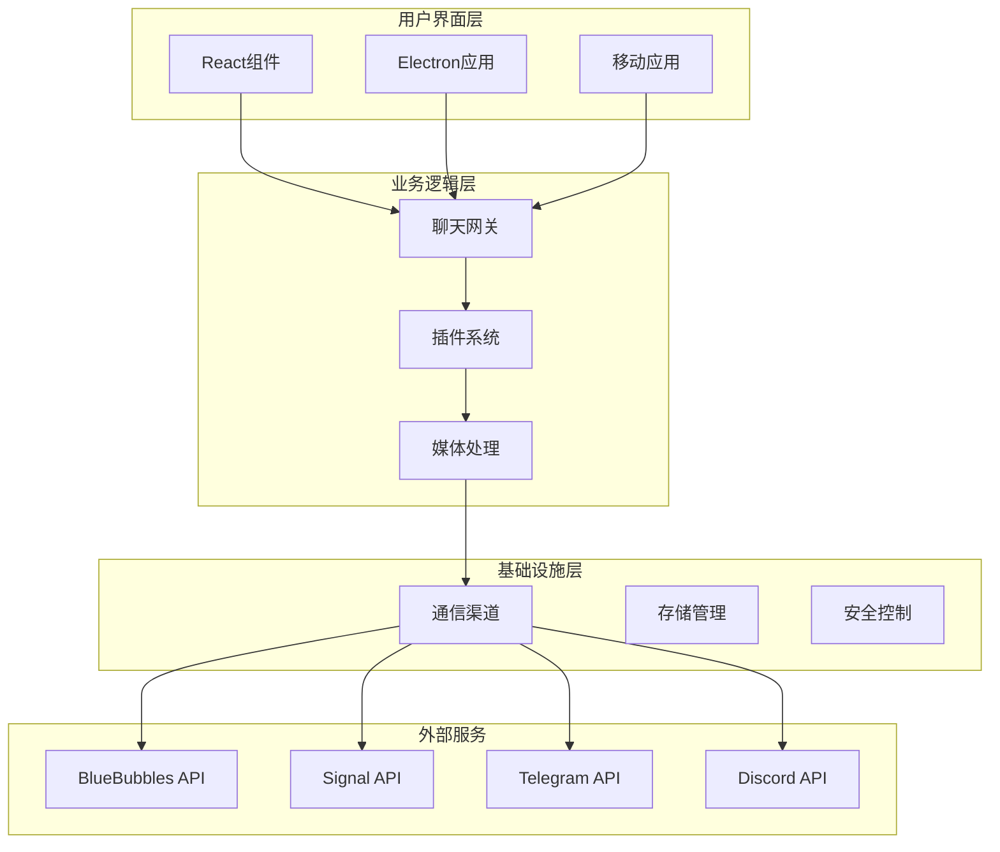
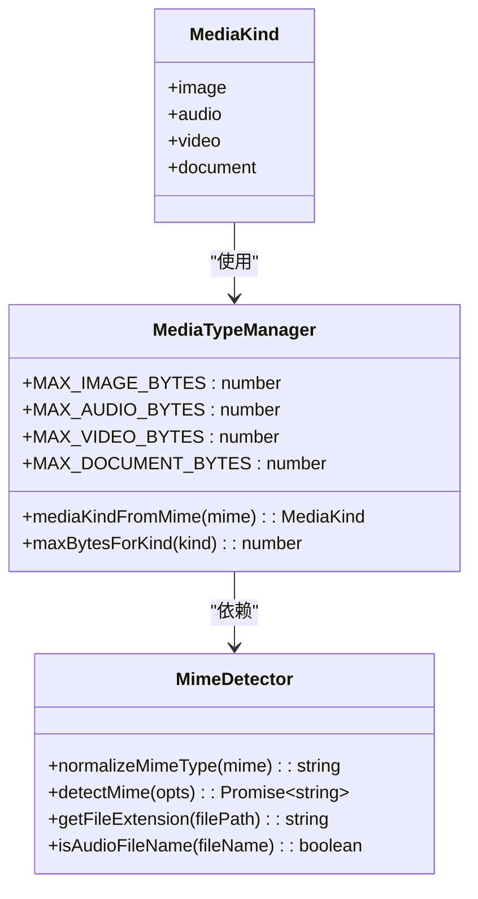
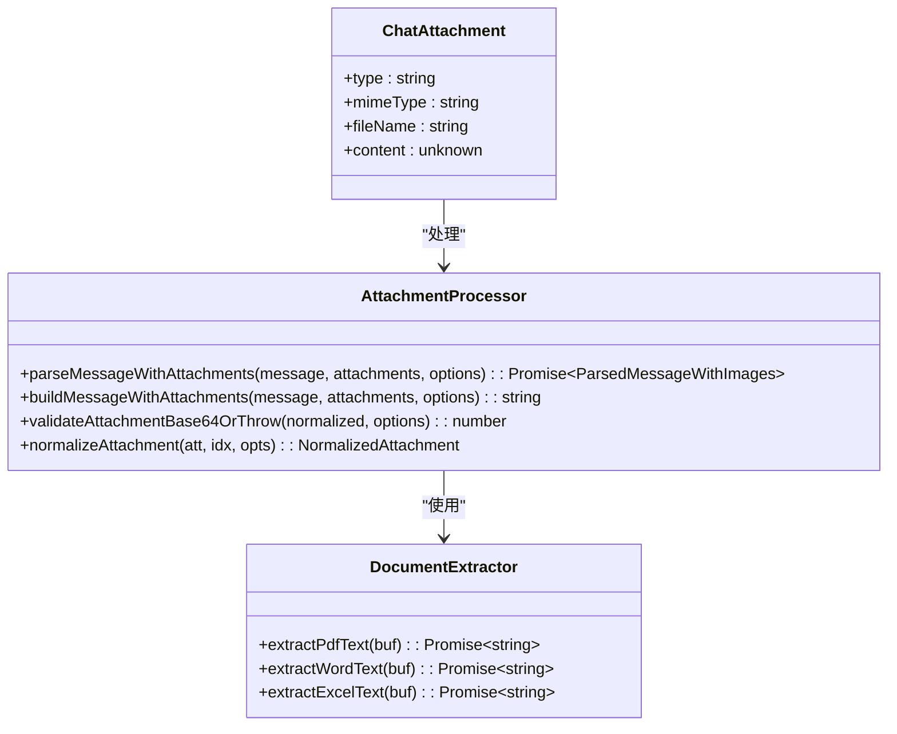
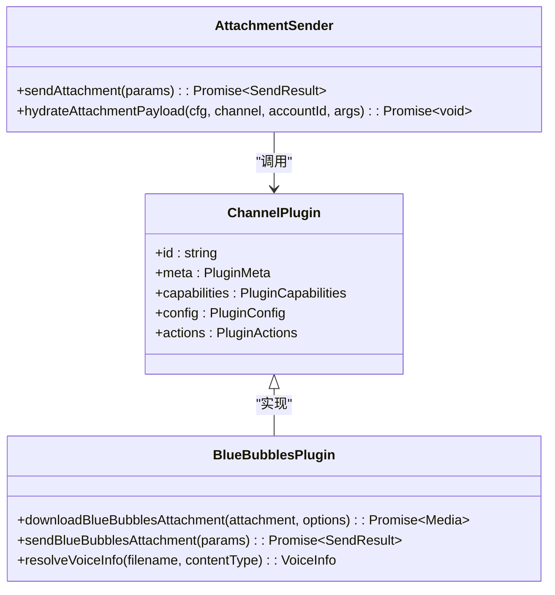
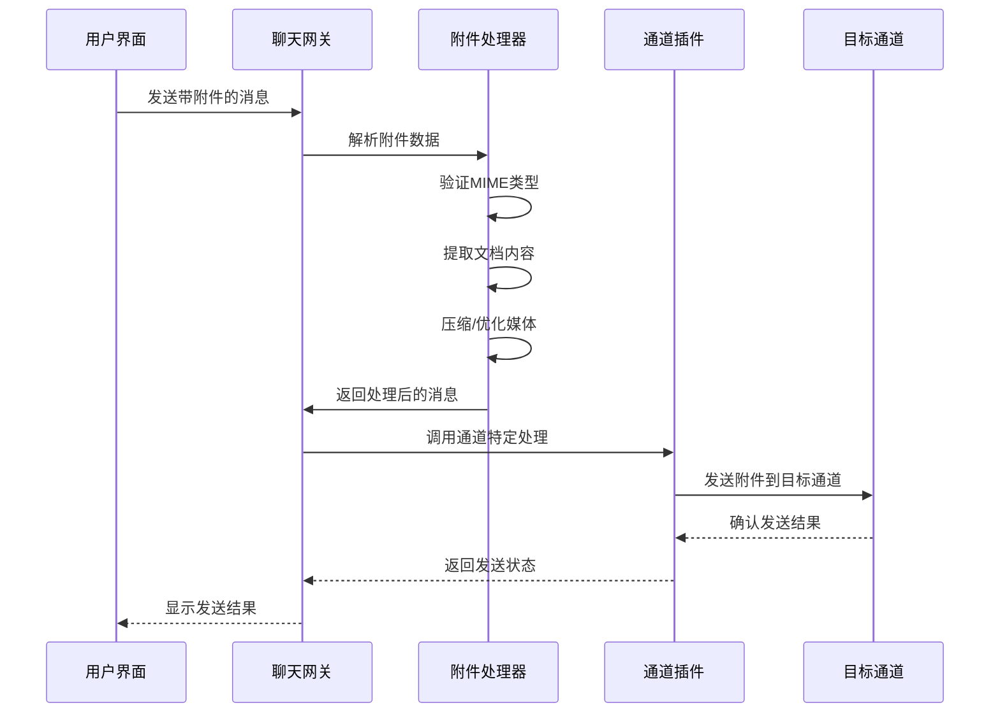
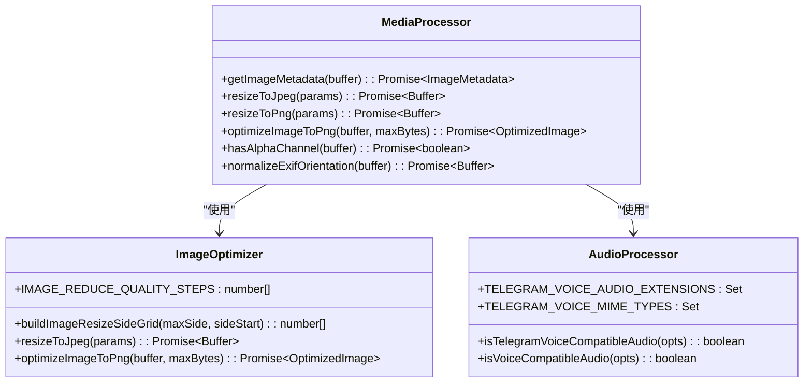
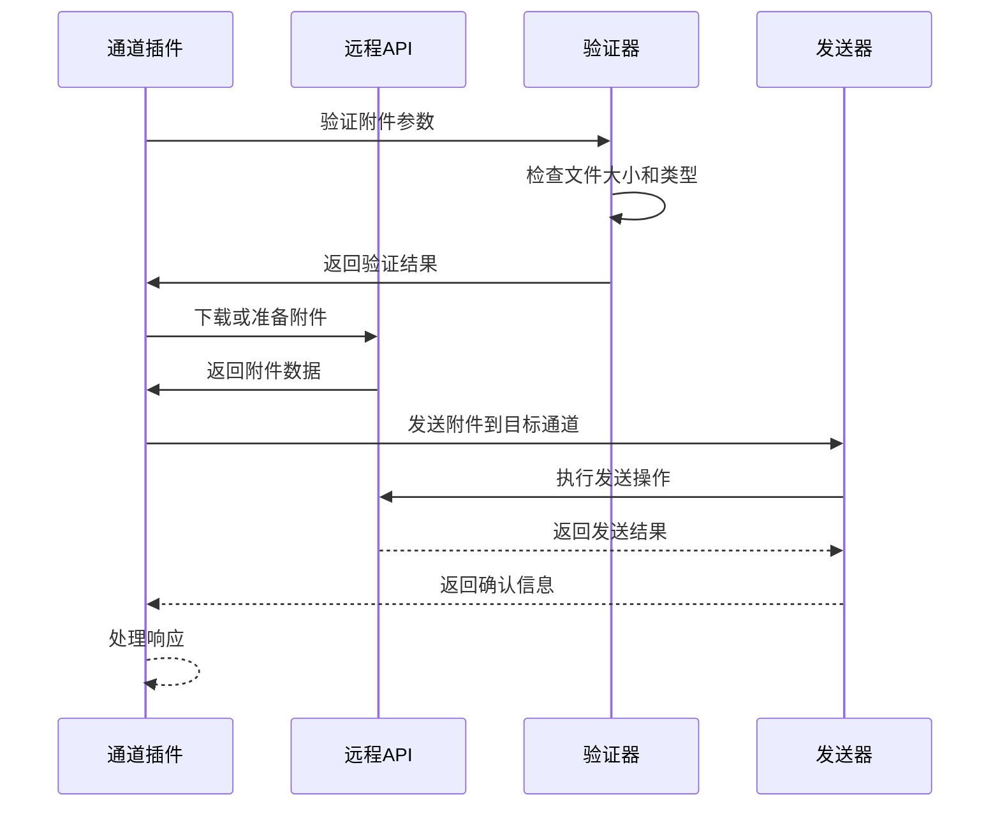
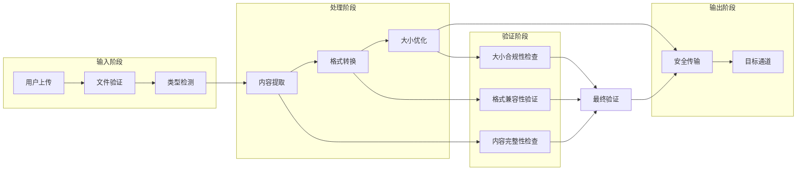
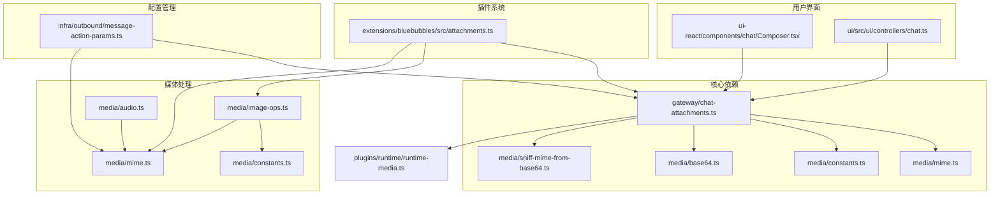

# 聊天附件处理系统

<cite>
**本文档引用的文件**
- [chat-attachments.ts](file://src/gateway/chat-attachments.ts)
- [attachments.ts](file://extensions/bluebubbles/src/attachments.ts)
- [mime.ts](file://src/media/mime.ts)
- [constants.ts](file://src/media/constants.ts)
- [image-ops.ts](file://src/media/image-ops.ts)
- [audio.ts](file://src/media/audio.ts)
- [base64.ts](file://src/media/base64.ts)
- [sniff-mime-from-base64.ts](file://src/media/sniff-mime-from-base64.ts)
- [message-action-params.ts](file://src/infra/outbound/message-action-params.ts)
- [runtime-media.ts](file://src/plugins/runtime/runtime-media.ts)
- [Composer.tsx](file://ui-react/src/components/chat/Composer.tsx)
- [chat.ts](file://ui/src/ui/controllers/chat.ts)
- [chat.ts](file://ui/src/ui/views/chat.ts)
- [monitor-provider.ts](file://src/imessage/monitor/monitor-provider.ts)
- [event-handler.ts](file://src/signal/monitor/event-handler.ts)
- [useChatEventBridge.ts](file://ui-react/src/hooks/useChatEventBridge.ts)
</cite>

## 目录
1. [简介](#简介)
2. [项目结构](#项目结构)
3. [核心组件](#核心组件)
4. [架构概览](#架构概览)
5. [详细组件分析](#详细组件分析)
6. [依赖关系分析](#依赖关系分析)
7. [性能考虑](#性能考虑)
8. [故障排除指南](#故障排除指南)
9. [结论](#结论)

## 简介

聊天附件处理系统是一个完整的多平台消息传递解决方案，专门设计用于处理各种类型的媒体附件（图像、音频、视频、文档等）。该系统支持多种通信渠道，包括iMessage、Signal、Telegram、Discord等，并提供了强大的附件处理能力。

系统的核心功能包括：
- 多格式媒体文件的检测和验证
- 基于MIME类型的智能内容提取
- 图像压缩和优化
- 音频格式兼容性检查
- 安全的文件传输和存储
- 跨平台用户界面集成

## 项目结构

系统采用模块化架构设计，主要分为以下几个核心层次：

**图表来源**
- [chat-attachments.ts:1-342](file://src/gateway/chat-attachments.ts#L1-L342)
- [attachments.ts:1-283](file://extensions/bluebubbles/src/attachments.ts#L1-L283)

**章节来源**
- [chat-attachments.ts:1-342](file://src/gateway/chat-attachments.ts#L1-L342)
- [attachments.ts:1-283](file://extensions/bluebubbles/src/attachments.ts#L1-L283)

## 核心组件

### 媒体类型管理系统

系统使用统一的媒体类型管理机制，支持所有主流媒体格式的识别和处理。

**图表来源**
- [constants.ts:1-47](file://src/media/constants.ts#L1-L47)
- [mime.ts:1-193](file://src/media/mime.ts#L1-L193)

### 附件处理引擎

附件处理引擎是系统的核心组件，负责处理各种类型的媒体文件。

**图表来源**
- [chat-attachments.ts:5-342](file://src/gateway/chat-attachments.ts#L5-L342)

### 插件系统架构

系统通过插件架构支持多种通信渠道的附件处理。

**图表来源**
- [attachments.ts:1-283](file://extensions/bluebubbles/src/attachments.ts#L1-L283)
- [message-action-params.ts:352-373](file://src/infra/outbound/message-action-params.ts#L352-L373)

**章节来源**
- [mime.ts:1-193](file://src/media/mime.ts#L1-L193)
- [constants.ts:1-47](file://src/media/constants.ts#L1-L47)
- [chat-attachments.ts:1-342](file://src/gateway/chat-attachments.ts#L1-L342)
- [attachments.ts:1-283](file://extensions/bluebubbles/src/attachments.ts#L1-L283)

## 架构概览

系统采用分层架构设计，确保了良好的可扩展性和维护性。

**图表来源**
- [chat.ts:152-197](file://ui/src/ui/controllers/chat.ts#L152-L197)
- [chat-attachments.ts:207-302](file://src/gateway/chat-attachments.ts#L207-L302)
- [attachments.ts:141-282](file://extensions/bluebubbles/src/attachments.ts#L141-L282)

系统的关键特性包括：

1. **多格式支持**：支持图像、音频、视频、文档等多种媒体格式
2. **智能检测**：自动检测文件类型并应用相应的处理策略
3. **安全验证**：严格的文件大小和类型验证
4. **跨平台兼容**：支持iOS、Android、macOS、Windows等多个平台
5. **插件架构**：可轻松扩展新的通信渠道

## 详细组件分析

### 用户界面组件

用户界面组件负责处理用户输入的附件并提供预览功能。

**图表来源**
- [Composer.tsx:136-200](file://ui-react/src/components/chat/Composer.tsx#L136-L200)
- [chat.ts:166-205](file://ui/src/ui/views/chat.ts#L166-L205)

**章节来源**
- [Composer.tsx:122-200](file://ui-react/src/components/chat/Composer.tsx#L122-L200)
- [chat.ts:152-197](file://ui/src/ui/controllers/chat.ts#L152-L197)
- [chat.ts:162-211](file://ui/src/ui/views/chat.ts#L162-L211)

### 媒体处理组件

媒体处理组件负责对不同类型的媒体文件进行优化和转换。

**图表来源**
- [image-ops.ts:1-483](file://src/media/image-ops.ts#L1-L483)
- [audio.ts:1-49](file://src/media/audio.ts#L1-L49)

**章节来源**
- [image-ops.ts:1-483](file://src/media/image-ops.ts#L1-L483)
- [audio.ts:1-49](file://src/media/audio.ts#L1-L49)

### 通道集成组件

通道集成组件负责与不同的通信渠道进行交互。

**图表来源**
- [attachments.ts:86-130](file://extensions/bluebubbles/src/attachments.ts#L86-L130)
- [attachments.ts:141-282](file://extensions/bluebubbles/src/attachments.ts#L141-L282)

**章节来源**
- [attachments.ts:1-283](file://extensions/bluebubbles/src/attachments.ts#L1-L283)

### 数据流处理

系统使用复杂的数据流处理机制来确保附件的安全传输。

**图表来源**
- [chat-attachments.ts:207-302](file://src/gateway/chat-attachments.ts#L207-L302)
- [mime.ts:100-146](file://src/media/mime.ts#L100-L146)

**章节来源**
- [chat-attachments.ts:127-302](file://src/gateway/chat-attachments.ts#L127-L302)
- [mime.ts:56-146](file://src/media/mime.ts#L56-L146)

## 依赖关系分析

系统具有清晰的依赖关系结构，确保了模块间的松耦合。

**图表来源**
- [chat-attachments.ts:1-342](file://src/gateway/chat-attachments.ts#L1-L342)
- [mime.ts:1-193](file://src/media/mime.ts#L1-L193)
- [attachments.ts:1-283](file://extensions/bluebubbles/src/attachments.ts#L1-L283)

**章节来源**
- [chat-attachments.ts:1-342](file://src/gateway/chat-attachments.ts#L1-L342)
- [message-action-params.ts:1-425](file://src/infra/outbound/message-action-params.ts#L1-L425)

## 性能考虑

系统在设计时充分考虑了性能优化，采用了多种策略来确保高效的附件处理：

### 缓存策略
- Base64解码前的大小估算避免了不必要的内存分配
- MIME类型检测使用最小化扫描算法
- 图像元数据读取使用临时文件缓存

### 并发处理
- 多文件上传支持并发处理
- 异步文件读取避免阻塞主线程
- 批量操作优化减少I/O开销

### 内存管理
- 流式处理大文件避免内存溢出
- 及时释放临时文件和缓冲区
- 智能垃圾回收策略

## 故障排除指南

### 常见问题及解决方案

**附件上传失败**
- 检查文件大小是否超过限制
- 验证文件格式是否受支持
- 确认网络连接稳定性

**MIME类型识别错误**
- 确保文件头部信息完整
- 检查文件扩展名正确性
- 验证文件完整性

**图像处理异常**
- 检查图像格式兼容性
- 验证图像尺寸合理性
- 确认内存充足

**章节来源**
- [chat-attachments.ts:181-195](file://src/gateway/chat-attachments.ts#L181-L195)
- [mime.ts:116-146](file://src/media/mime.ts#L116-L146)

## 结论

聊天附件处理系统是一个功能强大、架构清晰的多平台消息传递解决方案。系统通过模块化设计实现了高度的可扩展性和维护性，同时提供了优秀的用户体验。

### 主要优势
- **全面的媒体支持**：支持所有主流媒体格式的处理
- **强大的插件架构**：可轻松集成新的通信渠道
- **严格的安全控制**：多层次的安全验证机制
- **优秀的性能表现**：优化的内存管理和并发处理
- **跨平台兼容**：统一的API接口支持多平台部署

### 技术特色
- 基于MIME类型的智能内容提取
- 自适应的图像压缩和优化
- 安全的文件传输和存储机制
- 实时的进度监控和状态反馈

该系统为现代聊天应用提供了坚实的基础设施，能够满足各种复杂的附件处理需求。