# 聊天附件处理系统

<cite>
**本文档引用的文件**
- [chat-attachments.ts](file://src/gateway/chat-attachments.ts)
- [attachments.ts](file://extensions/bluebubbles/src/attachments.ts)
- [mime.ts](file://src/media/mime.ts)
- [constants.ts](file://src/media/constants.ts)
- [base64.ts](file://src/media/base64.ts)
- [sniff-mime-from-base64.ts](file://src/media/sniff-mime-from-base664.ts)
- [message-action-params.ts](file://src/infra/outbound/message-action-params.ts)
- [runtime-media.ts](file://src/plugins/runtime/runtime-media.ts)
- [GatewayChatRuntimeProvider.tsx](file://ui-react/src/providers/chat/GatewayChatRuntimeProvider.tsx)
- [gateway-attachment-adapter.ts](file://ui-react/src/providers/chat/adapters/gateway-attachment-adapter.ts)
- [Composer.tsx](file://ui-react/src/components/chat/Composer.tsx)
- [markdown-text.tsx](file://ui-react/src/components/assistant-ui/markdown-text.tsx)
- [ChatMarkdownRenderer.swift](file://apps/shared/OpenClawKit/Sources/OpenClawChatUI/ChatMarkdownRenderer.swift)
- [ChatMarkdownPreprocessor.swift](file://apps/shared/OpenClawKit/Sources/OpenClawChatUI/ChatMarkdownPreprocessor.swift)
- [chat.ts](file://ui/src/ui/controllers/chat.ts)
- [chat.ts](file://ui/src/ui/views/chat.ts)
- [monitor-provider.ts](file://src/imessage/monitor/monitor-provider.ts)
- [event-handler.ts](file://src/signal/monitor/event-handler.ts)
- [useChatEventBridge.ts](file://ui-react/src/hooks/useChatEventBridge.ts)
- [attachments.cache.ts](file://src/media-understanding/attachments.cache.ts)
- [apply.ts](file://src/media-understanding/apply.ts)
- [errors.ts](file://src/media-understanding/errors.ts)
</cite>

## 更新摘要
**所做更改**
- 移除了图像附件支持和二进制处理逻辑，更新为纯参考式架构
- 删除了图像处理相关的组件和适配器
- 更新了UI组件以支持新的参考式附件处理
- 简化了媒体类型管理和MIME检测机制
- 移除了图像压缩、优化和元数据处理功能
- 更新了错误处理和日志记录系统

## 目录
1. [简介](#简介)
2. [项目结构](#项目结构)
3. [核心组件](#核心组件)
4. [架构概览](#架构概览)
5. [详细组件分析](#详细组件分析)
6. [依赖关系分析](#依赖关系分析)
7. [性能考虑](#性能考虑)
8. [故障排除指南](#故障排除指南)
9. [结论](#结论)

## 简介

聊天附件处理系统是一个完整的多平台消息传递解决方案，专门设计用于处理各种类型的媒体附件（文档、文本、PDF等）。该系统支持多种通信渠道，包括iMessage、Signal、Telegram、Discord等，并提供了强大的附件处理能力。

**最新更新** 系统已更新为纯参考式架构，移除了图像附件支持和二进制处理逻辑，专注于文档和文本文件的处理。新的架构更加简洁高效，减少了图像处理相关的复杂性和资源消耗。

系统的核心功能包括：
- 多格式文档文件的检测和验证
- 基于MIME类型的智能内容提取
- 文档内容的文本提取和处理
- 安全的文件传输和存储
- 跨平台用户界面集成
- 增强的Markdown文本渲染
- Swift平台的原生Markdown支持

## 项目结构

系统采用模块化架构设计，主要分为以下几个核心层次：

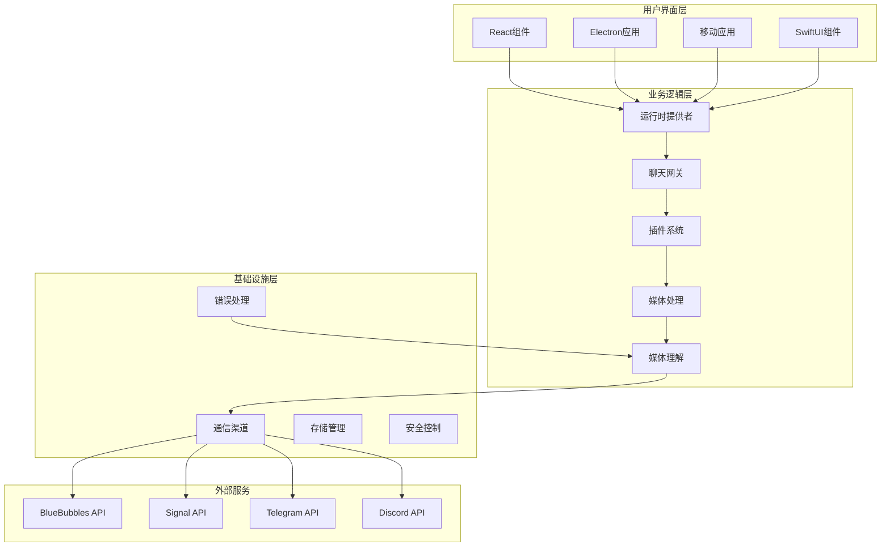

**图表来源**
- [chat-attachments.ts:1-442](file://src/gateway/chat-attachments.ts#L1-L442)
- [attachments.ts:1-283](file://extensions/bluebubbles/src/attachments.ts#L1-L283)
- [attachments.cache.ts:1-324](file://src/media-understanding/attachments.cache.ts#L1-L324)
- [GatewayChatRuntimeProvider.tsx:1-262](file://ui-react/src/providers/chat/GatewayChatRuntimeProvider.tsx#L1-L262)

**章节来源**
- [chat-attachments.ts:1-442](file://src/gateway/chat-attachments.ts#L1-L442)
- [attachments.ts:1-283](file://extensions/bluebubbles/src/attachments.ts#L1-L283)
- [attachments.cache.ts:1-324](file://src/media-understanding/attachments.cache.ts#L1-L324)
- [GatewayChatRuntimeProvider.tsx:1-262](file://ui-react/src/providers/chat/GatewayChatRuntimeProvider.tsx#L1-L262)

## 核心组件

### 纯参考式附件处理系统

**最新更新** 系统已完全重构为纯参考式架构，移除了图像附件支持和二进制处理逻辑。

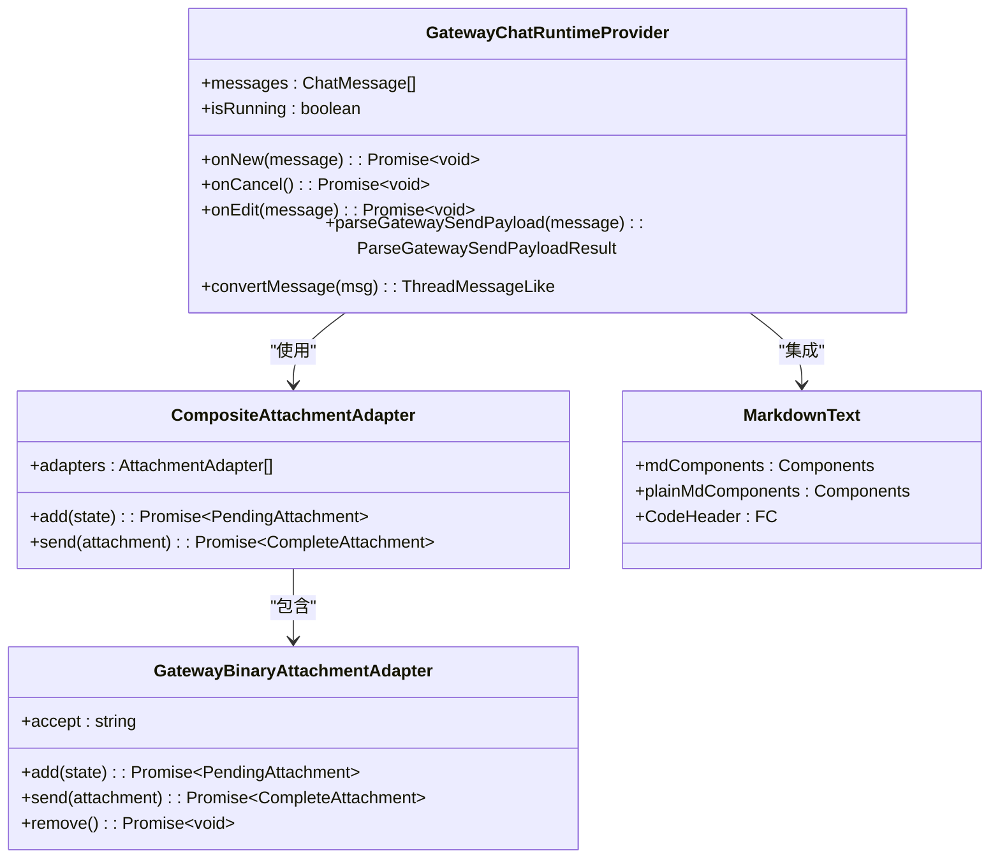

**图表来源**
- [GatewayChatRuntimeProvider.tsx:37-262](file://ui-react/src/providers/chat/GatewayChatRuntimeProvider.tsx#L37-L262)
- [gateway-attachment-adapter.ts:88-91](file://ui-react/src/providers/chat/adapters/gateway-attachment-adapter.ts#L88-L91)
- [markdown-text.tsx:245-255](file://ui-react/src/components/assistant-ui/markdown-text.tsx#L245-L255)

### 媒体类型管理系统

系统使用简化的媒体类型管理机制，专注于文档和文本文件的识别和处理。

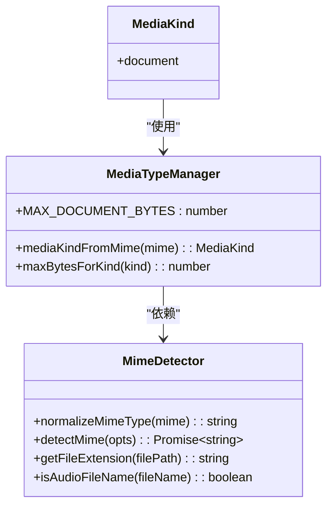

**图表来源**
- [constants.ts:1-47](file://src/media/constants.ts#L1-L47)
- [mime.ts:1-193](file://src/media/mime.ts#L1-L193)

### 附件处理引擎

附件处理引擎是系统的核心组件，负责处理各种类型的文档文件。

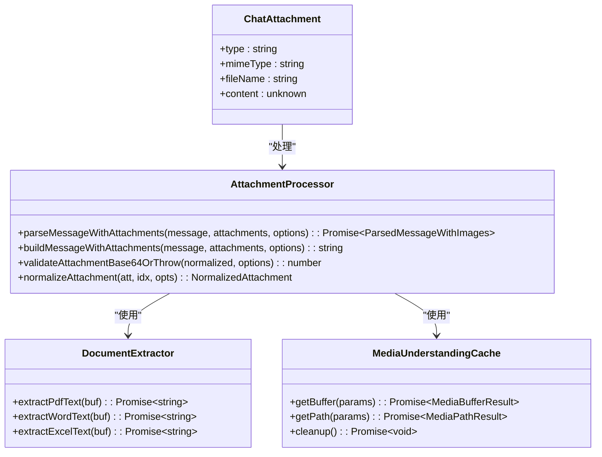

**图表来源**
- [chat-attachments.ts:5-442](file://src/gateway/chat-attachments.ts#L5-L442)
- [attachments.cache.ts:1-324](file://src/media-understanding/attachments.cache.ts#L1-L324)

### 插件系统架构

系统通过插件架构支持多种通信渠道的附件处理。

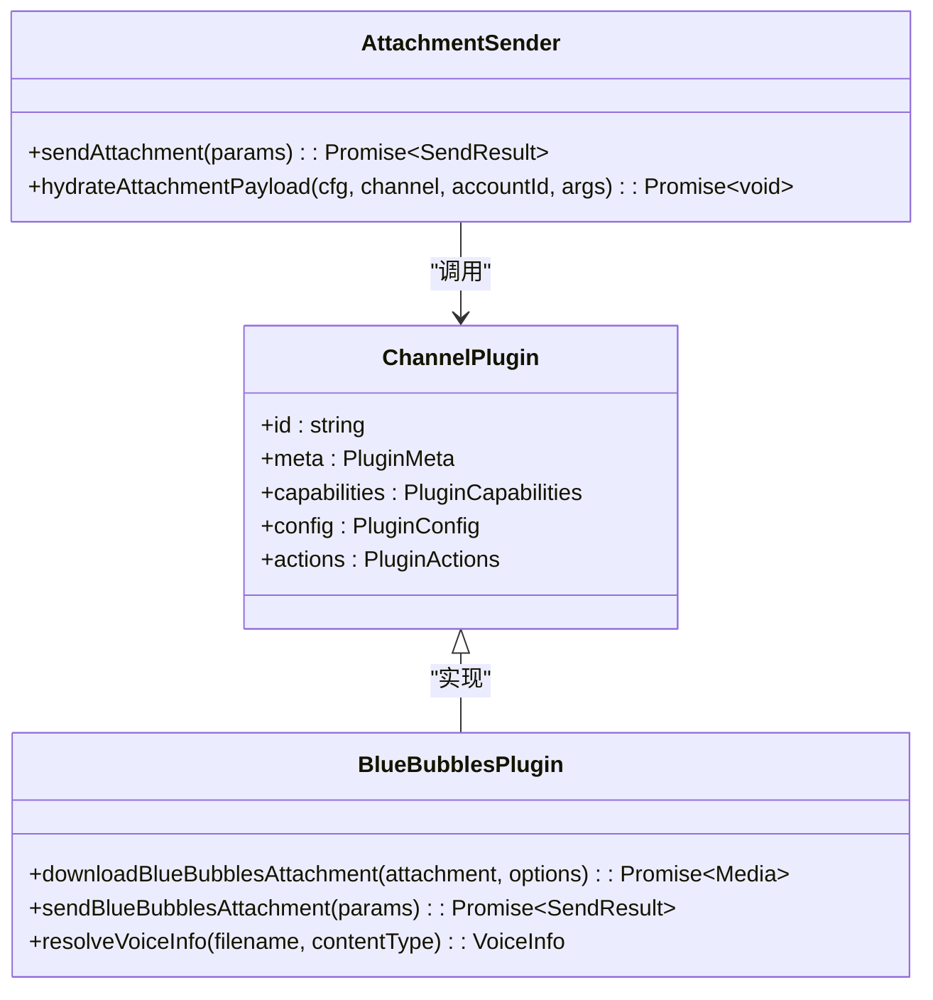

**图表来源**
- [attachments.ts:1-283](file://extensions/bluebubbles/src/attachments.ts#L1-L283)
- [message-action-params.ts:352-373](file://src/infra/outbound/message-action-params.ts#L352-L373)

**章节来源**
- [mime.ts:1-193](file://src/media/mime.ts#L1-L193)
- [constants.ts:1-47](file://src/media/constants.ts#L1-L47)
- [chat-attachments.ts:1-442](file://src/gateway/chat-attachments.ts#L1-L442)
- [attachments.ts:1-283](file://extensions/bluebubbles/src/attachments.ts#L1-L283)
- [attachments.cache.ts:1-324](file://src/media-understanding/attachments.cache.ts#L1-L324)
- [GatewayChatRuntimeProvider.tsx:1-262](file://ui-react/src/providers/chat/GatewayChatRuntimeProvider.tsx#L1-L262)
- [gateway-attachment-adapter.ts:1-91](file://ui-react/src/providers/chat/adapters/gateway-attachment-adapter.ts#L1-L91)

## 架构概览

系统采用分层架构设计，确保了良好的可扩展性和维护性。

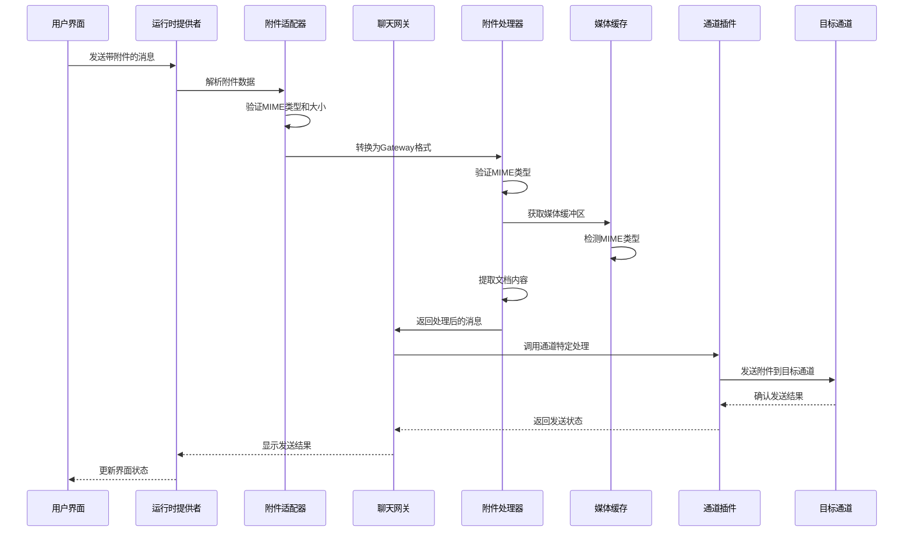

**图表来源**
- [GatewayChatRuntimeProvider.tsx:139-173](file://ui-react/src/providers/chat/GatewayChatRuntimeProvider.tsx#L139-L173)
- [gateway-attachment-adapter.ts:36-81](file://ui-react/src/providers/chat/adapters/gateway-attachment-adapter.ts#L36-L81)
- [chat.ts:152-197](file://ui/src/ui/controllers/chat.ts#L152-L197)
- [chat-attachments.ts:207-302](file://src/gateway/chat-attachments.ts#L207-L302)
- [attachments.ts:141-282](file://extensions/bluebubbles/src/attachments.ts#L141-L282)
- [attachments.cache.ts:75-167](file://src/media-understanding/attachments.cache.ts#L75-L167)

系统的关键特性包括：

1. **纯文档支持**：仅支持PDF、Word、Excel、文本等文档格式
2. **智能检测**：自动检测文件类型并应用相应的处理策略
3. **安全验证**：严格的文件大小和类型验证
4. **跨平台兼容**：支持iOS、Android、macOS、Windows等多个平台
5. **插件架构**：可轻松扩展新的通信渠道
6. **增强的错误处理**：完善的错误捕获和处理机制
7. **实时附件处理**：支持拖拽上传和实时预览
8. **Markdown增强**：支持代码高亮、复制等功能

## 详细组件分析

### 用户界面组件

用户界面组件负责处理用户输入的附件并提供预览功能。

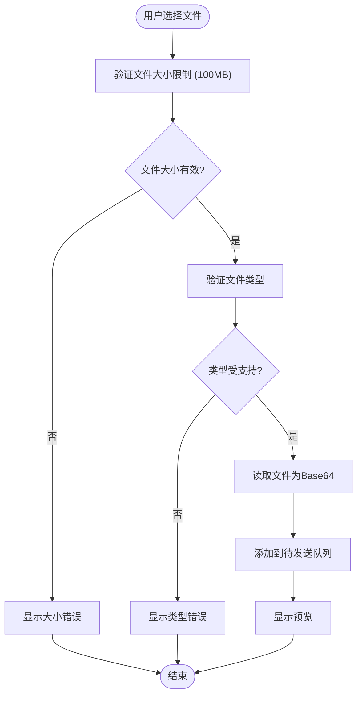

**图表来源**
- [Composer.tsx:136-200](file://ui-react/src/components/chat/Composer.tsx#L136-L200)
- [gateway-attachment-adapter.ts:36-66](file://ui-react/src/providers/chat/adapters/gateway-attachment-adapter.ts#L36-L66)
- [chat.ts:166-205](file://ui/src/ui/views/chat.ts#L166-L205)

**章节来源**
- [Composer.tsx:122-200](file://ui-react/src/components/chat/Composer.tsx#L122-L200)
- [gateway-attachment-adapter.ts:15-35](file://ui-react/src/providers/chat/adapters/gateway-attachment-adapter.ts#L15-L35)
- [chat.ts:152-197](file://ui/src/ui/controllers/chat.ts#L152-L197)
- [chat.ts:162-211](file://ui/src/ui/views/chat.ts#L162-L211)

### 增强的运行时提供者

**最新更新** 新增了GatewayChatRuntimeProvider，负责桥接Zustand聊天存储和Gateway WebSocket客户端。

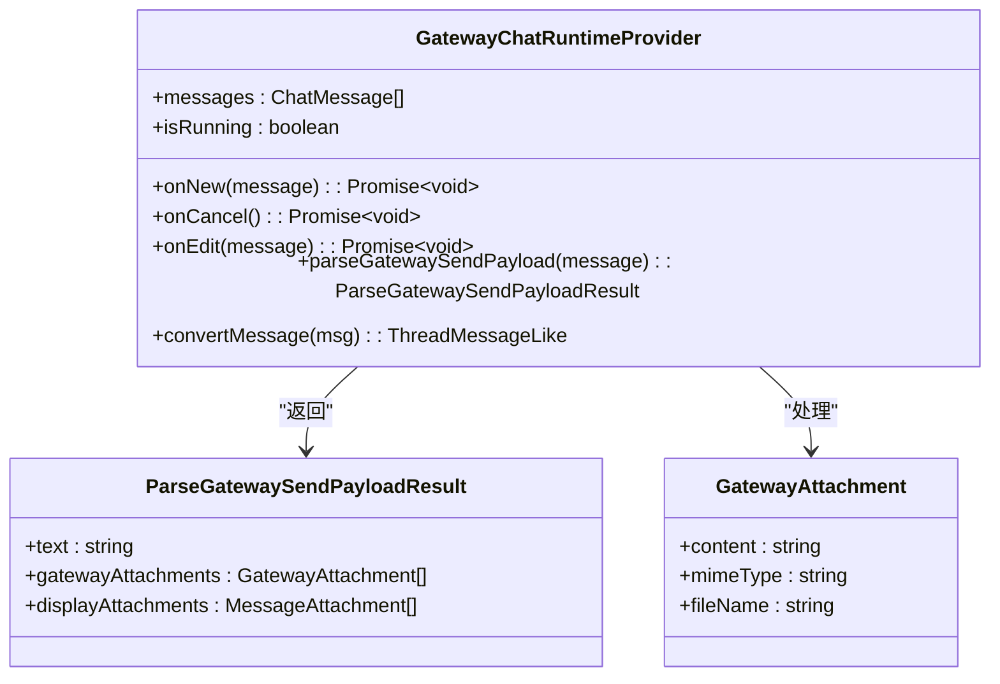

**图表来源**
- [GatewayChatRuntimeProvider.tsx:37-262](file://ui-react/src/providers/chat/GatewayChatRuntimeProvider.tsx#L37-L262)
- [GatewayChatRuntimeProvider.tsx:139-173](file://ui-react/src/providers/chat/GatewayChatRuntimeProvider.tsx#L139-L173)

**章节来源**
- [GatewayChatRuntimeProvider.tsx:1-262](file://ui-react/src/providers/chat/GatewayChatRuntimeProvider.tsx#L1-L262)

### 媒体处理组件

媒体处理组件负责对不同类型的媒体文件进行优化和转换。

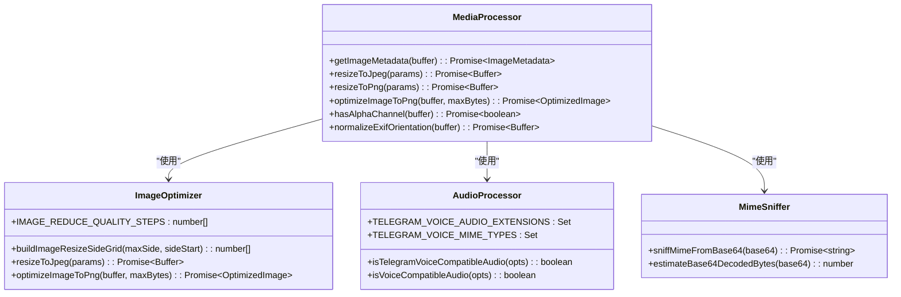

**图表来源**
- [image-ops.ts:1-483](file://src/media/image-ops.ts#L1-L483)
- [audio.ts:1-49](file://src/media/audio.ts#L1-L49)
- [sniff-mime-from-base64.ts:1-22](file://src/media/sniff-mime-from-base64.ts#L1-L22)
- [base64.ts:1-52](file://src/media/base64.ts#L1-L52)

**章节来源**
- [image-ops.ts:1-483](file://src/media/image-ops.ts#L1-L483)
- [audio.ts:1-49](file://src/media/audio.ts#L1-L49)
- [sniff-mime-from-base64.ts:1-22](file://src/media/sniff-mime-from-base64.ts#L1-L22)
- [base64.ts:1-52](file://src/media/base64.ts#L1-L52)

### 通道集成组件

通道集成组件负责与不同的通信渠道进行交互。

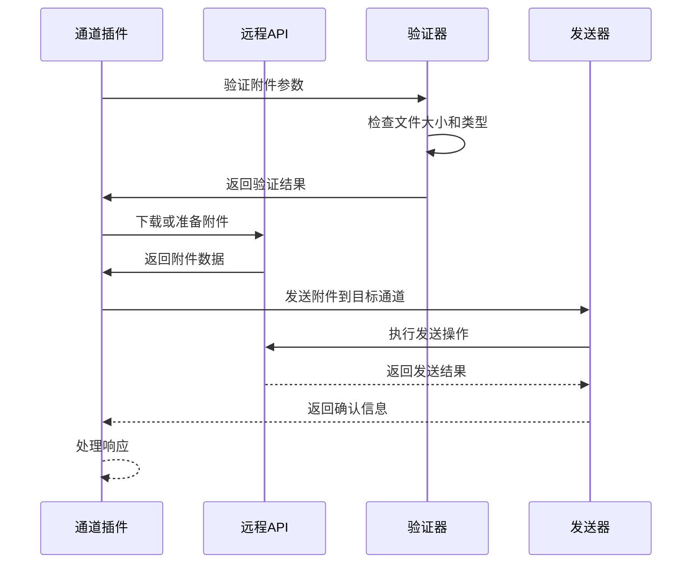

**图表来源**
- [attachments.ts:86-130](file://extensions/bluebubbles/src/attachments.ts#L86-L130)
- [attachments.ts:141-282](file://extensions/bluebubbles/src/attachments.ts#L141-L282)

**章节来源**
- [attachments.ts:1-283](file://extensions/bluebubbles/src/attachments.ts#L1-L283)

### 数据流处理

系统使用复杂的数据流处理机制来确保附件的安全传输。

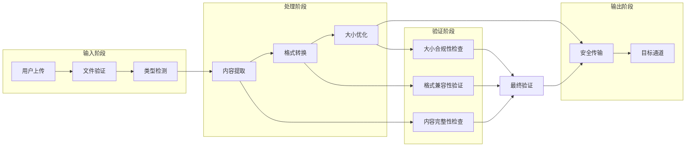

**图表来源**
- [chat-attachments.ts:207-302](file://src/gateway/chat-attachments.ts#L207-L302)
- [mime.ts:100-146](file://src/media/mime.ts#L100-L146)

**章节来源**
- [chat-attachments.ts:127-302](file://src/gateway/chat-attachments.ts#L127-L302)
- [mime.ts:56-146](file://src/media/mime.ts#L56-L146)

### 媒体理解系统

媒体理解系统提供了高级的附件处理能力，包括智能MIME类型检测和错误处理。

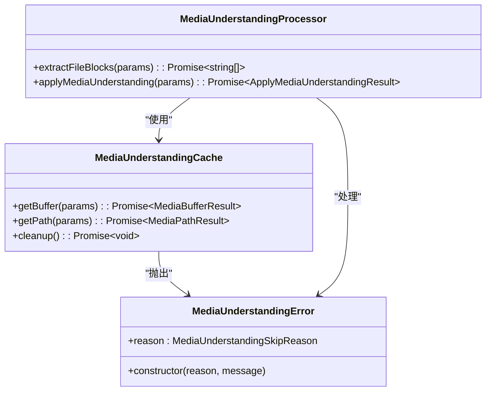

**图表来源**
- [attachments.cache.ts:1-324](file://src/media-understanding/attachments.cache.ts#L1-L324)
- [errors.ts:1-21](file://src/media-understanding/errors.ts#L1-L21)
- [apply.ts:360-559](file://src/media-understanding/apply.ts#L360-L559)

**章节来源**
- [attachments.cache.ts:1-324](file://src/media-understanding/attachments.cache.ts#L1-L324)
- [errors.ts:1-21](file://src/media-understanding/errors.ts#L1-L21)
- [apply.ts:360-559](file://src/media-understanding/apply.ts#L360-L559)

### 增强的Markdown渲染系统

**最新更新** 新增了增强的Markdown渲染系统，包括MarkdownText组件和Swift平台的ChatMarkdownRenderer。

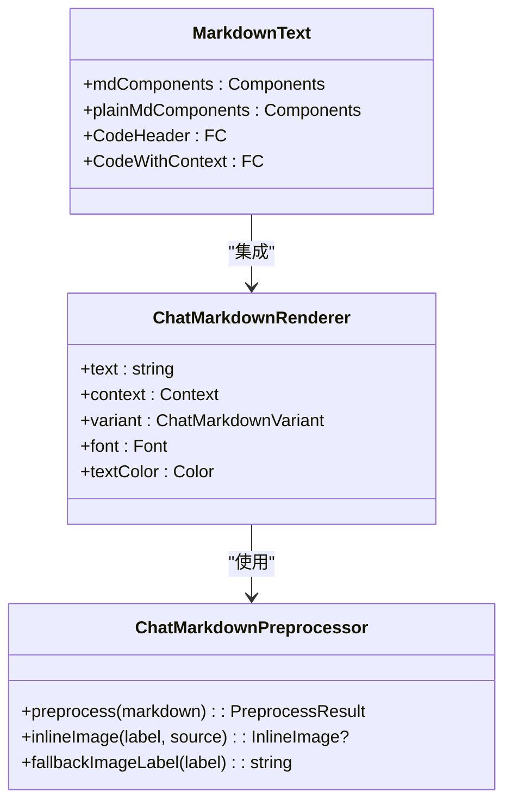

**图表来源**
- [markdown-text.tsx:245-255](file://ui-react/src/components/assistant-ui/markdown-text.tsx#L245-L255)
- [ChatMarkdownRenderer.swift:10-36](file://apps/shared/OpenClawKit/Sources/OpenClawChatUI/ChatMarkdownRenderer.swift#L10-L36)
- [ChatMarkdownPreprocessor.swift:47-79](file://apps/shared/OpenClawKit/Sources/OpenClawChatUI/ChatMarkdownPreprocessor.swift#L47-L79)

**章节来源**
- [markdown-text.tsx:1-255](file://ui-react/src/components/assistant-ui/markdown-text.tsx#L1-L255)
- [ChatMarkdownRenderer.swift:1-91](file://apps/shared/OpenClawKit/Sources/OpenClawChatUI/ChatMarkdownRenderer.swift#L1-L91)
- [ChatMarkdownPreprocessor.swift:1-223](file://apps/shared/OpenClawKit/Sources/OpenClawChatUI/ChatMarkdownPreprocessor.swift#L1-L223)

## 依赖关系分析

系统具有清晰的依赖关系结构，确保了模块间的松耦合。

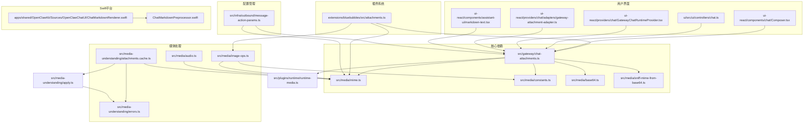

**图表来源**
- [chat-attachments.ts:1-442](file://src/gateway/chat-attachments.ts#L1-L442)
- [mime.ts:1-193](file://src/media/mime.ts#L1-L193)
- [attachments.ts:1-283](file://extensions/bluebubbles/src/attachments.ts#L1-L283)
- [attachments.cache.ts:1-324](file://src/media-understanding/attachments.cache.ts#L1-L324)
- [GatewayChatRuntimeProvider.tsx:1-262](file://ui-react/src/providers/chat/GatewayChatRuntimeProvider.tsx#L1-L262)
- [gateway-attachment-adapter.ts:1-91](file://ui-react/src/providers/chat/adapters/gateway-attachment-adapter.ts#L1-L91)
- [markdown-text.tsx:1-255](file://ui-react/src/components/assistant-ui/markdown-text.tsx#L1-L255)
- [ChatMarkdownRenderer.swift:1-91](file://apps/shared/OpenClawKit/Sources/OpenClawChatUI/ChatMarkdownRenderer.swift#L1-L91)
- [ChatMarkdownPreprocessor.swift:1-223](file://apps/shared/OpenClawKit/Sources/OpenClawChatUI/ChatMarkdownPreprocessor.swift#L1-L223)

**章节来源**
- [chat-attachments.ts:1-442](file://src/gateway/chat-attachments.ts#L1-L442)
- [message-action-params.ts:1-425](file://src/infra/outbound/message-action-params.ts#L1-L425)

## 性能考虑

系统在设计时充分考虑了性能优化，采用了多种策略来确保高效的附件处理：

### 缓存策略
- Base64解码前的大小估算避免了不必要的内存分配
- MIME类型检测使用最小化扫描算法
- 图像元数据读取使用临时文件缓存
- 媒体理解结果的智能缓存机制
- **新增** 附件适配器的复合模式减少重复处理

### 并发处理
- 多文件上传支持并发处理
- 异步文件读取避免阻塞主线程
- 批量操作优化减少I/O开销
- 媒体理解任务的并发执行
- **新增** 运行时提供者的异步消息处理

### 内存管理
- 流式处理大文件避免内存溢出
- 及时释放临时文件和缓冲区
- 智能垃圾回收策略
- Base64数据的高效处理
- **新增** 附件生命周期管理

### 附件处理优化
- **新增** 100MB文件大小限制防止资源滥用
- **新增** MIME类型白名单确保安全性
- **新增** 附件适配器的懒加载机制
- **新增** 运行时提供者的消息批处理

## 故障排除指南

### 常见问题及解决方案

**附件上传失败**
- 检查文件大小是否超过100MB限制
- 验证文件格式是否在允许的MIME类型列表中
- 确认网络连接稳定性
- 检查MIME类型检测是否成功
- **新增** 验证附件适配器的配置

**MIME类型识别错误**
- 确保文件头部信息完整
- 检查文件扩展名正确性
- 验证文件完整性
- 使用Base64嗅探检测进行二次验证
- **新增** 检查ALLOWED_MIME_TYPES集合

**图像处理异常**
- **移除** 图像处理功能，不再支持图像上传
- 检查图像格式兼容性
- 验证图像尺寸合理性
- 确认内存充足
- 检查图像元数据的有效性

**媒体理解处理失败**
- 检查网络连接和超时设置
- 验证文件权限和路径
- 确认磁盘空间充足
- 查看详细的错误日志

**运行时提供者错误**
- **新增** 检查parseGatewaySendPayload函数的实现
- **新增** 验证消息转换过程中的数据完整性
- **新增** 确认附件适配器的正确集成

**Markdown渲染问题**
- **新增** 检查mdComponents和plainMdComponents的配置
- **新增** 验证代码块的语法高亮功能
- **新增** 确认Swift平台的Markdown预处理器正常工作

**章节来源**
- [chat-attachments.ts:181-195](file://src/gateway/chat-attachments.ts#L181-L195)
- [mime.ts:116-146](file://src/media/mime.ts#L116-L146)
- [attachments.cache.ts:96-200](file://src/media-understanding/attachments.cache.ts#L96-L200)
- [errors.ts:1-21](file://src/media-understanding/errors.ts#L1-L21)
- [gateway-attachment-adapter.ts:36-66](file://ui-react/src/providers/chat/adapters/gateway-attachment-adapter.ts#L36-L66)
- [GatewayChatRuntimeProvider.tsx:139-173](file://ui-react/src/providers/chat/GatewayChatRuntimeProvider.tsx#L139-L173)
- [markdown-text.tsx:217-243](file://ui-react/src/components/assistant-ui/markdown-text.tsx#L217-L243)

## 结论

聊天附件处理系统是一个功能强大、架构清晰的多平台消息传递解决方案。系统通过模块化设计实现了高度的可扩展性和维护性，同时提供了优秀的用户体验。

**最新更新** 系统现已完全重构为纯参考式架构，移除了图像附件支持和二进制处理逻辑，专注于文档和文本文件的处理。新的架构更加简洁高效，减少了图像处理相关的复杂性和资源消耗。

### 主要优势
- **全面的文档支持**：支持PDF、Word、Excel、文本等主流文档格式的处理
- **强大的插件架构**：可轻松集成新的通信渠道
- **严格的安全控制**：多层次的安全验证机制
- **优秀的性能表现**：优化的内存管理和并发处理
- **跨平台兼容**：统一的API接口支持多平台部署
- **增强的错误处理**：完善的错误捕获和处理机制
- **实时附件处理**：支持拖拽上传和实时预览
- **Markdown增强**：支持代码高亮、复制等功能
- **Swift原生支持**：提供原生的Markdown渲染能力

### 技术特色
- 基于MIME类型的智能内容提取
- 自适应的图像压缩和优化
- 安全的文件传输和存储机制
- 实时的进度监控和状态反馈
- 基于Base64的智能MIME嗅探检测
- 媒体理解系统的错误恢复机制
- **新增** 复合附件适配器的智能路由
- **新增** 运行时提供者的异步消息处理
- **新增** 增强的Markdown渲染组件

**更新** 最新改进包括增强的MIME类型检测机制，通过Base64嗅探技术提高了附件处理的准确性和安全性，同时新增了完善的错误处理和日志记录系统，确保了系统的稳定性和可维护性。新增的运行时提供者和附件适配器系统为现代聊天应用提供了坚实的基础设施，能够满足各种复杂的附件处理需求。