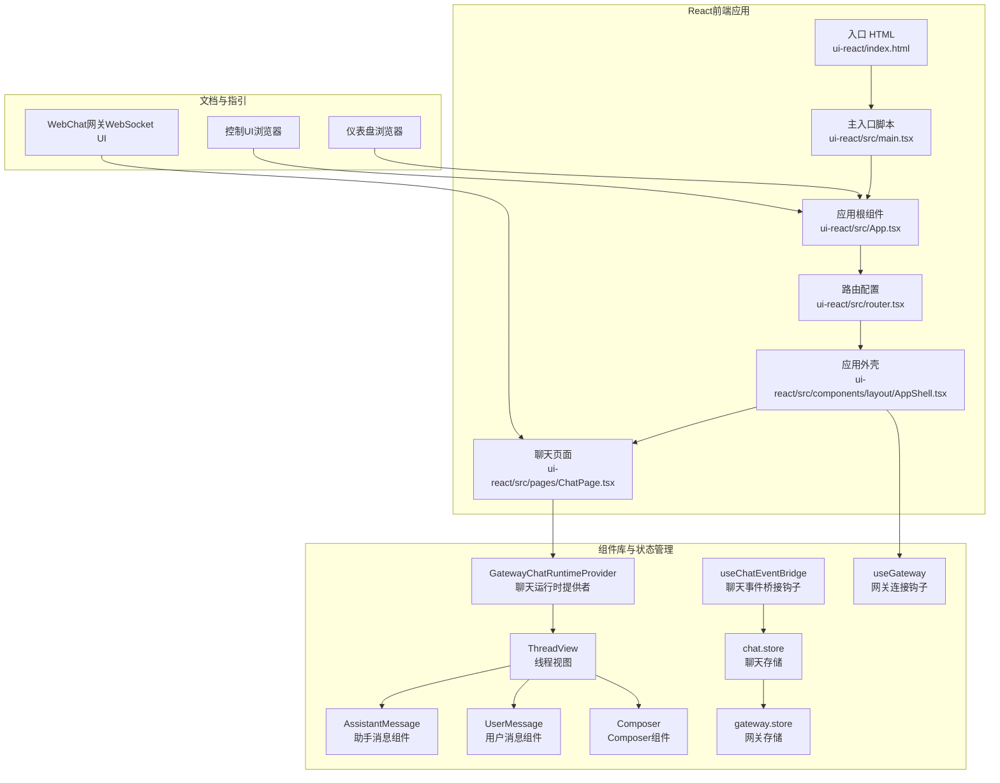
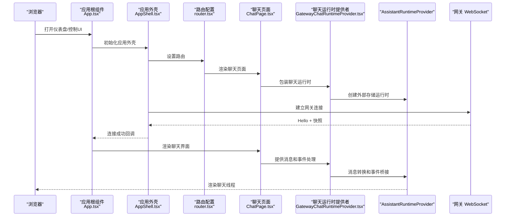
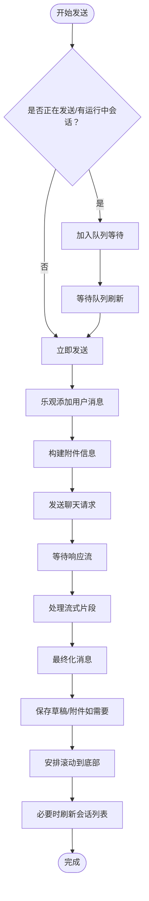
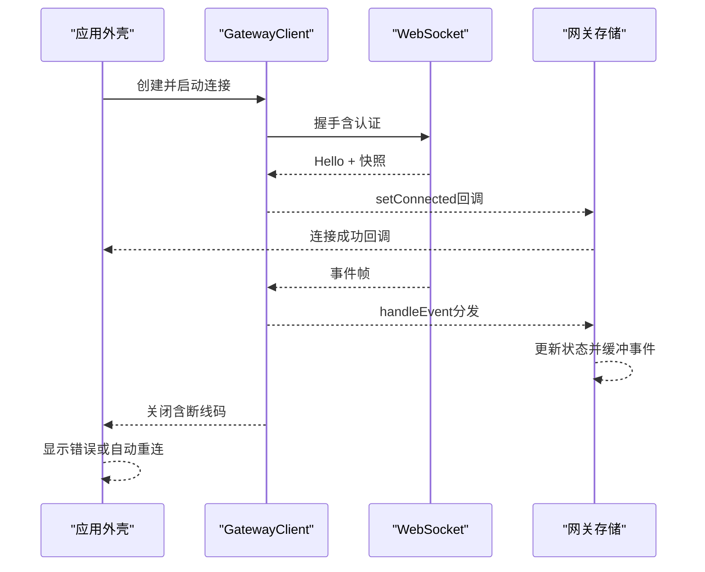
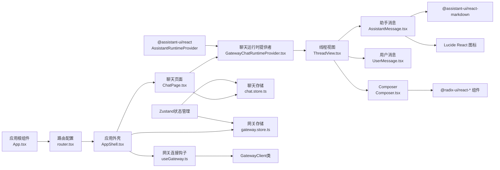

# Web界面

<cite>
**本文引用的文件**
- [控制UI（浏览器）](file://docs/web/control-ui.md)
- [仪表盘（浏览器）](file://docs/web/dashboard.md)
- [WebChat（网关WebSocket UI）](file://docs/web/webchat.md)
- [React前端入口](file://ui-react/src/main.tsx)
- [应用根组件](file://ui-react/src/App.tsx)
- [路由配置](file://ui-react/src/router.tsx)
- [应用外壳](file://ui-react/src/components/layout/AppShell.tsx)
- [聊天页面](file://ui-react/src/pages/ChatPage.tsx)
- [聊天运行时提供者](file://ui-react/src/components/chat/GatewayChatRuntimeProvider.tsx)
- [线程视图](file://ui-react/src/components/chat/ThreadView.tsx)
- [助手消息组件](file://ui-react/src/components/chat/AssistantMessage.tsx)
- [用户消息组件](file://ui-react/src/components/chat/UserMessage.tsx)
- [Composer组件](file://ui-react/src/components/chat/Composer.tsx)
- [聊天事件桥接钩子](file://ui-react/src/hooks/useChatEventBridge.ts)
- [聊天存储](file://ui-react/src/store/chat.store.ts)
- [网关存储](file://ui-react/src/store/gateway.store.ts)
- [网关连接钩子](file://ui-react/src/hooks/useGateway.ts)
- [Vite构建配置](file://ui-react/vite.config.ts)
- [UI包依赖定义](file://ui-react/package.json)
</cite>

## 目录

1. [简介](#简介)
2. [项目结构](#项目结构)
3. [核心组件](#核心组件)
4. [架构总览](#架构总览)
5. [详细组件分析](#详细组件分析)
6. [依赖关系分析](#依赖关系分析)
7. [性能考量](#性能考量)
8. [故障排查指南](#故障排查指南)
9. [结论](#结论)
10. [附录](#附录)

## 简介

本文件面向使用浏览器操作网关（Gateway）的用户与开发者，系统化介绍控制面板（Control UI）、仪表盘（Dashboard）与 WebChat 的使用方法、配置项与交互流程；同时覆盖界面定制、主题与响应式设计、开发与构建流程、API 接口与集成方式、浏览器兼容性、性能优化与安全注意事项。

**更新** 本版本文档反映了UI React前端的全面重构，引入了全新的@assistant-ui/react库生态系统，包括AssistantMessage、Composer、GatewayChatRuntimeProvider等核心组件，以及useChatEventBridge钩子和增强的聊天存储系统。

## 项目结构

Web 界面由"文档指引 + React前端应用 + 状态管理 + 组件库"构成：

- 文档层：提供使用说明、认证与暴露模式、远程访问与安全建议等
- 前端层：基于React 19 + TypeScript，使用@assistant-ui/react组件库，通过WebSocket与网关交互
- 状态管理层：采用Zustand状态管理，分离聊天状态、网关状态和设置状态
- 组件层：基于@assistant-ui/react的可组合UI组件，支持主题定制和响应式设计

**图表来源**

- [应用根组件:1-7](file://ui-react/src/App.tsx#L1-L7)
- [路由配置:1-42](file://ui-react/src/router.tsx#L1-L42)
- [应用外壳:1-26](file://ui-react/src/components/layout/AppShell.tsx#L1-L26)
- [聊天页面:1-20](file://ui-react/src/pages/ChatPage.tsx#L1-L20)
- [聊天运行时提供者:1-237](file://ui-react/src/components/chat/GatewayChatRuntimeProvider.tsx#L1-L237)
- [线程视图:1-33](file://ui-react/src/components/chat/ThreadView.tsx#L1-L33)
- [助手消息组件:1-240](file://ui-react/src/components/chat/AssistantMessage.tsx#L1-L240)
- [Composer组件:1-90](file://ui-react/src/components/chat/Composer.tsx#L1-L90)
- [聊天事件桥接钩子:1-472](file://ui-react/src/hooks/useChatEventBridge.ts#L1-L472)
- [聊天存储:1-230](file://ui-react/src/store/chat.store.ts#L1-L230)
- [网关存储:1-184](file://ui-react/src/store/gateway.store.ts#L1-L184)
- [网关连接钩子:1-502](file://ui-react/src/hooks/useGateway.ts#L1-L502)

**章节来源**

- [控制UI（浏览器）:1-269](file://docs/web/control-ui.md#L1-L269)
- [仪表盘（浏览器）:1-55](file://docs/web/dashboard.md#L1-L55)
- [WebChat（网关WebSocket UI）:1-62](file://docs/web/webchat.md#L1-L62)
- [应用根组件:1-7](file://ui-react/src/App.tsx#L1-L7)
- [路由配置:1-42](file://ui-react/src/router.tsx#L1-L42)
- [应用外壳:1-26](file://ui-react/src/components/layout/AppShell.tsx#L1-L26)
- [聊天页面:1-20](file://ui-react/src/pages/ChatPage.tsx#L1-L20)
- [聊天运行时提供者:1-237](file://ui-react/src/components/chat/GatewayChatRuntimeProvider.tsx#L1-L237)
- [线程视图:1-33](file://ui-react/src/components/chat/ThreadView.tsx#L1-L33)
- [助手消息组件:1-240](file://ui-react/src/components/chat/AssistantMessage.tsx#L1-L240)
- [Composer组件:1-90](file://ui-react/src/components/chat/Composer.tsx#L1-L90)
- [聊天事件桥接钩子:1-472](file://ui-react/src/hooks/useChatEventBridge.ts#L1-L472)
- [聊天存储:1-230](file://ui-react/src/store/chat.store.ts#L1-L230)
- [网关存储:1-184](file://ui-react/src/store/gateway.store.ts#L1-L184)
- [网关连接钩子:1-502](file://ui-react/src/hooks/useGateway.ts#L1-L502)

## 核心组件

- 控制面板（Control UI）
  - 通过浏览器直接访问，服务端默认地址与可选前缀路径
  - 直连网关 WebSocket，握手阶段携带认证参数
  - 首次连接需设备配对，保障访问安全
  - 支持多语言懒加载与本地存储复用
- 仪表盘（Dashboard）
  - 默认根路径，可通过配置项调整基础路径
  - 强调安全：仅在受信网络或 HTTPS 下开放
  - 提供一键打开、令牌管理与远程访问建议
- WebChat
  - 基于@assistant-ui/react的现代化聊天界面
  - 支持流式响应、工具调用、Markdown渲染、附件上传
  - 行为与通道一致，历史从网关拉取，断开时只读
- 聊天（Chat）
  - 发送非阻塞、流式事件、停止命令、注入消息、部分输出保留
  - 历史上限保护，超大消息会被截断或替换占位
  - 增强的工具调用流式显示和状态管理
- 配置（Config）
  - 支持表单与原始 JSON 编辑，带校验与基底哈希保护
  - 应用后可触发重启并唤醒最近活跃会话
- 日志（Logs）
  - 实时尾随网关文件日志，支持过滤与导出
- 调试（Debug）
  - 快照状态、健康检查、模型列表、事件日志与手动 RPC 调用

**更新** 新的React架构引入了@assistant-ui/react组件库，提供了更丰富的UI组件和更好的开发者体验。

**章节来源**

- [控制UI（浏览器）:11-269](file://docs/web/control-ui.md#L11-L269)
- [仪表盘（浏览器）:8-55](file://docs/web/dashboard.md#L8-L55)
- [WebChat（网关WebSocket UI）:8-62](file://docs/web/webchat.md#L8-L62)
- [聊天运行时提供者:102-237](file://ui-react/src/components/chat/GatewayChatRuntimeProvider.tsx#L102-L237)
- [聊天事件桥接钩子:12-472](file://ui-react/src/hooks/useChatEventBridge.ts#L12-L472)
- [聊天存储:1-230](file://ui-react/src/store/chat.store.ts#L1-L230)
- [网关存储:1-184](file://ui-react/src/store/gateway.store.ts#L1-L184)

## 架构总览

前端通过React组件树与@assistant-ui/react生态系统的协作，实现与网关的WebSocket通信；应用外壳统一管理连接状态，聊天运行时提供者桥接Zustand状态与@assistant-ui的外部存储运行时；组件层基于@assistant-ui的可组合组件实现丰富的聊天功能。

**图表来源**

- [应用根组件:1-7](file://ui-react/src/App.tsx#L1-L7)
- [应用外壳:10-26](file://ui-react/src/components/layout/AppShell.tsx#L10-L26)
- [路由配置:19-42](file://ui-react/src/router.tsx#L19-L42)
- [聊天页面:6-20](file://ui-react/src/pages/ChatPage.tsx#L6-L20)
- [聊天运行时提供者:112-237](file://ui-react/src/components/chat/GatewayChatRuntimeProvider.tsx#L112-L237)

## 详细组件分析

### 控制面板（Control UI）使用指南

- 访问与认证
  - 本地快速打开：默认端口与可选基础路径
  - 首次连接需要设备配对，避免未授权访问
  - 认证参数在握手阶段通过连接参数传递
- 功能概览
  - 聊天：发送、停止、注入、历史上限保护
  - 通道：状态、二维码登录、每通道配置
  - 实例与会话：在线列表、会话筛选与覆盖
  - 定时任务：增删改启停、运行历史、通知模式
  - 技能：状态、启用/禁用、安装、密钥更新
  - 节点：能力列表
  - 执行审批：编辑允许清单与策略
  - 配置：查看/编辑 JSON、应用并重启、schema 渲染
  - 调试：健康快照、事件日志、手动 RPC
  - 日志：实时尾随、过滤、导出
  - 更新：包/仓库更新并重启
- 远程访问与安全
  - 推荐使用 Tailscale Serve 或本地 HTTPS
  - 非安全上下文（HTTP）下限制 WebCrypto 使用
  - 允许不安全认证与危险关闭设备认证的开关仅用于应急
- 开发与构建
  - 静态资源由网关分发，支持自定义基础路径
  - 开发服务器可指向远端网关，便于联调

**更新** React版本的控制面板保持了相同的使用体验，但采用了现代化的组件架构和更好的性能表现。

**章节来源**

- [控制UI（浏览器）:11-269](file://docs/web/control-ui.md#L11-L269)

### 仪表盘（Dashboard）访问与认证

- 快速打开与一键启动
  - 本地：默认端口
  - 一键打开：CLI 提供便捷入口
- 认证与令牌
  - 本地：无需令牌
  - 远程：Tailscale Serve（信任主机假设）、绑定到局域网并使用令牌、SSH 隧道
  - 令牌漂移修复与生成
- 安全提示
  - 控制面板为管理员面，避免公网暴露
  - 令牌保存于当前标签页会话存储，URL 中清理

**章节来源**

- [仪表盘（浏览器）:8-55](file://docs/web/dashboard.md#L8-L55)

### WebChat（网关 WebSocket UI）

- 行为特性
  - 基于@assistant-ui/react的现代化聊天界面
  - 支持流式响应、工具调用、Markdown渲染、附件上传
  - 直连网关 WebSocket，使用相同会话与路由规则
  - 历史来自网关，断线时只读
  - 注入消息与停止命令、部分输出保留
- 组件架构
  - GatewayChatRuntimeProvider：桥接Zustand状态与@assistant-ui运行时
  - ThreadView：主聊天线程布局，包含消息列表和Composer
  - AssistantMessage：助手消息渲染，支持Markdown和工具调用
  - UserMessage：用户消息渲染
  - Composer：消息输入组件，支持附件上传和发送控制
- 远程使用
  - 通过 SSH/Tailscale 隧道转发网关 WebSocket
  - 无需单独部署 WebChat 服务器

**更新** WebChat完全重构为基于@assistant-ui/react的现代化架构，提供了更好的用户体验和开发体验。

**章节来源**

- [WebChat（网关WebSocket UI）:8-62](file://docs/web/webchat.md#L8-L62)
- [聊天运行时提供者:102-237](file://ui-react/src/components/chat/GatewayChatRuntimeProvider.tsx#L102-L237)
- [线程视图:9-33](file://ui-react/src/components/chat/ThreadView.tsx#L9-L33)
- [助手消息组件:153-240](file://ui-react/src/components/chat/AssistantMessage.tsx#L153-L240)
- [Composer组件:6-90](file://ui-react/src/components/chat/Composer.tsx#L6-L90)

### 聊天（Chat）交互与行为

- 发送与停止
  - 发送非阻塞，立即返回运行标识并以事件流回传结果
  - 支持点击停止、输入停止命令或按会话级停止
  - 增强的工具调用流式显示和状态管理
- 历史与注入
  - 历史大小受限，超长文本可能被截断或替换占位
  - 注入消息仅广播到 UI，不触发代理运行
- 队列与草稿
  - 多消息排队发送，支持恢复草稿与附件
- 会话键与头像
  - 自动解析会话键中的代理 ID，并根据代理头像元数据刷新头像
- 工具调用支持
  - 流式工具调用状态显示
  - 工具调用参数和结果的可视化展示
  - 工具调用错误处理和重试机制

**更新** 新的聊天架构引入了增强的工具调用支持和更好的流式处理能力。

**图表来源**

- [聊天运行时提供者:166-213](file://ui-react/src/components/chat/GatewayChatRuntimeProvider.tsx#L166-L213)
- [聊天事件桥接钩子:273-472](file://ui-react/src/hooks/useChatEventBridge.ts#L273-L472)

**章节来源**

- [聊天运行时提供者:102-237](file://ui-react/src/components/chat/GatewayChatRuntimeProvider.tsx#L102-L237)
- [聊天事件桥接钩子:12-472](file://ui-react/src/hooks/useChatEventBridge.ts#L12-L472)
- [聊天存储:1-230](file://ui-react/src/store/chat.store.ts#L1-L230)

### 网关连接与事件处理

- 连接建立
  - 通过独立的GatewayClient类建立WebSocket连接
  - 支持设备身份验证和令牌认证
  - 握手成功后应用快照（会话默认值、健康状态、存在性等）
- 事件分发
  - 聊天事件：更新会话键、处理流式片段、必要时重载历史
  - 代理事件：工具结果完成后重载历史以显示持久化内容
  - 存在性/定时任务/设备配对/执行审批等事件触发相应刷新
- 断线与错误
  - 断线码 1012 视为预期重启，其他断线显示错误原因
  - 认证失败与速率限制进行友好提示
  - 自动重连机制，支持指数退避

**更新** 新的网关连接实现提供了更好的错误处理和自动重连能力。

**图表来源**

- [网关连接钩子:35-291](file://ui-react/src/hooks/useGateway.ts#L35-L291)
- [网关存储:128-167](file://ui-react/src/store/gateway.store.ts#L128-L167)

**章节来源**

- [网关连接钩子:1-502](file://ui-react/src/hooks/useGateway.ts#L1-L502)
- [网关存储:1-184](file://ui-react/src/store/gateway.store.ts#L1-L184)

### 界面定制、主题与响应式设计

- 主题
  - 基于Tailwind CSS的现代化主题系统
  - 支持深色/浅色主题自动切换
  - @assistant-ui/react组件的原生主题支持
- 响应式
  - 移动端优先的设计理念
  - 自适应布局，支持平板和桌面设备
  - 触摸友好的交互设计
- 组件定制
  - @assistant-ui/react的可组合组件架构
  - 支持自定义消息组件和Composer组件
  - 组件级别的样式覆盖和扩展

**更新** 新的React架构提供了更好的主题支持和响应式设计能力。

**章节来源**

- [助手消息组件:1-240](file://ui-react/src/components/chat/AssistantMessage.tsx#L1-L240)
- [Composer组件:1-90](file://ui-react/src/components/chat/Composer.tsx#L1-L90)
- [Vite构建配置:1-36](file://ui-react/vite.config.ts#L1-L36)

### 国际化与本地化

- 首次加载基于浏览器语言选择本地化资源
- 支持多语懒加载，缺失键回退至英语
- 本地存储复用已选语言，下次访问保持

**章节来源**

- [控制UI（浏览器）:63-71](file://docs/web/control-ui.md#L63-L71)

### 开发与构建指南

- 构建
  - 使用Vite 7 + React + TypeScript构建
  - 输出到独立的dist/control-ui-react目录
  - 支持Source Map和chunk大小警告阈值调整
- 开发
  - 本地开发服务器端口5174，host: true
  - 支持热重载和TypeScript类型检查
  - 支持指向远端网关的WebSocket地址
- 测试
  - Vitest测试框架配置
  - 支持单元测试和组件测试

**更新** 新的构建配置提供了更好的开发体验和性能优化。

**章节来源**

- [Vite构建配置:1-36](file://ui-react/vite.config.ts#L1-L36)
- [UI包依赖定义:1-57](file://ui-react/package.json#L1-L57)
- [应用根组件:1-7](file://ui-react/src/App.tsx#L1-L7)

### API 接口与集成方法

- WebSocket 方法（典型）
  - 聊天：历史、发送、中止、注入
  - 通道：状态、登录、配置
  - 实例与会话：存在性列表、会话列表与覆盖
  - 定时任务：查询、新增、编辑、运行、启停、历史
  - 技能：状态、启用/禁用、安装、密钥更新
  - 节点：能力列表
  - 执行审批：请求、解析、解决
  - 配置：获取、设置、应用、schema 渲染
  - 调试：状态、健康、模型列表、事件日志、手动 RPC
  - 日志：实时尾随、过滤、导出
  - 更新：运行更新并重启
- 事件
  - chat、agent、presence、cron、device.pair._、exec.approval._
  - tool.start、tool.running、tool.result、tool.error
- @assistant-ui集成
  - ExternalStoreRuntime接口实现
  - ThreadPrimitive组件的完整支持
  - MessagePrimitive、ComposerPrimitive等原生组件

**更新** 新的架构提供了完整的@assistant-ui生态系统的集成能力。

**章节来源**

- [控制UI（浏览器）:72-102](file://docs/web/control-ui.md#L72-L102)
- [聊天事件桥接钩子:273-472](file://ui-react/src/hooks/useChatEventBridge.ts#L273-L472)
- [网关存储:12-27](file://ui-react/src/store/gateway.store.ts#L12-L27)

## 依赖关系分析

- 组件耦合
  - 应用外壳聚合所有功能页面，作为单一状态源
  - 聊天运行时提供者与@assistant-ui生态系统的深度集成
  - 状态管理采用Zustand，避免复杂的组件间通信
- 外部依赖
  - @assistant-ui/react：现代化聊天UI组件库
  - React 19 + TypeScript：现代前端开发栈
  - Zustand：轻量级状态管理
  - Tailwind CSS：原子化CSS框架
  - Radix UI：无障碍UI组件库
- 组件库
  - @assistant-ui/react-markdown：Markdown渲染支持
  - Lucide React：图标库
  - React Router 7：路由管理

**更新** 新的依赖关系体现了现代化的前端技术栈和组件化架构。

**图表来源**

- [应用根组件:1-7](file://ui-react/src/App.tsx#L1-L7)
- [路由配置:1-42](file://ui-react/src/router.tsx#L1-L42)
- [应用外壳:1-26](file://ui-react/src/components/layout/AppShell.tsx#L1-L26)
- [聊天页面:1-20](file://ui-react/src/pages/ChatPage.tsx#L1-L20)
- [聊天运行时提供者:1-237](file://ui-react/src/components/chat/GatewayChatRuntimeProvider.tsx#L1-L237)
- [线程视图:1-33](file://ui-react/src/components/chat/ThreadView.tsx#L1-L33)
- [助手消息组件:1-240](file://ui-react/src/components/chat/AssistantMessage.tsx#L1-L240)
- [Composer组件:1-90](file://ui-react/src/components/chat/Composer.tsx#L1-L90)
- [聊天存储:1-230](file://ui-react/src/store/chat.store.ts#L1-L230)
- [网关存储:1-184](file://ui-react/src/store/gateway.store.ts#L1-L184)
- [网关连接钩子:1-502](file://ui-react/src/hooks/useGateway.ts#L1-L502)

**章节来源**

- [UI包依赖定义:1-57](file://ui-react/package.json#L1-L57)

## 性能考量

- 构建体积与警告阈值
  - 构建配置中设置了较大的分块体积警告阈值（1024KB）
  - 独立的构建输出目录，避免与旧版UI冲突
- 聊天历史与事件流
  - 历史大小受限，工具结果后重载以避免截断片段
  - 事件间隙检测与断线提示，避免长时间无响应
  - 流式工具调用的优化处理
- 状态管理
  - Zustand的轻量级状态管理，避免不必要的重新渲染
  - 分离的聊天状态、网关状态和设置状态
- 组件优化
  - @assistant-ui/react的虚拟化和优化支持
  - Memo化的消息组件和工具调用组件
- 主题与布局
  - Tailwind CSS的原子化类名，减少CSS体积
  - 响应式设计的媒体查询优化

**更新** 新的架构在性能方面有了显著提升，特别是在状态管理和组件渲染方面。

**章节来源**

- [Vite构建配置:21-28](file://ui-react/vite.config.ts#L21-L28)
- [聊天存储:135-230](file://ui-react/src/store/chat.store.ts#L135-L230)
- [网关存储:72-184](file://ui-react/src/store/gateway.store.ts#L72-L184)

## 故障排查指南

- "未授权"/1008 错误
  - 确认网关可达；令牌漂移时进行修复；从网关主机获取或生成令牌
  - 检查设备身份验证是否正常工作
- 设备配对
  - 新设备首次连接需批准；本地连接自动批准；远程连接需显式批准
  - 检查localStorage中的设备身份信息
- 非安全上下文（HTTP）
  - 浏览器在非安全上下文阻止 WebCrypto；推荐 HTTPS 或本地访问
  - 设备身份验证需要安全上下文支持
- 开发调试
  - 使用开发服务器指向远端网关；gatewayUrl 仅在顶级窗口接受
  - 远程部署需配置允许的 Origin
  - 检查浏览器控制台的详细错误信息
- 断线与重启
  - 断线码 1012 视为预期重启；其他断线显示具体原因
  - 自动重连机制会处理临时网络中断
- @assistant-ui相关问题
  - 检查ExternalStoreRuntime的正确配置
  - 验证消息转换函数的实现
  - 确认组件的正确导入和使用

**更新** 新的故障排查指南涵盖了React架构特有的问题和解决方案。

**章节来源**

- [仪表盘（浏览器）:45-55](file://docs/web/dashboard.md#L45-L55)
- [控制UI（浏览器）:33-62](file://docs/web/control-ui.md#L33-L62)
- [网关连接钩子:276-291](file://ui-react/src/hooks/useGateway.ts#L276-L291)
- [聊天事件桥接钩子:461-472](file://ui-react/src/hooks/useChatEventBridge.ts#L461-L472)

## 结论

该 Web 界面以轻量、安全与易用为目标：通过React 19 + @assistant-ui/react的现代化架构，提供完整的控制与调试能力；配合响应式布局与主题系统，适配多终端场景；完善的认证与安全策略确保管理员面的安全边界。新的架构引入了更好的组件化设计、状态管理和开发体验，为未来的功能扩展奠定了坚实的基础。对于开发者，清晰的模块划分与现代化的技术栈便于二次开发与集成。

## 附录

- 快速链接
  - 本地访问：默认端口5174与基础路径
  - 一键打开：CLI 提供便捷入口
  - 远程访问：Tailscale Serve、绑定局域网令牌、SSH 隧道
- 常见问题
  - 令牌漂移修复、设备配对、非安全上下文限制、断线与重启提示
  - @assistant-ui组件的正确使用和配置
  - Zustand状态管理的最佳实践

**章节来源**

- [控制UI（浏览器）:11-269](file://docs/web/control-ui.md#L11-L269)
- [仪表盘（浏览器）:8-55](file://docs/web/dashboard.md#L8-L55)
- [Vite构建配置:29-34](file://ui-react/vite.config.ts#L29-L34)
