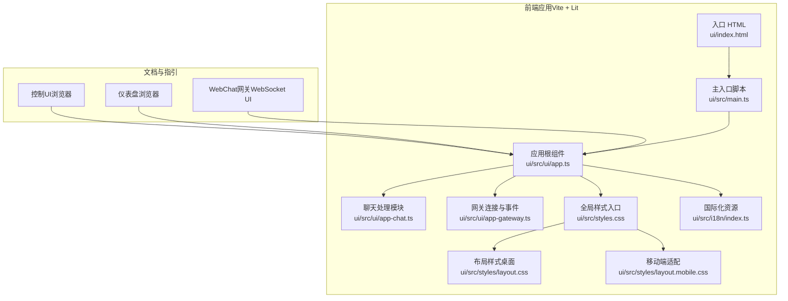
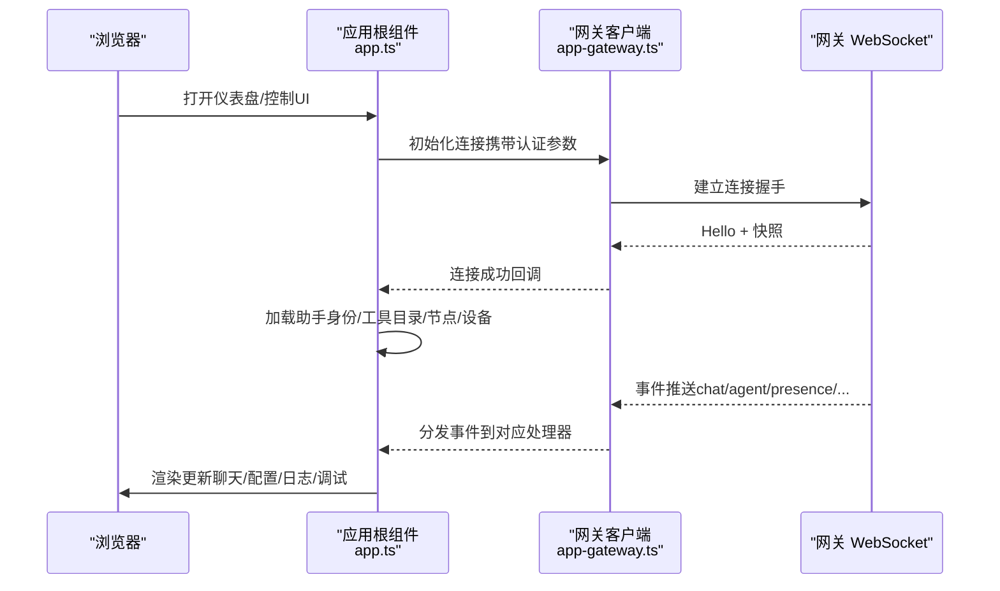
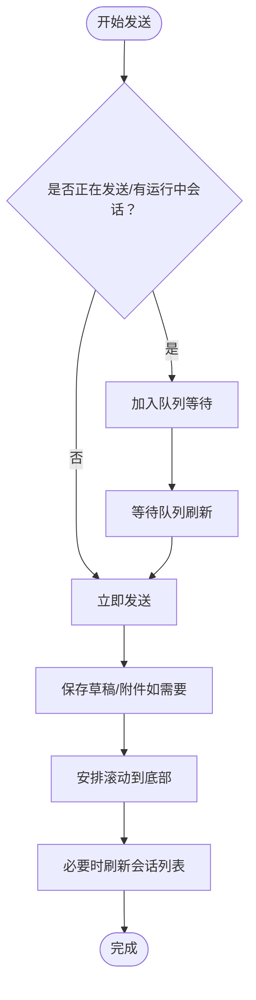
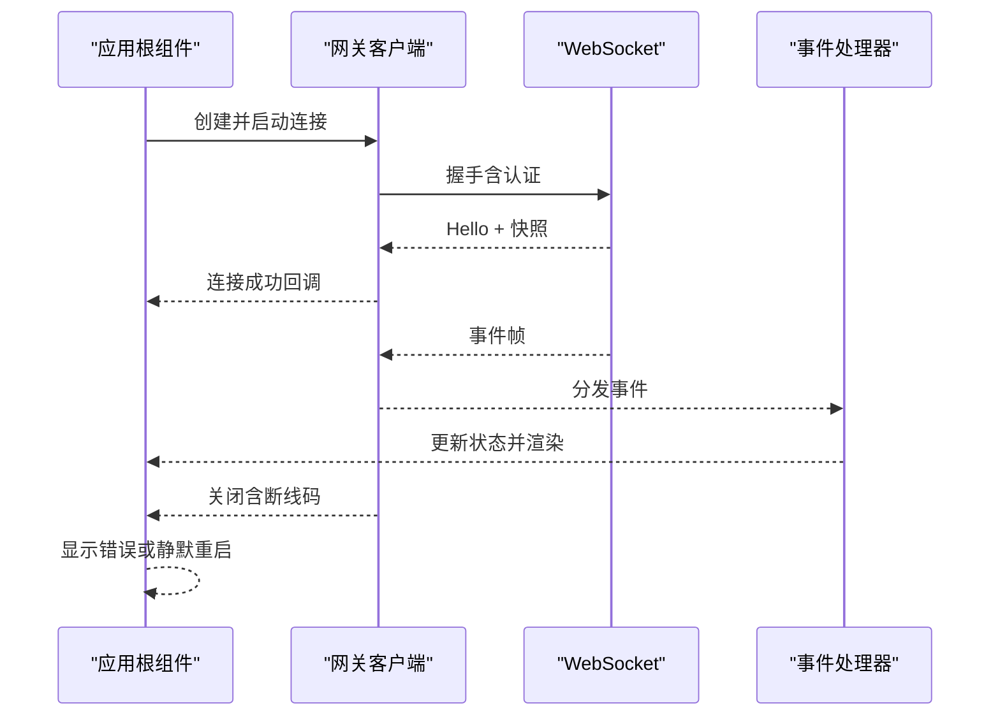
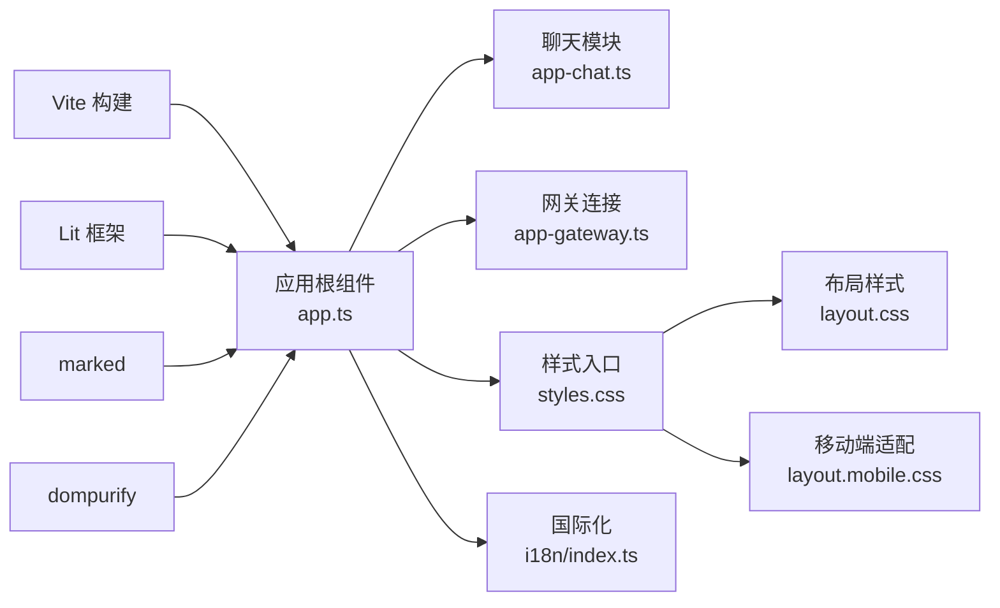

# Web界面

<cite>
**本文引用的文件**
- [控制UI（浏览器）](file://docs/web/control-ui.md)
- [仪表盘（浏览器）](file://docs/web/dashboard.md)
- [WebChat（网关WebSocket UI）](file://docs/web/webchat.md)
- [入口 HTML](file://ui/index.html)
- [主入口脚本](file://ui/src/main.ts)
- [应用根组件](file://ui/src/ui/app.ts)
- [聊天处理模块](file://ui/src/ui/app-chat.ts)
- [网关连接与事件处理](file://ui/src/ui/app-gateway.ts)
- [全局样式入口](file://ui/src/styles.css)
- [布局样式（桌面端）](file://ui/src/styles/layout.css)
- [移动端适配样式](file://ui/src/styles/layout.mobile.css)
- [国际化资源（多语言）](file://ui/src/i18n/index.ts)
- [Vite 构建配置](file://ui/vite.config.ts)
- [UI 包依赖定义](file://ui/package.json)
</cite>

## 目录

1. [简介](#简介)
2. [项目结构](#项目结构)
3. [核心组件](#核心组件)
4. [架构总览](#架构总览)
5. [详细组件分析](#详细组件分析)
6. [依赖关系分析](#依赖关系分析)
7. [性能考量](#性能考量)
8. [故障排查指南](#故障排查指南)
9. [结论](#结论)
10. [附录](#附录)

## 简介

本文件面向使用浏览器操作网关（Gateway）的用户与开发者，系统化介绍控制面板（Control UI）、仪表盘（Dashboard）与 WebChat 的使用方法、配置项与交互流程；同时覆盖界面定制、主题与响应式设计、开发与构建流程、API 接口与集成方式、浏览器兼容性、性能优化与安全注意事项。

## 项目结构

Web 界面由“文档指引 + 前端单页应用（Vite + Lit）+ 样式与国际化资源”构成：

- 文档层：提供使用说明、认证与暴露模式、远程访问与安全建议等
- 前端层：以 Lit 组件为核心，通过 WebSocket 与网关交互，提供聊天、节点、会话、配置、日志、调试等功能
- 样式层：采用 CSS 变量与网格布局，支持深浅主题与移动端自适应
- 国际化层：按浏览器语言自动加载本地化资源，支持中英等多语

图示来源

- [入口 HTML:1-17](file://ui/index.html#L1-L17)
- [主入口脚本:1-3](file://ui/src/main.ts#L1-L3)
- [应用根组件:1-630](file://ui/src/ui/app.ts#L1-L630)
- [聊天处理模块:1-267](file://ui/src/ui/app-chat.ts#L1-L267)
- [网关连接与事件处理:1-425](file://ui/src/ui/app-gateway.ts#L1-L425)
- [全局样式入口:1-6](file://ui/src/styles.css#L1-L6)
- [布局样式（桌面端）:1-625](file://ui/src/styles/layout.css#L1-L625)
- [移动端适配样式](file://ui/src/styles/layout.mobile.css)
- [国际化资源（多语言）](file://ui/src/i18n/index.ts)

章节来源

- [控制UI（浏览器）:1-269](file://docs/web/control-ui.md#L1-L269)
- [仪表盘（浏览器）:1-55](file://docs/web/dashboard.md#L1-L55)
- [WebChat（网关WebSocket UI）:1-62](file://docs/web/webchat.md#L1-L62)
- [入口 HTML:1-17](file://ui/index.html#L1-L17)
- [主入口脚本:1-3](file://ui/src/main.ts#L1-L3)
- [应用根组件:1-630](file://ui/src/ui/app.ts#L1-L630)
- [聊天处理模块:1-267](file://ui/src/ui/app-chat.ts#L1-L267)
- [网关连接与事件处理:1-425](file://ui/src/ui/app-gateway.ts#L1-L425)
- [全局样式入口:1-6](file://ui/src/styles.css#L1-L6)
- [布局样式（桌面端）:1-625](file://ui/src/styles/layout.css#L1-L625)
- [移动端适配样式](file://ui/src/styles/layout.mobile.css)
- [国际化资源（多语言）](file://ui/src/i18n/index.ts)

## 核心组件

- 控制面板（Control UI）
  - 通过浏览器直接访问，服务端默认地址与可选前缀路径
  - 直连网关 WebSocket，握手阶段携带认证参数
  - 首次连接需设备配对，保障访问安全
  - 支持多语言懒加载与本地存储复用
- 仪表盘（Dashboard）
  - 默认根路径，可通过配置项调整基础路径
  - 强调安全：仅在受信网络或 HTTPS 下开放
  - 提供一键打开、令牌管理与远程访问建议
- WebChat
  - macOS/iOS 原生聊天 UI 直连网关 WebSocket
  - 行为与通道一致，历史从网关拉取，断开时只读
- 聊天（Chat）
  - 发送非阻塞、流式事件、停止命令、注入消息、部分输出保留
  - 历史上限保护，超大消息会被截断或替换占位
- 配置（Config）
  - 支持表单与原始 JSON 编辑，带校验与基底哈希保护
  - 应用后可触发重启并唤醒最近活跃会话
- 日志（Logs）
  - 实时尾随网关文件日志，支持过滤与导出
- 调试（Debug）
  - 快照状态、健康检查、模型列表、事件日志与手动 RPC 调用

章节来源

- [控制UI（浏览器）:11-269](file://docs/web/control-ui.md#L11-L269)
- [仪表盘（浏览器）:8-55](file://docs/web/dashboard.md#L8-L55)
- [WebChat（网关WebSocket UI）:8-62](file://docs/web/webchat.md#L8-L62)
- [聊天处理模块:1-267](file://ui/src/ui/app-chat.ts#L1-L267)
- [网关连接与事件处理:1-425](file://ui/src/ui/app-gateway.ts#L1-L425)

## 架构总览

前端通过 WebSocket 与网关交互，应用根组件统一调度各功能模块；样式采用 CSS 变量与网格布局，支持深浅主题与移动端自适应；国际化按浏览器首选语言动态加载。

图示来源

- [应用根组件:110-630](file://ui/src/ui/app.ts#L110-L630)
- [网关连接与事件处理:186-269](file://ui/src/ui/app-gateway.ts#L186-L269)
- [聊天处理模块:159-203](file://ui/src/ui/app-chat.ts#L159-L203)

## 详细组件分析

### 控制面板（Control UI）使用指南

- 访问与认证
  - 本地快速打开：默认端口与可选基础路径
  - 首次连接需要设备配对，避免未授权访问
  - 认证参数在握手阶段通过连接参数传递
- 功能概览
  - 聊天：发送、停止、注入、历史上限保护
  - 通道：状态、二维码登录、每通道配置
  - 实例与会话：在线列表、会话筛选与覆盖
  - 定时任务：增删改启停、运行历史、通知模式
  - 技能：状态、启用/禁用、安装、密钥更新
  - 节点：能力列表
  - 执行审批：编辑允许清单与策略
  - 配置：查看/编辑 JSON、应用并重启、schema 渲染
  - 调试：健康快照、事件日志、手动 RPC
  - 日志：实时尾随、过滤、导出
  - 更新：包/仓库更新并重启
- 远程访问与安全
  - 推荐使用 Tailscale Serve 或本地 HTTPS
  - 非安全上下文（HTTP）下限制 WebCrypto 使用
  - 允许不安全认证与危险关闭设备认证的开关仅用于应急
- 开发与构建
  - 静态资源由网关分发，支持自定义基础路径
  - 开发服务器可指向远端网关，便于联调

章节来源

- [控制UI（浏览器）:11-269](file://docs/web/control-ui.md#L11-L269)

### 仪表盘（Dashboard）访问与认证

- 快速打开与一键启动
  - 本地：默认端口
  - 一键打开：CLI 提供便捷入口
- 认证与令牌
  - 本地：无需令牌
  - 远程：Tailscale Serve（信任主机假设）、绑定到局域网并使用令牌、SSH 隧道
  - 令牌漂移修复与生成
- 安全提示
  - 控制面板为管理员面，避免公网暴露
  - 令牌保存于当前标签页会话存储，URL 中清理

章节来源

- [仪表盘（浏览器）:8-55](file://docs/web/dashboard.md#L8-L55)

### WebChat（网关 WebSocket UI）

- 行为特性
  - 直连网关 WebSocket，使用相同会话与路由规则
  - 历史来自网关，断线时只读
  - 注入消息与停止命令、部分输出保留
- 远程使用
  - 通过 SSH/Tailscale 隧道转发网关 WebSocket
  - 无需单独部署 WebChat 服务器

章节来源

- [WebChat（网关WebSocket UI）:8-62](file://docs/web/webchat.md#L8-L62)

### 聊天（Chat）交互与行为

- 发送与停止
  - 发送非阻塞，立即返回运行标识并以事件流回传结果
  - 支持点击停止、输入停止命令或按会话级停止
- 历史与注入
  - 历史大小受限，超长文本可能被截断或替换占位
  - 注入消息仅广播到 UI，不触发代理运行
- 队列与草稿
  - 多消息排队发送，支持恢复草稿与附件
- 会话键与头像
  - 自动解析会话键中的代理 ID，并根据代理头像元数据刷新头像

图示来源

- [聊天处理模块:94-203](file://ui/src/ui/app-chat.ts#L94-L203)

章节来源

- [聊天处理模块:1-267](file://ui/src/ui/app-chat.ts#L1-L267)

### 网关连接与事件处理

- 连接建立
  - 通过客户端实例建立 WebSocket 连接，携带客户端名称、版本与实例 ID
  - 握手成功后应用快照（会话默认值、健康状态、存在性等），并加载辅助数据
- 事件分发
  - 聊天事件：更新会话键、处理流式片段、必要时重载历史
  - 代理事件：工具结果完成后重载历史以显示持久化内容
  - 存在性/定时任务/设备配对/执行审批等事件触发相应刷新
- 断线与错误
  - 断线码 1012 视为预期重启，其他断线显示错误原因
  - 认证失败与速率限制进行友好提示

图示来源

- [网关连接与事件处理:186-269](file://ui/src/ui/app-gateway.ts#L186-L269)
- [聊天处理模块:310-322](file://ui/src/ui/app-chat.ts#L310-L322)

章节来源

- [网关连接与事件处理:1-425](file://ui/src/ui/app-gateway.ts#L1-L425)

### 界面定制、主题与响应式设计

- 主题
  - 支持系统、浅色、深色三模式，CSS 变量驱动
  - 主题切换影响内容区背景与组件视觉
- 响应式
  - 桌面端：侧边导航固定宽度，内容区域自适应
  - 平板/移动端：导航横向滚动、内容区域自适应网格与堆叠
- 布局
  - 采用 CSS Grid，Shell 容器控制顶部栏、导航与内容区域
  - 内容区支持聊天视图专用布局与滚动优化

章节来源

- [布局样式（桌面端）:1-625](file://ui/src/styles/layout.css#L1-L625)
- [移动端适配样式](file://ui/src/styles/layout.mobile.css)

### 国际化与本地化

- 首次加载基于浏览器语言选择本地化资源
- 支持多语懒加载，缺失键回退至英语
- 本地存储复用已选语言，下次访问保持

章节来源

- [控制UI（浏览器）:63-71](file://docs/web/control-ui.md#L63-L71)
- [国际化资源（多语言）](file://ui/src/i18n/index.ts)

### 开发与构建指南

- 构建
  - 使用 Vite 构建，产物输出到网关静态目录
  - 支持自定义基础路径环境变量
- 开发
  - 本地开发服务器端口与严格端口占用
  - 支持指向远端网关的 WebSocket 地址与一次性令牌
- 测试
  - Vitest + Playwright 浏览器测试配置

章节来源

- [Vite 构建配置:1-44](file://ui/vite.config.ts#L1-L44)
- [UI 包依赖定义:1-28](file://ui/package.json#L1-L28)
- [控制UI（浏览器）:201-269](file://docs/web/control-ui.md#L201-L269)

### API 接口与集成方法

- WebSocket 方法（典型）
  - 聊天：历史、发送、中止、注入
  - 通道：状态、登录、配置
  - 实例与会话：存在性列表、会话列表与覆盖
  - 定时任务：查询、新增、编辑、运行、启停、历史
  - 技能：状态、启用/禁用、安装、密钥更新
  - 节点：能力列表
  - 执行审批：请求、解析、解决
  - 配置：获取、设置、应用、schema 渲染
  - 调试：状态、健康、模型列表、事件日志、手动 RPC
  - 日志：实时尾随、过滤、导出
  - 更新：运行更新并重启
- 事件
  - chat、agent、presence、cron、device.pair._、exec.approval._

章节来源

- [控制UI（浏览器）:72-102](file://docs/web/control-ui.md#L72-L102)
- [网关连接与事件处理:324-403](file://ui/src/ui/app-gateway.ts#L324-L403)

## 依赖关系分析

- 组件耦合
  - 应用根组件聚合所有功能模块，作为单一状态源
  - 聊天与网关模块紧密耦合，事件驱动渲染
- 外部依赖
  - Vite：构建与开发服务器
  - Lit：声明式 UI 组件框架
  - marked：Markdown 渲染
  - dompurify：HTML 安全净化
  - @lit-labs/signals/@lit/context：响应式信号与上下文
- 样式与主题
  - CSS 变量与 Grid 布局，移动端媒体查询适配

图示来源

- [应用根组件:1-630](file://ui/src/ui/app.ts#L1-L630)
- [聊天处理模块:1-267](file://ui/src/ui/app-chat.ts#L1-L267)
- [网关连接与事件处理:1-425](file://ui/src/ui/app-gateway.ts#L1-L425)
- [全局样式入口:1-6](file://ui/src/styles.css#L1-L6)
- [布局样式（桌面端）:1-625](file://ui/src/styles/layout.css#L1-L625)
- [移动端适配样式](file://ui/src/styles/layout.mobile.css)
- [国际化资源（多语言）](file://ui/src/i18n/index.ts)
- [Vite 构建配置:1-44](file://ui/vite.config.ts#L1-L44)
- [UI 包依赖定义:1-28](file://ui/package.json#L1-L28)

章节来源

- [UI 包依赖定义:1-28](file://ui/package.json#L1-L28)

## 性能考量

- 构建体积与警告阈值
  - 构建配置中设置了较大的分块体积警告阈值，以减少 CI 日志噪音
- 聊天历史与事件流
  - 历史大小受限，工具结果后重载以避免截断片段
  - 事件间隙检测与断线提示，避免长时间无响应
- 日志与滚动
  - 日志滚动与自动跟随优化，支持按级别过滤与最大字节限制
- 主题与布局
  - CSS 变量与媒体查询减少重绘，移动端布局自适应提升体验

章节来源

- [Vite 构建配置:30-36](file://ui/vite.config.ts#L30-L36)
- [网关连接与事件处理:258-264](file://ui/src/ui/app-gateway.ts#L258-L264)
- [聊天处理模块:309-322](file://ui/src/ui/app-chat.ts#L309-L322)

## 故障排查指南

- “未授权”/1008 错误
  - 确认网关可达；令牌漂移时进行修复；从网关主机获取或生成令牌
- 设备配对
  - 新设备首次连接需批准；本地连接自动批准；远程连接需显式批准
- 非安全上下文（HTTP）
  - 浏览器在非安全上下文阻止 WebCrypto；推荐 HTTPS 或本地访问
- 开发调试
  - 使用开发服务器指向远端网关；gatewayUrl 仅在顶级窗口接受；远程部署需配置允许的 Origin
- 断线与重启
  - 断线码 1012 视为预期重启；其他断线显示具体原因

章节来源

- [仪表盘（浏览器）:45-55](file://docs/web/dashboard.md#L45-L55)
- [控制UI（浏览器）:33-62](file://docs/web/control-ui.md#L33-L62)
- [控制UI（浏览器）:154-198](file://docs/web/control-ui.md#L154-L198)
- [控制UI（浏览器）:223-269](file://docs/web/control-ui.md#L223-L269)
- [网关连接与事件处理:229-251](file://ui/src/ui/app-gateway.ts#L229-L251)

## 结论

该 Web 界面以轻量、安全与易用为目标：通过浏览器直连网关 WebSocket，提供完整的控制与调试能力；配合响应式布局与主题系统，适配多终端场景；完善的认证与安全策略确保管理员面的安全边界。对于开发者，清晰的模块划分与构建配置便于二次开发与集成。

## 附录

- 快速链接
  - 本地访问：默认端口与基础路径
  - 一键打开：CLI 提供便捷入口
  - 远程访问：Tailscale Serve、绑定局域网令牌、SSH 隧道
- 常见问题
  - 令牌漂移修复、设备配对、非安全上下文限制、断线与重启提示

章节来源

- [控制UI（浏览器）:11-269](file://docs/web/control-ui.md#L11-L269)
- [仪表盘（浏览器）:8-55](file://docs/web/dashboard.md#L8-L55)
