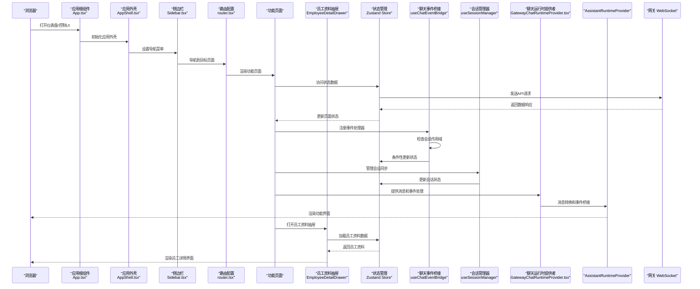
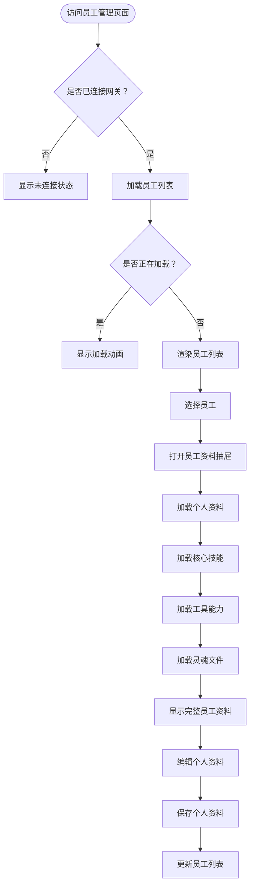
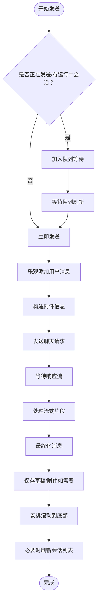
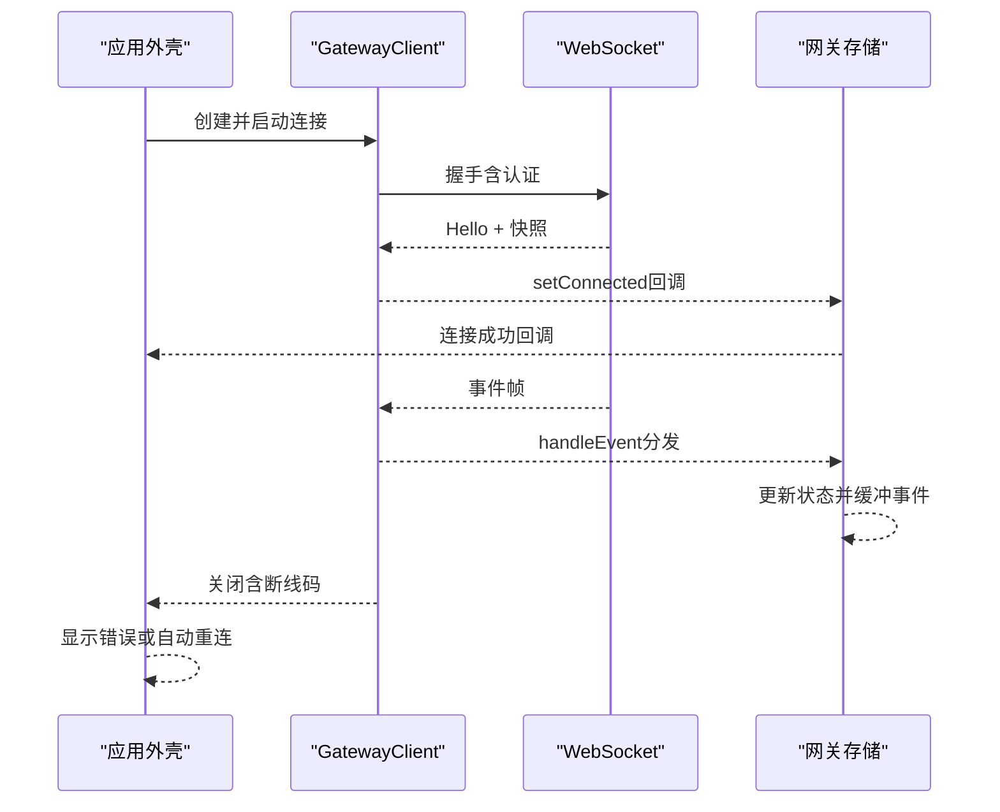
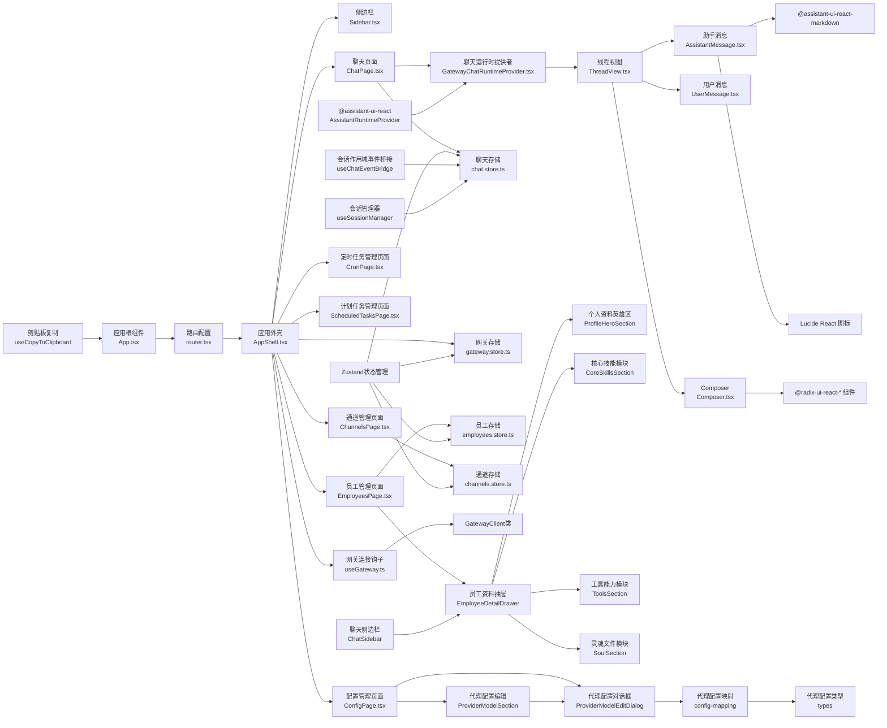

# Web界面

<cite>
**本文引用的文件**
- [控制UI（浏览器）](file://docs/web/control-ui.md)
- [仪表盘（浏览器）](file://docs/web/dashboard.md)
- [WebChat（网关WebSocket UI）](file://docs/web/webchat.md)
- [React前端入口](file://ui-react/src/main.tsx)
- [应用根组件](file://ui-react/src/App.tsx)
- [路由配置](file://ui-react/src/router.tsx)
- [应用外壳](file://ui-react/src/components/layout/AppShell.tsx)
- [侧边栏](file://ui-react/src/components/layout/Sidebar.tsx)
- [聊天页面](file://ui-react/src/pages/ChatPage.tsx)
- [员工管理页面](file://ui-react/src/pages/AgentsPage.tsx)
- [通道管理页面](file://ui-react/src/pages/ChannelsPage.tsx)
- [配置管理页面](file://ui-react/src/pages/ConfigPage.tsx)
- [定时任务管理页面](file://ui-react/src/pages/CronPage.tsx)
- [计划任务管理页面](file://ui-react/src/pages/ScheduledTasksPage.tsx)
- [聊天运行时提供者](file://ui-react/src/components/chat/GatewayChatRuntimeProvider.tsx)
- [线程视图](file://ui-react/src/components/chat/ThreadView.tsx)
- [助手消息组件](file://ui-react/src/components/chat/AssistantMessage.tsx)
- [用户消息组件](file://ui-react/src/components/chat/UserMessage.tsx)
- [Composer组件](file://ui-react/src/components/chat/Composer.tsx)
- [聊天事件桥接钩子](file://ui-react/src/hooks/useChatEventBridge.ts)
- [会话作用域聊天事件桥接测试](file://ui-react/src/hooks/useChatEventBridge.session-scope.test.ts)
- [聊天存储](file://ui-react/src/store/chat.store.ts)
- [网关存储](file://ui-react/src/store/gateway.store.ts)
- [员工存储](file://ui-react/src/store/agents.store.ts)
- [通道存储](file://ui-react/src/store/channels.store.ts)
- [剪贴板复制钩子](file://ui-react/src/hooks/useCopyToClipboard.ts)
- [网关连接钩子](file://ui-react/src/hooks/useGateway.ts)
- [Vite构建配置](file://ui-react/vite.config.ts)
- [UI包依赖定义](file://ui-react/package.json)
- [员工类型定义](file://ui-react/src/types/agents.ts)
- [通道类型定义](file://ui-react/src/types/channels.ts)
- [网关类型定义](file://ui-react/src/types/gateway.ts)
- [员工资料抽屉](file://ui-react/src/components/agents/detail-drawer.tsx)
- [员工资料-个人资料](file://ui-react/src/components/agents/profile.tsx)
- [员工资料-核心技能](file://ui-react/src/components/agents/skills.tsx)
- [员工资料-工具能力](file://ui-react/src/components/agents/tools.tsx)
- [员工资料-灵魂文件](file://ui-react/src/components/agents/soul.tsx)
- [聊天侧边栏](file://ui-react/src/components/chat/ChatSidebar.tsx)
- [会话管理器](file://ui-react/src/hooks/useSessionManager.ts)
- [聊天事件桥接实现](file://ui-react/src/hooks/chat-event-bridge/useChatEventBridge.ts)
- [代理身份编辑组件](file://ui-react/src/components/settings/provider-model/ProviderModelSection.tsx)
- [代理配置编辑对话框](file://ui-react/src/components/settings/provider-model/ProviderModelEditDialog.tsx)
- [代理配置映射](file://ui-react/src/components/settings/provider-model/config-mapping.ts)
- [代理配置类型定义](file://ui-react/src/components/settings/provider-model/types.ts)
</cite>

## 更新摘要
**变更内容**
- 代理管理界面增强：新增代理身份编辑功能，支持代理认证方式的选择和配置
- 重构配置文件保存流程：通过buildProviderModelPatchOps实现增量配置更新
- 新增代理只读模式：支持锁定内置代理配置，防止意外修改
- 增强的代理身份验证：支持OAuth、API Key、代理等多种认证方式
- 代理配置状态管理：通过deriveProviderModelState实现配置状态推断

## 目录
1. [简介](#简介)
2. [项目结构](#项目结构)
3. [核心组件](#核心组件)
4. [架构总览](#架构总览)
5. [详细组件分析](#详细组件分析)
6. [依赖关系分析](#依赖关系分析)
7. [性能考量](#性能考量)
8. [故障排查指南](#故障排查指南)
9. [结论](#结论)
10. [附录](#附录)

## 简介
本文件面向使用浏览器操作网关（Gateway）的用户与开发者，系统化介绍控制面板（Control UI）、仪表盘（Dashboard）与 WebChat 的使用方法、配置项与交互流程；同时覆盖界面定制、主题与响应式设计、开发与构建流程、API 接口与集成方式、浏览器兼容性、性能优化与安全注意事项。

**更新** 本版本文档反映了UI React前端的全面重构，引入了全新的@assistant-ui/react库生态系统，包括AssistantMessage、Composer、GatewayChatRuntimeProvider等核心组件，以及useChatEventBridge钩子和增强的聊天存储系统。新增的员工管理、通道管理、配置管理、定时任务管理、计划任务管理等核心功能页面。新增的员工资料抽屉系统提供了完整的员工资料查看和管理功能，包括个人资料、核心技能、工具能力和灵魂文件的集中展示。新增的代理身份编辑功能增强了代理配置管理能力，支持多种认证方式和增量配置更新。新增的会话作用域聊天事件桥接机制确保跨会话通信的安全性和准确性，剪贴板复制功能提升了用户交互体验。术语更新体现了从"Agents"到"Employees"的业务场景优化。

## 项目结构
Web 界面由"文档指引 + React前端应用 + 状态管理 + 组件库"构成：
- 文档层：提供使用说明、认证与暴露模式、远程访问与安全建议等
- 前端层：基于React 19 + TypeScript，使用@assistant-ui-react组件库，通过WebSocket与网关交互
- 状态管理层：采用Zustand状态管理，分离聊天状态、网关状态、员工状态、通道状态和计划任务状态
- 组件层：基于@assistant-ui-react的可组合UI组件，支持主题定制和响应式设计

```mermaid
graph TB
subgraph "文档与指引"
D1["控制UI浏览器"]
D2["仪表盘浏览器"]
D3["WebChat网关WebSocket UI"]
end
subgraph "React前端应用"
H["入口 HTML<br/>ui-react/index.html"]
M["主入口脚本<br/>ui-react/src/main.tsx"]
A["应用根组件<br/>ui-react/src/App.tsx"]
R["路由配置<br/>ui-react/src/router.tsx"]
AS["应用外壳<br/>ui-react/src/components/layout/AppShell.tsx"]
SB["侧边栏<br/>ui-react/src/components/layout/Sidebar.tsx"]
CP["聊天页面<br/>ui-react/src/pages/ChatPage.tsx"]
EP["员工管理页面<br/>ui-react/src/pages/AgentsPage.tsx"]
CNP["通道管理页面<br/>ui-react/src/pages/ChannelsPage.tsx"]
CFP["配置管理页面<br/>ui-react/src/pages/ConfigPage.tsx"]
CRP["定时任务管理页面<br/>ui-react/src/pages/CronPage.tsx"]
STP["计划任务管理页面<br/>ui-react/src/pages/ScheduledTasksPage.tsx"]
ED["员工资料抽屉<br/>ui-react/src/components/agents/detail-drawer.tsx"]
PH["个人资料英雄区<br/>ui-react/src/components/agents/profile.tsx"]
CSK["核心技能模块<br/>ui-react/src/components/agents/skills.tsx"]
TOL["工具能力模块<br/>ui-react/src/components/agents/tools.tsx"]
SL["灵魂文件模块<br/>ui-react/src/components/agents/soul.tsx"]
CSD["聊天侧边栏<br/>ui-react/src/components/chat/ChatSidebar.tsx"]
end
subgraph "组件库与状态管理"
GCR["GatewayChatRuntimeProvider<br/>聊天运行时提供者"]
TV["ThreadView<br/>线程视图"]
AM["AssistantMessage<br/>助手消息组件"]
UM["UserMessage<br/>用户消息组件"]
CM["Composer<br/>Composer组件"]
CEB["useChatEventBridge<br/>聊天事件桥接钩子"]
CCB["useCopyToClipboard<br/>剪贴板复制钩子"]
CS["chat.store<br/>聊天存储"]
GS["gateway.store<br/>网关存储"]
ATS["agents.store<br/>员工存储"]
CHS["channels.store<br/>通道存储"]
STS["scheduled-tasks.store<br/>计划任务存储"]
UG["useGateway<br/>网关连接钩子"]
SSM["useSessionManager<br/>会话管理器"]
```

**图表来源**
- [应用根组件:1-7](file://ui-react/src/App.tsx#L1-L7)
- [路由配置:1-39](file://ui-react/src/router.tsx#L1-L39)
- [应用外壳:1-90](file://ui-react/src/components/layout/AppShell.tsx#L1-L90)
- [侧边栏:1-129](file://ui-react/src/components/layout/Sidebar.tsx#L1-L129)
- [聊天页面:1-20](file://ui-react/src/pages/ChatPage.tsx#L1-L20)
- [员工管理页面:1-272](file://ui-react/src/pages/AgentsPage.tsx#L1-L272)
- [通道管理页面:1-355](file://ui-react/src/pages/ChannelsPage.tsx#L1-L355)
- [配置管理页面:1-169](file://ui-react/src/pages/ConfigPage.tsx#L1-L169)
- [定时任务管理页面:1-183](file://ui-react/src/pages/CronPage.tsx#L1-L183)
- [计划任务管理页面:1-359](file://ui-react/src/pages/ScheduledTasksPage.tsx#L1-L359)
- [聊天运行时提供者:1-237](file://ui-react/src/components/chat/GatewayChatRuntimeProvider.tsx#L1-L237)
- [线程视图:1-33](file://ui-react/src/components/chat/ThreadView.tsx#L1-L33)
- [助手消息组件:1-240](file://ui-react/src/components/chat/AssistantMessage.tsx#L1-L240)
- [Composer组件:1-90](file://ui-react/src/components/chat/Composer.tsx#L1-L90)
- [聊天事件桥接钩子:1-1011](file://ui-react/src/hooks/useChatEventBridge.ts#L1-L1011)
- [会话作用域聊天事件桥接测试:1-60](file://ui-react/src/hooks/useChatEventBridge.session-scope.test.ts#L1-L60)
- [剪贴板复制钩子:1-20](file://ui-react/src/hooks/useCopyToClipboard.ts#L1-L20)
- [聊天存储:1-363](file://ui-react/src/store/chat.store.ts#L1-L363)
- [网关存储:1-184](file://ui-react/src/store/gateway.store.ts#L1-L184)
- [员工存储:1-470](file://ui-react/src/store/agents.store.ts#L1-L470)
- [通道存储:1-391](file://ui-react/src/store/channels.store.ts#L1-L391)
- [员工资料抽屉:1-142](file://ui-react/src/components/agents/detail-drawer.tsx#L1-L142)
- [员工资料-个人资料:1-379](file://ui-react/src/components/agents/profile.tsx#L1-L379)
- [员工资料-核心技能:1-342](file://ui-react/src/components/agents/skills.tsx#L1-L342)
- [员工资料-工具能力:1-554](file://ui-react/src/components/agents/tools.tsx#L1-L554)
- [员工资料-灵魂文件:1-136](file://ui-react/src/components/agents/soul.tsx#L1-L136)
- [聊天侧边栏:1-169](file://ui-react/src/components/chat/ChatSidebar.tsx#L1-L169)
- [会话管理器:1-297](file://ui-react/src/hooks/useSessionManager.ts#L1-L297)

**章节来源**
- [控制UI（浏览器）:1-269](file://docs/web/control-ui.md#L1-L269)
- [仪表盘（浏览器）:1-55](file://docs/web/dashboard.md#L1-L55)
- [WebChat（网关WebSocket UI）:1-62](file://docs/web/webchat.md#L1-L62)
- [应用根组件:1-7](file://ui-react/src/App.tsx#L1-L7)
- [路由配置:1-39](file://ui-react/src/router.tsx#L1-L39)
- [应用外壳:1-90](file://ui-react/src/components/layout/AppShell.tsx#L1-L90)
- [侧边栏:1-129](file://ui-react/src/components/layout/Sidebar.tsx#L1-L129)
- [聊天页面:1-20](file://ui-react/src/pages/ChatPage.tsx#L1-L20)
- [员工管理页面:1-272](file://ui-react/src/pages/AgentsPage.tsx#L1-L272)
- [通道管理页面:1-355](file://ui-react/src/pages/ChannelsPage.tsx#L1-L355)
- [配置管理页面:1-169](file://ui-react/src/pages/ConfigPage.tsx#L1-L169)
- [定时任务管理页面:1-183](file://ui-react/src/pages/CronPage.tsx#L1-L183)
- [计划任务管理页面:1-359](file://ui-react/src/pages/ScheduledTasksPage.tsx#L1-L359)
- [聊天运行时提供者:1-237](file://ui-react/src/components/chat/GatewayChatRuntimeProvider.tsx#L1-L237)
- [线程视图:1-33](file://ui-react/src/components/chat/ThreadView.tsx#L1-L33)
- [助手消息组件:1-240](file://ui-react/src/components/chat/AssistantMessage.tsx#L1-L240)
- [Composer组件:1-90](file://ui-react/src/components/chat/Composer.tsx#L1-L90)
- [聊天事件桥接钩子:1-1011](file://ui-react/src/hooks/useChatEventBridge.ts#L1-L1011)
- [会话作用域聊天事件桥接测试:1-60](file://ui-react/src/hooks/useChatEventBridge.session-scope.test.ts#L1-L60)
- [剪贴板复制钩子:1-20](file://ui-react/src/hooks/useCopyToClipboard.ts#L1-L20)
- [聊天存储:1-363](file://ui-react/src/store/chat.store.ts#L1-L363)
- [网关存储:1-184](file://ui-react/src/store/gateway.store.ts#L1-L184)
- [员工存储:1-470](file://ui-react/src/store/agents.store.ts#L1-L470)
- [通道存储:1-391](file://ui-react/src/store/channels.store.ts#L1-L391)
- [员工资料抽屉:1-142](file://ui-react/src/components/agents/detail-drawer.tsx#L1-L142)
- [员工资料-个人资料:1-379](file://ui-react/src/components/agents/profile.tsx#L1-L379)
- [员工资料-核心技能:1-342](file://ui-react/src/components/agents/skills.tsx#L1-L342)
- [员工资料-工具能力:1-554](file://ui-react/src/components/agents/tools.tsx#L1-L554)
- [员工资料-灵魂文件:1-136](file://ui-react/src/components/agents/soul.tsx#L1-L136)
- [聊天侧边栏:1-169](file://ui-react/src/components/chat/ChatSidebar.tsx#L1-L169)
- [会话管理器:1-297](file://ui-react/src/hooks/useSessionManager.ts#L1-L297)

## 核心组件
- 控制面板（Control UI）
  - 通过浏览器直接访问，服务端默认地址与可选前缀路径
  - 直连网关 WebSocket，握手阶段携带认证参数
  - 首次连接需设备配对，保障访问安全
  - 支持多语言懒加载与本地存储复用
- 仪表盘（Dashboard）
  - 默认根路径，可通过配置项调整基础路径
  - 强调安全：仅在受信网络或 HTTPS 下开放
  - 提供一键打开、令牌管理与远程访问建议
- WebChat
  - 基于@assistant-ui-react的现代化聊天界面
  - 支持流式响应、工具调用、Markdown渲染、附件上传
  - 行为与通道一致，历史从网关拉取，断开时只读
  - 增强的会话作用域事件处理，确保跨会话通信安全性
- 员工管理（Employees）
  - 全面的员工生命周期管理
  - 支持员工配置、技能管理、工具配置、文件管理
  - 实时状态监控和性能指标展示
  - **新增** 集成员工资料抽屉，提供增强的员工资料查看和管理功能
- 通道管理（Channels）
  - 多渠道统一管理界面
  - 支持WhatsApp、Telegram、Discord等主流通信平台
  - 实时状态监控、配置编辑、登录管理
- 配置管理（Config）
  - 全局配置和员工特定配置
  - 实时配置编辑和应用
  - 支持模型选择、工具配置、技能管理
  - **新增** 代理身份编辑功能，支持多种认证方式
- 定时任务管理（Cron）
  - 可视化定时任务管理
  - 支持多种调度模式（Cron表达式、固定间隔、一次性）
  - 实时任务状态监控和历史记录
- 计划任务管理（Scheduled Tasks）
  - 专门的计划任务管理界面
  - 支持任务创建、编辑、删除、运行历史查看
  - 内置任务表单和运行历史表格组件
- 聊天（Chat）
  - 发送非阻塞、流式事件、停止命令、注入消息、部分输出保留
  - 历史上限保护，超大消息会被截断或替换占位
  - 增强的工具调用流式显示和状态管理
  - 会话作用域事件桥接，防止跨会话数据污染
- 日志（Logs）
  - 实时尾随网关文件日志，支持过滤与导出
- 调试（Debug）
  - 快照状态、健康检查、模型列表、事件日志与手动 RPC 调用

**更新** 新的React架构引入了@assistant-ui-react组件库，提供了更丰富的UI组件和更好的开发者体验。新增的员工管理、通道管理、配置管理、定时任务管理和计划任务管理页面提供了完整的系统控制能力。新增的员工资料抽屉系统提供了完整的员工资料查看和管理功能，包括个人资料、核心技能、工具能力和灵魂文件的集中展示。新增的代理身份编辑功能增强了代理配置管理能力，支持OAuth、API Key、代理等多种认证方式和增量配置更新。会话作用域聊天事件桥接机制确保了跨会话通信的安全性，剪贴板复制功能提升了用户交互体验。术语更新体现了从"Agents"到"Employees"的业务场景优化。

**章节来源**
- [控制UI（浏览器）:11-269](file://docs/web/control-ui.md#L11-L269)
- [仪表盘（浏览器）:8-55](file://docs/web/dashboard.md#L8-L55)
- [WebChat（网关WebSocket UI）:8-62](file://docs/web/webchat.md#L8-L62)
- [员工管理页面:1-272](file://ui-react/src/pages/AgentsPage.tsx#L1-L272)
- [通道管理页面:1-355](file://ui-react/src/pages/ChannelsPage.tsx#L1-L355)
- [配置管理页面:1-169](file://ui-react/src/pages/ConfigPage.tsx#L1-L169)
- [定时任务管理页面:1-183](file://ui-react/src/pages/CronPage.tsx#L1-L183)
- [计划任务管理页面:1-359](file://ui-react/src/pages/ScheduledTasksPage.tsx#L1-L359)
- [聊天运行时提供者:102-237](file://ui-react/src/components/chat/GatewayChatRuntimeProvider.tsx#L102-L237)
- [聊天事件桥接钩子:12-1011](file://ui-react/src/hooks/useChatEventBridge.ts#L12-L1011)
- [会话作用域聊天事件桥接测试:1-60](file://ui-react/src/hooks/useChatEventBridge.session-scope.test.ts#L1-L60)
- [剪贴板复制钩子:1-20](file://ui-react/src/hooks/useCopyToClipboard.ts#L1-L20)
- [聊天存储:1-363](file://ui-react/src/store/chat.store.ts#L1-L363)
- [网关存储:1-184](file://ui-react/src/store/gateway.store.ts#L1-L184)
- [员工存储:1-470](file://ui-react/src/store/agents.store.ts#L1-L470)
- [通道存储:1-391](file://ui-react/src/store/channels.store.ts#L1-L391)
- [员工资料抽屉:1-142](file://ui-react/src/components/agents/detail-drawer.tsx#L1-L142)
- [员工资料-个人资料:1-379](file://ui-react/src/components/agents/profile.tsx#L1-L379)
- [员工资料-核心技能:1-342](file://ui-react/src/components/agents/skills.tsx#L1-L342)
- [员工资料-工具能力:1-554](file://ui-react/src/components/agents/tools.tsx#L1-L554)
- [员工资料-灵魂文件:1-136](file://ui-react/src/components/agents/soul.tsx#L1-L136)
- [聊天侧边栏:1-169](file://ui-react/src/components/chat/ChatSidebar.tsx#L1-L169)
- [会话管理器:1-297](file://ui-react/src/hooks/useSessionManager.ts#L1-L297)

## 架构总览
前端通过React组件树与@assistant-ui-react生态系统的协作，实现与网关的WebSocket通信；应用外壳统一管理连接状态，聊天运行时提供者桥接Zustand状态与@assistant-ui的外部存储运行时；组件层基于@assistant-ui的可组合组件实现丰富的聊天功能。新增的页面通过统一的状态管理架构实现数据共享和状态同步。会话作用域事件桥接机制确保只有匹配当前活动会话的事件才会更新UI状态。**新增** 员工资料抽屉系统通过独立的组件架构提供完整的员工资料管理功能，支持响应式设计和流畅的动画效果。**新增** 代理身份编辑系统通过专门的组件架构提供完整的代理配置管理功能，支持多种认证方式和增量配置更新。

```mermaid
sequenceDiagram
participant Browser as "浏览器"
participant App as "应用根组件<br/>App.tsx"
participant Shell as "应用外壳<br/>AppShell.tsx"
participant Sidebar as "侧边栏<br/>Sidebar.tsx"
participant Router as "路由配置<br/>router.tsx"
participant Page as "功能页面"
participant Drawer as "员工资料抽屉<br/>EmployeeDetailDrawer"
participant Store as "状态管理<br/>Zustand Store"
participant EventBridge as "聊天事件桥接<br/>useChatEventBridge"
participant SessionManager as "会话管理器<br/>useSessionManager"
participant Runtime as "聊天运行时提供者<br/>GatewayChatRuntimeProvider.tsx"
participant Provider as "AssistantRuntimeProvider"
participant WS as "网关 WebSocket"
Browser->>App : 打开仪表盘/控制UI
App->>Shell : 初始化应用外壳
Shell->>Sidebar : 设置导航菜单
Sidebar->>Router : 导航到目标页面
Router->>Page : 渲染功能页面
Page->>Store : 访问状态数据
Store->>WS : 发送API请求
WS-->>Store : 返回数据响应
Store-->>Page : 更新页面状态
Page->>EventBridge : 注册事件处理器
EventBridge->>EventBridge : 检查会话作用域
EventBridge->>Store : 条件性更新状态
Page->>SessionManager : 管理会话同步
SessionManager->>Store : 更新会话状态
Page->>Runtime : 提供消息和事件处理
Runtime->>Provider : 消息转换和事件桥接
Provider-->>Browser : 渲染功能界面
Page->>Drawer : 打开员工资料抽屉
Drawer->>Store : 加载员工资料数据
Store-->>Drawer : 返回员工资料
Drawer-->>Browser : 渲染员工详情界面
```

**图表来源**
- [应用根组件:1-7](file://ui-react/src/App.tsx#L1-L7)
- [应用外壳:10-90](file://ui-react/src/components/layout/AppShell.tsx#L10-L90)
- [侧边栏:22-129](file://ui-react/src/components/layout/Sidebar.tsx#L22-L129)
- [路由配置:20-39](file://ui-react/src/router.tsx#L20-L39)
- [聊天运行时提供者:112-237](file://ui-react/src/components/chat/GatewayChatRuntimeProvider.tsx#L112-L237)
- [聊天事件桥接钩子:23-40](file://ui-react/src/hooks/useChatEventBridge.ts#L23-L40)
- [会话管理器:67-297](file://ui-react/src/hooks/useSessionManager.ts#L67-L297)
- [员工资料抽屉:36-142](file://ui-react/src/components/agents/detail-drawer.tsx#L36-L142)

## 详细组件分析

### 控制面板（Control UI）使用指南
- 访问与认证
  - 本地快速打开：默认端口与可选基础路径
  - 首次连接需要设备配对，避免未授权访问
  - 认证参数在握手阶段通过连接参数传递
- 功能概览
  - 聊天：发送、停止、注入、历史上限保护
  - 通道：状态、二维码登录、每通道配置
  - 实例与会话：在线列表、会话筛选与覆盖
  - 定时任务：增删改启停、运行历史、通知模式
  - 技能：状态、启用/禁用、安装、密钥更新
  - 节点：能力列表
  - 执行审批：编辑允许清单与策略
  - 配置：查看/编辑 JSON、应用并重启、schema 渲染
  - 调试：健康快照、事件日志、手动 RPC
  - 日志：实时尾随、过滤、导出
  - 更新：包/仓库更新并重启
- 远程访问与安全
  - 推荐使用 Tailscale Serve 或本地 HTTPS
  - 非安全上下文（HTTP）下限制 WebCrypto 使用
  - 允许不安全认证与危险关闭设备认证的开关仅用于应急
- 开发与构建
  - 静态资源由网关分发，支持自定义基础路径
  - 开发服务器可指向远端网关，便于联调

**更新** React版本的控制面板保持了相同的使用体验，但采用了现代化的组件架构和更好的性能表现。

**章节来源**
- [控制UI（浏览器）:11-269](file://docs/web/control-ui.md#L11-L269)

### 仪表盘（Dashboard）访问与认证
- 快速打开与一键启动
  - 本地：默认端口
  - 一键打开：CLI 提供便捷入口
- 认证与令牌
  - 本地：无需令牌
  - 远程：Tailscale Serve（信任主机假设）、绑定到局域网并使用令牌、SSH 隧道
  - 令牌漂移修复与生成
- 安全提示
  - 控制面板为管理员面，避免公网暴露
  - 令牌保存于当前标签页会话存储，URL 中清理

**章节来源**
- [仪表盘（浏览器）:8-55](file://docs/web/dashboard.md#L8-L55)

### WebChat（网关 WebSocket UI）
- 行为特性
  - 基于@assistant-ui-react的现代化聊天界面
  - 支持流式响应、工具调用、Markdown渲染、附件上传
  - 直连网关 WebSocket，使用相同会话与路由规则
  - 历史来自网关，断线时只读
  - 注入消息与停止命令、部分输出保留
  - 会话作用域事件处理，防止跨会话数据污染
- 组件架构
  - GatewayChatRuntimeProvider：桥接Zustand状态与@assistant-ui运行时
  - ThreadView：主聊天线程布局，包含消息列表和Composer
  - AssistantMessage：助手消息渲染，支持Markdown和工具调用
  - UserMessage：用户消息渲染
  - Composer：消息输入组件，支持附件上传和发送控制
  - useChatEventBridge：会话作用域事件桥接，确保事件只影响当前会话
- 远程使用
  - 通过 SSH/Tailscale 隧道转发网关 WebSocket
  - 无需单独部署 WebChat 服务器

**更新** WebChat完全重构为基于@assistant-ui-react的现代化架构，提供了更好的用户体验和开发体验。新增的会话作用域事件桥接机制确保了跨会话通信的安全性。

**章节来源**
- [WebChat（网关WebSocket UI）:8-62](file://docs/web/webchat.md#L8-L62)
- [聊天运行时提供者:102-237](file://ui-react/src/components/chat/GatewayChatRuntimeProvider.tsx#L102-L237)
- [线程视图:9-33](file://ui-react/src/components/chat/ThreadView.tsx#L9-L33)
- [助手消息组件:153-240](file://ui-react/src/components/chat/AssistantMessage.tsx#L153-L240)
- [Composer组件:6-90](file://ui-react/src/components/chat/Composer.tsx#L6-L90)
- [聊天事件桥接钩子:31-40](file://ui-react/src/hooks/useChatEventBridge.ts#L31-L40)

### 员工管理（Employees）页面
- 功能特性
  - 员工列表管理：支持多个员工实例的创建、删除和配置
  - 员工详情展示：包含员工身份信息、专业摘要、核心技能、工具配置
  - 文件管理：支持员工相关文件的查看、编辑和保存
  - 实时状态监控：显示员工的运行状态、配置状态和性能指标
  - **新增** 集成员工资料抽屉，提供增强的员工资料查看和管理功能
- 页面架构
  - 侧边栏员工列表：支持员工选择和刷新
  - 主内容区域：包含员工概览、专业摘要、核心技能、工具配置等模块
  - 文件管理区：支持Markdown文件的编辑和预览
  - **新增** 员工资料抽屉：提供完整的员工资料查看界面
- 状态管理
  - 员工存储：管理员工列表、选择状态、配置表单和文件内容
  - 实时数据同步：通过WebSocket接收员工状态更新
  - 错误处理：提供重试机制和错误提示
  - **新增** 员工资料抽屉状态管理：处理抽屉的打开/关闭和员工资料加载

**更新** 新增的员工管理页面集成了全新的员工资料抽屉系统，提供了完整的员工资料查看和管理功能。员工资料抽屉包含个人资料英雄区、核心技能、工具能力和灵魂文件四个核心模块，支持员工资料的编辑和保存。

```mermaid
flowchart TD
Start(["访问员工管理页面"]) --> CheckConn{"是否已连接网关？"}
CheckConn --> |否| ShowDisconnected["显示未连接状态"]
CheckConn --> |是| LoadEmployees["加载员工列表"]
LoadEmployees --> Loading{"是否正在加载？"}
Loading --> |是| ShowLoading["显示加载动画"]
Loading --> |否| RenderEmployees["渲染员工列表"]
RenderEmployees --> SelectEmployee["选择员工"]
SelectEmployee --> OpenDrawer["打开员工资料抽屉"]
OpenDrawer --> LoadProfile["加载个人资料"]
LoadProfile --> LoadSkills["加载核心技能"]
LoadSkills --> LoadTools["加载工具能力"]
LoadTools --> LoadSoul["加载灵魂文件"]
LoadSoul --> ShowDrawer["显示完整员工资料"]
ShowDrawer --> EditProfile["编辑个人资料"]
EditProfile --> SaveProfile["保存个人资料"]
SaveProfile --> UpdateList["更新员工列表"]
```

**图表来源**
- [员工管理页面:106-272](file://ui-react/src/pages/AgentsPage.tsx#L106-L272)
- [员工存储:170-222](file://ui-react/src/store/agents.store.ts#L170-L222)
- [员工资料抽屉:36-142](file://ui-react/src/components/agents/detail-drawer.tsx#L36-L142)

**章节来源**
- [员工管理页面:1-272](file://ui-react/src/pages/AgentsPage.tsx#L1-L272)
- [员工存储:1-470](file://ui-react/src/store/agents.store.ts#L1-L470)
- [员工类型定义:1-200](file://ui-react/src/types/agents.ts#L1-L200)
- [员工资料抽屉:1-142](file://ui-react/src/components/agents/detail-drawer.tsx#L1-L142)
- [员工资料-个人资料:1-379](file://ui-react/src/components/agents/profile.tsx#L1-L379)
- [员工资料-核心技能:1-342](file://ui-react/src/components/agents/skills.tsx#L1-L342)
- [员工资料-工具能力:1-554](file://ui-react/src/components/agents/tools.tsx#L1-L554)
- [员工资料-灵魂文件:1-136](file://ui-react/src/components/agents/soul.tsx#L1-L136)

### 通道管理（Channels）页面
- 功能特性
  - 多渠道统一管理：支持WhatsApp、Telegram、Discord、Google Chat、Slack、Signal、iMessage、Nostr等主流通信平台
  - 实时状态监控：显示每个通道的配置状态、运行状态、连接状态和错误信息
  - 配置管理：支持每个通道的配置表单编辑和保存
  - 登录管理：提供二维码登录、扫描等待和登出功能（针对特定通道）
  - 状态指示：通过颜色编码显示通道运行状态
- 页面架构
  - 通道列表：左侧显示所有可用通道，支持启用/禁用操作
  - 通道详情：右侧显示所选通道的详细状态和配置
  - 配置表单：支持动态生成的配置表单
  - 登录面板：针对支持二维码登录的通道提供登录界面
- 特定通道支持
  - WhatsApp：二维码登录、扫描等待、登出功能
  - Nostr：个人资料编辑、配置管理
  - 其他通道：通用配置界面

**更新** 新增的通道管理页面提供了统一的多渠道管理界面，支持主流通信平台的配置和监控。

**章节来源**
- [通道管理页面:1-355](file://ui-react/src/pages/ChannelsPage.tsx#L1-L355)
- [通道存储:1-391](file://ui-react/src/store/channels.store.ts#L1-L391)
- [通道类型定义:1-200](file://ui-react/src/types/channels.ts#L1-L200)

### 配置管理（Config）页面
- 功能特性
  - 全局配置：管理全局默认设置，如默认模型等
  - 员工特定配置：为每个员工设置特定的配置项
  - 实时编辑：支持配置的实时编辑和保存
  - 配置验证：提供配置表单的验证和错误提示
  - 原始配置查看：提供完整的配置对象查看界面
  - **新增** 代理身份编辑：支持多种认证方式的代理配置
- 页面架构
  - 全局默认设置：管理全局范围的配置项
  - 员工模型配置：为每个员工设置主要模型
  - 原始配置查看：显示完整的配置对象
  - **新增** 代理配置编辑：提供代理身份的配置界面
- 配置管理
  - 配置表单：动态生成的配置编辑界面
  - 配置保存：支持增量更新和完整保存
  - 配置重载：支持从网关重新加载配置
  - 配置应用：支持配置的即时应用和重启
  - **新增** 代理配置映射：通过buildProviderModelPatchOps实现增量更新

**更新** 新增的配置管理页面提供了完整的配置管理功能，支持全局和员工特定的配置设置。新增的代理身份编辑功能增强了代理配置管理能力，支持OAuth、API Key、代理等多种认证方式和增量配置更新。

**章节来源**
- [配置管理页面:1-169](file://ui-react/src/pages/ConfigPage.tsx#L1-L169)
- [员工存储:238-290](file://ui-react/src/store/agents.store.ts#L238-L290)
- [代理身份编辑组件:1-523](file://ui-react/src/components/settings/provider-model/ProviderModelSection.tsx#L1-L523)
- [代理配置编辑对话框:1-219](file://ui-react/src/components/settings/provider-model/ProviderModelEditDialog.tsx#L1-L219)
- [代理配置映射:1-130](file://ui-react/src/components/settings/provider-model/config-mapping.ts#L1-L130)

### 定时任务管理（Cron）页面
- 功能特性
  - 任务列表：显示所有定时任务的详细信息
  - 任务状态：显示任务的运行状态、最后执行时间、持续时间等
  - 调度信息：显示任务的调度模式（Cron表达式、固定间隔、一次性）
  - 任务控制：支持任务的启用/禁用、查看详细信息
  - 实时监控：显示任务的实时状态和历史记录
- 页面架构
  - 概览卡片：显示任务状态、任务数量、下次唤醒时间等关键指标
  - 任务列表：详细的任务列表，包含每个任务的状态和配置
  - 任务详情：显示单个任务的详细信息和历史记录
- 调度模式
  - Cron表达式：支持标准Cron语法
  - 固定间隔：支持毫秒级的时间间隔
  - 一次性任务：支持指定时间执行的任务
  - 系统事件：支持系统事件触发的任务

**更新** 新增的定时任务管理页面提供了可视化的定时任务管理界面，支持多种调度模式和实时监控。

**章节来源**
- [定时任务管理页面:1-183](file://ui-react/src/pages/CronPage.tsx#L1-L183)
- [员工存储:455-468](file://ui-react/src/store/agents.store.ts#L455-L468)
- [员工类型定义:147-200](file://ui-react/src/types/agents.ts#L147-L200)

### 计划任务管理（Scheduled Tasks）页面
- 功能特性
  - 任务管理：支持计划任务的创建、编辑、删除、启用/禁用
  - 运行历史：查看任务执行历史，支持状态和时间过滤
  - 任务表单：内置任务创建和编辑表单，支持多种调度模式
  - 实时监控：显示任务状态和执行统计
  - 会话关联：支持跳转到相关会话查看执行详情
- 页面架构
  - 标签页：任务列表和运行历史两个标签页
  - 任务卡片：显示任务基本信息和操作按钮
  - 任务表单：模态框形式的任务创建和编辑界面
  - 运行历史表格：显示任务执行记录和操作按钮
- 调度模式
  - 每日/每周/每月：支持周期性任务
  - 固定间隔：支持分钟、小时、天级间隔
  - 一次性：支持指定时间执行的任务
  - 通告模式：支持任务执行后的通告设置

**更新** 新增的计划任务管理页面提供了专门的计划任务管理界面，支持任务的全生命周期管理。

**章节来源**
- [计划任务管理页面:1-359](file://ui-react/src/pages/ScheduledTasksPage.tsx#L1-L359)

### 员工资料抽屉（EmployeeDetailDrawer）系统
- 功能概述
  - **新增** 全新的员工资料查看和管理系统
  - 基于抽屉式设计，提供完整的员工资料展示界面
  - 支持员工资料的编辑、保存和删除操作
  - 集成四个核心模块：个人资料、核心技能、工具能力和灵魂文件
- 核心组件
  - **个人资料英雄区**：展示员工头像、名称、简介和聊天入口
  - **核心技能模块**：显示和管理员工绑定的技能
  - **工具能力模块**：配置和管理员工的工具使用权限
  - **灵魂文件模块**：编辑和管理员工的SOUL.md文件
- 交互特性
  - 响应式设计：支持不同屏幕尺寸的适配
  - 流畅动画：抽屉式展开和收起的动画效果
  - 一键聊天：支持从员工资料直接进入聊天界面
  - 删除确认：安全的员工删除操作流程

**更新** 新增的员工资料抽屉系统提供了完整的员工资料管理功能，集成了个人资料、核心技能、工具能力和灵魂文件四个核心模块，支持员工资料的编辑和保存操作。

**章节来源**
- [员工资料抽屉:1-142](file://ui-react/src/components/agents/detail-drawer.tsx#L1-L142)
- [员工资料-个人资料:1-379](file://ui-react/src/components/agents/profile.tsx#L1-L379)
- [员工资料-核心技能:1-342](file://ui-react/src/components/agents/skills.tsx#L1-L342)
- [员工资料-工具能力:1-554](file://ui-react/src/components/agents/tools.tsx#L1-L554)
- [员工资料-灵魂文件:1-136](file://ui-react/src/components/agents/soul.tsx#L1-L136)

### 员工资料-个人资料英雄区
- 功能特性
  - **新增** 员工个人资料的集中展示区域
  - 支持员工头像、名称、简介和状态显示
  - 提供员工资料编辑功能
  - 支持一键进入聊天界面
  - 支持视频展示和在线状态指示
- 数据展示
  - 员工头像：支持自定义头像或emoji显示
  - 员工名称：支持编辑和保存
  - 员工简介：支持编辑和保存
  - 员工类型：显示员工的生物特征描述
  - 在线状态：实时显示员工在线状态
- 编辑功能
  - 编辑模式：支持IDENTITY.md文件的编辑
  - 实时预览：编辑过程中的实时预览功能
  - 保存机制：支持草稿保存和正式保存
  - 字段提示：支持字段注释和提示信息

**更新** 新增的个人资料英雄区提供了员工个人资料的完整展示和编辑功能，支持IDENTITY.md文件的编辑和保存操作。

**章节来源**
- [员工资料-个人资料:138-379](file://ui-react/src/components/agents/profile.tsx#L138-L379)

### 员工资料-核心技能模块
- 功能特性
  - **新增** 员工核心技能的展示和管理模块
  - 支持技能的查看、添加、删除和排序
  - 提供技能搜索和分类功能
  - 支持技能来源的显示和管理
  - 支持显式技能列表的创建和维护
- 技能管理
  - 技能列表：显示当前绑定的技能
  - 技能搜索：支持技能名称和描述的搜索
  - 技能分类：按来源类型分类显示技能
  - 技能添加：支持从技能目录中添加技能
  - 技能删除：支持从员工中移除技能
- 配置模式
  - 自动模式：基于员工配置自动管理技能
  - 手动模式：支持显式的技能允许列表
  - 混合模式：结合自动和手动的技能管理模式

**更新** 新增的核心技能模块提供了员工技能的完整管理功能，支持技能的查看、添加、删除和配置管理。

**章节来源**
- [员工资料-核心技能:173-342](file://ui-react/src/components/agents/skills.tsx#L173-L342)

### 员工资料-工具能力模块
- 功能特性
  - **新增** 员工工具能力的配置和管理模块
  - 支持工具权限的精细控制
  - 提供预设工具配置方案
  - 支持工具的搜索和分类
  - 支持工具权限的批量管理
- 工具配置
  - 工具列表：显示当前可用的工具
  - 预设方案：提供最小化、编程、消息和完整配置
  - 权限控制：支持工具的允许和拒绝列表
  - 工具搜索：支持工具名称和描述的搜索
  - 权限预览：实时显示工具的权限状态
- 高级功能
  - 批量操作：支持工具权限的批量添加和删除
  - 权限继承：支持从全局配置继承工具权限
  - 权限冲突：自动检测和处理权限冲突
  - 变更确认：重要权限变更的确认机制

**更新** 新增的工具能力模块提供了员工工具权限的完整配置功能，支持预设方案和精细的权限控制。

**章节来源**
- [员工资料-工具能力:349-554](file://ui-react/src/components/agents/tools.tsx#L349-L554)

### 员工资料-灵魂文件模块
- 功能特性
  - **新增** 员工灵魂文件的编辑和管理模块
  - 支持SOUL.md文件的查看、编辑和保存
  - 提供Markdown格式的编辑器
  - 支持文件的草稿保存和正式保存
  - 支持文件的重置和预览功能
- 编辑功能
  - Markdown编辑器：支持Markdown语法的编辑
  - 实时预览：编辑过程中的实时预览功能
  - 文件管理：支持文件的创建、保存和删除
  - 草稿机制：支持编辑过程中的草稿保存
  - 格式支持：支持Markdown的各种格式和语法
- 文件状态
  - 文件存在：显示现有文件的内容
  - 文件不存在：提供创建新文件的入口
  - 草稿状态：显示当前的编辑状态
  - 保存状态：显示文件的保存状态

**更新** 新增的灵魂文件模块提供了员工SOUL.md文件的完整编辑功能，支持Markdown格式的编辑和保存操作。

**章节来源**
- [员工资料-灵魂文件:9-136](file://ui-react/src/components/agents/soul.tsx#L9-L136)

### 聊天侧边栏中的员工资料查看
- 功能概述
  - **新增** 聊天界面中的员工资料查看功能
  - 支持从聊天侧边栏直接查看员工资料
  - 提供员工头像和名称的点击查看功能
  - 支持从员工资料直接进入聊天界面
- 交互流程
  - 员工列表：显示当前连接的员工
  - 员工头像：点击头像查看员工资料
  - 员工名称：点击名称查看员工资料
  - 资料查看：打开员工资料抽屉显示详细信息
  - 一键聊天：从员工资料直接进入聊天界面
- 状态管理
  - 员工选择：管理当前选中的员工
  - 资料抽屉：控制员工资料抽屉的显示状态
  - 会话切换：支持从员工资料切换到聊天会话
  - 界面切换：支持员工列表和会话列表的切换

**更新** 新增的聊天侧边栏员工资料查看功能，允许用户从聊天界面直接查看和管理员工资料。

**章节来源**
- [聊天侧边栏:70-169](file://ui-react/src/components/chat/ChatSidebar.tsx#L70-L169)

### 聊天（Chat）交互与行为
- 发送与停止
  - 发送非阻塞，立即返回运行标识并以事件流回传结果
  - 支持点击停止、输入停止命令或按会话级停止
  - 增强的工具调用流式显示和状态管理
- 历史与注入
  - 历史大小受限，超长文本可能被截断或替换占位
  - 注入消息仅广播到 UI，不触发代理运行
- 队列与草稿
  - 多消息排队发送，支持恢复草稿与附件
- 会话键与头像
  - 自动解析会话键中的员工 ID，并根据员工头像元数据刷新头像
- 工具调用支持
  - 流式工具调用状态显示
  - 工具调用参数和结果的可视化展示
  - 工具调用错误处理和重试机制
- 会话作用域事件处理
  - 严格检查事件的 sessionKey 是否匹配当前活动会话
  - 缺失或空白的会话键会被拒绝，防止跨会话数据污染
  - 支持设置会话键的优先级：聊天存储 > 设置存储 > 默认值

**更新** 新的聊天架构引入了增强的工具调用支持和更好的流式处理能力。新增的会话作用域事件桥接机制确保了跨会话通信的安全性。

```mermaid
flowchart TD
Start(["开始发送"]) --> CheckBusy{"是否正在发送/有运行中会话？"}
CheckBusy --> |是| Enqueue["加入队列等待"]
CheckBusy --> |否| SendNow["立即发送"]
SendNow --> OptimizeUser["乐观添加用户消息"]
OptimizeUser --> BuildAttachments["构建附件信息"]
BuildAttachments --> SendRequest["发送聊天请求"]
SendRequest --> WaitResponse["等待响应流"]
WaitResponse --> StreamChunks["处理流式片段"]
StreamChunks --> Finalize["最终化消息"]
Finalize --> SaveDraft["保存草稿/附件如需要"]
SaveDraft --> ScheduleScroll["安排滚动到底部"]
ScheduleScroll --> MaybeRefresh["必要时刷新会话列表"]
MaybeRefresh --> Done(["完成"])
Enqueue --> WaitFlush["等待队列刷新"]
WaitFlush --> SendNow
```

**图表来源**
- [聊天运行时提供者:166-213](file://ui-react/src/components/chat/GatewayChatRuntimeProvider.tsx#L166-L213)
- [聊天事件桥接钩子:273-1011](file://ui-react/src/hooks/useChatEventBridge.ts#L273-L1011)

**章节来源**
- [聊天运行时提供者:102-237](file://ui-react/src/components/chat/GatewayChatRuntimeProvider.tsx#L102-L237)
- [聊天事件桥接钩子:12-1011](file://ui-react/src/hooks/useChatEventBridge.ts#L12-L1011)
- [聊天存储:1-363](file://ui-react/src/store/chat.store.ts#L1-L363)

### 会话作用域聊天事件桥接
- 会话键确定
  - 优先使用聊天存储中的 sessionKey
  - 如果为空则使用设置存储中的 sessionKey
  - 最终回退到默认值 "main"
- 事件过滤
  - 严格检查事件的 sessionKey 是否匹配当前活动会话
  - 缺失或空白的会话键会被拒绝（严格模式）
  - 防止跨会话运行的数据污染 UI 线程
- 待处理生成状态
  - 跨会话跟踪：即使会话不在前台也会更新待处理生成状态
  - 支持会话切换后恢复 UI 状态
  - 在终端事件（final/error/aborted）时清除状态
- 测试验证
  - 单元测试验证会话键优先级逻辑
  - 测试跨会话事件过滤机制
  - 验证待处理生成状态的生命周期管理

**更新** 新增的会话作用域事件桥接机制确保了跨会话通信的安全性和准确性，防止不同会话之间的数据相互干扰。

**章节来源**
- [聊天事件桥接钩子:23-40](file://ui-react/src/hooks/useChatEventBridge.ts#L23-L40)
- [聊天事件桥接钩子:562-1011](file://ui-react/src/hooks/useChatEventBridge.ts#L562-L1011)
- [会话作用域聊天事件桥接测试:1-60](file://ui-react/src/hooks/useChatEventBridge.session-scope.test.ts#L1-L60)

### 会话同步逻辑增强
- 会话状态管理
  - useSessionManager：统一管理会话列表、历史加载和会话切换
  - pendingHistoryReloadKey：延迟历史重载，避免频繁刷新
  - pendingSessionsReloadSeq：单调递增计数器，触发会话列表更新
- 事件驱动同步
  - useChatEventBridge：监听聊天事件，自动触发会话状态更新
  - derivedTitle更新：聊天完成时自动更新会话标题
  - 会话生成状态：跟踪跨会话的生成进度
- 状态一致性保证
  - 会话键解析：从sessionKey中提取员工ID和会话ID
  - 自动会话切换：当从计划任务跳转时自动切换到对应会话
  - 历史完整性：工具调用完成后自动重载历史以显示持久化内容

**更新** 新增的会话同步逻辑通过useSessionManager和useChatEventBridge的协同，实现了更精确的会话状态同步和状态一致性保证。

**章节来源**
- [会话管理器:67-297](file://ui-react/src/hooks/useSessionManager.ts#L67-L297)
- [聊天事件桥接实现:31-200](file://ui-react/src/hooks/chat-event-bridge/useChatEventBridge.ts#L31-L200)
- [聊天存储:118-200](file://ui-react/src/store/chat.store.ts#L118-L200)

### 剪贴板复制功能
- 功能概述
  - 提供简洁的剪贴板复制钩子，支持文本复制到系统剪贴板
  - 自动处理复制成功和失败的情况
  - 支持自定义复制持续时间
- 使用方式
  - 导入 useCopyToClipboard 钩子
  - 调用 copyToClipboard 函数传入要复制的文本
  - 监听 isCopied 状态变化
- 错误处理
  - 空值检查：空文本不会触发复制
  - 浏览器兼容性：自动处理不同浏览器的剪贴板 API
  - 用户反馈：复制成功后自动恢复状态

**更新** 新增的剪贴板复制功能提升了用户交互体验，简化了文本复制操作。

**章节来源**
- [剪贴板复制钩子:1-20](file://ui-react/src/hooks/useCopyToClipboard.ts#L1-L20)

### 网关连接与事件处理
- 连接建立
  - 通过独立的GatewayClient类建立WebSocket连接
  - 支持设备身份验证和令牌认证
  - 握手成功后应用快照（会话默认值、健康状态、存在性等）
- 事件分发
  - 聊天事件：更新会话键、处理流式片段、必要时重载历史
  - 员工事件：工具结果完成后重载历史以显示持久化内容
  - 存在性/定时任务/设备配对/执行审批等事件触发相应刷新
- 断线与错误
  - 断线码 1012 视为预期重启，其他断线显示错误原因
  - 认证失败与速率限制进行友好提示
  - 自动重连机制，支持指数退避

**更新** 新的网关连接实现提供了更好的错误处理和自动重连能力。

```mermaid
sequenceDiagram
participant App as "应用外壳"
participant Client as "GatewayClient"
participant WS as "WebSocket"
participant Store as "网关存储"
App->>Client : 创建并启动连接
Client->>WS : 握手含认证
WS-->>Client : Hello + 快照
Client-->>Store : setConnected回调
Store-->>App : 连接成功回调
WS-->>Client : 事件帧
Client-->>Store : handleEvent分发
Store-->>Store : 更新状态并缓冲事件
Client-->>App : 关闭含断线码
App-->>App : 显示错误或自动重连
```

**图表来源**
- [网关连接钩子:35-291](file://ui-react/src/hooks/useGateway.ts#L35-L291)
- [网关存储:128-167](file://ui-react/src/store/gateway.store.ts#L128-L167)

**章节来源**
- [网关连接钩子:1-502](file://ui-react/src/hooks/useGateway.ts#L1-L502)
- [网关存储:1-184](file://ui-react/src/store/gateway.store.ts#L1-L184)

### 代理身份编辑系统
- 功能概述
  - **新增** 全新的代理身份配置和管理系统
  - 支持多种认证方式：OAuth、API Key、代理认证
  - 提供代理配置的编辑、验证和保存功能
  - 支持代理配置的增量更新和状态推断
- 核心组件
  - **代理配置编辑对话框**：提供三步配置流程（选择提供商、认证、选择模型）
  - **代理配置节**：支持OAuth、API Key、代理等多种认证方式的配置
  - **代理配置映射**：通过buildProviderModelPatchOps实现增量配置更新
  - **代理配置状态推断**：通过deriveProviderModelState推断当前配置状态
- 认证方式支持
  - OAuth：支持设备代码认证流程
  - API Key：支持API密钥验证和测试连接
  - 代理认证：支持代理访问令牌和密钥
  - 自定义：支持自定义基础URL和API密钥
- 配置管理
  - 增量更新：通过构建补丁操作实现配置的增量更新
  - 配置验证：支持配置的实时验证和错误提示
  - 配置状态：支持配置状态的推断和显示
  - 配置应用：支持配置的即时应用和重启

**更新** 新增的代理身份编辑系统提供了完整的代理配置管理功能，支持OAuth、API Key、代理等多种认证方式和增量配置更新。通过deriveProviderModelState实现配置状态推断，通过buildProviderModelPatchOps实现增量配置更新。

**章节来源**
- [代理身份编辑组件:1-523](file://ui-react/src/components/settings/provider-model/ProviderModelSection.tsx#L1-L523)
- [代理配置编辑对话框:1-219](file://ui-react/src/components/settings/provider-model/ProviderModelEditDialog.tsx#L1-L219)
- [代理配置映射:1-130](file://ui-react/src/components/settings/provider-model/config-mapping.ts#L1-L130)
- [代理配置类型定义:1-42](file://ui-react/src/components/settings/provider-model/types.ts#L1-L42)

### 代理配置编辑对话框
- 功能特性
  - **新增** 三步配置流程：选择提供商 → 选择认证方式 → 选择默认模型
  - 支持配置的实时验证和错误提示
  - 提供配置应用和取消功能
  - 支持配置步骤的前进和后退
- 配置流程
  - 第一步：选择提供商和认证方式
  - 第二步：配置认证凭据和测试连接
  - 第三步：选择默认模型并应用配置
- 验证机制
  - 实时验证：支持配置的实时验证和错误提示
  - 连接测试：支持配置的连接测试和状态显示
  - 步骤验证：支持步骤间的验证和错误提示
- 应用机制
  - 增量应用：通过buildProviderModelPatchOps实现增量配置更新
  - 状态推断：通过deriveProviderModelState推断配置状态
  - 错误处理：提供详细的错误信息和处理建议

**更新** 新增的代理配置编辑对话框提供了完整的代理配置管理功能，支持三步配置流程和实时验证机制。

**章节来源**
- [代理配置编辑对话框:1-219](file://ui-react/src/components/settings/provider-model/ProviderModelEditDialog.tsx#L1-L219)

### 代理配置映射
- 功能概述
  - **新增** 代理配置的增量更新和状态推断系统
  - 通过buildProviderModelPatchOps实现配置的增量更新
  - 通过deriveProviderModelState推断当前配置状态
  - 支持代理配置的验证和错误处理
- 增量更新机制
  - 补丁操作：通过构建补丁操作实现配置的增量更新
  - 路径映射：支持配置路径的映射和更新
  - 值处理：支持配置值的处理和验证
- 状态推断机制
  - 配置解析：解析配置文件并提取相关信息
  - 方法选择：根据配置选择合适的认证方法
  - 状态推断：推断当前的配置状态和标签
- 验证机制
  - 类型验证：验证配置的类型和格式
  - 值验证：验证配置的值和范围
  - 错误处理：提供详细的错误信息和处理建议

**更新** 新增的代理配置映射系统提供了完整的代理配置管理功能，支持增量更新和状态推断机制。

**章节来源**
- [代理配置映射:1-130](file://ui-react/src/components/settings/provider-model/config-mapping.ts#L1-L130)

### 代理配置状态推断
- 功能概述
  - **新增** 代理配置状态的自动推断系统
  - 通过deriveProviderModelState推断当前配置状态
  - 支持配置状态的解析和标签提取
  - 提供配置状态的验证和错误处理
- 状态推断逻辑
  - 配置解析：解析配置文件并提取相关信息
  - 提供商识别：识别当前使用的提供商
  - 方法选择：根据配置选择合适的认证方法
  - 状态推断：推断当前的配置状态和标签
- 配置信息提取
  - 全局模型：提取全局默认模型信息
  - 提供商配置：提取提供商特定的配置信息
  - 认证信息：提取认证相关的配置信息
  - 标签信息：提取配置的标签和描述信息
- 错误处理
  - 配置验证：验证配置的完整性和有效性
  - 默认值：提供默认值和回退机制
  - 错误提示：提供详细的错误信息和处理建议

**更新** 新增的代理配置状态推断系统提供了完整的代理配置状态管理功能，支持配置状态的自动推断和验证。

**章节来源**
- [代理配置状态推断:48-99](file://ui-react/src/components/settings/provider-model/config-mapping.ts#L48-L99)

### 界面定制、主题与响应式设计
- 主题
  - 基于Tailwind CSS的现代化主题系统
  - 支持深色/浅色主题自动切换
  - @assistant-ui-react组件的原生主题支持
- 响应式
  - 移动端优先的设计理念
  - 自适应布局，支持平板和桌面设备
  - 触摸友好的交互设计
- 组件定制
  - @assistant-ui-react的可组合组件架构
  - 支持自定义消息组件和Composer组件
  - 组件级别的样式覆盖和扩展

**更新** 新的React架构提供了更好的主题支持和响应式设计能力。

**章节来源**
- [助手消息组件:1-240](file://ui-react/src/components/chat/AssistantMessage.tsx#L1-L240)
- [Composer组件:1-90](file://ui-react/src/components/chat/Composer.tsx#L1-L90)
- [Vite构建配置:1-36](file://ui-react/vite.config.ts#L1-L36)

### 国际化与本地化
- 首次加载基于浏览器语言选择本地化资源
- 支持多语懒加载，缺失键回退至英语
- 本地存储复用已选语言，下次访问保持

**章节来源**
- [控制UI（浏览器）:63-71](file://docs/web/control-ui.md#L63-L71)

### 开发与构建指南
- 构建
  - 使用Vite 7 + React + TypeScript构建
  - 输出到独立的dist/control-ui-react目录
  - 支持Source Map和chunk大小警告阈值调整
- 开发
  - 本地开发服务器端口5174，host: true
  - 支持热重载和TypeScript类型检查
  - 支持指向远端网关的WebSocket地址
- 测试
  - Vitest测试框架配置
  - 支持单元测试和组件测试
  - 新增会话作用域事件桥接测试

**更新** 新的构建配置提供了更好的开发体验和性能优化。

**章节来源**
- [Vite构建配置:1-36](file://ui-react/vite.config.ts#L1-L36)
- [UI包依赖定义:1-57](file://ui-react/package.json#L1-L57)
- [应用根组件:1-7](file://ui-react/src/App.tsx#L1-L7)

### API 接口与集成方法
- WebSocket 方法（典型）
  - 聊天：历史、发送、中止、注入
  - 通道：状态、登录、配置
  - 实例与会话：存在性列表、会话列表与覆盖
  - 定时任务：查询、新增、编辑、运行、启停、历史
  - 技能：状态、启用/禁用、安装、密钥更新
  - 节点：能力列表
  - 执行审批：请求、解析、解决
  - 配置：获取、设置、应用、schema 渲染
  - 调试：状态、健康、模型列表、事件日志、手动 RPC
  - 日志：实时尾随、过滤、导出
  - 更新：运行更新并重启
- 事件
  - chat、agent、presence、cron、device.pair.*、exec.approval.*
  - tool.start、tool.running、tool.result、tool.error
- @assistant-ui集成
  - ExternalStoreRuntime接口实现
  - ThreadPrimitive组件的完整支持
  - MessagePrimitive、ComposerPrimitive等原生组件

**更新** 新的架构提供了完整的@assistant-ui生态系统的集成能力。

**章节来源**
- [控制UI（浏览器）:72-102](file://docs/web/control-ui.md#L72-L102)
- [聊天事件桥接钩子:273-1011](file://ui-react/src/hooks/useChatEventBridge.ts#L273-L1011)
- [网关存储:12-27](file://ui-react/src/store/gateway.store.ts#L12-L27)

## 依赖关系分析
- 组件耦合
  - 应用外壳聚合所有功能页面，作为单一状态源
  - 聊天运行时提供者与@assistant-ui生态系统的深度集成
  - 状态管理采用Zustand，避免复杂的组件间通信
  - 新增页面通过统一的状态管理架构实现数据共享
  - 会话作用域事件桥接确保事件处理的准确性
  - **新增** 员工资料抽屉系统通过独立的组件架构提供完整的员工资料管理功能
  - **新增** 代理身份编辑系统通过专门的组件架构提供完整的代理配置管理功能
- 外部依赖
  - @assistant-ui-react：现代化聊天UI组件库
  - React 19 + TypeScript：现代前端开发栈
  - Zustand：轻量级状态管理
  - Tailwind CSS：原子化CSS框架
  - Radix UI：无障碍UI组件库
- 组件库
  - @assistant-ui-react-markdown：Markdown渲染支持
  - Lucide React：图标库
  - React Router 7：路由管理

**更新** 新的依赖关系体现了现代化的前端技术栈和组件化架构，新增页面通过统一的状态管理实现更好的数据一致性。会话作用域事件桥接机制确保了跨会话通信的安全性。新增的员工资料抽屉系统通过独立的组件架构提供完整的员工资料管理功能。新增的代理身份编辑系统通过专门的组件架构提供完整的代理配置管理功能。

```mermaid
graph LR
App["应用根组件<br/>App.tsx"] --> Router["路由配置<br/>router.tsx"]
Router --> Shell["应用外壳<br/>AppShell.tsx"]
Shell --> Sidebar["侧边栏<br/>Sidebar.tsx"]
Shell --> ChatPage["聊天页面<br/>ChatPage.tsx"]
Shell --> EmployeesPage["员工管理页面<br/>EmployeesPage.tsx"]
Shell --> ChannelsPage["通道管理页面<br/>ChannelsPage.tsx"]
Shell --> ConfigPage["配置管理页面<br/>ConfigPage.tsx"]
Shell --> CronPage["定时任务管理页面<br/>CronPage.tsx"]
Shell --> ScheduledTasksPage["计划任务管理页面<br/>ScheduledTasksPage.tsx"]
ChatPage --> Runtime["聊天运行时提供者<br/>GatewayChatRuntimeProvider.tsx"]
Runtime --> ThreadView["线程视图<br/>ThreadView.tsx"]
ThreadView --> AssistantMessage["助手消息<br/>AssistantMessage.tsx"]
ThreadView --> UserMessage["用户消息<br/>UserMessage.tsx"]
ThreadView --> Composer["Composer<br/>Composer.tsx"]
ChatPage --> ChatStore["聊天存储<br/>chat.store.ts"]
Shell --> GatewayStore["网关存储<br/>gateway.store.ts"]
EmployeesPage --> EmployeesStore["员工存储<br/>employees.store.ts"]
ChannelsPage --> ChannelsStore["通道存储<br/>channels.store.ts"]
Shell --> GatewayHook["网关连接钩子<br/>useGateway.ts"]
GatewayHook --> GatewayClient["GatewayClient类"]
AssistantRuntimeProvider["@assistant-ui-react<br/>AssistantRuntimeProvider"] --> Runtime
Zustand["Zustand状态管理"] --> ChatStore
Zustand --> GatewayStore
Zustand --> EmployeesStore
Zustand --> ChannelsStore
AssistantMessage --> Markdown["@assistant-ui-react-markdown"]
AssistantMessage --> Lucide["Lucide React 图标"]
Composer --> RadixUI["@radix-ui-react-* 组件"]
useChatEventBridge["会话作用域事件桥接<br/>useChatEventBridge"] --> ChatStore
useSessionManager["会话管理器<br/>useSessionManager"] --> ChatStore
useCopyToClipboard["剪贴板复制<br/>useCopyToClipboard"] --> App
EmployeesPage --> EmployeeDetailDrawer["员工资料抽屉<br/>EmployeeDetailDrawer"]
EmployeeDetailDrawer --> ProfileHero["个人资料英雄区<br/>ProfileHeroSection"]
EmployeeDetailDrawer --> CoreSkills["核心技能模块<br/>CoreSkillsSection"]
EmployeeDetailDrawer --> ToolsSection["工具能力模块<br/>ToolsSection"]
EmployeeDetailDrawer --> SoulSection["灵魂文件模块<br/>SoulSection"]
ChatSidebar["聊天侧边栏<br/>ChatSidebar"] --> EmployeeDetailDrawer
ConfigPage --> ProviderModelSection["代理配置编辑<br/>ProviderModelSection"]
ConfigPage --> ProviderModelEditDialog["代理配置对话框<br/>ProviderModelEditDialog"]
ProviderModelSection --> ProviderModelEditDialog
ProviderModelEditDialog --> ConfigMapping["代理配置映射<br/>config-mapping"]
ConfigMapping --> ProviderModelTypes["代理配置类型<br/>types"]
```

**图表来源**
- [应用根组件:1-7](file://ui-react/src/App.tsx#L1-L7)
- [路由配置:1-39](file://ui-react/src/router.tsx#L1-L39)
- [应用外壳:1-90](file://ui-react/src/components/layout/AppShell.tsx#L1-L90)
- [侧边栏:1-129](file://ui-react/src/components/layout/Sidebar.tsx#L1-L129)
- [聊天页面:1-20](file://ui-react/src/pages/ChatPage.tsx#L1-L20)
- [员工管理页面:1-272](file://ui-react/src/pages/AgentsPage.tsx#L1-L272)
- [通道管理页面:1-355](file://ui-react/src/pages/ChannelsPage.tsx#L1-L355)
- [配置管理页面:1-169](file://ui-react/src/pages/ConfigPage.tsx#L1-L169)
- [定时任务管理页面:1-183](file://ui-react/src/pages/CronPage.tsx#L1-L183)
- [计划任务管理页面:1-359](file://ui-react/src/pages/ScheduledTasksPage.tsx#L1-L359)
- [聊天运行时提供者:1-237](file://ui-react/src/components/chat/GatewayChatRuntimeProvider.tsx#L1-L237)
- [线程视图:1-33](file://ui-react/src/components/chat/ThreadView.tsx#L1-L33)
- [助手消息组件:1-240](file://ui-react/src/components/chat/AssistantMessage.tsx#L1-L240)
- [Composer组件:1-90](file://ui-react/src/components/chat/Composer.tsx#L1-L90)
- [聊天存储:1-363](file://ui-react/src/store/chat.store.ts#L1-L363)
- [网关存储:1-184](file://ui-react/src/store/gateway.store.ts#L1-L184)
- [员工存储:1-470](file://ui-react/src/store/agents.store.ts#L1-L470)
- [通道存储:1-391](file://ui-react/src/store/channels.store.ts#L1-L391)
- [网关连接钩子:1-502](file://ui-react/src/hooks/useGateway.ts#L1-L502)
- [聊天事件桥接钩子:1-1011](file://ui-react/src/hooks/useChatEventBridge.ts#L1-L1011)
- [会话管理器:1-297](file://ui-react/src/hooks/useSessionManager.ts#L1-L297)
- [剪贴板复制钩子:1-20](file://ui-react/src/hooks/useCopyToClipboard.ts#L1-L20)
- [员工资料抽屉:1-142](file://ui-react/src/components/agents/detail-drawer.tsx#L1-L142)
- [员工资料-个人资料:1-379](file://ui-react/src/components/agents/profile.tsx#L1-L379)
- [员工资料-核心技能:1-342](file://ui-react/src/components/agents/skills.tsx#L1-L342)
- [员工资料-工具能力:1-554](file://ui-react/src/components/agents/tools.tsx#L1-L554)
- [员工资料-灵魂文件:1-136](file://ui-react/src/components/agents/soul.tsx#L1-L136)
- [聊天侧边栏:1-169](file://ui-react/src/components/chat/ChatSidebar.tsx#L1-L169)
- [代理身份编辑组件:1-523](file://ui-react/src/components/settings/provider-model/ProviderModelSection.tsx#L1-L523)
- [代理配置编辑对话框:1-219](file://ui-react/src/components/settings/provider-model/ProviderModelEditDialog.tsx#L1-L219)
- [代理配置映射:1-130](file://ui-react/src/components/settings/provider-model/config-mapping.ts#L1-L130)
- [代理配置类型定义:1-42](file://ui-react/src/components/settings/provider-model/types.ts#L1-L42)

**章节来源**
- [UI包依赖定义:1-57](file://ui-react/package.json#L1-L57)

## 性能考量
- 构建体积与警告阈值
  - 构建配置中设置了较大的分块体积警告阈值（1024KB）
  - 独立的构建输出目录，避免与旧版UI冲突
- 聊天历史与事件流
  - 历史大小受限，工具结果后重载以避免截断片段
  - 事件间隙检测与断线提示，避免长时间无响应
  - 流式工具调用的优化处理
  - 会话作用域事件过滤减少不必要的状态更新
- 状态管理
  - Zustand的轻量级状态管理，避免不必要的重新渲染
  - 分离的聊天状态、网关状态、员工状态、通道状态和计划任务状态
  - 新增页面通过统一的状态管理实现更好的性能
  - **新增** 员工资料抽屉的状态管理优化，避免不必要的重新渲染
  - **新增** 代理配置映射的状态管理优化，支持增量更新和状态推断
- 组件优化
  - @assistant-ui-react的虚拟化和优化支持
  - Memo化的消息组件和工具调用组件
  - 会话作用域事件桥接减少事件处理开销
  - **新增** 员工资料抽屉的组件优化，支持响应式设计和动画效果
  - **新增** 代理配置编辑组件的优化，支持实时验证和状态推断
- 主题与布局
  - Tailwind CSS的原子化类名，减少CSS体积
  - 响应式设计的媒体查询优化

**更新** 新的架构在性能方面有了显著提升，特别是在状态管理和组件渲染方面。新增页面通过统一的状态管理实现了更好的数据共享和性能优化。会话作用域事件桥接机制减少了不必要的状态更新，提升了整体性能。新增的员工资料抽屉系统通过优化的组件设计和响应式布局提升了用户体验。新增的代理配置编辑系统通过优化的状态管理和增量更新机制提升了配置管理的性能。

**章节来源**
- [Vite构建配置:21-28](file://ui-react/vite.config.ts#L21-L28)
- [聊天存储:135-363](file://ui-react/src/store/chat.store.ts#L135-L363)
- [网关存储:72-184](file://ui-react/src/store/gateway.store.ts#L72-L184)
- [员工存储:134-170](file://ui-react/src/store/agents.store.ts#L134-L170)
- [通道存储:89-111](file://ui-react/src/store/channels.store.ts#L89-L111)
- [员工资料抽屉:99-142](file://ui-react/src/components/agents/detail-drawer.tsx#L99-L142)
- [代理配置映射:1-130](file://ui-react/src/components/settings/provider-model/config-mapping.ts#L1-L130)

## 故障排查指南
- "未授权"/1008 错误
  - 确认网关可达；令牌漂移时进行修复；从网关主机获取或生成令牌
  - 检查设备身份验证是否正常工作
- 设备配对
  - 新设备首次连接需批准；本地连接自动批准；远程连接需显式批准
  - 检查localStorage中的设备身份信息
- 非安全上下文（HTTP）
  - 浏览器在非安全上下文阻止 WebCrypto；推荐 HTTPS 或本地访问
  - 设备身份验证需要安全上下文支持
- 开发调试
  - 使用开发服务器指向远端网关；gatewayUrl 仅在顶级窗口接受
  - 远程部署需配置允许的 Origin
  - 检查浏览器控制台的详细错误信息
- 断线与重启
  - 断线码 1012 视为预期重启；其他断线显示具体原因
  - 自动重连机制会处理临时网络中断
- @assistant-ui相关问题
  - 检查ExternalStoreRuntime的正确配置
  - 验证消息转换函数的实现
  - 确认组件的正确导入和使用
- 新增页面问题
  - 检查路由配置是否正确
  - 验证状态管理store的初始化
  - 确认WebSocket连接状态
- 会话作用域事件问题
  - 检查 getActiveChatSessionKey 的返回值
  - 验证 isChatEventForActiveSession 的过滤逻辑
  - 确认会话键的优先级顺序
- 会话同步问题
  - 检查 useSessionManager 的会话状态管理
  - 验证 pendingHistoryReloadKey 和 pendingSessionsReloadSeq 的触发
  - 确认会话键解析和自动切换逻辑
- 剪贴板复制问题
  - 检查浏览器权限设置
  - 验证 navigator.clipboard API 的可用性
  - 确认复制文本的有效性
- **新增** 员工资料抽屉问题
  - 检查员工资料数据的加载状态
  - 验证员工资料抽屉的打开/关闭逻辑
  - 确认员工资料编辑功能的正常工作
  - 检查员工删除确认对话框的显示状态
- **新增** 代理配置编辑问题
  - 检查代理配置数据的加载状态
  - 验证代理配置编辑对话框的打开/关闭逻辑
  - 确认代理配置验证功能的正常工作
  - 检查代理配置增量更新的触发和应用

**更新** 新的故障排查指南涵盖了React架构特有的问题和解决方案，包括新增页面、会话作用域事件桥接、会话同步逻辑、剪贴板复制功能、员工资料抽屉系统和代理配置编辑系统的故障排查。

**章节来源**
- [仪表盘（浏览器）:45-55](file://docs/web/dashboard.md#L45-L55)
- [控制UI（浏览器）:33-62](file://docs/web/control-ui.md#L33-L62)
- [网关连接钩子:276-291](file://ui-react/src/hooks/useGateway.ts#L276-L291)
- [聊天事件桥接钩子:988-1011](file://ui-react/src/hooks/useChatEventBridge.ts#L988-L1011)
- [会话作用域聊天事件桥接测试:1-60](file://ui-react/src/hooks/useChatEventBridge.session-scope.test.ts#L1-L60)
- [会话管理器:266-271](file://ui-react/src/hooks/useSessionManager.ts#L266-L271)
- [剪贴板复制钩子:1-20](file://ui-react/src/hooks/useCopyToClipboard.ts#L1-L20)
- [员工资料抽屉:50-91](file://ui-react/src/components/agents/detail-drawer.tsx#L50-L91)
- [代理配置编辑对话框:1-219](file://ui-react/src/components/settings/provider-model/ProviderModelEditDialog.tsx#L1-L219)

## 结论
该 Web 界面以轻量、安全与易用为目标：通过React 19 + @assistant-ui-react的现代化架构，提供完整的控制与调试能力；配合响应式布局与主题系统，适配多终端场景；完善的认证与安全策略确保管理员面的安全边界。新的架构引入了更好的组件化设计、状态管理和开发体验，为未来的功能扩展奠定了坚实的基础。新增的员工管理、通道管理、配置管理、定时任务管理、计划任务管理页面提供了完整的系统控制能力，支持多渠道通信、员工生命周期管理、自动化任务调度和会话作用域事件处理。**新增** 员工资料抽屉系统提供了完整的员工资料查看和管理功能，包括个人资料、核心技能、工具能力和灵魂文件的集中展示。**新增** 代理身份编辑系统提供了完整的代理配置管理功能，支持OAuth、API Key、代理等多种认证方式和增量配置更新。会话作用域聊天事件桥接机制确保了跨会话通信的安全性，剪贴板复制功能提升了用户交互体验。术语更新体现了从"Agents"到"Employees"的业务场景优化，搜索功能改进提升了用户体验一致性。对于开发者，清晰的模块划分与现代化的技术栈便于二次开发与集成。

## 附录
- 快速链接
  - 本地访问：默认端口5174与基础路径
  - 一键打开：CLI 提供便捷入口
  - 远程访问：Tailscale Serve、绑定局域网令牌、SSH 隧道
- 常见问题
  - 令牌漂移修复、设备配对、非安全上下文限制、断线与重启提示
  - @assistant-ui组件的正确使用和配置
  - Zustand状态管理的最佳实践
  - 新增页面的故障排查和解决方案
  - 会话作用域事件桥接的配置和使用
  - 会话同步逻辑的优化和故障排查
  - 剪贴板复制功能的兼容性处理
  - **新增** 员工资料抽屉系统的使用和故障排查
  - **新增** 代理配置编辑系统的使用和故障排查
  - **新增** 代理配置映射的状态推断和增量更新机制

**章节来源**
- [控制UI（浏览器）:11-269](file://docs/web/control-ui.md#L11-L269)
- [仪表盘（浏览器）:8-55](file://docs/web/dashboard.md#L8-L55)
- [Vite构建配置:29-34](file://ui-react/vite.config.ts#L29-L34)
- [员工资料抽屉:1-142](file://ui-react/src/components/agents/detail-drawer.tsx#L1-L142)
- [代理配置编辑对话框:1-219](file://ui-react/src/components/settings/provider-model/ProviderModelEditDialog.tsx#L1-L219)