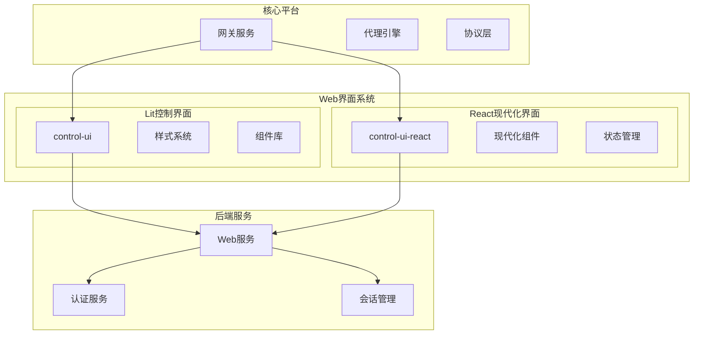
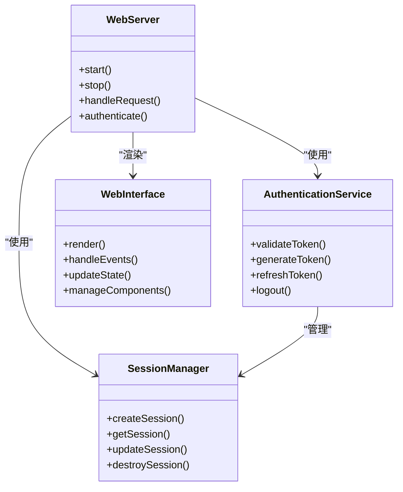
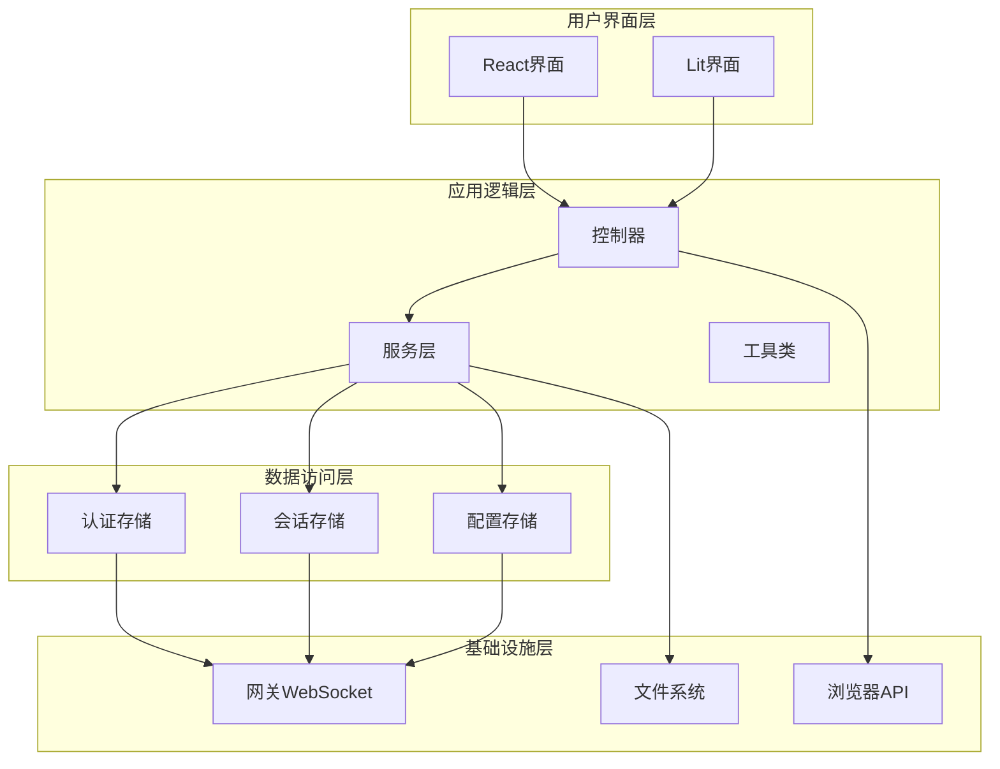
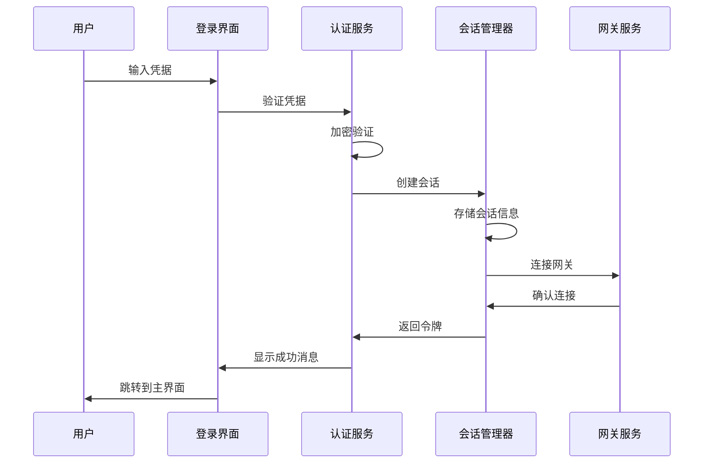
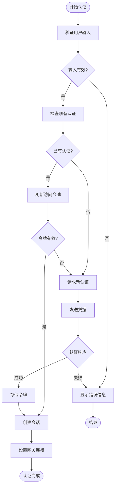
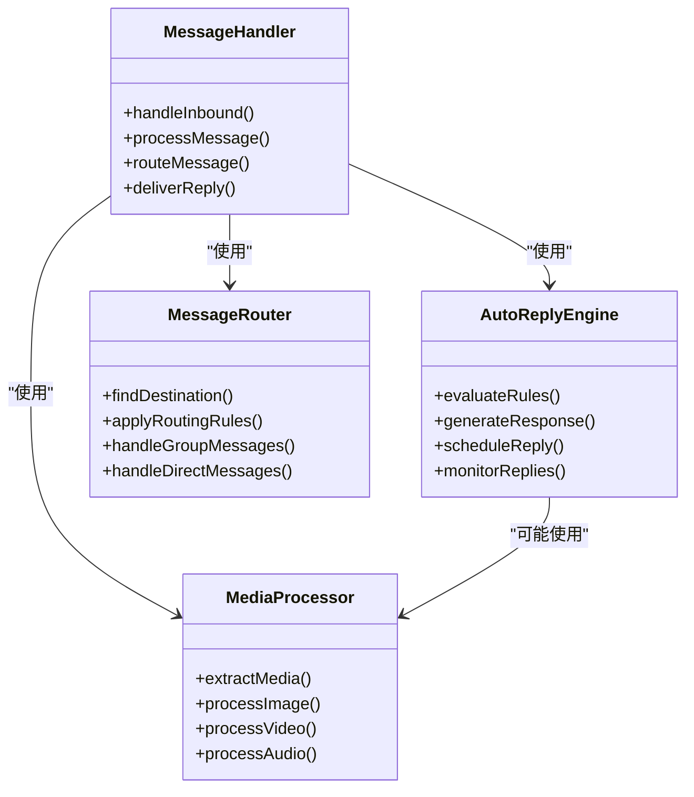
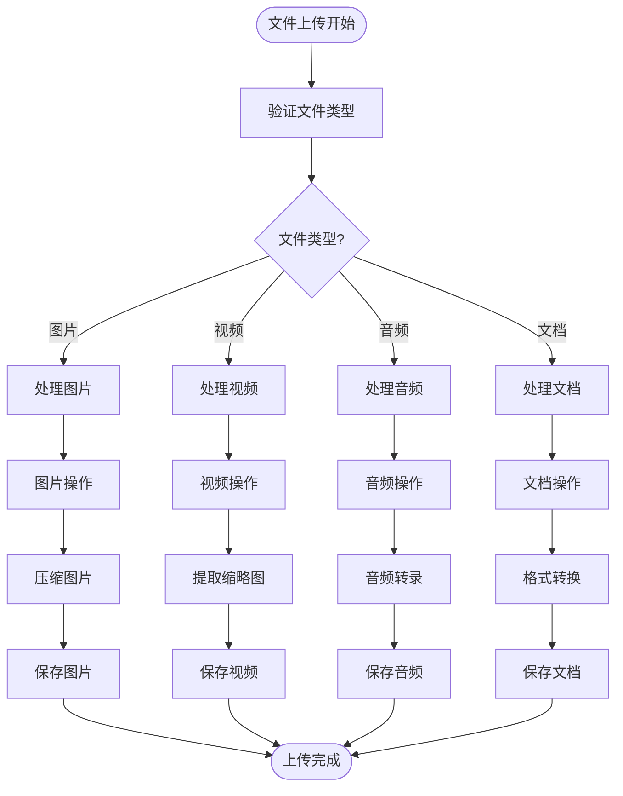
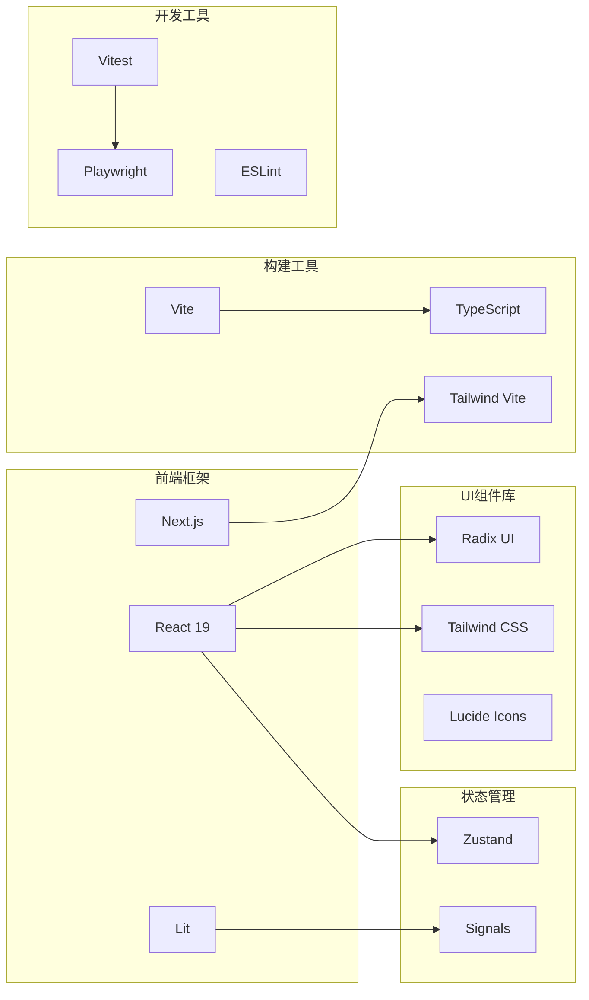
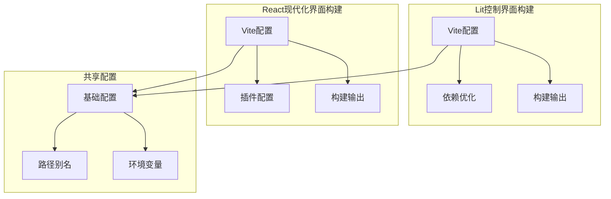
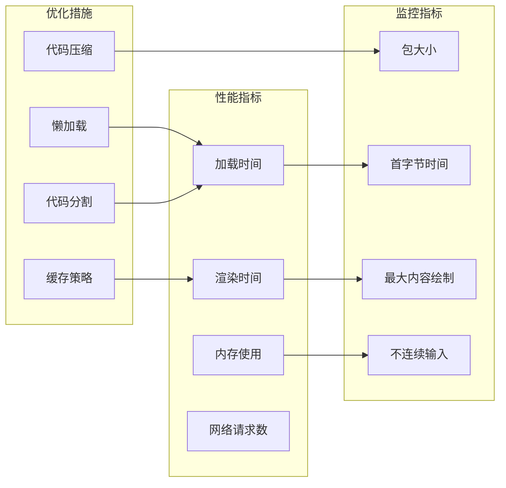

# Web界面现代化

<cite>
**本文档引用的文件**
- [README.md](file://README.md)
- [package.json](file://package.json)
- [ui/package.json](file://ui/package.json)
- [ui-react/package.json](file://ui-react/package.json)
- [ui/src/main.ts](file://ui/src/main.ts)
- [ui-react/src/main.tsx](file://ui-react/src/main.tsx)
- [ui/vite.config.ts](file://ui/vite.config.ts)
- [ui-react/vite.config.ts](file://ui-react/vite.config.ts)
- [src/web/accounts.ts](file://src/web/accounts.ts)
- [src/web/login.ts](file://src/web/login.ts)
- [src/web/session.ts](file://src/web/session.ts)
- [src/web/auto-reply.ts](file://src/web/auto-reply.ts)
- [src/web/inbound.ts](file://src/web/inbound.ts)
- [src/web/outbound.ts](file://src/web/outbound.ts)
- [src/web/media.ts](file://src/web/media.ts)
</cite>

## 目录
1. [简介](#简介)
2. [项目结构](#项目结构)
3. [核心组件](#核心组件)
4. [架构概览](#架构概览)
5. [详细组件分析](#详细组件分析)
6. [依赖关系分析](#依赖关系分析)
7. [性能考虑](#性能考虑)
8. [故障排除指南](#故障排除指南)
9. [结论](#结论)

## 简介

OpenClaw是一个个人AI助手平台，提供多渠道消息传递集成和可扩展的消息处理功能。该项目包含两个主要的Web界面系统：基于Lit的轻量级控制界面（control-ui）和基于React的现代化界面（control-ui-react）。这两个界面系统为用户提供不同的交互体验，支持网关连接、会话管理、通道配置、技能管理和调试工具等功能。

## 项目结构

OpenClaw项目采用模块化架构，包含多个独立但相互关联的组件：

**图表来源**
- [README.md:145-183](file://README.md#L145-L183)
- [package.json:338-342](file://package.json#L338-L342)

**章节来源**
- [README.md:145-183](file://README.md#L145-L183)
- [package.json:338-342](file://package.json#L338-L342)

## 核心组件

### 控制界面系统

OpenClaw提供了两种不同的Web界面系统，每种都有其特定的优势和用途：

#### Lit控制界面（control-ui）
- 基于Lit框架构建的轻量级界面
- 使用原生Web技术实现
- 支持国际化和主题切换
- 提供基础的网关控制功能

#### React现代化界面（control-ui-react）
- 基于React 19和Next.js构建的现代化界面
- 使用Radix UI组件库和Tailwind CSS
- 集成状态管理（Zustand）
- 提供更丰富的用户体验和交互效果

### Web服务架构

**图表来源**
- [src/web/accounts.ts:1-200](file://src/web/accounts.ts#L1-L200)
- [src/web/login.ts:1-200](file://src/web/login.ts#L1-L200)
- [src/web/session.ts:1-200](file://src/web/session.ts#L1-L200)

**章节来源**
- [src/web/accounts.ts:1-200](file://src/web/accounts.ts#L1-L200)
- [src/web/login.ts:1-200](file://src/web/login.ts#L1-L200)
- [src/web/session.ts:1-200](file://src/web/session.ts#L1-L200)

## 架构概览

OpenClaw的Web界面现代化架构采用了分层设计模式，确保了系统的可维护性和扩展性：

**图表来源**
- [ui-react/vite.config.ts:10-60](file://ui-react/vite.config.ts#L10-L60)
- [ui/vite.config.ts:21-44](file://ui/vite.config.ts#L21-L44)

**章节来源**
- [ui-react/vite.config.ts:10-60](file://ui-react/vite.config.ts#L10-L60)
- [ui/vite.config.ts:21-44](file://ui/vite.config.ts#L21-L44)

## 详细组件分析

### 认证与会话管理

认证系统是Web界面的核心组件，负责用户身份验证和会话管理：

**图表来源**
- [src/web/login.ts:1-200](file://src/web/login.ts#L1-L200)
- [src/web/session.ts:1-200](file://src/web/session.ts#L1-L200)

#### 认证流程组件

**图表来源**
- [src/web/accounts.ts:1-200](file://src/web/accounts.ts#L1-L200)
- [src/web/auth-store.ts:1-200](file://src/web/auth-store.ts#L1-L200)

**章节来源**
- [src/web/login.ts:1-200](file://src/web/login.ts#L1-L200)
- [src/web/session.ts:1-200](file://src/web/session.ts#L1-L200)
- [src/web/accounts.ts:1-200](file://src/web/accounts.ts#L1-L200)

### 消息处理系统

消息处理系统负责接收、处理和转发来自不同渠道的消息：

**图表来源**
- [src/web/inbound.ts:1-200](file://src/web/inbound.ts#L1-L200)
- [src/web/outbound.ts:1-200](file://src/web/outbound.ts#L1-L200)
- [src/web/auto-reply.ts:1-200](file://src/web/auto-reply.ts#L1-L200)

**章节来源**
- [src/web/inbound.ts:1-200](file://src/web/inbound.ts#L1-L200)
- [src/web/outbound.ts:1-200](file://src/web/outbound.ts#L1-L200)
- [src/web/auto-reply.ts:1-200](file://src/web/auto-reply.ts#L1-L200)

### 文件上传与媒体处理

媒体处理系统支持多种文件格式的上传和处理：

**图表来源**
- [src/web/media.ts:1-200](file://src/web/media.ts#L1-L200)

**章节来源**
- [src/web/media.ts:1-200](file://src/web/media.ts#L1-L200)

## 依赖关系分析

### 技术栈依赖

OpenClaw的Web界面现代化涉及多个技术栈的集成：

**图表来源**
- [ui-react/package.json:11-67](file://ui-react/package.json#L11-L67)
- [ui/package.json:11-27](file://ui/package.json#L11-L27)
- [package.json:344-474](file://package.json#L344-L474)

**章节来源**
- [ui-react/package.json:11-67](file://ui-react/package.json#L11-L67)
- [ui/package.json:11-27](file://ui/package.json#L11-L27)
- [package.json:344-474](file://package.json#L344-L474)

### 构建配置分析

两个界面系统的构建配置体现了不同的优化策略：

**图表来源**
- [ui/vite.config.ts:21-44](file://ui/vite.config.ts#L21-L44)
- [ui-react/vite.config.ts:9-61](file://ui-react/vite.config.ts#L9-L61)

**章节来源**
- [ui/vite.config.ts:21-44](file://ui/vite.config.ts#L21-L44)
- [ui-react/vite.config.ts:9-61](file://ui-react/vite.config.ts#L9-L61)

## 性能考虑

### 构建优化策略

两个界面系统都采用了不同的性能优化策略：

1. **Lit控制界面优化**
   - 依赖预优化（optimizeDeps）
   - 合理的chunk大小限制
   - 源码映射用于调试

2. **React现代化界面优化**
   - 多入口构建配置
   - 自定义Rollup输出配置
   - 插件化的构建流程

### 运行时性能

## 故障排除指南

### 常见问题诊断

#### 认证问题
- 检查网关连接状态
- 验证认证令牌有效性
- 确认会话存储状态

#### 构建问题
- 检查Node.js版本兼容性
- 验证依赖安装完整性
- 确认环境变量配置

#### 性能问题
- 分析构建包大小
- 监控运行时资源使用
- 优化组件渲染性能

**章节来源**
- [src/web/accounts.ts:1-200](file://src/web/accounts.ts#L1-L200)
- [src/web/login.ts:1-200](file://src/web/login.ts#L1-L200)
- [src/web/session.ts:1-200](file://src/web/session.ts#L1-L200)

## 结论

OpenClaw的Web界面现代化项目展现了现代Web应用开发的最佳实践。通过提供两个互补的界面系统，项目满足了不同用户群体的需求：

1. **技术多样性**：同时支持Lit和React两种不同的技术栈，为开发者提供了灵活性
2. **架构清晰**：模块化的架构设计确保了系统的可维护性和扩展性
3. **用户体验**：现代化的界面设计提供了更好的用户交互体验
4. **性能优化**：针对不同场景的优化策略确保了良好的性能表现

未来的发展方向包括进一步优化两个界面系统的协同工作、增强实时通信功能、改进移动端适配以及持续的性能优化。这些改进将使OpenClaw成为一个更加完善和用户友好的AI助手平台。