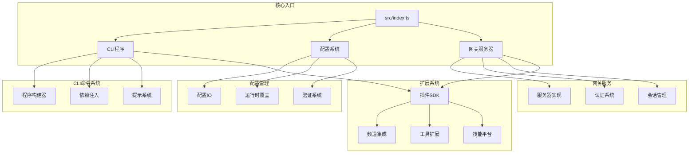
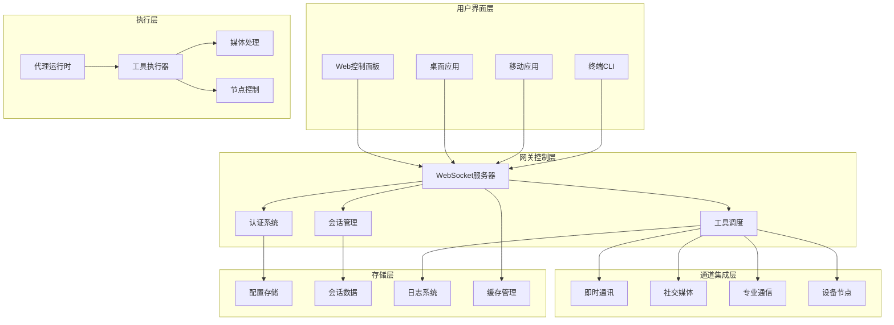
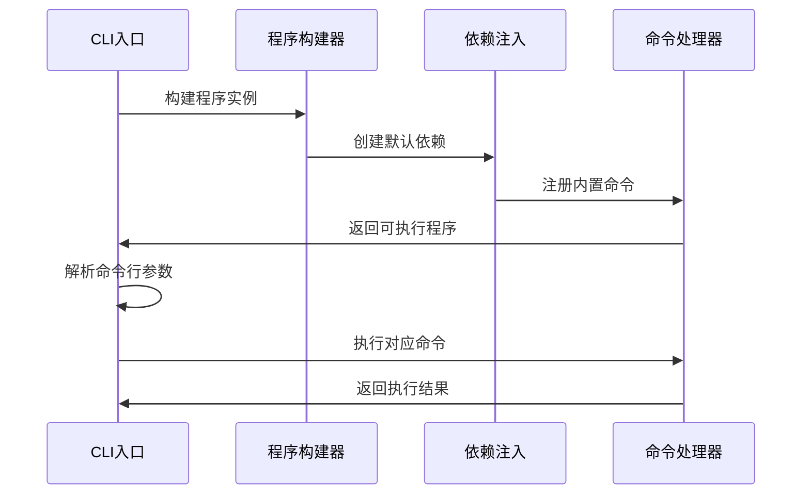
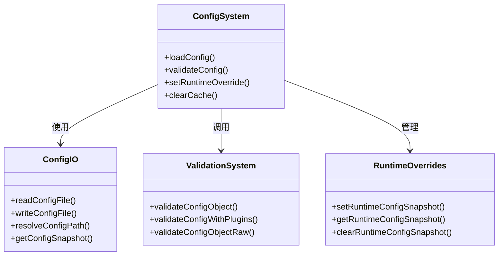
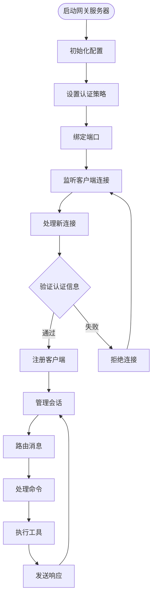
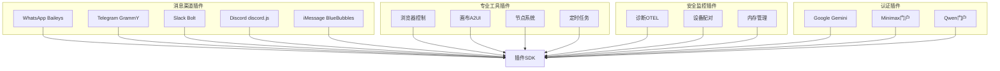

# 代理管理系统

<cite>
**本文档引用的文件**
- [README.md](file://README.md)
- [src/index.ts](file://src/index.ts)
- [package.json](file://package.json)
- [src/cli/program.ts](file://src/cli/program.ts)
- [src/config/config.ts](file://src/config/config.ts)
- [src/gateway/server.ts](file://src/gateway/server.ts)
</cite>

## 目录
1. [简介](#简介)
2. [项目结构](#项目结构)
3. [核心组件](#核心组件)
4. [架构概览](#架构概览)
5. [详细组件分析](#详细组件分析)
6. [依赖分析](#依赖分析)
7. [性能考虑](#性能考虑)
8. [故障排除指南](#故障排除指南)
9. [结论](#结论)

## 简介

OpenClaw 是一个个人AI助手，可在用户的设备上运行。它支持多种消息渠道（WhatsApp、Telegram、Slack、Discord、Google Chat、Signal、iMessage、BlueBubbles、IRC、Microsoft Teams、Matrix、Feishu、LINE、Mattermost、Nextcloud Talk、Nostr、Synology Chat、Tlon、Twitch、Zalo、Zalo Personal、WebChat），并在macOS/iOS/Android平台上提供语音功能和实时画布控制。

该系统的核心是一个网关WebSocket网络，作为会话、通道、工具和事件的单一控制平面。网关通过本地优先的设计理念，确保助手既本地化又快速响应。

## 项目结构

OpenClaw项目采用模块化的架构设计，主要包含以下核心目录：



**图表来源**
- [src/index.ts:1-94](file://src/index.ts#L1-L94)
- [src/cli/program.ts:1-3](file://src/cli/program.ts#L1-L3)
- [src/config/config.ts:1-29](file://src/config/config.ts#L1-L29)
- [src/gateway/server.ts:1-4](file://src/gateway/server.ts#L1-L4)

**章节来源**
- [README.md:185-240](file://README.md#L185-L240)
- [package.json:16-34](file://package.json#L16-L34)

## 核心组件

### CLI入口点
主入口文件负责初始化整个系统，包括环境变量处理、路径检查、运行时版本验证等基础设置。

### 配置管理系统
提供完整的配置加载、验证和缓存机制，支持运行时配置刷新和插件配置验证。

### 网关服务器
实现WebSocket控制平面，处理客户端连接、工具调用和事件分发。

### 扩展插件系统
支持多种消息渠道的集成，包括即时通讯、社交媒体和专业通信平台。

**章节来源**
- [src/index.ts:36-44](file://src/index.ts#L36-L44)
- [src/config/config.ts:1-29](file://src/config/config.ts#L1-L29)
- [src/gateway/server.ts:1-4](file://src/gateway/server.ts#L1-L4)

## 架构概览

OpenClaw采用分层架构设计，从底层基础设施到顶层用户界面形成清晰的层次结构：



**图表来源**
- [README.md:188-202](file://README.md#L188-L202)
- [src/gateway/server.ts:1-4](file://src/gateway/server.ts#L1-L4)

## 详细组件分析

### CLI程序构建器

CLI系统采用模块化设计，支持动态命令注册和依赖注入：



**图表来源**
- [src/cli/program.ts:1-3](file://src/cli/program.ts#L1-L3)
- [src/index.ts:46-48](file://src/index.ts#L46-L48)

### 配置系统架构

配置系统提供多层抽象，支持从文件系统到内存的完整配置生命周期管理：



**图表来源**
- [src/config/config.ts:1-29](file://src/config/config.ts#L1-L29)

**章节来源**
- [src/config/config.ts:1-29](file://src/config/config.ts#L1-L29)

### 网关服务器实现

网关服务器是整个系统的核心控制平面，负责WebSocket连接管理和消息路由：



**图表来源**
- [src/gateway/server.ts:1-4](file://src/gateway/server.ts#L1-L4)

**章节来源**
- [src/gateway/server.ts:1-4](file://src/gateway/server.ts#L1-L4)

## 依赖分析

### 核心依赖关系

系统采用分层依赖架构，确保各组件间的松耦合：

```mermaid
graph LR
subgraph "运行时依赖"
A[Node.js >= 22]
B[TypeScript]
C[ES Modules]
end
subgraph "核心库"
D[@mariozechner/pi-agent-core]
E[@mariozechner/pi-ai]
F[@mariozechner/pi-coding-agent]
end
subgraph "通信库"
G[ws WebSocket]
H[express HTTP服务器]
I[hono Web框架]
end
subgraph "第三方集成"
J[@whiskeysockets/baileys]
K[@grammyjs/transformer-throttler]
L[@slack/bolt]
end
subgraph "工具库"
M[commander CLI解析]
N[chalk 控制台样式]
O[zod 数据验证]
end
A --> D
A --> G
A --> J
D --> H
G --> I
J --> K
L --> M
```

**图表来源**
- [package.json:344-401](file://package.json#L344-L401)
- [package.json:402-423](file://package.json#L402-L423)

### 插件生态系统

系统支持丰富的插件扩展，涵盖各种消息渠道和工具集成：



**图表来源**
- [package.json:39-215](file://package.json#L39-L215)

**章节来源**
- [package.json:344-472](file://package.json#L344-L472)

## 性能考虑

### 内存管理
系统采用智能缓存策略，包括配置缓存、模型目录缓存和会话状态缓存，以减少重复计算和I/O操作。

### 并发处理
通过异步事件循环和非阻塞I/O操作，系统能够高效处理大量并发连接和消息传输。

### 资源优化
- 使用流式处理减少内存占用
- 实现连接池复用网络资源
- 采用懒加载策略延迟初始化重型组件

## 故障排除指南

### 常见问题诊断

1. **端口占用问题**
   - 检查端口使用情况：`lsof -i :18789`
   - 强制释放端口：`kill -9 $(lsof -t -i :18789)`

2. **权限问题**
   - 确认用户权限：`sudo chown -R $(whoami) ~/.openclaw`
   - 检查文件权限：`chmod -R 755 ~/.openclaw`

3. **依赖缺失**
   - 运行完整性检查：`openclaw doctor`
   - 重新安装依赖：`pnpm install`

**章节来源**
- [src/index.ts:25-29](file://src/index.ts#L25-L29)

## 结论

OpenClaw代理管理系统展现了现代AI助手架构的最佳实践。通过模块化设计、分层架构和丰富的插件生态系统，系统实现了高度的可扩展性和可维护性。

核心优势包括：
- **本地优先**：确保数据隐私和响应速度
- **多平台支持**：统一的跨平台体验
- **可扩展性**：灵活的插件架构
- **安全性**：完善的认证和授权机制
- **可观测性**：全面的日志和监控系统

该系统为个人和企业用户提供了一个强大而灵活的AI助手解决方案，支持从简单的个人助理到复杂的多用户协作场景。