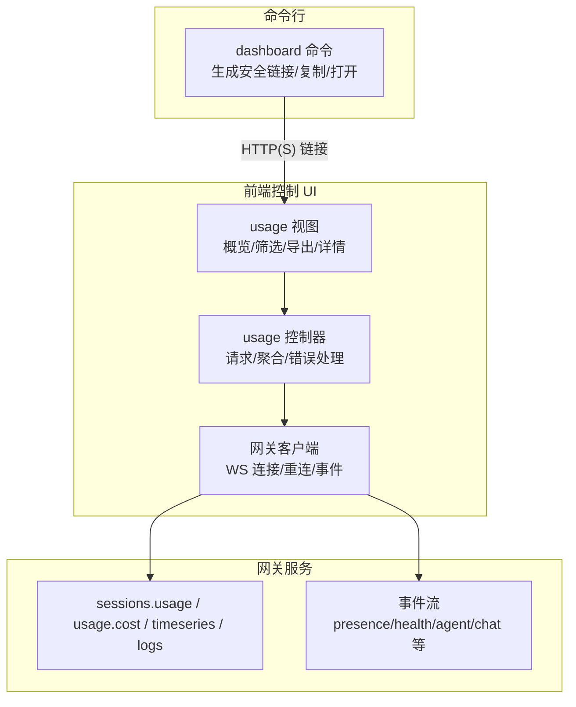
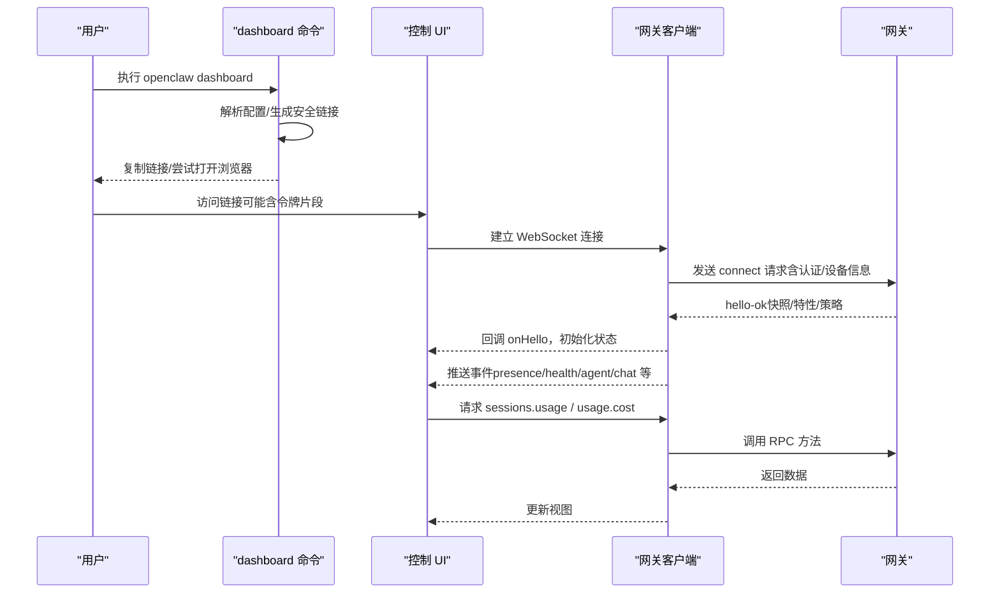
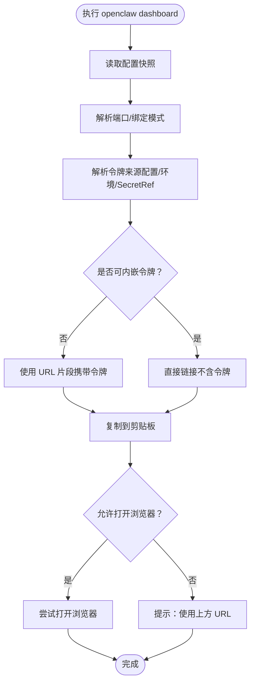
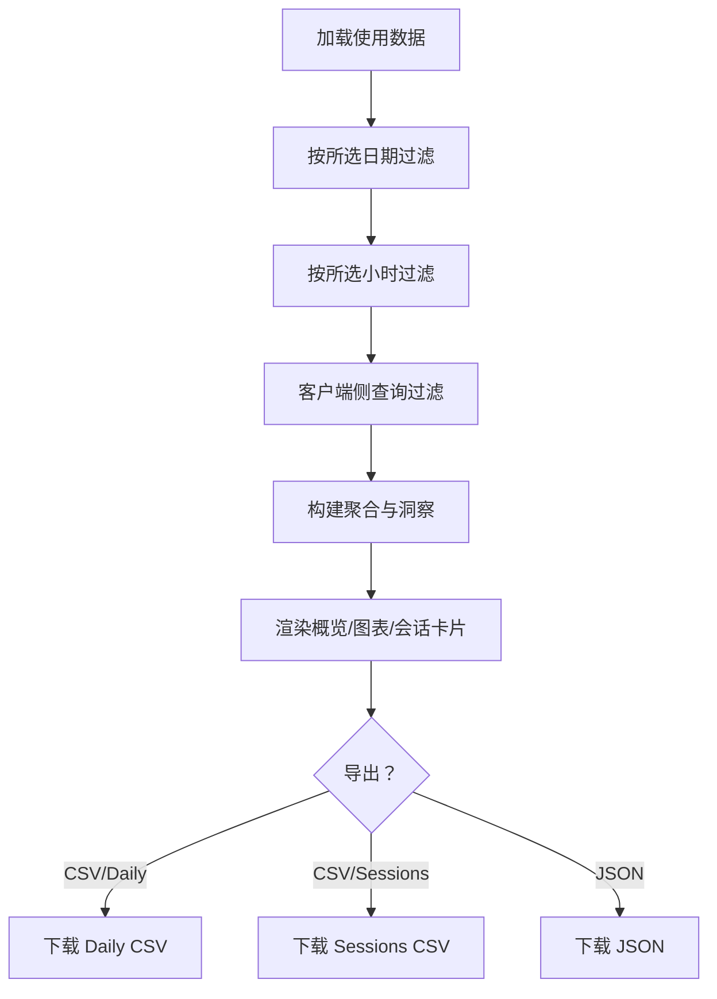
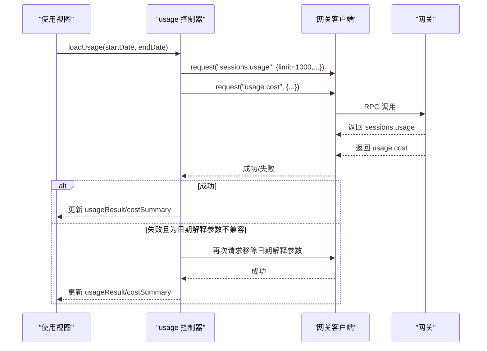
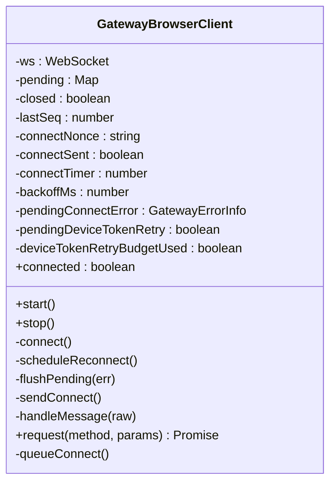
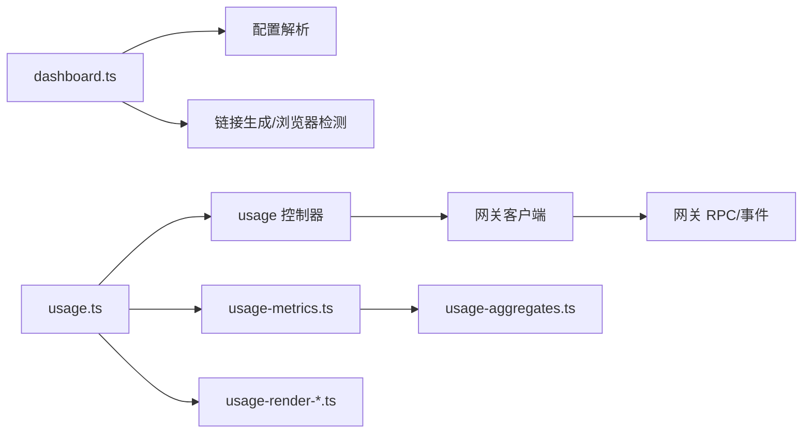

# 仪表板

<cite>
**本文引用的文件**
- [docs/web/dashboard.md](file://docs/web/dashboard.md)
- [docs/cli/dashboard.md](file://docs/cli/dashboard.md)
- [src/commands/dashboard.ts](file://src/commands/dashboard.ts)
- [src/commands/dashboard.test.ts](file://src/commands/dashboard.test.ts)
- [ui/src/ui/views/usage.ts](file://ui/src/ui/views/usage.ts)
- [ui/src/ui/views/usage-render-overview.ts](file://ui/src/ui/views/usage-render-overview.ts)
- [ui/src/ui/views/usage-render-details.ts](file://ui/src/ui/views/usage-render-details.ts)
- [ui/src/ui/views/usage-metrics.ts](file://ui/src/ui/views/usage-metrics.ts)
- [ui/src/ui/controllers/usage.ts](file://ui/src/ui/controllers/usage.ts)
- [ui/src/ui/gateway.ts](file://ui/src/ui/gateway.ts)
- [ui/src/ui/app-gateway.ts](file://ui/src/ui/app-gateway.ts)
- [src/shared/usage-aggregates.ts](file://src/shared/usage-aggregates.ts)
</cite>

## 目录

1. [简介](#简介)
2. [项目结构](#项目结构)
3. [核心组件](#核心组件)
4. [架构总览](#架构总览)
5. [详细组件分析](#详细组件分析)
6. [依赖关系分析](#依赖关系分析)
7. [性能考虑](#性能考虑)
8. [故障排查指南](#故障排查指南)
9. [结论](#结论)
10. [附录](#附录)

## 简介

本文件系统化梳理并说明仪表板（控制 UI）的功能与实现，包括数据展示、图表可视化、实时监控、统计与指标、系统健康状态呈现、自定义面板与筛选、导出能力、配置与布局、主题设置、数据刷新与缓存策略以及性能优化建议。目标是帮助开发者与运维人员快速理解并高效使用仪表板。

## 项目结构

仪表板由“命令行入口 + 控制 UI 前端 + 网关协议与事件流”三部分组成：

- 命令行：负责解析配置、生成安全的访问链接、自动复制到剪贴板、尝试打开浏览器，并在无头环境给出 SSH 提示。
- 前端：提供使用概览、会话与用量统计、时序与日志详情、筛选与导出等交互界面。
- 网关：通过 WebSocket 提供认证握手、事件推送、方法调用（如 sessions.usage、usage.cost、timeseries、logs），前端据此渲染实时状态与历史数据。

**图表来源**

- [src/commands/dashboard.ts:50-118](file://src/commands/dashboard.ts#L50-L118)
- [ui/src/ui/views/usage.ts:91-800](file://ui/src/ui/views/usage.ts#L91-L800)
- [ui/src/ui/controllers/usage.ts:185-255](file://ui/src/ui/controllers/usage.ts#L185-L255)
- [ui/src/ui/gateway.ts:139-470](file://ui/src/ui/gateway.ts#L139-L470)
- [ui/src/ui/app-gateway.ts:186-269](file://ui/src/ui/app-gateway.ts#L186-L269)

**章节来源**

- [docs/web/dashboard.md:1-55](file://docs/web/dashboard.md#L1-L55)
- [docs/cli/dashboard.md:1-23](file://docs/cli/dashboard.md#L1-L23)
- [src/commands/dashboard.ts:50-118](file://src/commands/dashboard.ts#L50-L118)

## 核心组件

- 命令行入口：解析配置、选择绑定模式、生成安全链接（优先 URL 片段携带令牌）、复制到剪贴板、尝试打开浏览器、在无头环境输出 SSH 提示。
- 使用视图：提供日期范围、时区、图表模式（Token/Cost）、筛选器（按天/小时/会话/查询）、洞察卡片、时序与日志详情、导出 CSV/JSON。
- 使用控制器：封装对 sessions.usage、usage.cost、timeseries、logs 的请求；兼容旧版本网关的时间解释参数；错误归一化与加载状态管理。
- 网关客户端：建立与维护 WebSocket 连接，支持设备身份签名、令牌/密码认证、自动重连与退避、事件 gap 检测、一次性设备令牌重试。
- 应用层：将网关快照（presence/health/sessionDefaults/updateAvailable）应用到 UI，分发事件到对应模块（聊天、代理、节点、设备等）。

**章节来源**

- [src/commands/dashboard.ts:50-118](file://src/commands/dashboard.ts#L50-L118)
- [ui/src/ui/views/usage.ts:91-800](file://ui/src/ui/views/usage.ts#L91-L800)
- [ui/src/ui/controllers/usage.ts:185-255](file://ui/src/ui/controllers/usage.ts#L185-L255)
- [ui/src/ui/gateway.ts:139-470](file://ui/src/ui/gateway.ts#L139-L470)
- [ui/src/ui/app-gateway.ts:186-269](file://ui/src/ui/app-gateway.ts#L186-L269)

## 架构总览

下图展示了从命令行到前端再到网关的关键流程与交互点。

**图表来源**

- [src/commands/dashboard.ts:50-118](file://src/commands/dashboard.ts#L50-L118)
- [ui/src/ui/gateway.ts:139-470](file://ui/src/ui/gateway.ts#L139-L470)
- [ui/src/ui/app-gateway.ts:186-269](file://ui/src/ui/app-gateway.ts#L186-L269)
- [ui/src/ui/controllers/usage.ts:185-255](file://ui/src/ui/controllers/usage.ts#L185-L255)

## 详细组件分析

### 命令行：dashboard 命令

- 功能要点
  - 读取配置快照，解析端口与绑定模式（lan 自动映射为 loopback 以满足浏览器安全上下文要求）。
  - 解析令牌来源（配置/环境变量/SecretRef），避免在终端/剪贴板/浏览器参数中泄露外部令牌。
  - 生成 HTTP 链接，必要时以 URL 片段携带令牌；复制到剪贴板；尝试打开浏览器；无头环境输出 SSH 提示。
- 安全与体验
  - 对 SecretRef 管理的令牌，不内嵌 URL 参数，避免暴露外部密钥。
  - 若令牌未解析，打印明确的修复指引与替代方案。

**图表来源**

- [src/commands/dashboard.ts:50-118](file://src/commands/dashboard.ts#L50-L118)

**章节来源**

- [docs/cli/dashboard.md:1-23](file://docs/cli/dashboard.md#L1-L23)
- [src/commands/dashboard.ts:50-118](file://src/commands/dashboard.ts#L50-L118)
- [src/commands/dashboard.test.ts:64-116](file://src/commands/dashboard.test.ts#L64-L116)

### 使用视图：数据展示与筛选

- 数据概览
  - 日常 Token/Cost 使用折线图（支持 Total/By Type 切换），洞察卡片（Top 模型/提供商/工具/代理/渠道、峰值错误日/小时）。
  - 会话卡片：按 Token 或 Cost 排序，支持多列显示、排序方向切换、标签页切换（概览/详情）。
- 筛选与查询
  - 日期范围、时区（本地/UTC）、按天/小时/会话筛选；查询语法支持键值过滤（如 agent:/model:/has:errors/minTokens: 等）。
  - 查询建议与词形提示，筛选器以“芯片”形式展示，支持一键清空。
- 导出
  - 支持导出 Sessions CSV、Daily CSV、JSON（包含总计、会话、每日、聚合）。

**图表来源**

- [ui/src/ui/views/usage.ts:91-800](file://ui/src/ui/views/usage.ts#L91-L800)
- [ui/src/ui/views/usage-render-overview.ts:158-543](file://ui/src/ui/views/usage-render-overview.ts#L158-L543)
- [ui/src/ui/views/usage-render-details.ts:394-429](file://ui/src/ui/views/usage-render-details.ts#L394-L429)

**章节来源**

- [ui/src/ui/views/usage.ts:91-800](file://ui/src/ui/views/usage.ts#L91-L800)
- [ui/src/ui/views/usage-render-overview.ts:158-543](file://ui/src/ui/views/usage-render-overview.ts#L158-L543)
- [ui/src/ui/views/usage-render-details.ts:394-429](file://ui/src/ui/views/usage-render-details.ts#L394-L429)

### 使用控制器：请求与聚合

- 请求策略
  - 同步请求 sessions.usage 与 usage.cost，限制会话数量（默认 1000），并根据时区发送日期解释参数。
  - 兼容旧版本网关：若收到包含 mode/utcOffset 的错误，则记忆该网关并重试一次不带日期解释参数的请求。
- 错误处理
  - 统一错误消息格式；记录加载状态；失败时保留上次结果以便继续使用。
- 时间序列与日志
  - 可选加载会话时间序列与日志，失败静默处理。

**图表来源**

- [ui/src/ui/controllers/usage.ts:185-255](file://ui/src/ui/controllers/usage.ts#L185-L255)

**章节来源**

- [ui/src/ui/controllers/usage.ts:185-255](file://ui/src/ui/controllers/usage.ts#L185-L255)
- [src/shared/usage-aggregates.ts:1-109](file://src/shared/usage-aggregates.ts#L1-L109)

### 网关客户端：实时监控与重连

- 连接与认证
  - 在安全上下文（HTTPS/localhost）下使用设备身份签名与设备令牌；否则回退到令牌/密码认证。
  - 支持一次性设备令牌重试（受信任端点与预算限制）。
- 事件与状态
  - 处理 connect.challenge、事件 gap 检测、onEvent 分发。
- 重连策略
  - 非可恢复认证错误不自动重连；其他错误按指数退避重连，最大延迟上限。

**图表来源**

- [ui/src/ui/gateway.ts:139-470](file://ui/src/ui/gateway.ts#L139-L470)

**章节来源**

- [ui/src/ui/gateway.ts:139-470](file://ui/src/ui/gateway.ts#L139-L470)

### 应用层：事件分发与快照应用

- 连接建立后，应用快照（presence/health/sessionDefaults/updateAvailable），并加载初始数据（代理、工具目录、节点、设备、会话等）。
- 事件分发：chat/agent/presence/cron/device.pair/exec.approval 等事件触发相应模块更新。
- 断线与重连：记录错误码与原因；服务重启（1012）视为正常；gap 检测提示刷新。

**章节来源**

- [ui/src/ui/app-gateway.ts:186-269](file://ui/src/ui/app-gateway.ts#L186-L269)
- [ui/src/ui/app-gateway.ts:271-403](file://ui/src/ui/app-gateway.ts#L271-L403)
- [ui/src/ui/app-gateway.ts:405-425](file://ui/src/ui/app-gateway.ts#L405-L425)

## 依赖关系分析

- 命令行依赖配置解析、链接生成与浏览器检测；与 UI 展示解耦。
- 前端视图依赖控制器提供的数据与状态；控制器依赖网关客户端；网关客户端依赖网关协议与错误细节。
- 共享聚合逻辑在 src/shared 下，被前端视图与控制器复用，保证一致性。

**图表来源**

- [src/commands/dashboard.ts:50-118](file://src/commands/dashboard.ts#L50-L118)
- [ui/src/ui/views/usage.ts:91-800](file://ui/src/ui/views/usage.ts#L91-L800)
- [ui/src/ui/controllers/usage.ts:185-255](file://ui/src/ui/controllers/usage.ts#L185-L255)
- [ui/src/ui/gateway.ts:139-470](file://ui/src/ui/gateway.ts#L139-L470)
- [src/shared/usage-aggregates.ts:1-109](file://src/shared/usage-aggregates.ts#L1-L109)

**章节来源**

- [src/commands/dashboard.ts:50-118](file://src/commands/dashboard.ts#L50-L118)
- [ui/src/ui/views/usage.ts:91-800](file://ui/src/ui/views/usage.ts#L91-L800)
- [ui/src/ui/controllers/usage.ts:185-255](file://ui/src/ui/controllers/usage.ts#L185-L255)
- [ui/src/ui/gateway.ts:139-470](file://ui/src/ui/gateway.ts#L139-L470)
- [src/shared/usage-aggregates.ts:1-109](file://src/shared/usage-aggregates.ts#L1-L109)

## 性能考虑

- 请求限制
  - sessions.usage 默认限制 1000 条会话，避免一次性传输过多数据导致卡顿或超时。
- 渲染优化
  - 按筛选条件动态计算总计与聚合，减少不必要的 DOM 更新。
  - 图表按需渲染，支持紧凑视图与切换模式（Total/By Type）。
- 缓存策略
  - 本地存储兼容性标记，避免对不支持日期解释参数的网关重复发送新字段。
  - 会话详情与日志加载失败静默处理，不影响主流程。
- 重连与退避
  - 非可恢复认证错误不自动重连，避免无效重试；其他错误按指数退避，上限保护。
- 时区与日期解释
  - 首次请求尝试发送日期解释参数；失败则记忆并后续请求移除，减少兼容性问题带来的往返。

**章节来源**

- [ui/src/ui/controllers/usage.ts:185-255](file://ui/src/ui/controllers/usage.ts#L185-L255)
- [ui/src/ui/gateway.ts:139-470](file://ui/src/ui/gateway.ts#L139-L470)

## 故障排查指南

- 无法访问仪表板
  - 确认网关可达（本地使用状态检查；远程使用 SSH 隧道）。
  - 若提示 unauthorized/1008，检查令牌匹配与来源（配置/环境/SecretRef）。
- 令牌漂移
  - 按指引生成/导出/设置新令牌；在 UI 设置中粘贴并重新连接。
- 浏览器安全上下文
  - LAN 绑定会被强制映射为 loopback 以满足安全上下文要求；若仍失败，请改用 localhost/Tailscale/SSH 隧道。
- 无头环境
  - 命令行会输出 SSH 提示；也可使用 --no-open 仅打印 URL。

**章节来源**

- [docs/web/dashboard.md:45-55](file://docs/web/dashboard.md#L45-L55)
- [src/commands/dashboard.ts:94-118](file://src/commands/dashboard.ts#L94-L118)

## 结论

仪表板通过命令行入口、前端视图与网关协议的协同，提供了完整的数据展示、筛选与导出能力，并具备实时监控与事件驱动的用户体验。其设计兼顾安全性（令牌片段、设备身份）、兼容性（旧版网关适配）与性能（请求限制、缓存与重连策略）。建议在生产环境中优先使用 localhost/Tailscale/SSH 隧道暴露控制 UI，并结合查询与筛选快速定位问题与优化成本。

## 附录

### 配置与安全

- 控制 UI 基础路径可通过配置项覆盖；默认在根路径提供。
- 认证通过 WebSocket 握手参数进行，支持令牌/密码；建议在受信网络或安全通道下使用。

**章节来源**

- [docs/web/dashboard.md:10-29](file://docs/web/dashboard.md#L10-L29)

### 主题与布局

- 前端采用 CSS 变量与卡片式布局，支持固定筛选栏、紧凑视图与多列展示；具体样式由视图模块注入。

**章节来源**

- [ui/src/ui/views/usage.ts:440-441](file://ui/src/ui/views/usage.ts#L440-L441)

### 数据刷新与导出

- 刷新按钮触发控制器重新请求；导出支持按会话/按日/完整 JSON 三种格式。
- 会话详情与时序数据按需加载，失败静默。

**章节来源**

- [ui/src/ui/views/usage.ts:617-624](file://ui/src/ui/views/usage.ts#L617-L624)
- [ui/src/ui/views/usage.ts:507-557](file://ui/src/ui/views/usage.ts#L507-L557)
- [ui/src/ui/controllers/usage.ts:270-315](file://ui/src/ui/controllers/usage.ts#L270-L315)
