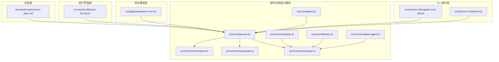
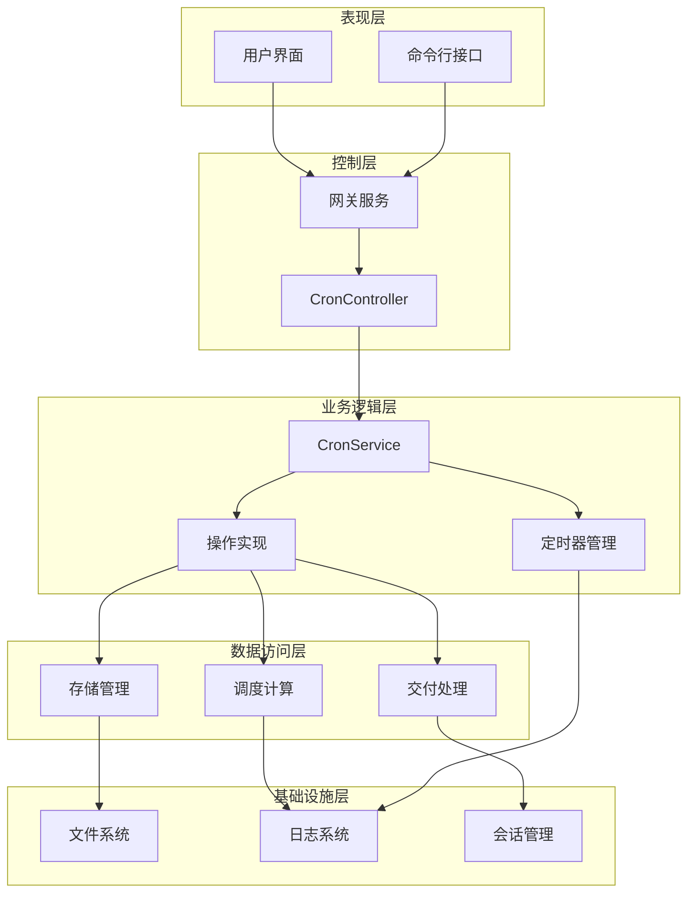
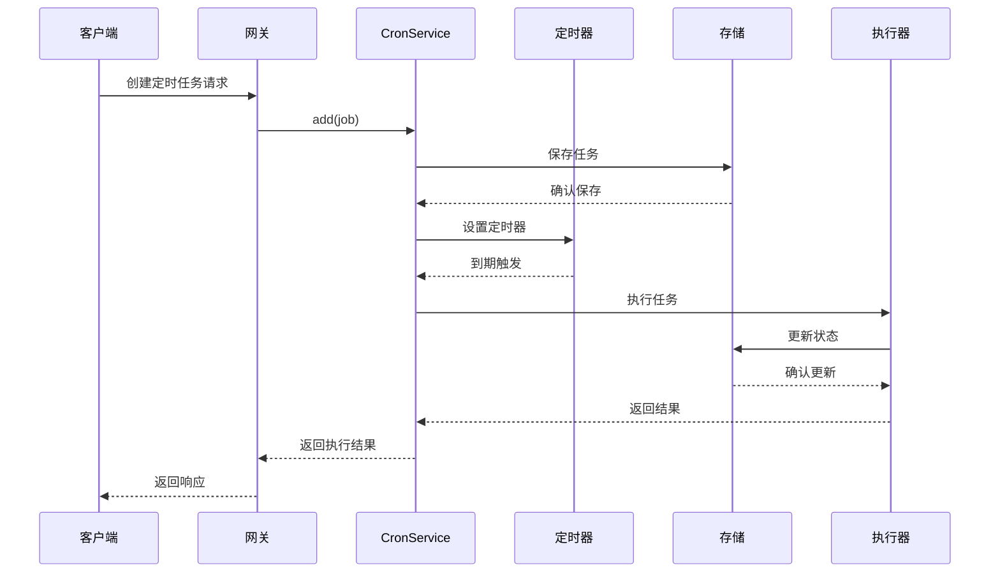
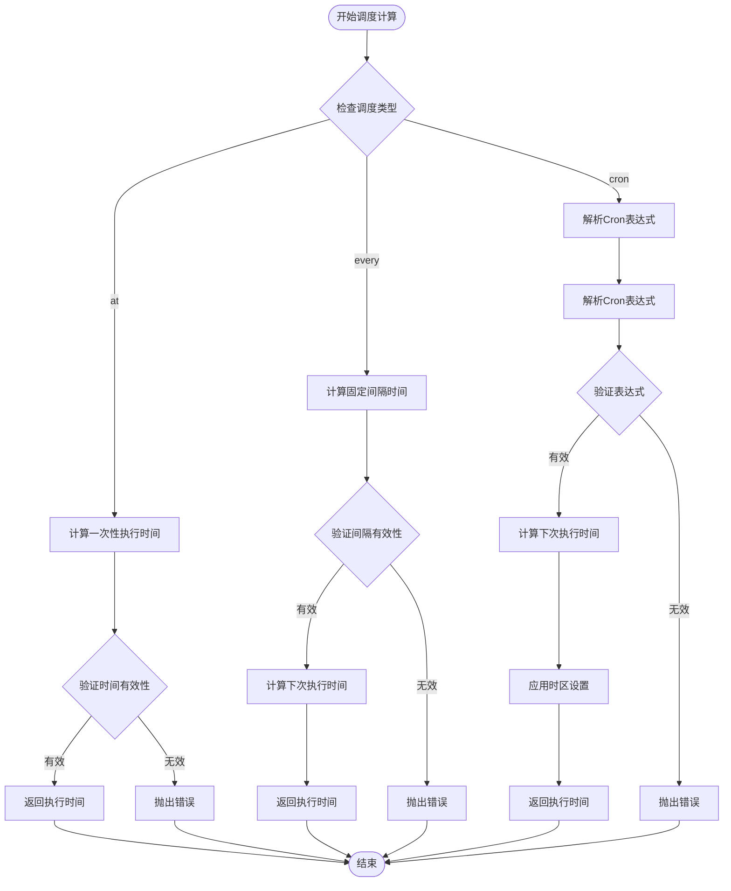
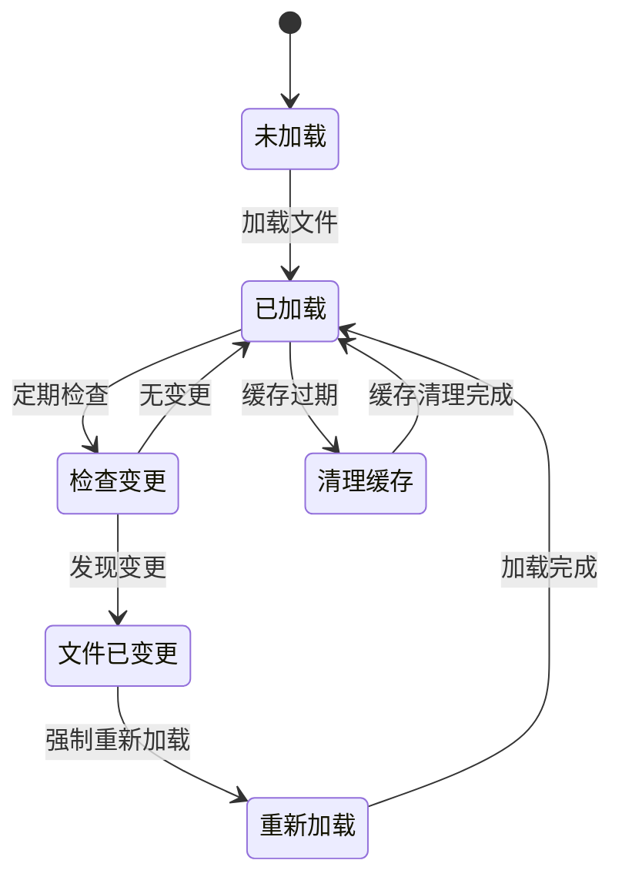
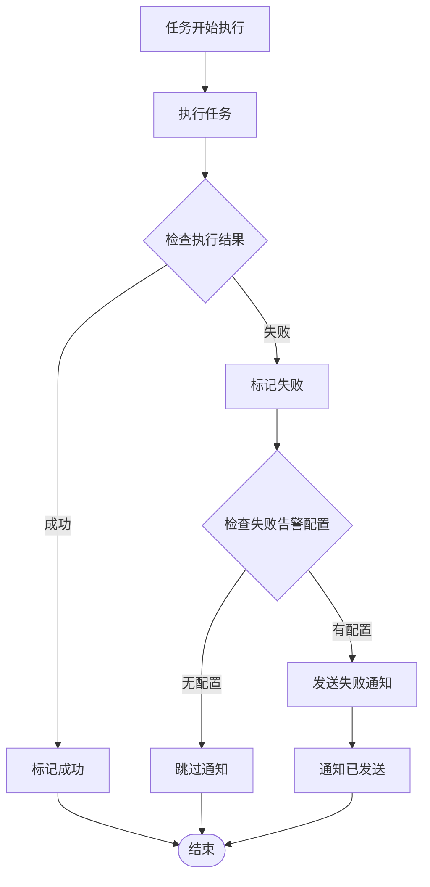
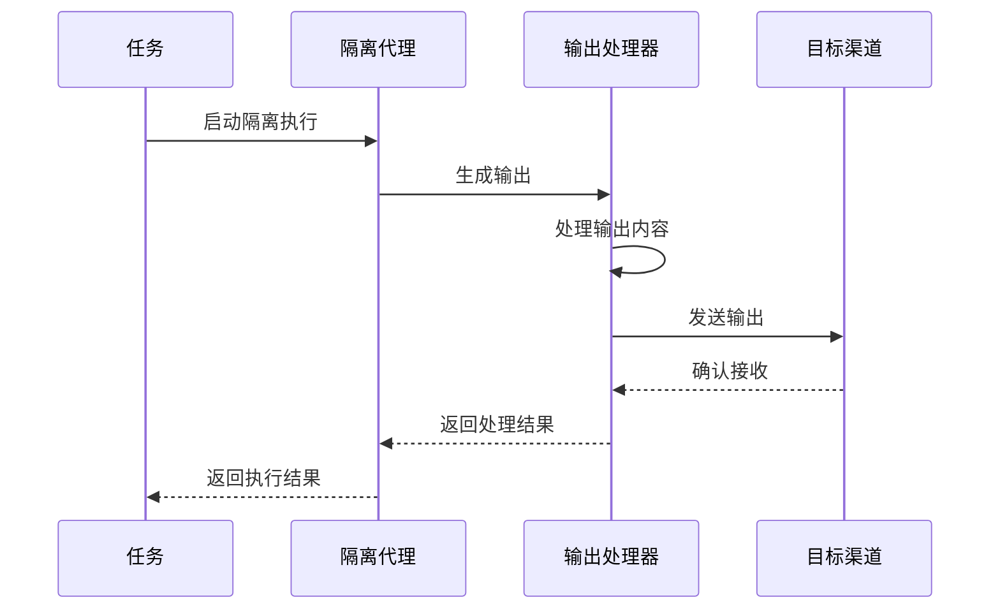
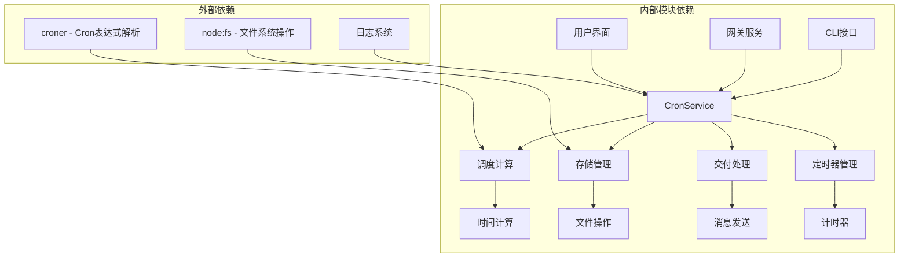
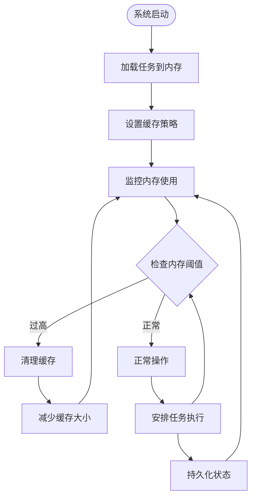
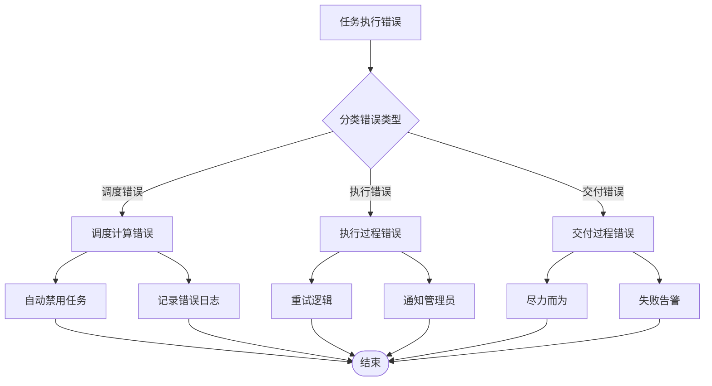

# 定时任务管理系统

<cite>
**本文档引用的文件**
- [src/cron/service.ts](file://src/cron/service.ts)
- [src/cron/types.ts](file://src/cron/types.ts)
- [src/cron/service/state.ts](file://src/cron/service/state.ts)
- [src/cron/service/ops.ts](file://src/cron/service/ops.ts)
- [src/cron/service/store.ts](file://src/cron/service/store.ts)
- [src/cron/schedule.ts](file://src/cron/schedule.ts)
- [src/cron/delivery.ts](file://src/cron/delivery.ts)
- [src/cron/isolated-agent.ts](file://src/cron/isolated-agent.ts)
- [src/cli/cron-cli/register.cron-add.ts](file://src/cli/cron-cli/register.cron-add.ts)
- [src/cli/cron-cli/shared.ts](file://src/cli/cron-cli/shared.ts)
- [src/gateway/server-cron.ts](file://src/gateway/server-cron.ts)
- [docs/automation/cron-jobs.md](file://docs/automation/cron-jobs.md)
- [ui-react/src/lib/cron-format.ts](file://ui-react/src/lib/cron-format.ts)
</cite>

## 目录
1. [简介](#简介)
2. [项目结构](#项目结构)
3. [核心组件](#核心组件)
4. [架构概览](#架构概览)
5. [详细组件分析](#详细组件分析)
6. [依赖关系分析](#依赖关系分析)
7. [性能考虑](#性能考虑)
8. [故障排除指南](#故障排除指南)
9. [结论](#结论)

## 简介

定时任务管理系统是 OpenClaw 平台的核心组件之一，负责在 Gateway 网关内部调度和执行各种自动化任务。该系统提供了强大的定时任务功能，支持多种调度模式，包括一次性任务、重复性任务和复杂的 cron 表达式任务。

系统的主要特点包括：
- **持久化存储**：任务状态和配置存储在 `~/.openclaw/cron/` 目录下，确保重启后任务不会丢失
- **多执行模式**：支持主会话执行和隔离式执行两种模式
- **灵活的调度**：支持 at、every 和 cron 三种调度类型
- **智能唤醒**：支持立即唤醒和下次心跳时唤醒两种模式
- **完整的生命周期管理**：从创建到执行再到清理的完整流程

## 项目结构

定时任务管理系统采用模块化的架构设计，主要包含以下核心目录：



**图表来源**
- [src/cron/service.ts:1-61](file://src/cron/service.ts#L1-L61)
- [src/cron/service/ops.ts:1-570](file://src/cron/service/ops.ts#L1-L570)
- [src/cron/service/state.ts:1-170](file://src/cron/service/state.ts#L1-L170)

**章节来源**
- [src/cron/service.ts:1-61](file://src/cron/service.ts#L1-L61)
- [src/cron/types.ts:1-160](file://src/cron/types.ts#L1-L160)

## 核心组件

定时任务管理系统由多个相互协作的核心组件构成，每个组件都有明确的职责和功能边界。

### CronService 类
CronService 是整个系统的核心控制器，提供统一的 API 接口来管理定时任务。它封装了所有业务逻辑，包括任务的创建、更新、删除、查询和执行。

### CronServiceDeps 依赖注入
通过 CronServiceDeps 接口，系统实现了高度的模块化和可测试性。依赖注入允许我们轻松替换不同的实现，如日志记录器、存储后端、会话管理等。

### CronJob 数据模型
CronJob 是系统中最重要的数据结构，定义了任务的所有属性，包括调度信息、执行参数、交付配置等。系统使用 TypeScript 的类型系统确保数据的完整性和一致性。

**章节来源**
- [src/cron/service.ts:7-60](file://src/cron/service.ts#L7-L60)
- [src/cron/service/state.ts:38-115](file://src/cron/service/state.ts#L38-L115)
- [src/cron/types.ts:135-144](file://src/cron/types.ts#L135-L144)

## 架构概览

定时任务管理系统采用分层架构设计，确保了良好的关注点分离和可维护性。



**图表来源**
- [src/gateway/server-cron.ts:144-166](file://src/gateway/server-cron.ts#L144-L166)
- [src/cron/service.ts:1-61](file://src/cron/service.ts#L1-L61)
- [src/cron/service/ops.ts:1-570](file://src/cron/service/ops.ts#L1-L570)

系统的核心执行流程如下：



**图表来源**
- [src/cron/service/ops.ts:236-268](file://src/cron/service/ops.ts#L236-L268)
- [src/cron/service/store.ts:65-72](file://src/cron/service/store.ts#L65-L72)

## 详细组件分析

### 调度引擎组件

调度引擎是定时任务系统的核心，负责计算任务的执行时间并管理定时器。

#### 调度类型支持

系统支持三种主要的调度类型：

1. **一次性调度 (at)**：基于绝对时间的任务执行
2. **固定间隔调度 (every)**：基于相对时间的重复任务
3. **Cron 表达式调度 (cron)**：基于标准 cron 表达式的复杂调度

#### 时间计算算法



**图表来源**
- [src/cron/schedule.ts:64-139](file://src/cron/schedule.ts#L64-L139)

**章节来源**
- [src/cron/schedule.ts:1-171](file://src/cron/schedule.ts#L1-L171)
- [src/cron/types.ts:5-14](file://src/cron/types.ts#L5-L14)

### 存储管理组件

存储管理组件负责定时任务的持久化存储，确保任务状态在系统重启后能够恢复。

#### 存储文件格式

存储文件采用 JSON 格式，包含版本信息和任务列表：

```json
{
  "version": 1,
  "jobs": [
    {
      "id": "任务ID",
      "name": "任务名称",
      "schedule": {
        "kind": "调度类型",
        "at": "ISO时间戳",
        "everyMs": 间隔毫秒数,
        "expr": "Cron表达式"
      },
      "payload": {
        "kind": "执行负载类型",
        "text": "系统事件文本",
        "message": "代理对话消息"
      },
      "state": {
        "nextRunAtMs": 下次执行时间,
        "runningAtMs": 运行中时间,
        "lastRunAtMs": 最后执行时间
      }
    }
  ]
}
```

#### 文件监控机制

存储管理组件实现了智能的文件监控机制，能够检测文件变化并自动重新加载：



**图表来源**
- [src/cron/service/store.ts:17-49](file://src/cron/service/store.ts#L17-L49)

**章节来源**
- [src/cron/service/store.ts:1-73](file://src/cron/service/store.ts#L1-L73)

### 交付处理组件

交付处理组件负责将任务执行结果发送到指定的目标渠道。

#### 交付模式支持

系统支持三种交付模式：

1. **公告模式 (announce)**：通过消息渠道发送通知
2. **Webhook 模式 (webhook)**：通过 HTTP 请求发送数据
3. **无模式 (none)**：不进行任何交付

#### 失败通知机制

当任务执行失败时，系统会自动发送失败通知到预设的目标：



**图表来源**
- [src/cron/delivery.ts:238-301](file://src/cron/delivery.ts#L238-L301)

**章节来源**
- [src/cron/delivery.ts:1-302](file://src/cron/delivery.ts#L1-L302)

### 隔离式代理执行

隔离式代理执行是定时任务系统的重要特性，允许任务在独立的代理环境中运行，避免对主会话造成影响。

#### 执行环境隔离

隔离式执行为每个任务创建独立的执行环境，包括：

- **独立的会话上下文**：每个任务都有自己的会话键
- **独立的代理实例**：任务在专用的代理环境中运行
- **独立的资源限制**：防止任务占用过多系统资源

#### 输出处理机制

隔离式执行的输出处理机制确保任务结果能够正确传递：



**图表来源**
- [src/cron/isolated-agent.ts:1-2](file://src/cron/isolated-agent.ts#L1-L2)

**章节来源**
- [src/cron/isolated-agent.ts:1-2](file://src/cron/isolated-agent.ts#L1-L2)

## 依赖关系分析

定时任务管理系统具有清晰的依赖关系层次，确保了模块间的松耦合和高内聚。



**图表来源**
- [src/cron/service.ts:1-3](file://src/cron/service.ts#L1-L3)
- [src/cron/service/ops.ts:1-26](file://src/cron/service/ops.ts#L1-L26)

### 关键依赖关系

1. **调度引擎依赖 cron 解析库**：使用 croner 库处理复杂的 cron 表达式
2. **存储层依赖文件系统**：直接操作文件系统进行数据持久化
3. **交付层依赖消息通道**：通过各种消息渠道发送通知
4. **定时器依赖系统时钟**：基于系统时间进行任务调度

**章节来源**
- [src/cron/schedule.ts:1-3](file://src/cron/schedule.ts#L1-L3)
- [src/cron/service/ops.ts:1-26](file://src/cron/service/ops.ts#L1-L26)

## 性能考虑

定时任务管理系统在设计时充分考虑了性能优化，采用了多种策略来确保高效运行。

### 缓存策略

系统实现了多层次的缓存机制：

1. **Cron 表达式缓存**：缓存解析后的 Cron 对象，避免重复解析
2. **时间计算缓存**：缓存最近使用的调度计算结果
3. **文件内容缓存**：缓存存储文件的内容，减少磁盘 I/O

### 内存管理



**图表来源**
- [src/cron/schedule.ts:16-31](file://src/cron/schedule.ts#L16-L31)

### 并发控制

系统采用命令队列机制来控制并发执行：

- **命令队列 Lane**：使用专用的命令队列确保任务按序执行
- **执行槽位限制**：防止同时执行过多任务导致系统过载
- **等待时间监控**：监控任务排队等待时间，及时发现性能问题

**章节来源**
- [src/cron/service/ops.ts:534-555](file://src/cron/service/ops.ts#L534-L555)

## 故障排除指南

定时任务管理系统提供了完善的错误处理和故障排除机制。

### 常见问题诊断

#### 任务无法启动

可能的原因和解决方案：

1. **调度器被禁用**
   - 检查配置中的 `cron.enabled` 设置
   - 确认环境变量 `OPENCLAW_SKIP_CRON` 的值

2. **存储文件损坏**
   - 检查存储文件的 JSON 格式
   - 验证任务数据的完整性

3. **权限问题**
   - 确认对存储目录的读写权限
   - 检查文件系统的可用空间

#### 任务执行失败

系统提供了详细的错误分类和处理机制：



**图表来源**
- [src/cron/service/jobs.ts:299-317](file://src/cron/service/jobs.ts#L299-L317)

### 日志记录策略

系统实现了全面的日志记录机制：

1. **操作日志**：记录所有重要的系统操作
2. **错误日志**：详细记录错误信息和堆栈跟踪
3. **性能日志**：监控系统性能指标
4. **调试日志**：提供详细的调试信息

**章节来源**
- [src/cron/service/jobs.ts:299-317](file://src/cron/service/jobs.ts#L299-L317)
- [src/cron/service/store.ts:51-63](file://src/cron/service/store.ts#L51-L63)

## 结论

定时任务管理系统是一个设计精良、功能完备的企业级解决方案。它通过模块化的设计、清晰的架构层次和完善的错误处理机制，为用户提供了一个可靠、高效的定时任务执行平台。

### 主要优势

1. **高可靠性**：持久化存储确保任务状态不会因系统重启而丢失
2. **灵活性**：支持多种调度模式和执行方式
3. **可扩展性**：模块化设计便于功能扩展和维护
4. **易用性**：提供丰富的 CLI 和 API 接口
5. **可观测性**：完善的日志记录和监控机制

### 技术特色

- **智能调度**：支持复杂的 cron 表达式和自定义调度规则
- **隔离执行**：通过隔离式代理确保任务执行的稳定性
- **智能缓存**：多层缓存机制提升系统性能
- **故障恢复**：自动故障检测和恢复机制
- **安全控制**：严格的权限控制和资源限制

该系统为 OpenClaw 平台提供了强大的自动化能力，是构建复杂业务场景的重要基础设施。