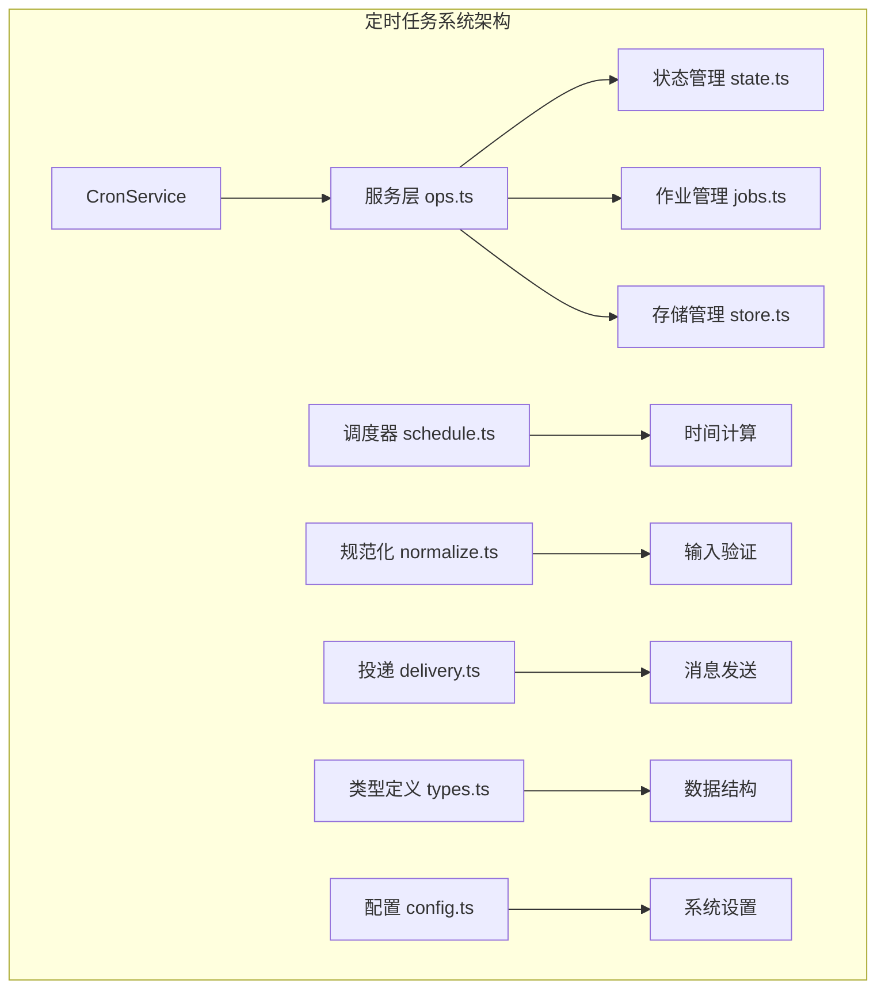
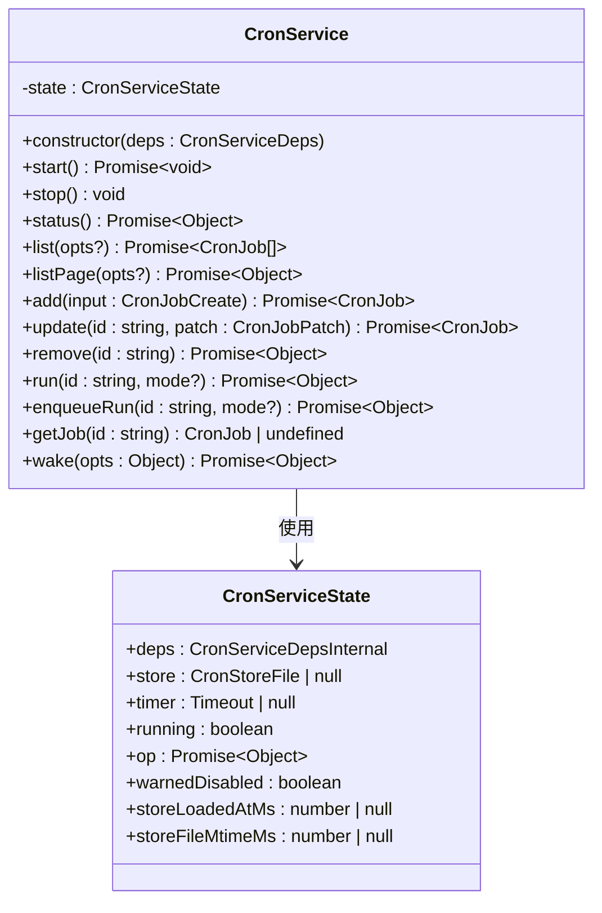
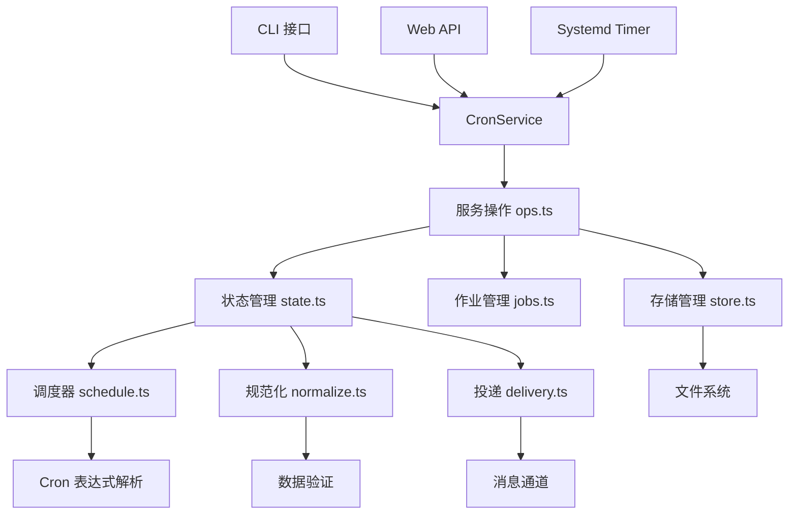
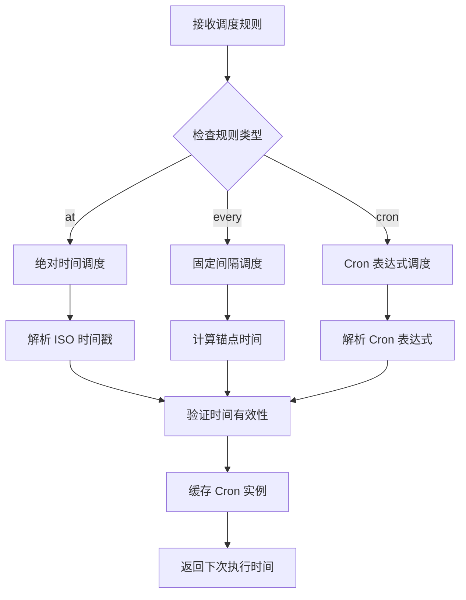
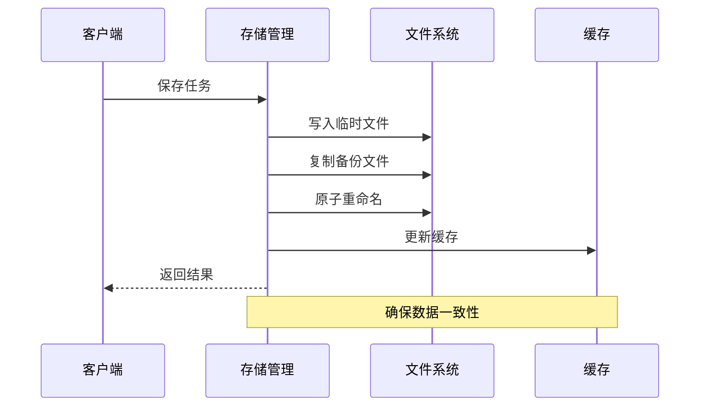
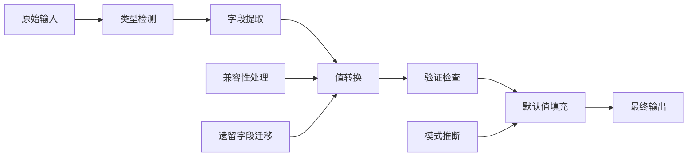
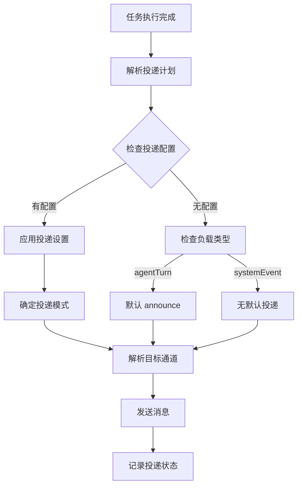
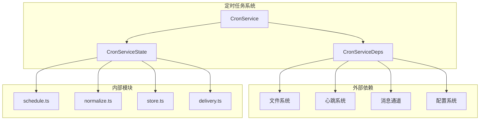

# 定时任务管理系统

<cite>
**本文档引用的文件**
- [src/cron/service.ts](file://src/cron/service.ts)
- [src/cron/service/state.ts](file://src/cron/service/state.ts)
- [src/cron/service/ops.ts](file://src/cron/service/ops.ts)
- [src/cron/store.ts](file://src/cron/store.ts)
- [src/cron/schedule.ts](file://src/cron/schedule.ts)
- [src/cron/normalize.ts](file://src/cron/normalize.ts)
- [src/cron/delivery.ts](file://src/cron/delivery.ts)
- [src/cron/types.ts](file://src/cron/types.ts)
- [docs/zh-CN/automation/cron-jobs.md](file://docs/zh-CN/automation/cron-jobs.md)
- [scripts/systemd/openclaw-auth-monitor.timer](file://scripts/systemd/openclaw-auth-monitor.timer)
- [scripts/systemd/openclaw-auth-monitor.service](file://scripts/systemd/openclaw-auth-monitor.service)
</cite>

## 目录
1. [简介](#简介)
2. [项目结构](#项目结构)
3. [核心组件](#核心组件)
4. [架构概览](#架构概览)
5. [详细组件分析](#详细组件分析)
6. [依赖关系分析](#依赖关系分析)
7. [性能考虑](#性能考虑)
8. [故障排除指南](#故障排除指南)
9. [结论](#结论)

## 简介

定时任务管理系统是 OpenClaw 平台的核心组件之一，负责在 Gateway 网关内部调度和执行各种自动化任务。该系统提供了强大的定时任务功能，包括一次性提醒、周期性任务和基于 Cron 表达式的复杂调度。

系统的主要特点包括：
- **持久化存储**：任务信息存储在 `~/.openclaw/cron/jobs.json` 文件中
- **多执行模式**：支持主会话和隔离式两种执行方式
- **智能唤醒**：可选择立即唤醒或等待下次心跳
- **消息投递**：支持多种消息渠道的自动投递
- **错误处理**：完善的失败通知和重试机制

## 项目结构

定时任务系统主要位于 `src/cron/` 目录下，包含以下核心模块：

**图表来源**
- [src/cron/service.ts:1-61](file://src/cron/service.ts#L1-L61)
- [src/cron/service/ops.ts:1-570](file://src/cron/service/ops.ts#L1-L570)

**章节来源**
- [src/cron/service.ts:1-61](file://src/cron/service.ts#L1-L61)
- [src/cron/service/state.ts:1-170](file://src/cron/service/state.ts#L1-L170)

## 核心组件

### CronService 类

CronService 是整个定时任务系统的核心控制器，提供完整的生命周期管理和操作接口：

**图表来源**
- [src/cron/service.ts:7-60](file://src/cron/service.ts#L7-L60)
- [src/cron/service/state.ts:121-143](file://src/cron/service/state.ts#L121-L143)

### 服务依赖接口

CronService 通过依赖注入的方式接收外部服务：

| 依赖项 | 类型 | 描述 |
|--------|------|------|
| nowMs | Function | 获取当前时间戳的函数 |
| log | Logger | 日志记录器接口 |
| storePath | string | 存储文件路径 |
| cronEnabled | boolean | 是否启用定时任务 |
| enqueueSystemEvent | Function | 入队系统事件 |
| requestHeartbeatNow | Function | 请求立即心跳 |
| runIsolatedAgentJob | Function | 运行隔离式代理任务 |

**章节来源**
- [src/cron/service/state.ts:38-115](file://src/cron/service/state.ts#L38-L115)

## 架构概览

定时任务系统采用分层架构设计，确保了高内聚低耦合的特性：

**图表来源**
- [src/cron/service/ops.ts:1-570](file://src/cron/service/ops.ts#L1-L570)
- [src/cron/schedule.ts:1-171](file://src/cron/schedule.ts#L1-L171)

## 详细组件分析

### 调度器模块

调度器模块负责处理各种类型的调度规则：

**图表来源**
- [src/cron/schedule.ts:64-139](file://src/cron/schedule.ts#L64-L139)

调度器支持三种主要的调度模式：

1. **一次性调度 (at)**：基于绝对时间点的任务执行
2. **固定间隔调度 (every)**：基于固定时间间隔的任务执行  
3. **Cron 表达式调度 (cron)**：基于标准 Cron 表达式的复杂调度

**章节来源**
- [src/cron/schedule.ts:1-171](file://src/cron/schedule.ts#L1-L171)

### 存储管理模块

存储管理模块负责任务数据的持久化：

**图表来源**
- [src/cron/store.ts:63-106](file://src/cron/store.ts#L63-L106)

存储模块的关键特性：
- **原子写入**：使用临时文件和原子重命名确保数据完整性
- **自动备份**：每次修改都会创建备份文件
- **权限控制**：严格设置文件权限 (0600)
- **缓存优化**：内存缓存减少磁盘 I/O

**章节来源**
- [src/cron/store.ts:1-132](file://src/cron/store.ts#L1-L132)

### 规范化模块

规范化模块确保输入数据的格式正确性和一致性：

**图表来源**
- [src/cron/normalize.ts:306-486](file://src/cron/normalize.ts#L306-L486)

规范化过程包括：
1. **类型验证**：确保所有字段类型正确
2. **值转换**：将字符串转换为适当的数值类型
3. **兼容性处理**：支持遗留的数据格式
4. **默认值填充**：为缺失的字段设置合理默认值

**章节来源**
- [src/cron/normalize.ts:1-507](file://src/cron/normalize.ts#L1-L507)

### 投递模块

投递模块负责将任务执行结果发送到指定的消息渠道：

**图表来源**
- [src/cron/delivery.ts:50-102](file://src/cron/delivery.ts#L50-L102)

投递支持三种模式：
- **announce**：通过消息渠道发送
- **webhook**：通过 HTTP 请求发送
- **none**：不进行任何投递

**章节来源**
- [src/cron/delivery.ts:1-302](file://src/cron/delivery.ts#L1-L302)

## 依赖关系分析

定时任务系统与其他组件的依赖关系如下：

**图表来源**
- [src/cron/service/state.ts:1-170](file://src/cron/service/state.ts#L1-L170)
- [src/cron/service/ops.ts:1-570](file://src/cron/service/ops.ts#L1-L570)

**章节来源**
- [src/cron/service/state.ts:1-170](file://src/cron/service/state.ts#L1-L170)
- [src/cron/service/ops.ts:1-570](file://src/cron/service/ops.ts#L1-L570)

## 性能考虑

定时任务系统在设计时充分考虑了性能优化：

### 缓存策略
- **Cron 实例缓存**：最多缓存 512 个 Cron 实例，避免重复解析
- **序列化缓存**：缓存 JSON 序列化结果，减少磁盘 I/O
- **状态缓存**：内存中维护任务状态，提高查询性能

### 并发控制
- **操作锁**：使用互斥锁确保操作的原子性
- **命令队列**：通过命令队列管理并发执行
- **超时控制**：为长时间运行的操作设置超时机制

### 内存管理
- **垃圾回收**：及时清理不再使用的对象
- **内存限制**：对缓存大小进行限制，防止内存泄漏
- **增量更新**：只更新发生变化的部分

## 故障排除指南

### 常见问题及解决方案

| 问题类型 | 症状 | 可能原因 | 解决方案 |
|----------|------|----------|----------|
| 任务未执行 | 任务按时不触发 | 调度时间错误 | 检查时间格式和时区设置 |
| 数据丢失 | 重启后任务消失 | 存储文件损坏 | 检查备份文件和权限设置 |
| 执行超时 | 任务长时间无响应 | 系统资源不足 | 增加超时时间或优化系统配置 |
| 投递失败 | 消息未送达 | 渠道配置错误 | 检查消息通道设置和网络连接 |

### 调试方法

1. **查看日志**：检查系统日志中的错误信息
2. **验证配置**：确认任务配置的正确性
3. **测试连接**：验证消息通道的连通性
4. **监控资源**：观察系统资源使用情况

**章节来源**
- [docs/zh-CN/automation/cron-jobs.md:1-92](file://docs/zh-CN/automation/cron-jobs.md#L1-L92)

## 结论

定时任务管理系统是一个功能完善、设计合理的自动化任务调度平台。其主要优势包括：

1. **可靠性**：通过持久化存储和原子操作确保数据安全
2. **灵活性**：支持多种调度模式和执行方式
3. **可扩展性**：模块化设计便于功能扩展和维护
4. **易用性**：提供简洁的 API 和丰富的配置选项

系统适用于各种自动化场景，从简单的定时提醒到复杂的业务流程自动化，都能提供稳定可靠的支持。通过合理的配置和监控，可以确保系统长期稳定运行。