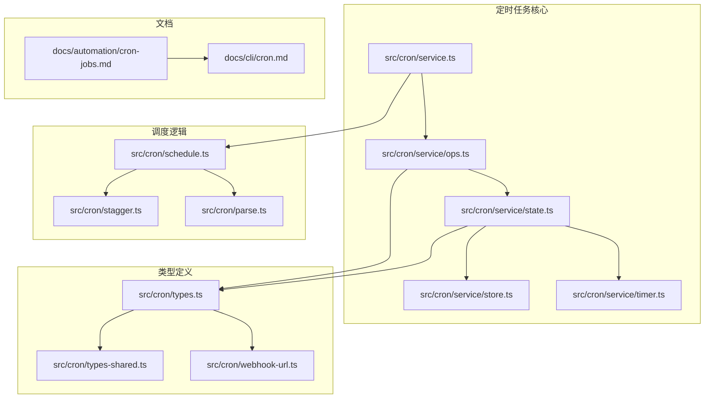
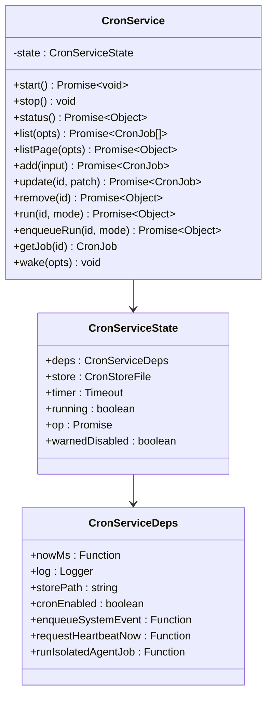
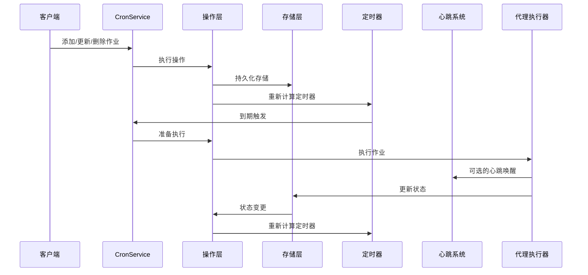
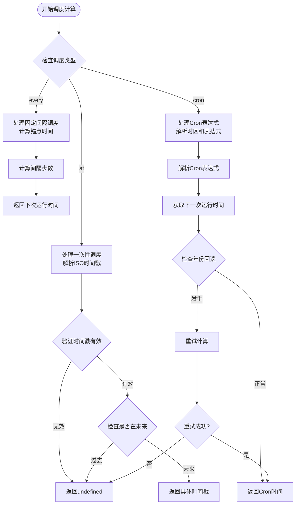
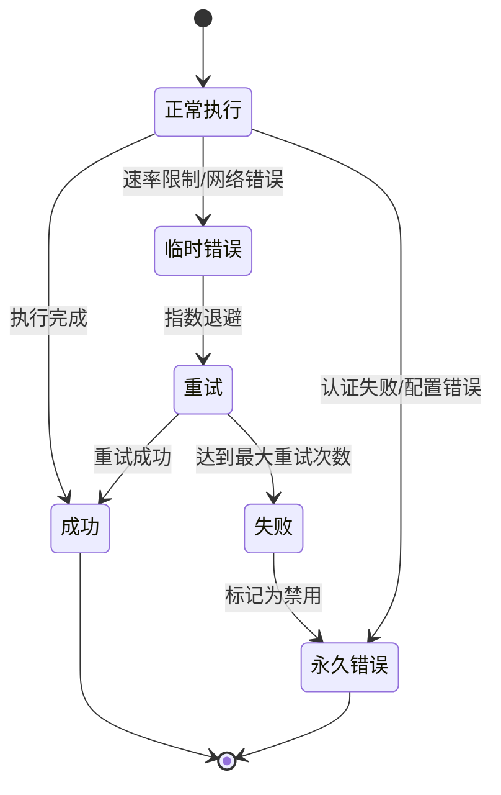
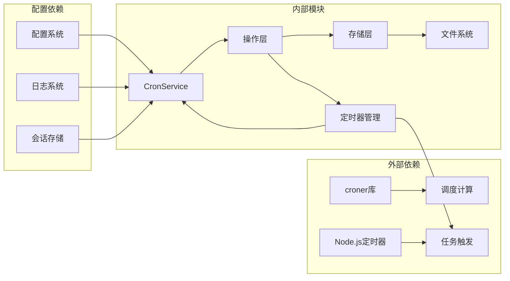

# 定时任务文档

<cite>
**本文档引用的文件**
- [cron-jobs.md](file://docs/automation/cron-jobs.md)
- [cron.md](file://docs/cli/cron.md)
- [service.ts](file://src/cron/service.ts)
- [schedule.ts](file://src/cron/schedule.ts)
- [types.ts](file://src/cron/types.ts)
- [state.ts](file://src/cron/service/state.ts)
- [ops.ts](file://src/cron/service/ops.ts)
- [stagger.ts](file://src/cron/stagger.ts)
- [heartbeat-policy.ts](file://src/cron/heartbeat-policy.ts)
- [service.every-jobs-fire.test.ts](file://src/cron/service.every-jobs-fire.test.ts)
- [service.skips-main-jobs-empty-systemevent-text.test.ts](file://src/cron/service.skips-main-jobs-empty-systemevent-text.test.ts)
</cite>

## 目录
1. [简介](#简介)
2. [项目结构](#项目结构)
3. [核心组件](#核心组件)
4. [架构概览](#架构概览)
5. [详细组件分析](#详细组件分析)
6. [依赖关系分析](#依赖关系分析)
7. [性能考虑](#性能考虑)
8. [故障排除指南](#故障排除指南)
9. [结论](#结论)

## 简介

OpenClaw 的定时任务系统（Cron）是网关内置的调度器，负责持久化管理后台作业、在正确时间唤醒代理以及可选地将输出发送到聊天通道。该系统支持多种调度模式，包括一次性提醒、固定间隔重复和标准 Cron 表达式，并提供两种执行模式：主会话（main）和隔离会话（isolated）。

## 项目结构

定时任务系统主要分布在以下目录中：

**图表来源**
- [service.ts:1-61](file://src/cron/service.ts#L1-L61)
- [schedule.ts:1-171](file://src/cron/schedule.ts#L1-L171)
- [types.ts:1-160](file://src/cron/types.ts#L1-L160)

**章节来源**
- [cron-jobs.md:1-687](file://docs/automation/cron-jobs.md#L1-L687)
- [cron.md:1-78](file://docs/cli/cron.md#L1-L78)

## 核心组件

### CronService 类

CronService 是定时任务系统的主要入口点，提供了完整的 CRUD 操作和生命周期管理：

**图表来源**
- [service.ts:7-60](file://src/cron/service.ts#L7-L60)
- [state.ts:121-130](file://src/cron/service/state.ts#L121-L130)
- [state.ts:38-115](file://src/cron/service/state.ts#L38-L115)

### 调度系统

调度系统基于 croner 库实现，支持三种调度模式：

1. **一次性调度（at）**：基于绝对时间戳
2. **固定间隔（every）**：基于毫秒间隔
3. **Cron 表达式（cron）**：标准 Cron 语法

**章节来源**
- [service.ts:1-61](file://src/cron/service.ts#L1-L61)
- [schedule.ts:64-139](file://src/cron/schedule.ts#L64-L139)
- [types.ts:5-14](file://src/cron/types.ts#L5-L14)

## 架构概览

定时任务系统的整体架构如下：

**图表来源**
- [ops.ts:92-131](file://src/cron/service/ops.ts#L92-L131)
- [state.ts:121-130](file://src/cron/service/state.ts#L121-L130)

## 详细组件分析

### 调度算法实现

调度算法处理了多种边界情况和时区问题：

**图表来源**
- [schedule.ts:64-139](file://src/cron/schedule.ts#L64-L139)

### 执行策略

系统支持两种执行模式：

#### 主会话执行（Main Session）
- 将系统事件排队到心跳队列
- 可选择立即或等待下一个心跳
- 使用共享的主会话上下文

#### 隔离会话执行（Isolated Session）
- 在独立的 `cron:<jobId>` 会话中运行
- 每次运行都有新的会话 ID
- 支持独立的交付配置

**章节来源**
- [service.every-jobs-fire.test.ts:44-77](file://src/cron/service.every-jobs-fire.test.ts#L44-L77)
- [heartbeat-policy.ts:31-48](file://src/cron/heartbeat-policy.ts#L31-L48)

### 错误处理和重试机制

系统实现了智能的错误分类和重试策略：

**图表来源**
- [cron-jobs.md:368-400](file://docs/automation/cron-jobs.md#L368-L400)

**章节来源**
- [cron-jobs.md:368-400](file://docs/automation/cron-jobs.md#L368-L400)

## 依赖关系分析

定时任务系统的关键依赖关系：

**图表来源**
- [schedule.ts:1-3](file://src/cron/schedule.ts#L1-L3)
- [ops.ts:1-26](file://src/cron/service/ops.ts#L1-L26)

**章节来源**
- [state.ts:38-115](file://src/cron/service/state.ts#L38-L115)

## 性能考虑

### 缓存优化
- Cron 表达式解析结果缓存（最多 512 个条目）
- 自动清理最旧的缓存项
- 避免重复解析相同的 Cron 表达式

### 内存管理
- 作业状态只在内存中维护
- 文件存储采用增量更新策略
- 运行历史记录自动清理

### 并发控制
- 操作使用互斥锁确保线程安全
- 命令队列限制并发执行数量
- 手动运行排队避免资源竞争

## 故障排除指南

### 常见问题诊断

#### 作业不执行
1. 检查 Cron 是否启用
2. 验证主机时间和时区设置
3. 确认作业状态不是 "skipped"

#### 重复执行问题
1. 检查 `runningAtMs` 标记是否清理
2. 验证定时器是否正确重新设置
3. 确认没有并发执行冲突

#### 交付失败
1. 检查目标通道配置
2. 验证认证凭据有效性
3. 查看运行日志中的错误信息

**章节来源**
- [service.skips-main-jobs-empty-systemevent-text.test.ts:62-83](file://src/cron/service.skips-main-jobs-empty-systemevent-text.test.ts#L62-L83)

### 测试覆盖

系统包含全面的测试用例，涵盖各种边界情况：

- **调度准确性测试**：验证不同调度类型的执行时机
- **时区处理测试**：处理跨时区的调度问题
- **错误恢复测试**：验证系统在异常情况下的恢复能力
- **性能测试**：确保高负载下的稳定性

**章节来源**
- [service.every-jobs-fire.test.ts:44-77](file://src/cron/service.every-jobs-fire.test.ts#L44-L77)

## 结论

OpenClaw 的定时任务系统是一个功能完整、设计合理的调度框架。它提供了灵活的调度选项、可靠的持久化机制、智能的错误处理和良好的性能特性。通过清晰的架构分离和完善的测试覆盖，该系统能够满足从简单的一次性提醒到复杂的周期性任务的各种需求。

系统的主要优势包括：
- 支持多种调度模式，适应不同的使用场景
- 内置的错误处理和重试机制提高可靠性
- 灵活的交付选项满足不同的输出需求
- 优秀的性能表现适合生产环境使用