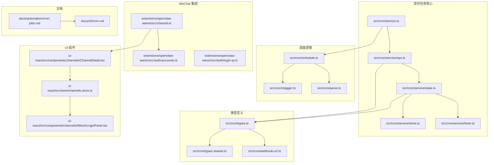
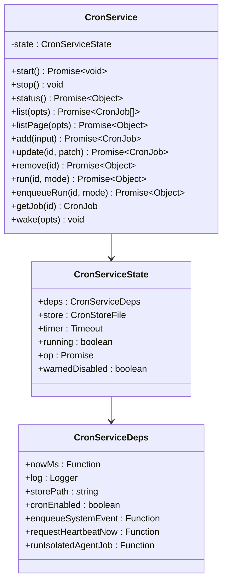
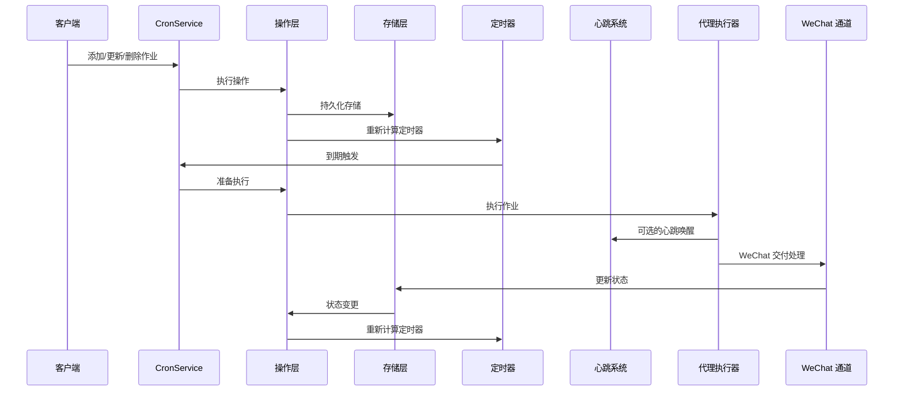
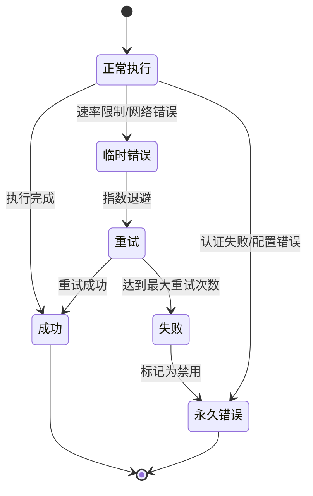
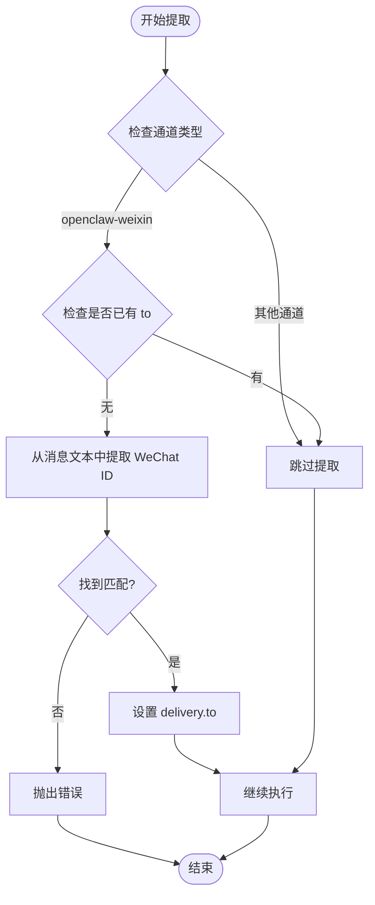
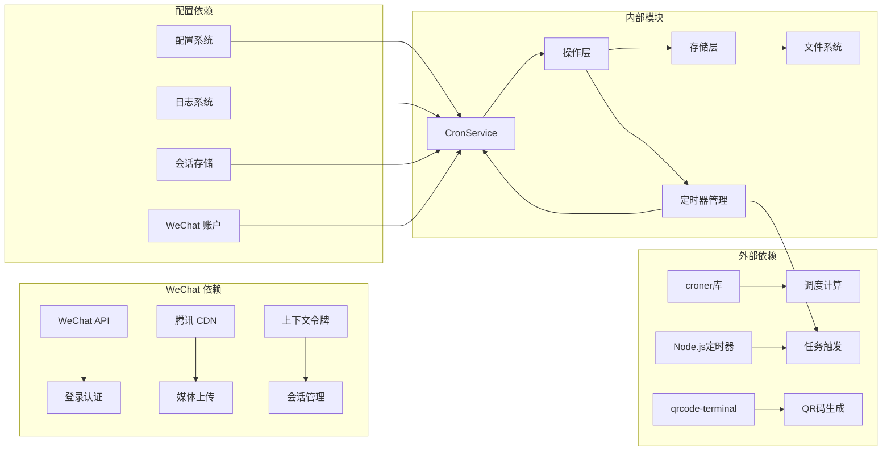

# 定时任务文档

<cite>
**本文档引用的文件**
- [cron-jobs.md](file://docs/automation/cron-jobs.md)
- [cron.md](file://docs/cli/cron.md)
- [service.ts](file://src/cron/service.ts)
- [schedule.ts](file://src/cron/schedule.ts)
- [types.ts](file://src/cron/types.ts)
- [state.ts](file://src/cron/service/state.ts)
- [ops.ts](file://src/cron/service/ops.ts)
- [stagger.ts](file://src/cron/stagger.ts)
- [heartbeat-policy.ts](file://src/cron/heartbeat-policy.ts)
- [service.every-jobs-fire.test.ts](file://src/cron/service.every-jobs-fire.test.ts)
- [service.skips-main-jobs-empty-systemevent-text.test.ts](file://src/cron/service.skips-main-jobs-empty-systemevent-text.test.ts)
- [cron-tool.ts](file://src/agents/tools/cron-tool.ts)
- [channel.ts](file://extensions/openclaw-weixin/src/channel.ts)
- [accounts.ts](file://extensions/openclaw-weixin/src/auth/accounts.ts)
- [ChannelDetail.tsx](file://ui-react/src/components/channels/ChannelDetail.tsx)
- [channels.store.ts](file://ui-react/src/store/channels.store.ts)
- [WeixinLoginPanel.tsx](file://ui-react/src/components/channels/WeixinLoginPanel.tsx)
- [agents.ts](file://ui-react/src/types/agents.ts)
- [README.md](file://extensions/openclaw-weixin/README.md)
- [weixin-cli.ts](file://extensions/openclaw-weixin/src/weixin-cli.ts)
</cite>

## 更新摘要
**所做更改**
- 新增 WeChat 集成支持章节，详细介绍 WeChat 通道的配置和使用
- 添加自动 WeChat ID 提取功能说明，解释 LLM 如何自动识别和提取 WeChat 用户 ID
- 更新通道选择器功能描述，说明多账户上下文隔离机制
- 增加 WeChat 登录面板的 UI 组件说明
- 补充 WeChat 专用的交付配置要求和最佳实践

## 目录
1. [简介](#简介)
2. [项目结构](#项目结构)
3. [核心组件](#核心组件)
4. [架构概览](#架构概览)
5. [详细组件分析](#详细组件分析)
6. [WeChat 集成支持](#wechat-集成支持)
7. [自动 WeChat ID 提取](#自动-wechat-id-提取)
8. [通道选择器功能](#通道选择器功能)
9. [依赖关系分析](#依赖关系分析)
10. [性能考虑](#性能考虑)
11. [故障排除指南](#故障排除指南)
12. [结论](#结论)

## 简介

OpenClaw 的定时任务系统（Cron）是网关内置的调度器，负责持久化管理后台作业、在正确时间唤醒代理以及可选地将输出发送到聊天通道。该系统支持多种调度模式，包括一次性提醒、固定间隔重复和标准 Cron 表达式，并提供两种执行模式：主会话（main）和隔离会话（isolated）。

**最新更新**：系统现已支持 WeChat 集成，包括自动 WeChat ID 提取、多账户上下文隔离和专用的通道选择器功能。

## 项目结构

定时任务系统主要分布在以下目录中：



**图表来源**
- [service.ts:1-61](file://src/cron/service.ts#L1-L61)
- [schedule.ts:1-171](file://src/cron/schedule.ts#L1-L171)
- [types.ts:1-160](file://src/cron/types.ts#L1-L160)
- [channel.ts:130-472](file://extensions/openclaw-weixin/src/channel.ts#L130-L472)
- [accounts.ts:355-381](file://extensions/openclaw-weixin/src/auth/accounts.ts#L355-L381)

**章节来源**
- [cron-jobs.md:1-687](file://docs/automation/cron-jobs.md#L1-L687)
- [cron.md:1-78](file://docs/cli/cron.md#L1-L78)

## 核心组件

### CronService 类

CronService 是定时任务系统的主要入口点，提供了完整的 CRUD 操作和生命周期管理：



**图表来源**
- [service.ts:7-60](file://src/cron/service.ts#L7-L60)
- [state.ts:121-130](file://src/cron/service/state.ts#L121-L130)
- [state.ts:38-115](file://src/cron/service/state.ts#L38-L115)

### 调度系统

调度系统基于 croner 库实现，支持三种调度模式：

1. **一次性调度（at）**：基于绝对时间戳
2. **固定间隔（every）**：基于毫秒间隔
3. **Cron 表达式（cron）**：标准 Cron 语法

**章节来源**
- [service.ts:1-61](file://src/cron/service.ts#L1-L61)
- [schedule.ts:64-139](file://src/cron/schedule.ts#L64-L139)
- [types.ts:5-14](file://src/cron/types.ts#L5-L14)

## 架构概览

定时任务系统的整体架构如下：



**图表来源**
- [ops.ts:92-131](file://src/cron/service/ops.ts#L92-L131)
- [state.ts:121-130](file://src/cron/service/state.ts#L121-L130)

## 详细组件分析

### 调度算法实现

调度算法处理了多种边界情况和时区问题：


**图表来源**
- [schedule.ts:64-139](file://src/cron/schedule.ts#L64-L139)

### 执行策略

系统支持两种执行模式：

#### 主会话执行（Main Session）
- 将系统事件排队到心跳队列
- 可选择立即或等待下一个心跳
- 使用共享的主会话上下文

#### 隔离会话执行（Isolated Session）
- 在独立的 `cron:<jobId>` 会话中运行
- 每次运行都有新的会话 ID
- 支持独立的交付配置

**章节来源**
- [service.every-jobs-fire.test.ts:44-77](file://src/cron/service.every-jobs-fire.test.ts#L44-L77)
- [heartbeat-policy.ts:31-48](file://src/cron/heartbeat-policy.ts#L31-L48)

### 错误处理和重试机制

系统实现了智能的错误分类和重试策略：



**图表来源**
- [cron-jobs.md:368-400](file://docs/automation/cron-jobs.md#L368-L400)

**章节来源**
- [cron-jobs.md:368-400](file://docs/automation/cron-jobs.md#L368-L400)

## WeChat 集成支持

### WeChat 通道配置

OpenClaw 现已完全支持 WeChat 集成，提供以下核心功能：

#### 通道元数据
- **ID**: `openclaw-weixin`
- **标签**: WeChat（长轮询）
- **文档路径**: `/channels/openclaw-weixin`
- **能力**: 直接聊天、媒体支持、阻塞流式传输

#### 登录流程
1. **QR 码生成**: 系统生成 WeChat 登录二维码
2. **用户扫描**: 用户使用 WeChat 扫描二维码并确认授权
3. **凭证保存**: 自动保存访问令牌和基础 URL
4. **账户注册**: 将新账户添加到索引文件中

#### 多账户支持
- 支持同时在线的多个 WeChat 账户
- 每个账户独立的会话管理和上下文隔离
- 自动清理过期账户和重复绑定

**章节来源**
- [channel.ts:130-175](file://extensions/openclaw-weixin/src/channel.ts#L130-L175)
- [accounts.ts:48-107](file://extensions/openclaw-weixin/src/auth/accounts.ts#L48-L107)

### WeChat 交付配置

#### 必需配置项
当使用 `openclaw-weixin` 通道时，必须明确指定以下配置：

- **delivery.to**: WeChat 用户 ID（格式：`<id>@im.wechat`）
- **delivery.accountId**: 当前账户 ID

#### 自动配置处理
系统会自动处理以下配置：

- **上下文令牌**: 自动从会话中提取
- **基础 URL**: 从账户配置中继承
- **CDN 基础 URL**: 默认使用腾讯 CDN

**章节来源**
- [channel.ts:165-173](file://extensions/openclaw-weixin/src/channel.ts#L165-L173)
- [cron-tool.ts:444-468](file://src/agents/tools/cron-tool.ts#L444-L468)

## 自动 WeChat ID 提取

### ID 提取机制

系统具备智能的 WeChat ID 提取能力，可从消息文本中自动识别用户 ID：

#### 提取规则
- 匹配任何以 `@im.wechat` 结尾的令牌
- 支持多种分隔符（空格、换行等）
- 自动去除多余的空白字符

#### 提取流程


**图表来源**
- [cron-tool.ts:444-468](file://src/agents/tools/cron-tool.ts#L444-L468)

#### 提取示例
```javascript
// 支持的 WeChat ID 格式
"abc123@im.wechat"
"user456@im.wechat"
"test789@im.wechat"
```

**章节来源**
- [cron-tool.ts:444-468](file://src/agents/tools/cron-tool.ts#L444-L468)

## 通道选择器功能

### 多账户上下文隔离

系统提供强大的多账户上下文隔离机制：

#### 上下文隔离配置
```bash
openclaw config set agents.mode per-channel-per-peer
```

此配置为每个 "WeChat 账户 + 消息发送者" 组合提供独立的 AI 内存，防止账户间的上下文交叉污染。

#### 账户解析优先级
1. **显式指定**: 使用 `delivery.accountId` 明确指定账户
2. **上下文匹配**: 基于收件人的上下文令牌自动匹配
3. **单账户**: 如果只有一个账户，则直接使用
4. **错误处理**: 如果无法确定账户，则抛出明确的错误信息

#### 账户管理功能
- **账户列表**: 支持列出所有已注册的 WeChat 账户
- **账户切换**: 支持在不同账户间切换
- **账户清理**: 自动清理过期和重复的账户
- **用户 ID 关联**: 防止同一 WeChat 用户的多个账户冲突

**章节来源**
- [channel.ts:52-102](file://extensions/openclaw-weixin/src/channel.ts#L52-L102)
- [accounts.ts:83-107](file://extensions/openclaw-weixin/src/auth/accounts.ts#L83-L107)

## 依赖关系分析

定时任务系统的关键依赖关系：



**图表来源**
- [schedule.ts:1-3](file://src/cron/schedule.ts#L1-L3)
- [ops.ts:1-26](file://src/cron/service/ops.ts#L1-L26)
- [channel.ts:23-30](file://extensions/openclaw-weixin/src/channel.ts#L23-L30)

**章节来源**
- [state.ts:38-115](file://src/cron/service/state.ts#L38-L115)

## 性能考虑

### 缓存优化
- Cron 表达式解析结果缓存（最多 512 个条目）
- 自动清理最旧的缓存项
- 避免重复解析相同的 Cron 表达式

### 内存管理
- 作业状态只在内存中维护
- 文件存储采用增量更新策略
- 运行历史记录自动清理

### 并发控制
- 操作使用互斥锁确保线程安全
- 命令队列限制并发执行数量
- 手动运行排队避免资源竞争

### WeChat 特定优化
- **上下文令牌缓存**: 避免重复查询相同的上下文令牌
- **账户状态缓存**: 减少账户解析的开销
- **媒体文件缓存**: 重用已下载的媒体文件
- **会话超时处理**: 智能检测和恢复断开的会话

## 故障排除指南

### 常见问题诊断

#### 作业不执行
1. 检查 Cron 是否启用
2. 验证主机时间和时区设置
3. 确认作业状态不是 "skipped"

#### WeChat 相关问题
1. **登录失败**: 检查 WeChat 网络连接和二维码状态
2. **消息发送失败**: 验证 `delivery.to` 和 `delivery.accountId` 配置
3. **ID 提取失败**: 确认消息文本中包含有效的 WeChat ID
4. **多账户冲突**: 检查上下文令牌是否正确关联到特定账户

#### 重复执行问题
1. 检查 `runningAtMs` 标记是否清理
2. 验证定时器是否正确重新设置
3. 确认没有并发执行冲突

#### 交付失败
1. 检查目标通道配置
2. 验证认证凭据有效性
3. 查看运行日志中的错误信息

**章节来源**
- [service.skips-main-jobs-empty-systemevent-text.test.ts:62-83](file://src/cron/service.skips-main-jobs-empty-systemevent-text.test.ts#L62-L83)

### 测试覆盖

系统包含全面的测试用例，涵盖各种边界情况：

- **调度准确性测试**：验证不同调度类型的执行时机
- **时区处理测试**：处理跨时区的调度问题
- **错误恢复测试**：验证系统在异常情况下的恢复能力
- **WeChat 集成测试**：验证 QR 登录、ID 提取和多账户功能
- **性能测试**：确保高负载下的稳定性

**章节来源**
- [service.every-jobs-fire.test.ts:44-77](file://src/cron/service.every-jobs-fire.test.ts#L44-L77)

## 结论

OpenClaw 的定时任务系统是一个功能完整、设计合理的调度框架。它提供了灵活的调度选项、可靠的持久化机制、智能的错误处理和良好的性能特性。

**最新增强功能**：
- **WeChat 集成**: 完整的 WeChat 通道支持，包括 QR 登录和消息传递
- **自动 ID 提取**: 智能识别和提取 WeChat 用户 ID，简化配置过程
- **多账户隔离**: 支持多个 WeChat 账户的独立上下文管理
- **UI 支持**: 提供直观的 WeChat 登录界面和状态监控

系统的主要优势包括：
- 支持多种调度模式，适应不同的使用场景
- 内置的 WeChat 集成提供无缝的消息传递体验
- 智能的 ID 提取功能减少手动配置工作量
- 灵活的多账户上下文隔离机制
- 优秀的性能表现适合生产环境使用
- 完善的错误处理和重试机制
- 直观的 Web 界面和 CLI 工具支持

通过这些增强功能，OpenClaw 的定时任务系统现在能够更好地服务于需要 WeChat 集成的企业级应用场景，为用户提供更加便捷和可靠的任务自动化解决方案。