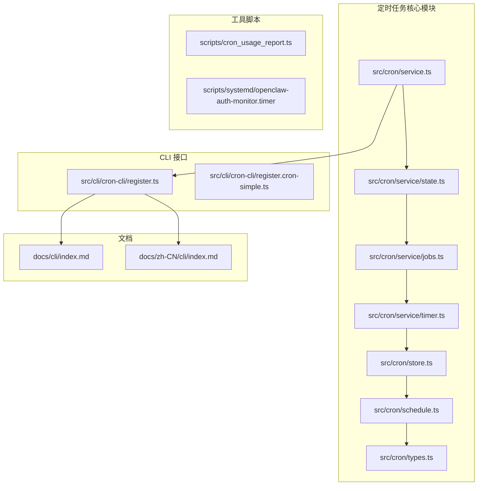
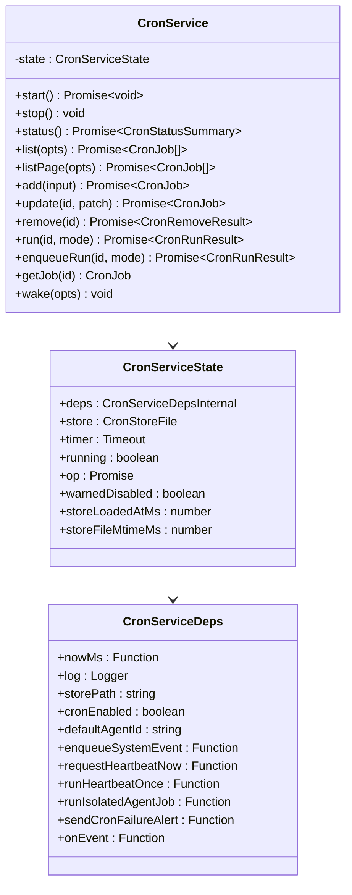
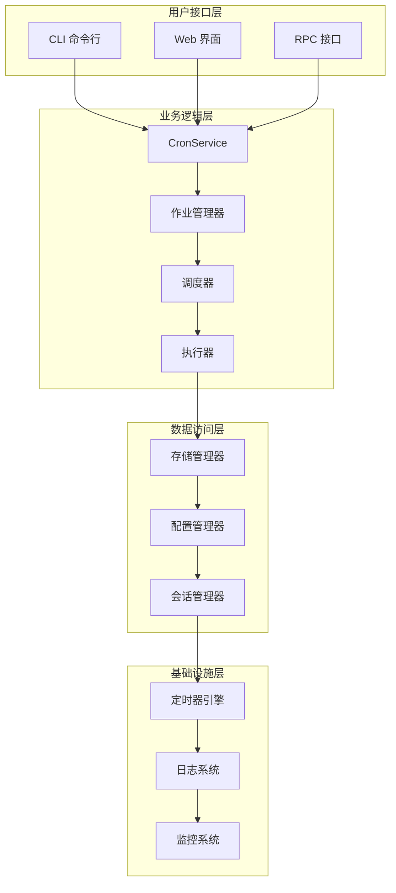
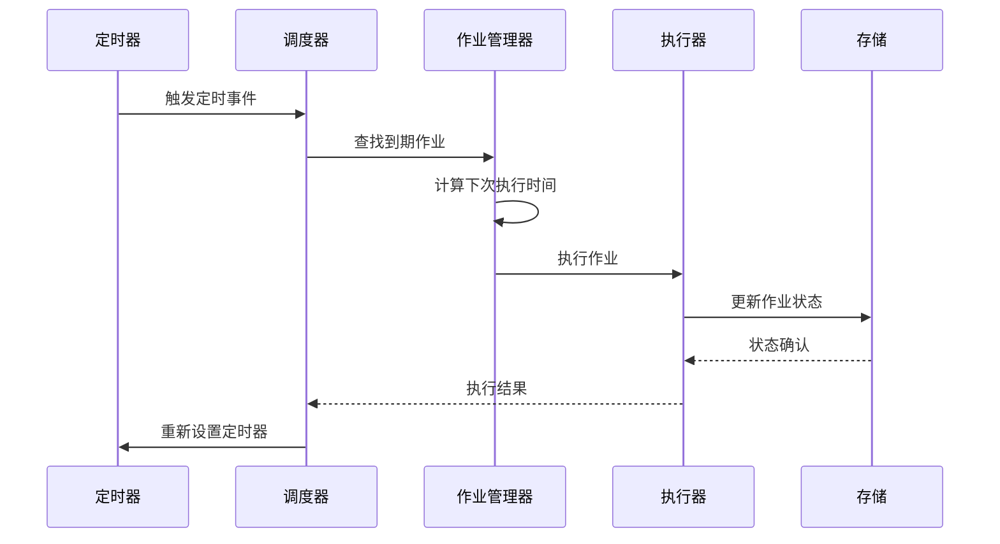
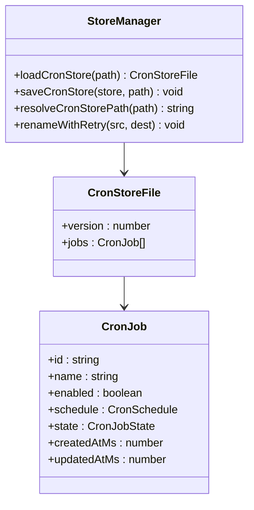
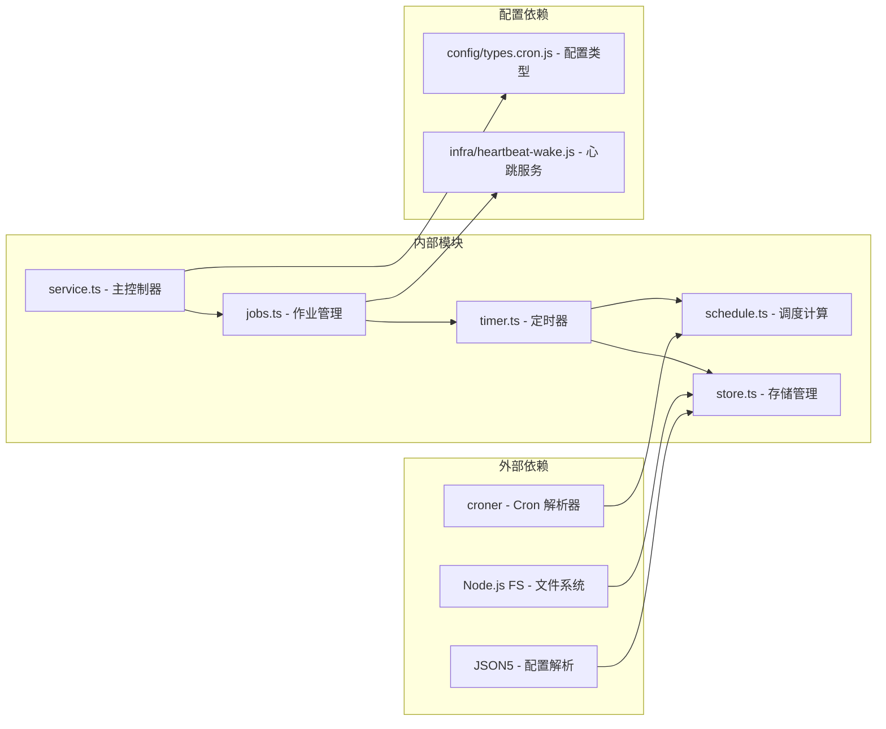

# 定时任务管理系统增强

<cite>
**本文档引用的文件**
- [src/cron/service.ts](file://src/cron/service.ts)
- [src/cron/service/state.ts](file://src/cron/service/state.ts)
- [src/cron/service/jobs.ts](file://src/cron/service/jobs.ts)
- [src/cron/service/timer.ts](file://src/cron/service/timer.ts)
- [src/cron/types.ts](file://src/cron/types.ts)
- [src/cron/store.ts](file://src/cron/store.ts)
- [src/cron/schedule.ts](file://src/cron/schedule.ts)
- [scripts/cron_usage_report.ts](file://scripts/cron_usage_report.ts)
- [scripts/systemd/openclaw-auth-monitor.timer](file://scripts/systemd/openclaw-auth-monitor.timer)
- [src/cli/cron-cli/register.ts](file://src/cli/cron-cli/register.ts)
- [src/cli/cron-cli/register.cron-simple.ts](file://src/cli/cron-cli/register.cron-simple.ts)
- [docs/cli/index.md](file://docs/cli/index.md)
- [docs/zh-CN/cli/index.md](file://docs/zh-CN/cli/index.md)
</cite>

## 目录
1. [简介](#简介)
2. [项目结构](#项目结构)
3. [核心组件](#核心组件)
4. [架构概览](#架构概览)
5. [详细组件分析](#详细组件分析)
6. [依赖关系分析](#依赖关系分析)
7. [性能考虑](#性能考虑)
8. [故障排除指南](#故障排除指南)
9. [结论](#结论)
10. [附录](#附录)

## 简介

定时任务管理系统是 OpenClaw 平台的核心功能模块，负责管理和执行各种周期性任务。该系统提供了强大的调度能力，支持多种时间表达式、错误处理机制、重试策略和监控功能。

系统的主要特性包括：
- 多种调度模式：一次性、固定间隔、Cron 表达式
- 智能错误处理和重试机制
- 会话管理和状态持久化
- 详细的运行日志和统计信息
- CLI 和 Web 界面管理接口
- 系统集成和自动化监控

## 项目结构

定时任务管理系统采用模块化设计，主要包含以下核心目录：



**图表来源**
- [src/cron/service.ts:1-60](file://src/cron/service.ts#L1-L60)
- [src/cron/service/state.ts:1-170](file://src/cron/service/state.ts#L1-L170)
- [src/cli/cron-cli/register.ts:1-27](file://src/cli/cron-cli/register.ts#L1-L27)

**章节来源**
- [src/cron/service.ts:1-60](file://src/cron/service.ts#L1-L60)
- [src/cron/service/state.ts:1-170](file://src/cron/service/state.ts#L1-L170)
- [src/cron/service/jobs.ts:1-800](file://src/cron/service/jobs.ts#L1-L800)
- [src/cron/service/timer.ts:1-800](file://src/cron/service/timer.ts#L1-L800)

## 核心组件

### CronService 类

CronService 是整个定时任务系统的核心控制器，提供完整的生命周期管理：



**图表来源**
- [src/cron/service.ts:7-60](file://src/cron/service.ts#L7-L60)
- [src/cron/service/state.ts:121-143](file://src/cron/service/state.ts#L121-L143)
- [src/cron/service/state.ts:38-115](file://src/cron/service/state.ts#L38-L115)

### 调度类型系统

系统支持多种调度模式，通过统一的类型定义实现：

| 调度类型 | 描述 | 使用场景 |
|---------|------|----------|
| `at` | 绝对时间一次性执行 | 特定时刻的任务执行 |
| `every` | 固定间隔重复执行 | 周期性检查和维护 |
| `cron` | Cron 表达式调度 | 复杂的时间规律任务 |

**章节来源**
- [src/cron/types.ts:5-14](file://src/cron/types.ts#L5-L14)
- [src/cron/types.ts:135-144](file://src/cron/types.ts#L135-L144)

## 架构概览

定时任务系统采用分层架构设计，确保高内聚低耦合：



**图表来源**
- [src/cron/service.ts:13-60](file://src/cron/service.ts#L13-L60)
- [src/cron/service/jobs.ts:503-560](file://src/cron/service/jobs.ts#L503-L560)
- [src/cron/service/timer.ts:572-731](file://src/cron/service/timer.ts#L572-L731)

## 详细组件分析

### 调度引擎

调度引擎是系统的核心，负责计算任务的执行时机：



**图表来源**
- [src/cron/service/timer.ts:572-731](file://src/cron/service/timer.ts#L572-L731)
- [src/cron/service/jobs.ts:232-286](file://src/cron/service/jobs.ts#L232-L286)

### 错误处理和重试机制

系统实现了智能的错误处理和重试策略：


**图表来源**
- [src/cron/service/timer.ts:295-474](file://src/cron/service/timer.ts#L295-L474)
- [src/cron/service/timer.ts:114-128](file://src/cron/service/timer.ts#L114-L128)

### 数据持久化

存储系统采用 JSON5 格式，支持安全的文件操作：



**图表来源**
- [src/cron/store.ts:24-53](file://src/cron/store.ts#L24-L53)
- [src/cron/types.ts:146-149](file://src/cron/types.ts#L146-L149)

**章节来源**
- [src/cron/service/jobs.ts:299-339](file://src/cron/service/jobs.ts#L299-L339)
- [src/cron/store.ts:63-106](file://src/cron/store.ts#L63-L106)

### CLI 管理接口

系统提供完整的命令行管理接口：

| 命令 | 功能 | 参数 |
|------|------|------|
| `openclaw cron status` | 显示定时任务状态 | --json |
| `openclaw cron list` | 列出所有定时任务 | --include-disabled |
| `openclaw cron add` | 添加新的定时任务 | 任务定义参数 |
| `openclaw cron edit` | 编辑现有任务 | 任务ID, 修改参数 |
| `openclaw cron enable/disable` | 启用/禁用任务 | 任务ID |
| `openclaw cron rm` | 删除任务 | 任务ID |
| `openclaw cron run` | 立即执行任务 | 任务ID, 可选模式 |

**章节来源**
- [src/cli/cron-cli/register.ts:12-27](file://src/cli/cron-cli/register.ts#L12-L27)
- [src/cli/cron-cli/register.cron-simple.ts:32-49](file://src/cli/cron-cli/register.cron-simple.ts#L32-L49)
- [docs/cli/index.md:191-200](file://docs/cli/index.md#L191-L200)
- [docs/zh-CN/cli/index.md:175-184](file://docs/zh-CN/cli/index.md#L175-L184)

## 依赖关系分析

定时任务系统的关键依赖关系如下：



**图表来源**
- [src/cron/schedule.ts:1-31](file://src/cron/schedule.ts#L1-L31)
- [src/cron/store.ts:1-7](file://src/cron/store.ts#L1-L7)
- [src/cron/service.ts:1-5](file://src/cron/service.ts#L1-L5)

**章节来源**
- [src/cron/service.ts:1-60](file://src/cron/service.ts#L1-L60)
- [src/cron/schedule.ts:1-171](file://src/cron/schedule.ts#L1-L171)

## 性能考虑

### 内存优化

系统采用了多项内存优化策略：

1. **缓存机制**：Cron 表达式解析结果缓存，避免重复计算
2. **增量更新**：只在必要时更新存储文件
3. **垃圾回收**：及时清理过期的作业状态

### 并发控制

系统支持可配置的并发执行：

- 默认单线程执行，确保稳定性
- 支持多线程并发执行（通过配置）
- 自动限流防止资源耗尽

### 错误恢复

- 自动重试机制，支持指数退避
- 作业状态持久化，防止意外中断丢失
- 调度错误自动禁用，保护系统稳定

## 故障排除指南

### 常见问题诊断

| 问题症状 | 可能原因 | 解决方案 |
|----------|----------|----------|
| 作业不执行 | 调度时间未到 | 检查 Cron 表达式和时区设置 |
| 执行超时 | 网络或服务响应慢 | 增加超时配置或优化目标服务 |
| 内存泄漏 | 长时间运行未重启 | 定期重启服务或增加监控告警 |
| 存储损坏 | 文件权限或磁盘空间不足 | 检查文件权限和磁盘空间 |

### 监控和日志

系统提供详细的运行日志：

- 作业执行状态跟踪
- 错误信息和堆栈跟踪
- 性能指标和统计信息
- 调度计算过程记录

**章节来源**
- [src/cron/service/timer.ts:65-91](file://src/cron/service/timer.ts#L65-L91)
- [src/cron/service/jobs.ts:312-339](file://src/cron/service/jobs.ts#L312-L339)

## 结论

定时任务管理系统是一个功能完整、设计合理的生产级解决方案。其特点包括：

1. **可靠性**：完善的错误处理和恢复机制
2. **可扩展性**：模块化设计支持功能扩展
3. **易用性**：丰富的 CLI 工具和 Web 界面
4. **可观测性**：详细的日志和监控功能
5. **安全性**：文件权限控制和数据加密

系统通过精心设计的架构和实现，为 OpenClaw 平台提供了稳定可靠的定时任务执行能力。

## 附录

### 使用示例

#### 基本任务创建
```bash
# 创建每分钟执行的任务
openclaw cron add --name "每分钟检查" \
  --schedule "*/1 * * * *" \
  --payload '{"kind":"systemEvent","text":"minute-tick"}'
```

#### 复杂调度任务
```bash
# 创建每周一上午9点执行的任务
openclaw cron add --name "周报生成" \
  --schedule "0 9 * * 1" \
  --timezone "Asia/Shanghai" \
  --payload '{"kind":"agentTurn","message":"生成上周周报"}'
```

#### 任务管理
```bash
# 查看所有任务
openclaw cron list --include-disabled

# 禁用任务
openclaw cron disable <job-id>

# 立即执行
openclaw cron run <job-id> force
```

### 配置选项

系统支持丰富的配置选项：

- **并发执行**：控制同时执行的作业数量
- **超时设置**：为不同类型的任务设置超时时间
- **重试策略**：配置错误重试的次数和间隔
- **会话保留**：设置会话数据的保留时间
- **运行日志**：配置日志文件大小和保留策略