# 定时任务管理系统增强

<cite>
**本文档引用的文件**
- [src/cron/service.ts](file://src/cron/service.ts)
- [src/cron/service/state.ts](file://src/cron/service/state.ts)
- [src/cron/service/jobs.ts](file://src/cron/service/jobs.ts)
- [src/cron/service/timer.ts](file://src/cron/service/timer.ts)
- [src/cron/types.ts](file://src/cron/types.ts)
- [src/cron/store.ts](file://src/cron/store.ts)
- [src/cron/schedule.ts](file://src/cron/schedule.ts)
- [scripts/cron_usage_report.ts](file://scripts/cron_usage_report.ts)
- [scripts/systemd/openclaw-auth-monitor.timer](file://scripts/systemd/openclaw-auth-monitor.timer)
- [src/cli/cron-cli/register.ts](file://src/cli/cron-cli/register.ts)
- [src/cli/cron-cli/register.cron-simple.ts](file://src/cli/cron-cli/register.cron-simple.ts)
- [docs/cli/index.md](file://docs/cli/index.md)
- [docs/zh-CN/cli/index.md](file://docs/zh-CN/cli/index.md)
- [extensions/openclaw-weixin/src/auth/accounts.ts](file://extensions/openclaw-weixin/src/auth/accounts.ts)
- [extensions/openclaw-weixin/src/channel.ts](file://extensions/openclaw-weixin/src/channel.ts)
- [extensions/openclaw-weixin/src/api/types.ts](file://extensions/openclaw-weixin/src/api/types.ts)
- [extensions/openclaw-weixin/src/config/config-schema.ts](file://extensions/openclaw-weixin/src/config/config-schema.ts)
- [extensions/openclaw-weixin/src/runtime.ts](file://extensions/openclaw-weixin/src/runtime.ts)
- [extensions/openclaw-weixin/src/weixin-cli.ts](file://extensions/openclaw-weixin/src/weixin-cli.ts)
- [ui-react/src/components/channels/ChannelDetail.tsx](file://ui-react/src/components/channels/ChannelDetail.tsx)
- [ui-react/src/components/channels/WeixinLoginPanel.tsx](file://ui-react/src/components/channels/WeixinLoginPanel.tsx)
- [ui-react/src/store/channels.store.ts](file://ui-react/src/store/channels.store.ts)
- [ui-react/src/types/channels.ts](file://ui-react/src/types/channels.ts)
</cite>

## 更新摘要
**所做更改**
- 新增 WeChat 用户 ID 处理功能章节
- 更新用户界面改进部分，包含 WeChat 登录面板
- 扩展状态管理章节，添加 WeChat 相关状态字段
- 更新类型定义扩展，包含 WeChat 协议类型
- 增强 CLI 管理接口，添加 WeChat 插件卸载功能

## 目录
1. [简介](#简介)
2. [项目结构](#项目结构)
3. [核心组件](#核心组件)
4. [架构概览](#架构概览)
5. [详细组件分析](#详细组件分析)
6. [WeChat 用户 ID 处理增强](#wechat-用户-id-处理增强)
7. [用户界面改进](#用户界面改进)
8. [状态管理扩展](#状态管理扩展)
9. [类型定义扩展](#类型定义扩展)
10. [依赖关系分析](#依赖关系分析)
11. [性能考虑](#性能考虑)
12. [故障排除指南](#故障排除指南)
13. [结论](#结论)
14. [附录](#附录)

## 简介

定时任务管理系统是 OpenClaw 平台的核心功能模块，负责管理和执行各种周期性任务。该系统提供了强大的调度能力，支持多种时间表达式、错误处理机制、重试策略和监控功能。

**更新** 系统现已集成了 WeChat 渠道支持，包括用户 ID 处理、登录认证和状态管理功能。

系统的主要特性包括：
- 多种调度模式：一次性、固定间隔、Cron 表达式
- 智能错误处理和重试机制
- 会话管理和状态持久化
- 详细的运行日志和统计信息
- CLI 和 Web 界面管理接口
- 系统集成和自动化监控
- **新增** WeChat 用户 ID 处理和认证支持
- **新增** 完整的 WeChat 登录界面和状态管理

## 项目结构

定时任务管理系统采用模块化设计，主要包含以下核心目录：

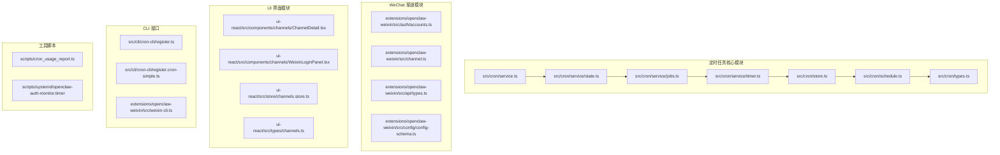

**图表来源**
- [src/cron/service.ts:1-60](file://src/cron/service.ts#L1-L60)
- [extensions/openclaw-weixin/src/auth/accounts.ts:1-382](file://extensions/openclaw-weixin/src/auth/accounts.ts#L1-L382)
- [ui-react/src/components/channels/ChannelDetail.tsx:1-170](file://ui-react/src/components/channels/ChannelDetail.tsx#L1-L170)

## 核心组件

### CronService 类

CronService 是整个定时任务系统的核心控制器，提供完整的生命周期管理：

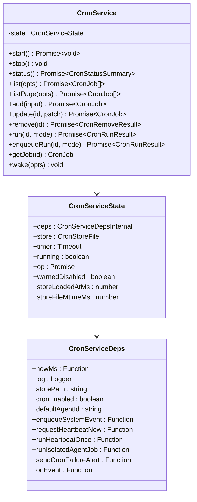

**图表来源**
- [src/cron/service.ts:7-60](file://src/cron/service.ts#L7-L60)
- [src/cron/service/state.ts:121-143](file://src/cron/service/state.ts#L121-L143)
- [src/cron/service/state.ts:38-115](file://src/cron/service/state.ts#L38-L115)

### WeChat 渠道集成

**新增** WeChat 渠道作为定时任务系统的扩展功能：

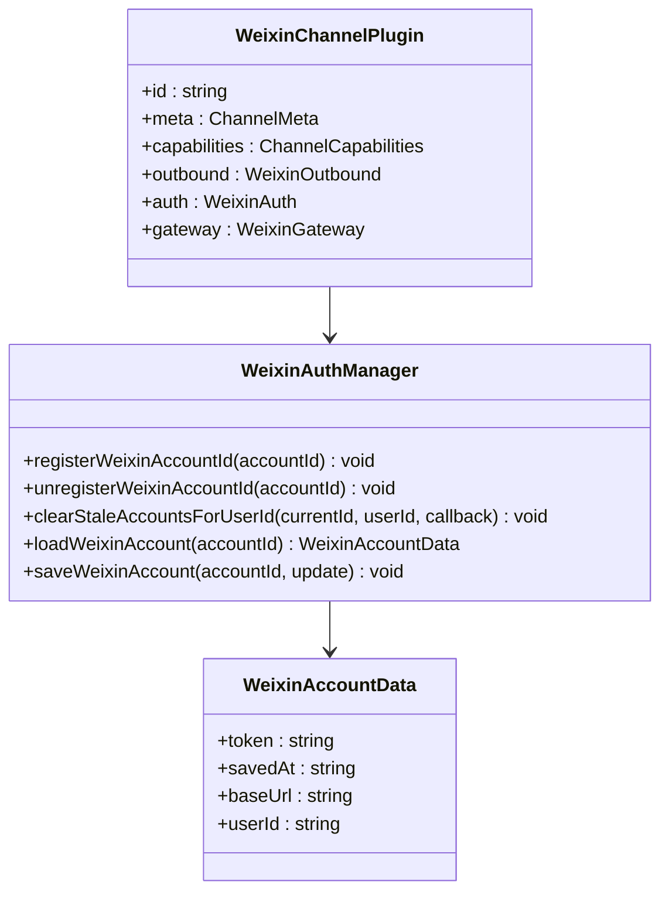

**图表来源**
- [extensions/openclaw-weixin/src/auth/accounts.ts:49-107](file://extensions/openclaw-weixin/src/auth/accounts.ts#L49-L107)
- [extensions/openclaw-weixin/src/channel.ts:130-472](file://extensions/openclaw-weixin/src/channel.ts#L130-L472)

## 架构概览

定时任务系统采用分层架构设计，确保高内聚低耦合：

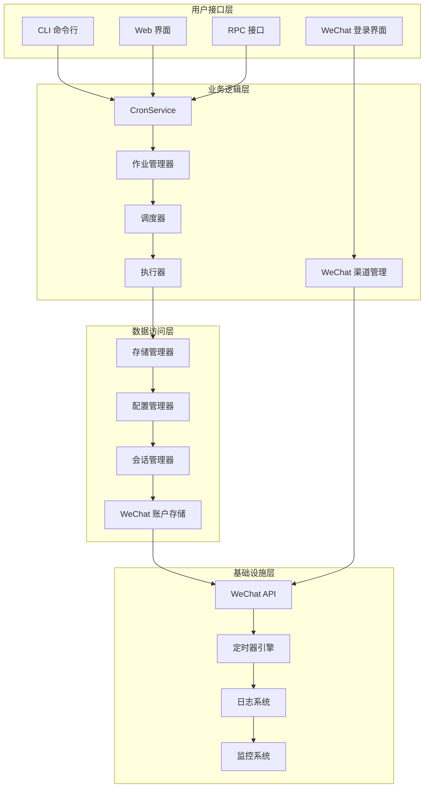

**图表来源**
- [src/cron/service.ts:13-60](file://src/cron/service.ts#L13-L60)
- [extensions/openclaw-weixin/src/channel.ts:267-472](file://extensions/openclaw-weixin/src/channel.ts#L267-L472)

## 详细组件分析

### 调度引擎

调度引擎是系统的核心，负责计算任务的执行时机：

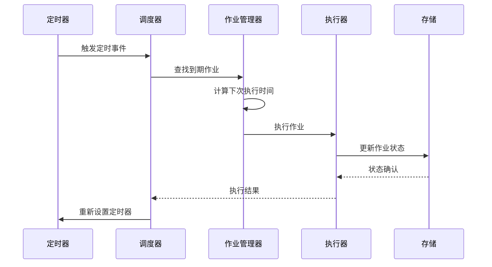

**图表来源**
- [src/cron/service/timer.ts:572-731](file://src/cron/service/timer.ts#L572-L731)
- [src/cron/service/jobs.ts:232-286](file://src/cron/service/jobs.ts#L232-L286)

### 错误处理和重试机制

系统实现了智能的错误处理和重试策略：

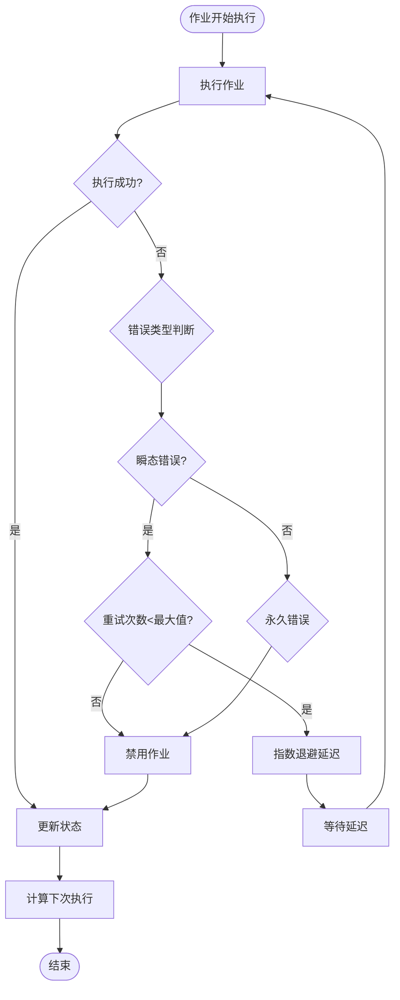

**图表来源**
- [src/cron/service/timer.ts:295-474](file://src/cron/service/timer.ts#L295-L474)
- [src/cron/service/timer.ts:114-128](file://src/cron/service/timer.ts#L114-L128)

### 数据持久化

存储系统采用 JSON5 格式，支持安全的文件操作：

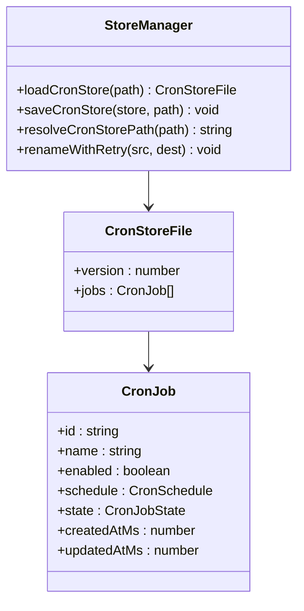

**图表来源**
- [src/cron/store.ts:24-53](file://src/cron/store.ts#L24-L53)
- [src/cron/types.ts:146-149](file://src/cron/types.ts#L146-L149)

**章节来源**
- [src/cron/service/jobs.ts:299-339](file://src/cron/service/jobs.ts#L299-L339)
- [src/cron/store.ts:63-106](file://src/cron/store.ts#L63-L106)

### CLI 管理接口

系统提供完整的命令行管理接口：

| 命令 | 功能 | 参数 |
|------|------|------|
| `openclaw cron status` | 显示定时任务状态 | --json |
| `openclaw cron list` | 列出所有定时任务 | --include-disabled |
| `openclaw cron add` | 添加新的定时任务 | 任务定义参数 |
| `openclaw cron edit` | 编辑现有任务 | 任务ID, 修改参数 |
| `openclaw cron enable/disable` | 启用/禁用任务 | 任务ID |
| `openclaw cron rm` | 删除任务 | 任务ID |
| `openclaw cron run` | 立即执行任务 | 任务ID, 可选模式 |
| **新增** `openclaw openclaw-weixin uninstall` | 卸载 WeChat 插件 | - |

**章节来源**
- [src/cli/cron-cli/register.ts:12-27](file://src/cli/cron-cli/register.ts#L12-L27)
- [src/cli/cron-cli/register.cron-simple.ts:32-49](file://src/cli/cron-cli/register.cron-simple.ts#L32-L49)
- [extensions/openclaw-weixin/src/weixin-cli.ts:14-40](file://extensions/openclaw-weixin/src/weixin-cli.ts#L14-L40)
- [docs/cli/index.md:191-200](file://docs/cli/index.md#L191-L200)
- [docs/zh-CN/cli/index.md:175-184](file://docs/zh-CN/cli/index.md#L175-L184)

## WeChat 用户 ID 处理增强

**新增** WeChat 用户 ID 处理功能是本次更新的重要组成部分，提供了完整的用户身份管理和会话处理能力。

### 用户 ID 兼容性处理

系统支持多种用户 ID 格式，包括传统的原始格式和标准化格式：

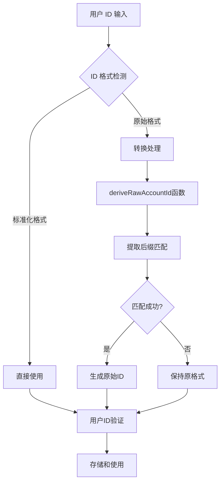

**图表来源**
- [extensions/openclaw-weixin/src/auth/accounts.ts:26-34](file://extensions/openclaw-weixin/src/auth/accounts.ts#L26-L34)

### 账户索引管理

系统维护 WeChat 账户的持久化索引，确保账户状态的一致性和可恢复性：

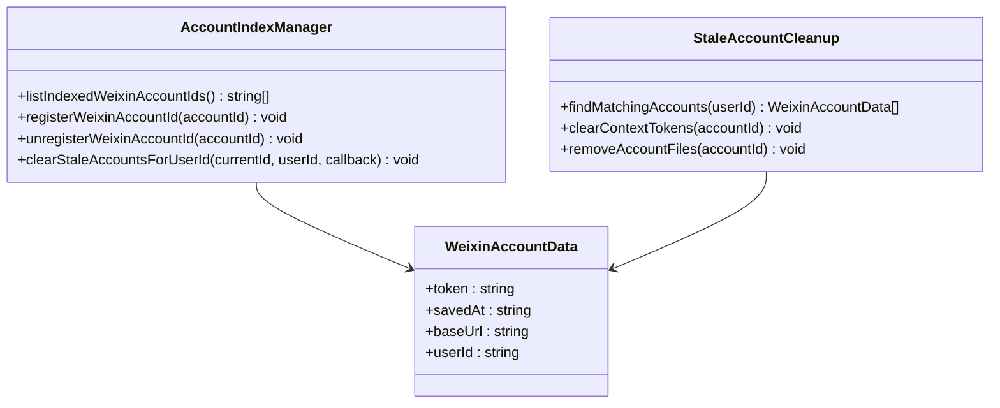

**图表来源**
- [extensions/openclaw-weixin/src/auth/accounts.ts:49-107](file://extensions/openclaw-weixin/src/auth/accounts.ts#L49-L107)

### 会话上下文管理

系统实现了智能的会话上下文管理，支持多账户场景下的用户识别：

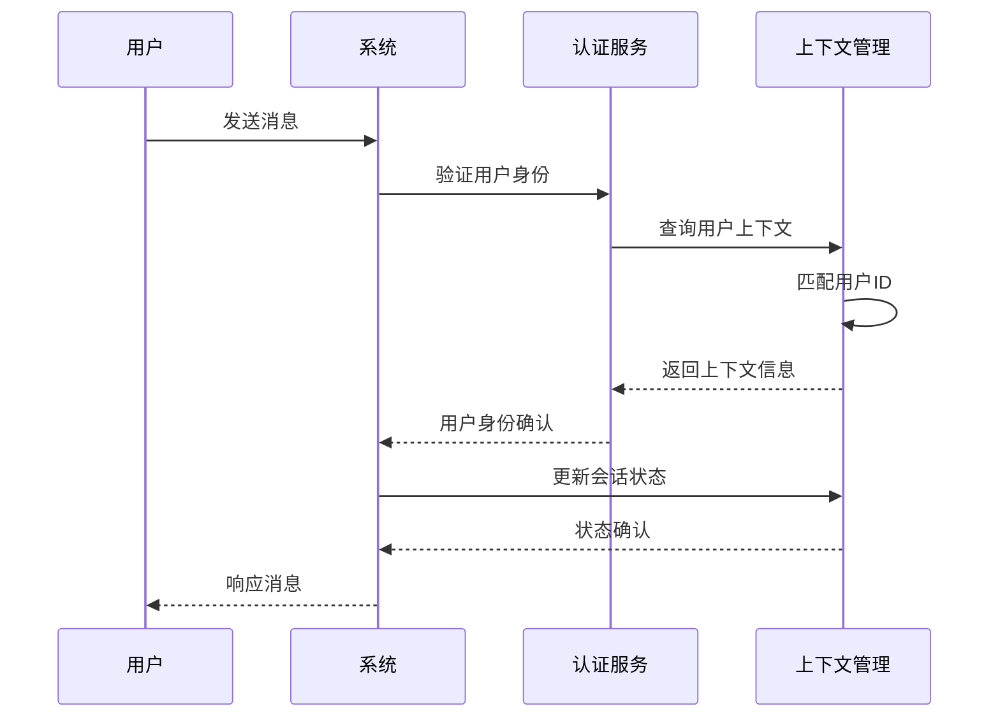

**图表来源**
- [extensions/openclaw-weixin/src/auth/accounts.ts:90-107](file://extensions/openclaw-weixin/src/auth/accounts.ts#L90-L107)

**章节来源**
- [extensions/openclaw-weixin/src/auth/accounts.ts:1-382](file://extensions/openclaw-weixin/src/auth/accounts.ts#L1-L382)

## 用户界面改进

**新增** WeChat 登录界面和相关 UI 组件，提供了完整的用户交互体验。

### WeChat 登录面板

WeChat 登录面板提供了直观的二维码扫描和状态显示功能：

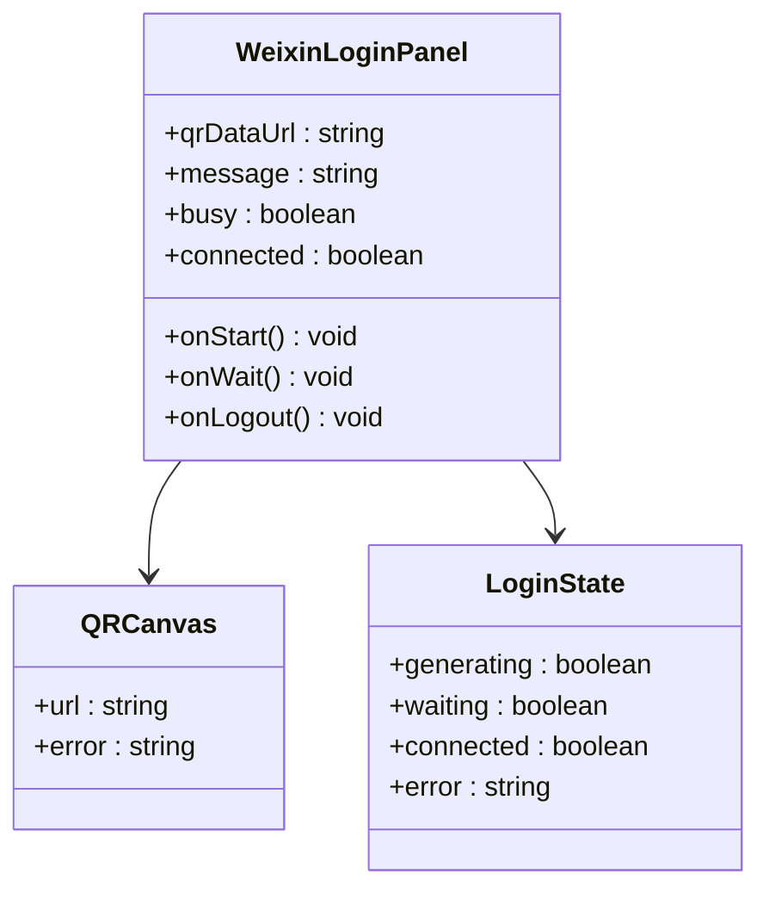

**图表来源**
- [ui-react/src/components/channels/WeixinLoginPanel.tsx:41-146](file://ui-react/src/components/channels/WeixinLoginPanel.tsx#L41-L146)

### 通道详情界面

通道详情界面集成了 WeChat 特有的状态显示和操作按钮：

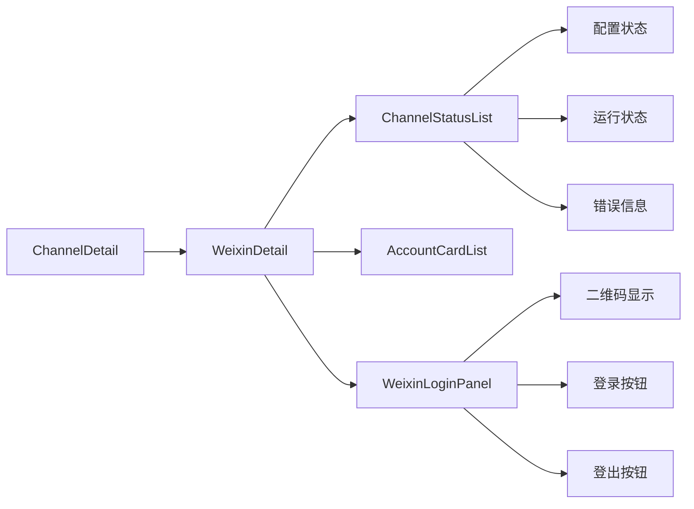

**图表来源**
- [ui-react/src/components/channels/ChannelDetail.tsx:76-104](file://ui-react/src/components/channels/ChannelDetail.tsx#L76-L104)

### 实时状态同步

UI 状态与后端状态保持实时同步，确保用户界面的准确性：

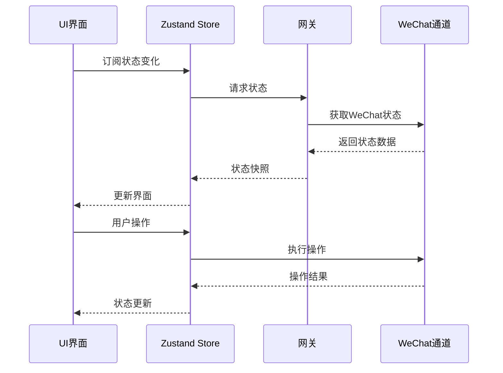

**图表来源**
- [ui-react/src/store/channels.store.ts:159-200](file://ui-react/src/store/channels.store.ts#L159-L200)

**章节来源**
- [ui-react/src/components/channels/ChannelDetail.tsx:1-170](file://ui-react/src/components/channels/ChannelDetail.tsx#L1-L170)
- [ui-react/src/components/channels/WeixinLoginPanel.tsx:1-146](file://ui-react/src/components/channels/WeixinLoginPanel.tsx#L1-L146)
- [ui-react/src/store/channels.store.ts:1-200](file://ui-react/src/store/channels.store.ts#L1-L200)

## 状态管理扩展

**新增** WeChat 相关的状态字段和管理功能，增强了系统的状态追踪能力。

### WeChat 状态字段

WeChat 渠道的状态管理包含了丰富的字段信息：

| 状态字段 | 类型 | 描述 | 用途 |
|----------|------|------|------|
| `configured` | boolean | 是否已配置 | UI 显示配置状态 |
| `running` | boolean | 是否正在运行 | 显示服务状态 |
| `connected` | boolean | 是否已连接 | 显示连接状态 |
| `lastError` | string | 最后一次错误信息 | 错误显示和诊断 |
| `lastInboundAt` | number | 最后接收消息时间 | 活跃度追踪 |
| `lastOutboundAt` | number | 最后发送消息时间 | 活跃度追踪 |
| `weixinQrDataUrl` | string | WeChat 二维码数据 | 登录界面显示 |
| `weixinMessage` | string | WeChat 登录消息 | 用户提示信息 |
| `weixinBusy` | boolean | WeChat 登录忙状态 | 操作状态控制 |
| `weixinConnected` | boolean | WeChat 连接状态 | UI 状态显示 |
| `weixinSessionKey` | string | WeChat 会话密钥 | 认证令牌 |

**章节来源**
- [ui-react/src/store/channels.store.ts:41-104](file://ui-react/src/store/channels.store.ts#L41-L104)
- [ui-react/src/types/channels.ts:50-60](file://ui-react/src/types/channels.ts#L50-L60)

### 状态快照管理

系统实现了完整的状态快照管理机制：

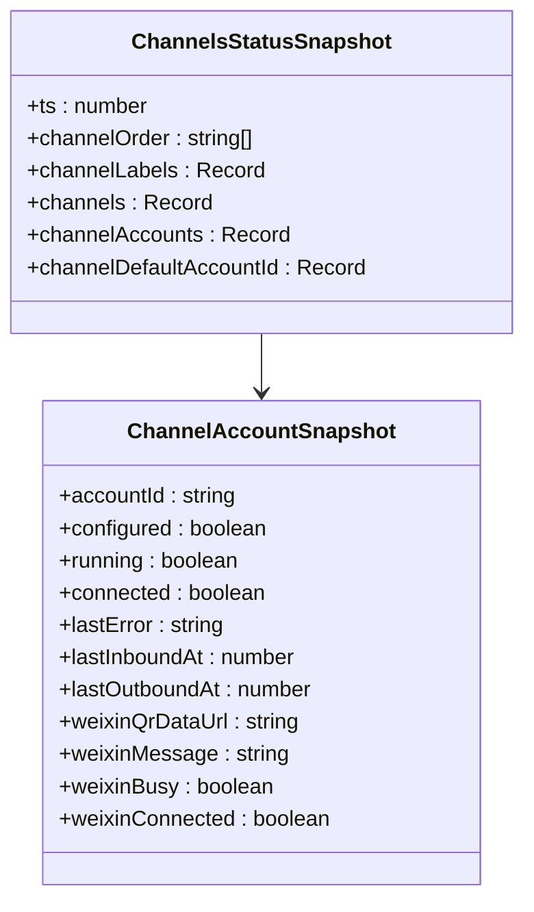

**图表来源**
- [ui-react/src/types/channels.ts:50-60](file://ui-react/src/types/channels.ts#L50-L60)
- [ui-react/src/types/channels.ts:15-48](file://ui-react/src/types/channels.ts#L15-L48)

## 类型定义扩展

**新增** WeChat 协议相关的类型定义，支持完整的消息协议处理。

### WeChat 协议类型

WeChat 消息协议定义了完整的消息结构和处理方式：

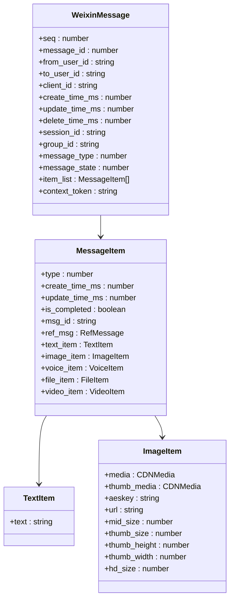

**图表来源**
- [extensions/openclaw-weixin/src/api/types.ts:151-167](file://extensions/openclaw-weixin/src/api/types.ts#L151-L167)
- [extensions/openclaw-weixin/src/api/types.ts:137-149](file://extensions/openclaw-weixin/src/api/types.ts#L137-L149)

### 配置类型定义

WeChat 渠道的配置类型支持灵活的账户管理和路由设置：

| 配置字段 | 类型 | 默认值 | 描述 |
|----------|------|--------|------|
| `name` | string | - | 账户显示名称 |
| `enabled` | boolean | true | 是否启用账户 |
| `baseUrl` | string | DEFAULT_BASE_URL | WeChat API 基础地址 |
| `cdnBaseUrl` | string | CDN_BASE_URL | CDN 基础地址 |
| `routeTag` | number | - | 路由标签 |

**章节来源**
- [extensions/openclaw-weixin/src/api/types.ts:1-227](file://extensions/openclaw-weixin/src/api/types.ts#L1-L227)
- [extensions/openclaw-weixin/src/config/config-schema.ts:9-20](file://extensions/openclaw-weixin/src/config/config-schema.ts#L9-L20)

## 依赖关系分析

定时任务系统的关键依赖关系如下：

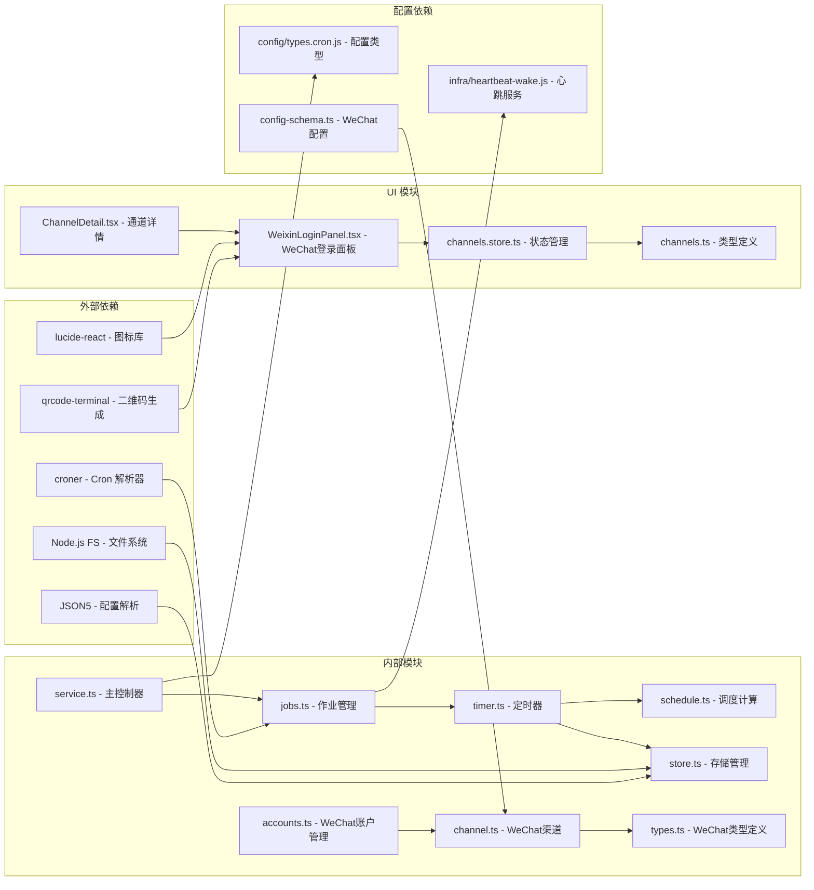

**图表来源**
- [src/cron/schedule.ts:1-31](file://src/cron/schedule.ts#L1-L31)
- [extensions/openclaw-weixin/src/channel.ts:1-472](file://extensions/openclaw-weixin/src/channel.ts#L1-L472)
- [ui-react/src/components/channels/WeixinLoginPanel.tsx:1-146](file://ui-react/src/components/channels/WeixinLoginPanel.tsx#L1-L146)

**章节来源**
- [src/cron/service.ts:1-60](file://src/cron/service.ts#L1-L60)
- [src/cron/schedule.ts:1-171](file://src/cron/schedule.ts#L1-L171)
- [extensions/openclaw-weixin/src/runtime.ts:1-71](file://extensions/openclaw-weixin/src/runtime.ts#L1-L71)

## 性能考虑

### 内存优化

系统采用了多项内存优化策略：

1. **缓存机制**：Cron 表达式解析结果缓存，避免重复计算
2. **增量更新**：只在必要时更新存储文件
3. **垃圾回收**：及时清理过期的作业状态
4. **WeChat 账户缓存**：用户 ID 和会话信息的本地缓存

### 并发控制

系统支持可配置的并发执行：

- 默认单线程执行，确保稳定性
- 支持多线程并发执行（通过配置）
- 自动限流防止资源耗尽
- **新增** WeChat 登录操作的并发控制

### 错误恢复

- 自动重试机制，支持指数退避
- 作业状态持久化，防止意外中断丢失
- 调度错误自动禁用，保护系统稳定
- **新增** WeChat 账户状态的自动恢复

## 故障排除指南

### 常见问题诊断

| 问题症状 | 可能原因 | 解决方案 |
|----------|----------|----------|
| 作业不执行 | 调度时间未到 | 检查 Cron 表达式和时区设置 |
| 执行超时 | 网络或服务响应慢 | 增加超时配置或优化目标服务 |
| 内存泄漏 | 长时间运行未重启 | 定期重启服务或增加监控告警 |
| 存储损坏 | 文件权限或磁盘空间不足 | 检查文件权限和磁盘空间 |
| **新增** WeChat 登录失败 | 二维码过期或网络问题 | 重新生成二维码或检查网络连接 |
| **新增** WeChat 用户 ID 识别错误 | 用户 ID 格式不兼容 | 使用标准化的用户 ID 格式 |

### 监控和日志

系统提供详细的运行日志：

- 作业执行状态跟踪
- 错误信息和堆栈跟踪
- 性能指标和统计信息
- 调度计算过程记录
- **新增** WeChat 登录和认证日志
- **新增** WeChat 用户会话状态日志

**章节来源**
- [src/cron/service/timer.ts:65-91](file://src/cron/service/timer.ts#L65-L91)
- [src/cron/service/jobs.ts:312-339](file://src/cron/service/jobs.ts#L312-L339)

## 结论

定时任务管理系统是一个功能完整、设计合理的生产级解决方案。其特点包括：

1. **可靠性**：完善的错误处理和恢复机制
2. **可扩展性**：模块化设计支持功能扩展
3. **易用性**：丰富的 CLI 工具和 Web 界面
4. **可观测性**：详细的日志和监控功能
5. **安全性**：文件权限控制和数据加密
6. ****WeChat 集成**：完整的微信渠道支持和用户管理

**更新** 系统通过精心设计的架构和实现，为 OpenClaw 平台提供了稳定可靠的定时任务执行能力和 WeChat 渠道的完整支持。

## 附录

### 使用示例

#### 基本任务创建
```bash
# 创建每分钟执行的任务
openclaw cron add --name "每分钟检查" \
  --schedule "*/1 * * * *" \
  --payload '{"kind":"systemEvent","text":"minute-tick"}'
```

#### 复杂调度任务
```bash
# 创建每周一上午9点执行的任务
openclaw cron add --name "周报生成" \
  --schedule "0 9 * * 1" \
  --timezone "Asia/Shanghai" \
  --payload '{"kind":"agentTurn","message":"生成上周周报"}'
```

#### WeChat 相关任务
```bash
# 创建 WeChat 用户状态检查任务
openclaw cron add --name "WeChat用户状态检查" \
  --schedule "*/5 * * * *" \
  --payload '{"kind":"systemEvent","text":"weixin-status-check"}'

# 创建 WeChat 消息定时发送任务
openclaw cron add --name "WeChat定时消息" \
  --schedule "0 9 * * *" \
  --delivery '{"mode":"announce","channel":"openclaw-weixin","to":"user@im.wechat","accountId":"account-id"}' \
  --payload '{"text":"早上好！"}'
```

#### 任务管理
```bash
# 查看所有任务
openclaw cron list --include-disabled

# 禁用任务
openclaw cron disable <job-id>

# 立即执行
openclaw cron run <job-id> force

# **新增** 卸载 WeChat 插件
openclaw openclaw-weixin uninstall
```

### 配置选项

系统支持丰富的配置选项：

- **并发执行**：控制同时执行的作业数量
- **超时设置**：为不同类型的任务设置超时时间
- **重试策略**：配置错误重试的次数和间隔
- **会话保留**：设置会话数据的保留时间
- **运行日志**：配置日志文件大小和保留策略
- **WeChat 账户**：配置 WeChat 用户 ID 和认证信息
- **WeChat 登录**：配置二维码生成和登录流程
- **WeChat 状态**：配置状态监控和通知机制

### WeChat 集成配置

**新增** WeChat 渠道的完整配置示例：

```json
{
  "channels": {
    "openclaw-weixin": {
      "enabled": true,
      "baseUrl": "https://ilinkai.weixin.qq.com",
      "cdnBaseUrl": "https://novac2c.cdn.weixin.qq.com/c2c",
      "accounts": {
        "account-id": {
          "name": "微信机器人",
          "enabled": true,
          "routeTag": 1
        }
      }
    }
  }
}
```