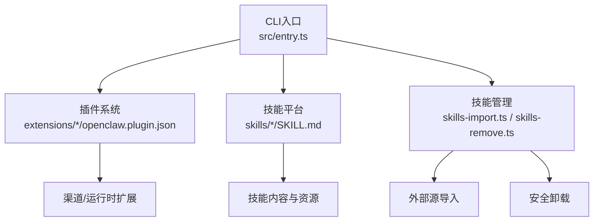
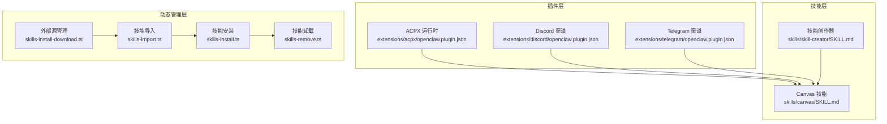
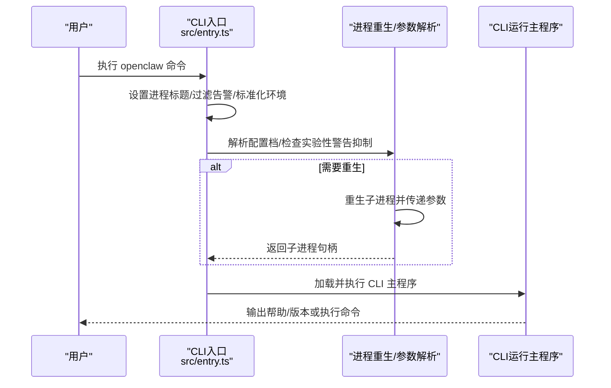
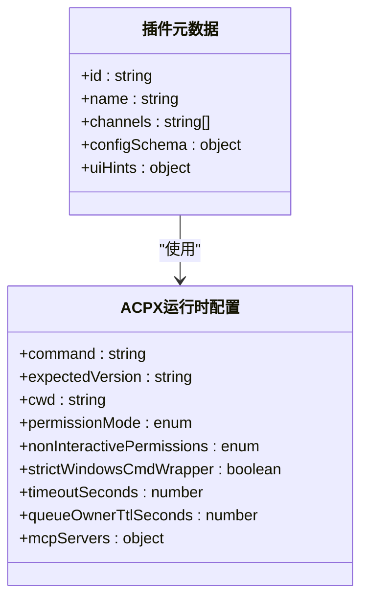
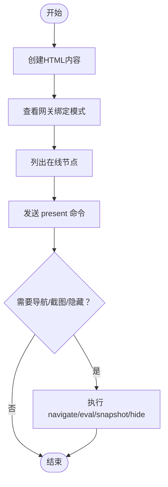
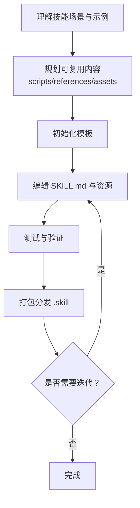
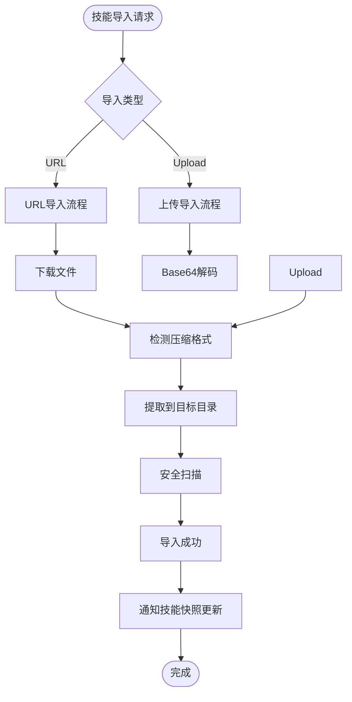
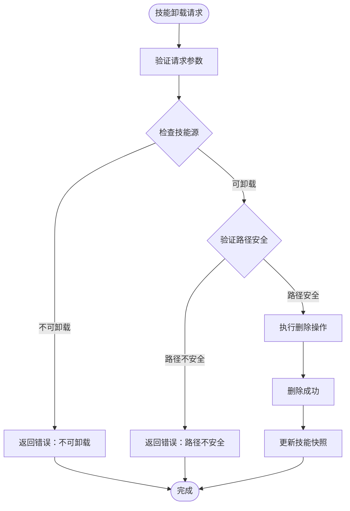
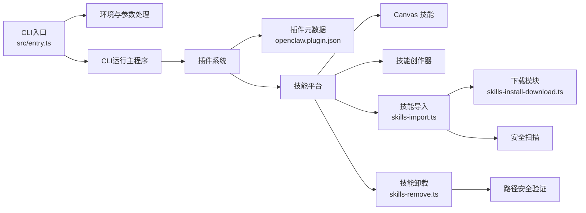

# 技能平台

<cite>
**本文引用的文件**
- [README.md](file://README.md)
- [package.json](file://package.json)
- [src/entry.ts](file://src/entry.ts)
- [src/gateway/server-methods/skills.ts](file://src/gateway/server-methods/skills.ts)
- [src/agents/skills-import.ts](file://src/agents/skills-import.ts)
- [src/agents/skills-remove.ts](file://src/agents/skills-remove.ts)
- [src/agents/skills-install.ts](file://src/agents/skills-install.ts)
- [src/agents/skills-install-download.ts](file://src/agents/skills-install-download.ts)
- [ui/src/ui/controllers/skills.ts](file://ui/src/ui/controllers/skills.ts)
- [ui-react/src/lib/skills-grouping.ts](file://ui-react/src/lib/skills-grouping.ts)
- [extensions/acpx/openclaw.plugin.json](file://extensions/acpx/openclaw.plugin.json)
- [extensions/discord/openclaw.plugin.json](file://extensions/discord/openclaw.plugin.json)
- [extensions/telegram/openclaw.plugin.json](file://extensions/telegram/openclaw.plugin.json)
- [skills/canvas/SKILL.md](file://skills/canvas/SKILL.md)
- [skills/skill-creator/SKILL.md](file://skills/skill-creator/SKILL.md)
</cite>

## 更新摘要

**变更内容**

- 新增技能动态安装和卸载功能章节
- 更新技能生态系统架构图以反映外部源导入能力
- 添加技能安全扫描和路径安全验证机制说明
- 更新技能管理界面和工作流说明

## 目录

1. [简介](#简介)
2. [项目结构](#项目结构)
3. [核心组件](#核心组件)
4. [架构总览](#架构总览)
5. [详细组件分析](#详细组件分析)
6. [技能动态安装与卸载](#技能动态安装与卸载)
7. [依赖关系分析](#依赖关系分析)
8. [性能考量](#性能考量)
9. [故障排查指南](#故障排查指南)
10. [结论](#结论)
11. [附录](#附录)

## 简介

本仓库是一个"个人AI助手"平台，提供多通道消息集成、网关控制平面、可扩展的技能系统与工具生态。平台支持在本地运行，具备跨平台节点（macOS/iOS/Android）与浏览器控制能力，并通过"技能"实现领域化能力扩展。本文档聚焦"技能平台"的设计与使用方式，帮助开发者理解技能的组织结构、创建流程、分发与运行机制。

**更新** 新增技能动态安装和卸载能力，支持从外部源导入技能以及安全删除用户安装的技能，显著增强了技能生态系统的灵活性和可扩展性。

## 项目结构

- 平台入口与运行时：通过 CLI 入口脚本启动，加载环境变量、解析参数、按需重生进程以抑制实验性警告等。
- 插件体系：每个插件以独立目录存在，包含插件元数据与可选的技能资源，用于扩展渠道或运行时能力。
- 技能资源：技能以独立目录形式提供，包含 SKILL.md 与可选的 scripts/references/assets 资源，遵循"渐进披露"原则，最小化上下文占用。
- 文档与说明：README 提供总体介绍、安装与快速开始；各技能目录提供具体用法与调试建议。

**图表来源**

- [src/entry.ts:1-195](file://src/entry.ts#L1-L195)
- [src/gateway/server-methods/skills.ts:210-285](file://src/gateway/server-methods/skills.ts#L210-L285)
- [src/agents/skills-import.ts:224-366](file://src/agents/skills-import.ts#L224-L366)
- [src/agents/skills-remove.ts:36-99](file://src/agents/skills-remove.ts#L36-L99)

**章节来源**

- [README.md:1-560](file://README.md#L1-L560)
- [package.json:1-469](file://package.json#L1-L469)
- [src/entry.ts:1-195](file://src/entry.ts#L1-L195)

## 核心组件

- CLI入口与启动流程：负责环境标准化、参数解析、实验性警告抑制与进程重生，确保稳定运行。
- 插件元数据：每个插件通过 JSON 文件声明其 ID、支持的渠道或运行时能力、配置模式与 UI 提示，便于统一管理与可视化配置。
- 技能规范：技能采用"渐进披露"设计，SKILL.md 作为触发与导航入口，scripts/references/assets 按需加载，降低上下文开销。
- Canvas 技能：提供跨节点的可视化展示能力，支持本地/局域网/Tailscale 的不同绑定模式与热重载。
- **新增** 技能动态管理：支持从外部源导入技能和安全卸载用户安装的技能，增强技能生态系统的灵活性。

**章节来源**

- [src/entry.ts:166-193](file://src/entry.ts#L166-L193)
- [extensions/acpx/openclaw.plugin.json:1-106](file://extensions/acpx/openclaw.plugin.json#L1-L106)
- [skills/canvas/SKILL.md:13-46](file://skills/canvas/SKILL.md#L13-L46)

## 架构总览

技能平台围绕"插件 + 技能"的双层扩展模型构建，现已增强为"插件 + 技能 + 动态管理"的三层架构：

- 插件层：定义渠道接入、运行时后端（如 ACPX）、认证与安全策略等。
- 技能层：提供领域化的知识与工作流，通过 SKILL.md 导航与 references/assets 资源按需加载。
- **新增** 动态管理层：提供技能的导入、安装、更新和卸载能力，支持外部源和工作区管理。

**图表来源**

- [extensions/acpx/openclaw.plugin.json:1-106](file://extensions/acpx/openclaw.plugin.json#L1-L106)
- [extensions/discord/openclaw.plugin.json:1-10](file://extensions/discord/openclaw.plugin.json#L1-L10)
- [extensions/telegram/openclaw.plugin.json:1-10](file://extensions/telegram/openclaw.plugin.json#L1-L10)
- [skills/canvas/SKILL.md:1-199](file://skills/canvas/SKILL.md#L1-L199)
- [skills/skill-creator/SKILL.md:1-373](file://skills/skill-creator/SKILL.md#L1-L373)
- [src/gateway/server-methods/skills.ts:210-285](file://src/gateway/server-methods/skills.ts#L210-L285)
- [src/agents/skills-import.ts:224-366](file://src/agents/skills-import.ts#L224-L366)
- [src/agents/skills-remove.ts:36-99](file://src/agents/skills-remove.ts#L36-L99)

## 详细组件分析

### 组件A：CLI入口与启动流程

- 功能要点
  - 环境标准化：设置进程标题、过滤告警、规范化环境变量。
  - 实验性警告抑制：通过重生子进程禁用特定实验性警告，避免干扰用户交互。
  - 参数解析与配置注入：解析 CLI 配置档参数，注入运行时环境变量。
  - 快速路径：对版本查询与帮助输出走快速路径，减少不必要的初始化成本。
- 关键行为
  - 在非主模块导入时跳过顶层副作用，防止重复启动。
  - 对只读审计场景强制只读认证存储标志位。
- 性能与稳定性
  - 启用编译缓存（尽力而为），提升启动速度。
  - 子进程桥接保证父子进程间状态一致与错误传播。

**图表来源**

- [src/entry.ts:31-193](file://src/entry.ts#L31-L193)

**章节来源**

- [src/entry.ts:16-29](file://src/entry.ts#L16-L29)
- [src/entry.ts:80-126](file://src/entry.ts#L80-L126)
- [src/entry.ts:128-164](file://src/entry.ts#L128-L164)

### 组件B：插件元数据与配置模式

- 功能要点
  - 插件 ID 与名称：唯一标识与显示名称。
  - 支持渠道/运行时：声明该插件提供的渠道或运行时能力。
  - 配置模式：通过 JSON Schema 定义配置项类型、枚举值与最小约束，配合 UI 提示完善用户体验。
- 使用场景
  - ACPX 运行时插件：定义命令路径、期望版本、工作目录、权限模式、超时与队列 TTL、MCP 服务器等。
  - 渠道插件：声明支持的渠道类型（如 Discord、Telegram），简化配置与校验。

**图表来源**

- [extensions/acpx/openclaw.plugin.json:1-106](file://extensions/acpx/openclaw.plugin.json#L1-L106)
- [extensions/discord/openclaw.plugin.json:1-10](file://extensions/discord/openclaw.plugin.json#L1-L10)
- [extensions/telegram/openclaw.plugin.json:1-10](file://extensions/telegram/openclaw.plugin.json#L1-L10)

**章节来源**

- [extensions/acpx/openclaw.plugin.json:6-62](file://extensions/acpx/openclaw.plugin.json#L6-L62)
- [extensions/acpx/openclaw.plugin.json:63-104](file://extensions/acpx/openclaw.plugin.json#L63-L104)

### 组件C：Canvas 技能（可视化展示）

- 功能要点
  - Canvas 主机：提供静态资源服务，支持热重载与 WebSocket 注入。
  - 节点桥接：将 Canvas URL 推送到已连接的节点（Mac/iOS/Android）。
  - 绑定模式：根据网关绑定策略（loopback/lan/tailnet/auto）决定主机地址与访问 URL。
- 工作流
  - 创建 HTML 内容 → 获取网关绑定信息 → 查找在线节点 → 发送 present 命令 → 可选 navigate/eval/snapshot/hide。
- 调试要点
  - URL 不匹配：确认绑定模式与实际主机地址一致。
  - 节点未连接：使用节点列表确认在线状态。
  - 热重载不生效：检查配置与文件监听日志。

**图表来源**

- [skills/canvas/SKILL.md:86-149](file://skills/canvas/SKILL.md#L86-L149)

**章节来源**

- [skills/canvas/SKILL.md:13-46](file://skills/canvas/SKILL.md#L13-L46)
- [skills/canvas/SKILL.md:151-180](file://skills/canvas/SKILL.md#L151-L180)

### 组件D：技能创作器（技能开发指南）

- 设计原则
  - 精简优先：仅在必要时提供上下文，避免冗余信息。
  - 自由度适配：根据任务脆弱性与变异性选择高/中/低自由度的表达方式。
  - 渐进披露：metadata（name/description）常驻，SKILL.md 按需加载，资源按需读取。
- 结构规范
  - 必需：SKILL.md（含 YAML frontmatter 与正文）。
  - 可选：scripts/（可执行脚本）、references/（参考文档）、assets/（输出资源）。
- 开发流程
  - 理解技能场景与示例 → 规划可复用内容 → 初始化模板 → 编辑与测试 → 打包分发 → 迭代优化。

**图表来源**

- [skills/skill-creator/SKILL.md:201-373](file://skills/skill-creator/SKILL.md#L201-L373)

**章节来源**

- [skills/skill-creator/SKILL.md:24-45](file://skills/skill-creator/SKILL.md#L24-L45)
- [skills/skill-creator/SKILL.md:46-126](file://skills/skill-creator/SKILL.md#L46-L126)
- [skills/skill-creator/SKILL.md:201-373](file://skills/skill-creator/SKILL.md#L201-L373)

## 技能动态安装与卸载

### 技能导入系统

技能导入系统支持从多种来源获取技能，包括外部URL和本地上传，提供灵活的技能分发机制。

- **导入来源**
  - URL导入：支持HTTP/HTTPS协议，自动检测压缩格式（ZIP、TAR.GZ、TAR.BZ2）
  - 上传导入：支持Base64编码的文件内容上传
- **安全机制**
  - 路径安全验证：防止路径遍历攻击
  - 内容扫描：导入后进行安全扫描，识别潜在危险模式
  - 目标位置控制：支持工作区范围和全局范围导入
- **提取策略**
  - 自动检测压缩格式
  - 智能剥离包装目录
  - 支持自定义目标目录

**图表来源**

- [src/agents/skills-import.ts:224-366](file://src/agents/skills-import.ts#L224-L366)
- [src/agents/skills-install-download.ts:146-281](file://src/agents/skills-install-download.ts#L146-L281)

### 技能卸载系统

技能卸载系统提供安全的用户安装技能删除能力，确保不会误删系统核心技能。

- **可卸载范围**
  - 工作区技能：`openclaw-workspace` 源的技能
  - 全局技能：`openclaw-managed` 源的技能
- **安全保护**
  - 源验证：仅允许卸载用户安装的技能
  - 路径验证：确保删除操作在受信任的目录范围内
  - 路径遍历防护：防止通过相对路径删除任意文件
- **清理流程**
  - 验证技能存在性
  - 确认删除权限
  - 执行递归删除
  - 更新技能状态

**图表来源**

- [src/agents/skills-remove.ts:36-99](file://src/agents/skills-remove.ts#L36-L99)

### 技能安装系统

技能安装系统支持多种安装方式，包括包管理器安装和直接下载。

- **安装方式**
  - 包管理器：Homebrew、npm、yarn、pnpm、go、uv
  - 直接下载：支持各种压缩格式的文件下载和提取
- **环境准备**
  - 自动检测和安装依赖工具
  - 处理不同平台的特殊需求
  - 环境变量配置
- **安装流程**
  - 解析安装规格
  - 准备安装环境
  - 执行安装命令
  - 验证安装结果

### 界面集成

技能管理界面提供直观的操作体验，支持技能的导入、安装、更新和卸载。

- **技能分组**
  - 工作区技能：当前工作区的技能
  - 内置技能：平台预装技能
  - 已安装技能：用户安装的技能
  - 其他技能：其他来源的技能
- **操作反馈**
  - 实时状态更新
  - 错误信息提示
  - 成功操作确认
- **批量管理**
  - 批量启用/禁用
  - 批量更新配置
  - 统一状态查看

**章节来源**

- [src/gateway/server-methods/skills.ts:210-285](file://src/gateway/server-methods/skills.ts#L210-L285)
- [src/agents/skills-import.ts:224-366](file://src/agents/skills-import.ts#L224-L366)
- [src/agents/skills-remove.ts:36-99](file://src/agents/skills-remove.ts#L36-L99)
- [src/agents/skills-install.ts:392-471](file://src/agents/skills-install.ts#L392-L471)
- [ui/src/ui/controllers/skills.ts:125-157](file://ui/src/ui/controllers/skills.ts#L125-L157)
- [ui-react/src/lib/skills-grouping.ts:9-46](file://ui-react/src/lib/skills-grouping.ts#L9-L46)

## 依赖关系分析

- CLI 入口依赖于运行时环境与参数解析模块，负责启动阶段的进程与环境准备。
- 插件系统通过 JSON 元数据与导出映射，向平台暴露能力边界与配置接口。
- 技能平台依赖于插件提供的运行时与渠道能力，以及技能自身的资源组织方式。
- **新增** 动态管理模块依赖于安全扫描、路径验证和网络下载等基础设施。

**图表来源**

- [src/entry.ts:166-193](file://src/entry.ts#L166-L193)
- [extensions/acpx/openclaw.plugin.json:1-106](file://extensions/acpx/openclaw.plugin.json#L1-L106)
- [skills/canvas/SKILL.md:1-199](file://skills/canvas/SKILL.md#L1-L199)
- [skills/skill-creator/SKILL.md:1-373](file://skills/skill-creator/SKILL.md#L1-L373)
- [src/gateway/server-methods/skills.ts:210-285](file://src/gateway/server-methods/skills.ts#L210-L285)
- [src/agents/skills-import.ts:224-366](file://src/agents/skills-import.ts#L224-L366)
- [src/agents/skills-remove.ts:36-99](file://src/agents/skills-remove.ts#L36-L99)

**章节来源**

- [package.json:344-399](file://package.json#L344-L399)
- [package.json:217-342](file://package.json#L217-L342)

## 性能考量

- 启动优化：启用编译缓存与快速路径（版本/帮助），减少不必要的初始化。
- 上下文控制：技能采用渐进披露设计，SKILL.md 控制在合理长度内，references/assets 按需加载，降低上下文窗口压力。
- 绑定与网络：Canvas 技能根据网关绑定模式选择最优访问路径，避免跨网络访问导致的延迟与失败。
- **新增** 导入优化：技能导入支持超时控制和进度反馈，避免长时间阻塞操作。
- **新增** 安全扫描：导入后自动进行安全扫描，可能影响导入时间但显著提升安全性。

## 故障排查指南

- Canvas 白屏或内容无法加载
  - 检查网关绑定模式与主机地址是否一致。
  - 使用 curl 直接访问 Canvas URL 验证服务可用性。
  - 确认节点处于在线状态并具备 Canvas 能力。
- "node required" 或 "node not connected"
  - 明确指定目标节点 ID，并确认节点在线。
- 热重载不生效
  - 检查 liveReload 配置与文件监听日志。
- 实验性警告干扰
  - CLI 已自动抑制相关警告；若仍出现，检查 NODE_OPTIONS 与进程重生逻辑。
- **新增** 技能导入失败
  - 检查URL可达性和格式正确性
  - 确认压缩文件格式支持且完整性
  - 验证磁盘空间和权限
  - 查看安全扫描报告中的警告信息
- **新增** 技能卸载失败
  - 确认技能源是否为可卸载类型
  - 检查路径是否在允许的安全范围内
  - 验证技能目录是否存在且可访问

**章节来源**

- [skills/canvas/SKILL.md:151-180](file://skills/canvas/SKILL.md#L151-L180)
- [src/entry.ts:80-126](file://src/entry.ts#L80-L126)
- [src/gateway/server-methods/skills.ts:210-285](file://src/gateway/server-methods/skills.ts#L210-L285)
- [src/agents/skills-import.ts:224-366](file://src/agents/skills-import.ts#L224-L366)
- [src/agents/skills-remove.ts:36-99](file://src/agents/skills-remove.ts#L36-L99)

## 结论

技能平台通过"插件 + 技能 + 动态管理"的三层扩展模型，实现了从渠道接入到领域能力再到生态管理的完整闭环。CLI 入口确保稳定的启动与运行环境，插件元数据提供清晰的能力边界与配置接口，技能则以渐进披露的方式最大化效率与可维护性。Canvas 技能展示了跨节点可视化能力的落地实践，技能创作器提供了系统化的开发与迭代方法论。

**新增** 动态安装和卸载能力显著增强了平台的灵活性和可扩展性，用户现在可以轻松从外部源获取技能，同时保持对已安装技能的完全控制权。安全扫描和路径验证机制确保了技能生态系统的安全性，为用户提供了可靠的技能管理体验。

## 附录

- 快速开始与安装参考：见项目根 README 的"安装"与"快速开始"部分。
- CLI 与运行参数：见 CLI 入口脚本中的参数解析与配置注入逻辑。
- 技能开发最佳实践：参考技能创作器的结构规范与开发流程。
- **新增** 技能管理操作指南：参考技能导入、安装、更新和卸载的具体实现。

**章节来源**

- [README.md:50-111](file://README.md#L50-L111)
- [src/entry.ts:166-193](file://src/entry.ts#L166-L193)
- [skills/skill-creator/SKILL.md:201-373](file://skills/skill-creator/SKILL.md#L201-L373)
- [src/gateway/server-methods/skills.ts:210-285](file://src/gateway/server-methods/skills.ts#L210-L285)
