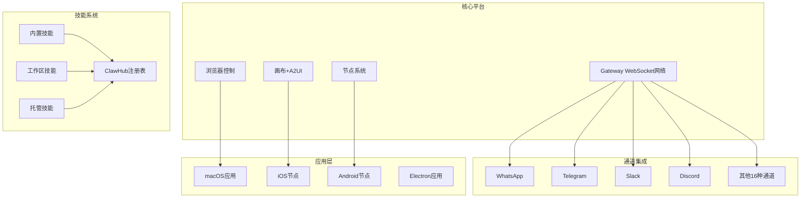
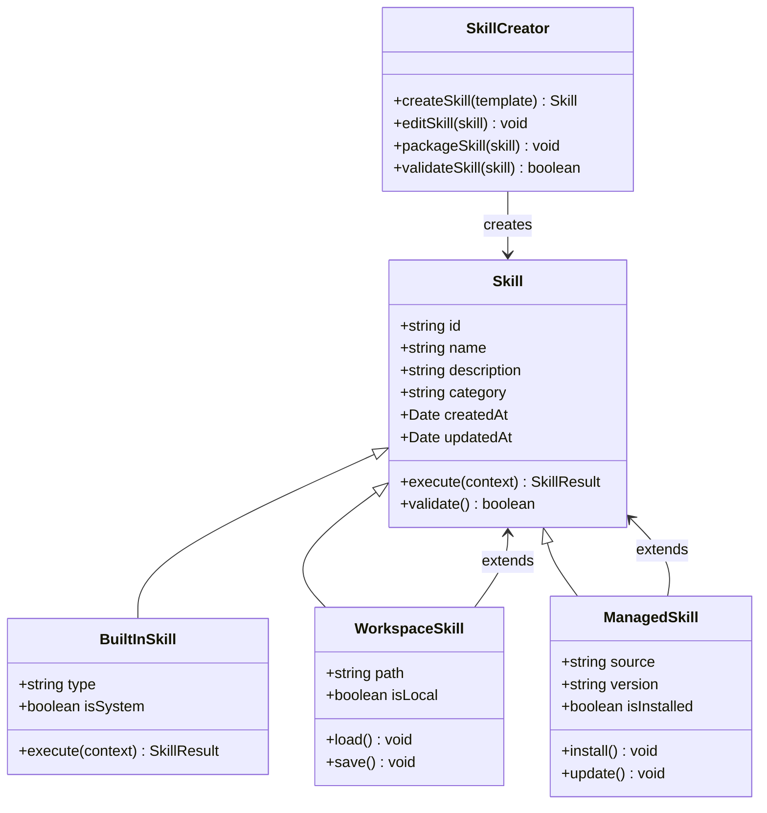
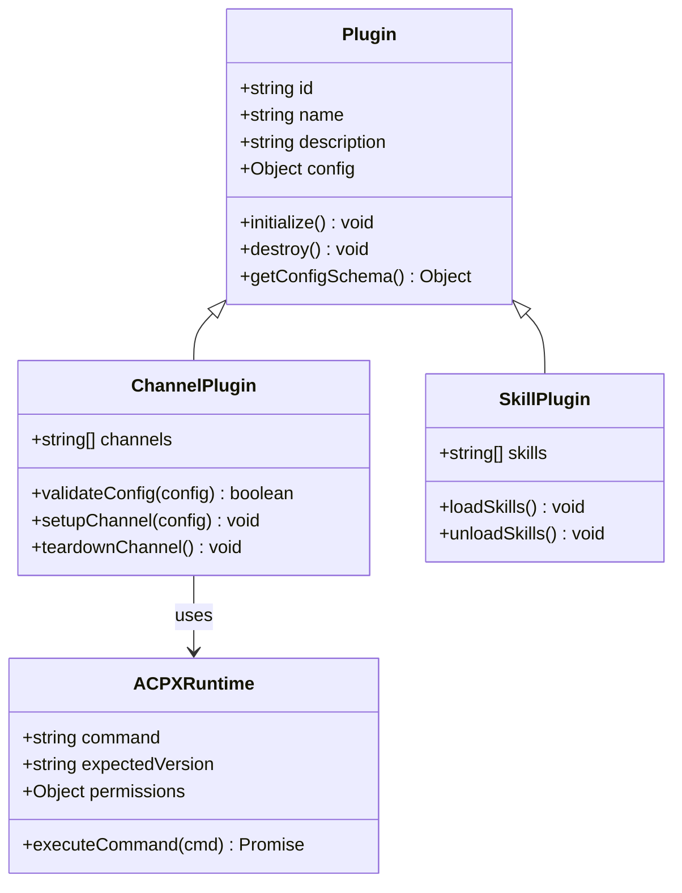
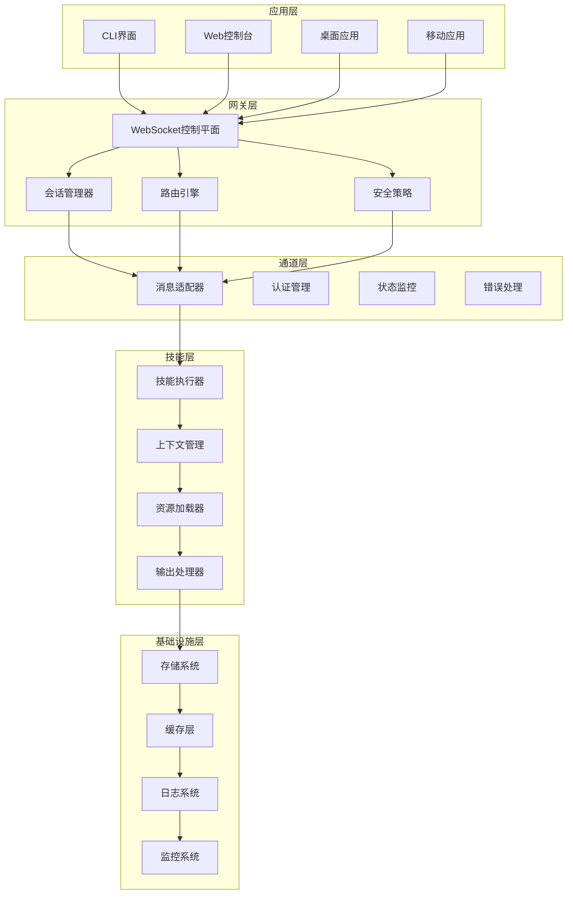
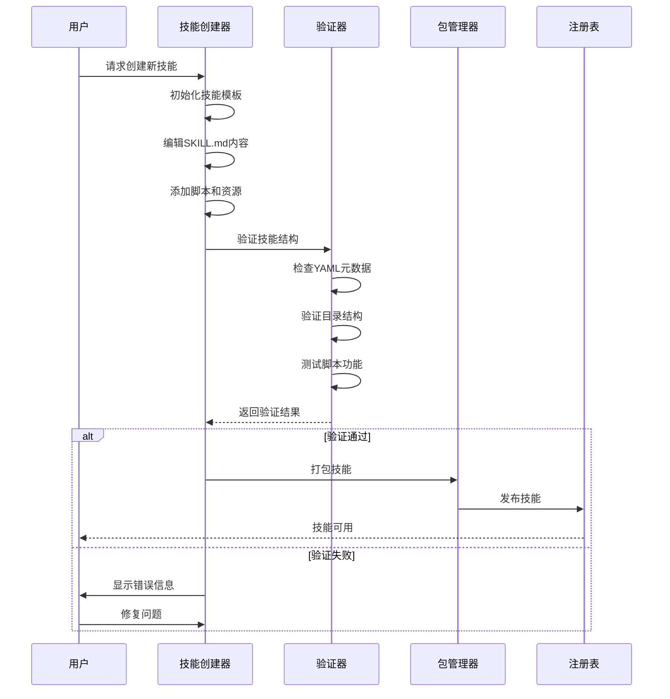
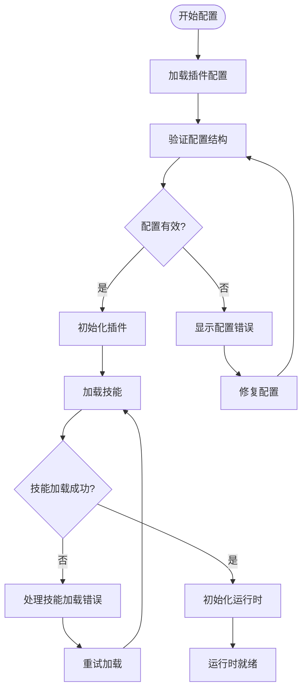
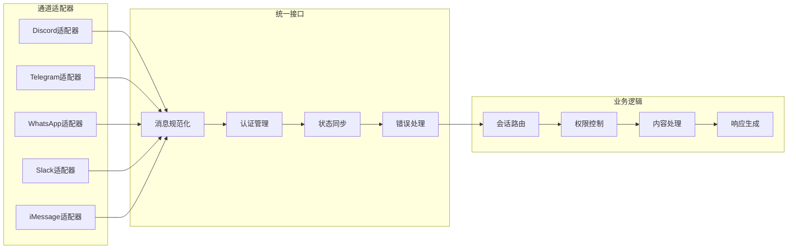
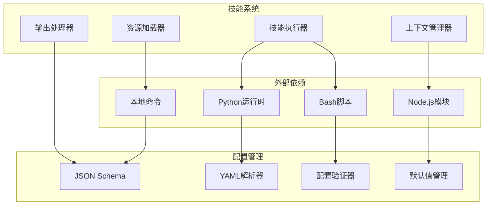
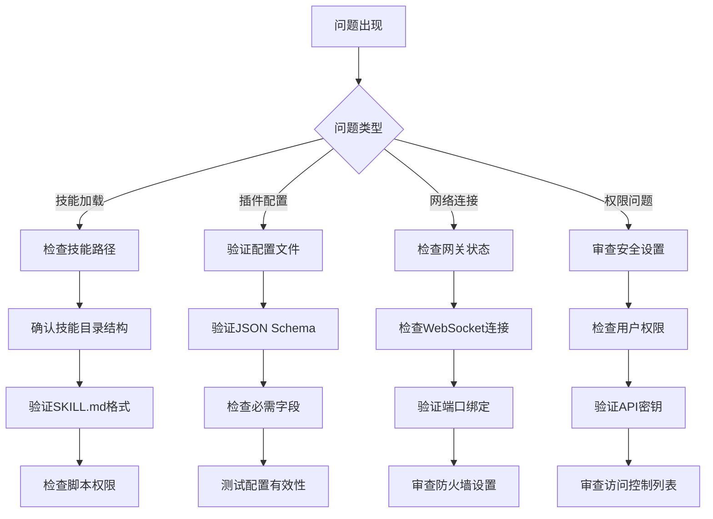

# 增强的技能管理系统

<cite>
**本文档引用的文件**
- [README.md](file://README.md)
- [package.json](file://package.json)
- [extensions/acpx/openclaw.plugin.json](file://extensions/acpx/openclaw.plugin.json)
- [extensions/discord/openclaw.plugin.json](file://extensions/discord/openclaw.plugin.json)
- [extensions/telegram/openclaw.plugin.json](file://extensions/telegram/openclaw.plugin.json)
- [extensions/lobster/openclaw.plugin.json](file://extensions/lobster/openclaw.plugin.json)
- [extensions/diffs/openclaw.plugin.json](file://extensions/diffs/openclaw.plugin.json)
- [skills/skill-creator/SKILL.md](file://skills/skill-creator/SKILL.md)
- [src/plugin-sdk/index.ts](file://src/plugin-sdk/index.ts)
</cite>

## 目录
1. [项目概述](#项目概述)
2. [项目结构](#项目结构)
3. [核心组件](#核心组件)
4. [架构概览](#架构概览)
5. [详细组件分析](#详细组件分析)
6. [依赖关系分析](#依赖关系分析)
7. [性能考虑](#性能考虑)
8. [故障排除指南](#故障排除指南)
9. [结论](#结论)

## 项目概述

OpenClaw 是一个个人AI助手平台，可在用户的设备上运行。它支持多渠道消息传递（WhatsApp、Telegram、Slack、Discord等），提供语音唤醒和对话模式，以及可扩展的技能系统。

该项目的核心特性包括：
- **本地优先网关** - 单一控制平面用于会话、通道、工具和事件
- **多通道收件箱** - 支持20多种即时通讯平台
- **多代理路由** - 将入站通道/账户/对等方路由到隔离的代理
- **技能平台** - 内置技能安装门控和用户界面
- **浏览器控制** - 独立的openclaw Chrome/Chromium实例
- **画布和A2UI** - 代理驱动的可视化工作区

## 项目结构



**图表来源**
- [README.md: 185-240:185-240](file://README.md#L185-L240)
- [README.md: 458-468:458-468](file://README.md#L458-L468)

**章节来源**
- [README.md: 1-545:1-545](file://README.md#L1-L545)

## 核心组件

### 技能系统架构

OpenClaw的技能系统采用模块化设计，支持多种类型的技能：



**图表来源**
- [skills/skill-creator/SKILL.md: 46-120:46-120](file://skills/skill-creator/SKILL.md#L46-L120)

### 插件系统



**图表来源**
- [extensions/acpx/openclaw.plugin.json: 1-106:1-106](file://extensions/acpx/openclaw.plugin.json#L1-L106)
- [src/plugin-sdk/index.ts: 88-96:88-96](file://src/plugin-sdk/index.ts#L88-L96)

**章节来源**
- [src/plugin-sdk/index.ts: 1-826:1-826](file://src/plugin-sdk/index.ts#L1-L826)

## 架构概览

OpenClaw采用分层架构设计，从底层基础设施到上层应用服务：



**图表来源**
- [README.md: 204-240:204-240](file://README.md#L204-L240)

## 详细组件分析

### 技能创建流程



**图表来源**
- [skills/skill-creator/SKILL.md: 201-373:201-373](file://skills/skill-creator/SKILL.md#L201-L373)

### 插件配置管理



**图表来源**
- [extensions/acpx/openclaw.plugin.json: 6-62:6-62](file://extensions/acpx/openclaw.plugin.json#L6-L62)

### 多通道集成架构



**图表来源**
- [extensions/discord/openclaw.plugin.json: 1-10:1-10](file://extensions/discord/openclaw.plugin.json#L1-L10)
- [extensions/telegram/openclaw.plugin.json: 1-10:1-10](file://extensions/telegram/openclaw.plugin.json#L1-L10)

**章节来源**
- [extensions/acpx/openclaw.plugin.json: 1-106:1-106](file://extensions/acpx/openclaw.plugin.json#L1-L106)
- [extensions/diffs/openclaw.plugin.json: 1-183:1-183](file://extensions/diffs/openclaw.plugin.json#L1-L183)
- [extensions/lobster/openclaw.plugin.json: 1-11:1-11](file://extensions/lobster/openclaw.plugin.json#L1-L11)

## 依赖关系分析

### 核心依赖关系

```mermaid
graph TB
subgraph "运行时依赖"
A[Node.js ≥22]
B[TypeScript]
C[Express]
D[WS WebSocket]
end
subgraph "第三方库"
E[@whiskeysockets/baileys]
F[@grammyjs/grammy]
G[@slack/bolt]
H[@discordjs/voice]
I[sharp 图像处理]
J[sqlite-vec 向量数据库]
end
subgraph "开发工具"
K[Vitest 测试框架]
L[Tsdown 类型生成]
M[Oxfmt 代码格式化]
N[Oxlint 代码检查]
end
A --> E
A --> F
A --> G
A --> H
B --> I
C --> J
D --> K
E --> L
F --> M
G --> N
```

**图表来源**
- [package.json: 344-402:344-402](file://package.json#L344-L402)
- [package.json: 403-424:403-424](file://package.json#L403-L424)

### 技能系统依赖



**图表来源**
- [skills/skill-creator/SKILL.md: 70-100:70-100](file://skills/skill-creator/SKILL.md#L70-L100)

**章节来源**
- [package.json: 1-474:1-474](file://package.json#L1-L474)

## 性能考虑

### 技能执行优化

1. **渐进式披露设计**：技能使用三层加载系统来管理上下文效率
   - 元数据（名称+描述）始终在上下文中（约100词）
   - SKILL.md正文仅在技能触发时加载（<5k词）
   - 打包资源按需由AI加载（无限大，因为脚本可以无须读入上下文窗口执行）

2. **内存管理**：使用持久化去重缓存避免重复处理相同消息

3. **并发控制**：基于键的异步队列确保技能调用的有序执行

### 网络性能

1. **WebSocket连接池**：复用网关连接减少延迟
2. **流式传输**：支持实时消息流和媒体传输
3. **压缩机制**：对传输的数据进行压缩以减少带宽占用

## 故障排除指南

### 常见问题诊断



### 技能开发调试

1. **技能验证**：使用内置验证器检查技能结构完整性
2. **日志记录**：启用详细日志追踪技能执行过程
3. **单元测试**：为技能编写测试用例确保功能正确性
4. **性能监控**：监控技能执行时间和资源使用情况

**章节来源**
- [README.md: 442-450:442-450](file://README.md#L442-L450)

## 结论

OpenClaw的增强技能管理系统提供了高度模块化和可扩展的解决方案。通过清晰的架构分离、强大的插件系统和完善的技能生命周期管理，该系统能够支持复杂的AI助手应用场景。

关键优势包括：
- **模块化设计**：技能、插件和通道的清晰分离
- **可扩展性**：支持自定义技能和第三方集成
- **安全性**：内置权限控制和安全策略
- **性能优化**：智能缓存和并发控制机制
- **开发者友好**：完善的工具链和文档支持

该系统为构建企业级AI助手平台奠定了坚实基础，支持从个人使用到大规模部署的各种场景需求。