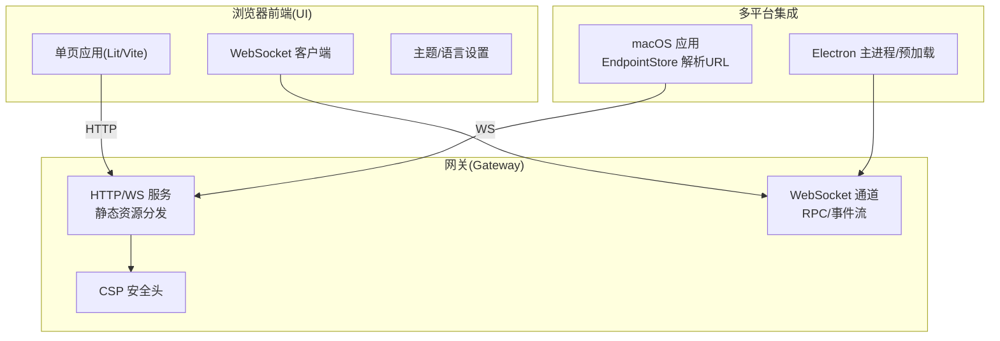
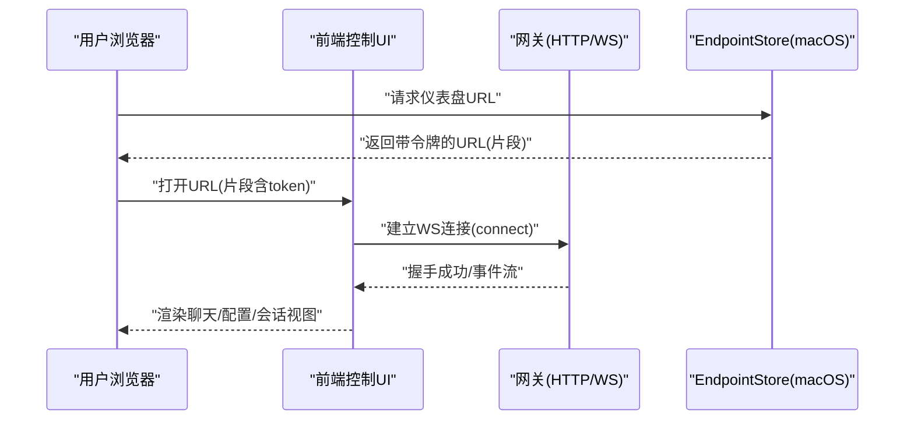
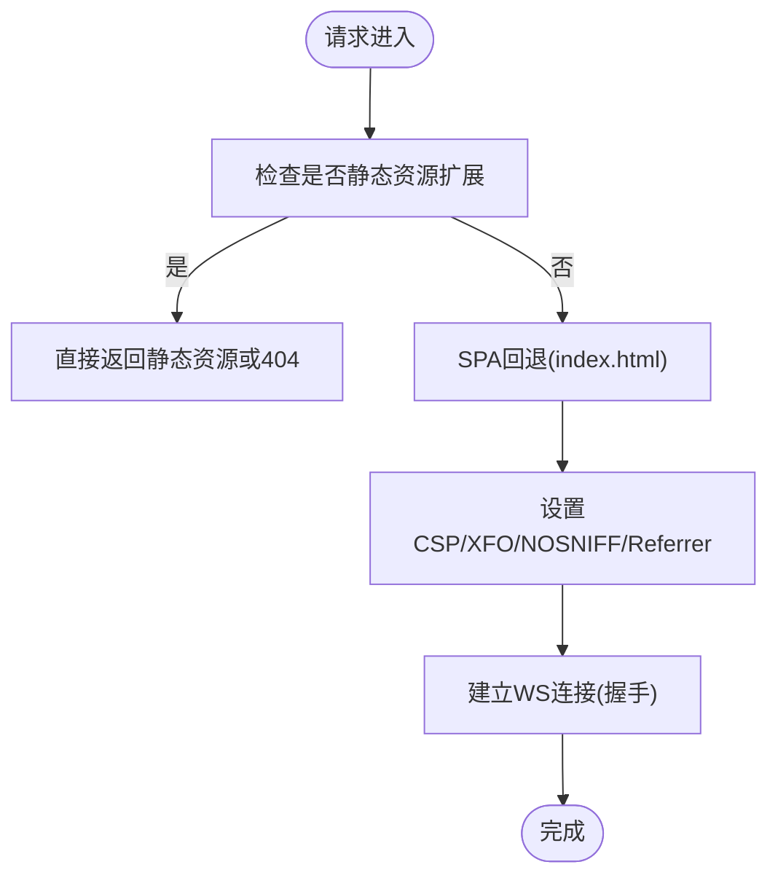
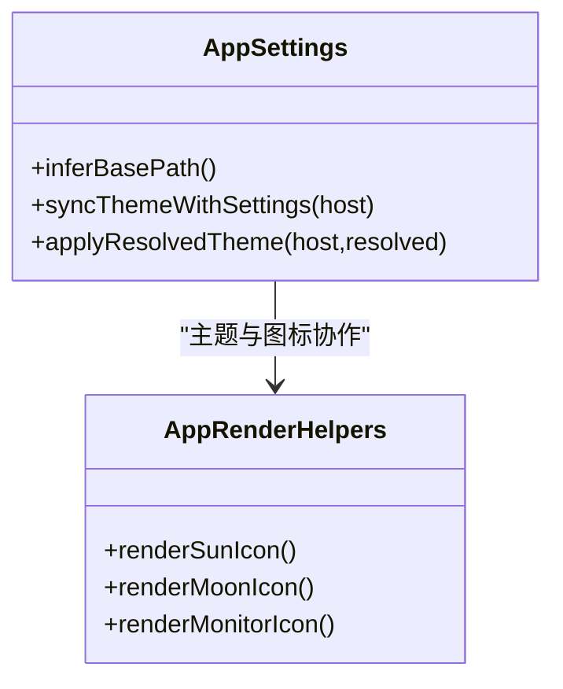
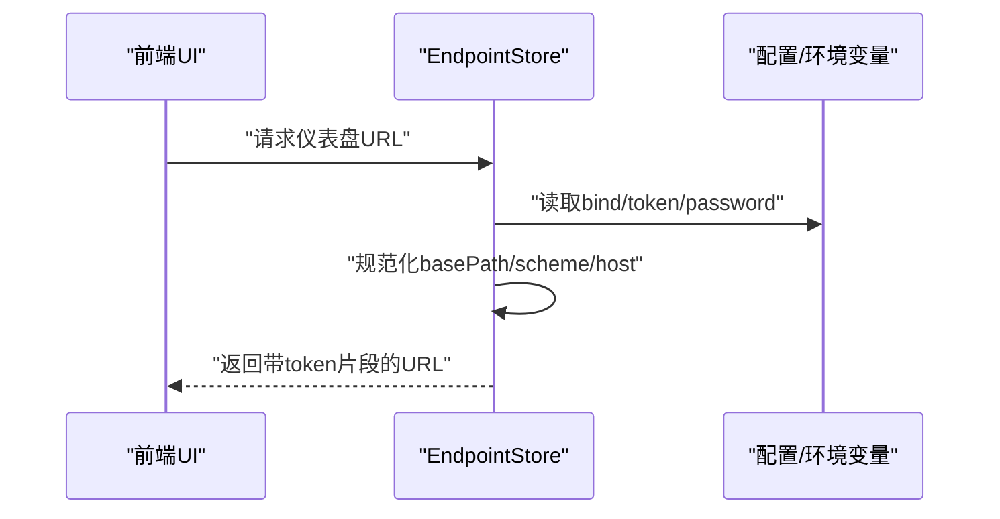
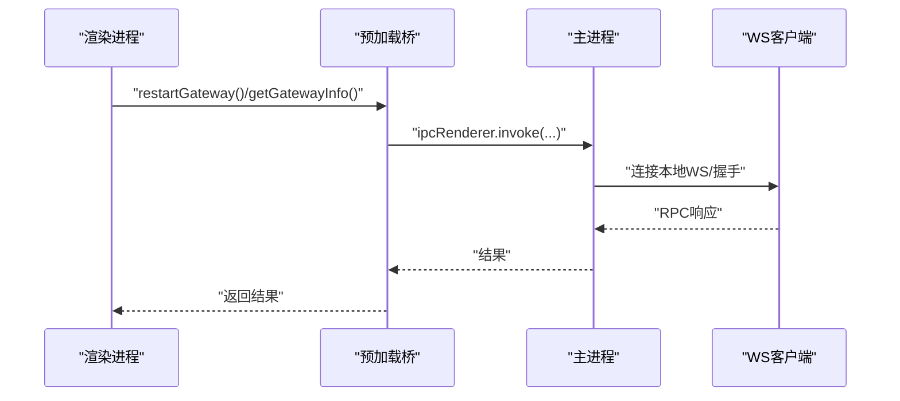
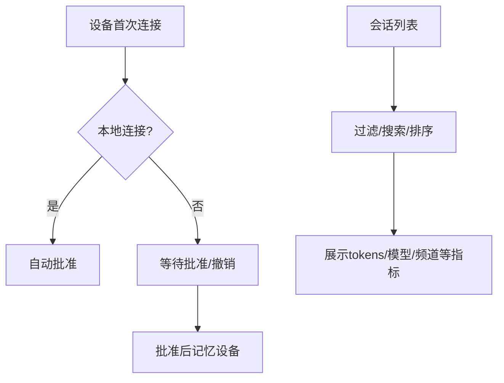
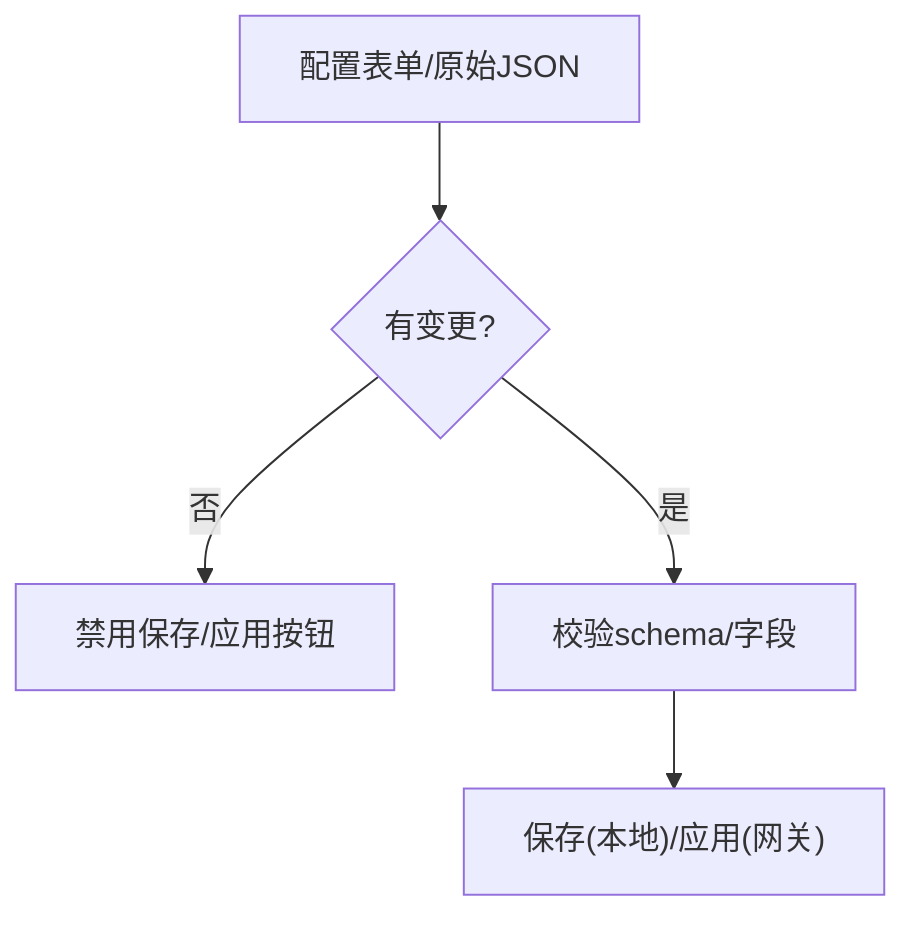
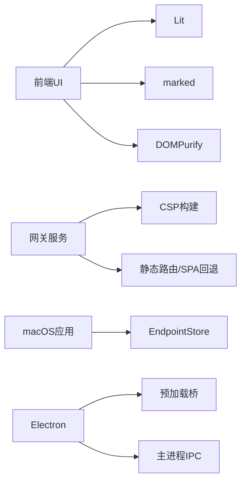

# 控制面板

<cite>
**本文引用的文件**
- [dashboard.md](file://docs/cli/dashboard.md)
- [dashboard.ts](file://src/commands/dashboard.ts)
- [control-ui.md](file://docs/web/control-ui.md)
- [control-ui.ts](file://src/gateway/control-ui.ts)
- [control-ui-csp.ts](file://src/gateway/control-ui-csp.ts)
- [GatewayEndpointStore.swift](file://apps/macos/Sources/OpenClaw/GatewayEndpointStore.swift)
- [app-settings.ts](file://ui/src/ui/app-settings.ts)
- [app-render.helpers.ts](file://ui/src/ui/app-render.helpers.ts)
- [config.ts](file://extensions/acpx/src/config.ts)
- [acp-agents.md](file://docs/tools/acp-agents.md)
- [window.ts](file://apps/electron/src/main/window.ts)
- [index.ts](file://apps/electron/src/preload/index.ts)
- [ipc-wizard.ts](file://apps/electron/src/main/ipc-wizard.ts)
- [media-control-cards.ts](file://src/line/flex-templates/media-control-cards.ts)
- [config.ts](file://src/config/types.ts)
- [session-tab-registry.ts](file://src/browser/session-tab-registry.ts)
- [session-hooks.ts](file://src/auto-reply/reply/session-hooks.ts)
- [package.json](file://ui/package.json)
</cite>

## 目录

1. [简介](#简介)
2. [项目结构](#项目结构)
3. [核心组件](#核心组件)
4. [架构总览](#架构总览)
5. [详细组件分析](#详细组件分析)
6. [依赖关系分析](#依赖关系分析)
7. [性能考虑](#性能考虑)
8. [故障排除指南](#故障排除指南)
9. [结论](#结论)
10. [附录](#附录)

## 简介

本文件系统化梳理控制面板（Control UI）的整体架构、布局设计与核心功能模块，覆盖设备管理、会话监控、系统状态展示等能力，并提供配置管理、权限控制、操作流程、响应式设计与主题定制、用户体验优化等方面的说明。文档同时给出关键流程的时序图与类图，帮助开发者与运维人员快速理解与落地。

## 项目结构

控制面板由“网关侧服务 + 浏览器前端 + 多平台集成”三部分组成：

- 网关侧：提供静态资源分发、安全策略、WebSocket 接入点与 RPC 能力
- 前端：基于 Vite + Lit 的单页应用，提供聊天、节点、配置、会话、技能、日志等视图
- 多平台：macOS 应用通过本地/远程隧道解析仪表盘 URL；Electron 提供桌面集成与 IPC 能力

图表来源

- [control-ui.ts:81-120](file://src/gateway/control-ui.ts#L81-L120)
- [control-ui-csp.ts:1-17](file://src/gateway/control-ui-csp.ts#L1-L17)
- [GatewayEndpointStore.swift:667-717](file://apps/macos/Sources/OpenClaw/GatewayEndpointStore.swift#L667-L717)
- [window.ts:1-98](file://apps/electron/src/main/window.ts#L1-L98)

章节来源

- [control-ui.ts:81-120](file://src/gateway/control-ui.ts#L81-L120)
- [control-ui-csp.ts:1-17](file://src/gateway/control-ui-csp.ts#L1-L17)
- [GatewayEndpointStore.swift:667-717](file://apps/macos/Sources/OpenClaw/GatewayEndpointStore.swift#L667-L717)
- [window.ts:1-98](file://apps/electron/src/main/window.ts#L1-L98)

## 核心组件

- 网关控制 UI 服务
  - 静态资源路由与 SPA 回退、CSP 安全头、跨域/来源白名单
  - 通过 URL 片段注入令牌，避免查询参数泄露
- 前端控制 UI
  - 基于 Lit 的响应式组件，支持主题切换、语言选择、表单/原始 JSON 编辑
  - 与网关 WebSocket 直连，支持聊天、会话、节点、配置、技能、日志等操作
- macOS 集成
  - EndpointStore 解析本地/远程连接模式，生成带令牌的仪表盘 URL
- Electron 集成
  - 预加载桥接暴露有限 API，主进程处理 Wizard RPC 与网关重启
- 权限与配置
  - ACP 权限模式与非交互权限策略；配置项校验与应用

章节来源

- [control-ui.ts:81-120](file://src/gateway/control-ui.ts#L81-L120)
- [control-ui.md:1-269](file://docs/web/control-ui.md#L1-L269)
- [GatewayEndpointStore.swift:667-717](file://apps/macos/Sources/OpenClaw/GatewayEndpointStore.swift#L667-L717)
- [index.ts:1-39](file://apps/electron/src/preload/index.ts#L1-L39)
- [ipc-wizard.ts:1-42](file://apps/electron/src/main/ipc-wizard.ts#L1-L42)
- [config.ts:156-190](file://extensions/acpx/src/config.ts#L156-L190)
- [acp-agents.md:566-603](file://docs/tools/acp-agents.md#L566-L603)

## 架构总览

控制面板采用“网关即服务 + 前端即体验”的架构：

- 网关负责静态资源与安全策略，WebSocket 提供实时 RPC 与事件
- 前端通过 URL 片段携带令牌，实现免输入登录
- macOS/Electron 提供本地/远程隧道与桌面集成能力

图表来源

- [GatewayEndpointStore.swift:667-717](file://apps/macos/Sources/OpenClaw/GatewayEndpointStore.swift#L667-L717)
- [control-ui.ts:81-120](file://src/gateway/control-ui.ts#L81-L120)
- [control-ui.md:26-31](file://docs/web/control-ui.md#L26-L31)

## 详细组件分析

### 组件A：网关控制 UI 服务

职责与特性

- 静态资源路由：对常见扩展名直接返回 404，未知路径回退到 SPA
- 安全策略：严格 CSP，禁止内嵌与内联脚本，仅允许必要的字体/样式来源
- WebSocket：直连网关，支持聊天、会话、配置、日志等 RPC
- URL 规范化：自动将 ws/wss 转 http/https，拼接 basePath，令牌放入片段

图表来源

- [control-ui.ts:81-120](file://src/gateway/control-ui.ts#L81-L120)
- [control-ui.ts:464-481](file://src/gateway/control-ui.ts#L464-L481)
- [control-ui-csp.ts:1-17](file://src/gateway/control-ui-csp.ts#L1-L17)

章节来源

- [control-ui.ts:81-120](file://src/gateway/control-ui.ts#L81-L120)
- [control-ui.ts:464-481](file://src/gateway/control-ui.ts#L464-L481)
- [control-ui-csp.ts:1-17](file://src/gateway/control-ui-csp.ts#L1-L17)

### 组件B：前端控制 UI（Lit/Vite）

职责与特性

- 主题与语言：根据系统偏好与用户设置应用主题，支持多语言懒加载
- 视图组织：聊天、节点、配置、会话、技能、日志等模块化视图
- 表单与原始编辑：支持表单模式与原始 JSON 模式，变更检测与保存/应用
- 响应式与图标：内置太阳/月亮/显示器等主题图标，适配不同屏幕尺寸

图表来源

- [app-settings.ts:253-277](file://ui/src/ui/app-settings.ts#L253-L277)
- [app-render.helpers.ts:540-574](file://ui/src/ui/app-render.helpers.ts#L540-L574)

章节来源

- [app-settings.ts:253-277](file://ui/src/ui/app-settings.ts#L253-L277)
- [app-render.helpers.ts:540-574](file://ui/src/ui/app-render.helpers.ts#L540-L574)
- [package.json:11-26](file://ui/package.json#L11-L26)

### 组件C：macOS 仪表盘 URL 解析与生成

职责与特性

- 支持本地/远程/未配置三种连接模式
- 自动解析绑定模式、自定义主机、TLS 方案
- 将令牌写入 URL 片段，避免泄露
- 在本地 tailnet 模式下自动回退到 Tailscale IP

图表来源

- [GatewayEndpointStore.swift:667-717](file://apps/macos/Sources/OpenClaw/GatewayEndpointStore.swift#L667-L717)
- [GatewayEndpointStore.swift:592-607](file://apps/macos/Sources/OpenClaw/GatewayEndpointStore.swift#L592-L607)

章节来源

- [GatewayEndpointStore.swift:667-717](file://apps/macos/Sources/OpenClaw/GatewayEndpointStore.swift#L667-L717)
- [GatewayEndpointStore.swift:592-607](file://apps/macos/Sources/OpenClaw/GatewayEndpointStore.swift#L592-L607)

### 组件D：Electron 集成与 IPC

职责与特性

- 预加载桥接：暴露平台信息、重启网关、获取网关信息等有限 API
- 主进程：通过 WS 连接网关，完成握手协议，转发 RPC 请求
- 窗口管理：支持开发/打包两种渲染页面加载方式，拦截外链

图表来源

- [index.ts:1-39](file://apps/electron/src/preload/index.ts#L1-L39)
- [window.ts:1-98](file://apps/electron/src/main/window.ts#L1-L98)
- [ipc-wizard.ts:1-42](file://apps/electron/src/main/ipc-wizard.ts#L1-L42)

章节来源

- [index.ts:1-39](file://apps/electron/src/preload/index.ts#L1-L39)
- [window.ts:1-98](file://apps/electron/src/main/window.ts#L1-L98)
- [ipc-wizard.ts:1-42](file://apps/electron/src/main/ipc-wizard.ts#L1-L42)

### 组件E：设备管理与会话监控

职责与特性

- 设备配对：首次连接需要一次性批准；本地连接自动批准
- 会话监控：按 agent、spawnedBy、label、活跃时间过滤，支持搜索与排序
- 会话钩子：开始/结束事件上下文构建，便于插件与自动化扩展

图表来源

- [control-ui.md:33-62](file://docs/web/control-ui.md#L33-L62)
- [session-tab-registry.ts:51-107](file://src/browser/session-tab-registry.ts#L51-L107)
- [session-hooks.ts:1-66](file://src/auto-reply/reply/session-hooks.ts#L1-L66)

章节来源

- [control-ui.md:33-62](file://docs/web/control-ui.md#L33-L62)
- [session-tab-registry.ts:51-107](file://src/browser/session-tab-registry.ts#L51-L107)
- [session-hooks.ts:1-66](file://src/auto-reply/reply/session-hooks.ts#L1-L66)

### 组件F：配置管理与权限控制

职责与特性

- 配置模式：表单模式与原始 JSON 模式，变更检测与保存/应用
- 权限模式：ACP 会话的权限模式与非交互权限策略
- 配置校验：对 permissionMode、nonInteractivePermissions、超时等进行校验

图表来源

- [config.ts:156-190](file://extensions/acpx/src/config.ts#L156-L190)
- [acp-agents.md:566-603](file://docs/tools/acp-agents.md#L566-L603)
- [config.ts:1-36](file://src/config/types.ts#L1-L36)

章节来源

- [config.ts:156-190](file://extensions/acpx/src/config.ts#L156-L190)
- [acp-agents.md:566-603](file://docs/tools/acp-agents.md#L566-L603)
- [config.ts:1-36](file://src/config/types.ts#L1-L36)

## 依赖关系分析

- 前端依赖：Lit、marked、DOMPurify、信号库等，用于响应式与富文本渲染
- 网关依赖：CSP 构建函数、静态资源路由、SPA 回退逻辑
- 平台依赖：macOS EndpointStore、Electron 预加载与主进程

图表来源

- [package.json:11-26](file://ui/package.json#L11-L26)
- [control-ui-csp.ts:1-17](file://src/gateway/control-ui-csp.ts#L1-L17)
- [control-ui.ts:81-120](file://src/gateway/control-ui.ts#L81-L120)
- [GatewayEndpointStore.swift:667-717](file://apps/macos/Sources/OpenClaw/GatewayEndpointStore.swift#L667-L717)
- [index.ts:1-39](file://apps/electron/src/preload/index.ts#L1-L39)
- [window.ts:1-98](file://apps/electron/src/main/window.ts#L1-L98)

章节来源

- [package.json:11-26](file://ui/package.json#L11-L26)
- [control-ui-csp.ts:1-17](file://src/gateway/control-ui-csp.ts#L1-L17)
- [control-ui.ts:81-120](file://src/gateway/control-ui.ts#L81-L120)
- [GatewayEndpointStore.swift:667-717](file://apps/macos/Sources/OpenClaw/GatewayEndpointStore.swift#L667-L717)
- [index.ts:1-39](file://apps/electron/src/preload/index.ts#L1-L39)
- [window.ts:1-98](file://apps/electron/src/main/window.ts#L1-L98)

## 性能考虑

- 静态资源与 SPA 回退：减少不必要的后端计算，提升首屏速度
- CSP 与安全头：在保证安全的前提下最小化阻断，避免影响渲染性能
- WebSocket：长连接复用，事件驱动更新，降低轮询开销
- 前端响应式：基于信号与轻量组件，减少重绘与回流

## 故障排除指南

常见问题与定位建议

- 仪表盘无法打开
  - 确认网关已启动且监听端口可用
  - 检查绑定模式与本地/远程隧道是否正确
- 令牌泄露风险
  - 使用 URL 片段传递令牌，避免查询参数
  - 避免在命令行输出或剪贴板中暴露令牌
- 非安全上下文（HTTP）导致 WebCrypto 不可用
  - 使用 HTTPS 或本地回环地址打开
  - 仅在受控场景启用“允许非安全认证”
- 设备配对失败
  - 首次连接需批准；本地连接自动批准
  - 查看 pending 列表并批准对应请求
- 会话异常
  - 使用会话过滤/搜索定位问题会话
  - 检查会话钩子上下文与代理/工具策略

章节来源

- [dashboard.md:1-23](file://docs/cli/dashboard.md#L1-L23)
- [dashboard.ts:71-90](file://src/commands/dashboard.ts#L71-L90)
- [control-ui.md:154-200](file://docs/web/control-ui.md#L154-L200)
- [control-ui.md:33-62](file://docs/web/control-ui.md#L33-L62)
- [session-tab-registry.ts:51-107](file://src/browser/session-tab-registry.ts#L51-L107)

## 结论

控制面板以网关为中心，结合前端 UI、macOS 与 Electron 的多平台能力，提供了安全、易用、可扩展的可视化管理入口。通过严格的 CSP、令牌片段化传递、设备配对与会话监控机制，确保在开放网络中的可控访问。配置与权限体系支持从简单到复杂的多种使用场景，满足日常运维与自动化需求。

## 附录

### 快速操作步骤

- 打开仪表盘
  - 本地：直接访问回环地址与默认端口
  - 远程：通过 macOS 应用生成带令牌的 URL 或使用 CLI 输出的 URL
- 首次连接与配对
  - 首次连接需在网关侧批准；本地连接自动批准
- 配置与应用
  - 在配置视图中选择表单或原始 JSON 模式，保存后应用以验证并重启

章节来源

- [control-ui.md:18-62](file://docs/web/control-ui.md#L18-L62)
- [dashboard.ts:50-118](file://src/commands/dashboard.ts#L50-L118)
- [GatewayEndpointStore.swift:667-717](file://apps/macos/Sources/OpenClaw/GatewayEndpointStore.swift#L667-L717)

### 界面截图与操作要点

- 主题与语言
  - 通过设置面板切换主题与语言，主题图标直观显示当前模式
- 配置视图
  - 分区导航、变更提示、保存/应用按钮状态联动
- 会话视图
  - 支持按 agent、spawnedBy、label、活跃时间过滤与搜索

章节来源

- [app-render.helpers.ts:540-574](file://ui/src/ui/app-render.helpers.ts#L540-L574)
- [config.ts:450-655](file://ui/src/ui/views/config.ts#L450-L655)

### 响应式设计与主题定制

- 响应式布局：适配不同屏幕尺寸，移动端优先的交互细节
- 主题定制：支持系统/浅色/深色主题，图标与颜色方案统一
- 无障碍：SVG 图标具备可访问性属性，语义化标签完善

章节来源

- [app-settings.ts:253-277](file://ui/src/ui/app-settings.ts#L253-L277)
- [app-render.helpers.ts:540-574](file://ui/src/ui/app-render.helpers.ts#L540-L574)

### 设备控制卡片（示例）

- 适用于智能电视、家庭设备等的控制卡片模板，包含状态指示与按键网格

章节来源

- [media-control-cards.ts:400-460](file://src/line/flex-templates/media-control-cards.ts#L400-L460)
