# 控制面板

<cite>
**本文引用的文件**
- [dashboard.md](file://docs/cli/dashboard.md)
- [dashboard.ts](file://src/commands/dashboard.ts)
- [control-ui.md](file://docs/web/control-ui.md)
- [control-ui.ts](file://src/gateway/control-ui.ts)
- [control-ui-csp.ts](file://src/gateway/control-ui-csp.ts)
- [GatewayEndpointStore.swift](file://apps/macos/Sources/OpenClaw/GatewayEndpointStore.swift)
- [app-settings.ts](file://ui/src/ui/app-settings.ts)
- [app-render.helpers.ts](file://ui/src/ui/app-render.helpers.ts)
- [config.ts](file://extensions/acpx/src/config.ts)
- [acp-agents.md](file://docs/tools/acp-agents.md)
- [window.ts](file://apps/electron/src/main/window.ts)
- [index.ts](file://apps/electron/src/preload/index.ts)
- [ipc-wizard.ts](file://apps/electron/src/main/ipc-wizard.ts)
- [media-control-cards.ts](file://src/line/flex-templates/media-control-cards.ts)
- [config.ts](file://src/config/types.ts)
- [session-tab-registry.ts](file://src/browser/session-tab-registry.ts)
- [session-hooks.ts](file://src/auto-reply/reply/session-hooks.ts)
- [package.json](file://ui/package.json)
- [components.json](file://ui-react/components.json)
- [App.tsx](file://ui-react/src/App.tsx)
- [AppShell.tsx](file://ui-react/src/components/layout/AppShell.tsx)
- [Sidebar.tsx](file://ui-react/src/components/layout/Sidebar.tsx)
- [button.tsx](file://ui-react/src/components/ui/button.tsx)
- [card.tsx](file://ui-react/src/components/ui/card.tsx)
- [router.tsx](file://ui-react/src/router.tsx)
- [ChatPage.tsx](file://ui-react/src/pages/ChatPage.tsx)
- [OverviewPage.tsx](file://ui-react/src/pages/OverviewPage.tsx)
- [ThreadView.tsx](file://ui-react/src/components/chat/ThreadView.tsx)
- [SkillCard.tsx](file://ui-react/src/components/skills/SkillCard.tsx)
- [gateway.store.ts](file://ui-react/src/store/gateway.store.ts)
- [useGateway.ts](file://ui-react/src/hooks/useGateway.ts)
- [tabs.ts](file://ui-react/src/lib/tabs.ts)
- [gateway.ts](file://ui-react/src/types/gateway.ts)
- [package.json](file://ui-react/package.json)
</cite>

## 更新摘要
**所做更改**
- 新增了基于React和shadcn/ui的新UI组件系统架构
- 更新了现代化的布局系统和组件设计
- 增加了新的聊天界面和技能管理系统
- 改进了状态管理和数据流架构
- 添加了响应式设计和主题定制功能

## 目录
1. [简介](#简介)
2. [项目结构](#项目结构)
3. [核心组件](#核心组件)
4. [架构总览](#架构总览)
5. [详细组件分析](#详细组件分析)
6. [依赖关系分析](#依赖关系分析)
7. [性能考虑](#性能考虑)
8. [故障排除指南](#故障排除指南)
9. [结论](#结论)
10. [附录](#附录)

## 简介
本文件系统化梳理控制面板（Control UI）的整体架构、布局设计与核心功能模块，覆盖设备管理、会话监控、系统状态展示等能力，并提供配置管理、权限控制、操作流程、响应式设计与主题定制、用户体验优化等方面的说明。文档同时给出关键流程的时序图与类图，帮助开发者与运维人员快速理解与落地。

**更新** 本版本重点介绍了基于React和shadcn/ui的现代化UI组件系统，包括新的布局架构、组件设计和状态管理。

## 项目结构
控制面板现已演进为"网关侧服务 + React前端 + 多平台集成"的三层架构：
- 网关侧：提供静态资源分发、安全策略、WebSocket 接入点与 RPC 能力
- 前端：基于React + shadcn/ui + Radix UI的现代化组件系统，提供聊天、节点、配置、会话、技能、日志等视图
- 多平台：macOS 应用通过本地/远程隧道解析仪表盘 URL；Electron 提供桌面集成与 IPC 能力

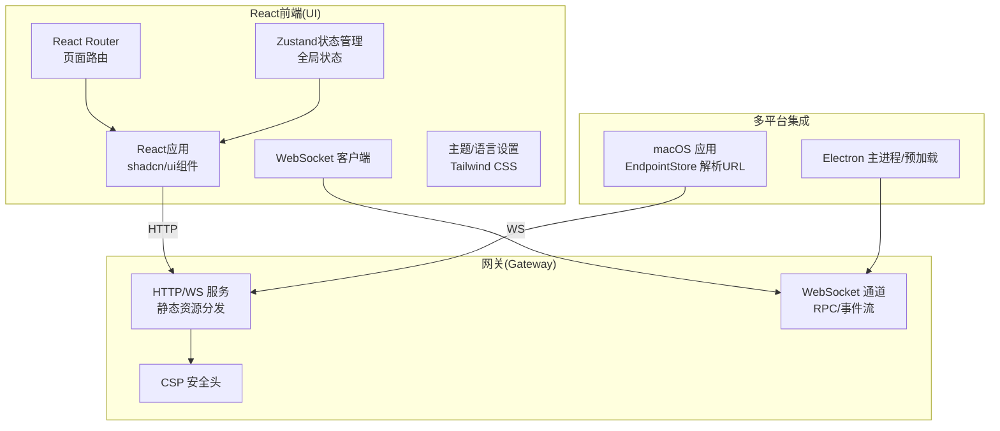
```mermaid
graph TB
subgraph "网关(Gateway)"
GW_HTTP["HTTP/WS 服务<br/>静态资源分发"]
GW_WS["WebSocket 通道<br/>RPC/事件流"]
GW_CSP["CSP 安全头"]
end
subgraph "React前端(UI)"
UI_REACT["React应用<br/>shadcn/ui组件"]
UI_ROUTER["React Router<br/>页面路由"]
UI_STORE["Zustand状态管理<br/>全局状态"]
UI_WS["WebSocket 客户端"]
UI_THEME["主题/语言设置<br/>Tailwind CSS"]
end
subgraph "多平台集成"
MAC["macOS 应用<br/>EndpointStore 解析URL"]
ELEC["Electron 主进程/预加载"]
end
UI_REACT --> |HTTP| GW_HTTP
UI_ROUTER --> UI_REACT
UI_STORE --> UI_REACT
UI_WS --> |WS| GW_WS
GW_HTTP --> GW_CSP
MAC --> GW_HTTP
ELEC --> GW_WS
```

**图表来源**
- [AppShell.tsx:11-32](file://ui-react/src/components/layout/AppShell.tsx#L11-L32)
- [router.tsx:19-41](file://ui-react/src/router.tsx#L19-L41)
- [gateway.store.ts:72-183](file://ui-react/src/store/gateway.store.ts#L72-L183)
- [useGateway.ts:429-501](file://ui-react/src/hooks/useGateway.ts#L429-L501)

**章节来源**
- [AppShell.tsx:11-32](file://ui-react/src/components/layout/AppShell.tsx#L11-L32)
- [router.tsx:19-41](file://ui-react/src/router.tsx#L19-L41)
- [gateway.store.ts:72-183](file://ui-react/src/store/gateway.store.ts#L72-L183)
- [useGateway.ts:429-501](file://ui-react/src/hooks/useGateway.ts#L429-L501)

## 核心组件
- 网关控制 UI 服务
  - 静态资源路由与 SPA 回退、CSP 安全头、跨域/来源白名单
  - 通过 URL 片段注入令牌，避免查询参数泄露
- 现代化前端控制 UI
  - 基于React + shadcn/ui + Radix UI的组件系统，支持主题切换、语言选择、表单/原始 JSON 编辑
  - 与网关 WebSocket 直连，支持聊天、会话、节点、配置、技能、日志等操作
  - 响应式布局，支持移动端和桌面端
- 状态管理
  - 基于Zustand的状态管理，提供全局状态共享和事件处理
  - 类型安全的接口定义，避免运行时错误
- 布局系统
  - 基于shadcn/ui sidebar组件的现代化布局
  - 支持折叠导航和响应式设计
- macOS 集成
  - EndpointStore 解析本地/远程连接模式，生成带令牌的仪表盘 URL
- Electron 集成
  - 预加载桥接暴露有限 API，主进程处理 Wizard RPC 与网关重启
- 权限与配置
  - ACP 权限模式与非交互权限策略；配置项校验与应用

**章节来源**
- [control-ui.ts:81-120](file://src/gateway/control-ui.ts#L81-L120)
- [control-ui.md:1-269](file://docs/web/control-ui.md#L1-L269)
- [GatewayEndpointStore.swift:667-717](file://apps/macos/Sources/OpenClaw/GatewayEndpointStore.swift#L667-L717)
- [index.ts:1-39](file://apps/electron/src/preload/index.ts#L1-L39)
- [ipc-wizard.ts:1-42](file://apps/electron/src/main/ipc-wizard.ts#L1-L42)
- [config.ts:156-190](file://extensions/acpx/src/config.ts#L156-L190)
- [acp-agents.md:566-603](file://docs/tools/acp-agents.md#L566-L603)

## 架构总览
控制面板采用"网关即服务 + 现代化前端 + 多平台集成"的架构：
- 网关负责静态资源与安全策略，WebSocket 提供实时 RPC 与事件
- 前端通过React Router组织页面，shadcn/ui组件提供一致的UI体验
- 状态管理基于Zustand，提供类型安全的全局状态
- macOS/Electron 提供本地/远程隧道与桌面集成能力

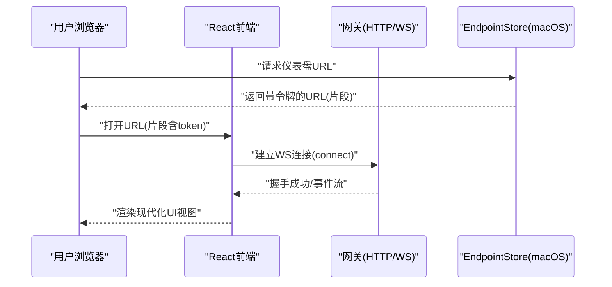
```mermaid
sequenceDiagram
participant U as "用户浏览器"
participant UI as "React前端"
participant GW as "网关(HTTP/WS)"
participant EP as "EndpointStore(macOS)"
U->>EP : "请求仪表盘URL"
EP-->>U : "返回带令牌的URL(片段)"
U->>UI : "打开URL(片段含token)"
UI->>GW : "建立WS连接(connect)"
GW-->>UI : "握手成功/事件流"
UI-->>U : "渲染现代化UI视图"
```

**图表来源**
- [GatewayEndpointStore.swift:667-717](file://apps/macos/Sources/OpenClaw/GatewayEndpointStore.swift#L667-L717)
- [control-ui.ts:81-120](file://src/gateway/control-ui.ts#L81-L120)
- [control-ui.md:26-31](file://docs/web/control-ui.md#L26-L31)

## 详细组件分析

### 组件A：网关控制 UI 服务
职责与特性
- 静态资源路由：对常见扩展名直接返回 404，未知路径回退到 SPA
- 安全策略：严格 CSP，禁止内嵌与内联脚本，仅允许必要的字体/样式来源
- WebSocket：直连网关，支持聊天、会话、配置、日志等 RPC
- URL 规范化：自动将 ws/wss 转 http/https，拼接 basePath，令牌放入片段

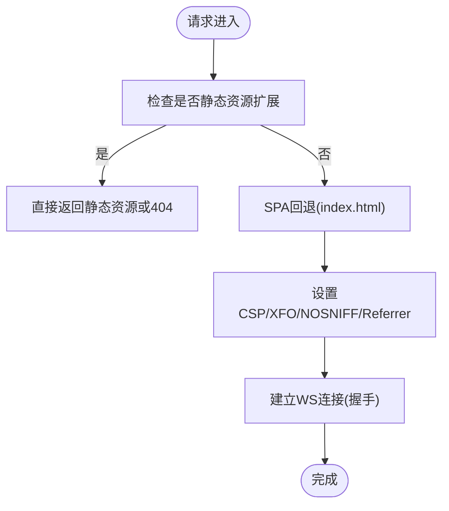
```mermaid
flowchart TD
Start(["请求进入"]) --> CheckExt["检查是否静态资源扩展"]
CheckExt --> |是| ServeStatic["直接返回静态资源或404"]
CheckExt --> |否| SpaFallback["SPA回退(index.html)"]
SpaFallback --> ApplySec["设置CSP/XFO/NOSNIFF/Referrer"]
ApplySec --> WSConn["建立WS连接(握手)"]
WSConn --> Done(["完成"])
```

**图表来源**
- [control-ui.ts:81-120](file://src/gateway/control-ui.ts#L81-L120)
- [control-ui.ts:464-481](file://src/gateway/control-ui.ts#L464-L481)
- [control-ui-csp.ts:1-17](file://src/gateway/control-ui-csp.ts#L1-L17)

**章节来源**
- [control-ui.ts:81-120](file://src/gateway/control-ui.ts#L81-L120)
- [control-ui.ts:464-481](file://src/gateway/control-ui.ts#L464-L481)
- [control-ui-csp.ts:1-17](file://src/gateway/control-ui-csp.ts#L1-L17)

### 组件B：现代化前端控制 UI（React + shadcn/ui）
职责与特性
- 组件系统：基于shadcn/ui和Radix UI的现代化组件库，提供一致的设计语言
- 布局系统：基于shadcn/ui sidebar组件的响应式布局
- 状态管理：基于Zustand的全局状态管理，类型安全
- 页面路由：基于React Router的页面组织和导航
- 主题系统：支持浅色/深色/系统主题，Tailwind CSS定制

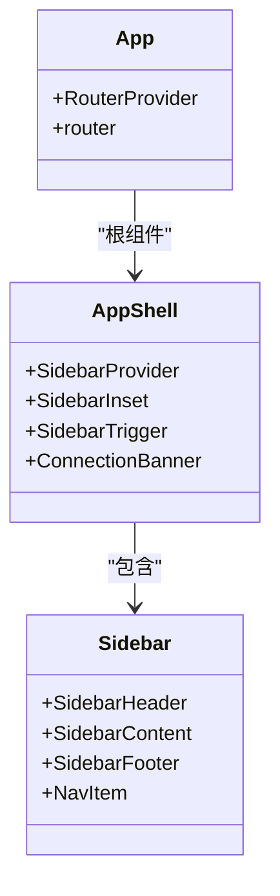
```mermaid
classDiagram
class AppShell {
+SidebarProvider
+SidebarInset
+SidebarTrigger
+ConnectionBanner
}
class Sidebar {
+SidebarHeader
+SidebarContent
+SidebarFooter
+NavItem
}
class App {
+RouterProvider
+router
}
App --> AppShell : "根组件"
AppShell --> Sidebar : "包含"
```

**图表来源**
- [AppShell.tsx:11-32](file://ui-react/src/components/layout/AppShell.tsx#L11-L32)
- [Sidebar.tsx:21-92](file://ui-react/src/components/layout/Sidebar.tsx#L21-L92)
- [App.tsx:4-6](file://ui-react/src/App.tsx#L4-L6)

**章节来源**
- [AppShell.tsx:11-32](file://ui-react/src/components/layout/AppShell.tsx#L11-L32)
- [Sidebar.tsx:21-92](file://ui-react/src/components/layout/Sidebar.tsx#L21-L92)
- [App.tsx:4-6](file://ui-react/src/App.tsx#L4-L6)

### 组件C：shadcn/ui组件系统
职责与特性
- 基础组件：button、card、input、badge、switch等基础UI组件
- 复合组件：sidebar、dialog、drawer、tooltip等复杂组件
- 样式系统：基于Tailwind CSS的原子化样式，支持主题定制
- 变体系统：使用class-variance-authority实现组件变体
- 图标系统：集成Lucide React图标库

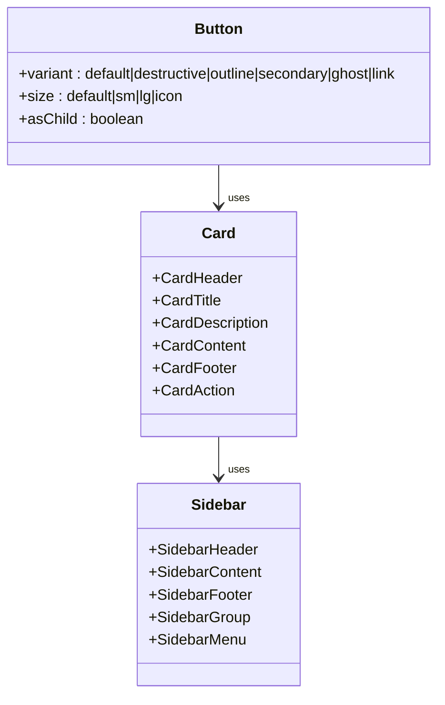
```mermaid
classDiagram
class Button {
+variant : default|destructive|outline|secondary|ghost|link
+size : default|sm|lg|icon
+asChild : boolean
}
class Card {
+CardHeader
+CardTitle
+CardDescription
+CardContent
+CardFooter
+CardAction
}
class Sidebar {
+SidebarHeader
+SidebarContent
+SidebarFooter
+SidebarGroup
+SidebarMenu
}
Button --> "uses" Card
Card --> "uses" Sidebar
```

**图表来源**
- [button.tsx:6-32](file://ui-react/src/components/ui/button.tsx#L6-L32)
- [card.tsx:4-74](file://ui-react/src/components/ui/card.tsx#L4-L74)
- [Sidebar.tsx:4-15](file://ui-react/src/components/layout/Sidebar.tsx#L4-L15)

**章节来源**
- [button.tsx:6-32](file://ui-react/src/components/ui/button.tsx#L6-L32)
- [card.tsx:4-74](file://ui-react/src/components/ui/card.tsx#L4-L74)
- [Sidebar.tsx:4-15](file://ui-react/src/components/layout/Sidebar.tsx#L4-L15)

### 组件D：状态管理与数据流
职责与特性
- 全局状态：基于Zustand的状态管理，提供类型安全的全局状态
- 网关状态：管理WebSocket连接、事件处理、错误状态
- 页面状态：管理各页面的特定状态和数据
- 事件系统：处理来自网关的实时事件和状态变化

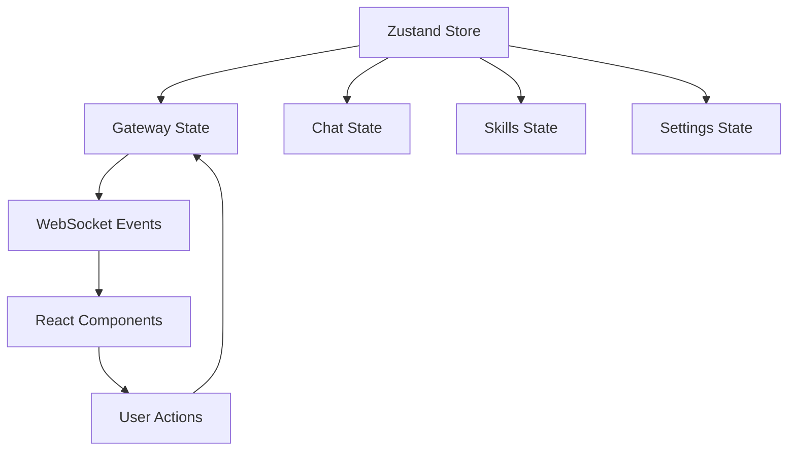
```mermaid
flowchart TD
Store["Zustand Store"] --> Gateway["Gateway State"]
Store --> Chat["Chat State"]
Store --> Skills["Skills State"]
Store --> Settings["Settings State"]
Gateway --> Events["WebSocket Events"]
Events --> UI["React Components"]
UI --> Actions["User Actions"]
Actions --> Gateway
```

**图表来源**
- [gateway.store.ts:72-183](file://ui-react/src/store/gateway.store.ts#L72-L183)
- [useGateway.ts:429-501](file://ui-react/src/hooks/useGateway.ts#L429-L501)

**章节来源**
- [gateway.store.ts:72-183](file://ui-react/src/store/gateway.store.ts#L72-L183)
- [useGateway.ts:429-501](file://ui-react/src/hooks/useGateway.ts#L429-L501)

### 组件E：聊天界面与消息系统
职责与特性
- 实时聊天：基于@assistant-ui/react的消息系统
- 会话管理：支持多个聊天会话的创建、切换和管理
- 消息渲染：支持Markdown渲染和富文本显示
- 输入组件：提供消息Composer组件，支持多模态输入

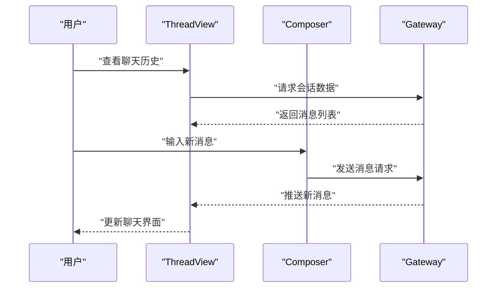
```mermaid
sequenceDiagram
participant U as "用户"
participant TV as "ThreadView"
participant CM as "Composer"
participant GW as "Gateway"
U->>TV : "查看聊天历史"
TV->>GW : "请求会话数据"
GW-->>TV : "返回消息列表"
U->>CM : "输入新消息"
CM->>GW : "发送消息请求"
GW-->>TV : "推送新消息"
TV-->>U : "更新聊天界面"
```

**图表来源**
- [ChatPage.tsx:9-95](file://ui-react/src/pages/ChatPage.tsx#L9-L95)
- [ThreadView.tsx:15-81](file://ui-react/src/components/chat/ThreadView.tsx#L15-L81)

**章节来源**
- [ChatPage.tsx:9-95](file://ui-react/src/pages/ChatPage.tsx#L9-L95)
- [ThreadView.tsx:15-81](file://ui-react/src/components/chat/ThreadView.tsx#L15-L81)

### 组件F：技能管理系统
职责与特性
- 技能卡片：每个技能显示状态、描述、依赖关系
- 安装管理：支持技能的安装、启用、禁用、移除
- API密钥管理：支持技能所需的API密钥配置
- 状态反馈：提供操作结果的视觉反馈

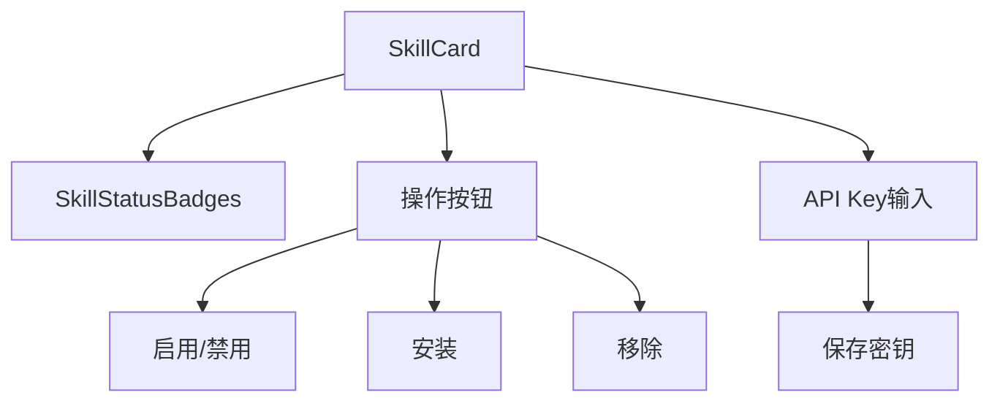
```mermaid
flowchart TD
Skill["SkillCard"] --> Status["SkillStatusBadges"]
Skill --> Actions["操作按钮"]
Skill --> APIKey["API Key输入"]
Actions --> Enable["启用/禁用"]
Actions --> Install["安装"]
Actions --> Remove["移除"]
APIKey --> Save["保存密钥"]
```

**图表来源**
- [SkillCard.tsx:22-153](file://ui-react/src/components/skills/SkillCard.tsx#L22-L153)

**章节来源**
- [SkillCard.tsx:22-153](file://ui-react/src/components/skills/SkillCard.tsx#L22-L153)

### 组件G：页面路由与导航
职责与特性
- 页面组织：基于React Router的页面路由系统
- 导航分组：按功能模块组织导航菜单
- 响应式设计：支持移动端和桌面端的导航体验
- 活跃状态：自动识别当前激活的导航项

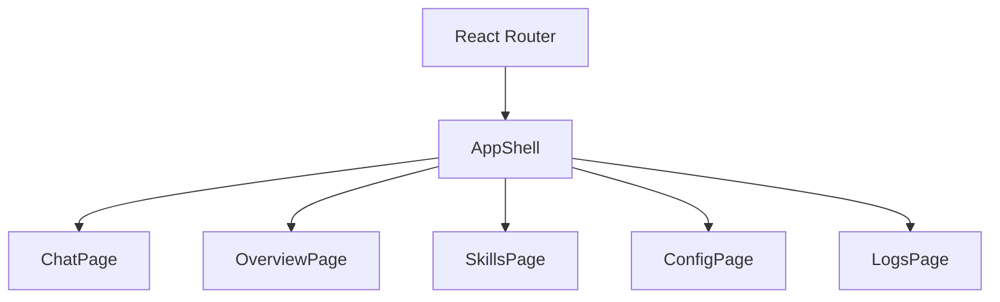
```mermaid
flowchart TD
Router["React Router"] --> AppShell["AppShell"]
AppShell --> Chat["ChatPage"]
AppShell --> Overview["OverviewPage"]
AppShell --> Skills["SkillsPage"]
AppShell --> Config["ConfigPage"]
AppShell --> Logs["LogsPage"]
```

**图表来源**
- [router.tsx:19-41](file://ui-react/src/router.tsx#L19-L41)
- [tabs.ts:45-69](file://ui-react/src/lib/tabs.ts#L45-L69)

**章节来源**
- [router.tsx:19-41](file://ui-react/src/router.tsx#L19-L41)
- [tabs.ts:45-69](file://ui-react/src/lib/tabs.ts#L45-L69)

### 组件H：macOS 仪表盘 URL 解析与生成
职责与特性
- 支持本地/远程/未配置三种连接模式
- 自动解析绑定模式、自定义主机、TLS 方案
- 将令牌写入 URL 片段，避免泄露
- 在本地 tailnet 模式下自动回退到 Tailscale IP

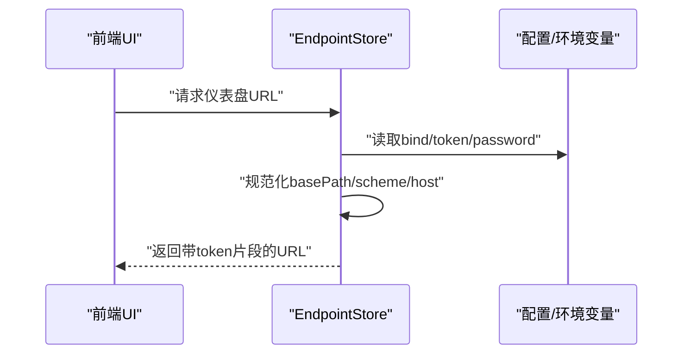
```mermaid
sequenceDiagram
participant UI as "前端UI"
participant EP as "EndpointStore"
participant CFG as "配置/环境变量"
UI->>EP : "请求仪表盘URL"
EP->>CFG : "读取bind/token/password"
EP->>EP : "规范化basePath/scheme/host"
EP-->>UI : "返回带token片段的URL"
```

**图表来源**
- [GatewayEndpointStore.swift:667-717](file://apps/macos/Sources/OpenClaw/GatewayEndpointStore.swift#L667-L717)
- [GatewayEndpointStore.swift:592-607](file://apps/macos/Sources/OpenClaw/GatewayEndpointStore.swift#L592-L607)

**章节来源**
- [GatewayEndpointStore.swift:667-717](file://apps/macos/Sources/OpenClaw/GatewayEndpointStore.swift#L667-L717)
- [GatewayEndpointStore.swift:592-607](file://apps/macos/Sources/OpenClaw/GatewayEndpointStore.swift#L592-L607)

### 组件I：Electron 集成与 IPC
职责与特性
- 预加载桥接：暴露平台信息、重启网关、获取网关信息等有限 API
- 主进程：通过 WS 连接网关，完成握手协议，转发 RPC 请求
- 窗口管理：支持开发/打包两种渲染页面加载方式，拦截外链

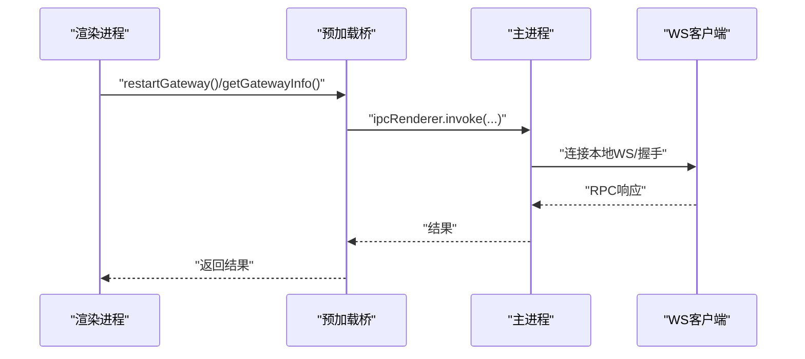
```mermaid
sequenceDiagram
participant R as "渲染进程"
participant P as "预加载桥"
participant M as "主进程"
participant W as "WS客户端"
R->>P : "restartGateway()/getGatewayInfo()"
P->>M : "ipcRenderer.invoke(...)"
M->>W : "连接本地WS/握手"
W-->>M : "RPC响应"
M-->>P : "结果"
P-->>R : "返回结果"
```

**图表来源**
- [index.ts:1-39](file://apps/electron/src/preload/index.ts#L1-L39)
- [window.ts:1-98](file://apps/electron/src/main/window.ts#L1-L98)
- [ipc-wizard.ts:1-42](file://apps/electron/src/main/ipc-wizard.ts#L1-L42)

**章节来源**
- [index.ts:1-39](file://apps/electron/src/preload/index.ts#L1-L39)
- [window.ts:1-98](file://apps/electron/src/main/window.ts#L1-L98)
- [ipc-wizard.ts:1-42](file://apps/electron/src/main/ipc-wizard.ts#L1-L42)

### 组件J：设备管理与会话监控
职责与特性
- 设备配对：首次连接需要一次性批准；本地连接自动批准
- 会话监控：按 agent、spawnedBy、label、活跃时间过滤，支持搜索与排序
- 会话钩子：开始/结束事件上下文构建，便于插件与自动化扩展

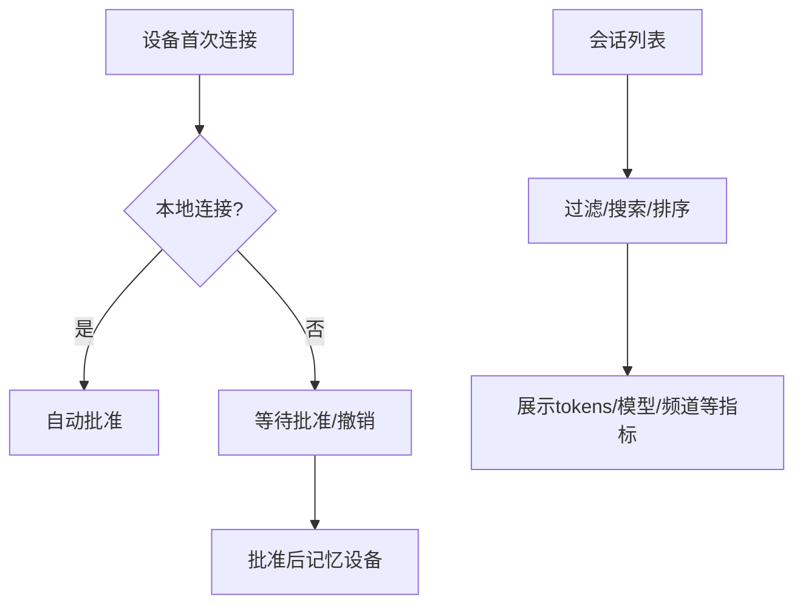
```mermaid
flowchart TD
D1["设备首次连接"] --> D2{"本地连接?"}
D2 --> |是| D3["自动批准"]
D2 --> |否| D4["等待批准/撤销"]
D4 --> D5["批准后记忆设备"]
S1["会话列表"] --> S2["过滤/搜索/排序"]
S2 --> S3["展示tokens/模型/频道等指标"]
```

**图表来源**
- [control-ui.md:33-62](file://docs/web/control-ui.md#L33-L62)
- [session-tab-registry.ts:51-107](file://src/browser/session-tab-registry.ts#L51-L107)
- [session-hooks.ts:1-66](file://src/auto-reply/reply/session-hooks.ts#L1-L66)

**章节来源**
- [control-ui.md:33-62](file://docs/web/control-ui.md#L33-L62)
- [session-tab-registry.ts:51-107](file://src/browser/session-tab-registry.ts#L51-L107)
- [session-hooks.ts:1-66](file://src/auto-reply/reply/session-hooks.ts#L1-L66)

### 组件K：配置管理与权限控制
职责与特性
- 配置模式：表单模式与原始 JSON 模式，变更检测与保存/应用
- 权限模式：ACP 会话的权限模式与非交互权限策略
- 配置校验：对 permissionMode、nonInteractivePermissions、超时等进行校验

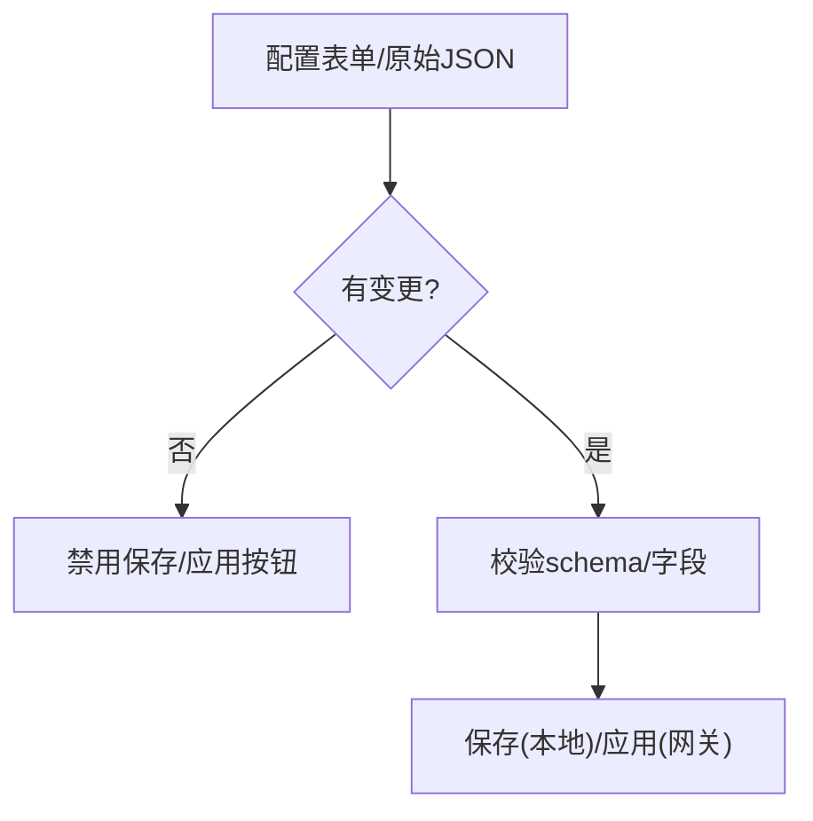
```mermaid
flowchart TD
C1["配置表单/原始JSON"] --> C2{"有变更?"}
C2 --> |否| C3["禁用保存/应用按钮"]
C2 --> |是| C4["校验schema/字段"]
C4 --> C5["保存(本地)/应用(网关)"]
```

**图表来源**
- [config.ts:156-190](file://extensions/acpx/src/config.ts#L156-L190)
- [acp-agents.md:566-603](file://docs/tools/acp-agents.md#L566-L603)
- [config.ts:1-36](file://src/config/types.ts#L1-L36)

**章节来源**
- [config.ts:156-190](file://extensions/acpx/src/config.ts#L156-L190)
- [acp-agents.md:566-603](file://docs/tools/acp-agents.md#L566-L603)
- [config.ts:1-36](file://src/config/types.ts#L1-L36)

## 依赖关系分析
- 前端依赖：React 19、shadcn/ui、Radix UI、Zustand、React Router等现代化前端技术栈
- 网关依赖：CSP 构建函数、静态资源路由、SPA 回退逻辑
- 平台依赖：macOS EndpointStore、Electron 预加载与主进程

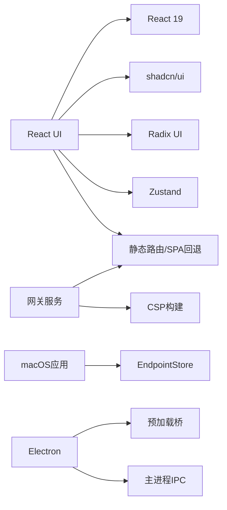
```mermaid
graph LR
UI["React UI"] --> REACT["React 19"]
UI --> SHADCN["shadcn/ui"]
UI --> RADIX["Radix UI"]
UI --> ZUSTAND["Zustand"]
UI --> ROUTER["React Router"]
GW["网关服务"] --> CSP["CSP构建"]
GW --> ROUTER["静态路由/SPA回退"]
MAC["macOS应用"] --> EP["EndpointStore"]
ELEC["Electron"] --> PRE["预加载桥"]
ELEC --> MAIN["主进程IPC"]
```

**图表来源**
- [package.json:11-26](file://ui/package.json#L11-L26)
- [package.json:11-46](file://ui-react/package.json#L11-L46)
- [control-ui-csp.ts:1-17](file://src/gateway/control-ui-csp.ts#L1-L17)
- [control-ui.ts:81-120](file://src/gateway/control-ui.ts#L81-L120)
- [GatewayEndpointStore.swift:667-717](file://apps/macos/Sources/OpenClaw/GatewayEndpointStore.swift#L667-L717)
- [index.ts:1-39](file://apps/electron/src/preload/index.ts#L1-L39)
- [window.ts:1-98](file://apps/electron/src/main/window.ts#L1-L98)

**章节来源**
- [package.json:11-26](file://ui/package.json#L11-L26)
- [package.json:11-46](file://ui-react/package.json#L11-L46)
- [control-ui-csp.ts:1-17](file://src/gateway/control-ui-csp.ts#L1-L17)
- [control-ui.ts:81-120](file://src/gateway/control-ui.ts#L81-L120)
- [GatewayEndpointStore.swift:667-717](file://apps/macos/Sources/OpenClaw/GatewayEndpointStore.swift#L667-L717)
- [index.ts:1-39](file://apps/electron/src/preload/index.ts#L1-L39)
- [window.ts:1-98](file://apps/electron/src/main/window.ts#L1-L98)

## 性能考虑
- 组件优化：基于React 19的并发特性和shadcn/ui的轻量组件设计
- 状态管理：Zustand相比Redux更轻量，减少不必要的重渲染
- 路由优化：React Router的懒加载和代码分割
- WebSocket：长连接复用，事件驱动更新，降低轮询开销
- 样式优化：Tailwind CSS的原子化样式减少CSS体积
- 响应式设计：移动端优先的布局，减少不必要的重排

## 故障排除指南
常见问题与定位建议
- 仪表盘无法打开
  - 确认网关已启动且监听端口可用
  - 检查绑定模式与本地/远程隧道是否正确
- 令牌泄露风险
  - 使用 URL 片段传递令牌，避免查询参数
  - 避免在命令行输出或剪贴板中暴露令牌
- 非安全上下文（HTTP）导致 WebCrypto 不可用
  - 使用 HTTPS 或本地回环地址打开
  - 仅在受控场景启用"允许非安全认证"
- 设备配对失败
  - 首次连接需批准；本地连接自动批准
  - 查看 pending 列表并批准对应请求
- 会话异常
  - 使用会话过滤/搜索定位问题会话
  - 检查会话钩子上下文与代理/工具策略
- 组件渲染问题
  - 检查shadcn/ui组件的导入和配置
  - 确认Tailwind CSS配置正确
- 状态管理问题
  - 检查Zustand store的初始化和订阅
  - 确认状态更新的类型安全性

**章节来源**
- [dashboard.md:1-23](file://docs/cli/dashboard.md#L1-L23)
- [dashboard.ts:71-90](file://src/commands/dashboard.ts#L71-L90)
- [control-ui.md:154-200](file://docs/web/control-ui.md#L154-L200)
- [control-ui.md:33-62](file://docs/web/control-ui.md#L33-L62)
- [session-tab-registry.ts:51-107](file://src/browser/session-tab-registry.ts#L51-L107)

## 结论
控制面板已成功演进为基于React和shadcn/ui的现代化UI组件系统，以网关为中心，结合前端 UI、macOS 与 Electron 的多平台能力，提供了安全、易用、可扩展的可视化管理入口。新的组件系统采用shadcn/ui的设计语言，基于Radix UI提供可靠的UI基础，配合Zustand实现高效的状态管理。通过严格的 CSP、令牌片段化传递、设备配对与会话监控机制，确保在开放网络中的可控访问。配置与权限体系支持从简单到复杂的多种使用场景，满足日常运维与自动化需求。

## 附录

### 快速操作步骤
- 打开仪表盘
  - 本地：直接访问回环地址与默认端口
  - 远程：通过 macOS 应用生成带令牌的 URL 或使用 CLI 输出的 URL
- 首次连接与配对
  - 首次连接需在网关侧批准；本地连接自动批准
- 配置与应用
  - 在配置视图中选择表单或原始 JSON 模式，保存后应用以验证并重启
- 使用现代化UI
  - 通过左侧导航访问不同的功能模块
  - 使用顶部工具栏进行全局操作

**章节来源**
- [control-ui.md:18-62](file://docs/web/control-ui.md#L18-L62)
- [dashboard.ts:50-118](file://src/commands/dashboard.ts#L50-L118)
- [GatewayEndpointStore.swift:667-717](file://apps/macos/Sources/OpenClaw/GatewayEndpointStore.swift#L667-L717)

### 界面截图与操作要点
- 主题与语言
  - 通过设置面板切换主题与语言，主题图标直观显示当前模式
- 导航系统
  - 左侧sidebar提供功能分组导航，支持折叠和展开
- 配置视图
  - 分区导航、变更提示、保存/应用按钮状态联动
- 会话视图
  - 支持按 agent、spawnedBy、label、活跃时间过滤与搜索
- 聊天界面
  - 实时消息显示，支持Markdown渲染和多模态输入

**章节来源**
- [app-render.helpers.ts:540-574](file://ui/src/ui/app-render.helpers.ts#L540-L574)
- [config.ts:450-655](file://ui/src/ui/views/config.ts#L450-L655)
- [AppShell.tsx:11-32](file://ui-react/src/components/layout/AppShell.tsx#L11-L32)
- [ChatPage.tsx:9-95](file://ui-react/src/pages/ChatPage.tsx#L9-L95)

### 响应式设计与主题定制
- 响应式布局：基于shadcn/ui的sidebar组件，适配不同屏幕尺寸
- 主题定制：支持系统/浅色/深色主题，Tailwind CSS变量定制
- 组件一致性：所有组件遵循统一的设计系统和交互规范
- 无障碍支持：组件内置ARIA属性和键盘导航支持

**章节来源**
- [app-settings.ts:253-277](file://ui/src/ui/app-settings.ts#L253-L277)
- [app-render.helpers.ts:540-574](file://ui/src/ui/app-render.helpers.ts#L540-L574)
- [components.json:1-21](file://ui-react/components.json#L1-L21)

### 设备控制卡片（示例）
- 适用于智能电视、家庭设备等的控制卡片模板，包含状态指示与按键网格

**章节来源**
- [media-control-cards.ts:400-460](file://src/line/flex-templates/media-control-cards.ts#L400-L460)

### 现代化UI组件系统特色
- 组件库：基于shadcn/ui的高质量UI组件
- 设计系统：统一的视觉语言和交互模式
- 类型安全：完整的TypeScript支持
- 开发体验：快速迭代和热重载支持
- 性能优化：Tree-shaking和按需加载

**章节来源**
- [components.json:1-21](file://ui-react/components.json#L1-L21)
- [package.json:11-46](file://ui-react/package.json#L11-L46)
- [gateway.ts:10-22](file://ui-react/src/types/gateway.ts#L10-L22)