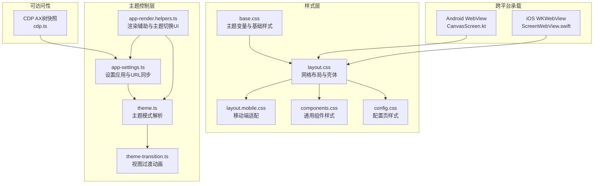
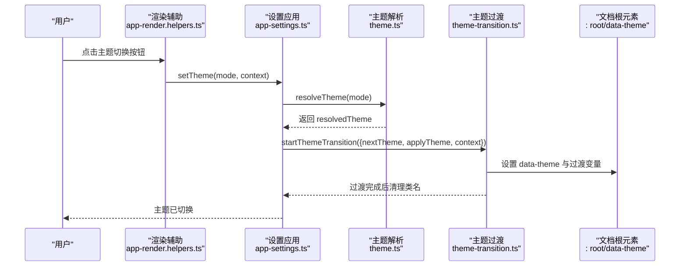
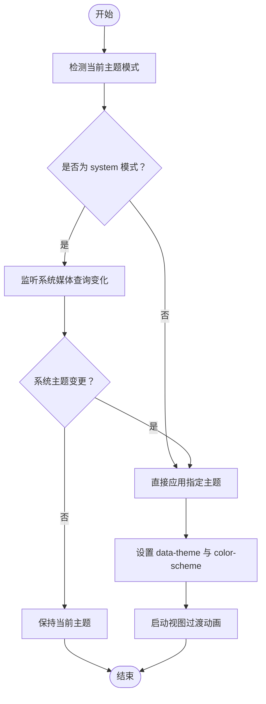
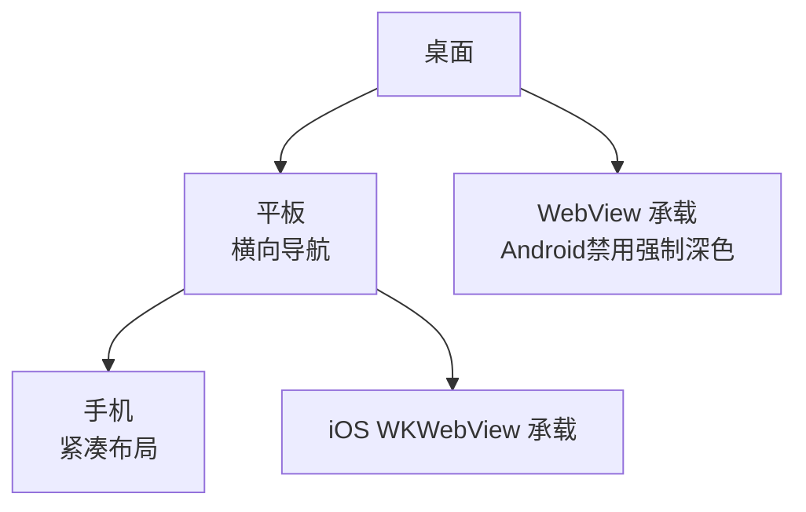
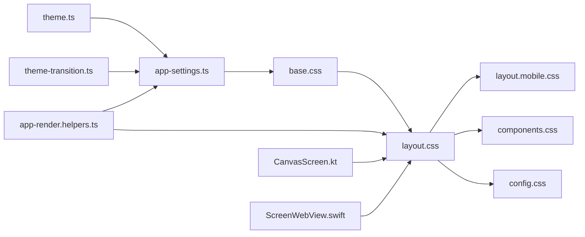

# 界面定制

<cite>
**本文档引用的文件**
- [ui/src/styles/base.css](file://ui/src/styles/base.css)
- [ui/src/styles/layout.css](file://ui/src/styles/layout.css)
- [ui/src/styles/layout.mobile.css](file://ui/src/styles/layout.mobile.css)
- [ui/src/styles/components.css](file://ui/src/styles/components.css)
- [ui/src/styles/config.css](file://ui/src/styles/config.css)
- [ui/src/ui/app-settings.ts](file://ui/src/ui/app-settings.ts)
- [ui/src/ui/app-render.helpers.ts](file://ui/src/ui/app-render.helpers.ts)
- [ui/src/ui/theme.ts](file://ui/src/ui/theme.ts)
- [ui/src/ui/theme-transition.ts](file://ui/src/ui/theme-transition.ts)
- [apps/android/app/src/main/java/ai/openclaw/app/ui/CanvasScreen.kt](file://apps/android/app/src/main/java/ai/openclaw/app/ui/CanvasScreen.kt)
- [apps/ios/Sources/Screen/ScreenWebView.swift](file://apps/ios/Sources/Screen/ScreenWebView.swift)
- [src/browser/cdp.ts](file://src/browser/cdp.ts)
</cite>

## 目录

1. [简介](#简介)
2. [项目结构](#项目结构)
3. [核心组件](#核心组件)
4. [架构总览](#架构总览)
5. [详细组件分析](#详细组件分析)
6. [依赖关系分析](#依赖关系分析)
7. [性能考虑](#性能考虑)
8. [故障排除指南](#故障排除指南)
9. [结论](#结论)
10. [附录](#附录)

## 简介

本文件系统化阐述本项目的界面定制能力，包括主题系统（深色/浅色/跟随系统）、颜色方案与字体配置、界面布局与组件定制、样式覆盖方法、响应式设计与移动端适配、浏览器兼容性、CSS 变量体系、第三方主题集成指南，以及无障碍访问、键盘导航与屏幕阅读器支持策略。内容基于仓库中的前端样式系统、主题切换逻辑与跨平台 WebView 集成实现进行总结。

## 项目结构

界面定制相关的核心文件主要集中在 UI 样式层与主题控制层，并通过 WebView 在移动端承载渲染：

- 样式层
  - 基础变量与主题：ui/src/styles/base.css
  - 布局网格与壳体：ui/src/styles/layout.css
  - 移动端适配：ui/src/styles/layout.mobile.css
  - 组件样式：ui/src/styles/components.css
  - 配置页面样式：ui/src/styles/config.css
- 主题控制层
  - 主题模式解析与监听：ui/src/ui/theme.ts
  - 主题过渡动画：ui/src/ui/theme-transition.ts
  - 设置应用与 URL 同步：ui/src/ui/app-settings.ts
  - 渲染辅助与主题切换 UI：ui/src/ui/app-render.helpers.ts
- 跨平台承载
  - Android WebView：apps/android/app/src/main/java/.../CanvasScreen.kt
  - iOS WKWebView：apps/ios/Sources/Screen/ScreenWebView.swift
- 无障碍与可访问性
  - CDP 辅助：src/browser/cdp.ts（用于 AX 树快照）

**图表来源**

- [ui/src/styles/base.css:1-386](file://ui/src/styles/base.css#L1-L386)
- [ui/src/styles/layout.css:1-625](file://ui/src/styles/layout.css#L1-L625)
- [ui/src/styles/layout.mobile.css:1-375](file://ui/src/styles/layout.mobile.css#L1-L375)
- [ui/src/styles/components.css:1-800](file://ui/src/styles/components.css#L1-L800)
- [ui/src/styles/config.css:1-919](file://ui/src/styles/config.css#L1-L919)
- [ui/src/ui/theme.ts:1-16](file://ui/src/ui/theme.ts#L1-L16)
- [ui/src/ui/theme-transition.ts:1-110](file://ui/src/ui/theme-transition.ts#L1-L110)
- [ui/src/ui/app-settings.ts:1-455](file://ui/src/ui/app-settings.ts#L1-L455)
- [ui/src/ui/app-render.helpers.ts:1-575](file://ui/src/ui/app-render.helpers.ts#L1-L575)
- [apps/android/app/src/main/java/ai/openclaw/app/ui/CanvasScreen.kt:1-150](file://apps/android/app/src/main/java/ai/openclaw/app/ui/CanvasScreen.kt#L1-L150)
- [apps/ios/Sources/Screen/ScreenWebView.swift:1-79](file://apps/ios/Sources/Screen/ScreenWebView.swift#L1-L79)
- [src/browser/cdp.ts:279-305](file://src/browser/cdp.ts#L279-L305)

**章节来源**

- [ui/src/styles/base.css:1-386](file://ui/src/styles/base.css#L1-L386)
- [ui/src/styles/layout.css:1-625](file://ui/src/styles/layout.css#L1-L625)
- [ui/src/styles/layout.mobile.css:1-375](file://ui/src/styles/layout.mobile.css#L1-L375)
- [ui/src/styles/components.css:1-800](file://ui/src/styles/components.css#L1-L800)
- [ui/src/styles/config.css:1-919](file://ui/src/styles/config.css#L1-L919)
- [ui/src/ui/app-settings.ts:1-455](file://ui/src/ui/app-settings.ts#L1-L455)
- [ui/src/ui/app-render.helpers.ts:1-575](file://ui/src/ui/app-render.helpers.ts#L1-L575)
- [ui/src/ui/theme.ts:1-16](file://ui/src/ui/theme.ts#L1-L16)
- [ui/src/ui/theme-transition.ts:1-110](file://ui/src/ui/theme-transition.ts#L1-L110)
- [apps/android/app/src/main/java/ai/openclaw/app/ui/CanvasScreen.kt:1-150](file://apps/android/app/src/main/java/ai/openclaw/app/ui/CanvasScreen.kt#L1-L150)
- [apps/ios/Sources/Screen/ScreenWebView.swift:1-79](file://apps/ios/Sources/Screen/ScreenWebView.swift#L1-L79)
- [src/browser/cdp.ts:279-305](file://src/browser/cdp.ts#L279-L305)

## 核心组件

- 主题系统
  - 支持三种模式：system（跟随系统）、light（浅色）、dark（深色）
  - 使用 CSS 变量与 data-theme 属性驱动主题切换
  - 视图过渡动画通过 View Transition API 实现
- 颜色方案
  - 深色/浅色两套完整变量集，覆盖背景、卡片、面板、文本、边框、强调色、语义色等
  - 提供强调色、次强调色、光晕效果与阴影层级
- 字体配置
  - 定义无衬线体与等宽字体变量，支持多平台字体回退
- 布局与网格
  - 基于 CSS Grid 的壳体布局，支持桌面/平板/手机三档断点
  - 内容区网格、统计卡片网格、笔记网格等工具类
- 组件样式
  - 按钮、表单字段、标签、状态点、卡片、统计等通用组件
- 配置页面样式
  - 侧边栏 + 主内容的双列布局，支持搜索、导航、差分展示、表单等
- 跨平台承载
  - Android WebView 与 iOS WKWebView 承载 UI，支持禁用系统强制深色以避免主题冲突

**章节来源**

- [ui/src/ui/theme.ts:1-16](file://ui/src/ui/theme.ts#L1-L16)
- [ui/src/ui/theme-transition.ts:1-110](file://ui/src/ui/theme-transition.ts#L1-L110)
- [ui/src/ui/app-settings.ts:264-277](file://ui/src/ui/app-settings.ts#L264-L277)
- [ui/src/styles/base.css:1-386](file://ui/src/styles/base.css#L1-L386)
- [ui/src/styles/layout.css:1-625](file://ui/src/styles/layout.css#L1-L625)
- [ui/src/styles/layout.mobile.css:1-375](file://ui/src/styles/layout.mobile.css#L1-L375)
- [ui/src/styles/components.css:1-800](file://ui/src/styles/components.css#L1-L800)
- [ui/src/styles/config.css:1-919](file://ui/src/styles/config.css#L1-L919)
- [apps/android/app/src/main/java/ai/openclaw/app/ui/CanvasScreen.kt:133-137](file://apps/android/app/src/main/java/ai/openclaw/app/ui/CanvasScreen.kt#L133-L137)
- [apps/ios/Sources/Screen/ScreenWebView.swift:1-79](file://apps/ios/Sources/Screen/ScreenWebView.swift#L1-L79)

## 架构总览

界面定制由“样式变量层 + 主题控制层 + 渲染层 + 承载层”构成，主题切换通过设置应用、媒体查询监听与视图过渡动画协同完成；移动端通过 WebView 承载并规避系统强制深色影响。

**图表来源**

- [ui/src/ui/app-render.helpers.ts:492-537](file://ui/src/ui/app-render.helpers.ts#L492-L537)
- [ui/src/ui/app-settings.ts:169-181](file://ui/src/ui/app-settings.ts#L169-L181)
- [ui/src/ui/theme.ts:11-16](file://ui/src/ui/theme.ts#L11-L16)
- [ui/src/ui/theme-transition.ts:46-109](file://ui/src/ui/theme-transition.ts#L46-L109)

**章节来源**

- [ui/src/ui/app-render.helpers.ts:492-537](file://ui/src/ui/app-render.helpers.ts#L492-L537)
- [ui/src/ui/app-settings.ts:169-181](file://ui/src/ui/app-settings.ts#L169-L181)
- [ui/src/ui/theme-transition.ts:46-109](file://ui/src/ui/theme-transition.ts#L46-L109)

## 详细组件分析

### 主题系统与切换流程

- 主题模式
  - system：根据系统偏好自动选择 light/dark
  - light/dark：固定模式
- 切换机制
  - 应用设置时写入 data-theme 与 color-scheme
  - 监听系统主题变化，仅在模式为 system 时生效
  - 视图过渡动画使用 View Transition API，支持指针位置或元素中心作为扩散起点
- 变量体系
  - :root 与 :root[data-theme="light"] 分别定义深浅两套变量
  - 包含背景、卡片、面板、文本、边框、强调色、语义色、阴影、圆角、动效曲线与持续时间

**图表来源**

- [ui/src/ui/theme.ts:4-16](file://ui/src/ui/theme.ts#L4-L16)
- [ui/src/ui/app-settings.ts:264-314](file://ui/src/ui/app-settings.ts#L264-L314)
- [ui/src/ui/theme-transition.ts:46-109](file://ui/src/ui/theme-transition.ts#L46-L109)
- [ui/src/styles/base.css:1-187](file://ui/src/styles/base.css#L1-L187)

**章节来源**

- [ui/src/ui/theme.ts:1-16](file://ui/src/ui/theme.ts#L1-L16)
- [ui/src/ui/app-settings.ts:264-314](file://ui/src/ui/app-settings.ts#L264-L314)
- [ui/src/ui/theme-transition.ts:1-110](file://ui/src/ui/theme-transition.ts#L1-L110)
- [ui/src/styles/base.css:1-187](file://ui/src/styles/base.css#L1-L187)

### 颜色方案与字体配置

- 颜色方案
  - 深色：背景/卡片/面板/文本/边框/强调色/语义色均采用深色系变量
  - 浅色：同上，但数值更亮，强调色与光晕效果略有差异
  - 语义色：成功/警告/危险/信息等，配合次强调色与前景色
- 字体配置
  - --font-body 与 --font-display 默认包含多平台回退字体
  - --mono 为等宽字体栈，适合代码块与配置输入
- 动画与过渡
  - 定义了多种缓动曲线与持续时间，用于按钮、卡片、布局切换等
  - :focus-visible 使用统一的焦点环样式

**章节来源**

- [ui/src/styles/base.css:81-187](file://ui/src/styles/base.css#L81-L187)
- [ui/src/styles/base.css:381-386](file://ui/src/styles/base.css#L381-L386)

### 布局与组件定制

- 布局
  - 壳体使用 CSS Grid，定义 topbar、nav、content 三区域
  - 支持导航折叠、聊天专注模式、引导页模式等变体类
  - 桌面/平板/手机三档断点，移动端水平导航与紧凑间距
- 组件
  - 按钮：主按钮、危险按钮、图标按钮、尺寸变体
  - 表单：输入框、文本域、下拉、复选框、错误态
  - 卡片、统计、标签、状态点、主题切换控件等
- 配置页面
  - 侧边栏 + 主内容双列布局
  - 搜索、导航、差分面板、分组卡片、表单网格等

**章节来源**

- [ui/src/styles/layout.css:1-625](file://ui/src/styles/layout.css#L1-L625)
- [ui/src/styles/layout.mobile.css:1-375](file://ui/src/styles/layout.mobile.css#L1-L375)
- [ui/src/styles/components.css:1-800](file://ui/src/styles/components.css#L1-L800)
- [ui/src/styles/config.css:1-919](file://ui/src/styles/config.css#L1-L919)

### 样式覆盖与第三方主题集成

- CSS 变量覆盖
  - 在 :root 与 :root[data-theme="light"] 中重定义变量即可实现主题覆盖
  - 推荐通过注入额外样式表或在构建阶段替换变量值的方式
- 组件级覆盖
  - 使用更具体的选择器或在容器上添加命名空间类，避免全局污染
  - 优先覆盖变量而非硬编码颜色值，确保与主题模式联动
- 第三方主题集成
  - 通过自定义变量集生成独立样式文件，按需引入
  - 注意与现有动效、焦点环、滚动条样式保持一致

**章节来源**

- [ui/src/styles/base.css:1-187](file://ui/src/styles/base.css#L1-L187)
- [ui/src/styles/components.css:1-800](file://ui/src/styles/components.css#L1-L800)

### 响应式设计与移动端适配

- 断点策略
  - 桌面：导航纵向、内容区网格
  - 平板：导航横向滚动、内容区网格压缩
  - 手机：导航项紧凑、内容区极简、表单字号增大
- 交互优化
  - 移动端按钮与表单项增大触控面积
  - 导航折叠与聊天专注模式减少干扰
- WebView 适配
  - Android：禁用 FORCE_DARK 以避免系统强制深色覆盖
  - iOS：通过 WKWebView 配置与容器约束承载 UI

**图表来源**

- [ui/src/styles/layout.css:569-623](file://ui/src/styles/layout.css#L569-L623)
- [ui/src/styles/layout.mobile.css:1-375](file://ui/src/styles/layout.mobile.css#L1-L375)
- [apps/android/app/src/main/java/ai/openclaw/app/ui/CanvasScreen.kt:133-137](file://apps/android/app/src/main/java/ai/openclaw/app/ui/CanvasScreen.kt#L133-L137)
- [apps/ios/Sources/Screen/ScreenWebView.swift:42-67](file://apps/ios/Sources/Screen/ScreenWebView.swift#L42-L67)

**章节来源**

- [ui/src/styles/layout.css:569-623](file://ui/src/styles/layout.css#L569-L623)
- [ui/src/styles/layout.mobile.css:1-375](file://ui/src/styles/layout.mobile.css#L1-L375)
- [apps/android/app/src/main/java/ai/openclaw/app/ui/CanvasScreen.kt:133-137](file://apps/android/app/src/main/java/ai/openclaw/app/ui/CanvasScreen.kt#L133-L137)
- [apps/ios/Sources/Screen/ScreenWebView.swift:42-67](file://apps/ios/Sources/Screen/ScreenWebView.swift#L42-L67)

### 无障碍访问、键盘导航与屏幕阅读器支持

- 键盘导航
  - 使用 :focus-visible 统一焦点环样式
  - 按钮与交互元素具备明确的键盘可达性
- 屏幕阅读器
  - 配置页面与表单使用语义化结构与 aria 属性
  - 通过 CDP 获取 AX 树快照，辅助验证可访问性
- 交互反馈
  - 状态点、按钮、表单错误态提供视觉与语义提示
  - 减少运动偏好场景下的动画复杂度

**章节来源**

- [ui/src/styles/base.css:381-386](file://ui/src/styles/base.css#L381-L386)
- [ui/src/styles/components.css:458-520](file://ui/src/styles/components.css#L458-L520)
- [src/browser/cdp.ts:282-295](file://src/browser/cdp.ts#L282-L295)

## 依赖关系分析

- 主题控制依赖
  - app-settings 依赖 theme.ts 解析模式，依赖 theme-transition.ts 启动过渡
  - app-render.helpers.ts 提供主题切换 UI 渲染与图标
- 样式依赖
  - layout.css 依赖 base.css 的变量
  - mobile.css 为 layout.css 的补充断点
  - components.css 与 config.css 依赖 layout.css 的容器与网格
- 承载依赖
  - Android 与 iOS WebView 依赖 UI 样式与主题变量

**图表来源**

- [ui/src/ui/theme.ts:1-16](file://ui/src/ui/theme.ts#L1-L16)
- [ui/src/ui/theme-transition.ts:1-110](file://ui/src/ui/theme-transition.ts#L1-L110)
- [ui/src/ui/app-settings.ts:1-455](file://ui/src/ui/app-settings.ts#L1-L455)
- [ui/src/ui/app-render.helpers.ts:1-575](file://ui/src/ui/app-render.helpers.ts#L1-L575)
- [ui/src/styles/base.css:1-386](file://ui/src/styles/base.css#L1-L386)
- [ui/src/styles/layout.css:1-625](file://ui/src/styles/layout.css#L1-L625)
- [ui/src/styles/layout.mobile.css:1-375](file://ui/src/styles/layout.mobile.css#L1-L375)
- [ui/src/styles/components.css:1-800](file://ui/src/styles/components.css#L1-L800)
- [ui/src/styles/config.css:1-919](file://ui/src/styles/config.css#L1-L919)
- [apps/android/app/src/main/java/ai/openclaw/app/ui/CanvasScreen.kt:1-150](file://apps/android/app/src/main/java/ai/openclaw/app/ui/CanvasScreen.kt#L1-L150)
- [apps/ios/Sources/Screen/ScreenWebView.swift:1-79](file://apps/ios/Sources/Screen/ScreenWebView.swift#L1-L79)

**章节来源**

- [ui/src/ui/app-settings.ts:1-455](file://ui/src/ui/app-settings.ts#L1-L455)
- [ui/src/ui/app-render.helpers.ts:1-575](file://ui/src/ui/app-render.helpers.ts#L1-L575)
- [ui/src/styles/base.css:1-386](file://ui/src/styles/base.css#L1-L386)
- [ui/src/styles/layout.css:1-625](file://ui/src/styles/layout.css#L1-L625)
- [ui/src/styles/layout.mobile.css:1-375](file://ui/src/styles/layout.mobile.css#L1-L375)
- [ui/src/styles/components.css:1-800](file://ui/src/styles/components.css#L1-L800)
- [ui/src/styles/config.css:1-919](file://ui/src/styles/config.css#L1-L919)
- [apps/android/app/src/main/java/ai/openclaw/app/ui/CanvasScreen.kt:1-150](file://apps/android/app/src/main/java/ai/openclaw/app/ui/CanvasScreen.kt#L1-L150)
- [apps/ios/Sources/Screen/ScreenWebView.swift:1-79](file://apps/ios/Sources/Screen/ScreenWebView.swift#L1-L79)

## 性能考虑

- 主题切换
  - 使用 CSS 变量与 data-theme 切换，避免重排与重绘
  - 视图过渡动画在高帧率设备上流畅，在减少运动偏好下自动降级
- 样式体积
  - 将通用组件与布局拆分为独立模块，按需加载
  - 移动端断点样式独立，减少不必要的规则
- 交互性能
  - 按钮与表单使用最小必要过渡，避免过度动画
  - 滚动条样式与阴影层级在低端设备上保持简洁

[本节为通用指导，无需特定文件引用]

## 故障排除指南

- 主题未生效
  - 检查 data-theme 是否正确写入到 documentElement
  - 确认 color-scheme 与系统偏好一致
  - 若使用视图过渡，确认浏览器支持 View Transition API
- 移动端主题异常
  - Android：确认已禁用 FORCE_DARK
  - iOS：确认 WKWebView 未被系统强制深色覆盖
- 可访问性问题
  - 使用 CDP 的 Accessibility.getFullAXTree 快照检查节点角色与名称
  - 确保表单与交互元素具备正确的 aria 属性与焦点顺序

**章节来源**

- [ui/src/ui/app-settings.ts:264-277](file://ui/src/ui/app-settings.ts#L264-L277)
- [ui/src/ui/theme-transition.ts:66-109](file://ui/src/ui/theme-transition.ts#L66-L109)
- [apps/android/app/src/main/java/ai/openclaw/app/ui/CanvasScreen.kt:133-137](file://apps/android/app/src/main/java/ai/openclaw/app/ui/CanvasScreen.kt#L133-L137)
- [apps/ios/Sources/Screen/ScreenWebView.swift:1-79](file://apps/ios/Sources/Screen/ScreenWebView.swift#L1-L79)
- [src/browser/cdp.ts:282-295](file://src/browser/cdp.ts#L282-L295)

## 结论

本项目的界面定制以 CSS 变量为核心，结合主题解析、媒体查询监听与视图过渡动画，实现了跨平台一致的主题体验。通过模块化的样式组织与响应式断点，兼顾桌面与移动端的可用性。配合 WebView 承载与可访问性工具链，整体界面既美观又可靠。建议在扩展新主题时遵循变量覆盖与组件隔离原则，确保与现有系统无缝集成。

[本节为总结，无需特定文件引用]

## 附录

- 关键变量参考
  - 背景/卡片/面板/文本/边框/强调色/语义色/阴影/圆角/动效曲线
- 常用类名参考
  - 布局：.shell、.topbar、.nav、.content
  - 组件：.btn、.field、.card、.stat、.pill、.theme-toggle
  - 配置页：.config-layout、.config-sidebar、.config-main、.config-form

**章节来源**

- [ui/src/styles/base.css:1-187](file://ui/src/styles/base.css#L1-L187)
- [ui/src/styles/layout.css:1-625](file://ui/src/styles/layout.css#L1-L625)
- [ui/src/styles/components.css:1-800](file://ui/src/styles/components.css#L1-L800)
- [ui/src/styles/config.css:1-919](file://ui/src/styles/config.css#L1-L919)
