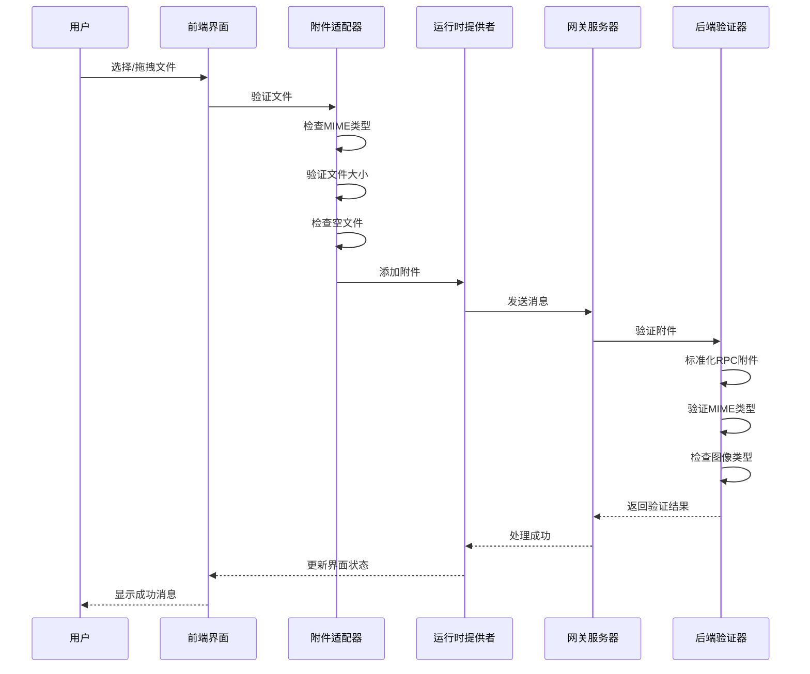
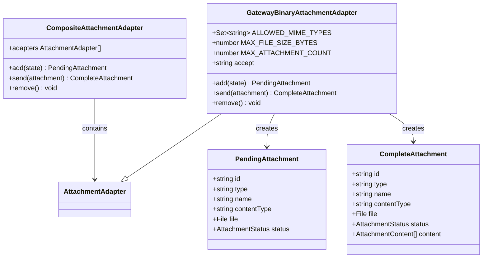
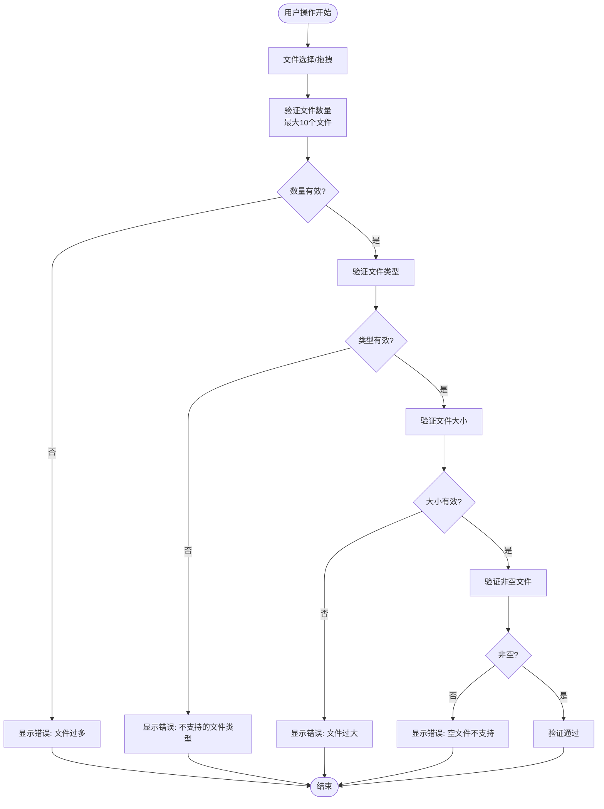
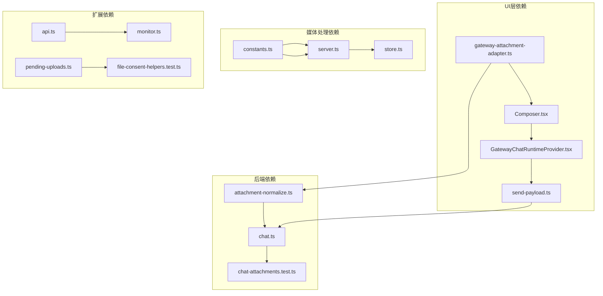

# 聊天文件上传当前解决方案

<cite>
**本文档引用的文件**
- [chat-file-upload-current-solution.md](file://docs/chat-file-upload-current-solution.md)
- [gateway-attachment-adapter.ts](file://ui-react/src/providers/chat/adapters/gateway-attachment-adapter.ts)
- [Composer.tsx](file://ui-react/src/components/chat/Composer.tsx)
- [send-payload.ts](file://ui-react/src/providers/chat/send-payload.ts)
- [send-payload.test.ts](file://ui-react/src/providers/chat/send-payload.test.ts)
- [GatewayChatRuntimeProvider.tsx](file://ui-react/src/providers/chat/GatewayChatRuntimeProvider.tsx)
- [attachment-normalize.ts](file://src/gateway/server-methods/attachment-normalize.ts)
- [chat.ts](file://src/gateway/server-methods/chat.ts)
- [chat-attachments.test.ts](file://src/gateway/chat-attachments.test.ts)
- [server-methods.test.ts](file://src/gateway/server-methods/server-methods.test.ts)
- [constants.ts](file://src/media/constants.ts)
- [paths.test.ts](file://src/browser/paths.test.ts)
- [server.ts](file://src/media/server.ts)
- [store.ts](file://src/media/store.ts)
- [api.ts](file://extensions/googlechat/src/api.ts)
- [monitor.ts](file://extensions/googlechat/src/monitor.ts)
- [file-consent-helpers.test.ts](file://extensions/msteams/src/file-consent-helpers.test.ts)
- [pending-uploads.ts](file://extensions/msteams/src/pending-uploads.ts)
- [attachments.ts](file://extensions/bluebubbles/src/attachments.ts)
- [media-payload.ts](file://src/channels/plugins/media-payload.ts)
</cite>

## 目录
1. [简介](#简介)
2. [项目结构](#项目结构)
3. [核心组件](#核心组件)
4. [架构概览](#架构概览)
5. [详细组件分析](#详细组件分析)
6. [依赖关系分析](#依赖关系分析)
7. [性能考虑](#性能考虑)
8. [故障排除指南](#故障排除指南)
9. [结论](#结论)

## 简介

OpenClaw项目中的聊天文件上传当前解决方案是一个经过精心设计的多层验证和处理系统。该解决方案专注于聊天合成器中的文件上传功能，特别针对文档类文件（排除图像文件）进行了优化。

该系统的核心目标是在文件选择阶段就拒绝不支持的文件类型，而不是在发送后才报错。系统采用双重验证策略：前端实时验证和后端严格验证，确保用户体验的一致性和安全性。

## 项目结构

聊天文件上传功能分布在多个关键模块中：

```mermaid
graph TB
subgraph "前端层"
UI[用户界面]
Adapter[附件适配器]
Composer[合成器]
Runtime[运行时提供者]
end
subgraph "后端层"
Gateway[网关服务器]
Validator[验证器]
Processor[处理器]
end
subgraph "扩展层"
GoogleChat[Google Chat集成]
MS Teams[Teams集成]
BlueBubbles[BlueBubbles集成]
end
UI --> Adapter
Adapter --> Composer
Composer --> Runtime
Runtime --> Gateway
Gateway --> Validator
Validator --> Processor
Processor --> GoogleChat
Processor --> MS Teams
Processor --> BlueBubbles
```

**图表来源**
- [gateway-attachment-adapter.ts:1-91](file://ui-react/src/providers/chat/adapters/gateway-attachment-adapter.ts#L1-L91)
- [Composer.tsx:1-176](file://ui-react/src/components/chat/Composer.tsx#L1-L176)
- [GatewayChatRuntimeProvider.tsx:139-173](file://ui-react/src/providers/chat/GatewayChatRuntimeProvider.tsx#L139-L173)

## 核心组件

### 前端验证系统

前端实现了多层次的文件验证机制：

**文件类型限制**
- 支持的MIME类型包括：PDF、纯文本、Markdown、HTML、CSV、JSON、XML以及各种Office文档格式
- 图像文件完全禁用，以避免混淆用户界面
- 每个文件大小限制为100MB（参考模式）

**验证时机**
- 文件选择时验证（input[type=file] change事件）
- 拖拽放置时验证（drop事件）
- 适配器添加时的深度验证

**错误处理**
- 实时错误提示显示在合成器区域
- 使用无障碍属性role="alert"确保屏幕阅读器正确读取
- 用户友好的错误消息保持英文显示

**图表来源**
- [gateway-attachment-adapter.ts:11-30](file://ui-react/src/providers/chat/adapters/gateway-attachment-adapter.ts#L11-L30)
- [Composer.tsx:34-68](file://ui-react/src/components/chat/Composer.tsx#L34-L68)

### 后端验证和处理

后端实现了严格的RPC附件验证：

**标准化过程**
- 将RPC附件输入转换为聊天附件格式
- 验证标准化后的附件
- 过滤无效的附件数据

**验证规则**
- 必须包含有效的mimeType
- 禁止图像MIME类型
- 仅允许预定义的MIME类型集合

**图表来源**
- [attachment-normalize.ts:44-84](file://src/gateway/server-methods/attachment-normalize.ts#L44-L84)

### 网关处理逻辑

网关层负责消息的最终构建和发送：

**消息构建**
- 解析发送负载，分离文本和附件
- 构建显示附件元数据但不内联文件内容
- 维护聊天历史的显示行为

**安全处理**
- 防止路径遍历攻击
- 验证媒体文件大小限制
- 清理过期的媒体文件

**图表来源**
- [send-payload.ts:12-71](file://ui-react/src/providers/chat/send-payload.ts#L12-L71)
- [server.ts:76-101](file://src/media/server.ts#L76-L101)

## 架构概览

聊天文件上传系统采用分层架构设计，确保每个层级都有明确的职责分工：



**图表来源**
- [gateway-attachment-adapter.ts:36-66](file://ui-react/src/providers/chat/adapters/gateway-attachment-adapter.ts#L36-L66)
- [GatewayChatRuntimeProvider.tsx:139-173](file://ui-react/src/providers/chat/GatewayChatRuntimeProvider.tsx#L139-L173)
- [attachment-normalize.ts:68-84](file://src/gateway/server-methods/attachment-normalize.ts#L68-L84)

## 详细组件分析

### 附件适配器组件

附件适配器是整个系统的前端核心，负责文件验证和状态管理：



**图表来源**
- [gateway-attachment-adapter.ts:32-90](file://ui-react/src/providers/chat/adapters/gateway-attachment-adapter.ts#L32-L90)

**验证流程分析**

附件适配器实现了严格的验证流程：

1. **图像文件检查**：立即拒绝所有图像类型的文件
2. **空文件检查**：拒绝大小为0的文件
3. **大小限制检查**：验证不超过100MB的限制
4. **MIME类型白名单检查**：确保文件类型在允许列表中

**图表来源**
- [gateway-attachment-adapter.ts:36-57](file://ui-react/src/providers/chat/adapters/gateway-attachment-adapter.ts#L36-L57)

### 合成器组件

合成器组件提供了用户交互界面和实时验证反馈：



**图表来源**
- [Composer.tsx:34-56](file://ui-react/src/components/chat/Composer.tsx#L34-L56)

### 网关运行时提供者

网关运行时提供者协调整个发送流程：

**发送处理逻辑**
- 验证附件数量限制
- 构建附件引用
- 处理缺失的本地文件路径
- 执行最终的发送操作

**错误处理**
- 文件数量超限错误
- 本地路径解析失败
- 图像文件上传被禁用
- 空消息处理

**图表来源**
- [GatewayChatRuntimeProvider.tsx:139-173](file://ui-react/src/providers/chat/GatewayChatRuntimeProvider.tsx#L139-L173)

### 后端验证系统

后端验证系统确保所有传入的附件都符合安全和格式要求：

**RPC附件标准化**
- 将不同格式的RPC附件输入转换为统一的聊天附件格式
- 处理Base64编码的数据
- 提取必要的元数据信息

**附件验证规则**
- 必须包含有效的MIME类型
- 禁止图像类型的附件
- 仅允许预定义的文档类型

**图表来源**
- [attachment-normalize.ts:44-84](file://src/gateway/server-methods/attachment-normalize.ts#L44-L84)

### 扩展平台集成

系统支持多个聊天平台的文件上传：

**Google Chat集成**
- 实现了完整的附件上传流程
- 支持媒体文件的最大字节限制
- 提供详细的错误处理和日志记录

**MS Teams集成**
- 处理文件同意卡片的临时存储
- 实现5分钟的TTL自动清理机制
- 支持大文件的用户同意流程

**BlueBubbles集成**
- 提供表单数据的动态构建
- 支持私有API方法调用
- 处理语音备忘录的特殊标记

**图表来源**
- [api.ts:135-166](file://extensions/googlechat/src/api.ts#L135-L166)
- [pending-uploads.ts:1-57](file://extensions/msteams/src/pending-uploads.ts#L1-L57)
- [attachments.ts:206-236](file://extensions/bluebubbles/src/attachments.ts#L206-L236)

## 依赖关系分析

聊天文件上传系统具有清晰的依赖层次结构：



**图表来源**
- [gateway-attachment-adapter.ts:1-91](file://ui-react/src/providers/chat/adapters/gateway-attachment-adapter.ts#L1-L91)
- [attachment-normalize.ts:1-124](file://src/gateway/server-methods/attachment-normalize.ts#L1-L124)

**依赖关系特点**
- 前端组件高度解耦，便于独立测试和维护
- 后端验证逻辑集中在单一文件中，便于审计和修改
- 扩展平台集成采用插件式架构，支持灵活扩展
- 媒体处理系统提供统一的文件存储和访问接口

## 性能考虑

系统在设计时充分考虑了性能优化：

**内存使用优化**
- 采用流式处理避免大文件加载到内存
- 实现TTL机制自动清理临时文件
- 使用Base64编码减少网络传输开销

**并发处理**
- 支持多文件同时上传
- 异步验证和处理机制
- 非阻塞的用户界面更新

**缓存策略**
- 临时文件的智能缓存
- 验证结果的短期缓存
- 预分配的缓冲区管理

## 故障排除指南

### 常见问题及解决方案

**文件上传失败**
1. 检查文件类型是否在允许列表中
2. 验证文件大小是否超过限制
3. 确认网络连接稳定
4. 查看浏览器控制台错误信息

**验证错误**
- 图像文件被拒绝：系统故意禁用图像上传
- 文件过大：检查是否超过100MB限制
- 不支持的文件类型：确认MIME类型是否在白名单中
- 空文件：检查文件是否损坏或为空

**扩展平台问题**
- Google Chat：检查API权限和配额限制
- MS Teams：验证文件同意流程的用户交互
- BlueBubbles：确认私有API的可用性

**图表来源**
- [Composer.tsx:165-171](file://ui-react/src/components/chat/Composer.tsx#L165-L171)
- [GatewayChatRuntimeProvider.tsx:145-162](file://ui-react/src/providers/chat/GatewayChatRuntimeProvider.tsx#L145-L162)

### 调试技巧

**前端调试**
- 使用浏览器开发者工具监控网络请求
- 检查控制台中的错误日志
- 验证文件对象的属性和元数据

**后端调试**
- 查看网关服务器的日志输出
- 检查附件验证的详细信息
- 监控媒体文件的存储状态

**测试验证**
- 运行单元测试确保功能正常
- 执行集成测试验证端到端流程
- 进行性能测试评估系统表现

**图表来源**
- [send-payload.test.ts:1-55](file://ui-react/src/providers/chat/send-payload.test.ts#L1-L55)
- [server-methods.test.ts:1-200](file://src/gateway/server-methods/server-methods.test.ts#L1-L200)

## 结论

OpenClaw项目的聊天文件上传当前解决方案展现了优秀的软件工程实践：

**设计优势**
- 分层架构确保了清晰的职责分离
- 双重验证机制提供了强大的安全保障
- 用户友好的错误处理提升了用户体验
- 插件式扩展支持满足了多平台需求

**技术亮点**
- 实时验证减少了服务器负载
- 统一的媒体处理接口简化了维护
- 完善的测试覆盖保证了代码质量
- 清晰的错误处理机制便于故障诊断

**未来改进方向**
- 添加文件数量限制的明确指导
- 将错误消息集中到共享常量模块
- 增加端到端场景测试覆盖
- 优化大文件上传的用户体验

该解决方案为聊天应用中的文件上传功能提供了一个稳健、可扩展且用户友好的基础框架，为后续的功能扩展和性能优化奠定了良好的基础。