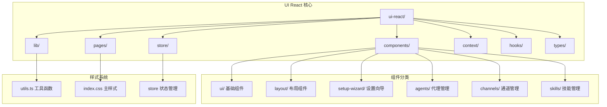
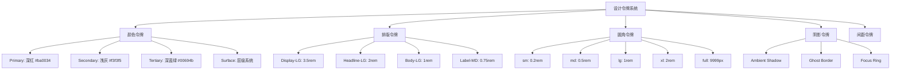
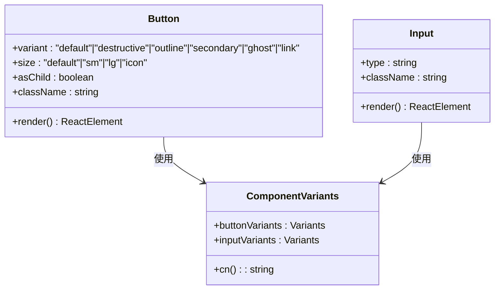
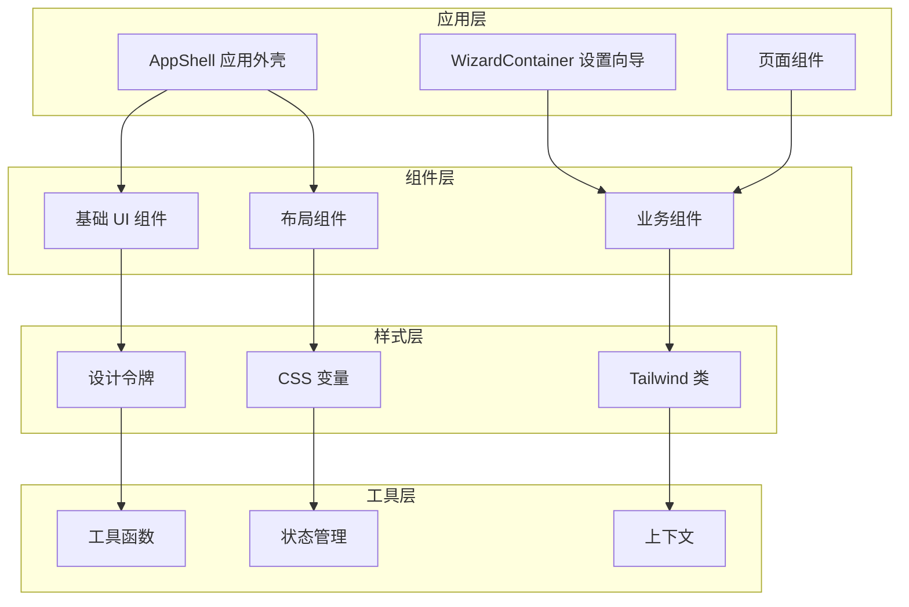
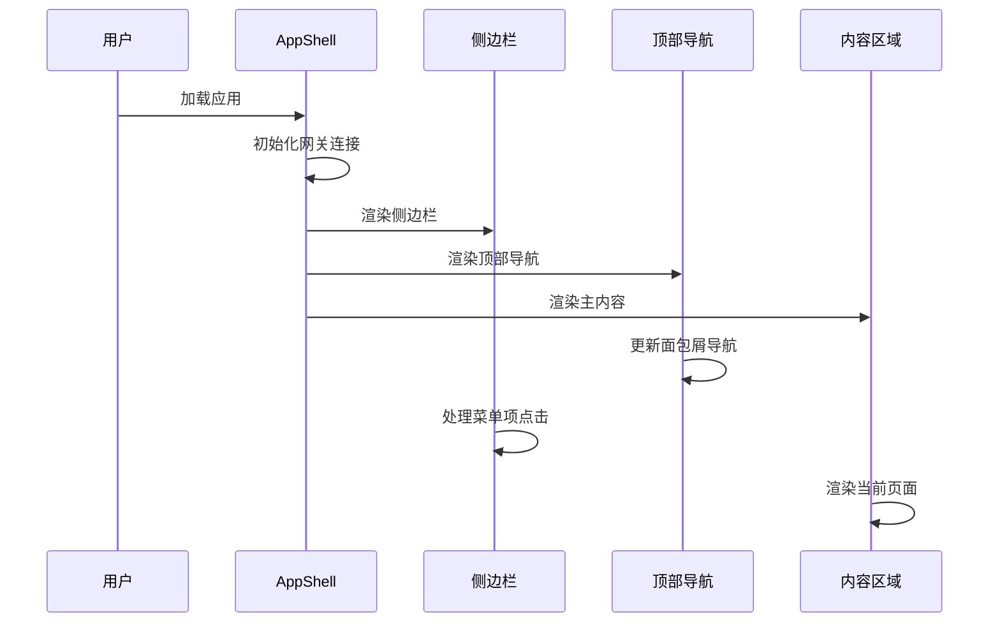
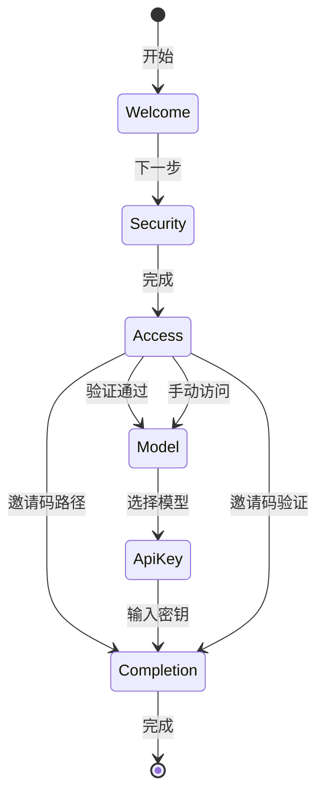
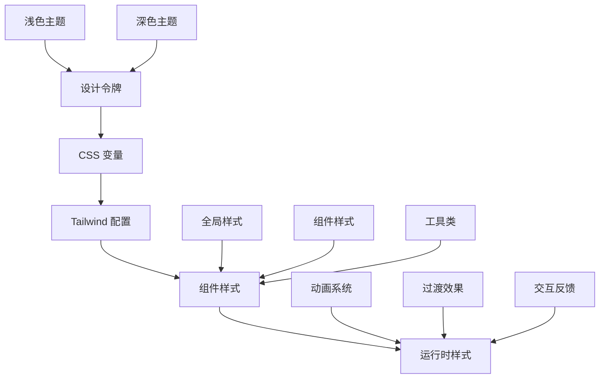
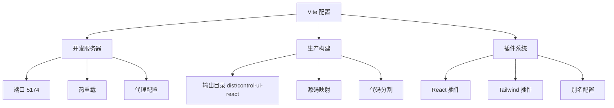

# 设计系统规范

<cite>
**本文档引用的文件**
- [components.json](file://ui-react/components.json)
- [package.json](file://ui-react/package.json)
- [vite.config.ts](file://ui-react/vite.config.ts)
- [index.css](file://ui-react/src/index.css)
- [utils.ts](file://ui-react/src/lib/utils.ts)
- [button.tsx](file://ui-react/src/components/ui/button.tsx)
- [input.tsx](file://ui-react/src/components/ui/input.tsx)
- [AppShell.tsx](file://ui-react/src/components/layout/AppShell.tsx)
- [WizardContainer.tsx](file://ui-react/src/components/setup-wizard/WizardContainer.tsx)
</cite>

## 目录
1. [简介](#简介)
2. [项目结构](#项目结构)
3. [核心组件](#核心组件)
4. [架构概览](#架构概览)
5. [详细组件分析](#详细组件分析)
6. [依赖分析](#依赖分析)
7. [性能考虑](#性能考虑)
8. [故障排除指南](#故障排除指南)
9. [结论](#结论)

## 简介

OpenClaw 设计系统是一个基于 React 和 TypeScript 构建的现代化用户界面系统，专注于提供一致、可扩展且美观的用户体验。该系统采用设计令牌驱动的方法，结合 Material Design 2023 规范，实现了完整的深色/浅色主题支持。

设计系统的核心特点包括：
- **设计令牌驱动**：统一的颜色、排版、间距和阴影系统
- **响应式设计**：适配多种设备和屏幕尺寸
- **无障碍支持**：完整的键盘导航和屏幕阅读器支持
- **动画系统**：流畅的过渡效果和交互反馈
- **模块化组件**：可复用的 UI 组件库

## 项目结构

UI 控制台采用模块化的组织方式，主要分为以下几个核心部分：



**图表来源**
- [components.json:1-22](file://ui-react/components.json#L1-L22)
- [AppShell.tsx:1-96](file://ui-react/src/components/layout/AppShell.tsx#L1-L96)

**章节来源**
- [components.json:1-22](file://ui-react/components.json#L1-L22)
- [package.json:1-63](file://ui-react/package.json#L1-L63)

## 核心组件

### 设计令牌系统

设计系统采用 CSS 自定义属性实现设计令牌，提供统一的视觉语言：



**图表来源**
- [index.css:7-102](file://ui-react/src/index.css#L7-L102)

### 组件变体系统

基于 `class-variance-authority` 实现的组件变体系统，提供灵活的样式组合：



**图表来源**
- [button.tsx:6-32](file://ui-react/src/components/ui/button.tsx#L6-L32)
- [input.tsx:4-18](file://ui-react/src/components/ui/input.tsx#L4-L18)

**章节来源**
- [index.css:1-338](file://ui-react/src/index.css#L1-L338)
- [button.tsx:1-56](file://ui-react/src/components/ui/button.tsx#L1-L56)
- [input.tsx:1-21](file://ui-react/src/components/ui/input.tsx#L1-L21)

## 架构概览

设计系统的整体架构采用分层模式，确保组件间的松耦合和高内聚：



**图表来源**
- [AppShell.tsx:77-96](file://ui-react/src/components/layout/AppShell.tsx#L77-L96)
- [WizardContainer.tsx:21-112](file://ui-react/src/components/setup-wizard/WizardContainer.tsx#L21-L112)

## 详细组件分析

### 应用外壳组件

AppShell 提供了应用的整体布局框架，集成了侧边栏、顶部导航和内容区域：



**图表来源**
- [AppShell.tsx:77-96](file://ui-react/src/components/layout/AppShell.tsx#L77-L96)

### 设置向导系统

WizardContainer 实现了完整的设置向导流程，包含多个步骤和条件逻辑：



**图表来源**
- [WizardContainer.tsx:12-19](file://ui-react/src/components/setup-wizard/WizardContainer.tsx#L12-L19)

### 样式系统架构

设计系统采用多层样式架构，确保样式的可维护性和一致性：



**图表来源**
- [index.css:1-338](file://ui-react/src/index.css#L1-L338)
- [utils.ts:1-7](file://ui-react/src/lib/utils.ts#L1-L7)

**章节来源**
- [AppShell.tsx:1-96](file://ui-react/src/components/layout/AppShell.tsx#L1-L96)
- [WizardContainer.tsx:1-112](file://ui-react/src/components/setup-wizard/WizardContainer.tsx#L1-L112)

## 依赖分析

### 核心依赖关系

设计系统依赖于多个关键库来实现其功能特性：

```mermaid
graph LR
subgraph "React 生态系统"
A[react ^19.0.0] --> B[react-dom ^19.0.0]
C[react-router ^7.1.1] --> D[路由系统]
E[zustand ^5.0.3] --> F[状态管理]
end
subgraph "UI 组件库"
G[@assistant-ui/react ^0.12.17] --> H[对话组件]
I[radix-ui/react-*] --> J[无障碍组件]
K[lucide-react ^0.469.0] --> L[图标系统]
end
subgraph "样式系统"
M[tailwindcss ^4.1.0] --> N[CSS 框架]
O[class-variance-authority ^0.7.1] --> P[变体系统]
Q[clsx ^2.1.1] --> R[类名合并]
S[tailwind-merge ^2.6.0] --> T[样式冲突解决]
end
subgraph "开发工具"
U[vite ^7.3.1] --> V[构建工具]
W[typescript ^5.7.2] --> X[类型安全]
Y[vitest ^4.0.0] --> Z[测试框架]
end
```

**图表来源**
- [package.json:11-48](file://ui-react/package.json#L11-L48)

### 构建配置分析

Vite 配置提供了灵活的开发和生产环境支持：



**图表来源**
- [vite.config.ts:9-59](file://ui-react/vite.config.ts#L9-L59)

**章节来源**
- [package.json:1-63](file://ui-react/package.json#L1-L63)
- [vite.config.ts:1-60](file://ui-react/vite.config.ts#L1-L60)

## 性能考虑

设计系统在性能方面采用了多项优化策略：

### 样式优化
- **CSS 变量缓存**：使用 CSS 自定义属性减少重复计算
- **Tailwind 优化**：按需生成样式，避免未使用类名
- **组件懒加载**：大型组件按需加载，减少初始包大小

### 运行时性能
- **虚拟滚动**：大量数据时使用虚拟化技术
- **防抖节流**：输入组件和搜索功能的性能优化
- **内存管理**：及时清理事件监听器和定时器

### 构建优化
- **代码分割**：自动代码分割，按需加载模块
- **压缩优化**：生产环境代码压缩和混淆
- **缓存策略**：浏览器缓存和 CDN 优化

## 故障排除指南

### 常见问题及解决方案

**样式不生效**
- 检查 CSS 变量是否正确设置
- 确认 Tailwind 配置文件路径
- 验证组件类名拼写

**主题切换异常**
- 检查 `dark` 类是否正确添加到根元素
- 验证 CSS 变量覆盖顺序
- 确认媒体查询配置

**组件渲染问题**
- 检查 React 版本兼容性
- 验证 Radix UI 组件的正确导入
- 确认 TypeScript 类型定义

**构建错误**
- 检查 Node.js 版本要求
- 验证依赖包版本兼容性
- 确认 Vite 配置正确性

**章节来源**
- [index.css:167-215](file://ui-react/src/index.css#L167-L215)
- [utils.ts:1-7](file://ui-react/src/lib/utils.ts#L1-L7)

## 结论

OpenClaw 设计系统通过采用设计令牌驱动的方法和现代化的 React 技术栈，成功构建了一个既美观又实用的用户界面系统。系统的主要优势包括：

1. **一致性**：统一的设计令牌确保了视觉风格的一致性
2. **可扩展性**：模块化的组件架构支持功能扩展
3. **可访问性**：完整的无障碍支持提升了用户体验
4. **性能优化**：多层优化策略确保了良好的运行性能
5. **开发效率**：清晰的架构和完善的文档提高了开发效率

该设计系统为 OpenClaw 平台提供了坚实的基础，支持未来功能的持续扩展和改进。通过遵循现有的设计规范和最佳实践，开发者可以快速创建符合品牌标准的高质量用户界面。