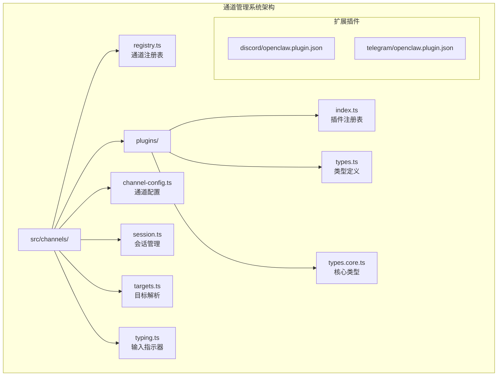
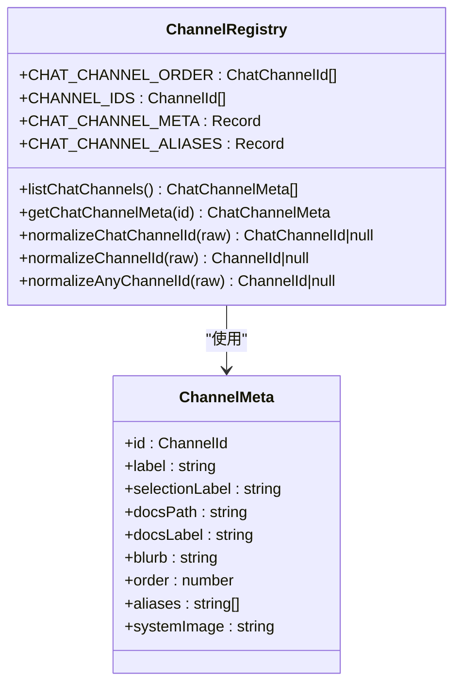
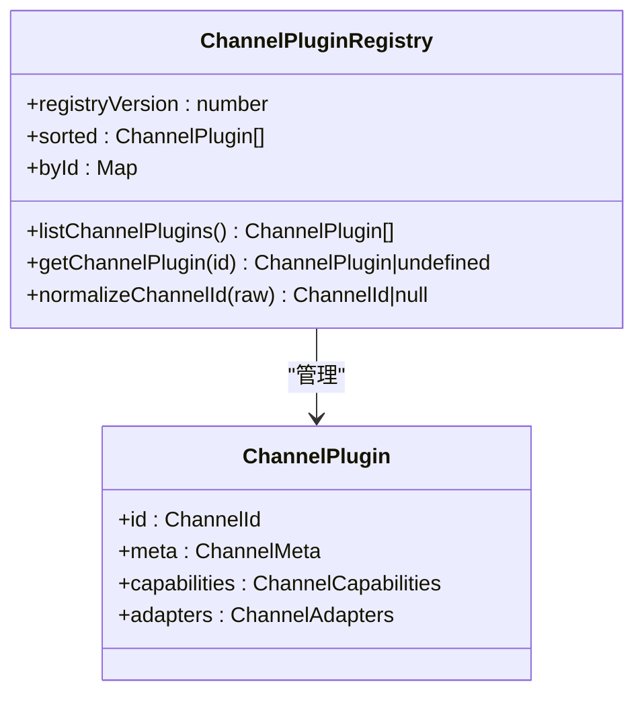
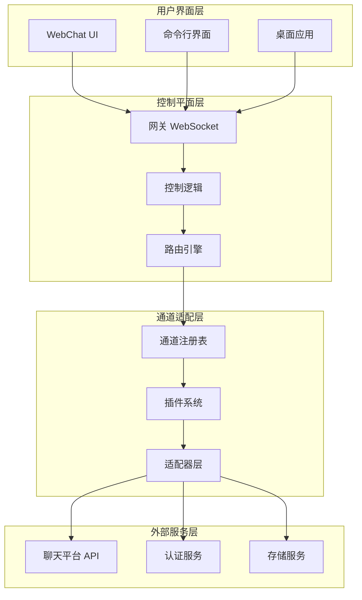
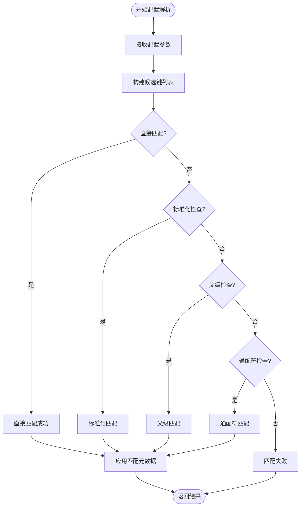
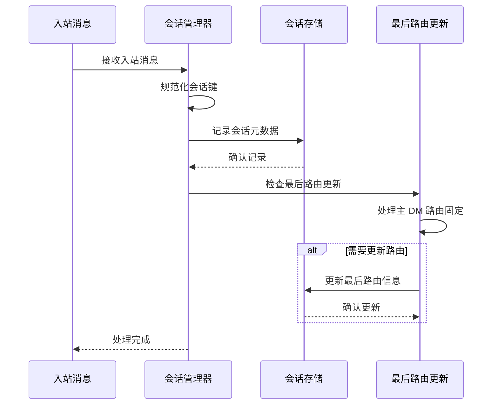
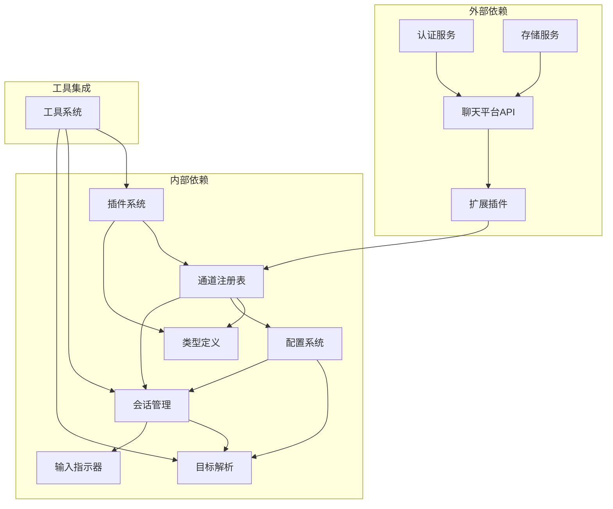

# 通道管理系统

<cite>
**本文档引用的文件**
- [README.md](file://README.md)
- [docs/channels/index.md](file://docs/channels/index.md)
- [src/channels/registry.ts](file://src/channels/registry.ts)
- [src/channels/plugins/index.ts](file://src/channels/plugins/index.ts)
- [src/channels/plugins/types.ts](file://src/channels/plugins/types.ts)
- [src/channels/plugins/types.core.ts](file://src/channels/plugins/types.core.ts)
- [src/channels/channel-config.ts](file://src/channels/channel-config.ts)
- [src/channels/session.ts](file://src/channels/session.ts)
- [src/channels/targets.ts](file://src/channels/targets.ts)
- [src/channels/typing.ts](file://src/channels/typing.ts)
- [extensions/discord/openclaw.plugin.json](file://extensions/discord/openclaw.plugin.json)
- [extensions/telegram/openclaw.plugin.json](file://extensions/telegram/openclaw.plugin.json)
</cite>

## 目录
1. [简介](#简介)
2. [项目结构](#项目结构)
3. [核心组件](#核心组件)
4. [架构概览](#架构概览)
5. [详细组件分析](#详细组件分析)
6. [依赖关系分析](#依赖关系分析)
7. [性能考虑](#性能考虑)
8. [故障排除指南](#故障排除指南)
9. [结论](#结论)

## 简介

通道管理系统是 OpenClaw 个人 AI 助手项目的核心组成部分，负责管理各种即时通讯平台的连接和消息路由。该系统支持多种聊天渠道，包括 WhatsApp、Telegram、Discord、Slack、Google Chat、Signal、iMessage、BlueBubbles、IRC、Microsoft Teams、Matrix、Feishu、LINE、Mattermost、Nextcloud Talk、Nostr、Synology Chat、Tlon、Twitch、Zalo、Zalo Personal 和 WebChat。

OpenClaw 的设计目标是在用户已使用的任何聊天应用上提供对话式 AI 助手服务，每个通道都通过网关进行连接。系统提供了完整的安全模型，默认情况下对未知发送者采用配对策略，并支持公共入站 DM 需要显式选择加入。

## 项目结构

OpenClaw 项目采用模块化架构，通道管理系统主要位于 `src/channels/` 目录下，包含以下关键子模块：



**图表来源**
- [src/channels/registry.ts:1-201](file://src/channels/registry.ts#L1-L201)
- [src/channels/plugins/index.ts:1-118](file://src/channels/plugins/index.ts#L1-L118)

**章节来源**
- [README.md:140-180](file://README.md#L140-L180)
- [docs/channels/index.md:9-48](file://docs/channels/index.md#L9-L48)

## 核心组件

### 通道注册表系统

通道注册表系统是整个通道管理的核心，负责维护支持的聊天渠道列表、元数据管理和 ID 规范化。



**图表来源**
- [src/channels/registry.ts:27-121](file://src/channels/registry.ts#L27-L121)
- [src/channels/registry.ts:135-160](file://src/channels/registry.ts#L135-L160)

### 插件注册表系统

插件注册表系统管理所有已安装的通道插件，提供统一的插件发现和访问接口。



**图表来源**
- [src/channels/plugins/index.ts:28-84](file://src/channels/plugins/index.ts#L28-L84)
- [src/channels/plugins/types.core.ts:181-194](file://src/channels/plugins/types.core.ts#L181-L194)

**章节来源**
- [src/channels/registry.ts:5-25](file://src/channels/registry.ts#L5-L25)
- [src/channels/plugins/index.ts:8-12](file://src/channels/plugins/index.ts#L8-L12)

## 架构概览

OpenClaw 的通道管理系统采用分层架构设计，确保了良好的可扩展性和维护性：



**图表来源**
- [README.md:185-202](file://README.md#L185-L202)
- [src/channels/plugins/types.core.ts:76-95](file://src/channels/plugins/types.core.ts#L76-L95)

## 详细组件分析

### 通道配置管理系统

通道配置管理系统提供了灵活的配置解析和匹配机制，支持多种配置来源和优先级处理。



**图表来源**
- [src/channels/channel-config.ts:60-164](file://src/channels/channel-config.ts#L60-L164)

### 会话管理流程

会话管理系统负责跟踪用户与不同通道的交互历史，支持主 DM 和群组消息的路由管理。



**图表来源**
- [src/channels/session.ts:41-82](file://src/channels/session.ts#L41-L82)

### 输入指示器控制系统

输入指示器控制系统管理聊天平台上的"正在输入"状态，提供自动保活和安全超时机制。

```mermaid
stateDiagram-v2
[*] --> 空闲
空闲 --> 启动中 : 开始回复
启动中 --> 运行中 : 启动成功
启动中 --> 失败 : 启动失败
运行中 --> 保活中 : 发送保活
运行中 --> 清理中 : 停止回复
保活中 --> 运行中 : 保活成功
保活中 --> 失败 : 连续失败
失败 --> 清理中 : 自动清理
清理中 --> 空闲 : 完成清理
运行中 --> 空闲 : TTL超时
state 失败 {
[*] --> 第一次失败
第一次失败 --> 第二次失败
第二次失败 --> [*] --> 停止保活
}
```

**图表来源**
- [src/channels/typing.ts:23-99](file://src/channels/typing.ts#L23-L99)

**章节来源**
- [src/channels/channel-config.ts:14-32](file://src/channels/channel-config.ts#L14-L32)
- [src/channels/session.ts:13-24](file://src/channels/session.ts#L13-L24)
- [src/channels/typing.ts:4-21](file://src/channels/typing.ts#L4-L21)

### 目标解析系统

目标解析系统负责将用户输入转换为平台特定的消息目标标识符。

```mermaid
flowchart TD
INPUT[输入原始目标] --> CHECK_MENTION{检查提及模式?}
CHECK_MENTION --> |匹配| PARSE_MENTION[解析提及目标]
CHECK_MENTION --> |不匹配| CHECK_PREFIX{检查前缀?}
CHECK_PREFIX --> |匹配| PARSE_PREFIX[解析前缀目标]
CHECK_PREFIX --> |不匹配| CHECK_AT{检查@用户?}
CHECK_AT --> |匹配| PARSE_AT[解析@用户目标]
CHECK_AT --> |不匹配| ERROR[抛出错误]
PARSE_MENTION --> VALIDATE[验证ID格式]
PARSE_PREFIX --> VALIDATE
PARSE_AT --> VALIDATE
VALIDATE --> BUILD[构建消息目标]
BUILD --> OUTPUT[返回目标对象]
ERROR --> OUTPUT
```

**图表来源**
- [src/channels/targets.ts:46-131](file://src/channels/targets.ts#L46-L131)

**章节来源**
- [src/channels/targets.ts:18-33](file://src/channels/targets.ts#L18-L33)

## 依赖关系分析

通道管理系统与其他系统组件存在紧密的依赖关系：



**图表来源**
- [src/channels/plugins/types.ts:1-66](file://src/channels/plugins/types.ts#L1-L66)
- [src/channels/plugins/types.core.ts:1-10](file://src/channels/plugins/types.core.ts#L1-L10)

**章节来源**
- [src/channels/plugins/types.ts:7-30](file://src/channels/plugins/types.ts#L7-L30)
- [src/channels/plugins/types.core.ts:11-11](file://src/channels/plugins/types.core.ts#L11-L11)

## 性能考虑

通道管理系统在设计时充分考虑了性能优化：

### 缓存策略
- 插件注册表使用版本化的缓存机制，避免重复加载
- 通道元数据采用惰性加载策略，仅在需要时解析
- 目标解析结果进行内存缓存，减少重复计算

### 异步处理
- 所有网络操作采用异步非阻塞模式
- 输入指示器使用定时器保活，避免阻塞主线程
- 会话更新采用异步写入，确保响应速度

### 内存管理
- 使用 WeakMap 和 Set 避免内存泄漏
- 及时清理定时器和事件监听器
- 对大型数据结构采用流式处理

## 故障排除指南

### 常见问题诊断

**通道连接问题**
- 检查通道配置是否正确
- 验证认证凭据有效性
- 确认网络连接状态

**消息路由问题**
- 检查会话键规范化
- 验证目标解析结果
- 确认权限配置

**性能问题**
- 监控插件加载时间
- 检查缓存命中率
- 分析内存使用情况

### 调试工具

系统提供了多种调试工具来帮助诊断问题：
- 详细的日志记录系统
- 实时状态监控面板
- 性能指标收集器
- 错误追踪和报告

**章节来源**
- [README.md:112-125](file://README.md#L112-L125)
- [src/channels/typing.ts:50-62](file://src/channels/typing.ts#L50-L62)

## 结论

OpenClaw 的通道管理系统展现了现代聊天机器人架构的最佳实践，通过模块化设计、插件化架构和完善的配置管理，实现了对多种聊天平台的统一支持。系统的设计充分考虑了安全性、可扩展性和性能优化，在保证功能完整性的同时，为用户提供了流畅的使用体验。

该系统的核心优势在于其灵活的插件架构，使得新通道的添加变得简单快捷，同时保持了系统的稳定性和一致性。通过精心设计的配置解析和会话管理机制，系统能够有效处理复杂的多通道场景，为用户提供无缝的跨平台聊天体验。

随着项目的持续发展，通道管理系统将继续演进，支持更多新兴的聊天平台，同时优化现有功能，提升整体性能和用户体验。