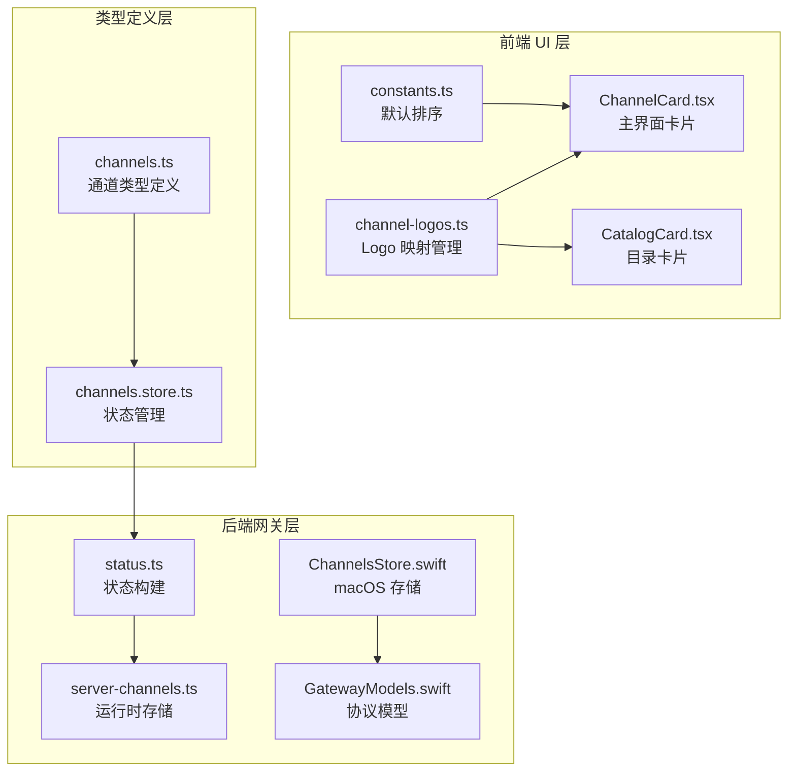
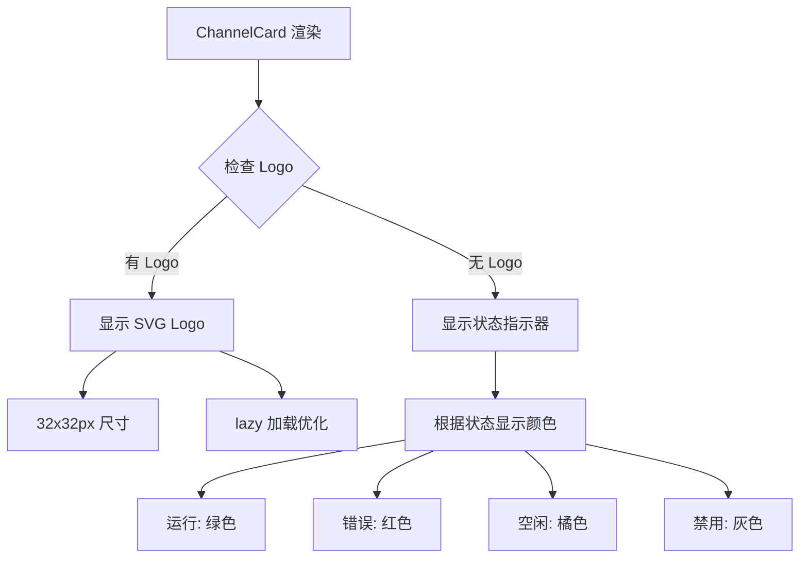
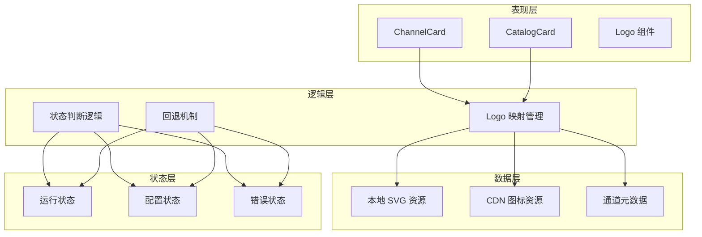
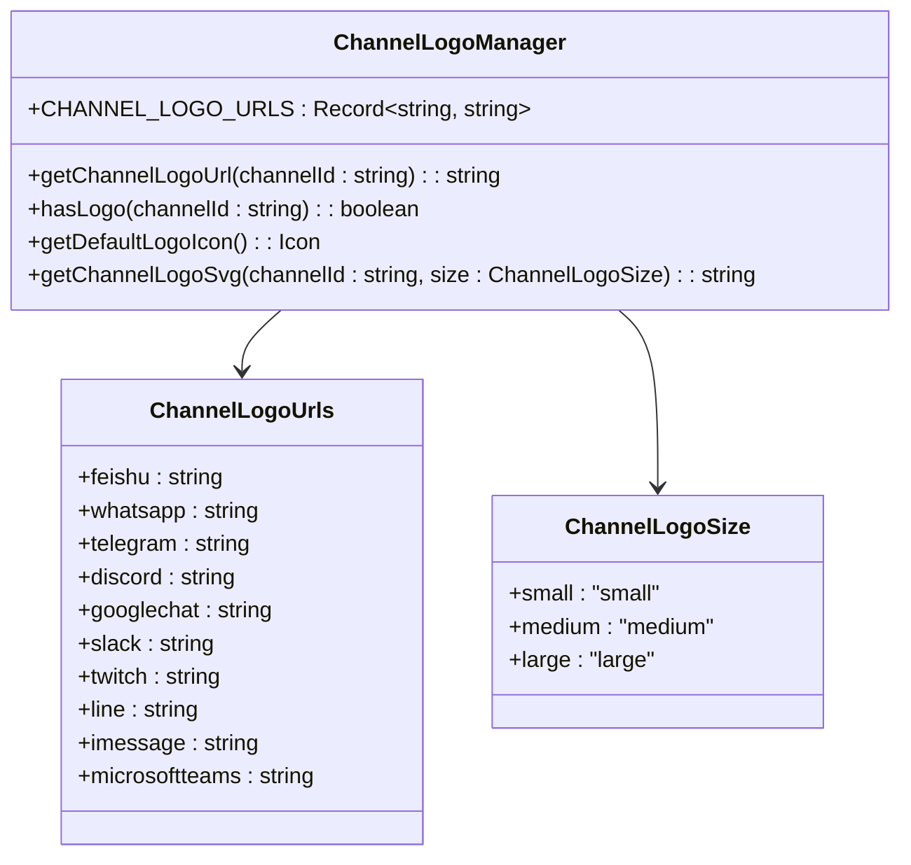
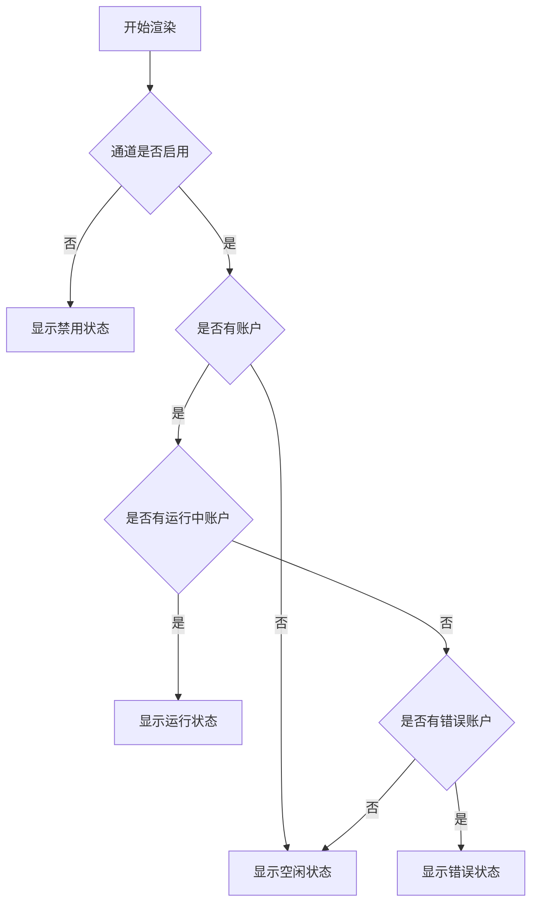
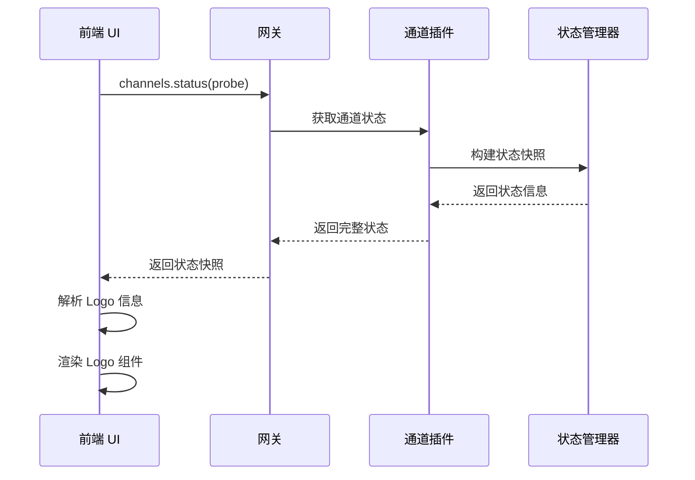
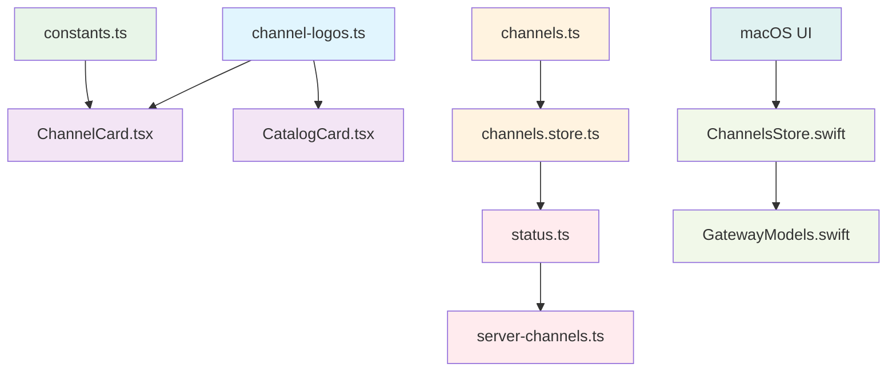

# 通道品牌 Logo 支持系统

<cite>
**本文档引用的文件**
- [README.channel-logos.md](file://ui-react/docs/README.channel-logos.md)
- [channel-logos.ts](file://ui-react/src/components/channels/shared/channel-logos.ts)
- [ChannelCard.tsx](file://ui-react/src/components/channels/ChannelCard.tsx)
- [CatalogCard.tsx](file://ui-react/src/components/channels/CatalogCard.tsx)
- [constants.ts](file://ui-react/src/components/channels/constants.ts)
- [channels.ts](file://ui-react/src/types/channels.ts)
- [channels.store.ts](file://ui-react/src/store/channels.store.ts)
- [ChannelsStore.swift](file://apps/macos/Sources/OpenClaw/ChannelsStore.swift)
- [GatewayModels.swift](file://apps/macos/Sources/OpenClawProtocol/GatewayModels.swift)
- [GatewayModels.swift](file://apps/macos/Sources/OpenClawProtocol/GatewayModels.swift)
- [ChannelsPage.tsx](file://ui-react/src/pages/ChannelsPage.tsx)
- [CatalogSection.tsx](file://ui-react/src/components/channels/CatalogSection.tsx)
- [status.ts](file://src/channels/plugins/status.ts)
- [server-channels.ts](file://src/gateway/server-channels.ts)
</cite>

## 目录
1. [简介](#简介)
2. [项目结构](#项目结构)
3. [核心组件](#核心组件)
4. [架构概览](#架构概览)
5. [详细组件分析](#详细组件分析)
6. [依赖关系分析](#依赖关系分析)
7. [性能考虑](#性能考虑)
8. [故障排除指南](#故障排除指南)
9. [结论](#结论)

## 简介

通道品牌 Logo 支持系统是 OpenClaw 项目中的一个重要功能模块，旨在为消息通道提供品牌标识支持。该系统通过在用户界面中显示各个消息平台的品牌 Logo，帮助用户更直观地识别不同的通信渠道。

OpenClaw 是一个个人 AI 助手平台，支持多种消息通道，包括 WhatsApp、Telegram、Discord、Google Chat、Slack、Signal、iMessage、LINE、Nostr、Microsoft Teams、Matrix、Zalo 等。通道品牌 Logo 系统为这些平台提供了统一的品牌标识展示功能。

## 项目结构

通道品牌 Logo 系统主要分布在前端 React UI 和后端网关两个层面：

**图表来源**
- [channel-logos.ts:1-79](file://ui-react/src/components/channels/shared/channel-logos.ts#L1-L79)
- [ChannelCard.tsx:1-141](file://ui-react/src/components/channels/ChannelCard.tsx#L1-L141)
- [CatalogCard.tsx:1-89](file://ui-react/src/components/channels/CatalogCard.tsx#L1-L89)

**章节来源**
- [README.channel-logos.md:1-107](file://ui-react/docs/README.channel-logos.md#L1-L107)
- [channel-logos.ts:1-79](file://ui-react/src/components/channels/shared/channel-logos.ts#L1-L79)

## 核心组件

### Logo 映射系统

Logo 映射系统是整个通道品牌 Logo 系统的核心，负责管理各个消息平台的品牌标识。

#### Logo 映射表

系统支持以下消息平台的品牌 Logo：

| 平台名称 | 通道 ID | Logo 类型 | 备注 |
|---------|---------|-----------|------|
| 飞书 | `feishu` | 本地 SVG | 推荐使用本地资源 |
| 微信 | `openclaw-weixin` | 本地 SVG | 特殊微信集成 |
| WhatsApp | `whatsapp` | 本地 SVG | 本地资源 |
| Telegram | `telegram` | 本地 SVG | 本地资源 |
| Discord | `discord` | 本地 SVG | 本地资源 |
| Google Chat | `googlechat` | 本地 SVG | 本地资源 |
| Slack | `slack` | 本地 SVG | 本地资源 |
| Twitch | `twitch` | 本地 SVG | 本地资源 |
| LINE | `line` | 本地 SVG | 本地资源 |
| iMessage | `imessage` | 本地 SVG | 本地资源 |
| Microsoft Teams | `microsoftteams` | 本地 SVG | 本地资源 |

#### Logo 工具函数

系统提供了完整的 Logo 工具函数集合：

- `getChannelLogoUrl(channelId: string): string` - 获取指定通道的 Logo URL
- `hasLogo(channelId: string): boolean` - 检查通道是否有自定义 Logo
- `getDefaultLogoIcon()` - 获取默认的备用图标
- `getChannelLogoSvg(channelId: string, size: ChannelLogoSize): string` - 获取内联 SVG 格式的 Logo

**章节来源**
- [channel-logos.ts:21-49](file://ui-react/src/components/channels/shared/channel-logos.ts#L21-L49)

### UI 组件集成

#### ChannelCard 组件

ChannelCard 组件是主界面中的核心组件，集成了品牌 Logo 显示功能：

**图表来源**
- [ChannelCard.tsx:64-83](file://ui-react/src/components/channels/ChannelCard.tsx#L64-L83)

#### CatalogCard 组件

CatalogCard 组件用于展示可安装的通道插件：

- 统一使用 48x48px 的大尺寸 Logo
- 没有 Logo 时显示灰色圆形图标
- 保持与 ChannelCard 一致的视觉风格

**章节来源**
- [ChannelCard.tsx:1-141](file://ui-react/src/components/channels/ChannelCard.tsx#L1-L141)
- [CatalogCard.tsx:1-89](file://ui-react/src/components/channels/CatalogCard.tsx#L1-L89)

## 架构概览

通道品牌 Logo 系统采用分层架构设计，确保了良好的可扩展性和维护性：

**图表来源**
- [channel-logos.ts:1-79](file://ui-react/src/components/channels/shared/channel-logos.ts#L1-L79)
- [ChannelCard.tsx:13-19](file://ui-react/src/components/channels/ChannelCard.tsx#L13-L19)

## 详细组件分析

### Logo 映射管理器

Logo 映射管理器是系统的核心逻辑组件，负责处理所有与 Logo 相关的操作。

#### 数据结构设计

**图表来源**
- [channel-logos.ts:19-79](file://ui-react/src/components/channels/shared/channel-logos.ts#L19-L79)

#### Logo 选择策略

系统采用了智能的 Logo 选择策略：

1. **优先级策略**：本地 SVG 资源优先于 CDN 图标
2. **回退机制**：当没有可用 Logo 时，自动切换到状态指示器
3. **性能优化**：使用 lazy loading 和 CDN 缓存

**章节来源**
- [channel-logos.ts:62-78](file://ui-react/src/components/channels/shared/channel-logos.ts#L62-L78)

### UI 组件状态管理

#### 状态判断逻辑

ChannelCard 组件实现了复杂的状态判断逻辑：

**图表来源**
- [ChannelCard.tsx:13-19](file://ui-react/src/components/channels/ChannelCard.tsx#L13-L19)

#### 性能优化策略

系统采用了多项性能优化措施：

- **延迟加载**：使用 `loading="lazy"` 减少初始页面加载时间
- **CDN 加速**：通过 jsDelivr CDN 提供图标资源
- **SVG 优化**：使用矢量图形确保清晰度同时减小文件大小
- **缓存策略**：浏览器自动缓存已加载的 Logo 资源

**章节来源**
- [ChannelCard.tsx:68-76](file://ui-react/src/components/channels/ChannelCard.tsx#L68-L76)
- [README.channel-logos.md:58-62](file://ui-react/docs/README.channel-logos.md#L58-L62)

### 后端集成

#### 网关状态同步

后端网关系统通过 `channels.status` 方法提供通道状态信息，包括 Logo 相关的数据：

**图表来源**
- [channels.store.ts:163-180](file://ui-react/src/store/channels.store.ts#L163-L180)
- [status.ts:68-89](file://src/channels/plugins/status.ts#L68-L89)

**章节来源**
- [channels.store.ts:159-180](file://ui-react/src/store/channels.store.ts#L159-L180)
- [status.ts:1-89](file://src/channels/plugins/status.ts#L1-L89)

## 依赖关系分析

通道品牌 Logo 系统的依赖关系相对简单但层次清晰：

**图表来源**
- [channel-logos.ts:1-79](file://ui-react/src/components/channels/shared/channel-logos.ts#L1-L79)
- [ChannelCard.tsx:1-141](file://ui-react/src/components/channels/ChannelCard.tsx#L1-L141)
- [constants.ts:1-20](file://ui-react/src/components/channels/constants.ts#L1-L20)

### 外部依赖

系统对外部依赖的管理：

- **Simple Icons CDN**：用于获取第三方平台的 SVG 图标
- **本地 SVG 资源**：用于重要平台的 Logo，如飞书、微信等
- **浏览器缓存**：利用浏览器的自动缓存机制提升性能

### 内部依赖

内部模块间的依赖关系：

- Logo 映射模块被 UI 组件直接依赖
- 状态管理模块依赖类型定义模块
- 网关状态模块依赖插件状态构建模块

**章节来源**
- [README.channel-logos.md:63-86](file://ui-react/docs/README.channel-logos.md#L63-L86)

## 性能考虑

通道品牌 Logo 系统在设计时充分考虑了性能优化：

### 加载优化

1. **延迟加载**：所有 Logo 图片都使用 `loading="lazy"` 属性
2. **CDN 缓存**：通过 CDN 提供的缓存机制减少重复加载
3. **SVG 优势**：使用矢量图形确保在不同分辨率下都清晰显示

### 内存管理

1. **按需加载**：只有在需要显示时才加载对应的 Logo
2. **状态复用**：利用 React 的状态机制避免不必要的重新渲染
3. **资源清理**：组件卸载时自动清理相关的事件监听器

### 网络优化

1. **连接复用**：多个组件共享相同的 CDN 连接
2. **压缩传输**：SVG 格式相比位图具有更小的文件体积
3. **缓存策略**：合理设置缓存头信息提升二次访问速度

## 故障排除指南

### 常见问题及解决方案

#### Logo 显示异常

**问题描述**：某些平台的 Logo 无法正常显示

**可能原因**：
1. CDN 服务不可用
2. SVG 文件损坏
3. 浏览器兼容性问题

**解决步骤**：
1. 检查网络连接和 CDN 可用性
2. 验证 SVG 文件的完整性
3. 测试不同浏览器的兼容性

#### 性能问题

**问题描述**：页面加载缓慢或 Logo 显示延迟

**可能原因**：
1. CDN 响应慢
2. SVG 文件过大
3. 同时加载过多 Logo

**解决步骤**：
1. 检查 CDN 性能指标
2. 优化 SVG 文件大小
3. 实施适当的加载策略

#### 状态显示错误

**问题描述**：通道状态指示器显示不正确

**可能原因**：
1. 状态判断逻辑错误
2. 网关状态同步延迟
3. 数据解析错误

**解决步骤**：
1. 检查状态判断逻辑
2. 验证网关状态同步
3. 调试数据解析过程

**章节来源**
- [ChannelCard.tsx:13-19](file://ui-react/src/components/channels/ChannelCard.tsx#L13-L19)
- [README.channel-logos.md:50-56](file://ui-react/docs/README.channel-logos.md#L50-L56)

## 结论

通道品牌 Logo 支持系统是 OpenClaw 项目中的一个重要功能增强，它通过提供统一的品牌标识展示，显著提升了用户体验。系统的设计充分考虑了可扩展性、性能优化和用户体验，在保证功能完整性的同时，也确保了系统的稳定性和可靠性。

该系统的主要优势包括：

1. **统一的视觉体验**：为所有支持的消息平台提供一致的品牌标识
2. **灵活的扩展性**：易于添加新的消息平台支持
3. **优秀的性能表现**：通过多种优化技术确保快速加载
4. **可靠的稳定性**：完善的错误处理和回退机制

未来可以考虑的功能改进方向：

1. **动态 Logo 更新**：支持平台 Logo 的动态更新
2. **主题适配**：支持深色/浅色主题下的 Logo 适配
3. **动画效果**：为 Logo 添加简单的动画效果提升交互体验
4. **国际化支持**：支持多语言环境下的 Logo 显示

通过持续的优化和改进，通道品牌 Logo 系统将继续为 OpenClaw 用户提供优质的视觉体验。