# 通道管理系统

<cite>
**本文档引用的文件**
- [README.md](file://README.md)
- [registry.ts](file://src/channels/registry.ts)
- [plugins/index.ts](file://src/channels/plugins/index.ts)
- [plugins/types.ts](file://src/channels/plugins/types.ts)
- [plugins/helpers.ts](file://src/channels/plugins/helpers.ts)
- [plugins/channel-config.ts](file://src/channels/plugins/channel-config.ts)
- [plugins/allowlist-match.ts](file://src/channels/plugins/allowlist-match.ts)
- [telegram/api.ts](file://src/channels/telegram/api.ts)
- [session.ts](file://src/channels/session.ts)
- [ChannelsPage.tsx](file://ui-react/src/pages/ChannelsPage.tsx)
- [ChannelDetail.tsx](file://ui-react/src/components/channels/ChannelDetail.tsx)
- [ChannelDetailDialog.tsx](file://ui-react/src/components/channels/ChannelDetailDialog.tsx)
- [ChannelGrid.tsx](file://ui-react/src/components/channels/ChannelGrid.tsx)
- [ChannelCard.tsx](file://ui-react/src/components/channels/ChannelCard.tsx)
- [ChannelActionDialog.tsx](file://ui-react/src/components/channels/ChannelActionDialog.tsx)
- [BoundChannelConfigForm.tsx](file://ui-react/src/components/channels/shared/BoundChannelConfigForm.tsx)
- [channel-logos.ts](file://ui-react/src/components/channels/shared/channel-logos.ts)
- [channels.store.ts](file://ui-react/src/store/channels.store.ts)
- [channels.ts](file://ui-react/src/types/channels.ts)
- [GatewayStatusIndicator.tsx](file://ui-react/src/components/gateway/GatewayStatusIndicator.tsx)
- [CatalogSection.tsx](file://ui-react/src/components/channels/CatalogSection.tsx)
- [CatalogCard.tsx](file://ui-react/src/components/channels/CatalogCard.tsx)
- [constants.ts](file://ui-react/src/components/channels/constants.ts)
</cite>

## 更新摘要
**所做更改**
- 新增通道品牌Logo支持系统，包括新增channel-logos.ts工具文件
- 更新ChannelCard组件以支持品牌Logo显示和回退机制
- 更新CatalogCard组件以集成品牌Logo功能
- 新增DEFAULT_CHANNEL_ORDER常量定义核心渠道显示顺序
- 增强通道可视化识别能力，提升用户体验

## 目录
1. [简介](#简介)
2. [项目结构](#项目结构)
3. [核心组件](#核心组件)
4. [架构概览](#架构概览)
5. [详细组件分析](#详细组件分析)
6. [新增UI组件架构](#新增ui组件架构)
7. [通道品牌Logo系统](#通道品牌logo系统)
8. [依赖关系分析](#依赖关系分析)
9. [性能考虑](#性能考虑)
10. [故障排除指南](#故障排除指南)
11. [结论](#结论)

## 简介

OpenCLAW通道管理系统是一个强大的多渠道消息传递平台，支持超过20种不同的通信协议。该系统允许用户通过单一控制平面连接和管理各种即时通讯应用，包括WhatsApp、Telegram、Slack、Discord、Google Chat、Signal、iMessage等主流平台。

系统采用模块化设计，通过插件架构实现通道扩展，支持动态加载和配置管理。每个通道都实现了标准化的接口，确保一致的用户体验和安全策略。最新的架构升级引入了统一的UI组件系统和通道品牌Logo支持系统，提供更好的用户体验和更高效的管理能力。

## 项目结构

通道管理系统主要分布在以下目录中：

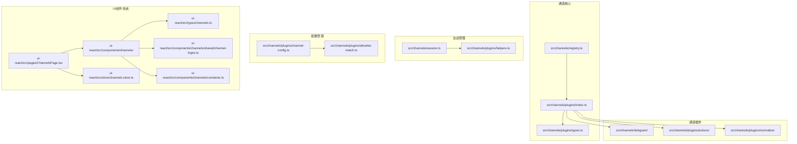
```mermaid
graph TB
subgraph "通道核心"
A[src/channels/registry.ts]
B[src/channels/plugins/index.ts]
C[src/channels/plugins/types.ts]
end
subgraph "通道插件"
D[src/channels/telegram/]
E[src/channels/plugins/actions/]
F[src/channels/plugins/normalize/]
end
subgraph "会话管理"
G[src/channels/session.ts]
H[src/channels/plugins/helpers.ts]
end
subgraph "配置管理"
I[src/channels/plugins/channel-config.ts]
J[src/channels/plugins/allowlist-match.ts]
end
subgraph "UI组件系统"
K[ui-react/src/pages/ChannelsPage.tsx]
L[ui-react/src/components/channels/]
M[ui-react/src/store/channels.store.ts]
N[ui-react/src/types/channels.ts]
O[ui-react/src/components/channels/shared/channel-logos.ts]
P[ui-react/src/components/channels/constants.ts]
end
A --> B
B --> C
B --> D
B --> E
B --> F
G --> H
I --> J
K --> L
K --> M
L --> N
L --> O
L --> P
```

**图表来源**
- [registry.ts:1-201](file://src/channels/registry.ts#L1-L201)
- [plugins/index.ts:1-118](file://src/channels/plugins/index.ts#L1-L118)
- [ChannelsPage.tsx:1-399](file://ui-react/src/pages/ChannelsPage.tsx#L1-L399)
- [channel-logos.ts:1-79](file://ui-react/src/components/channels/shared/channel-logos.ts#L1-L79)

**章节来源**
- [README.md:151-154](file://README.md#L151-L154)
- [README.md:188-202](file://README.md#L188-L202)

## 核心组件

### 通道注册表系统

通道注册表负责管理所有支持的通信渠道，提供统一的通道识别和元数据管理功能。

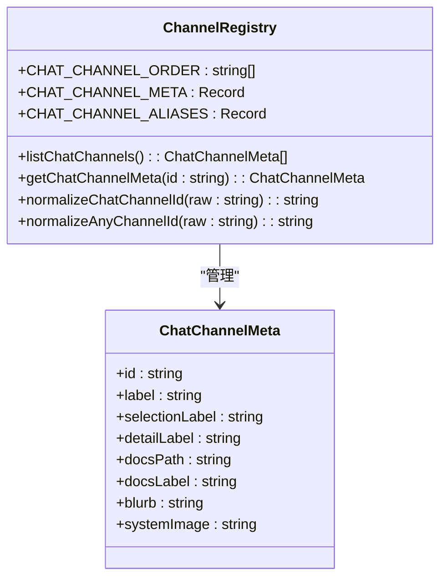
```mermaid
classDiagram
class ChannelRegistry {
+CHAT_CHANNEL_ORDER : string[]
+CHAT_CHANNEL_META : Record
+CHAT_CHANNEL_ALIASES : Record
+listChatChannels() : ChatChannelMeta[]
+getChatChannelMeta(id : string) : ChatChannelMeta
+normalizeChatChannelId(raw : string) : string
+normalizeAnyChannelId(raw : string) : string
}
class ChatChannelMeta {
+id : string
+label : string
+selectionLabel : string
+detailLabel : string
+docsPath : string
+docsLabel : string
+blurb : string
+systemImage : string
}
ChannelRegistry --> ChatChannelMeta : "管理"
```

**图表来源**
- [registry.ts:27-121](file://src/channels/registry.ts#L27-L121)

### 插件管理系统

插件系统采用延迟加载机制，避免不必要的资源消耗。

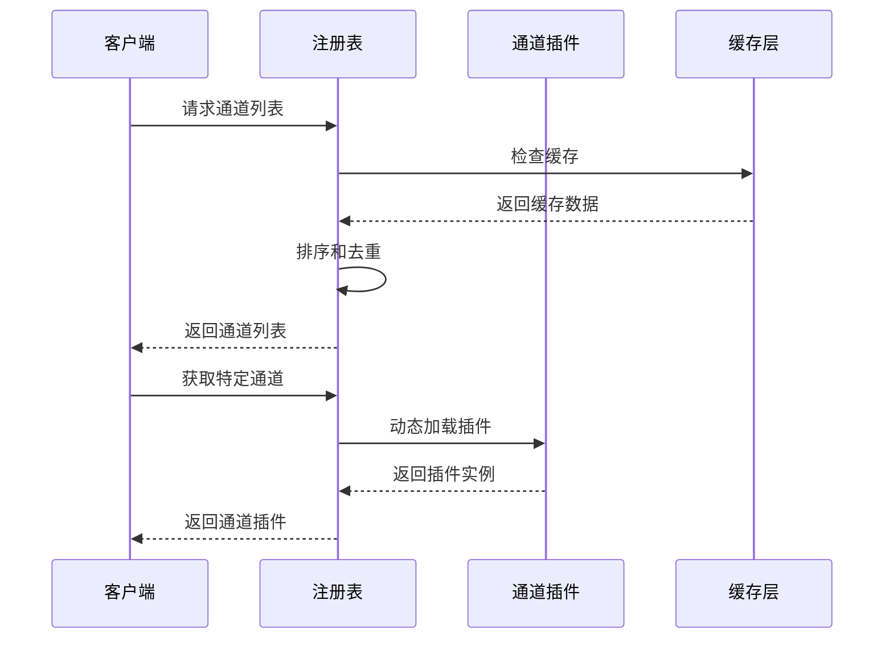
```mermaid
sequenceDiagram
participant Client as 客户端
participant Registry as 注册表
participant Plugin as 通道插件
participant Cache as 缓存层
Client->>Registry : 请求通道列表
Registry->>Cache : 检查缓存
Cache-->>Registry : 返回缓存数据
Registry->>Registry : 排序和去重
Registry-->>Client : 返回通道列表
Client->>Registry : 获取特定通道
Registry->>Plugin : 动态加载插件
Plugin-->>Registry : 返回插件实例
Registry-->>Client : 返回通道插件
```

**图表来源**
- [plugins/index.ts:42-72](file://src/channels/plugins/index.ts#L42-L72)

**章节来源**
- [registry.ts:5-21](file://src/channels/registry.ts#L5-L21)
- [plugins/index.ts:8-12](file://src/channels/plugins/index.ts#L8-L12)

## 架构概览

通道管理系统采用分层架构设计，确保高可扩展性和维护性：

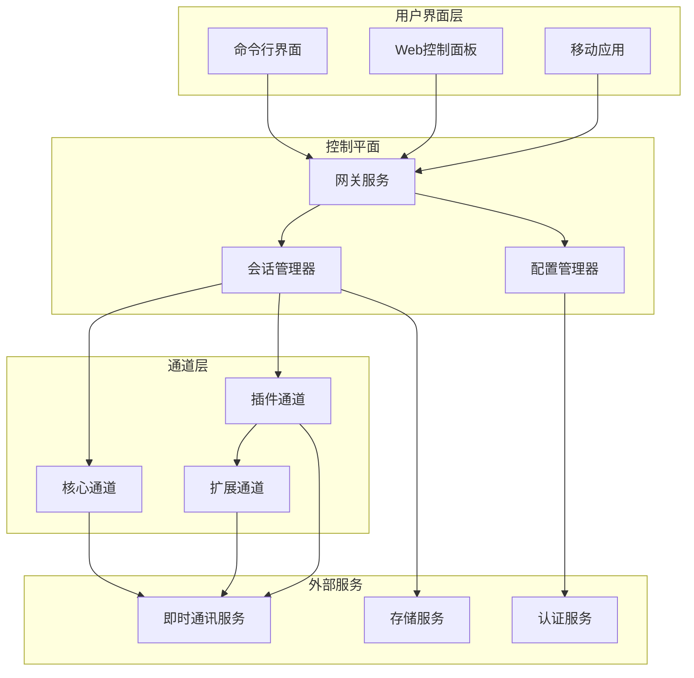
```mermaid
graph TB
subgraph "用户界面层"
UI[命令行界面]
Web[Web控制面板]
Mobile[移动应用]
end
subgraph "控制平面"
Gateway[网关服务]
SessionMgr[会话管理器]
ConfigMgr[配置管理器]
end
subgraph "通道层"
Core[核心通道]
Plugins[插件通道]
Extensions[扩展通道]
end
subgraph "外部服务"
IM[即时通讯服务]
Auth[认证服务]
Storage[存储服务]
end
UI --> Gateway
Web --> Gateway
Mobile --> Gateway
Gateway --> SessionMgr
Gateway --> ConfigMgr
SessionMgr --> Core
SessionMgr --> Plugins
Plugins --> Extensions
Core --> IM
Plugins --> IM
Extensions --> IM
ConfigMgr --> Auth
SessionMgr --> Storage
```

**图表来源**
- [README.md:185-202](file://README.md#L185-L202)

## 详细组件分析

### 通道插件架构

每个通道插件都实现了标准化的接口契约，确保一致性：

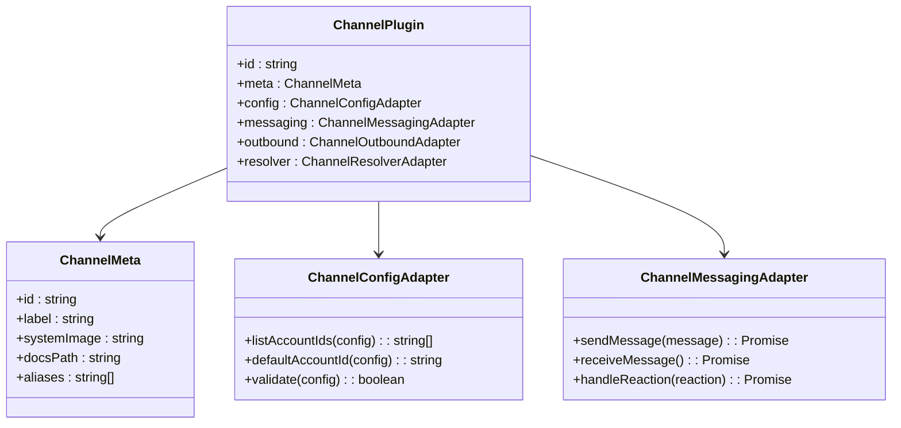
```mermaid
classDiagram
class ChannelPlugin {
+id : string
+meta : ChannelMeta
+config : ChannelConfigAdapter
+messaging : ChannelMessagingAdapter
+outbound : ChannelOutboundAdapter
+resolver : ChannelResolverAdapter
}
class ChannelMeta {
+id : string
+label : string
+systemImage : string
+docsPath : string
+aliases : string[]
}
class ChannelConfigAdapter {
+listAccountIds(config) : string[]
+defaultAccountId(config) : string
+validate(config) : boolean
}
class ChannelMessagingAdapter {
+sendMessage(message) : Promise
+receiveMessage() : Promise
+handleReaction(reaction) : Promise
}
ChannelPlugin --> ChannelMeta
ChannelPlugin --> ChannelConfigAdapter
ChannelPlugin --> ChannelMessagingAdapter
```

**图表来源**
- [plugins/types.ts:31-63](file://src/channels/plugins/types.ts#L31-L63)

### 会话路由机制

会话管理系统负责处理跨通道的消息路由和状态管理：

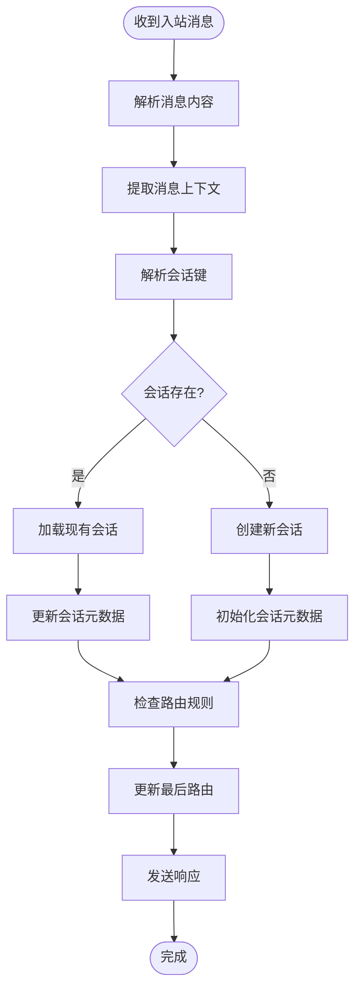
```mermaid
flowchart TD
Start([收到入站消息]) --> ParseMsg[解析消息内容]
ParseMsg --> ExtractCtx[提取消息上下文]
ExtractCtx --> ResolveSession[解析会话键]
ResolveSession --> CheckExists{会话存在?}
CheckExists --> |是| LoadSession[加载现有会话]
CheckExists --> |否| CreateSession[创建新会话]
LoadSession --> UpdateMeta[更新会话元数据]
CreateSession --> InitMeta[初始化会话元数据]
UpdateMeta --> CheckRoute[检查路由规则]
InitMeta --> CheckRoute
CheckRoute --> UpdateRoute[更新最后路由]
UpdateRoute --> SendResponse[发送响应]
SendResponse --> End([完成])
```

**图表来源**
- [session.ts:41-82](file://src/channels/session.ts#L41-L82)

**章节来源**
- [session.ts:13-24](file://src/channels/session.ts#L13-L24)

### 配置管理系统

配置系统提供了灵活的通道配置和权限管理：

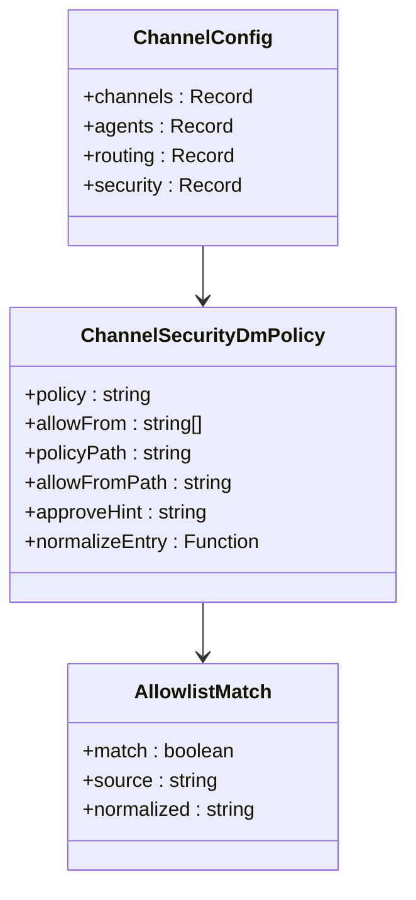
```mermaid
classDiagram
class ChannelConfig {
+channels : Record
+agents : Record
+routing : Record
+security : Record
}
class ChannelSecurityDmPolicy {
+policy : string
+allowFrom : string[]
+policyPath : string
+allowFromPath : string
+approveHint : string
+normalizeEntry : Function
}
class AllowlistMatch {
+match : boolean
+source : string
+normalized : string
}
ChannelConfig --> ChannelSecurityDmPolicy
ChannelSecurityDmPolicy --> AllowlistMatch
```

**图表来源**
- [plugins/helpers.ts:23-58](file://src/channels/plugins/helpers.ts#L23-L58)

**章节来源**
- [plugins/helpers.ts:36-58](file://src/channels/plugins/helpers.ts#L36-L58)

## 新增UI组件架构

### 通道管理页面架构

最新的架构升级引入了现代化的UI组件系统，提供更好的用户体验：

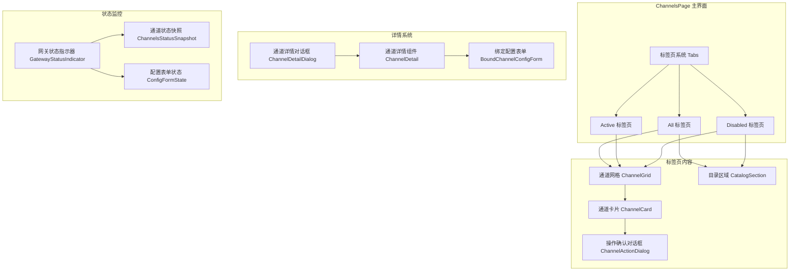
```mermaid
graph TB
subgraph "ChannelsPage 主界面"
A[标签页系统 Tabs]
B[All 标签页]
C[Active 标签页]
D[Disabled 标签页]
end
subgraph "标签页内容"
E[通道网格 ChannelGrid]
F[目录区域 CatalogSection]
G[通道卡片 ChannelCard]
H[操作确认对话框 ChannelActionDialog]
end
subgraph "详情系统"
I[通道详情对话框 ChannelDetailDialog]
J[通道详情组件 ChannelDetail]
K[绑定配置表单 BoundChannelConfigForm]
end
subgraph "状态监控"
L[网关状态指示器 GatewayStatusIndicator]
M[通道状态快照 ChannelsStatusSnapshot]
N[配置表单状态 ConfigFormState]
end
A --> B
A --> C
A --> D
B --> E
B --> F
C --> E
D --> E
D --> F
E --> G
G --> H
I --> J
J --> K
L --> M
L --> N
```

**图表来源**
- [ChannelsPage.tsx:206-361](file://ui-react/src/pages/ChannelsPage.tsx#L206-L361)
- [ChannelDetailDialog.tsx:6-42](file://ui-react/src/components/channels/ChannelDetailDialog.tsx#L6-L42)

### 统一通道操作对话框

系统引入了统一的操作确认对话框，提供一致的用户体验：

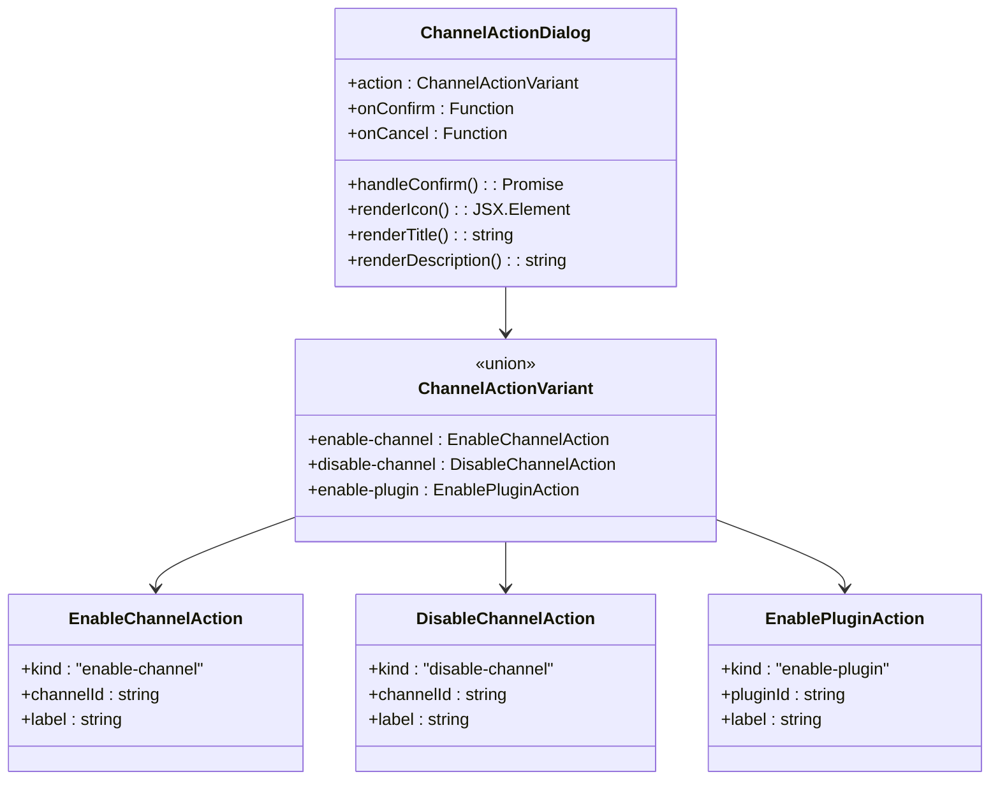
```mermaid
classDiagram
class ChannelActionDialog {
+action : ChannelActionVariant
+onConfirm : Function
+onCancel : Function
+handleConfirm() : Promise
+renderIcon() : JSX.Element
+renderTitle() : string
+renderDescription() : string
}
class ChannelActionVariant {
<<union>>
+enable-channel : EnableChannelAction
+disable-channel : DisableChannelAction
+enable-plugin : EnablePluginAction
}
class EnableChannelAction {
+kind : "enable-channel"
+channelId : string
+label : string
}
class DisableChannelAction {
+kind : "disable-channel"
+channelId : string
+label : string
}
class EnablePluginAction {
+kind : "enable-plugin"
+pluginId : string
+label : string
}
ChannelActionDialog --> ChannelActionVariant
ChannelActionVariant --> EnableChannelAction
ChannelActionVariant --> DisableChannelAction
ChannelActionVariant --> EnablePluginAction
```

**图表来源**
- [ChannelActionDialog.tsx:16-66](file://ui-react/src/components/channels/ChannelActionDialog.tsx#L16-L66)

### 通道网格布局系统

新的网格布局系统提供响应式的通道展示：

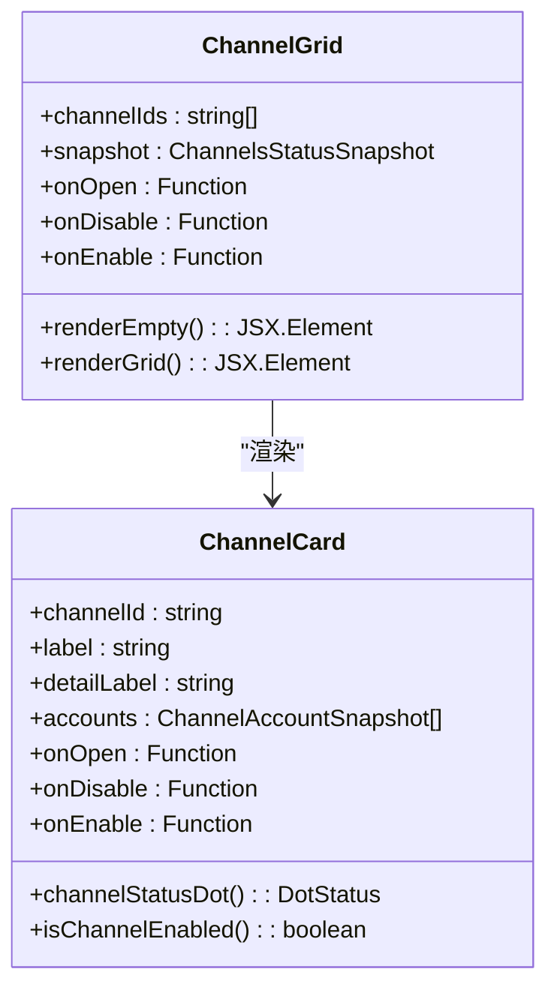
```mermaid
classDiagram
class ChannelGrid {
+channelIds : string[]
+snapshot : ChannelsStatusSnapshot
+onOpen : Function
+onDisable : Function
+onEnable : Function
+renderEmpty() : JSX.Element
+renderGrid() : JSX.Element
}
class ChannelCard {
+channelId : string
+label : string
+detailLabel : string
+accounts : ChannelAccountSnapshot[]
+onOpen : Function
+onDisable : Function
+onEnable : Function
+channelStatusDot() : DotStatus
+isChannelEnabled() : boolean
}
ChannelGrid --> ChannelCard : "渲染"
```

**图表来源**
- [ChannelGrid.tsx:8-47](file://ui-react/src/components/channels/ChannelGrid.tsx#L8-L47)
- [ChannelCard.tsx:20-126](file://ui-react/src/components/channels/ChannelCard.tsx#L20-L126)

### 通道详情对话框架构

通道详情对话框提供详细的通道信息和配置管理：

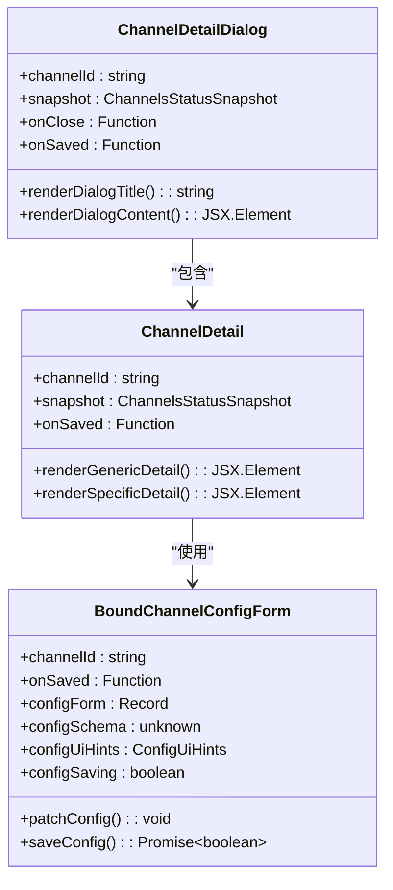
```mermaid
classDiagram
class ChannelDetailDialog {
+channelId : string
+snapshot : ChannelsStatusSnapshot
+onClose : Function
+onSaved : Function
+renderDialogTitle() : string
+renderDialogContent() : JSX.Element
}
class ChannelDetail {
+channelId : string
+snapshot : ChannelsStatusSnapshot
+onSaved : Function
+renderGenericDetail() : JSX.Element
+renderSpecificDetail() : JSX.Element
}
class BoundChannelConfigForm {
+channelId : string
+onSaved : Function
+configForm : Record
+configSchema : unknown
+configUiHints : ConfigUiHints
+configSaving : boolean
+patchConfig() : void
+saveConfig() : Promise~boolean~
}
ChannelDetailDialog --> ChannelDetail : "包含"
ChannelDetail --> BoundChannelConfigForm : "使用"
```

**图表来源**
- [ChannelDetailDialog.tsx:6-42](file://ui-react/src/components/channels/ChannelDetailDialog.tsx#L6-L42)
- [ChannelDetail.tsx:19-169](file://ui-react/src/components/channels/ChannelDetail.tsx#L19-L169)
- [BoundChannelConfigForm.tsx:9-34](file://ui-react/src/components/channels/shared/BoundChannelConfigForm.tsx#L9-L34)

### 通道目录管理系统

新的目录系统提供通道发现和安装功能：

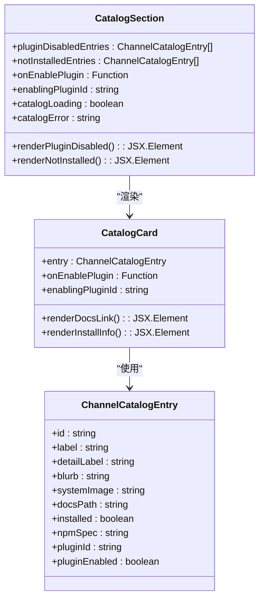
```mermaid
classDiagram
class CatalogSection {
+pluginDisabledEntries : ChannelCatalogEntry[]
+notInstalledEntries : ChannelCatalogEntry[]
+onEnablePlugin : Function
+enablingPluginId : string
+catalogLoading : boolean
+catalogError : string
+renderPluginDisabled() : JSX.Element
+renderNotInstalled() : JSX.Element
}
class CatalogCard {
+entry : ChannelCatalogEntry
+onEnablePlugin : Function
+enablingPluginId : string
+renderDocsLink() : JSX.Element
+renderInstallInfo() : JSX.Element
}
class ChannelCatalogEntry {
+id : string
+label : string
+detailLabel : string
+blurb : string
+systemImage : string
+docsPath : string
+installed : boolean
+npmSpec : string
+pluginId : string
+pluginEnabled : boolean
}
CatalogSection --> CatalogCard : "渲染"
CatalogCard --> ChannelCatalogEntry : "使用"
```

**图表来源**
- [CatalogSection.tsx:10-79](file://ui-react/src/components/channels/CatalogSection.tsx#L10-L79)
- [CatalogCard.tsx:4-73](file://ui-react/src/components/channels/CatalogCard.tsx#L4-L73)

### 网关状态监控系统

集成的网关状态监控提供实时连接状态反馈：

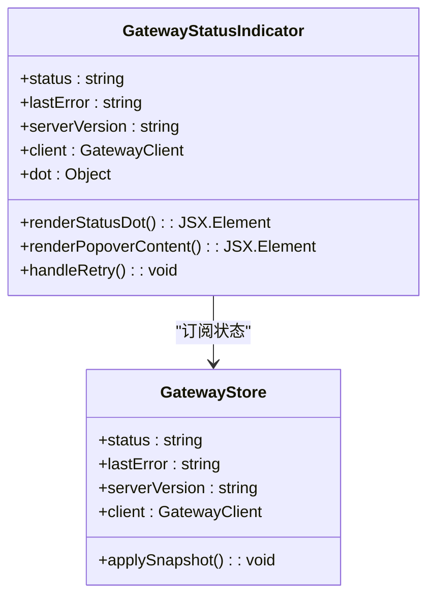
```mermaid
classDiagram
class GatewayStatusIndicator {
+status : string
+lastError : string
+serverVersion : string
+client : GatewayClient
+dot : Object
+renderStatusDot() : JSX.Element
+renderPopoverContent() : JSX.Element
+handleRetry() : void
}
class GatewayStore {
+status : string
+lastError : string
+serverVersion : string
+client : GatewayClient
+applySnapshot() : void
}
GatewayStatusIndicator --> GatewayStore : "订阅状态"
```

**图表来源**
- [GatewayStatusIndicator.tsx:20-101](file://ui-react/src/components/gateway/GatewayStatusIndicator.tsx#L20-L101)

**章节来源**
- [channels.store.ts:108-200](file://ui-react/src/store/channels.store.ts#L108-L200)
- [channels.ts:50-60](file://ui-react/src/types/channels.ts#L50-L60)

## 通道品牌Logo系统

### Logo工具系统架构

新增的通道品牌Logo支持系统为所有通道卡片提供了统一的品牌标识显示功能：

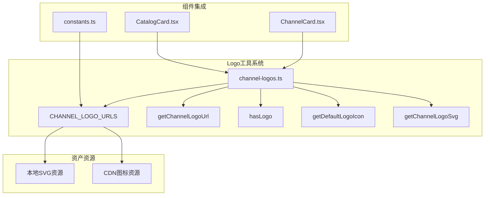
```mermaid
graph TB
subgraph "Logo工具系统"
A[channel-logos.ts]
B[CHANNEL_LOGO_URLS]
C[getChannelLogoUrl]
D[hasLogo]
E[getDefaultLogoIcon]
F[getChannelLogoSvg]
end
subgraph "组件集成"
G[ChannelCard.tsx]
H[CatalogCard.tsx]
I[constants.ts]
end
subgraph "资产资源"
J[本地SVG资源]
K[CDN图标资源]
end
A --> B
A --> C
A --> D
A --> E
A --> F
B --> J
B --> K
G --> A
H --> A
I --> B
```

**图表来源**
- [channel-logos.ts:1-79](file://ui-react/src/components/channels/shared/channel-logos.ts#L1-L79)
- [ChannelCard.tsx:1-141](file://ui-react/src/components/channels/ChannelCard.tsx#L1-L141)
- [CatalogCard.tsx:1-89](file://ui-react/src/components/channels/CatalogCard.tsx#L1-L89)
- [constants.ts:1-20](file://ui-react/src/components/channels/constants.ts#L1-L20)

### Logo映射系统

Logo映射系统提供了统一的品牌标识管理：

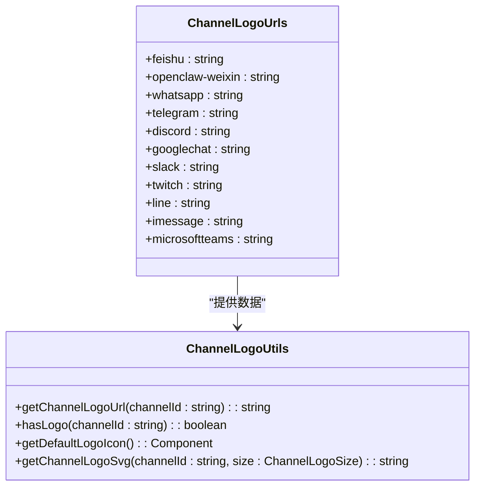
```mermaid
classDiagram
class ChannelLogoUrls {
+feishu : string
+openclaw-weixin : string
+whatsapp : string
+telegram : string
+discord : string
+googlechat : string
+slack : string
+twitch : string
+line : string
+imessage : string
+microsoftteams : string
}
class ChannelLogoUtils {
+getChannelLogoUrl(channelId : string) : string
+hasLogo(channelId : string) : boolean
+getDefaultLogoIcon() : Component
+getChannelLogoSvg(channelId : string, size : ChannelLogoSize) : string
}
ChannelLogoUrls --> ChannelLogoUtils : "提供数据"
```

**图表来源**
- [channel-logos.ts:21-49](file://ui-react/src/components/channels/shared/channel-logos.ts#L21-L49)

### 通道卡片Logo集成

两个核心组件都集成了Logo显示功能：

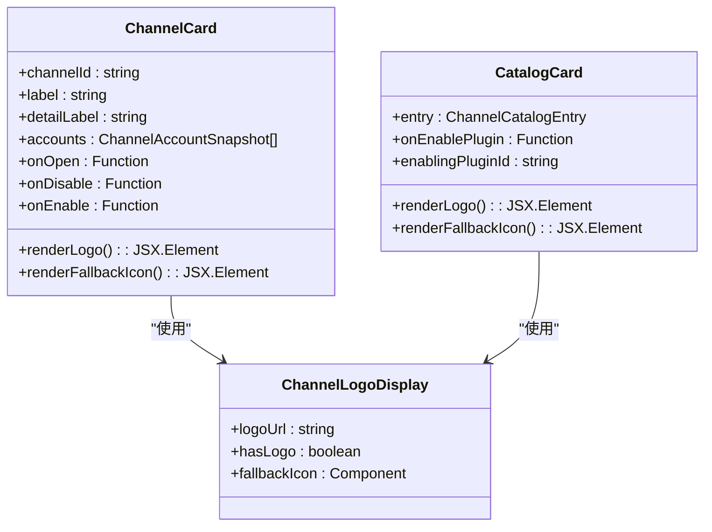
```mermaid
classDiagram
class ChannelCard {
+channelId : string
+label : string
+detailLabel : string
+accounts : ChannelAccountSnapshot[]
+onOpen : Function
+onDisable : Function
+onEnable : Function
+renderLogo() : JSX.Element
+renderFallbackIcon() : JSX.Element
}
class CatalogCard {
+entry : ChannelCatalogEntry
+onEnablePlugin : Function
+enablingPluginId : string
+renderLogo() : JSX.Element
+renderFallbackIcon() : JSX.Element
}
class ChannelLogoDisplay {
+logoUrl : string
+hasLogo : boolean
+fallbackIcon : Component
}
ChannelCard --> ChannelLogoDisplay : "使用"
CatalogCard --> ChannelLogoDisplay : "使用"
```

**图表来源**
- [ChannelCard.tsx:65-83](file://ui-react/src/components/channels/ChannelCard.tsx#L65-L83)
- [CatalogCard.tsx:27-42](file://ui-react/src/components/channels/CatalogCard.tsx#L27-L42)

### Logo回退机制

系统实现了智能的Logo回退机制，确保在任何情况下都有合适的视觉反馈：

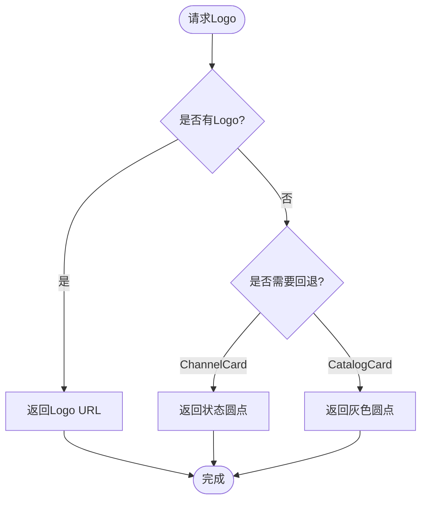
```mermaid
flowchart TD
Start([请求Logo]) --> CheckLogo{是否有Logo?}
CheckLogo --> |是| ReturnLogo[返回Logo URL]
CheckLogo --> |否| CheckFallback{是否需要回退?}
ReturnLogo --> End([完成])
CheckFallback --> |ChannelCard| ReturnDot[返回状态圆点]
CheckFallback --> |CatalogCard| ReturnGrayDot[返回灰色圆点]
ReturnDot --> End
ReturnGrayDot --> End
```

**图表来源**
- [ChannelCard.tsx:78-82](file://ui-react/src/components/channels/ChannelCard.tsx#L78-L82)
- [CatalogCard.tsx:39-41](file://ui-react/src/components/channels/CatalogCard.tsx#L39-L41)

### 核心渠道显示顺序

系统定义了核心内置渠道的显示优先级：

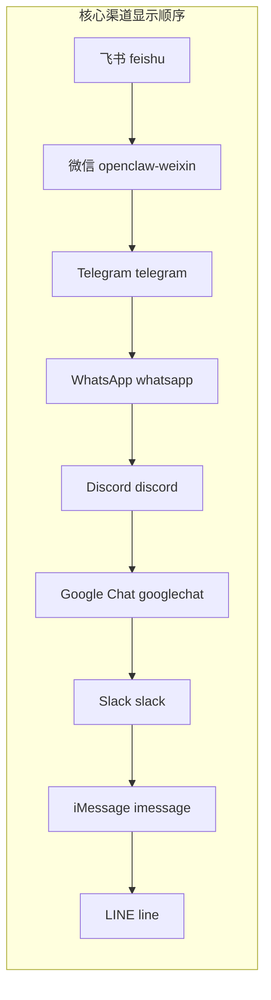
```mermaid
graph LR
subgraph "核心渠道显示顺序"
A[飞书 feishu]
B[微信 openclaw-weixin]
C[Telegram telegram]
D[WhatsApp whatsapp]
E[Discord discord]
F[Google Chat googlechat]
G[Slack slack]
H[iMessage imessage]
I[LINE line]
end
A --> B --> C --> D --> E --> F --> G --> H --> I
```

**图表来源**
- [constants.ts:8-19](file://ui-react/src/components/channels/constants.ts#L8-L19)

**章节来源**
- [channel-logos.ts:1-79](file://ui-react/src/components/channels/shared/channel-logos.ts#L1-L79)
- [ChannelCard.tsx:65-83](file://ui-react/src/components/channels/ChannelCard.tsx#L65-L83)
- [CatalogCard.tsx:27-42](file://ui-react/src/components/channels/CatalogCard.tsx#L27-L42)
- [constants.ts:1-20](file://ui-react/src/components/channels/constants.ts#L1-L20)

## 依赖关系分析

通道管理系统的关键依赖关系如下：

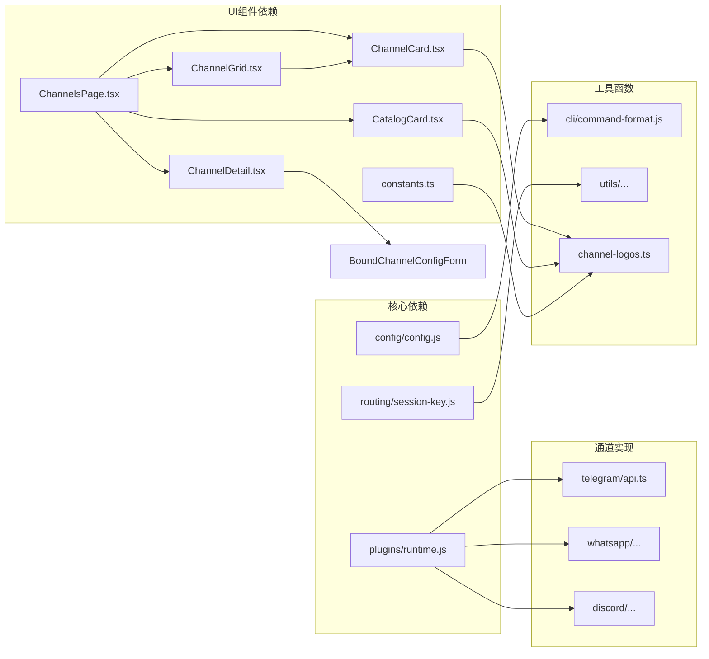
```mermaid
graph LR
subgraph "核心依赖"
A[plugins/runtime.js]
B[config/config.js]
C[routing/session-key.js]
end
subgraph "通道实现"
D[telegram/api.ts]
E[whatsapp/...]
F[discord/...]
end
subgraph "工具函数"
G[cli/command-format.js]
H[utils/...]
I[channel-logos.ts]
end
subgraph "UI组件依赖"
J[ChannelsPage.tsx]
K[ChannelDetail.tsx]
L[ChannelGrid.tsx]
M[ChannelCard.tsx]
N[CatalogCard.tsx]
O[constants.ts]
end
A --> D
A --> E
A --> F
B --> G
C --> H
J --> K
J --> L
J --> M
J --> N
K --> BoundChannelConfigForm
L --> M
M --> I
N --> I
O --> I
```

**图表来源**
- [plugins/helpers.ts:1-5](file://src/channels/plugins/helpers.ts#L1-L5)
- [ChannelsPage.tsx:6-18](file://ui-react/src/pages/ChannelsPage.tsx#L6-L18)
- [channel-logos.ts:1-79](file://ui-react/src/components/channels/shared/channel-logos.ts#L1-L79)

**章节来源**
- [plugins/index.ts:1-12](file://src/channels/plugins/index.ts#L1-L12)

## 性能考虑

通道管理系统在设计时充分考虑了性能优化：

### 缓存策略
- 插件注册表使用版本化缓存，避免重复加载
- 通道元数据按需加载，减少内存占用
- 会话状态缓存提升消息处理速度
- UI组件状态缓存减少重新渲染开销
- Logo URL缓存避免重复计算

### 异步处理
- 所有网络请求采用异步模式
- 消息处理队列化，避免阻塞主线程
- 并发连接池管理，优化资源利用率
- 状态更新采用批量处理机制
- Logo图片懒加载优化首屏性能

### 内存管理
- 插件采用懒加载机制
- 大对象及时释放
- 垃圾回收优化策略
- UI组件虚拟化渲染
- Logo资源统一管理

### 响应式设计
- 移动端优先的布局设计
- 自适应网格系统
- 触摸友好的交互元素
- 低带宽环境下的优化
- SVG格式确保清晰度且文件小

## 故障排除指南

### 常见问题诊断

**通道连接失败**
1. 检查网络连接状态
2. 验证API密钥有效性
3. 确认防火墙设置
4. 查看通道日志输出

**消息路由错误**
1. 检查会话配置
2. 验证路由规则
3. 确认账户权限
4. 查看会话历史记录

**性能问题**
1. 监控系统资源使用
2. 检查连接池状态
3. 分析消息处理时间
4. 优化配置参数

**UI组件问题**
1. 检查网络连接状态
2. 验证状态同步机制
3. 确认组件依赖关系
4. 查看浏览器控制台错误

**Logo显示问题**
1. 检查Logo URL映射是否正确
2. 验证SVG资源文件是否存在
3. 确认CDN访问权限
4. 查看浏览器网络面板错误

**章节来源**
- [README.md:442-450](file://README.md#L442-L450)

## 结论

OpenCLAW通道管理系统通过其模块化架构和插件化设计，为多渠道消息传递提供了强大而灵活的解决方案。系统的设计充分考虑了可扩展性、性能和安全性，在保证功能完整性的同时，为用户提供了简洁易用的管理界面。

最新的架构升级引入了现代化的UI组件系统和通道品牌Logo支持系统，包括统一的操作对话框、响应式的网格布局、详细的通道管理界面、实时的状态监控功能和品牌标识识别系统。这些改进显著提升了用户体验和系统的可维护性。

该系统的核心优势在于：
- 统一的通道抽象层
- 灵活的插件架构
- 完善的安全策略
- 高性能的处理机制
- 丰富的配置选项
- 现代化的UI组件系统
- 实时的状态监控能力
- 品牌Logo识别系统

随着支持通道数量的不断增加和技术的持续演进，该系统将继续为用户提供更加完善的消息传递体验。通道品牌Logo系统的引入进一步增强了用户界面的直观性和专业性，使用户能够快速识别和管理各种通信渠道。