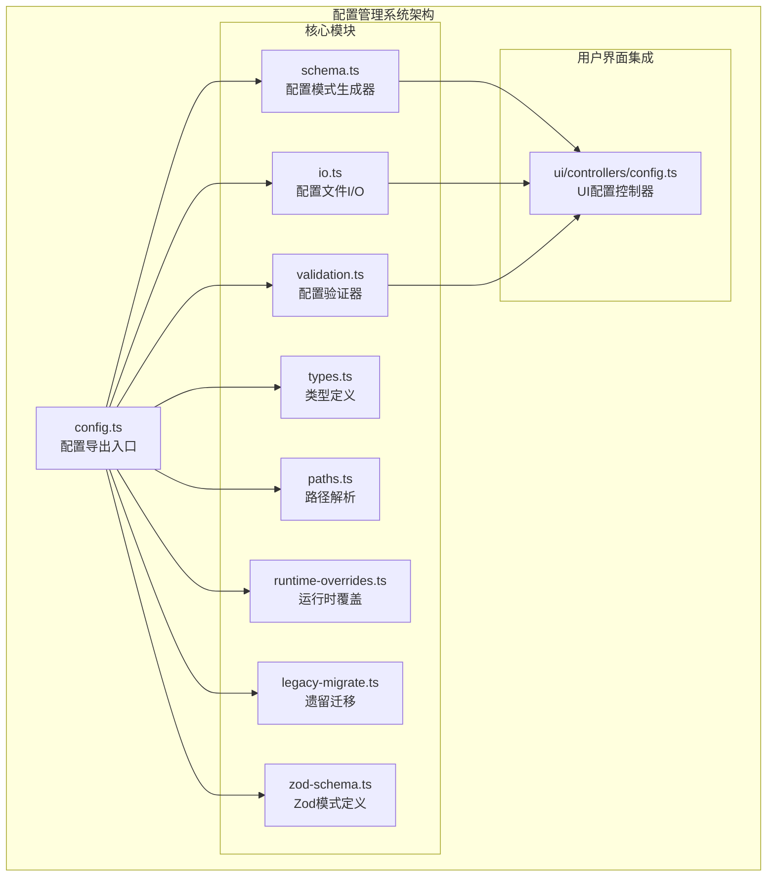
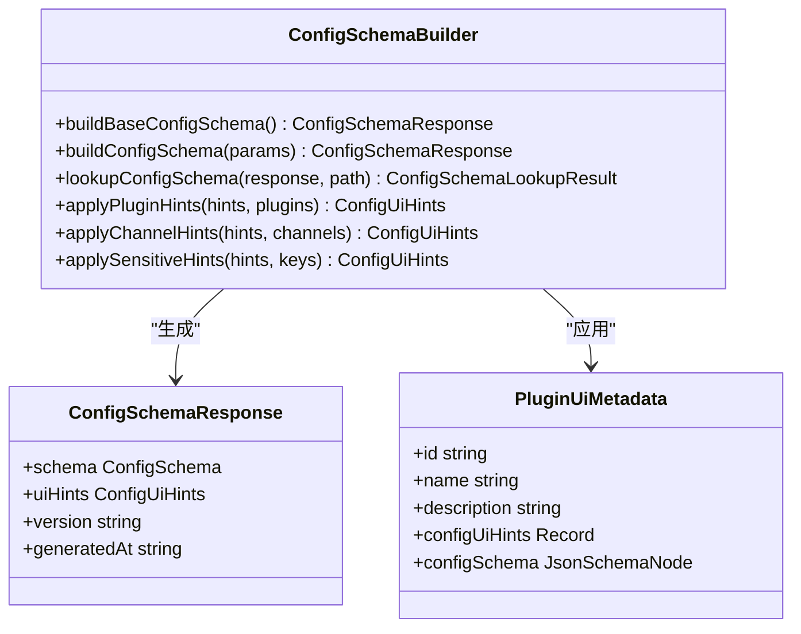
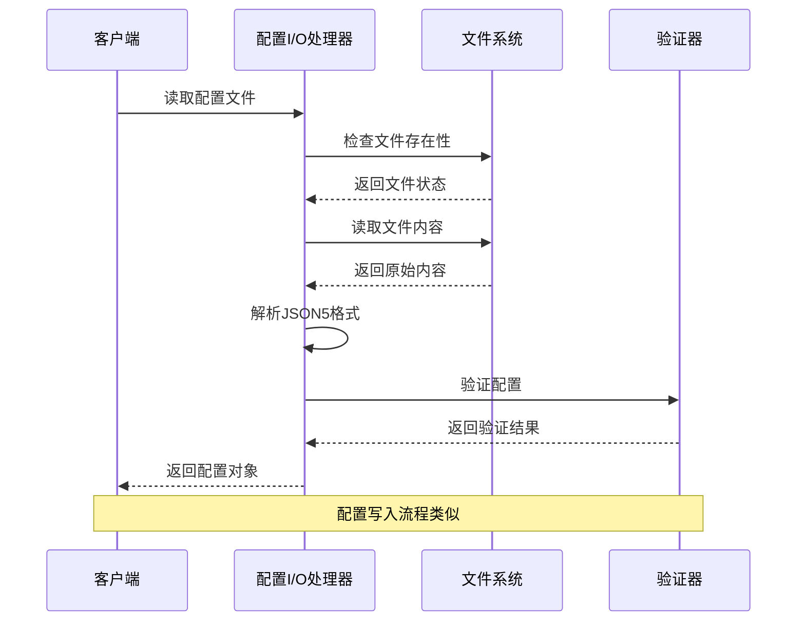
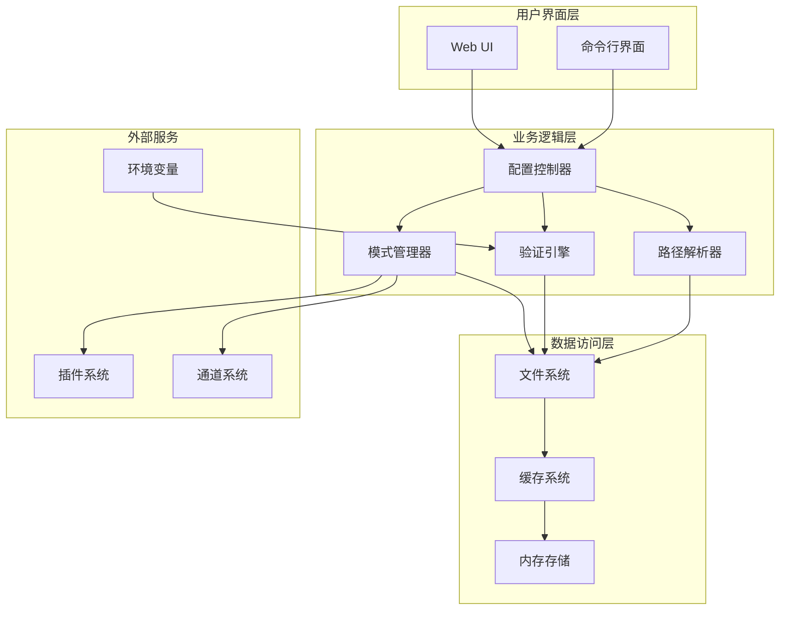
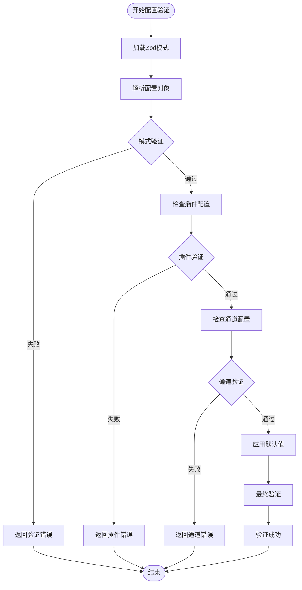
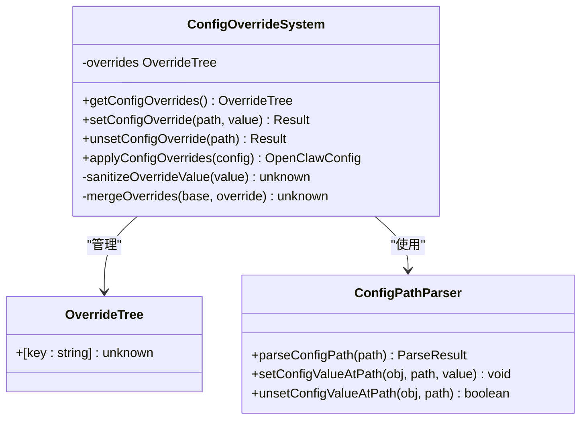
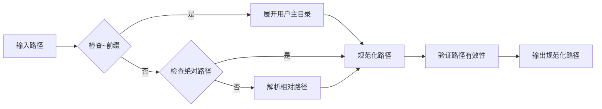
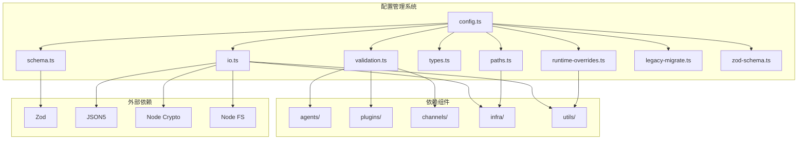

# 配置管理系统

<cite>
**本文档引用的文件**
- [src/config/config.ts](file://src/config/config.ts)
- [src/config/types.ts](file://src/config/types.ts)
- [src/config/schema.ts](file://src/config/schema.ts)
- [src/config/io.ts](file://src/config/io.ts)
- [src/config/validation.ts](file://src/config/validation.ts)
- [src/config/paths.ts](file://src/config/paths.ts)
- [src/config/runtime-overrides.ts](file://src/config/runtime-overrides.ts)
- [src/config/legacy-migrate.ts](file://src/config/legacy-migrate.ts)
- [src/config/zod-schema.ts](file://src/config/zod-schema.ts)
- [ui/src/ui/controllers/config.ts](file://ui/src/ui/controllers/config.ts)
</cite>

## 目录
1. [简介](#简介)
2. [项目结构](#项目结构)
3. [核心组件](#核心组件)
4. [架构概览](#架构概览)
5. [详细组件分析](#详细组件分析)
6. [依赖关系分析](#依赖关系分析)
7. [性能考虑](#性能考虑)
8. [故障排除指南](#故障排除指南)
9. [结论](#结论)

## 简介

配置管理系统是 OpenClaw 生态系统的核心基础设施，负责管理应用程序的所有配置相关功能。该系统提供了完整的配置生命周期管理，包括配置文件的读取、验证、转换、持久化以及运行时动态更新。

系统采用模块化设计，将配置管理功能分解为多个专门的模块，每个模块负责特定的功能领域。这种设计确保了代码的可维护性和可扩展性，同时提供了强大的配置验证和错误处理机制。

## 项目结构

配置管理系统主要位于 `src/config` 目录下，包含以下核心模块：

**图表来源**
- [src/config/config.ts:1-29](file://src/config/config.ts#L1-L29)
- [src/config/schema.ts:1-712](file://src/config/schema.ts#L1-L712)
- [src/config/io.ts:1-800](file://src/config/io.ts#L1-L800)

**章节来源**
- [src/config/config.ts:1-29](file://src/config/config.ts#L1-L29)
- [src/config/types.ts:1-36](file://src/config/types.ts#L1-L36)

## 核心组件

### 配置模式生成器 (Schema Builder)

配置模式生成器是系统的核心组件，负责构建和管理配置的 JSON Schema。它支持动态合并插件和通道的配置模式，并提供智能的 UI 提示功能。

**图表来源**
- [src/config/schema.ts:449-484](file://src/config/schema.ts#L449-L484)
- [src/config/schema.ts:101-106](file://src/config/schema.ts#L101-L106)
- [src/config/schema.ts:126-143](file://src/config/schema.ts#L126-L143)

### 配置文件I/O处理器

配置文件I/O处理器负责处理配置文件的读取、解析、验证和写入操作。它支持多种配置格式，包括 JSON5，并提供环境变量替换功能。

**图表来源**
- [src/config/io.ts:708-800](file://src/config/io.ts#L708-L800)
- [src/config/validation.ts:229-286](file://src/config/validation.ts#L229-L286)

**章节来源**
- [src/config/io.ts:1-800](file://src/config/io.ts#L1-L800)
- [src/config/schema.ts:1-712](file://src/config/schema.ts#L1-L712)

## 架构概览

配置管理系统采用分层架构设计，确保各组件之间的松耦合和高内聚：

**图表来源**
- [src/config/config.ts:1-29](file://src/config/config.ts#L1-L29)
- [src/config/schema.ts:449-484](file://src/config/schema.ts#L449-L484)
- [src/config/io.ts:699-700](file://src/config/io.ts#L699-L700)

## 详细组件分析

### 配置验证引擎

配置验证引擎是系统中最复杂的组件之一，负责确保配置的完整性和正确性。它使用 Zod 模式定义进行强类型验证，并提供详细的错误报告。

**图表来源**
- [src/config/validation.ts:308-382](file://src/config/validation.ts#L308-L382)
- [src/config/validation.ts:229-286](file://src/config/validation.ts#L229-L286)

### 运行时配置覆盖系统

运行时配置覆盖系统允许在不修改配置文件的情况下动态调整配置参数。这为调试和临时配置变更提供了便利。

**图表来源**
- [src/config/runtime-overrides.ts:54-92](file://src/config/runtime-overrides.ts#L54-L92)
- [src/config/runtime-overrides.ts:10-30](file://src/config/runtime-overrides.ts#L10-L30)

### 配置路径解析器

配置路径解析器负责处理配置文件中的路径解析和规范化。它支持多种路径格式，包括相对路径、绝对路径和用户主目录展开。

**图表来源**
- [src/config/paths.ts:91-109](file://src/config/paths.ts#L91-L109)
- [src/config/paths.ts:157-192](file://src/config/paths.ts#L157-L192)

**章节来源**
- [src/config/validation.ts:1-605](file://src/config/validation.ts#L1-L605)
- [src/config/runtime-overrides.ts:1-92](file://src/config/runtime-overrides.ts#L1-L92)
- [src/config/paths.ts:1-285](file://src/config/paths.ts#L1-L285)

## 依赖关系分析

配置管理系统与其他系统组件之间存在紧密的依赖关系：

**图表来源**
- [src/config/config.ts:1-29](file://src/config/config.ts#L1-L29)
- [src/config/io.ts:1-56](file://src/config/io.ts#L1-L56)
- [src/config/validation.ts:1-25](file://src/config/validation.ts#L1-L25)

**章节来源**
- [src/config/config.ts:1-29](file://src/config/config.ts#L1-L29)
- [src/config/io.ts:1-800](file://src/config/io.ts#L1-L800)

## 性能考虑

配置管理系统在设计时充分考虑了性能优化：

### 缓存策略
- 配置模式响应结果缓存，避免重复计算
- 合并后的配置模式缓存，支持最大缓存数量限制
- 配置文件哈希缓存，用于快速检测配置变更

### 异步处理
- 配置文件读取采用异步I/O操作
- 环境变量替换支持超时控制
- 插件注册表加载采用延迟初始化

### 内存优化
- 结构化克隆用于深拷贝操作
- 对象图遍历使用弱引用避免循环引用
- 大对象处理采用流式操作

## 故障排除指南

### 常见配置错误

1. **配置格式错误**
   - 检查JSON5语法是否正确
   - 验证配置文件编码格式
   - 确认配置文件权限设置

2. **验证失败错误**
   - 查看详细的验证错误信息
   - 检查配置字段的数据类型
   - 验证必需字段是否完整

3. **插件配置错误**
   - 确认插件ID的有效性
   - 检查插件配置模式匹配
   - 验证插件依赖关系

### 调试技巧

- 使用配置审计日志追踪配置变更历史
- 启用详细日志记录以诊断复杂问题
- 利用运行时配置覆盖进行临时调试
- 检查环境变量替换是否按预期工作

**章节来源**
- [src/config/io.ts:541-555](file://src/config/io.ts#L541-L555)
- [src/config/validation.ts:117-140](file://src/config/validation.ts#L117-L140)

## 结论

配置管理系统通过其模块化设计、强大的验证机制和灵活的扩展能力，为 OpenClaw 生态系统提供了坚实的配置基础。系统的设计充分考虑了可维护性、性能和用户体验，在保证配置安全性的前提下，为用户提供了便捷的配置管理体验。

该系统的核心优势包括：
- 完整的配置生命周期管理
- 强类型的配置验证
- 动态的配置模式生成
- 灵活的运行时覆盖机制
- 友好的用户界面集成

未来的发展方向包括进一步优化性能、增强配置模板功能、改进配置导入导出机制等，以满足不断增长的配置管理需求。