# 配置管理增强

<cite>
**本文档引用的文件**
- [src/config/types.ts](file://src/config/types.ts)
- [src/config/schema.ts](file://src/config/schema.ts)
- [src/config/defaults.ts](file://src/config/defaults.ts)
- [src/config/zod-schema.ts](file://src/config/zod-schema.ts)
- [src/config/schema.hints.ts](file://src/config/schema.hints.ts)
- [src/config/schema.tags.ts](file://src/config/schema.tags.ts)
- [src/config/agent-limits.ts](file://src/config/agent-limits.ts)
- [src/config/model-input.ts](file://src/config/model-input.ts)
- [src/config/talk.ts](file://src/config/talk.ts)
</cite>

## 目录
1. [简介](#简介)
2. [项目结构](#项目结构)
3. [核心组件](#核心组件)
4. [架构概览](#架构概览)
5. [详细组件分析](#详细组件分析)
6. [依赖关系分析](#依赖关系分析)
7. [性能考虑](#性能考虑)
8. [故障排除指南](#故障排除指南)
9. [结论](#结论)

## 简介

OpenClaw 的配置管理增强系统是一个基于 Zod 模式的强大配置验证和管理框架。该系统提供了类型安全的配置定义、动态模式生成、UI 提示管理和敏感信息处理等功能，确保配置的一致性和安全性。

该配置管理系统的核心特点包括：
- 基于 Zod 的强类型配置验证
- 动态配置模式生成和合并
- 智能 UI 提示和标签系统
- 敏感配置项自动识别和保护
- 插件和通道扩展支持
- 性能优化的缓存机制

## 项目结构

配置管理系统采用模块化设计，主要包含以下核心目录和文件：

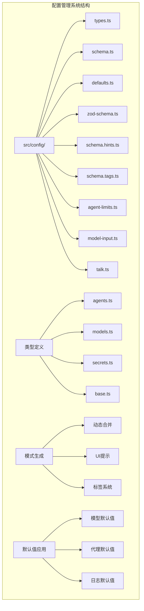

**图表来源**
- [src/config/types.ts:1-36](file://src/config/types.ts#L1-L36)
- [src/config/schema.ts:1-712](file://src/config/schema.ts#L1-L712)
- [src/config/defaults.ts:1-537](file://src/config/defaults.ts#L1-L537)

**章节来源**
- [src/config/types.ts:1-36](file://src/config/types.ts#L1-L36)
- [src/config/schema.ts:1-712](file://src/config/schema.ts#L1-L712)

## 核心组件

### 类型系统架构

配置管理系统采用分层类型设计，通过集中导出机制提供清晰的接口：

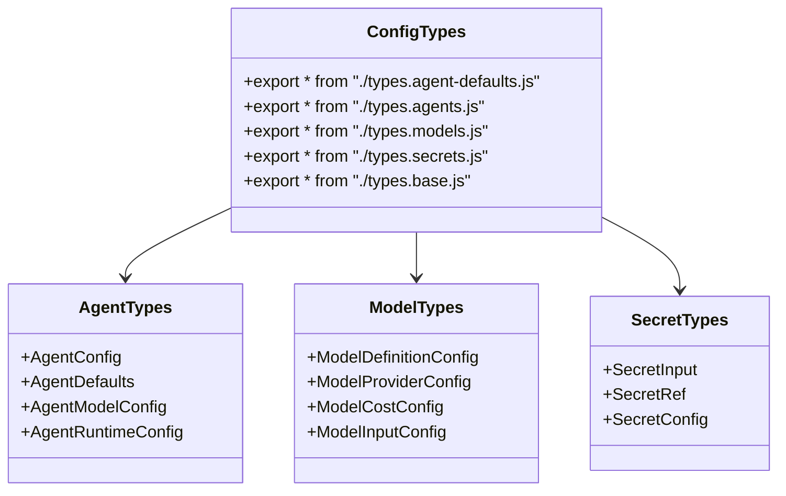

**图表来源**
- [src/config/types.ts:3-36](file://src/config/types.ts#L3-L36)

### 模式验证引擎

Zod 模式验证引擎是配置系统的核心，提供了强大的类型检查和数据验证能力：

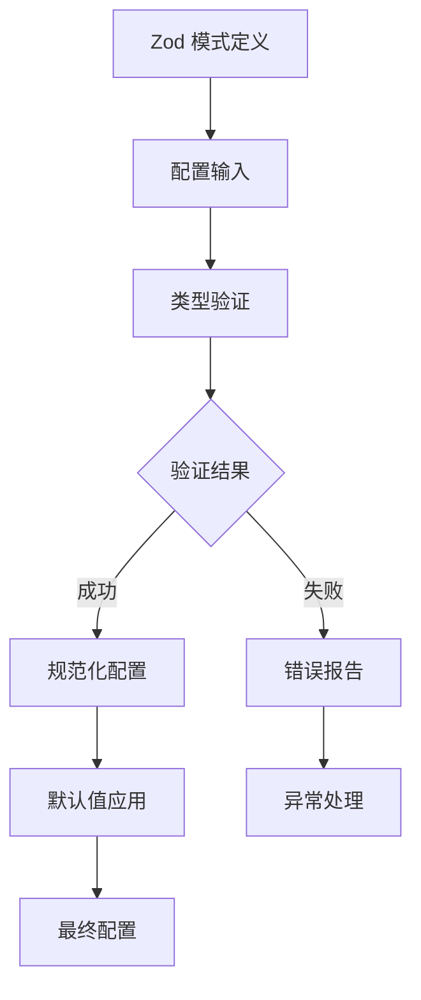

**图表来源**
- [src/config/zod-schema.ts:1-800](file://src/config/zod-schema.ts#L1-L800)

**章节来源**
- [src/config/zod-schema.ts:1-800](file://src/config/zod-schema.ts#L1-L800)
- [src/config/types.ts:1-36](file://src/config/types.ts#L1-L36)

## 架构概览

配置管理系统的整体架构采用分层设计，从底层的类型定义到顶层的配置应用：

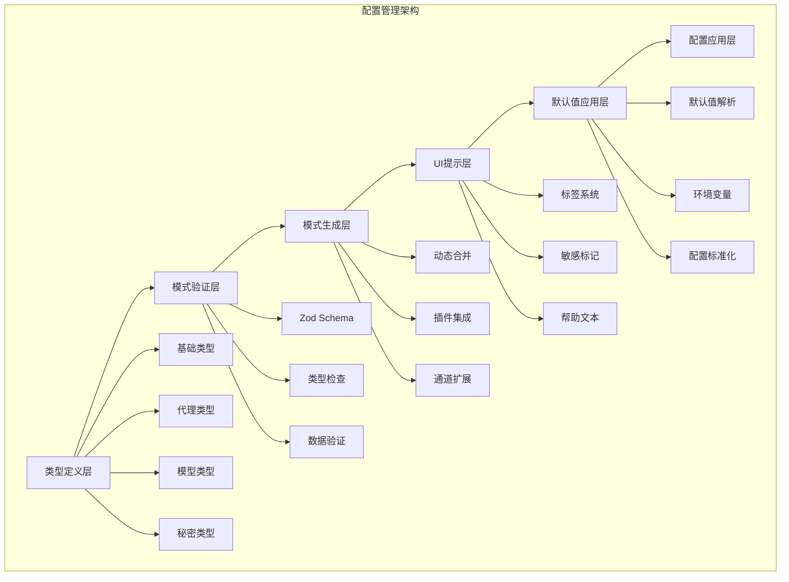

**图表来源**
- [src/config/schema.ts:449-484](file://src/config/schema.ts#L449-L484)
- [src/config/defaults.ts:131-537](file://src/config/defaults.ts#L131-L537)

## 详细组件分析

### 模式生成与合并系统

模式生成系统是配置管理的核心组件，负责动态创建和合并配置模式：

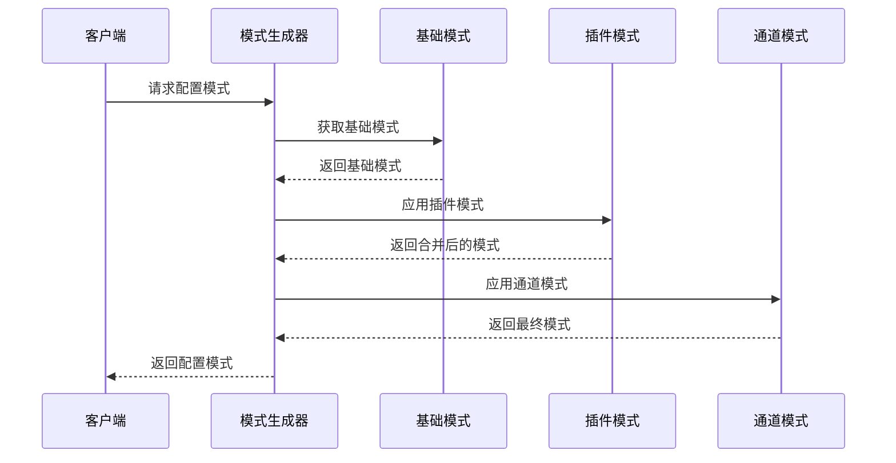

**图表来源**
- [src/config/schema.ts:449-484](file://src/config/schema.ts#L449-L484)

#### 模式合并算法

模式合并系统实现了复杂的对象合并逻辑，支持嵌套对象和数组的智能合并：

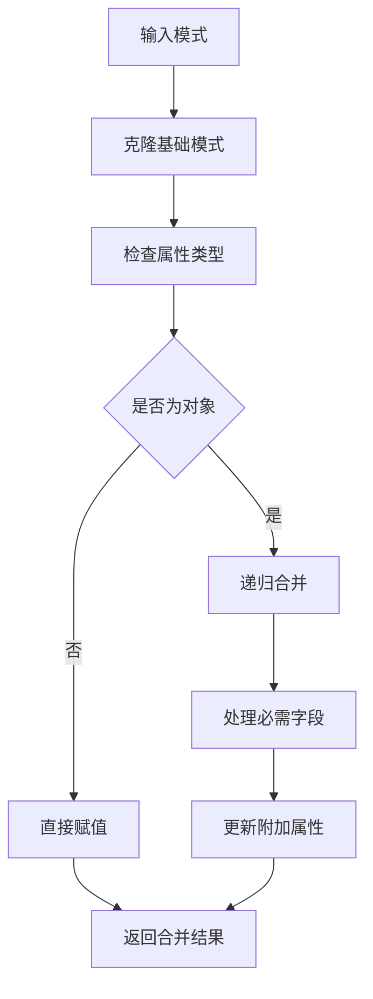

**图表来源**
- [src/config/schema.ts:81-99](file://src/config/schema.ts#L81-L99)

**章节来源**
- [src/config/schema.ts:1-712](file://src/config/schema.ts#L1-L712)

### 默认值应用系统

默认值应用系统提供了多层次的配置默认值设置机制：

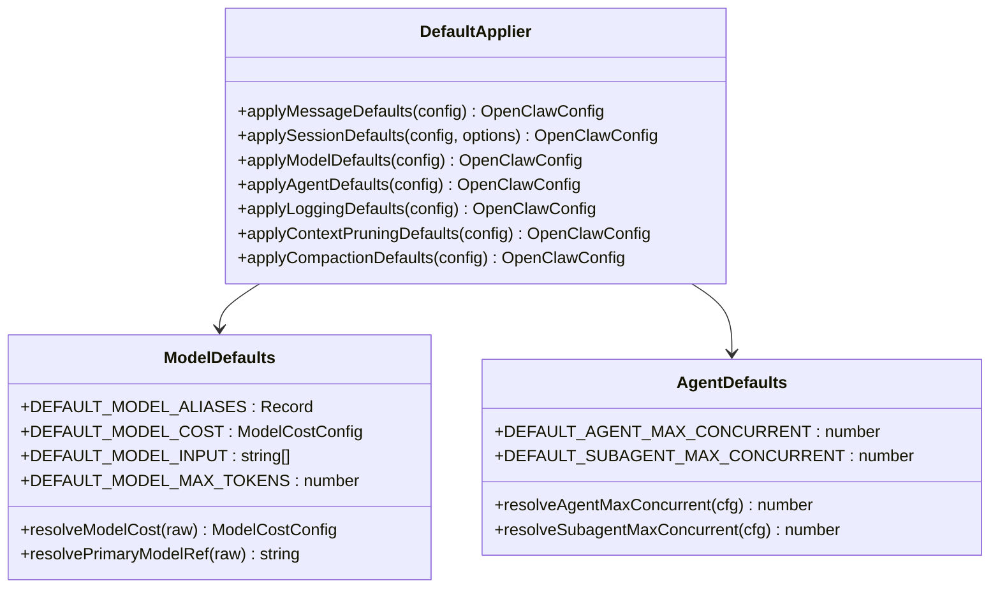

**图表来源**
- [src/config/defaults.ts:131-537](file://src/config/defaults.ts#L131-L537)
- [src/config/agent-limits.ts:1-23](file://src/config/agent-limits.ts#L1-L23)

#### 模型默认值解析流程

模型默认值解析系统支持多种模型别名和成本计算：

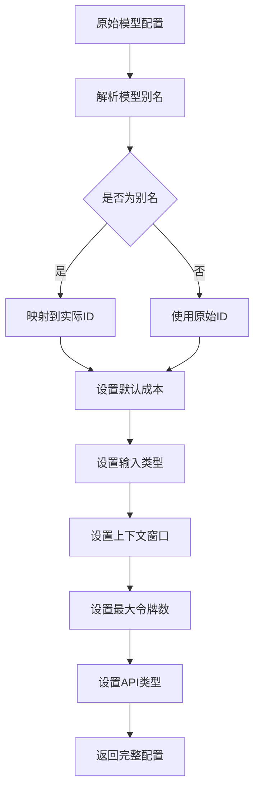

**图表来源**
- [src/config/defaults.ts:213-347](file://src/config/defaults.ts#L213-L347)

**章节来源**
- [src/config/defaults.ts:1-537](file://src/config/defaults.ts#L1-L537)
- [src/config/model-input.ts:1-37](file://src/config/model-input.ts#L1-L37)

### UI 提示与标签系统

UI 提示系统提供了丰富的配置界面支持，包括标签分类和敏感信息标记：

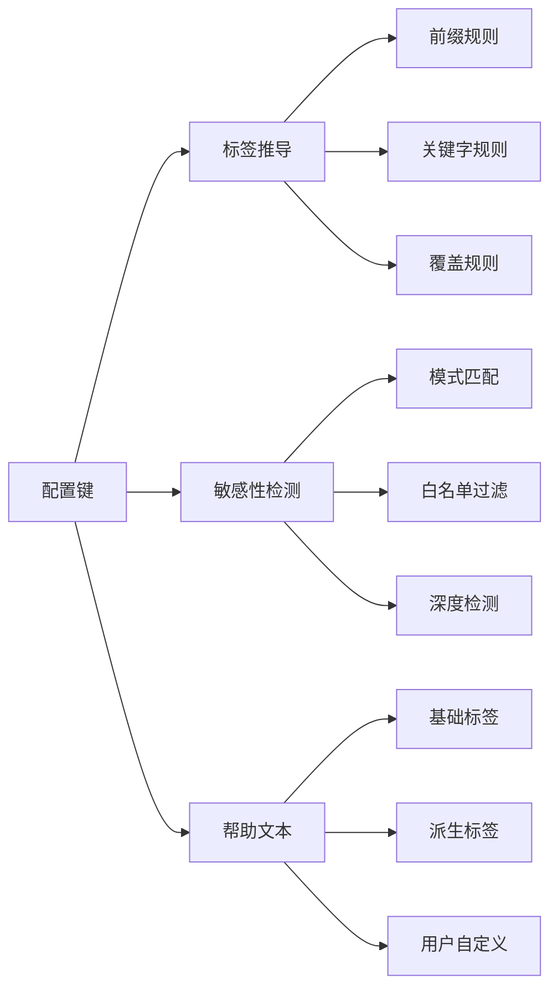

**图表来源**
- [src/config/schema.tags.ts:130-175](file://src/config/schema.tags.ts#L130-L175)
- [src/config/schema.hints.ts:124-146](file://src/config/schema.hints.ts#L124-L146)

#### 敏感信息检测机制

敏感信息检测系统采用了多层防护策略：

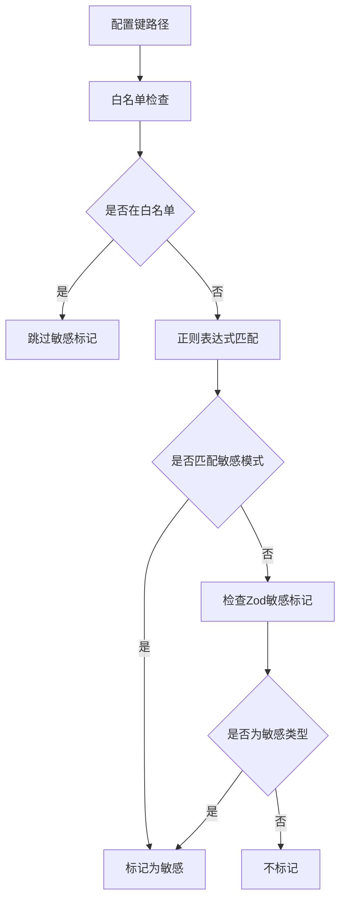

**图表来源**
- [src/config/schema.hints.ts:116-122](file://src/config/schema.hints.ts#L116-L122)
- [src/config/schema.hints.ts:197-201](file://src/config/schema.hints.ts#L197-L201)

**章节来源**
- [src/config/schema.hints.ts:1-239](file://src/config/schema.hints.ts#L1-L239)
- [src/config/schema.tags.ts:1-187](file://src/config/schema.tags.ts#L1-L187)

### Talk 配置管理系统

Talk 配置系统专门处理语音合成相关的配置管理：

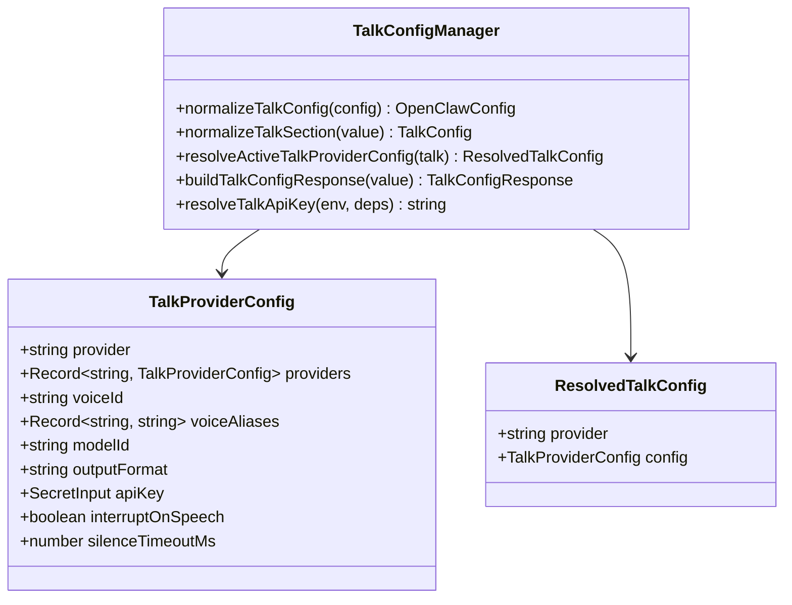

**图表来源**
- [src/config/talk.ts:245-354](file://src/config/talk.ts#L245-L354)

#### API 密钥解析流程

API 密钥解析系统支持多种来源的密钥获取：

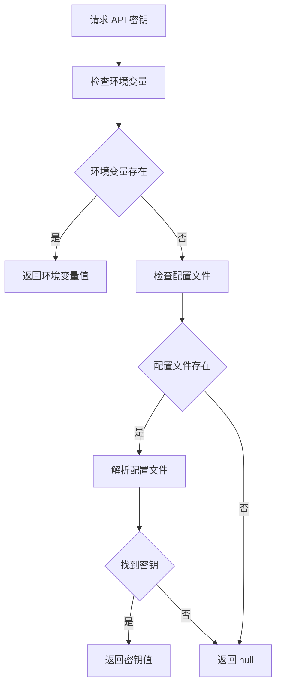

**图表来源**
- [src/config/talk.ts:344-354](file://src/config/talk.ts#L344-L354)

**章节来源**
- [src/config/talk.ts:1-354](file://src/config/talk.ts#L1-L354)

## 依赖关系分析

配置管理系统内部的依赖关系呈现清晰的层次结构：

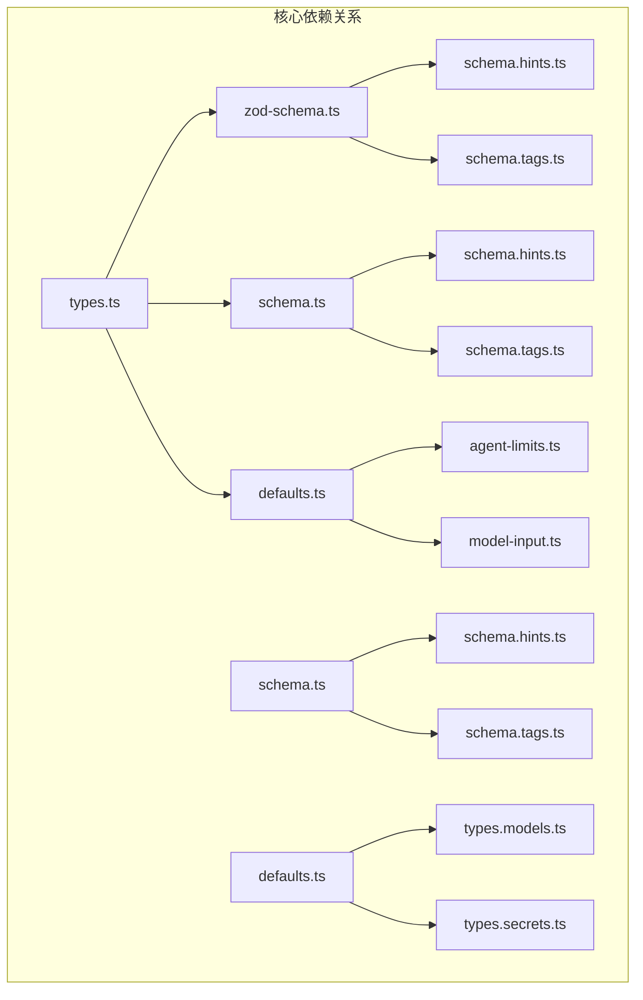

**图表来源**
- [src/config/types.ts:1-36](file://src/config/types.ts#L1-L36)
- [src/config/zod-schema.ts:1-23](file://src/config/zod-schema.ts#L1-L23)

### 缓存机制

配置系统实现了高效的缓存机制来提升性能：

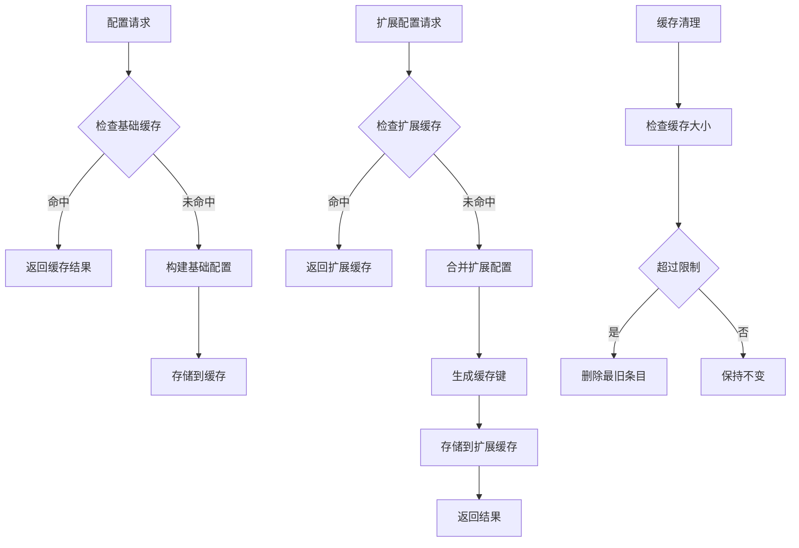

**图表来源**
- [src/config/schema.ts:352-406](file://src/config/schema.ts#L352-L406)

**章节来源**
- [src/config/schema.ts:352-406](file://src/config/schema.ts#L352-L406)

## 性能考虑

配置管理系统在设计时充分考虑了性能优化：

### 缓存策略
- 基础配置模式缓存：避免重复构建基础模式
- 扩展配置模式缓存：限制缓存数量（最多64个）
- 结构化克隆优化：优先使用 `structuredClone`，回退到 JSON 序列化

### 内存管理
- 模式对象的浅拷贝和深拷贝策略
- 字符串和数组的高效处理
- 大对象的延迟构建机制

### 并发处理
- 线程安全的缓存访问
- 异步模式构建支持
- 避免竞态条件的设计

## 故障排除指南

### 常见配置错误

1. **模式验证失败**
   - 检查配置数据类型
   - 验证必需字段完整性
   - 确认枚举值的有效性

2. **默认值应用问题**
   - 确认环境变量设置
   - 检查配置文件格式
   - 验证权限设置

3. **UI 提示显示异常**
   - 检查标签系统配置
   - 验证敏感性检测规则
   - 确认帮助文本完整性

### 调试技巧

- 使用 `console.debug` 输出中间状态
- 启用详细日志记录
- 分步骤验证配置流程
- 检查缓存一致性

**章节来源**
- [src/config/schema.ts:486-712](file://src/config/schema.ts#L486-L712)

## 结论

OpenClaw 的配置管理增强系统通过模块化设计和强大的技术架构，为复杂的配置管理需求提供了完整的解决方案。系统的主要优势包括：

1. **类型安全**：基于 Zod 的强类型验证确保配置的正确性
2. **可扩展性**：支持插件和通道的动态扩展
3. **用户体验**：智能的 UI 提示和标签系统提升配置体验
4. **性能优化**：高效的缓存机制和内存管理
5. **安全性**：自动化的敏感信息检测和保护

该系统为 OpenClaw 生态系统提供了坚实的基础，支持从简单配置到复杂企业级部署的各种场景。