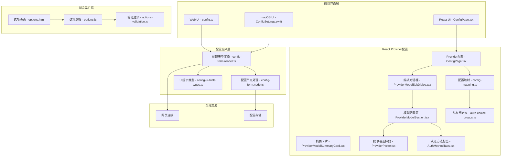
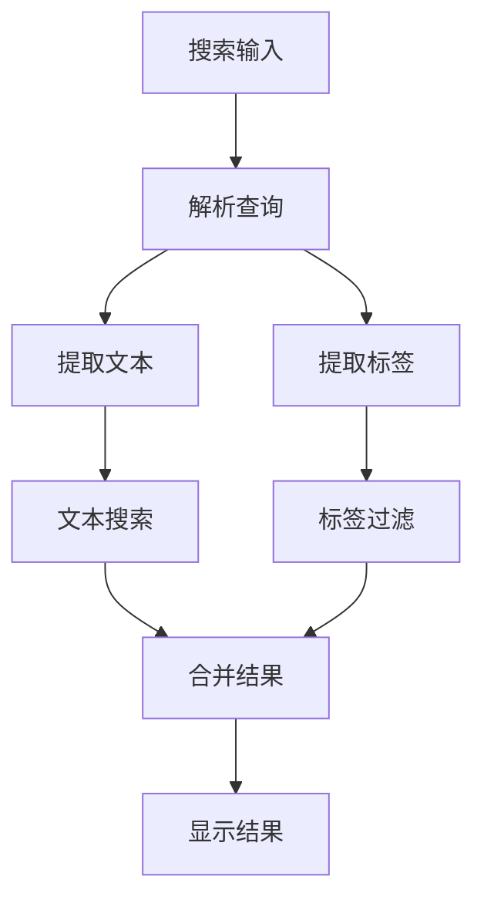
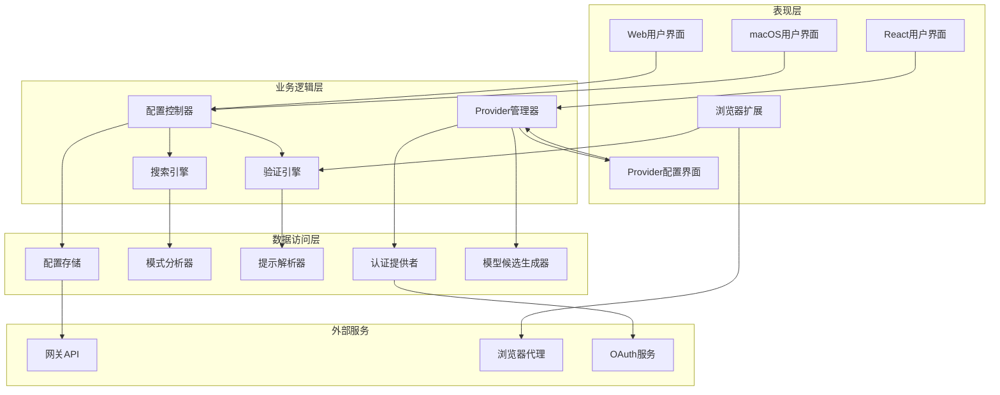
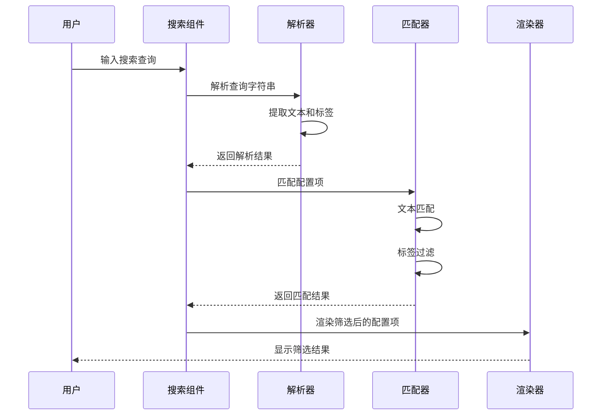
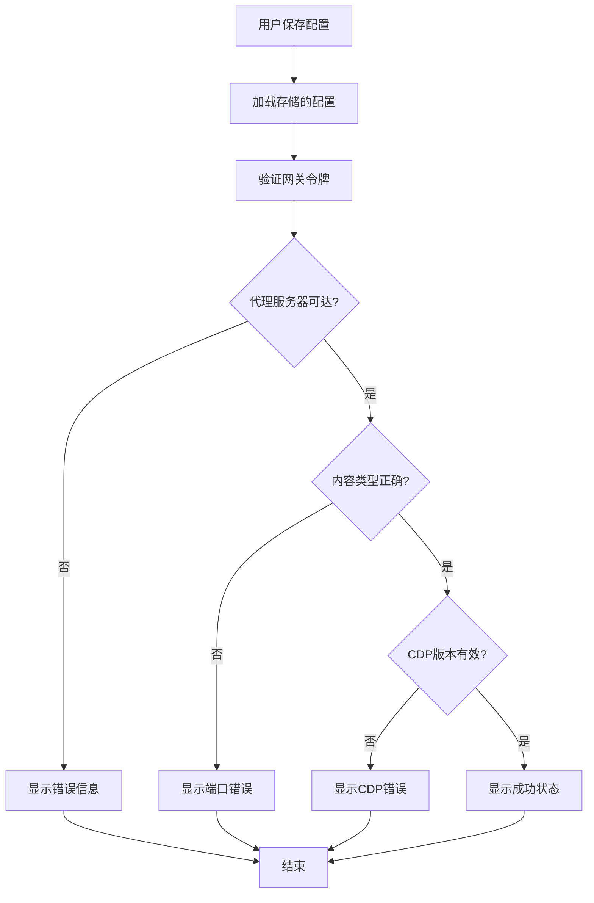
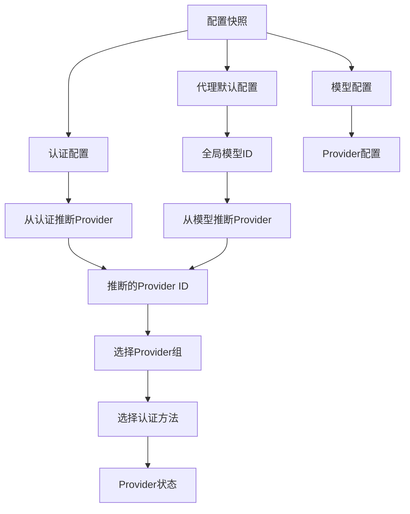
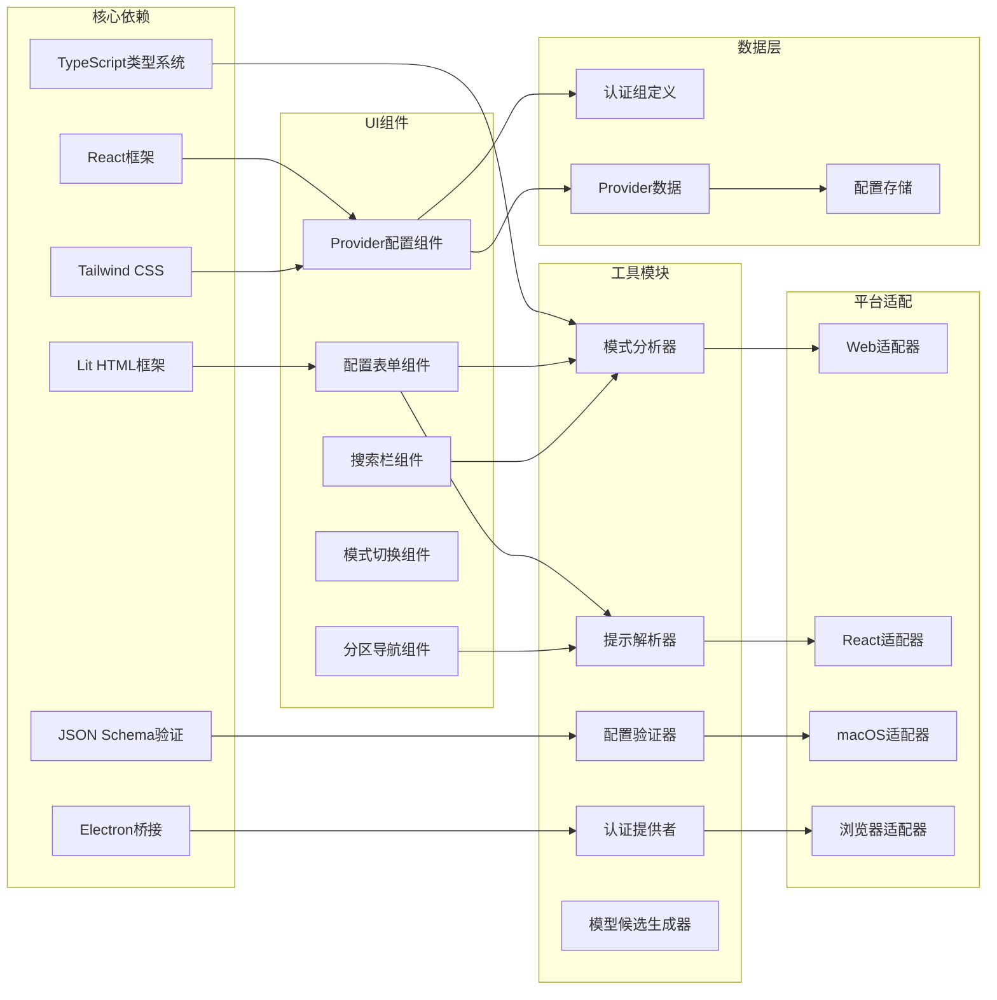

# 配置页面增强

<cite>
**本文档引用的文件**
- [config-form.render.ts](file://ui/src/ui/views/config-form.render.ts)
- [config.ts](file://ui/src/ui/views/config.ts)
- [config-ui-hints-types.ts](file://src/shared/config-ui-hints-types.ts)
- [config-form.node.ts](file://ui/src/ui/views/config-form.node.ts)
- [options.html](file://assets/chrome-extension/options.html)
- [options.js](file://assets/chrome-extension/options.js)
- [options-validation.js](file://assets/chrome-extension/options-validation.js)
- [ConfigPage.tsx](file://ui-react/src/pages/ConfigPage.tsx)
- [ConfigSettings.swift](file://apps/macos/Sources/OpenClaw/ConfigSettings.swift)
- [ProviderModelEditDialog.tsx](file://ui-react/src/components/settings/provider-model/ProviderModelEditDialog.tsx)
- [ProviderModelSection.tsx](file://ui-react/src/components/settings/provider-model/ProviderModelSection.tsx)
- [ProviderModelSummaryCard.tsx](file://ui-react/src/components/settings/provider-model/ProviderModelSummaryCard.tsx)
- [ProviderPicker.tsx](file://ui-react/src/components/settings/provider-model/ProviderPicker.tsx)
- [AuthMethodTabs.tsx](file://ui-react/src/components/settings/provider-model/AuthMethodTabs.tsx)
- [config-mapping.ts](file://ui-react/src/components/settings/provider-model/config-mapping.ts)
- [auth-choice-groups.ts](file://ui-react/src/data/auth-choice-groups.ts)
</cite>

## 更新摘要
**所做更改**
- 新增了React UI配置页面中Provider模型配置功能的详细分析
- 增强了ProviderModelEditDialog组件的技术实现说明
- 完善了增强的凭证管理功能描述
- 更新了改进的模型候选生成逻辑说明
- 添加了新的ProviderModelSection组件分析
- 扩展了配置映射和状态推导功能的说明

## 目录
1. [简介](#简介)
2. [项目结构](#项目结构)
3. [核心组件](#核心组件)
4. [架构概览](#架构概览)
5. [详细组件分析](#详细组件分析)
6. [依赖关系分析](#依赖关系分析)
7. [性能考虑](#性能考虑)
8. [故障排除指南](#故障排除指南)
9. [结论](#结论)

## 简介

本文档详细分析了OpenClaw项目的配置页面增强功能。该项目是一个多平台的AI代理系统，提供了统一的配置管理界面。配置页面增强主要涉及四个核心方面：跨平台配置界面、智能搜索和标签过滤系统、浏览器扩展配置、以及现代化的React用户界面。

该系统支持多种平台（Web、Electron、macOS、React）的配置管理，具有现代化的用户界面设计，包括卡片式布局、图标化导航、响应式设计等特性。配置页面不仅提供基础的设置编辑功能，还集成了高级功能如配置验证、差异显示、批量操作等。

**更新** 新增了React UI配置页面中Provider模型配置功能的完整实现分析，包括新的ProviderModelEditDialog、增强的凭证管理、以及改进的模型候选生成逻辑。

## 项目结构

OpenClaw项目的配置相关文件分布于多个目录中，形成了完整的跨平台配置管理系统：

**图表来源**
- [config.ts:1-821](file://ui/src/ui/views/config.ts#L1-L821)
- [config-form.render.ts:1-479](file://ui/src/ui/views/config-form.render.ts#L1-L479)
- [options.html:1-201](file://assets/chrome-extension/options.html#L1-L201)
- [ConfigPage.tsx:1-358](file://ui-react/src/pages/ConfigPage.tsx#L1-L358)

**章节来源**
- [config.ts:1-821](file://ui/src/ui/views/config.ts#L1-L821)
- [config-form.render.ts:1-479](file://ui/src/ui/views/config-form.render.ts#L1-L479)
- [options.html:1-201](file://assets/chrome-extension/options.html#L1-L201)

## 核心组件

### 配置表单渲染器

配置表单渲染器是整个配置系统的中枢组件，负责将JSON Schema转换为用户友好的表单界面。该组件支持复杂的嵌套结构、条件显示、动态验证等功能。

关键特性包括：
- **模块化设计**：将不同类型的配置项（文本、数字、选择框等）分离到独立的渲染函数中
- **响应式布局**：支持桌面端和移动端的不同显示效果
- **智能分组**：根据配置项的类型和用途自动分组显示
- **状态管理**：集成加载状态、错误状态、禁用状态等多种UI状态
- **现代化设计**：采用卡片式布局和现代化的视觉样式

### 搜索和过滤系统

系统内置了强大的搜索和过滤功能，支持文本搜索和标签过滤的组合使用：

**图表来源**
- [config-form.node.ts:112-128](file://ui/src/ui/views/config-form.node.ts#L112-L128)

### 浏览器扩展配置

浏览器扩展提供了独立的配置界面，专门用于配置本地浏览器代理服务：

- **端口配置**：支持自定义端口号，默认使用18792端口
- **令牌验证**：提供实时的网关令牌验证功能
- **连接测试**：自动检测代理服务器的可达性和认证状态
- **错误提示**：针对不同错误场景提供清晰的用户指导

### React UI配置页面

**新增** React UI配置页面提供了现代化的配置管理体验：

- **Provider模型配置**：支持AI提供商、认证方法和默认模型的配置
- **代理模型覆盖**：允许为每个代理单独设置模型
- **原始配置查看**：提供完整的JSON配置查看功能
- **实时验证**：集成提供商凭证验证机制
- **响应式设计**：使用现代化的UI组件库

### Provider模型配置系统

**新增** React UI配置页面中的Provider模型配置系统提供了完整的AI提供商管理功能：

- **ProviderModelEditDialog**：三步式配置向导，支持提供者选择、认证配置和模型设置
- **ProviderModelSection**：综合配置区域，包含提供者选择、认证方法、模型选择和凭证验证
- **ProviderModelSummaryCard**：显示当前配置摘要和快速编辑入口
- **增强的凭证管理**：支持OAuth、API Key、自定义和代理等多种认证方式
- **改进的模型候选生成**：基于配置和方法组动态生成可用模型列表

**章节来源**
- [config-form.render.ts:1-479](file://ui/src/ui/views/config-form.render.ts#L1-L479)
- [config.ts:38-54](file://ui/src/ui/views/config.ts#L38-L54)
- [options.js:1-75](file://assets/chrome-extension/options.js#L1-L75)
- [ConfigPage.tsx:1-358](file://ui-react/src/pages/ConfigPage.tsx#L1-L358)
- [ProviderModelEditDialog.tsx:1-264](file://ui-react/src/components/settings/provider-model/ProviderModelEditDialog.tsx#L1-L264)

## 架构概览

配置系统的整体架构采用了分层设计，确保了良好的可维护性和扩展性：

**图表来源**
- [config.ts:405-792](file://ui/src/ui/views/config.ts#L405-L792)
- [config-form.render.ts:319-478](file://ui/src/ui/views/config-form.render.ts#L319-L478)
- [ConfigPage.tsx:89-358](file://ui-react/src/pages/ConfigPage.tsx#L89-L358)

## 详细组件分析

### 配置表单渲染组件

配置表单渲染组件是系统的核心，负责将复杂的配置结构转换为直观的用户界面：

#### 组件结构分析

```mermaid
classDiagram
class ConfigFormProps {
+JsonSchema schema
+ConfigUiHints uiHints
+Record~string, unknown~ value
+boolean disabled
+string[] unsupportedPaths
+string searchQuery
+string activeSection
+string activeSubsection
+onPatch Function
}
class ConfigFormRenderer {
+renderConfigForm(ConfigFormProps) TemplateResult
+SECTION_META Object
+getSectionIcon(string) SVG
+matchesSearch(Object) boolean
}
class FieldRenderer {
+renderTextInput(Object) TemplateResult
+renderNumberInput(Object) TemplateResult
+renderSelect(Object) TemplateResult
+renderCheckbox(Object) TemplateResult
}
ConfigFormProps --> ConfigFormRenderer
ConfigFormRenderer --> FieldRenderer
```

**图表来源**
- [config-form.render.ts:7-17](file://ui/src/ui/views/config-form.render.ts#L7-L17)
- [config-form.render.ts:319-478](file://ui/src/ui/views/config-form.render.ts#L319-L478)

#### 搜索功能实现

搜索功能通过组合文本匹配和标签过滤来实现精确的配置项定位：

**图表来源**
- [config-form.node.ts:112-128](file://ui/src/ui/views/config-form.node.ts#L112-L128)
- [config-form.node.ts:32-44](file://ui/src/ui/views/config-form.node.ts#L32-L44)

**章节来源**
- [config-form.render.ts:1-479](file://ui/src/ui/views/config-form.render.ts#L1-L479)
- [config-form.node.ts:1-152](file://ui/src/ui/views/config-form.node.ts#L1-L152)

### 浏览器扩展配置组件

浏览器扩展提供了独立的配置界面，专门用于管理本地浏览器代理服务：

#### 配置页面结构

浏览器扩展的配置页面采用卡片式设计，包含以下主要区域：

- **获取开始卡片**：提供基本的使用说明和故障排除指导
- **代理连接卡片**：核心配置区域，包含端口设置和令牌配置
- **状态指示器**：实时显示连接状态和验证结果

#### 连接验证流程

**图表来源**
- [options.js:26-49](file://assets/chrome-extension/options.js#L26-L49)
- [options-validation.js:7-42](file://assets/chrome-extension/options-validation.js#L7-L42)

**章节来源**
- [options.html:1-201](file://assets/chrome-extension/options.html#L1-L201)
- [options.js:1-75](file://assets/chrome-extension/options.js#L1-L75)
- [options-validation.js:1-58](file://assets/chrome-extension/options-validation.js#L1-L58)

### macOS配置界面

macOS平台提供了原生的配置界面，集成了系统级的用户体验：

#### 界面设计特点

- **原生风格**：遵循macOS的设计规范，使用系统字体和颜色方案
- **智能布局**：根据窗口大小自动调整布局和元素位置
- **状态反馈**：提供详细的进度指示和错误提示
- **空状态处理**：在无配置或加载状态时显示友好的提示信息

#### 功能特性

- **配置加载**：支持从网关加载完整的配置结构
- **实时验证**：显示配置的有效性和潜在问题
- **快速导航**：通过侧边栏快速切换不同的配置部分
- **响应式设计**：适配不同尺寸的屏幕和窗口

**章节来源**
- [ConfigSettings.swift:92-118](file://apps/macos/Sources/OpenClaw/ConfigSettings.swift#L92-L118)
- [ConfigSettings.swift:240-305](file://apps/macos/Sources/OpenClaw/ConfigSettings.swift#L240-L305)

### React UI配置页面

**新增** React UI配置页面提供了现代化的配置管理体验：

#### 页面结构和功能

- **标题区域**：显示"Settings"标题和服务器系统配置说明
- **Provider配置卡片**：管理AI提供商、认证方法和默认模型
- **代理模型覆盖区域**：为每个代理单独设置模型
- **原始配置查看**：提供完整的JSON配置查看对话框

#### Provider模型配置

页面集成了完整的Provider模型配置功能：

- **ProviderModelSummaryCard**：显示当前Provider状态和基本信息
- **ProviderModelEditDialog**：提供编辑对话框，支持凭证验证
- **模型选项生成**：基于配置和方法组动态生成可用模型列表
- **实时状态指示**：显示认证方法的配置状态（未知、OAuth、配置、缺少凭据）

#### ProviderModelEditDialog组件

**新增** ProviderModelEditDialog是Provider配置的核心组件，提供了三步式配置向导：

- **三步配置流程**：Provider → Authentication → Model
- **步骤导航**：可视化步骤指示器，显示当前步骤和完成状态
- **实时验证**：根据配置状态启用/禁用下一步按钮
- **错误处理**：提供清晰的错误提示和解决方案

#### ProviderModelSection组件

**新增** ProviderModelSection是配置区域的核心组件：

- **认证方法选择**：支持OAuth、API Key、自定义和代理认证
- **凭证验证**：集成OAuth流程和API Key验证
- **模型候选生成**：基于方法组和配置生成可用模型列表
- **实时状态反馈**：显示认证状态和连接测试结果

#### 代理配置管理

- **AgentConfigRow组件**：为每个代理显示模型选择下拉框
- **继承模型支持**：允许代理继承默认模型配置
- **模型选项过滤**：基于Provider配置过滤可用模型

#### 原始配置查看

- **对话框设计**：使用Dialog组件提供全屏配置查看
- **JSON格式化**：使用预格式化文本显示完整配置
- **只读模式**：确保配置查看的安全性

**章节来源**
- [ConfigPage.tsx:1-358](file://ui-react/src/pages/ConfigPage.tsx#L1-L358)
- [ProviderModelEditDialog.tsx:1-264](file://ui-react/src/components/settings/provider-model/ProviderModelEditDialog.tsx#L1-L264)
- [ProviderModelSection.tsx:1-542](file://ui-react/src/components/settings/provider-model/ProviderModelSection.tsx#L1-L542)

### Provider配置映射系统

**新增** 配置映射系统负责将配置状态转换为Provider配置：

#### 配置映射功能

- **toProviderAuth**：将认证方法转换为Provider配置格式
- **deriveProviderModelState**：从配置快照推导Provider状态
- **模型ID解析**：处理带前缀的模型ID格式
- **认证方法推断**：根据配置推断最佳认证方法

#### 状态推导逻辑

**图表来源**
- [config-mapping.ts:50-101](file://ui-react/src/components/settings/provider-model/config-mapping.ts#L50-L101)

**章节来源**
- [config-mapping.ts:1-103](file://ui-react/src/components/settings/provider-model/config-mapping.ts#L1-L103)
- [auth-choice-groups.ts:1-744](file://ui-react/src/data/auth-choice-groups.ts#L1-L744)

## 依赖关系分析

配置系统的依赖关系相对清晰，主要围绕几个核心模块构建：

**图表来源**
- [config.ts:1-821](file://ui/src/ui/views/config.ts#L1-L821)
- [config-ui-hints-types.ts:1-14](file://src/shared/config-ui-hints-types.ts#L1-L14)
- [ConfigPage.tsx:3-40](file://ui-react/src/pages/ConfigPage.tsx#L3-L40)

**章节来源**
- [config.ts:1-821](file://ui/src/ui/views/config.ts#L1-L821)
- [config-ui-hints-types.ts:1-14](file://src/shared/config-ui-hints-types.ts#L1-L14)

## 性能考虑

配置系统在设计时充分考虑了性能优化，特别是在处理大型配置结构时的表现：

### 渲染优化策略

1. **虚拟滚动**：对于大量配置项的情况，采用虚拟滚动技术减少DOM节点数量
2. **懒加载**：非活动的配置部分采用懒加载策略，只在需要时渲染
3. **增量更新**：使用细粒度的状态更新机制，避免不必要的重新渲染
4. **缓存机制**：对解析后的配置结构进行缓存，提高重复访问的性能
5. **组件记忆化**：使用useMemo和useCallback优化React组件性能

### 内存管理

- **垃圾回收**：及时清理不再使用的配置对象和事件监听器
- **内存泄漏防护**：在组件卸载时自动清理所有绑定的事件和定时器
- **大对象处理**：对大型配置文件采用流式处理方式，避免内存峰值
- **状态清理**：在对话框关闭时清理临时状态和验证结果

### 网络性能

- **请求去重**：对重复的配置加载请求进行去重处理
- **缓存策略**：合理利用浏览器缓存和应用内缓存
- **并发控制**：限制同时进行的网络请求数量，避免阻塞
- **OAuth轮询优化**：合理设置轮询间隔，避免过度请求

## 故障排除指南

### 常见问题及解决方案

#### 配置加载失败

**症状**：配置页面显示"配置不可用"或加载状态持续

**可能原因**：
- 网关连接中断
- 配置格式不正确
- 权限不足

**解决步骤**：
1. 检查网关连接状态
2. 验证配置格式的JSON Schema有效性
3. 确认用户权限是否足够

#### 搜索功能异常

**症状**：搜索框无法正常工作或搜索结果不准确

**可能原因**：
- 搜索索引未建立
- 查询语法错误
- 配置项标签缺失

**解决步骤**：
1. 重新加载配置数据
2. 检查查询语法是否符合要求
3. 为配置项添加适当的标签

#### 浏览器扩展连接问题

**症状**：浏览器扩展显示连接失败或认证错误

**可能原因**：
- 端口配置错误
- 网关令牌无效
- 代理服务器不可达

**解决步骤**：
1. 验证代理服务器端口设置
2. 检查网关令牌的正确性
3. 确认代理服务器正在运行

#### React UI配置问题

**新增** React UI配置页面的故障排除：

**症状**：React配置页面无法加载或显示错误

**可能原因**：
- Provider验证失败
- 网关连接问题
- 配置格式不兼容
- 认证方法不支持

**解决步骤**：
1. 检查Provider凭证验证状态
2. 确认网关连接正常
3. 查看原始配置以诊断格式问题
4. 验证认证方法是否受支持

#### Provider配置对话框问题

**新增** Provider配置对话框的故障排除：

**症状**：Provider配置对话框无法打开或配置失败

**可能原因**：
- 三步配置流程中断
- 凭证验证失败
- 模型选择无效
- OAuth流程异常

**解决步骤**：
1. 检查Provider配置对话框的打开状态
2. 验证每一步的配置要求
3. 确认凭证验证通过
4. 检查模型候选生成是否正常
5. 重新启动OAuth流程

**章节来源**
- [options-validation.js:1-58](file://assets/chrome-extension/options-validation.js#L1-L58)
- [config.ts:405-792](file://ui/src/ui/views/config.ts#L405-L792)

## 结论

OpenClaw的配置页面增强系统展现了现代Web应用配置管理的最佳实践。通过模块化的架构设计、智能化的搜索功能、以及跨平台的一致体验，该系统为用户提供了强大而易用的配置管理能力。

系统的主要优势包括：

1. **跨平台一致性**：Web、React、macOS、浏览器扩展等多平台提供一致的用户体验
2. **智能化搜索**：支持文本搜索和标签过滤的组合，提高配置查找效率
3. **实时验证**：提供即时的配置验证和错误提示
4. **响应式设计**：适应不同设备和屏幕尺寸的显示需求
5. **性能优化**：采用多种优化策略确保在大型配置下的流畅体验
6. **现代化界面**：React UI提供现代化的配置管理体验

**更新** 新增的React UI配置页面和Provider模型配置功能进一步增强了系统的功能完整性，提供了更丰富的配置管理能力，包括：

- **三步式配置向导**：简化复杂的Provider配置流程
- **增强的凭证管理**：支持多种认证方式的统一管理
- **智能模型候选生成**：基于配置动态生成可用模型列表
- **实时状态反馈**：提供详细的配置状态和验证结果
- **完整的OAuth支持**：集成OAuth认证流程和轮询机制

未来可以考虑的功能增强方向：
- 更丰富的配置模板系统
- 配置导入导出功能
- 配置版本管理和回滚
- 更精细的权限控制
- 集成更多第三方服务的配置选项
- 增强的配置备份和恢复功能
- 实时配置同步和冲突解决
- 配置审计和变更历史记录