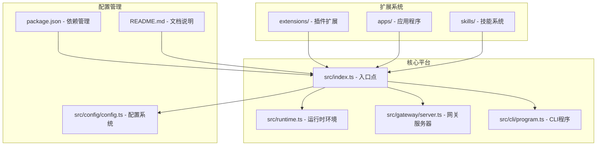
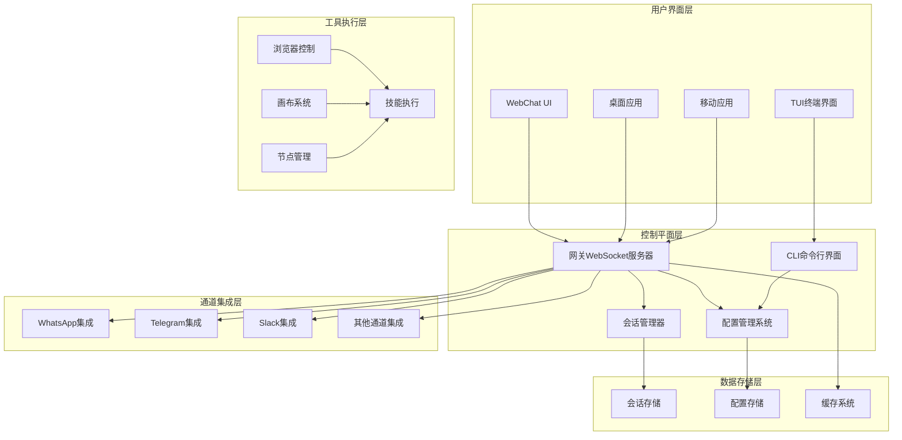
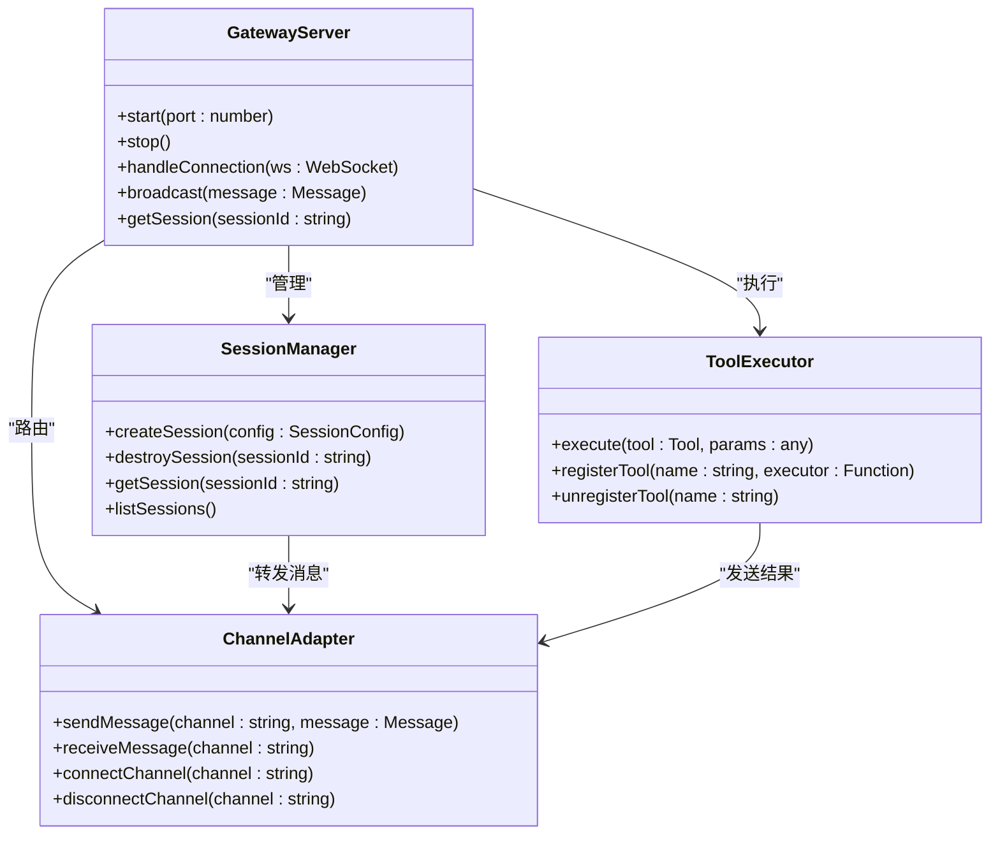
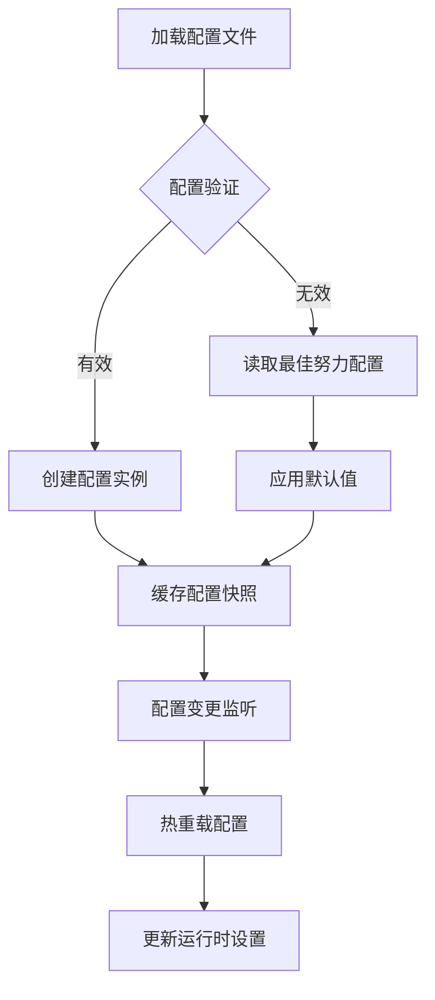
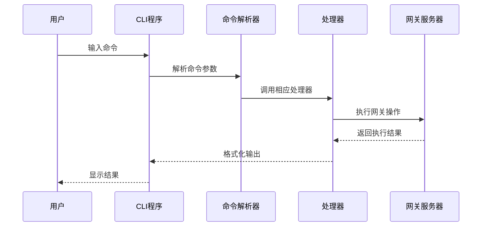
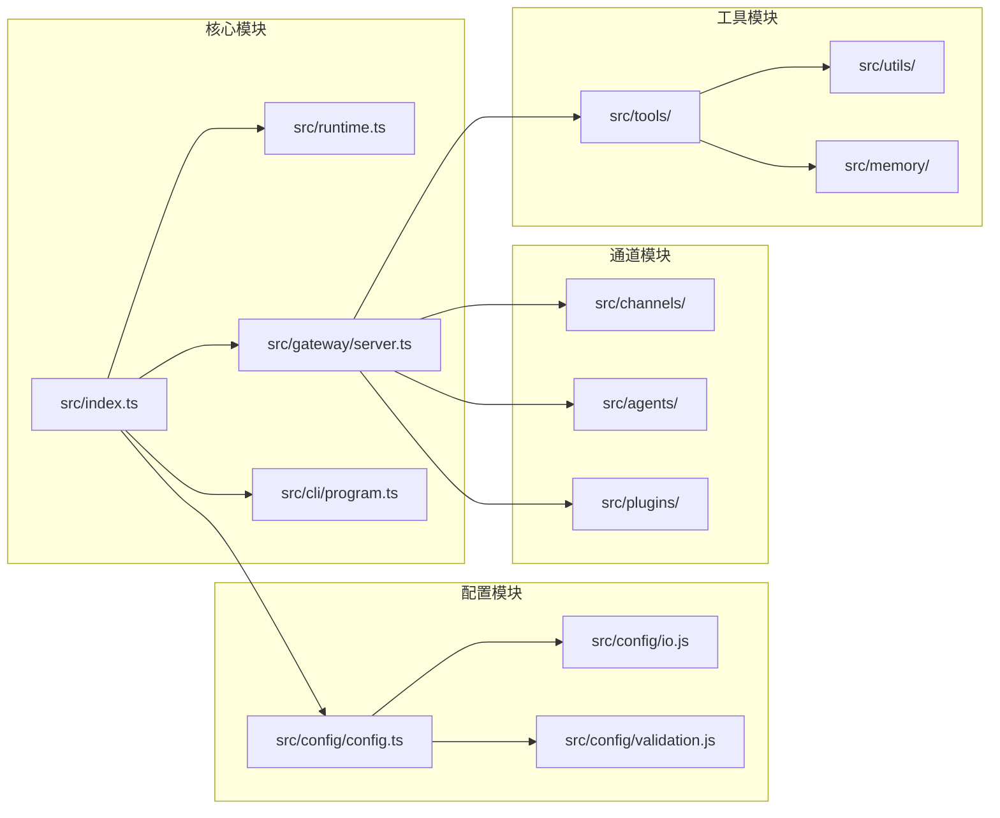

# 代理管理系统

<cite>
**本文档引用的文件**
- [README.md](file://README.md)
- [package.json](file://package.json)
- [src/index.ts](file://src/index.ts)
- [src/runtime.ts](file://src/runtime.ts)
- [src/gateway/server.ts](file://src/gateway/server.ts)
- [src/cli/program.ts](file://src/cli/program.ts)
- [src/config/config.ts](file://src/config/config.ts)
</cite>

## 目录
1. [简介](#简介)
2. [项目结构](#项目结构)
3. [核心组件](#核心组件)
4. [架构概览](#架构概览)
5. [详细组件分析](#详细组件分析)
6. [依赖关系分析](#依赖关系分析)
7. [性能考虑](#性能考虑)
8. [故障排除指南](#故障排除指南)
9. [结论](#结论)

## 简介

OpenClaw 是一个个人AI助手系统，可在用户的设备上运行。它支持多种消息渠道（WhatsApp、Telegram、Slack、Discord、Google Chat、Signal、iMessage、BlueBubbles、IRC、Microsoft Teams、Matrix、Feishu、LINE、Mattermost、Nextcloud Talk、Nostr、Synology Chat、Tlon、Twitch、Zalo、Zalo Personal、WebChat），能够在macOS/iOS/Android上进行语音和监听，并渲染用户可控制的实时画布。

该系统的核心是一个网关WebSocket网络，作为会话、通道、工具和事件的单一控制平面。网关通过本地优先的方式工作，提供快速且始终在线的个人体验。

## 项目结构

OpenClaw项目采用模块化架构设计，主要包含以下核心模块：



**图表来源**
- [src/index.ts:1-94](file://src/index.ts#L1-L94)
- [src/runtime.ts:1-54](file://src/runtime.ts#L1-L54)
- [src/gateway/server.ts:1-4](file://src/gateway/server.ts#L1-L4)
- [src/cli/program.ts:1-3](file://src/cli/program.ts#L1-L3)
- [src/config/config.ts:1-29](file://src/config/config.ts#L1-L29)

**章节来源**
- [README.md:185-240](file://README.md#L185-L240)
- [package.json:1-474](file://package.json#L1-L474)

## 核心组件

### 系统入口点
系统的主要入口点是`src/index.ts`，它负责：
- 加载环境变量和配置
- 初始化运行时环境
- 构建并执行CLI程序
- 设置全局错误处理机制

### 运行时环境
`src/runtime.ts`定义了统一的运行时环境接口，提供：
- 结构化日志记录功能
- 错误处理机制
- 终端状态管理
- 测试环境兼容性

### 网关服务器
`src/gateway/server.ts`提供了网关服务器的核心功能：
- WebSocket连接管理
- 会话生命周期控制
- 通道路由机制
- 安全认证策略

### CLI程序
`src/cli/program.ts`构建了完整的命令行界面：
- 子命令解析和执行
- 端口管理和冲突检测
- 配置文件操作
- 系统健康检查

**章节来源**
- [src/index.ts:1-94](file://src/index.ts#L1-L94)
- [src/runtime.ts:1-54](file://src/runtime.ts#L1-L54)
- [src/gateway/server.ts:1-4](file://src/gateway/server.ts#L1-L4)
- [src/cli/program.ts:1-3](file://src/cli/program.ts#L1-L3)

## 架构概览

OpenClaw采用分层架构设计，实现了高度模块化的系统结构：



**图表来源**
- [README.md:140-180](file://README.md#L140-L180)
- [README.md:204-240](file://README.md#L204-L240)

系统的核心特点包括：
- **单WS控制平面**：所有客户端、工具和事件通过单一WebSocket连接
- **多通道支持**：支持30+种消息渠道的集成
- **本地优先**：默认在本地运行，确保响应速度和隐私安全
- **可扩展性**：通过插件系统支持自定义扩展和技能

## 详细组件分析

### 网关服务器架构



**图表来源**
- [src/gateway/server.ts:1-4](file://src/gateway/server.ts#L1-L4)

### 配置管理系统



**图表来源**
- [src/config/config.ts:1-29](file://src/config/config.ts#L1-L29)

### CLI命令处理流程



**图表来源**
- [src/cli/program.ts:1-3](file://src/cli/program.ts#L1-L3)
- [src/index.ts:79-93](file://src/index.ts#L79-L93)

**章节来源**
- [src/gateway/server.ts:1-4](file://src/gateway/server.ts#L1-L4)
- [src/config/config.ts:1-29](file://src/config/config.ts#L1-L29)
- [src/cli/program.ts:1-3](file://src/cli/program.ts#L1-L3)

## 依赖关系分析

### 核心依赖架构

```mermaid
graph TB
subgraph "运行时依赖"
A[node >= 22.12.0]
B[@mariozechner/pi-agent-core]
C[@mariozechner/pi-ai]
D[@mariozechner/pi-tui]
end
subgraph "通信协议"
E[@agentclientprotocol/sdk]
F[ws]
G[hono]
H[express]
end
subgraph "消息渠道"
I[@whiskeysockets/baileys]
J[@grammyjs/transformer-throttler]
K[@slack/bolt]
L[discord-api-types]
end
subgraph "工具库"
M[@napi-rs/canvas]
N[node-llama-cpp]
O[sharp]
P[sqlite-vec]
end
A --> B
A --> C
A --> D
E --> F
F --> G
G --> H
I --> J
K --> L
M --> N
O --> P
```

**图表来源**
- [package.json:344-402](file://package.json#L344-L402)
- [package.json:425-428](file://package.json#L425-L428)

### 模块间依赖关系



**图表来源**
- [src/index.ts:1-94](file://src/index.ts#L1-L94)
- [src/config/config.ts:1-29](file://src/config/config.ts#L1-L29)

**章节来源**
- [package.json:344-474](file://package.json#L344-L474)
- [src/index.ts:1-94](file://src/index.ts#L1-L94)

## 性能考虑

### 内存管理
- 使用SQLite向量数据库进行高效的数据检索
- 实现会话存储的内存映射优化
- 浏览器控制的资源池管理

### 并发处理
- 基于WebSocket的异步消息处理
- 通道连接的并发管理
- 工具执行的任务队列

### 缓存策略
- 配置文件的缓存机制
- 模型响应的智能缓存
- 会话状态的持久化存储

## 故障排除指南

### 常见问题诊断

1. **端口占用问题**
   - 使用端口冲突检测机制
   - 自动端口重分配功能
   - 详细的端口占用信息报告

2. **配置验证失败**
   - 结构化配置验证
   - 逐项错误报告
   - 默认值回退机制

3. **通道连接异常**
   - 连接状态监控
   - 自动重连机制
   - 通道健康检查

**章节来源**
- [src/index.ts:25-29](file://src/index.ts#L25-L29)
- [src/config/config.ts:23-28](file://src/config/config.ts#L23-L28)

## 结论

OpenClaw代理管理系统展现了现代AI助手系统的最佳实践，通过其模块化架构、丰富的扩展能力和强大的功能集，为用户提供了完整的人工智能代理解决方案。系统的设计充分考虑了安全性、可扩展性和用户体验，在保持高性能的同时提供了灵活的配置选项。

该系统特别适合需要本地部署、强调隐私保护的个人用户和小型团队使用，通过其多通道支持和丰富的工具集，能够满足各种日常任务自动化和智能交互需求。