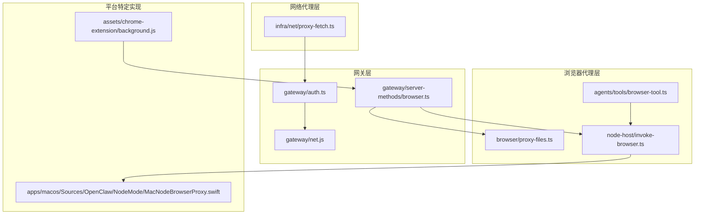
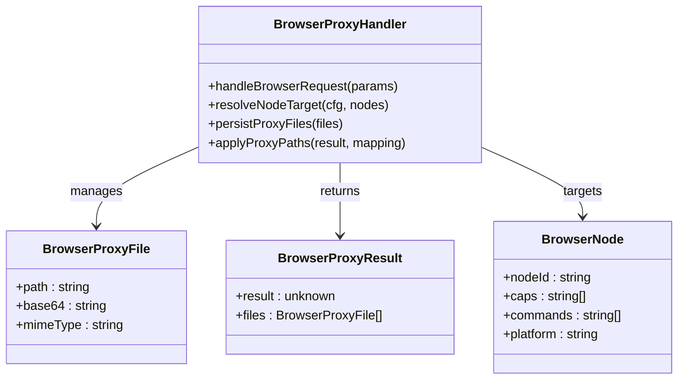
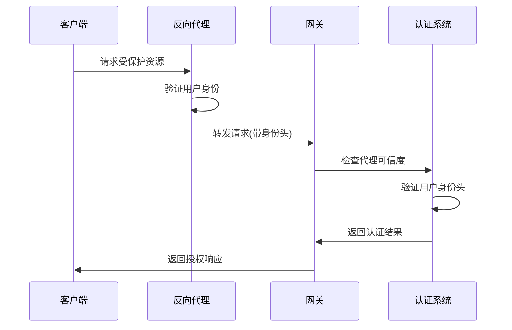
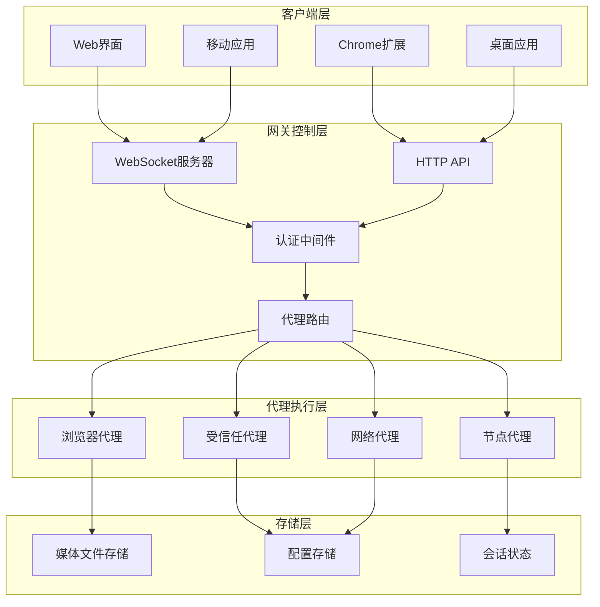
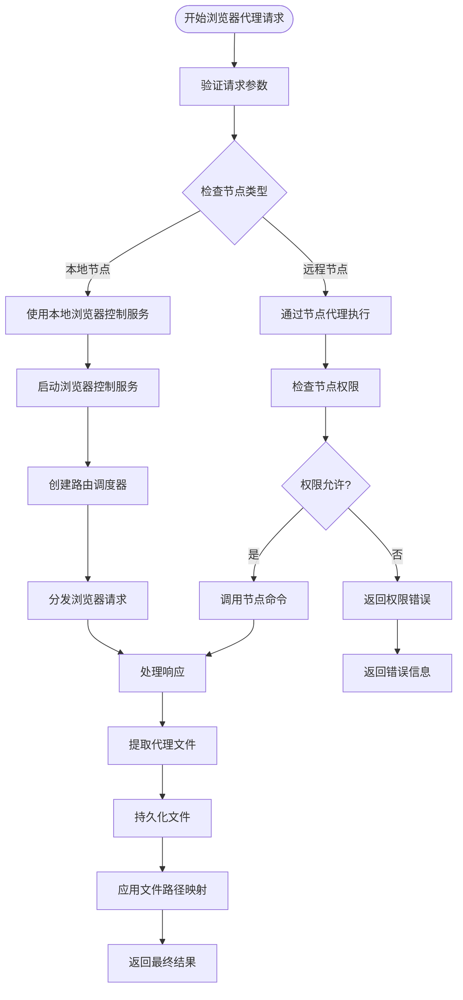
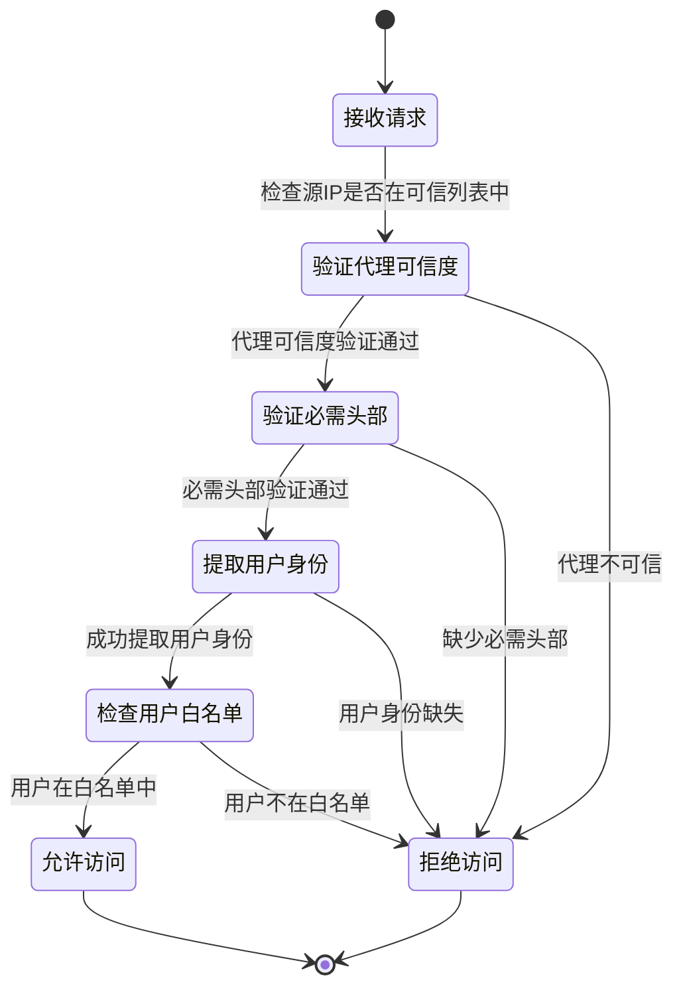
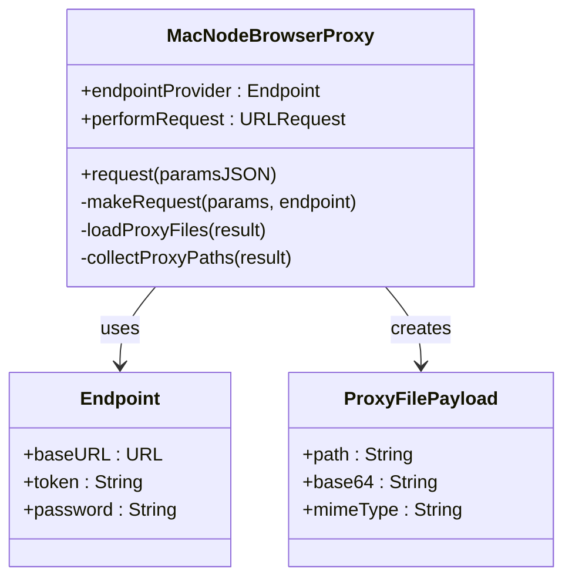
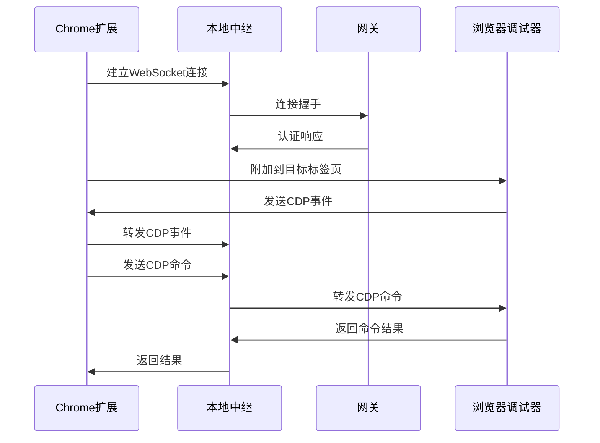
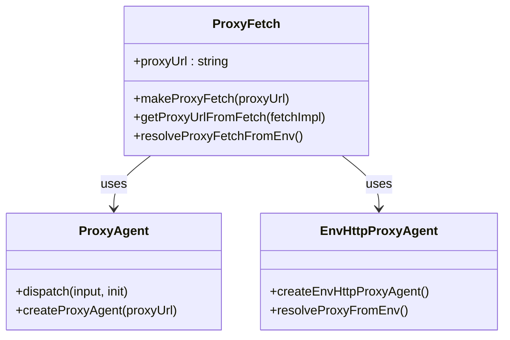

# 代理工具管理增强

<cite>
**本文档引用的文件**
- [README.md](file://README.md)
- [browser.ts](file://src/gateway/server-methods/browser.ts)
- [proxy-files.ts](file://src/browser/proxy-files.ts)
- [invoke-browser.ts](file://src/node-host/invoke-browser.ts)
- [MacNodeBrowserProxy.swift](file://apps/macos/Sources/OpenClaw/NodeMode/MacNodeBrowserProxy.swift)
- [proxy-fetch.ts](file://src/infra/net/proxy-fetch.ts)
- [auth.ts](file://src/gateway/auth.ts)
- [background.js](file://assets/chrome-extension/background.js)
- [configure.gateway-auth.ts](file://src/commands/configure.gateway-auth.ts)
- [browser-tool.ts](file://src/agents/tools/browser-tool.ts)
</cite>

## 目录
1. [简介](#简介)
2. [项目结构](#项目结构)
3. [核心组件](#核心组件)
4. [架构概览](#架构概览)
5. [详细组件分析](#详细组件分析)
6. [依赖关系分析](#依赖关系分析)
7. [性能考虑](#性能考虑)
8. [故障排除指南](#故障排除指南)
9. [结论](#结论)

## 简介

OpenClaw 是一个可在用户自己的设备上运行的个人AI助手。该项目的核心优势在于其强大的代理工具管理能力，特别是浏览器控制代理系统。本文档深入分析了代理工具管理的增强功能，包括浏览器代理、受信任代理认证、以及跨平台的代理工具实现。

该系统支持多种代理模式：本地直接访问、通过受信任代理转发、以及跨节点代理执行。这种设计确保了在不同部署环境下的灵活性和安全性。

## 项目结构

OpenClaw 采用模块化架构，代理工具管理分布在多个关键目录中：



**图表来源**
- [browser.ts:1-267](file://src/gateway/server-methods/browser.ts#L1-L267)
- [proxy-files.ts:1-41](file://src/browser/proxy-files.ts#L1-L41)
- [auth.ts:1-200](file://src/gateway/auth.ts#L1-L200)

**章节来源**
- [README.md:1-560](file://README.md#L1-L560)

## 核心组件

### 浏览器代理系统

浏览器代理系统是代理工具管理的核心组件，提供了统一的浏览器控制接口：



**图表来源**
- [browser.ts:42-140](file://src/gateway/server-methods/browser.ts#L42-L140)

### 受信任代理认证系统

受信任代理认证系统提供了基于反向代理的身份验证机制：



**图表来源**
- [auth.ts:331-372](file://src/gateway/auth.ts#L331-L372)

**章节来源**
- [browser.ts:1-267](file://src/gateway/server-methods/browser.ts#L1-L267)
- [proxy-files.ts:1-41](file://src/browser/proxy-files.ts#L1-L41)
- [auth.ts:1-200](file://src/gateway/auth.ts#L1-L200)

## 架构概览

OpenClaw 的代理工具管理架构采用了分层设计，确保了功能的模块化和可扩展性：



**图表来源**
- [browser.ts:142-267](file://src/gateway/server-methods/browser.ts#L142-L267)
- [auth.ts:58-77](file://src/gateway/auth.ts#L58-L77)

## 详细组件分析

### 浏览器代理处理流程

浏览器代理处理流程是整个代理系统的核心，负责协调不同节点间的浏览器操作：



**图表来源**
- [browser.ts:142-267](file://src/gateway/server-methods/browser.ts#L142-L267)
- [invoke-browser.ts:216-333](file://src/node-host/invoke-browser.ts#L216-L333)

### 受信任代理认证机制

受信任代理认证机制提供了企业级的安全访问控制：



**图表来源**
- [auth.ts:331-372](file://src/gateway/auth.ts#L331-L372)

**章节来源**
- [browser.ts:101-140](file://src/gateway/server-methods/browser.ts#L101-L140)
- [auth.ts:331-372](file://src/gateway/auth.ts#L331-L372)

### 跨平台代理实现

不同平台实现了统一的代理接口，确保一致的功能体验：

#### macOS 平台实现

macOS 平台提供了原生的浏览器代理支持：



**图表来源**
- [MacNodeBrowserProxy.swift:5-80](file://apps/macos/Sources/OpenClaw/NodeMode/MacNodeBrowserProxy.swift#L5-L80)

#### Chrome 扩展实现

Chrome 扩展提供了浏览器集成的代理功能：



**图表来源**
- [background.js:166-362](file://assets/chrome-extension/background.js#L166-L362)

**章节来源**
- [MacNodeBrowserProxy.swift:1-235](file://apps/macos/Sources/OpenClaw/NodeMode/MacNodeBrowserProxy.swift#L1-L235)
- [background.js:1-800](file://assets/chrome-extension/background.js#L1-L800)

### 网络代理工具

网络代理工具提供了灵活的HTTP代理支持：



**图表来源**
- [proxy-fetch.ts:1-76](file://src/infra/net/proxy-fetch.ts#L1-L76)

**章节来源**
- [proxy-fetch.ts:1-76](file://src/infra/net/proxy-fetch.ts#L1-L76)

## 依赖关系分析

代理工具管理系统的依赖关系展现了清晰的分层架构：

```mermaid
graph TD
subgraph "外部依赖"
A[Node.js HTTP服务器]
B[WebSocket协议]
C[Chrome调试协议(CDP)]
D[Tailscale网络]
end
subgraph "内部模块"
E[配置管理系统]
F[认证系统]
G[节点注册表]
H[媒体存储系统]
end
subgraph "代理模块"
I[浏览器代理]
J[受信任代理]
K[网络代理]
L[文件代理]
end
A --> I
B --> I
C --> I
D --> J
E --> F
F --> G
G --> I
H --> L
I --> L
J --> F
K --> F
```

**图表来源**
- [browser.ts:1-14](file://src/gateway/server-methods/browser.ts#L1-L14)
- [auth.ts:1-15](file://src/gateway/auth.ts#L1-L15)

**章节来源**
- [browser.ts:1-267](file://src/gateway/server-methods/browser.ts#L1-L267)
- [auth.ts:1-200](file://src/gateway/auth.ts#L1-L200)

## 性能考虑

代理工具管理在设计时充分考虑了性能优化：

### 缓存策略
- **浏览器代理文件缓存**: 使用媒体存储系统缓存代理文件，避免重复传输
- **节点连接复用**: 通过WebSocket保持长连接，减少连接建立开销
- **请求结果缓存**: 对于重复的浏览器操作结果进行缓存

### 内存管理
- **文件大小限制**: 代理文件最大10MB，防止内存溢出
- **异步文件处理**: 使用Promise.all并行处理多个文件
- **及时清理**: 操作完成后及时释放临时文件

### 网络优化
- **代理链路优化**: 支持多级代理转发，提高网络效率
- **超时控制**: 合理设置请求超时时间，避免长时间阻塞
- **重试机制**: 实现指数退避重试，提高成功率

## 故障排除指南

### 常见问题及解决方案

#### 浏览器代理连接失败
1. **检查浏览器控制服务状态**
   - 确认浏览器控制服务已启动
   - 验证浏览器版本兼容性

2. **验证节点权限**
   - 检查节点是否具备浏览器控制权限
   - 确认节点命令白名单配置

#### 受信任代理认证失败
1. **验证代理配置**
   - 检查 `trustedProxies` 列表是否包含代理IP
   - 确认必需头部是否正确设置

2. **检查用户身份提取**
   - 验证 `userHeader` 配置
   - 确认用户白名单设置

#### 文件代理问题
1. **检查文件大小限制**
   - 确认代理文件不超过10MB限制
   - 验证文件路径有效性

2. **验证文件权限**
   - 检查文件读取权限
   - 确认媒体存储空间充足

**章节来源**
- [browser.ts:171-231](file://src/gateway/server-methods/browser.ts#L171-L231)
- [auth.ts:331-372](file://src/gateway/auth.ts#L331-L372)
- [proxy-files.ts:102-115](file://src/browser/proxy-files.ts#L102-L115)

## 结论

OpenClaw 的代理工具管理增强功能展现了现代代理系统的设计理念。通过模块化的架构设计、多层次的安全保障、以及跨平台的统一实现，该系统为用户提供了强大而灵活的代理工具管理能力。

主要优势包括：
- **灵活性**: 支持多种代理模式，适应不同的部署需求
- **安全性**: 多层认证机制，确保访问安全
- **可扩展性**: 模块化设计便于功能扩展
- **易用性**: 统一的API接口，简化开发复杂度

未来的发展方向可以包括：
- 增强代理监控和日志功能
- 优化大规模代理场景的性能
- 扩展更多平台的原生代理支持
- 加强代理配置的自动化管理

这些增强功能为OpenClaw构建了一个强大而可靠的代理工具管理体系，为用户提供了一流的代理工具管理体验。