# 代理管理系统

<cite>
**本文档引用的文件**
- [README.md](file://README.md)
- [package.json](file://package.json)
- [src/index.ts](file://src/index.ts)
- [src/runtime.ts](file://src/runtime.ts)
- [src/gateway/server.ts](file://src/gateway/server.ts)
- [src/cli/program.ts](file://src/cli/program.ts)
- [src/config/config.ts](file://src/config/config.ts)
- [ui-react/src/components/agents/detail-drawer.tsx](file://ui-react/src/components/agents/detail-drawer.tsx)
- [ui-react/src/components/agents/profile.tsx](file://ui-react/src/components/agents/profile.tsx)
- [ui-react/src/components/agents/soul.tsx](file://ui-react/src/components/agents/soul.tsx)
- [ui-react/src/components/agents/skills.tsx](file://ui-react/src/components/agents/skills.tsx)
- [ui-react/src/components/agents/tools.tsx](file://ui-react/src/components/agents/tools.tsx)
- [ui-react/src/components/agents/shared.tsx](file://ui-react/src/components/agents/shared.tsx)
- [ui-react/src/pages/AgentsPage.tsx](file://ui-react/src/pages/AgentsPage.tsx)
- [ui-react/src/store/agents.store.ts](file://ui-react/src/store/agents.store.ts)
- [ui-react/src/components/agents/card.tsx](file://ui-react/src/components/agents/card.tsx)
</cite>

## 更新摘要
**所做更改**
- 新增代理卡显示系统增强章节，详细介绍视频播放功能和hover触发效果
- 更新视频展示支持章节，说明动态视频展示和自动播放机制
- 新增代理卡组件的视频播放功能，支持hover触发播放和自动播放
- 更新代理卡片布局，支持视频和头像的协调显示
- 新增视频自动播放和暂停控制机制

## 目录
1. [简介](#简介)
2. [项目结构](#项目结构)
3. [核心组件](#核心组件)
4. [架构概览](#架构概览)
5. [详细组件分析](#详细组件分析)
6. [What I Do简介功能](#what-i-do简介功能)
7. [技能锁定系统](#技能锁定系统)
8. [Soul编辑器重构](#soul编辑器重构)
9. [AgentDetailDrawer重新设计](#agentdetaildrawer重新设计)
10. [代理卡显示系统增强](#代理卡显示系统增强)
11. [视频展示支持](#视频展示支持)
12. [工具配置对话框优化](#工具配置对话框优化)
13. [依赖关系分析](#依赖关系分析)
14. [性能考虑](#性能考虑)
15. [故障排除指南](#故障排除指南)
16. [结论](#结论)

## 简介

OpenClaw 是一个个人AI助手系统，可在用户的设备上运行。它支持多种消息渠道（WhatsApp、Telegram、Slack、Discord、Google Chat、Signal、iMessage、BlueBubbles、IRC、Microsoft Teams、Matrix、Feishu、LINE、Mattermost、Nextcloud Talk、Nostr、Synology Chat、Tlon、Twitch、Zalo、Zalo Personal、WebChat），能够在macOS/iOS/Android上进行语音和监听，并渲染用户可控制的实时画布。

该系统的核心是一个网关WebSocket网络，作为会话、通道、工具和事件的单一控制平面。网关通过本地优先的方式工作，提供快速且始终在线的个人体验。

**最新更新**：系统现已增强代理身份管理功能，支持视频展示、抽屉式界面设计、技能锁定保护、Soul编辑器重构和代理卡显示系统增强，提供更丰富的代理个性化体验。

## 项目结构

OpenClaw项目采用模块化架构设计，主要包含以下核心模块：

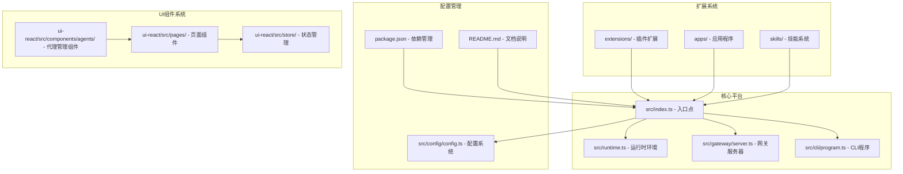
```mermaid
graph TB
subgraph "核心平台"
A[src/index.ts - 入口点]
B[src/runtime.ts - 运行时环境]
C[src/gateway/server.ts - 网关服务器]
D[src/cli/program.ts - CLI程序]
end
subgraph "配置管理"
E[src/config/config.ts - 配置系统]
F[package.json - 依赖管理]
G[README.md - 文档说明]
end
subgraph "扩展系统"
H[extensions/ - 插件扩展]
I[apps/ - 应用程序]
J[skills/ - 技能系统]
end
subgraph "UI组件系统"
K[ui-react/src/components/agents/ - 代理管理组件]
L[ui-react/src/pages/ - 页面组件]
M[ui-react/src/store/ - 状态管理]
end
A --> B
A --> C
A --> D
A --> E
F --> A
G --> A
H --> A
I --> A
J --> A
K --> L
L --> M
```

**图表来源**
- [src/index.ts:1-94](file://src/index.ts#L1-L94)
- [src/runtime.ts:1-54](file://src/runtime.ts#L1-L54)
- [src/gateway/server.ts:1-4](file://src/gateway/server.ts#L1-L4)
- [src/cli/program.ts:1-3](file://src/cli/program.ts#L1-L3)
- [src/config/config.ts:1-29](file://src/config/config.ts#L1-L29)

**章节来源**
- [README.md:185-240](file://README.md#L185-L240)
- [package.json:1-474](file://package.json#L1-L474)

## 核心组件

### 系统入口点
系统的主要入口点是`src/index.ts`，它负责：
- 加载环境变量和配置
- 初始化运行时环境
- 构建并执行CLI程序
- 设置全局错误处理机制

### 运行时环境
`src/runtime.ts`定义了统一的运行时环境接口，提供：
- 结构化日志记录功能
- 错误处理机制
- 终端状态管理
- 测试环境兼容性

### 网关服务器
`src/gateway/server.ts`提供了网关服务器的核心功能：
- WebSocket连接管理
- 会话生命周期控制
- 通道路由机制
- 安全认证策略

### CLI程序
`src/cli/program.ts`构建了完整的命令行界面：
- 子命令解析和执行
- 端口管理和冲突检测
- 配置文件操作
- 系统健康检查

**章节来源**
- [src/index.ts:1-94](file://src/index.ts#L1-L94)
- [src/runtime.ts:1-54](file://src/runtime.ts#L1-L54)
- [src/gateway/server.ts:1-4](file://src/gateway/server.ts#L1-L4)
- [src/cli/program.ts:1-3](file://src/cli/program.ts#L1-L3)

## 架构概览

OpenClaw采用分层架构设计，实现了高度模块化的系统结构：

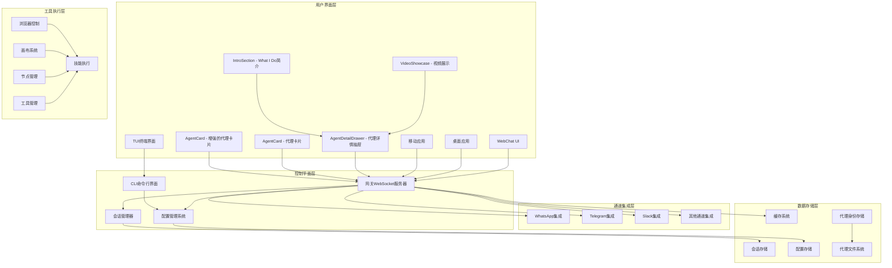
```mermaid
graph TB
subgraph "用户界面层"
A[WebChat UI]
B[桌面应用]
C[移动应用]
D[TUI终端界面]
E[AgentDetailDrawer - 代理详情抽屉]
F[AgentCard - 代理卡片]
G[VideoShowcase - 视频展示]
H[IntroSection - What I Do简介]
I[AgentCard - 增强的代理卡片]
end
subgraph "控制平面层"
J[网关WebSocket服务器]
K[CLI命令行界面]
L[配置管理系统]
M[会话管理器]
end
subgraph "通道集成层"
N[WhatsApp集成]
O[Telegram集成]
P[Slack集成]
Q[其他通道集成]
end
subgraph "工具执行层"
R[浏览器控制]
S[画布系统]
T[节点管理]
U[技能执行]
V[工具管理]
end
subgraph "数据存储层"
W[会话存储]
X[配置存储]
Y[缓存系统]
Z[代理身份存储]
AA[代理文件系统]
end
A --> J
B --> J
C --> J
D --> K
E --> J
F --> J
G --> E
H --> E
I --> J
J --> M
J --> L
J --> N
J --> O
J --> P
J --> Q
K --> L
M --> W
L --> X
J --> Y
R --> U
S --> U
T --> U
V --> U
Z --> AA
```

**图表来源**
- [README.md:140-180](file://README.md#L140-L180)
- [README.md:204-240](file://README.md#L204-L240)

系统的核心特点包括：
- **单WS控制平面**：所有客户端、工具和事件通过单一WebSocket连接
- **多通道支持**：支持30+种消息渠道的集成
- **本地优先**：默认在本地运行，确保响应速度和隐私安全
- **可扩展性**：通过插件系统支持自定义扩展和技能
- **增强的身份管理**：支持视频展示、技能锁定、Soul编辑器重构和代理卡显示系统增强

## 详细组件分析

### 网关服务器架构

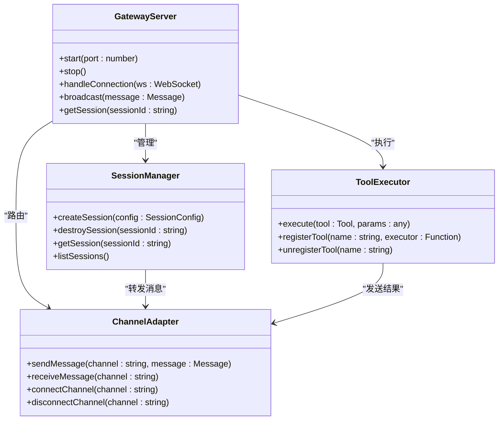
```mermaid
classDiagram
class GatewayServer {
+start(port : number)
+stop()
+handleConnection(ws : WebSocket)
+broadcast(message : Message)
+getSession(sessionId : string)
}
class SessionManager {
+createSession(config : SessionConfig)
+destroySession(sessionId : string)
+getSession(sessionId : string)
+listSessions()
}
class ChannelAdapter {
+sendMessage(channel : string, message : Message)
+receiveMessage(channel : string)
+connectChannel(channel : string)
+disconnectChannel(channel : string)
}
class ToolExecutor {
+execute(tool : Tool, params : any)
+registerTool(name : string, executor : Function)
+unregisterTool(name : string)
}
GatewayServer --> SessionManager : "管理"
GatewayServer --> ChannelAdapter : "路由"
GatewayServer --> ToolExecutor : "执行"
SessionManager --> ChannelAdapter : "转发消息"
ToolExecutor --> ChannelAdapter : "发送结果"
```

**图表来源**
- [src/gateway/server.ts:1-4](file://src/gateway/server.ts#L1-L4)

### 配置管理系统

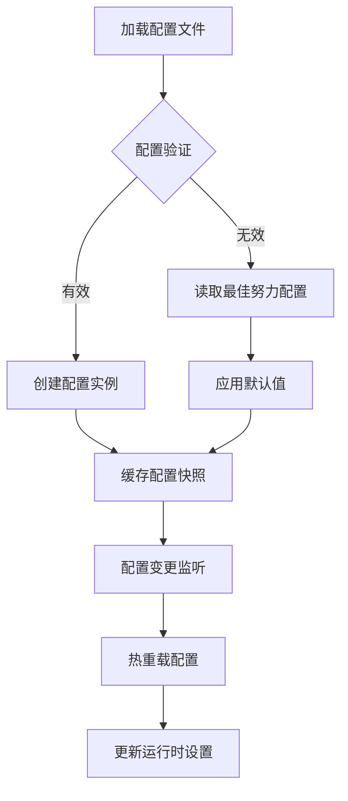
```mermaid
flowchart TD
A[加载配置文件] --> B{配置验证}
B --> |有效| C[创建配置实例]
B --> |无效| D[读取最佳努力配置]
D --> E[应用默认值]
C --> F[缓存配置快照]
E --> F
F --> G[配置变更监听]
G --> H[热重载配置]
H --> I[更新运行时设置]
```

**图表来源**
- [src/config/config.ts:1-29](file://src/config/config.ts#L1-L29)

### CLI命令处理流程

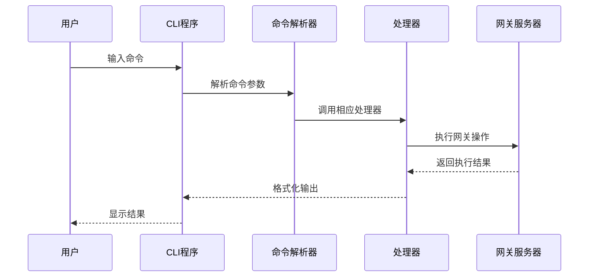
```mermaid
sequenceDiagram
participant User as 用户
participant CLI as CLI程序
participant Parser as 命令解析器
participant Handler as 处理器
participant Gateway as 网关服务器
User->>CLI : 输入命令
CLI->>Parser : 解析命令参数
Parser->>Handler : 调用相应处理器
Handler->>Gateway : 执行网关操作
Gateway-->>Handler : 返回执行结果
Handler-->>CLI : 格式化输出
CLI-->>User : 显示结果
```

**图表来源**
- [src/cli/program.ts:1-3](file://src/cli/program.ts#L1-L3)
- [src/index.ts:79-93](file://src/index.ts#L79-L93)

**章节来源**
- [src/gateway/server.ts:1-4](file://src/gateway/server.ts#L1-L4)
- [src/config/config.ts:1-29](file://src/config/config.ts#L1-L29)
- [src/cli/program.ts:1-3](file://src/cli/program.ts#L1-L3)

## What I Do简介功能

### 专业摘要组件

OpenClaw引入了全新的`IntroSection`组件，为每个代理提供专业的服务描述和使用提示：

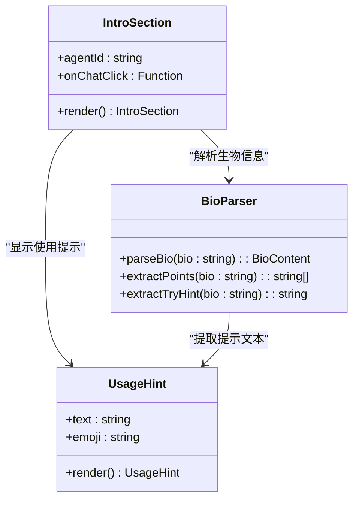
```mermaid
classDiagram
class IntroSection {
+agentId : string
+onChatClick : Function
+render() IntroSection
}
class BioParser {
+parseBio(bio : string) : BioContent
+extractPoints(bio : string) : string[]
+extractTryHint(bio : string) : string
}
class UsageHint {
+text : string
+emoji : string
+render() UsageHint
}
IntroSection --> BioParser : "解析生物信息"
IntroSection --> UsageHint : "显示使用提示"
BioParser --> UsageHint : "提取提示文本"
```

**图表来源**
- [ui-react/src/components/agents/profile.tsx:380-482](file://ui-react/src/components/agents/profile.tsx#L380-L482)

### 生物信息解析逻辑

系统能够智能解析代理的生物信息，提取关键的服务要点和使用示例：

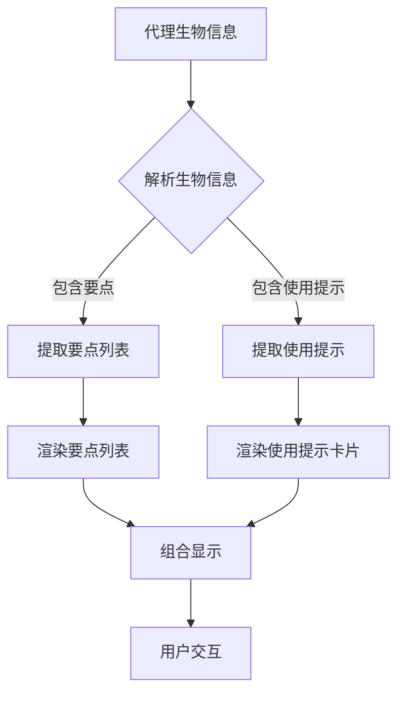
```mermaid
flowchart TD
A[代理生物信息] --> B{解析生物信息}
B --> |包含要点| C[提取要点列表]
B --> |包含使用提示| D[提取使用提示]
C --> E[渲染要点列表]
D --> F[渲染使用提示卡片]
E --> G[组合显示]
F --> G
G --> H[用户交互]
```

**图表来源**
- [ui-react/src/components/agents/profile.tsx:397-481](file://ui-react/src/components/agents/profile.tsx#L397-L481)

### 使用提示系统

增强的使用提示功能允许用户直接点击尝试代理的功能：

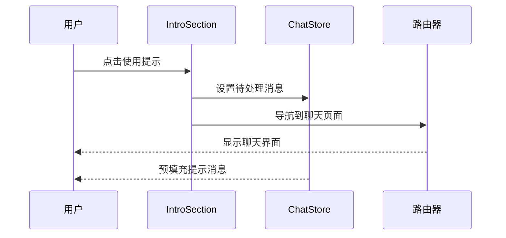
```mermaid
sequenceDiagram
participant User as 用户
participant IntroSection as IntroSection
participant ChatStore as ChatStore
participant Router as 路由器
User->>IntroSection : 点击使用提示
IntroSection->>ChatStore : 设置待处理消息
IntroSection->>Router : 导航到聊天页面
Router-->>User : 显示聊天界面
ChatStore-->>User : 预填充提示消息
```

**图表来源**
- [ui-react/src/components/agents/profile.tsx:407-439](file://ui-react/src/components/agents/profile.tsx#L407-L439)

**章节来源**
- [ui-react/src/components/agents/profile.tsx:380-482](file://ui-react/src/components/agents/profile.tsx#L380-L482)

## 技能锁定系统

### 内置代理保护机制

系统实现了技能锁定机制，保护内置代理不被意外修改：

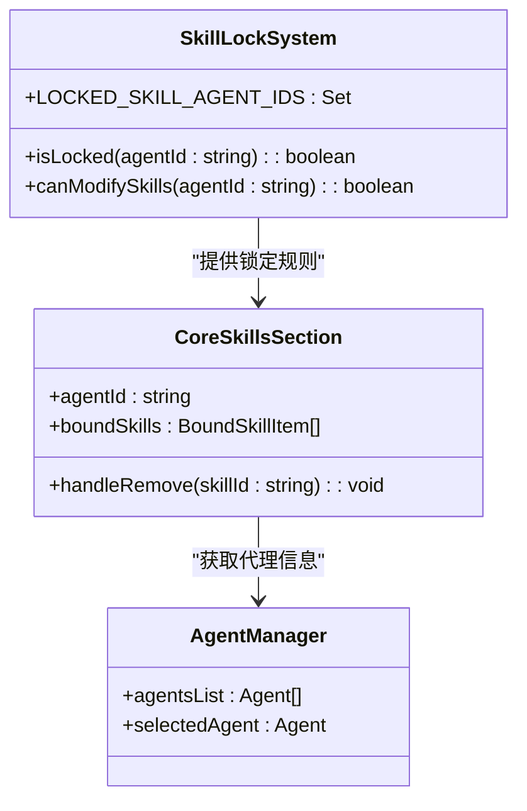
```mermaid
classDiagram
class SkillLockSystem {
+LOCKED_SKILL_AGENT_IDS : Set
+isLocked(agentId : string) : boolean
+canModifySkills(agentId : string) : boolean
}
class CoreSkillsSection {
+agentId : string
+boundSkills : BoundSkillItem[]
+handleRemove(skillId : string) : void
}
class AgentManager {
+agentsList : Agent[]
+selectedAgent : Agent
}
SkillLockSystem --> CoreSkillsSection : "提供锁定规则"
CoreSkillsSection --> AgentManager : "获取代理信息"
```

**图表来源**
- [ui-react/src/components/agents/skills.tsx:173-174](file://ui-react/src/components/agents/skills.tsx#L173-L174)
- [ui-react/src/components/agents/skills.tsx:301-312](file://ui-react/src/components/agents/skills.tsx#L301-L312)

### 技能绑定管理

系统支持两种技能管理模式：显式允许列表和自动激活模式：

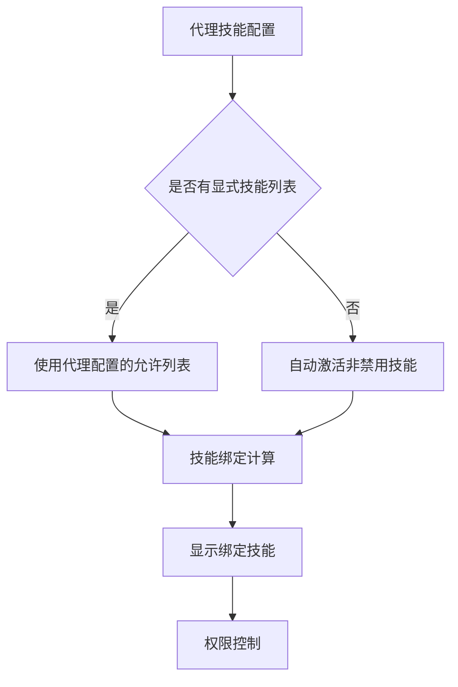
```mermaid
flowchart TD
A[代理技能配置] --> B{是否有显式技能列表}
B --> |是| C[使用代理配置的允许列表]
B --> |否| D[自动激活非禁用技能]
C --> E[技能绑定计算]
D --> E
E --> F[显示绑定技能]
F --> G[权限控制]
```

**图表来源**
- [ui-react/src/components/agents/skills.tsx:201-214](file://ui-react/src/components/agents/skills.tsx#L201-L214)

### 技能权限控制

系统提供细粒度的技能权限控制，支持添加、移除和批量管理：

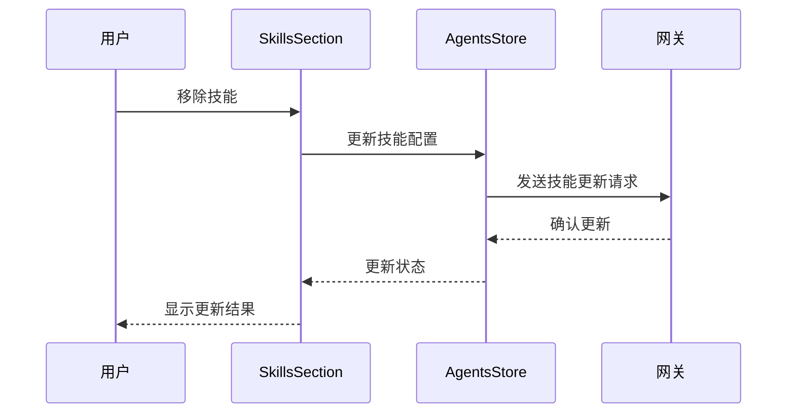
```mermaid
sequenceDiagram
participant User as 用户
participant SkillsSection as SkillsSection
participant Store as AgentsStore
participant Gateway as 网关
User->>SkillsSection : 移除技能
SkillsSection->>Store : 更新技能配置
Store->>Gateway : 发送技能更新请求
Gateway-->>Store : 确认更新
Store-->>SkillsSection : 更新状态
SkillsSection-->>User : 显示更新结果
```

**图表来源**
- [ui-react/src/components/agents/skills.tsx:250-256](file://ui-react/src/components/agents/skills.tsx#L250-L256)

**章节来源**
- [ui-react/src/components/agents/skills.tsx:173-174](file://ui-react/src/components/agents/skills.tsx#L173-L174)
- [ui-react/src/components/agents/skills.tsx:201-214](file://ui-react/src/components/agents/skills.tsx#L201-L214)
- [ui-react/src/components/agents/skills.tsx:250-256](file://ui-react/src/components/agents/skills.tsx#L250-L256)

## Soul编辑器重构

### Markdown编辑器增强

Soul编辑器经过全面重构，提供现代化的Markdown编辑体验：

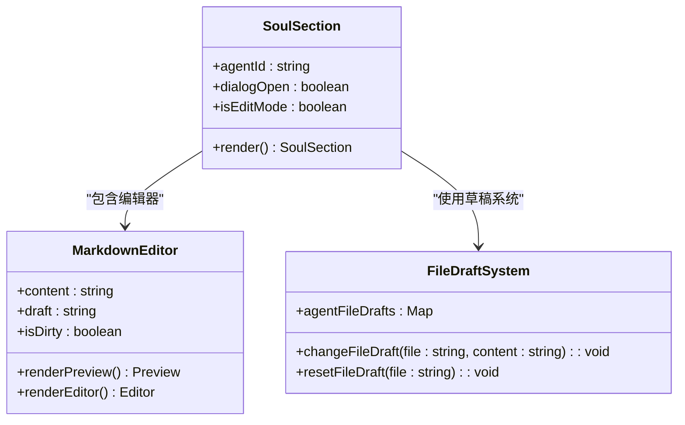
```mermaid
classDiagram
class SoulSection {
+agentId : string
+dialogOpen : boolean
+isEditMode : boolean
+render() SoulSection
}
class MarkdownEditor {
+content : string
+draft : string
+isDirty : boolean
+renderPreview() Preview
+renderEditor() Editor
}
class FileDraftSystem {
+agentFileDrafts : Map
+changeFileDraft(file : string, content : string) : void
+resetFileDraft(file : string) : void
}
SoulSection --> MarkdownEditor : "包含编辑器"
SoulSection --> FileDraftSystem : "使用草稿系统"
```

**图表来源**
- [ui-react/src/components/agents/soul.tsx:15-45](file://ui-react/src/components/agents/soul.tsx#L15-L45)

### 编辑模式切换

系统支持预览和编辑两种模式，提供流畅的用户体验：

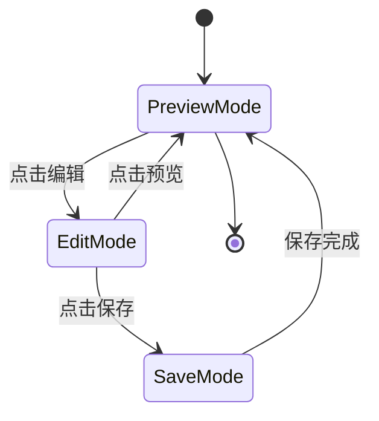
```mermaid
stateDiagram-v2
[*] --> PreviewMode
PreviewMode --> EditMode : 点击编辑
EditMode --> PreviewMode : 点击预览
EditMode --> SaveMode : 点击保存
SaveMode --> PreviewMode : 保存完成
PreviewMode --> [*]
```

**图表来源**
- [ui-react/src/components/agents/soul.tsx:89-132](file://ui-react/src/components/agents/soul.tsx#L89-L132)

### 草稿管理系统

增强的草稿系统支持撤销、预览和实时保存功能：

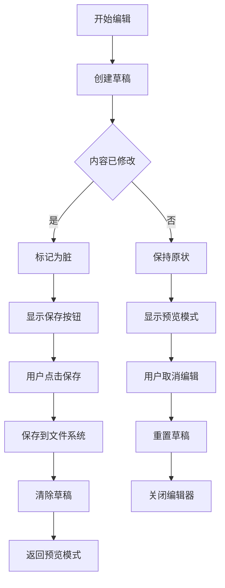
```mermaid
flowchart TD
A[开始编辑] --> B[创建草稿]
B --> C{内容已修改}
C --> |是| D[标记为脏]
C --> |否| E[保持原状]
D --> F[显示保存按钮]
E --> G[显示预览模式]
F --> H[用户点击保存]
H --> I[保存到文件系统]
I --> J[清除草稿]
J --> K[返回预览模式]
G --> L[用户取消编辑]
L --> M[重置草稿]
M --> N[关闭编辑器]
```

**图表来源**
- [ui-react/src/components/agents/soul.tsx:100-130](file://ui-react/src/components/agents/soul.tsx#L100-L130)

**章节来源**
- [ui-react/src/components/agents/soul.tsx:15-45](file://ui-react/src/components/agents/soul.tsx#L15-L45)
- [ui-react/src/components/agents/soul.tsx:89-132](file://ui-react/src/components/agents/soul.tsx#L89-L132)
- [ui-react/src/components/agents/soul.tsx:100-130](file://ui-react/src/components/agents/soul.tsx#L100-L130)

## AgentDetailDrawer重新设计

### 抽屉式界面架构

AgentDetailDrawer经过重新设计，提供更优雅的代理管理体验：

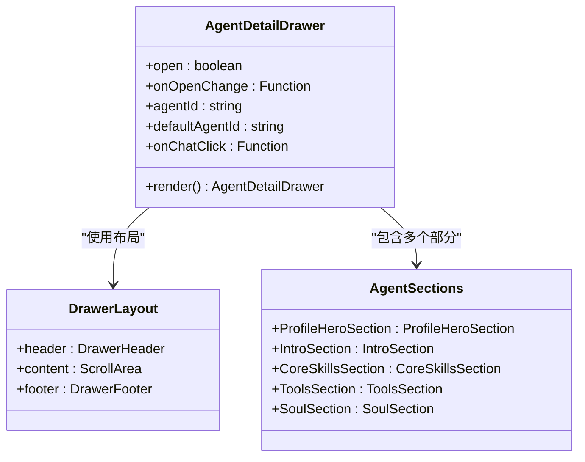
```mermaid
classDiagram
class AgentDetailDrawer {
+open : boolean
+onOpenChange : Function
+agentId : string
+defaultAgentId : string
+onChatClick : Function
+render() AgentDetailDrawer
}
class DrawerLayout {
+header : DrawerHeader
+content : ScrollArea
+footer : DrawerFooter
}
class AgentSections {
+ProfileHeroSection : ProfileHeroSection
+IntroSection : IntroSection
+CoreSkillsSection : CoreSkillsSection
+ToolsSection : ToolsSection
+SoulSection : SoulSection
}
AgentDetailDrawer --> DrawerLayout : "使用布局"
AgentDetailDrawer --> AgentSections : "包含多个部分"
```

**图表来源**
- [ui-react/src/components/agents/detail-drawer.tsx:28-45](file://ui-react/src/components/agents/detail-drawer.tsx#L28-L45)

### 响应式布局设计

新的抽屉式设计支持响应式布局，适配不同屏幕尺寸：

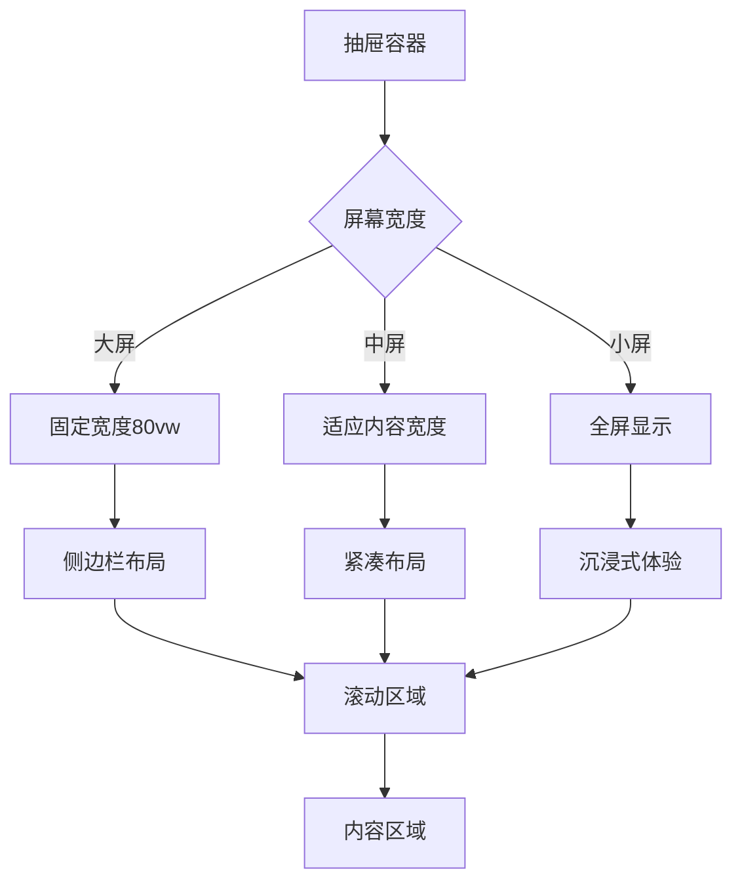
```mermaid
flowchart TD
A[抽屉容器] --> B{屏幕宽度}
B --> |大屏| C[固定宽度80vw]
B --> |中屏| D[适应内容宽度]
B --> |小屏| E[全屏显示]
C --> F[侧边栏布局]
D --> G[紧凑布局]
E --> H[沉浸式体验]
F --> I[滚动区域]
G --> I
H --> I
I --> J[内容区域]
```

**图表来源**
- [ui-react/src/components/agents/detail-drawer.tsx:112-147](file://ui-react/src/components/agents/detail-drawer.tsx#L112-L147)

### 删除确认机制

系统提供安全的代理删除确认机制：

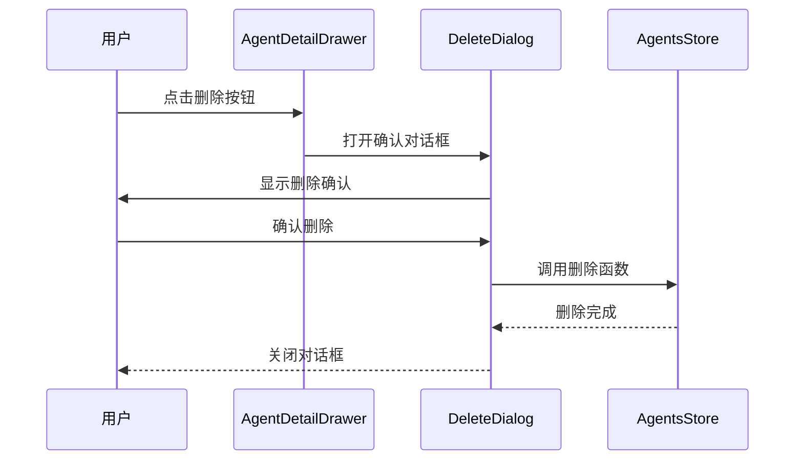
```mermaid
sequenceDiagram
participant User as 用户
participant Drawer as AgentDetailDrawer
participant DeleteDialog as DeleteDialog
participant Store as AgentsStore
User->>Drawer : 点击删除按钮
Drawer->>DeleteDialog : 打开确认对话框
DeleteDialog->>User : 显示删除确认
User->>DeleteDialog : 确认删除
DeleteDialog->>Store : 调用删除函数
Store-->>DeleteDialog : 删除完成
DeleteDialog-->>User : 关闭对话框
```

**图表来源**
- [ui-react/src/components/agents/detail-drawer.tsx:63-103](file://ui-react/src/components/agents/detail-drawer.tsx#L63-L103)

**章节来源**
- [ui-react/src/components/agents/detail-drawer.tsx:28-45](file://ui-react/src/components/agents/detail-drawer.tsx#L28-L45)
- [ui-react/src/components/agents/detail-drawer.tsx:112-147](file://ui-react/src/components/agents/detail-drawer.tsx#L112-L147)
- [ui-react/src/components/agents/detail-drawer.tsx:63-103](file://ui-react/src/components/agents/detail-drawer.tsx#L63-L103)

## 代理卡显示系统增强

### 增强的代理卡片组件

系统新增了增强的代理卡片组件，支持视频播放和hover触发效果：

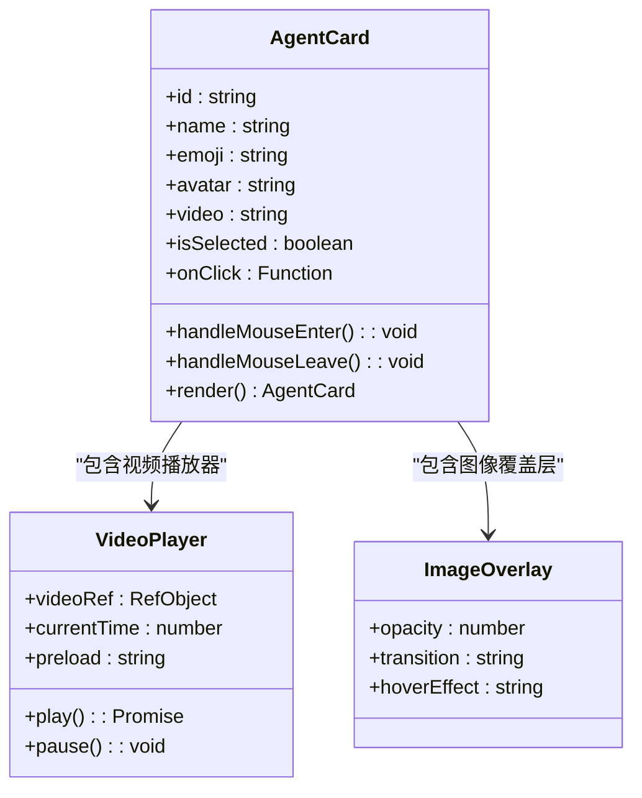
```mermaid
classDiagram
class AgentCard {
+id : string
+name : string
+emoji : string
+avatar : string
+video : string
+isSelected : boolean
+onClick : Function
+handleMouseEnter() : void
+handleMouseLeave() : void
+render() AgentCard
}
class VideoPlayer {
+videoRef : RefObject
+currentTime : number
+play() : Promise<void>
+pause() : void
+preload : string
}
class ImageOverlay {
+opacity : number
+transition : string
+hoverEffect : string
}
AgentCard --> VideoPlayer : "包含视频播放器"
AgentCard --> ImageOverlay : "包含图像覆盖层"
```

**图表来源**
- [ui-react/src/components/agents/card.tsx:14-36](file://ui-react/src/components/agents/card.tsx#L14-L36)

### 视频播放控制机制

代理卡片实现了智能的视频播放控制，支持hover触发和自动播放：

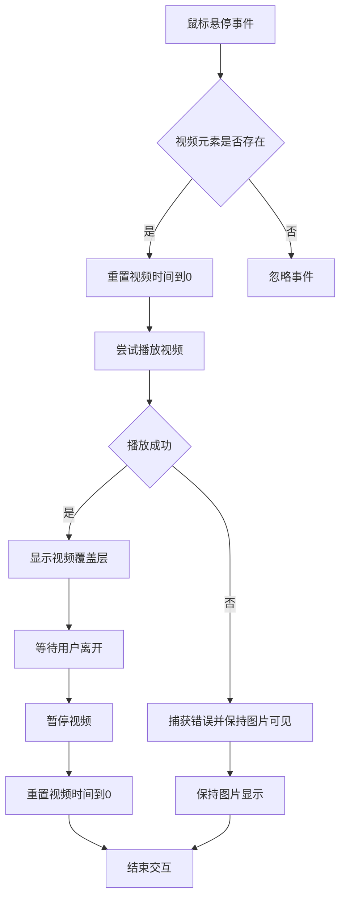
```mermaid
flowchart TD
A[鼠标悬停事件] --> B{视频元素是否存在}
B --> |是| C[重置视频时间到0]
B --> |否| D[忽略事件]
C --> E[尝试播放视频]
E --> F{播放成功}
F --> |是| G[显示视频覆盖层]
F --> |否| H[捕获错误并保持图片可见]
G --> I[等待用户离开]
I --> J[暂停视频]
J --> K[重置视频时间到0]
H --> L[保持图片显示]
K --> M[结束交互]
L --> M
```

**图表来源**
- [ui-react/src/components/agents/card.tsx:24-36](file://ui-react/src/components/agents/card.tsx#L24-L36)

### 图像与视频的协调显示

系统实现了图像和视频的智能协调显示机制：

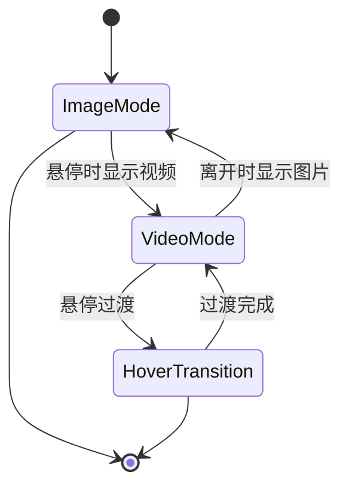
```mermaid
stateDiagram-v2
[*] --> ImageMode
ImageMode --> VideoMode : 悬停时显示视频
VideoMode --> ImageMode : 离开时显示图片
VideoMode --> HoverTransition : 悬停过渡
HoverTransition --> VideoMode : 过渡完成
ImageMode --> [*]
HoverTransition --> [*]
```

**图表来源**
- [ui-react/src/components/agents/card.tsx:59-79](file://ui-react/src/components/agents/card.tsx#L59-L79)

**章节来源**
- [ui-react/src/components/agents/card.tsx:14-36](file://ui-react/src/components/agents/card.tsx#L14-L36)
- [ui-react/src/components/agents/card.tsx:24-36](file://ui-react/src/components/agents/card.tsx#L24-L36)
- [ui-react/src/components/agents/card.tsx:59-79](file://ui-react/src/components/agents/card.tsx#L59-L79)

## 视频展示支持

### 动态头像系统

系统支持代理头像的多媒体展示，包括静态图片和动态视频：

```mermaid
classDiagram
class VideoShowcase {
+videoUrl : string
+videoRef : RefObject
+render() VideoShowcase
}
class IdentityParser {
+parseIdentityMarkdown(content : string) : ParsedIdentity
+extractVideo(identity : ParsedIdentity) : string
}
class ProfileHeroSection {
+identity : ParsedIdentity
+video : string
+render() ProfileHeroSection
}
VideoShowcase --> IdentityParser : "接收视频URL"
ProfileHeroSection --> VideoShowcase : "条件渲染"
```

**图表来源**
- [ui-react/src/components/agents/profile.tsx:112-136](file://ui-react/src/components/agents/profile.tsx#L112-L136)
- [ui-react/src/components/agents/profile.tsx:165-178](file://ui-react/src/components/agents/profile.tsx#L165-L178)

### 视频自动播放机制

视频展示组件实现自动播放和无控制条设计：

```mermaid
flowchart TD
A[组件挂载] --> B{存在视频URL}
B --> |是| C[创建视频元素]
B --> |否| D[渲染静态头像]
C --> E[设置自动播放]
E --> F[设置内联播放]
F --> G[设置静音]
G --> H[预加载视频]
H --> I[渲染视频容器]
D --> J[渲染头像占位符]
I --> K[显示视频展示]
J --> L[显示头像]
K --> M[用户交互]
L --> M
```

**图表来源**
- [ui-react/src/components/agents/profile.tsx:116-135](file://ui-react/src/components/agents/profile.tsx#L116-L135)

### 头像与视频的协调布局

系统智能协调头像和视频展示的布局：

```mermaid
stateDiagram-v2
[*] --> VideoMode
VideoMode --> AvatarMode : 无视频URL
AvatarMode --> VideoMode : 有视频URL
VideoMode --> [*]
AvatarMode --> [*]
```

**图表来源**
- [ui-react/src/components/agents/profile.tsx:247-251](file://ui-react/src/components/agents/profile.tsx#L247-L251)

**章节来源**
- [ui-react/src/components/agents/profile.tsx:112-136](file://ui-react/src/components/agents/profile.tsx#L112-L136)
- [ui-react/src/components/agents/profile.tsx:165-178](file://ui-react/src/components/agents/profile.tsx#L165-L178)
- [ui-react/src/components/agents/profile.tsx:247-251](file://ui-react/src/components/agents/profile.tsx#L247-L251)

## 工具配置对话框优化

### 工具权限管理

工具配置对话框经过优化，提供更直观的权限管理界面：

```mermaid
classDiagram
class ToolsDialog {
+open : boolean
+agentId : string
+draftProfile : ToolProfileId
+draftAlsoAllow : string[]
+draftDeny : string[]
+render() ToolsDialog
}
class ToolPolicySystem {
+resolveBasePolicy(profile : string) : ToolPolicy
+isAllowedByPolicy(toolId : string, policy : ToolPolicy) : boolean
+normalizeTool(name : string) : string
}
class ProfileSelector {
+profiles : ToolProfileId[]
+currentProfile : ToolProfileId
+render() ProfileSelector
}
ToolsDialog --> ToolPolicySystem : "使用策略系统"
ToolsDialog --> ProfileSelector : "包含配置器"
```

**图表来源**
- [ui-react/src/components/agents/tools.tsx:121-143](file://ui-react/src/components/agents/tools.tsx#L121-L143)

### 配置文件覆盖警告

系统提供智能的配置文件覆盖警告机制：

```mermaid
flowchart TD
A[打开配置对话框] --> B{检测到自定义覆盖}
B --> |是| C[显示覆盖警告]
B --> |否| D[直接应用配置]
C --> E[确认覆盖操作]
E --> F[应用新配置]
D --> G[保存配置]
F --> H[配置更新完成]
G --> H
```

**图表来源**
- [ui-react/src/components/agents/tools.tsx:121-164](file://ui-react/src/components/agents/tools.tsx#L121-L164)

### 工具权限可视化

系统提供工具权限的可视化展示：

```mermaid
sequenceDiagram
participant User as 用户
participant ToolsDialog as ToolsDialog
participant PolicySystem as PolicySystem
participant Catalog as ToolsCatalog
User->>ToolsDialog : 切换工具开关
ToolsDialog->>PolicySystem : 计算工具权限
PolicySystem->>Catalog : 获取工具信息
Catalog-->>PolicySystem : 返回工具详情
PolicySystem-->>ToolsDialog : 返回权限状态
ToolsDialog-->>User : 更新工具显示
```

**图表来源**
- [ui-react/src/components/agents/tools.tsx:273-298](file://ui-react/src/components/agents/tools.tsx#L273-L298)

**章节来源**
- [ui-react/src/components/agents/tools.tsx:121-143](file://ui-react/src/components/agents/tools.tsx#L121-L143)
- [ui-react/src/components/agents/tools.tsx:121-164](file://ui-react/src/components/agents/tools.tsx#L121-L164)
- [ui-react/src/components/agents/tools.tsx:273-298](file://ui-react/src/components/agents/tools.tsx#L273-L298)

## 依赖关系分析

### 核心依赖架构

```mermaid
graph TB
subgraph "运行时依赖"
A[node >= 22.12.0]
B[@mariozechner/pi-agent-core]
C[@mariozechner/pi-ai]
D[@mariozechner/pi-tui]
end
subgraph "通信协议"
E[@agentclientprotocol/sdk]
F[ws]
G[hono]
H[express]
end
subgraph "消息渠道"
I[@whiskeysockets/baileys]
J[@grammyjs/transformer-throttler]
K[@slack/bolt]
L[discord-api-types]
end
subgraph "工具库"
M[@napi-rs/canvas]
N[node-llama-cpp]
O[sharp]
P[sqlite-vec]
end
subgraph "UI框架"
Q[react]
R[zustand]
S[lucide-react]
T[shadcn/ui]
end
A --> B
A --> C
A --> D
E --> F
F --> G
G --> H
I --> J
K --> L
M --> N
O --> P
Q --> R
S --> T
```

**图表来源**
- [package.json:344-402](file://package.json#L344-L402)
- [package.json:425-428](file://package.json#L425-L428)

### 模块间依赖关系

```mermaid
graph LR
subgraph "核心模块"
A[src/index.ts]
B[src/runtime.ts]
C[src/gateway/server.ts]
D[src/cli/program.ts]
end
subgraph "配置模块"
E[src/config/config.ts]
F[src/config/io.js]
G[src/config/validation.js]
end
subgraph "通道模块"
H[src/channels/]
I[src/agents/]
J[src/plugins/]
end
subgraph "工具模块"
K[src/tools/]
L[src/utils/]
M[src/memory/]
end
subgraph "UI模块"
N[ui-react/src/components/agents/]
O[ui-react/src/pages/]
P[ui-react/src/store/]
end
A --> B
A --> C
A --> D
A --> E
E --> F
E --> G
C --> H
C --> I
C --> J
C --> K
K --> L
K --> M
N --> O
O --> P
P --> N
```

**图表来源**
- [src/index.ts:1-94](file://src/index.ts#L1-L94)
- [src/config/config.ts:1-29](file://src/config/config.ts#L1-L29)

**章节来源**
- [package.json:344-474](file://package.json#L344-L474)
- [src/index.ts:1-94](file://src/index.ts#L1-L94)

## 性能考虑

### 内存管理
- 使用SQLite向量数据库进行高效的数据检索
- 实现会话存储的内存映射优化
- 浏览器控制的资源池管理
- **新增**：视频资源的懒加载和缓存机制
- **新增**：草稿系统的内存优化和自动清理
- **新增**：代理卡片的视频播放器资源管理

### 并发处理
- 基于WebSocket的异步消息处理
- 通道连接的并发管理
- 工具执行的任务队列
- **新增**：代理身份数据的并发访问控制
- **新增**：Soul文件的异步加载和缓存
- **新增**：视频播放器的并发控制

### 缓存策略
- 配置文件的缓存机制
- 模型响应的智能缓存
- 会话状态的持久化存储
- **新增**：代理头像和视频资源的本地缓存
- **新增**：工具目录和技能报告的缓存优化
- **新增**：代理卡片的视频资源缓存

### UI性能优化
- **新增**：AgentDetailDrawer的虚拟滚动支持
- **新增**：代理卡片的图片懒加载
- **新增**：工具配置的防抖更新机制
- **新增**：Markdown编辑器的增量渲染
- **新增**：技能列表的分页加载
- **新增**：代理卡片的视频播放器优化
- **新增**：hover事件的节流处理

## 故障排除指南

### 常见问题诊断

1. **端口占用问题**
   - 使用端口冲突检测机制
   - 自动端口重分配功能
   - 详细的端口占用信息报告

2. **配置验证失败**
   - 结构化配置验证
   - 逐项错误报告
   - 默认值回退机制

3. **通道连接异常**
   - 连接状态监控
   - 自动重连机制
   - 通道健康检查

4. **代理身份加载失败**
   - **新增**：身份文件格式验证
   - **新增**：视频URL有效性检查
   - **新增**：头像图片加载失败回退机制
   - **新增**：Soul文件的Markdown解析错误处理
   - **新增**：代理卡片视频播放器初始化错误处理

5. **工具配置应用失败**
   - **新增**：配置语法验证
   - **新增**：权限冲突检测
   - **新增**：配置回滚机制
   - **新增**：工具权限冲突警告

6. **技能锁定问题**
   - **新增**：内置代理识别机制
   - **新增**：技能移除权限检查
   - **新增**：技能配置文件保护**

7. **代理卡片视频播放问题**
   - **新增**：视频URL格式验证
   - **新增**：浏览器自动播放策略处理
   - **新增**：视频资源加载超时处理
   - **新增**：hover事件冲突检测**

**章节来源**
- [src/index.ts:25-29](file://src/index.ts#L25-L29)
- [src/config/config.ts:23-28](file://src/config/config.ts#L23-L28)

## 结论

OpenClaw代理管理系统展现了现代AI助手系统的最佳实践，通过其模块化架构、丰富的扩展能力和强大的功能集，为用户提供了完整的人工智能代理解决方案。系统的设计充分考虑了安全性、可扩展性和用户体验，在保持高性能的同时提供了灵活的配置选项。

**最新增强功能**：
- **What I Do简介功能**：新增专业摘要和使用提示系统，提升代理的易用性
- **技能锁定系统**：内置代理的技能保护机制，防止意外修改
- **Soul编辑器重构**：现代化的Markdown编辑体验，支持草稿管理和实时预览
- **AgentDetailDrawer重新设计**：抽屉式界面的全面重构，提供更好的移动端体验
- **代理卡显示系统增强**：新增视频播放功能，支持hover触发播放和自动播放效果
- **视频展示支持**：代理头像的多媒体展示功能
- **工具配置优化**：改进的工具权限管理，提供更直观的配置界面
- **UI性能提升**：多项性能优化措施，包括懒加载、虚拟滚动和视频播放器优化

该系统特别适合需要本地部署、强调隐私保护的个人用户和小型团队使用，通过其多通道支持和丰富的工具集，能够满足各种日常任务自动化和智能交互需求。新增的代理身份管理功能进一步提升了系统的个性化程度和用户体验。

**新增的代理卡显示系统增强了用户界面的视觉吸引力和交互性，通过动态视频展示和智能hover效果，为用户提供了更加生动和直观的代理选择体验。**