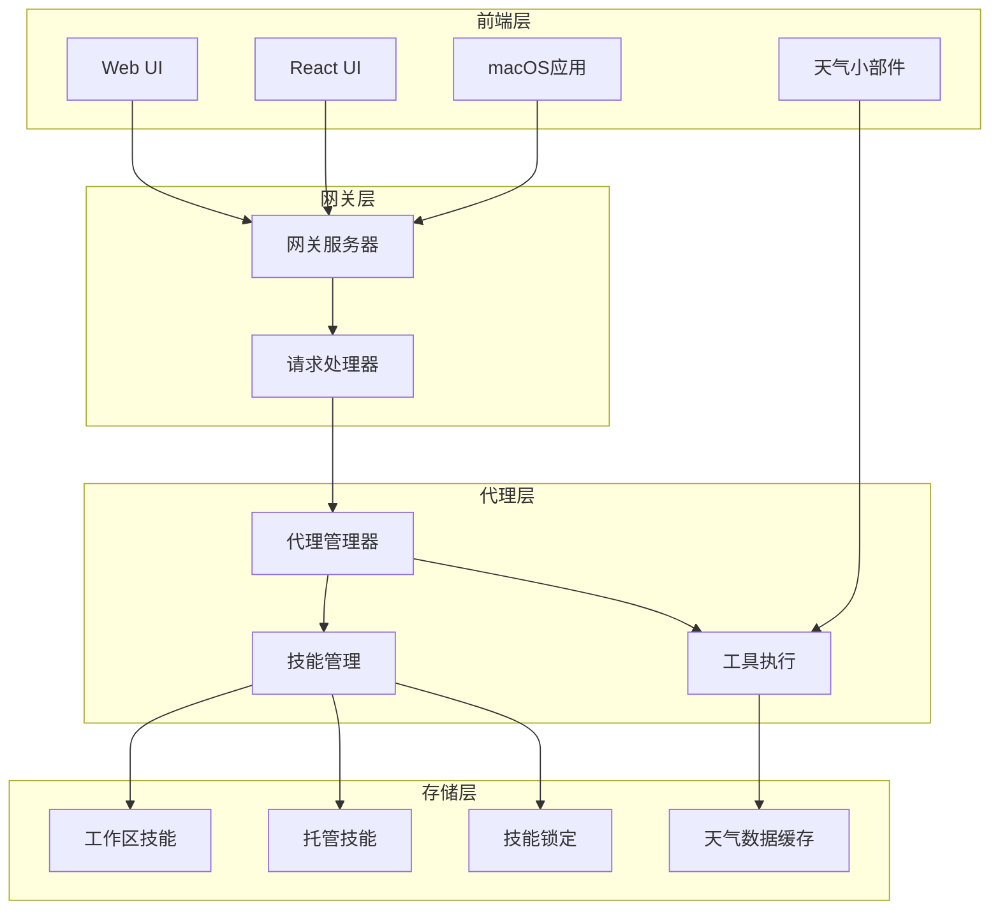
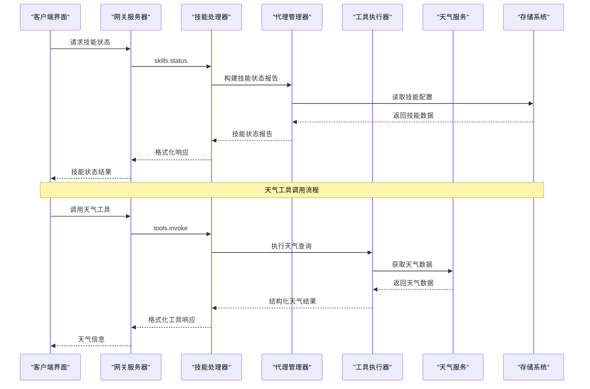
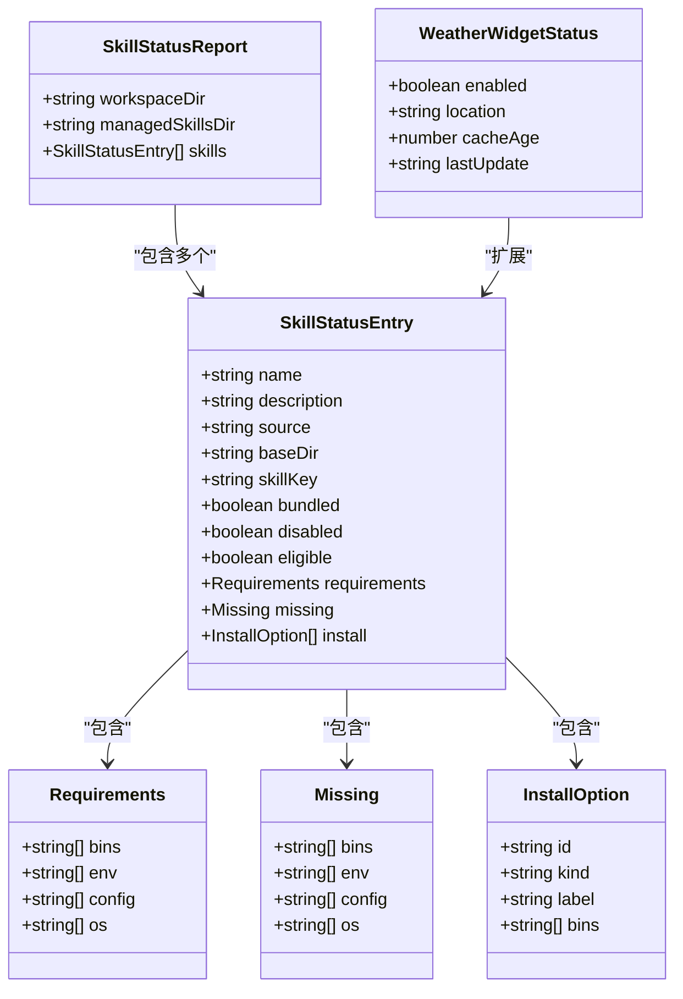
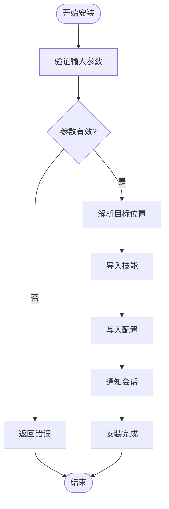
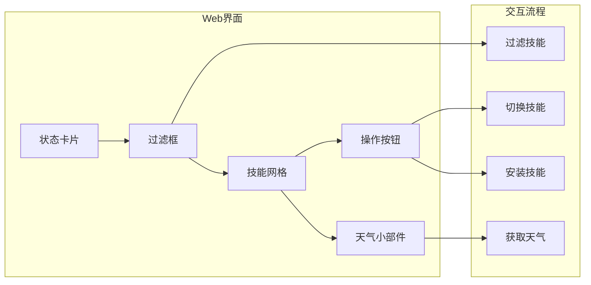
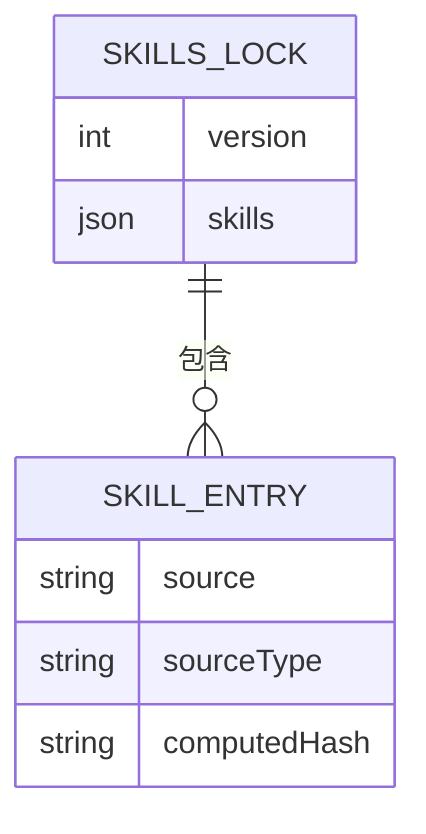
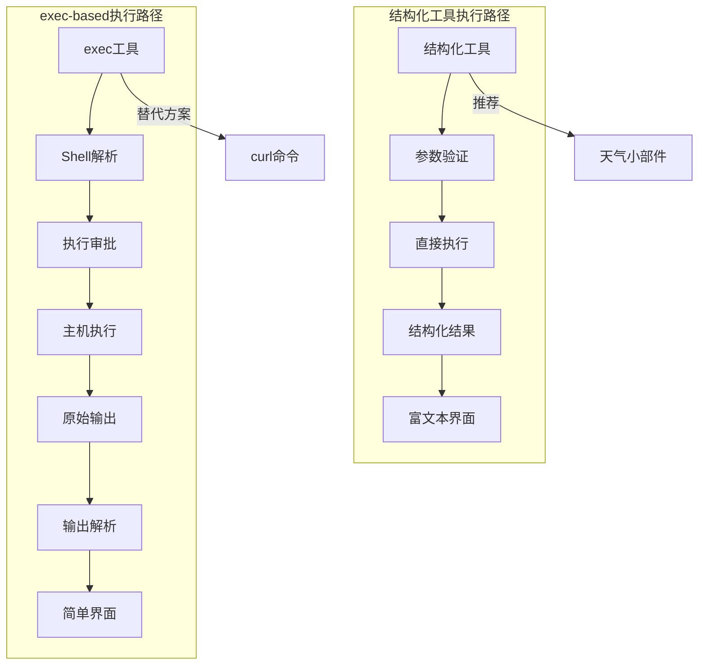
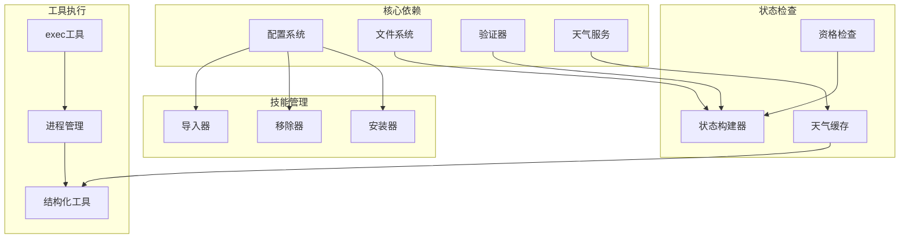
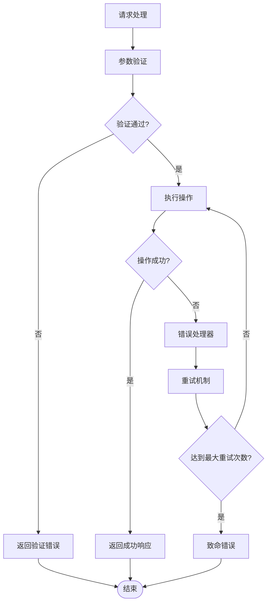

# 技能配置系统增强

<cite>
**本文档引用的文件**
- [skills-lock.json](file://skills-lock.json)
- [12306/_meta.json](file://skills/12306/_meta.json)
- [travel-planning/_meta.json](file://skills/travel-planning/_meta.json)
- [skill-creator/SKILL.md](file://skills/skill-creator/SKILL.md)
- [src/agents/skills.ts](file://src/agents/skills.ts)
- [src/gateway/server-methods/skills.ts](file://src/gateway/server-methods/skills.ts)
- [ui/src/ui/controllers/skills.ts](file://ui/src/ui/controllers/skills.ts)
- [ui/src/ui/views/skills.ts](file://ui/src/ui/views/skills.ts)
- [ui/src/ui/views/skills-shared.ts](file://ui/src/ui/views/skills-shared.ts)
- [ui-react/src/types/skills.ts](file://ui-react/src/types/skills.ts)
- [apps/macos/Sources/OpenClaw/SkillsSettings.swift](file://apps/macos/Sources/OpenClaw/SkillsSettings.swift)
- [ui-react/src/store/skills.store.ts](file://ui-react/src/store/skills.store.ts)
- [src/agents/tools/weather-widget-tool.ts](file://src/agents/tools/weather-widget-tool.ts)
- [ui-react/src/components/chat/parse-weather-widget-payload.ts](file://ui-react/src/components/chat/parse-weather-widget-payload.ts)
- [src/agents/bash-tools.exec.ts](file://src/agents/bash-tools.exec.ts)
- [src/agents/bash-tools.process.ts](file://src/agents/bash-tools.process.ts)
- [src/agents/tools/common.ts](file://src/agents/tools/common.ts)
</cite>

## 更新摘要
**所做更改**
- 新增天气小部件工具使用指南章节
- 添加结构化工具与基于exec的方法对比分析
- 更新技能状态报告系统章节以包含新的天气工具
- 增强工具执行路径和安全机制说明

## 目录
1. [简介](#简介)
2. [项目结构](#项目结构)
3. [核心组件](#核心组件)
4. [架构概览](#架构概览)
5. [详细组件分析](#详细组件分析)
6. [天气小部件工具使用指南](#天气小部件工具使用指南)
7. [结构化工具与exec-based方法对比](#结构化工具与exec-based方法对比)
8. [依赖关系分析](#依赖关系分析)
9. [性能考虑](#性能考虑)
10. [故障排除指南](#故障排除指南)
11. [结论](#结论)

## 简介

OpenClaw的技能配置系统是一个强大的模块化框架，允许用户管理和配置各种AI代理技能。该系统支持多种技能来源（内置、托管、工作区），提供完整的生命周期管理，包括安装、更新、删除和状态监控。

系统采用分层架构设计，通过统一的API接口连接前端界面、后端服务和底层技能实现。每个技能都遵循标准化的配置规范，确保一致性和可维护性。

**更新** 新增天气小部件工具支持，提供结构化的天气数据获取能力，并增强了工具执行的安全性和可靠性。

## 项目结构

OpenClaw技能配置系统的整体架构由以下主要部分组成：



**图表来源**
- [src/gateway/server-methods/skills.ts:95-446](file://src/gateway/server-methods/skills.ts#L95-L446)
- [src/agents/skills.ts:1-47](file://src/agents/skills.ts#L1-L47)
- [src/agents/tools/weather-widget-tool.ts:1-385](file://src/agents/tools/weather-widget-tool.ts#L1-L385)

**章节来源**
- [src/gateway/server-methods/skills.ts:1-446](file://src/gateway/server-methods/skills.ts#L1-L446)
- [src/agents/skills.ts:1-47](file://src/agents/skills.ts#L1-L47)

## 核心组件

### 技能状态管理

技能状态管理系统负责跟踪和报告所有已安装技能的状态信息。系统支持三种不同的技能来源：

1. **内置技能**：预装在系统中的基础功能
2. **托管技能**：全局共享的技能集合
3. **工作区技能**：特定项目范围内的技能

**更新** 新增天气小部件工具的状态管理，支持实时天气数据获取和缓存机制。

### 技能配置验证

系统实现了严格的配置验证机制，确保技能配置的安全性和完整性：

- **描述字段验证**：限制长度和字符集
- **环境变量验证**：检查必需的运行时依赖
- **权限控制**：防止恶意配置注入

### 安装偏好设置

系统支持灵活的安装偏好配置，包括包管理器选择和平台特定设置。

**章节来源**
- [ui-react/src/types/skills.ts:13-48](file://ui-react/src/types/skills.ts#L13-L48)
- [src/agents/skills.ts:36-46](file://src/agents/skills.ts#L36-L46)

## 架构概览

OpenClaw技能配置系统采用客户端-服务器架构，通过RPC协议进行通信：



**图表来源**
- [src/gateway/server-methods/skills.ts:96-128](file://src/gateway/server-methods/skills.ts#L96-L128)
- [ui/src/ui/controllers/skills.ts:46-68](file://ui/src/ui/controllers/skills.ts#L46-L68)
- [src/agents/tools/weather-widget-tool.ts:358-384](file://src/agents/tools/weather-widget-tool.ts#L358-L384)

**章节来源**
- [src/gateway/server-methods/skills.ts:1-446](file://src/gateway/server-methods/skills.ts#L1-L446)
- [ui/src/ui/controllers/skills.ts:1-158](file://ui/src/ui/controllers/skills.ts#L1-L158)

## 详细组件分析

### 技能状态报告系统

技能状态报告系统提供了全面的技能健康检查和状态监控功能：



**图表来源**
- [ui-react/src/types/skills.ts:13-48](file://ui-react/src/types/skills.ts#L13-L48)
- [ui-react/src/types/skills.ts:6-11](file://ui-react/src/types/skills.ts#L6-L11)
- [src/agents/tools/weather-widget-tool.ts:31-53](file://src/agents/tools/weather-widget-tool.ts#L31-L53)

#### 技能状态计算逻辑

系统通过以下步骤计算技能状态：

1. **加载技能配置**：从工作区和托管目录读取技能元数据
2. **环境检查**：验证二进制依赖、环境变量和配置文件
3. **权限评估**：检查技能是否被允许列表阻止
4. **状态分类**：根据检查结果对技能进行分组

**更新** 天气小部件工具状态包含缓存年龄、最后更新时间等额外信息。

**章节来源**
- [ui/src/ui/views/skills-shared.ts:4-22](file://ui/src/ui/views/skills-shared.ts#L4-L22)
- [ui/src/ui/views/skills.ts:96-193](file://ui/src/ui/views/skills.ts#L96-L193)

### 技能安装和管理

技能安装系统提供了完整的生命周期管理功能：



**图表来源**
- [src/gateway/server-methods/skills.ts:280-311](file://src/gateway/server-methods/skills.ts#L280-L311)
- [src/gateway/server-methods/skills.ts:403-421](file://src/gateway/server-methods/skills.ts#L403-L421)

#### 支持的安装方式

系统支持多种技能安装方式：

1. **URL安装**：从远程源安装技能
2. **文件上传**：从本地文件系统安装
3. **包管理器**：使用系统包管理器安装

**章节来源**
- [src/gateway/server-methods/skills.ts:370-421](file://src/gateway/server-methods/skills.ts#L370-L421)

### 前端用户界面

系统提供了多平台的用户界面，支持技能的可视化管理和配置：

#### Web界面组件

Web界面采用响应式设计，支持桌面和移动设备：



**图表来源**
- [ui/src/ui/views/skills.ts:28-94](file://ui/src/ui/views/skills.ts#L28-L94)
- [ui/src/ui/views/skills.ts:96-193](file://ui/src/ui/views/skills.ts#L96-L193)

#### macOS原生界面

macOS应用提供了原生的技能配置体验：

**章节来源**
- [apps/macos/Sources/OpenClaw/SkillsSettings.swift:1-35](file://apps/macos/Sources/OpenClaw/SkillsSettings.swift#L1-L35)
- [ui/src/ui/views/skills.ts:1-193](file://ui/src/ui/views/skills.ts#L1-L193)

### 技能锁定机制

系统使用技能锁定文件来管理预定义的技能配置：



**图表来源**
- [skills-lock.json:1-51](file://skills-lock.json#L1-L51)

**章节来源**
- [skills-lock.json:1-51](file://skills-lock.json#L1-L51)

## 天气小部件工具使用指南

### 工具概述

天气小部件工具（weather_widget）是一个专门设计的结构化工具，用于获取当前或未来天气信息并以富文本卡片形式展示。该工具使用wttr.in API提供准确的天气数据。

### 功能特性

1. **结构化输出**：返回标准化的WeatherWidgetPayload格式
2. **多城市支持**：支持城市名称、地区或机场代码
3. **温度单位切换**：支持摄氏度和华氏度
4. **多日预报**：支持今天到未来3天的天气预报
5. **条件代码映射**：将世界天气在线代码转换为标准条件码

### 使用示例

```javascript
// 基本用法 - 获取北京今天的天气
{
  "name": "weather_widget",
  "arguments": {
    "location": "北京",
    "dayOffset": 0,
    "units": "celsius"
  }
}

// 获取伦敦明天的天气预报
{
  "name": "weather_widget", 
  "arguments": {
    "location": "London",
    "dayOffset": 1,
    "units": "fahrenheit"
  }
}

// 获取上海未来3天的天气
{
  "name": "weather_widget",
  "arguments": {
    "location": "SHA",
    "dayOffset": 0,
    "units": "celsius"
  }
}
```

### 输出格式

工具返回的标准WeatherWidgetPayload包含以下结构：

```typescript
interface WeatherWidgetPayload {
  version: "3.1";
  id: string;
  location: { name: string };
  units: { temperature: "celsius" | "fahrenheit" };
  current: {
    conditionCode: WeatherConditionCode;
    temperature: number;
    tempMin: number;
    tempMax: number;
    windSpeed?: number;
    precipitationLevel?: "none" | "light" | "moderate" | "heavy";
    visibility?: number;
  };
  forecast: Array<{
    label: string;
    conditionCode: WeatherConditionCode;
    tempMin: number;
    tempMax: number;
  }>;
  time: { timeBucket?: number; localTimeOfDay?: number };
  updatedAt?: string;
}
```

### 条件代码说明

工具支持以下天气条件代码：

- clear：晴朗
- partly-cloudy：多云
- cloudy：阴天
- overcast：阴沉
- fog：雾
- drizzle：毛毛雨
- rain：雨
- heavy-rain：大雨
- thunderstorm：雷暴
- snow：雪
- sleet：雨夹雪
- hail：冰雹
- windy：有风

### 错误处理

工具提供完善的错误处理机制：

1. **网络错误**：处理wttr.in服务不可达的情况
2. **参数验证**：验证地理位置和日期偏移参数
3. **数据解析**：处理无效的API响应
4. **超时处理**：20秒超时保护

**章节来源**
- [src/agents/tools/weather-widget-tool.ts:1-385](file://src/agents/tools/weather-widget-tool.ts#L1-L385)
- [ui-react/src/components/chat/parse-weather-widget-payload.ts:1-78](file://ui-react/src/components/chat/parse-weather-widget-payload.ts#L1-L78)

## 结构化工具与exec-based方法对比

### 工具执行路径对比

OpenClaw提供了两种主要的工具执行方式，每种都有其特定的优势和适用场景：



**图表来源**
- [src/agents/tools/weather-widget-tool.ts:358-384](file://src/agents/tools/weather-widget-tool.ts#L358-L384)
- [src/agents/bash-tools.exec.ts:151-599](file://src/agents/bash-tools.exec.ts#L151-L599)

### 安全性对比

| 特性 | 结构化工具 | exec工具 |
|------|------------|----------|
| **参数验证** | 强类型Schema验证 | 无结构化验证 |
| **输出格式** | 标准化JSON | 原始文本/JSON |
| **权限控制** | 内置权限检查 | 依赖执行策略 |
| **错误处理** | 结构化错误对象 | 原始错误消息 |
| **缓存支持** | 可选缓存机制 | 无内置缓存 |
| **UI集成** | 富文本界面 | 简单文本显示 |

### 性能对比

**结构化工具优势**：
1. **类型安全**：编译时参数验证
2. **缓存友好**：可实现智能缓存策略
3. **错误恢复**：结构化错误处理
4. **UI优化**：专为富文本界面设计

**exec工具优势**：
1. **灵活性**：支持任意命令执行
2. **兼容性**：可执行任何可用的系统命令
3. **简单性**：无需复杂的Schema定义
4. **扩展性**：可快速适应新需求

### 使用场景建议

**优先使用结构化工具当**：
- 需要标准化的数据格式
- 需要富文本界面展示
- 需要严格的参数验证
- 需要缓存和性能优化
- 需要结构化错误处理

**使用exec工具当**：
- 需要执行第三方工具
- 需要灵活的命令组合
- 需要快速原型开发
- 需要访问系统级功能
- 需要自定义输出格式

### 配置和部署

**结构化工具配置**：
```yaml
tools:
  weather_widget:
    enabled: true
    cache_ttl: 300  # 5分钟缓存
    max_requests: 100
```

**exec工具配置**：
```yaml
tools:
  exec:
    host: sandbox  # 或 gateway, node
    security: deny  # 或 allowlist, full
    ask: on-miss    # 或 off, always
    timeout: 1800   # 30分钟超时
```

**章节来源**
- [src/agents/tools/common.ts:1-341](file://src/agents/tools/common.ts#L1-L341)
- [src/agents/bash-tools.exec.ts:151-599](file://src/agents/bash-tools.exec.ts#L151-L599)
- [src/agents/bash-tools.process.ts:119-656](file://src/agents/bash-tools.process.ts#L119-L656)

## 依赖关系分析

技能配置系统的关键依赖关系如下：



**图表来源**
- [src/gateway/server-methods/skills.ts:1-38](file://src/gateway/server-methods/skills.ts#L1-L38)
- [src/agents/skills.ts:1-25](file://src/agents/skills.ts#L1-L25)
- [src/agents/tools/weather-widget-tool.ts:1-385](file://src/agents/tools/weather-widget-tool.ts#L1-L385)

**章节来源**
- [src/gateway/server-methods/skills.ts:1-38](file://src/gateway/server-methods/skills.ts#L1-L38)
- [src/agents/skills.ts:1-25](file://src/agents/skills.ts#L1-L25)

## 性能考虑

### 缓存策略

系统实现了多层次的缓存机制来优化性能：

1. **技能状态缓存**：避免重复的文件系统扫描
2. **配置文件缓存**：减少频繁的磁盘I/O操作
3. **API响应缓存**：在短时间内避免重复的网络请求
4. **天气数据缓存**：结构化工具支持智能缓存策略

**更新** 天气小部件工具实现了智能缓存机制，支持可配置的缓存生存时间。

### 异步处理

所有耗时操作都采用异步处理模式：

- **安装操作**：非阻塞的后台安装过程
- **文件操作**：异步的文件读写操作
- **网络请求**：并发的API调用处理
- **工具执行**：异步的工具调用和结果处理

### 资源管理

系统采用资源池化和连接复用技术：

- **数据库连接**：连接池管理
- **文件句柄**：自动资源清理
- **内存使用**：及时的对象回收
- **进程管理**：进程池和生命周期管理

**章节来源**
- [src/agents/tools/weather-widget-tool.ts:12-13](file://src/agents/tools/weather-widget-tool.ts#L12-L13)
- [src/agents/bash-tools.process.ts:119-656](file://src/agents/bash-tools.process.ts#L119-L656)

## 故障排除指南

### 常见问题诊断

#### 技能无法加载

**症状**：技能状态显示为不可用或加载失败

**排查步骤**：
1. 检查技能文件完整性
2. 验证依赖项安装状态
3. 确认权限设置正确

#### 安装失败

**症状**：技能安装过程中出现错误

**解决方案**：
1. 检查网络连接状态
2. 验证目标目录权限
3. 清理临时文件缓存

#### 配置验证错误

**症状**：技能配置更新被拒绝

**解决方法**：
1. 检查配置格式正确性
2. 验证必需字段完整性
3. 确认值域范围有效性

#### 天气工具错误

**症状**：天气查询失败或返回错误

**排查步骤**：
1. 检查地理位置参数格式
2. 验证网络连接状态
3. 查看天气服务可用性
4. 检查缓存状态

#### 工具执行问题

**症状**：结构化工具或exec工具执行失败

**解决方案**：
1. 检查工具Schema定义
2. 验证执行权限配置
3. 查看进程管理状态
4. 检查超时设置

**章节来源**
- [src/gateway/server-methods/skills.ts:96-128](file://src/gateway/server-methods/skills.ts#L96-L128)
- [ui/src/ui/controllers/skills.ts:74-97](file://ui/src/ui/controllers/skills.ts#L74-L97)
- [src/agents/tools/weather-widget-tool.ts:322-356](file://src/agents/tools/weather-widget-tool.ts#L322-L356)

### 错误处理机制

系统实现了完善的错误处理和恢复机制：



**图表来源**
- [ui/src/ui/controllers/skills.ts:126-157](file://ui/src/ui/controllers/skills.ts#L126-L157)
- [src/agents/tools/common.ts:26-42](file://src/agents/tools/common.ts#L26-L42)

## 结论

OpenClaw技能配置系统通过其模块化设计和强大的功能集，为AI代理技能管理提供了全面的解决方案。系统的主要优势包括：

1. **高度模块化**：清晰的组件分离和职责划分
2. **跨平台支持**：统一的API接口支持多种客户端
3. **安全可靠**：严格的验证机制和权限控制
4. **性能优化**：智能缓存和异步处理机制
5. **用户体验**：直观的界面和流畅的操作流程
6. **工具多样性**：结构化工具和exec工具的灵活选择

**更新总结** 新增的天气小部件工具进一步增强了系统的实用性，提供了专业的天气数据获取能力。结构化工具与exec-based方法的对比分析为用户选择合适的工具执行方式提供了重要参考。

该系统为未来的扩展和定制提供了良好的基础，支持更多高级功能的集成和优化。