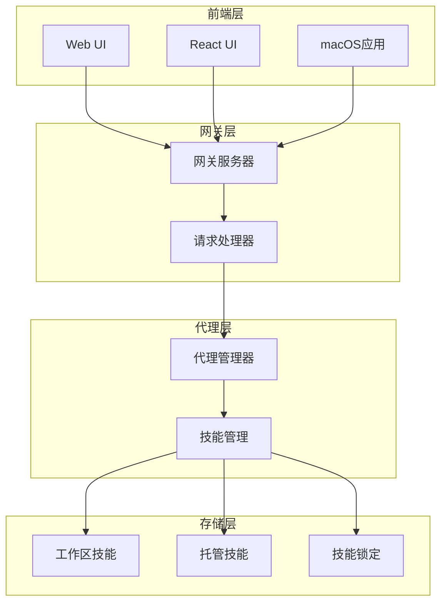
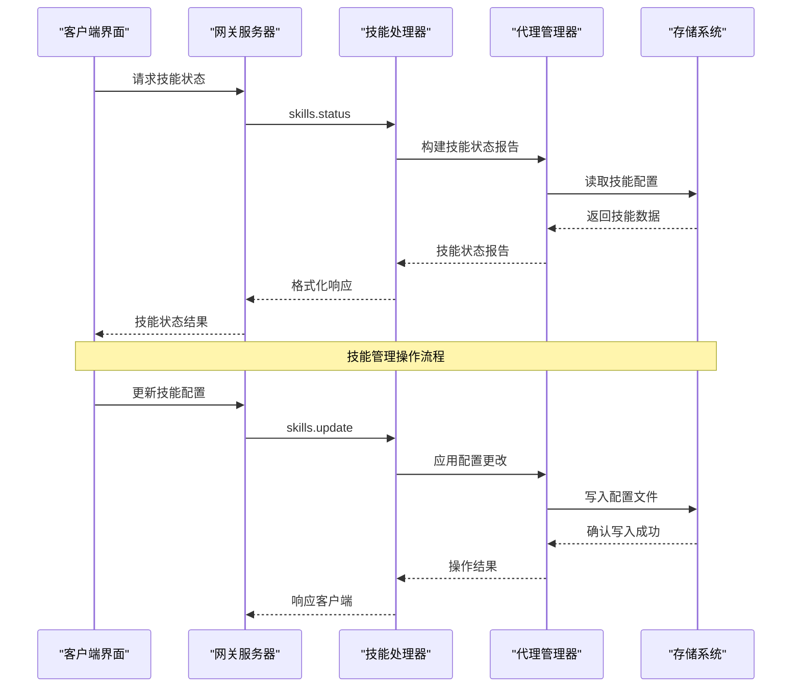
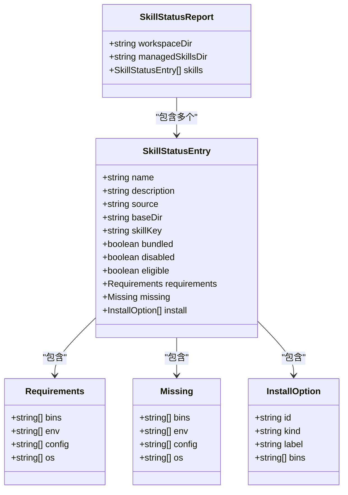
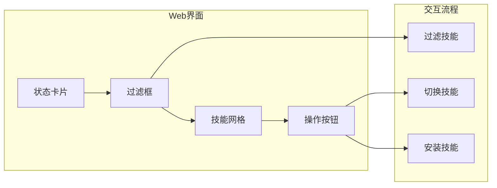
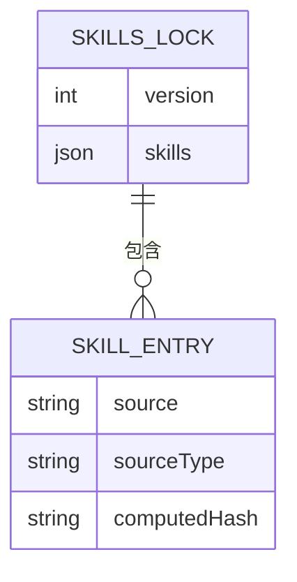
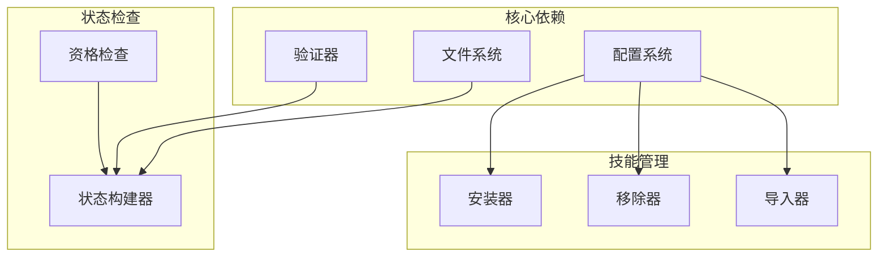

# 技能配置系统增强

<cite>
**本文档引用的文件**
- [skills-lock.json](file://skills-lock.json)
- [12306/_meta.json](file://skills/12306/_meta.json)
- [travel-planning/_meta.json](file://skills/travel-planning/_meta.json)
- [skill-creator/SKILL.md](file://skills/skill-creator/SKILL.md)
- [src/agents/skills.ts](file://src/agents/skills.ts)
- [src/gateway/server-methods/skills.ts](file://src/gateway/server-methods/skills.ts)
- [ui/src/ui/controllers/skills.ts](file://ui/src/ui/controllers/skills.ts)
- [ui/src/ui/views/skills.ts](file://ui/src/ui/views/skills.ts)
- [ui/src/ui/views/skills-shared.ts](file://ui/src/ui/views/skills-shared.ts)
- [ui-react/src/types/skills.ts](file://ui-react/src/types/skills.ts)
- [apps/macos/Sources/OpenClaw/SkillsSettings.swift](file://apps/macos/Sources/OpenClaw/SkillsSettings.swift)
- [ui-react/src/store/skills.store.ts](file://ui-react/src/store/skills.store.ts)
</cite>

## 目录
1. [简介](#简介)
2. [项目结构](#项目结构)
3. [核心组件](#核心组件)
4. [架构概览](#架构概览)
5. [详细组件分析](#详细组件分析)
6. [依赖关系分析](#依赖关系分析)
7. [性能考虑](#性能考虑)
8. [故障排除指南](#故障排除指南)
9. [结论](#结论)

## 简介

OpenClaw的技能配置系统是一个强大的模块化框架，允许用户管理和配置各种AI代理技能。该系统支持多种技能来源（内置、托管、工作区），提供完整的生命周期管理，包括安装、更新、删除和状态监控。

系统采用分层架构设计，通过统一的API接口连接前端界面、后端服务和底层技能实现。每个技能都遵循标准化的配置规范，确保一致性和可维护性。

## 项目结构

OpenClaw技能配置系统的整体架构由以下主要部分组成：

**图表来源**
- [src/gateway/server-methods/skills.ts:95-446](file://src/gateway/server-methods/skills.ts#L95-L446)
- [src/agents/skills.ts:1-47](file://src/agents/skills.ts#L1-L47)

**章节来源**
- [src/gateway/server-methods/skills.ts:1-446](file://src/gateway/server-methods/skills.ts#L1-L446)
- [src/agents/skills.ts:1-47](file://src/agents/skills.ts#L1-L47)

## 核心组件

### 技能状态管理

技能状态管理系统负责跟踪和报告所有已安装技能的状态信息。系统支持三种不同的技能来源：

1. **内置技能**：预装在系统中的基础功能
2. **托管技能**：全局共享的技能集合
3. **工作区技能**：特定项目范围内的技能

### 技能配置验证

系统实现了严格的配置验证机制，确保技能配置的安全性和完整性：

- **描述字段验证**：限制长度和字符集
- **环境变量验证**：检查必需的运行时依赖
- **权限控制**：防止恶意配置注入

### 安装偏好设置

系统支持灵活的安装偏好配置，包括包管理器选择和平台特定设置。

**章节来源**
- [ui-react/src/types/skills.ts:13-48](file://ui-react/src/types/skills.ts#L13-L48)
- [src/agents/skills.ts:36-46](file://src/agents/skills.ts#L36-L46)

## 架构概览

OpenClaw技能配置系统采用客户端-服务器架构，通过RPC协议进行通信：

**图表来源**
- [src/gateway/server-methods/skills.ts:96-128](file://src/gateway/server-methods/skills.ts#L96-L128)
- [ui/src/ui/controllers/skills.ts:46-68](file://ui/src/ui/controllers/skills.ts#L46-L68)

**章节来源**
- [src/gateway/server-methods/skills.ts:1-446](file://src/gateway/server-methods/skills.ts#L1-L446)
- [ui/src/ui/controllers/skills.ts:1-158](file://ui/src/ui/controllers/skills.ts#L1-L158)

## 详细组件分析

### 技能状态报告系统

技能状态报告系统提供了全面的技能健康检查和状态监控功能：

**图表来源**
- [ui-react/src/types/skills.ts:13-48](file://ui-react/src/types/skills.ts#L13-L48)
- [ui-react/src/types/skills.ts:6-11](file://ui-react/src/types/skills.ts#L6-L11)

#### 技能状态计算逻辑

系统通过以下步骤计算技能状态：

1. **加载技能配置**：从工作区和托管目录读取技能元数据
2. **环境检查**：验证二进制依赖、环境变量和配置文件
3. **权限评估**：检查技能是否被允许列表阻止
4. **状态分类**：根据检查结果对技能进行分组

**章节来源**
- [ui/src/ui/views/skills-shared.ts:4-22](file://ui/src/ui/views/skills-shared.ts#L4-L22)
- [ui/src/ui/views/skills.ts:96-193](file://ui/src/ui/views/skills.ts#L96-L193)

### 技能安装和管理

技能安装系统提供了完整的生命周期管理功能：

**图表来源**
- [src/gateway/server-methods/skills.ts:280-311](file://src/gateway/server-methods/skills.ts#L280-L311)
- [src/gateway/server-methods/skills.ts:403-421](file://src/gateway/server-methods/skills.ts#L403-L421)

#### 支持的安装方式

系统支持多种技能安装方式：

1. **URL安装**：从远程源安装技能
2. **文件上传**：从本地文件系统安装
3. **包管理器**：使用系统包管理器安装

**章节来源**
- [src/gateway/server-methods/skills.ts:370-421](file://src/gateway/server-methods/skills.ts#L370-L421)

### 前端用户界面

系统提供了多平台的用户界面，支持技能的可视化管理和配置：

#### Web界面组件

Web界面采用响应式设计，支持桌面和移动设备：

**图表来源**
- [ui/src/ui/views/skills.ts:28-94](file://ui/src/ui/views/skills.ts#L28-L94)
- [ui/src/ui/views/skills.ts:96-193](file://ui/src/ui/views/skills.ts#L96-L193)

#### macOS原生界面

macOS应用提供了原生的技能配置体验：

**章节来源**
- [apps/macos/Sources/OpenClaw/SkillsSettings.swift:1-35](file://apps/macos/Sources/OpenClaw/SkillsSettings.swift#L1-L35)
- [ui/src/ui/views/skills.ts:1-193](file://ui/src/ui/views/skills.ts#L1-L193)

### 技能锁定机制

系统使用技能锁定文件来管理预定义的技能配置：

**图表来源**
- [skills-lock.json:1-51](file://skills-lock.json#L1-L51)

**章节来源**
- [skills-lock.json:1-51](file://skills-lock.json#L1-L51)

## 依赖关系分析

技能配置系统的关键依赖关系如下：

**图表来源**
- [src/gateway/server-methods/skills.ts:1-38](file://src/gateway/server-methods/skills.ts#L1-L38)
- [src/agents/skills.ts:1-25](file://src/agents/skills.ts#L1-L25)

**章节来源**
- [src/gateway/server-methods/skills.ts:1-38](file://src/gateway/server-methods/skills.ts#L1-L38)
- [src/agents/skills.ts:1-25](file://src/agents/skills.ts#L1-L25)

## 性能考虑

### 缓存策略

系统实现了多层次的缓存机制来优化性能：

1. **技能状态缓存**：避免重复的文件系统扫描
2. **配置文件缓存**：减少频繁的磁盘I/O操作
3. **API响应缓存**：在短时间内避免重复的网络请求

### 异步处理

所有耗时操作都采用异步处理模式：

- **安装操作**：非阻塞的后台安装过程
- **文件操作**：异步的文件读写操作
- **网络请求**：并发的API调用处理

### 资源管理

系统采用资源池化和连接复用技术：

- **数据库连接**：连接池管理
- **文件句柄**：自动资源清理
- **内存使用**：及时的对象回收

## 故障排除指南

### 常见问题诊断

#### 技能无法加载

**症状**：技能状态显示为不可用或加载失败

**排查步骤**：
1. 检查技能文件完整性
2. 验证依赖项安装状态
3. 确认权限设置正确

#### 安装失败

**症状**：技能安装过程中出现错误

**解决方案**：
1. 检查网络连接状态
2. 验证目标目录权限
3. 清理临时文件缓存

#### 配置验证错误

**症状**：技能配置更新被拒绝

**解决方法**：
1. 检查配置格式正确性
2. 验证必需字段完整性
3. 确认值域范围有效性

**章节来源**
- [src/gateway/server-methods/skills.ts:96-128](file://src/gateway/server-methods/skills.ts#L96-L128)
- [ui/src/ui/controllers/skills.ts:74-97](file://ui/src/ui/controllers/skills.ts#L74-L97)

### 错误处理机制

系统实现了完善的错误处理和恢复机制：

**图表来源**
- [ui/src/ui/controllers/skills.ts:126-157](file://ui/src/ui/controllers/skills.ts#L126-L157)

## 结论

OpenClaw技能配置系统通过其模块化设计和强大的功能集，为AI代理技能管理提供了全面的解决方案。系统的主要优势包括：

1. **高度模块化**：清晰的组件分离和职责划分
2. **跨平台支持**：统一的API接口支持多种客户端
3. **安全可靠**：严格的验证机制和权限控制
4. **性能优化**：智能缓存和异步处理机制
5. **用户体验**：直观的界面和流畅的操作流程

该系统为未来的扩展和定制提供了良好的基础，支持更多高级功能的集成和优化。