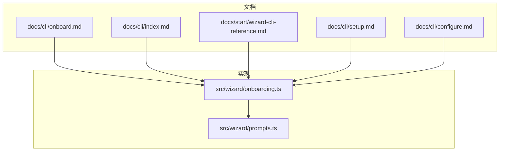
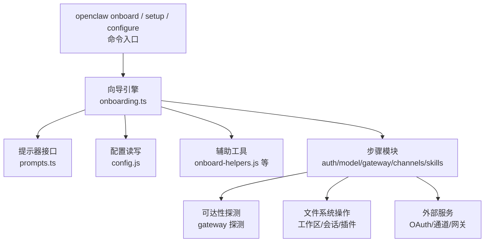
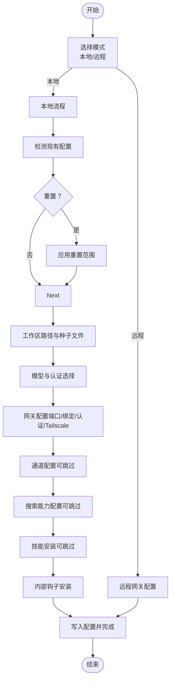
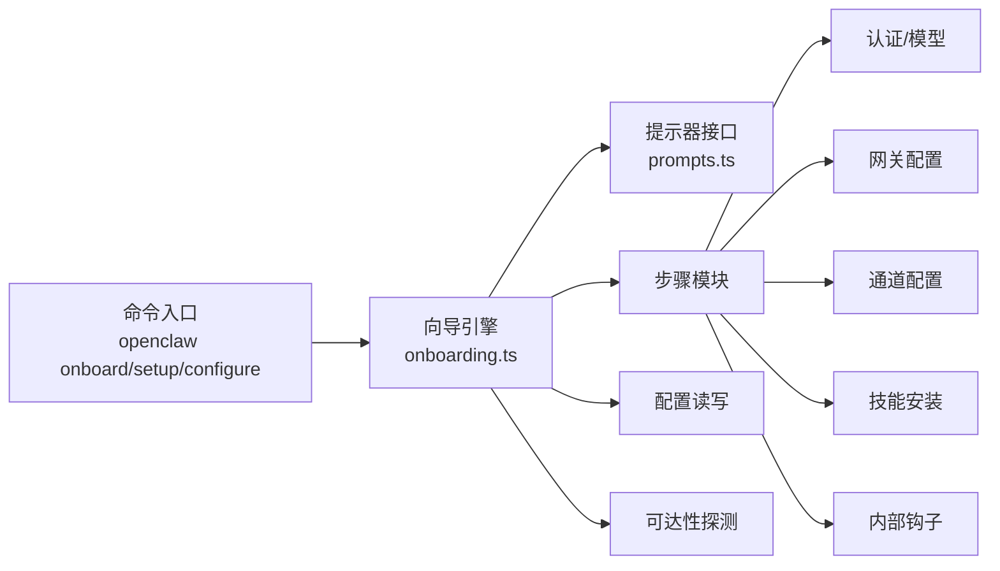

# 向导CLI参考

<cite>
**本文档引用的文件**
- [docs/cli/onboard.md](file://docs/cli/onboard.md)
- [docs/cli/index.md](file://docs/cli/index.md)
- [docs/start/wizard-cli-reference.md](file://docs/start/wizard-cli-reference.md)
- [docs/cli/setup.md](file://docs/cli/setup.md)
- [docs/cli/configure.md](file://docs/cli/configure.md)
- [src/wizard/onboarding.ts](file://src/wizard/onboarding.ts)
- [src/wizard/prompts.ts](file://src/wizard/prompts.ts)
</cite>

## 目录
1. [简介](#简介)
2. [项目结构](#项目结构)
3. [核心组件](#核心组件)
4. [架构总览](#架构总览)
5. [详细组件分析](#详细组件分析)
6. [依赖关系分析](#依赖关系分析)
7. [性能考虑](#性能考虑)
8. [故障排除指南](#故障排除指南)
9. [结论](#结论)
10. [附录](#附录)

## 简介
本参考文档面向使用 OpenClaw 的向导 CLI（交互式引导程序）用户与集成开发者，系统梳理了 openclaw onboard、openclaw setup、openclaw configure 等命令的行为、选项、流程与输出规范，并结合内部实现细节说明其控制流与安全策略。文档同时提供面向非技术读者的概览与面向工程师的代码级视图，帮助快速定位问题、自动化集成与扩展。

## 项目结构
与向导 CLI 相关的核心位置包括：
- 文档层：docs/cli/*.md 提供命令参考；docs/start/wizard-cli-reference.md 提供向导完整参考与行为说明
- 实现层：src/wizard/*.ts 定义向导流程、提示器接口与步骤编排

**图表来源**
- [docs/cli/onboard.md](file://docs/cli/onboard.md)
- [docs/cli/index.md](file://docs/cli/index.md)
- [docs/start/wizard-cli-reference.md](file://docs/start/wizard-cli-reference.md)
- [docs/cli/setup.md](file://docs/cli/setup.md)
- [docs/cli/configure.md](file://docs/cli/configure.md)
- [src/wizard/onboarding.ts](file://src/wizard/onboarding.ts)
- [src/wizard/prompts.ts](file://src/wizard/prompts.ts)

**章节来源**
- [docs/cli/index.md](file://docs/cli/index.md)
- [docs/start/wizard-cli-reference.md](file://docs/start/wizard-cli-reference.md)

## 核心组件
- onboard 命令：交互式本地或远程网关设置、工作区初始化、模型与认证配置、通道与技能安装、健康检查与摘要输出
- setup 命令：初始化配置与工作区，可选触发向导
- configure 命令：交互式调整凭证、设备与代理默认值
- 向导引擎：基于提示器接口的流程编排，支持选择、多选、文本输入、确认与进度反馈
- 安全与密钥管理：支持明文与 SecretRef（环境变量或已配置的密钥提供者）两种存储模式，非交互模式下对密钥来源进行严格校验

**章节来源**
- [docs/cli/onboard.md](file://docs/cli/onboard.md)
- [docs/cli/setup.md](file://docs/cli/setup.md)
- [docs/cli/configure.md](file://docs/cli/configure.md)
- [src/wizard/onboarding.ts](file://src/wizard/onboarding.ts)
- [src/wizard/prompts.ts](file://src/wizard/prompts.ts)

## 架构总览
向导 CLI 的总体架构由“命令层 → 流程编排层 → 配置与状态层 → 外部服务探测层”构成。命令层解析参数与选项，流程编排层根据模式与流程类型驱动各步骤，配置与状态层负责读写配置、工作区与会话，外部服务探测层用于健康检查与可达性验证。

**图表来源**
- [src/wizard/onboarding.ts](file://src/wizard/onboarding.ts)
- [src/wizard/prompts.ts](file://src/wizard/prompts.ts)

## 详细组件分析

### 组件A：onboard 命令与向导流程
- 功能要点
  - 支持本地与远程两种模式；QuickStart 仅适用于本地
  - 模型与认证：内置多提供商选项，支持自定义兼容端点
  - 工作区：默认路径可配置，首次运行种子化必要文件
  - 网关：端口、绑定、认证（令牌/密码）、Tailscale 暴露策略
  - 通道：Telegram、WhatsApp、Discord、Google Chat、Mattermost、Signal、iMessage 等
  - 护栏：风险确认、无效配置拦截、非交互模式密钥来源校验
  - 输出：配置文件、会话目录、技能与钩子安装、最终摘要与下一步建议

- 控制流（简化）

**图表来源**
- [src/wizard/onboarding.ts](file://src/wizard/onboarding.ts)

- 关键实现点
  - 风险确认与退出机制：在未接受风险前直接中止
  - 非交互模式密钥来源校验：要求环境变量存在或显式传参，否则快速失败
  - 远程模式不修改远端主机，仅记录连接信息
  - 本地模式支持明文与 SecretRef 存储，SecretRef 在非交互模式下仅支持环境变量后端

**章节来源**
- [docs/cli/onboard.md](file://docs/cli/onboard.md)
- [docs/start/wizard-cli-reference.md](file://docs/start/wizard-cli-reference.md)
- [src/wizard/onboarding.ts](file://src/wizard/onboarding.ts)

### 组件B：setup 命令
- 功能要点
  - 初始化配置文件与工作区目录
  - 可选触发向导（--wizard）

- 使用场景
  - 首次运行但不希望进入完整向导
  - 仅需设定默认工作区路径

**章节来源**
- [docs/cli/setup.md](file://docs/cli/setup.md)

### 组件C：configure 命令
- 功能要点
  - 交互式调整凭证、设备与代理默认值
  - 新增模型允许列表（agents.defaults.models）多选
  - 守护进程安装前提条件校验（令牌/密码与模式明确）

**章节来源**
- [docs/cli/configure.md](file://docs/cli/configure.md)

### 组件D：提示器接口与向导引擎
- 提示器接口（WizardPrompter）
  - intro/outro/note：标题、收尾与说明
  - select/multiselect：单选/多选，支持初始值与搜索
  - text/confirm：文本输入与布尔确认
  - progress：进度反馈
  - WizardCancelledError：取消异常

- 引擎职责
  - 解析流程与模式（QuickStart/Manual）
  - 读取与校验现有配置快照
  - 调用各步骤模块（认证、网关、通道、技能等）
  - 写回配置并输出摘要

**章节来源**
- [src/wizard/prompts.ts](file://src/wizard/prompts.ts)
- [src/wizard/onboarding.ts](file://src/wizard/onboarding.ts)

## 依赖关系分析
- 命令层依赖于向导引擎与提示器接口
- 向导引擎依赖配置读写、辅助工具与各步骤模块
- 步骤模块之间存在分层依赖：认证 → 模型 → 网关 → 通道/搜索/技能/钩子
- 外部依赖：OAuth 流程、通道 SDK、网关 RPC、Tailscale

**图表来源**
- [src/wizard/onboarding.ts](file://src/wizard/onboarding.ts)
- [src/wizard/prompts.ts](file://src/wizard/prompts.ts)

**章节来源**
- [src/wizard/onboarding.ts](file://src/wizard/onboarding.ts)

## 性能考虑
- 非交互模式优先：通过明确的标志位减少用户等待时间
- 快速预检：在写入配置前进行 SecretRef 预检与可达性探测，避免后续失败重试
- 并发与顺序：步骤间尽量串行以保证一致性，部分探测可并行（如通道健康检查）
- I/O 优化：工作区种子化与插件安装采用增量策略，避免重复下载

## 故障排除指南
- 配置无效
  - 现象：启动向导时提示配置无效并要求运行 doctor 修复
  - 处理：执行 doctor 自动修复，再重新运行向导
- 密钥来源错误（非交互模式）
  - 现象：传入 inline key flag 但未设置对应环境变量导致失败
  - 处理：确保环境变量存在或移除 inline key flag
- 远程网关不可达
  - 现象：远程模式下无法连接到指定 URL
  - 处理：检查网络、SSH 隧道或 Tailnet；使用 discovery 提示
- 守护进程安装阻断
  - 现象：同时配置了令牌与密码且未明确模式导致安装阻断
  - 处理：显式设置 gateway.auth.mode 或清理冲突配置

**章节来源**
- [docs/start/wizard-cli-reference.md](file://docs/start/wizard-cli-reference.md)
- [docs/cli/onboard.md](file://docs/cli/onboard.md)

## 结论
向导 CLI 将复杂的网关、认证、通道与技能配置封装为可交互或非交互的流程，既满足新手快速上手，又为自动化与集成提供稳定接口。通过明确的安全策略、严格的密钥来源校验与清晰的输出规范，OpenClaw 在易用性与可靠性之间取得平衡。

## 附录

### 常用命令与选项速查
- openclaw onboard
  - --workspace <dir>、--reset、--reset-scope、--non-interactive、--mode、--flow、--auth-choice、--secret-input-mode、--gateway-*、--remote-*、--tailscale、--install-daemon、--skip-*、--node-manager、--json
- openclaw setup
  - --workspace <dir>、--wizard
- openclaw configure
  - --section <model|channels|gateway|devices|agents|skills>...

**章节来源**
- [docs/cli/onboard.md](file://docs/cli/onboard.md)
- [docs/cli/index.md](file://docs/cli/index.md)
- [docs/cli/setup.md](file://docs/cli/setup.md)
- [docs/cli/configure.md](file://docs/cli/configure.md)