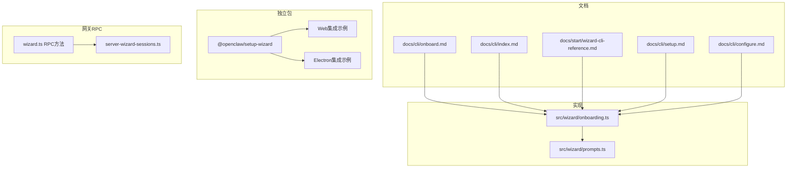
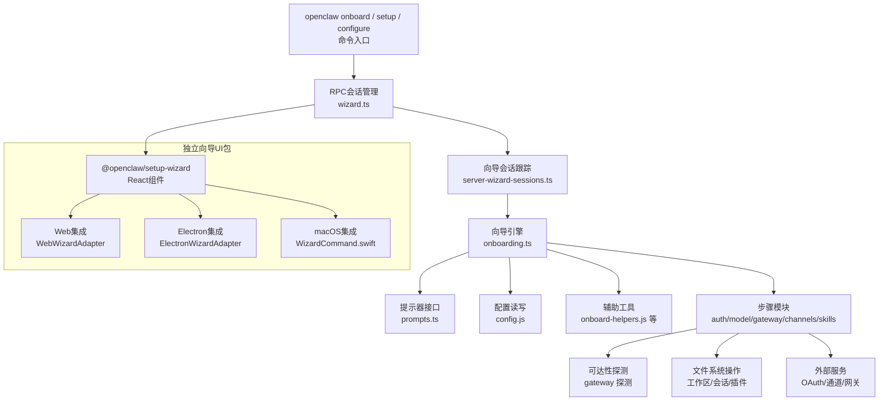
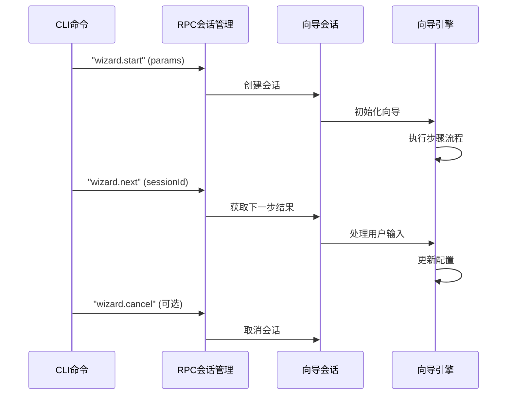
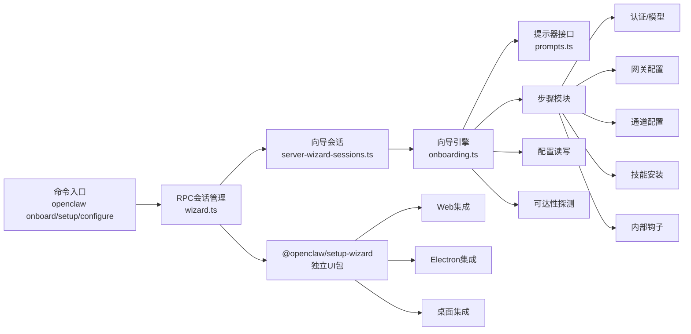

# 向导CLI参考

<cite>
**本文档引用的文件**
- [docs/cli/onboard.md](file://docs/cli/onboard.md)
- [docs/cli/index.md](file://docs/cli/index.md)
- [docs/start/wizard-cli-reference.md](file://docs/start/wizard-cli-reference.md)
- [docs/cli/setup.md](file://docs/cli/setup.md)
- [docs/cli/configure.md](file://docs/cli/configure.md)
- [src/wizard/onboarding.ts](file://src/wizard/onboarding.ts)
- [src/wizard/prompts.ts](file://src/wizard/prompts.ts)
- [packages/setup-wizard/src/index.ts](file://packages/setup-wizard/src/index.ts)
- [packages/setup-wizard/README.md](file://packages/setup-wizard/README.md)
- [apps/macos/Sources/OpenClawMacCLI/WizardCommand.swift](file://apps/macos/Sources/OpenClawMacCLI/WizardCommand.swift)
- [src/gateway/server-methods/wizard.ts](file://src/gateway/server-methods/wizard.ts)
- [src/gateway/server-wizard-sessions.ts](file://src/gateway/server-wizard-sessions.ts)
- [apps/electron/src/main/ipc-wizard.ts](file://apps/electron/src/main/ipc-wizard.ts)
</cite>

## 更新摘要
**所做更改**
- 更新了向导系统的架构描述，反映设置向导系统已迁移到独立的 @openclaw/setup-wizard 包
- 新增了基于RPC的向导会话管理和跨平台集成章节
- 更新了向导命令的实现方式，从CLI直接实现改为通过网关RPC调用
- 新增了Web和Electron平台的向导集成示例
- 更新了向导架构图，展示新的RPC驱动架构

## 目录
1. [简介](#简介)
2. [项目结构](#项目结构)
3. [核心组件](#核心组件)
4. [架构总览](#架构总览)
5. [详细组件分析](#详细组件分析)
6. [依赖关系分析](#依赖关系分析)
7. [性能考虑](#性能考虑)
8. [故障排除指南](#故障排除指南)
9. [结论](#结论)
10. [附录](#附录)

## 简介
本参考文档面向使用 OpenClaw 的向导 CLI（交互式引导程序）用户与集成开发者，系统梳理了 openclaw onboard、openclaw setup、openclaw configure 等命令的行为、选项、流程与输出规范。**重要更新**：设置向导系统已迁移到独立的 @openclaw/setup-wizard 包，采用RPC驱动的会话管理模式，支持多平台集成（Web、Electron、macOS）。文档同时提供面向非技术读者的概览与面向工程师的代码级视图，帮助快速定位问题、自动化集成与扩展。

## 项目结构
与向导 CLI 相关的核心位置包括：
- 文档层：docs/cli/*.md 提供命令参考；docs/start/wizard-cli-reference.md 提供向导完整参考与行为说明
- 实现层：src/wizard/*.ts 定义向导流程、提示器接口与步骤编排
- **新增**：packages/setup-wizard/* 提供独立的向导UI组件包
- 网关RPC层：src/gateway/server-methods/wizard.ts 和 server-wizard-sessions.ts 管理向导会话

**图表来源**
- [docs/cli/onboard.md](file://docs/cli/onboard.md)
- [docs/cli/index.md](file://docs/cli/index.md)
- [docs/start/wizard-cli-reference.md](file://docs/start/wizard-cli-reference.md)
- [docs/cli/setup.md](file://docs/cli/setup.md)
- [docs/cli/configure.md](file://docs/cli/configure.md)
- [src/wizard/onboarding.ts](file://src/wizard/onboarding.ts)
- [src/wizard/prompts.ts](file://src/wizard/prompts.ts)
- [packages/setup-wizard/src/index.ts](file://packages/setup-wizard/src/index.ts)
- [src/gateway/server-methods/wizard.ts](file://src/gateway/server-methods/wizard.ts)
- [src/gateway/server-wizard-sessions.ts](file://src/gateway/server-wizard-sessions.ts)

**章节来源**
- [docs/cli/index.md](file://docs/cli/index.md)
- [docs/start/wizard-cli-reference.md](file://docs/start/wizard-cli-reference.md)

## 核心组件
- **onboard 命令**：现在通过网关RPC调用向导会话，支持本地与远程网关设置、工作区初始化、模型与认证配置、通道与技能安装、健康检查与摘要输出
- **setup 命令**：初始化配置与工作区，可选触发向导
- **configure 命令**：交互式调整凭证、设备与代理默认值
- **向导引擎**：基于提示器接口的流程编排，支持选择、多选、文本输入、确认与进度反馈
- **RPC会话管理**：通过 "wizard.start"、"wizard.next"、"wizard.cancel" 等RPC方法管理向导会话生命周期
- **安全与密钥管理**：支持明文与 SecretRef（环境变量或已配置的密钥提供者）两种存储模式，非交互模式下对密钥来源进行严格校验

**章节来源**
- [docs/cli/onboard.md](file://docs/cli/onboard.md)
- [docs/cli/setup.md](file://docs/cli/setup.md)
- [docs/cli/configure.md](file://docs/cli/configure.md)
- [src/wizard/onboarding.ts](file://src/wizard/onboarding.ts)
- [src/wizard/prompts.ts](file://src/wizard/prompts.ts)
- [src/gateway/server-methods/wizard.ts](file://src/gateway/server-methods/wizard.ts)

## 架构总览
**重要更新**：向导 CLI 的总体架构已从直接的CLI实现转变为RPC驱动的会话管理模式。新架构由"命令层 → RPC会话管理层 → 独立向导UI包 → 配置与状态层 → 外部服务探测层"构成。

**图表来源**
- [src/wizard/onboarding.ts](file://src/wizard/onboarding.ts)
- [src/wizard/prompts.ts](file://src/wizard/prompts.ts)
- [src/gateway/server-methods/wizard.ts](file://src/gateway/server-methods/wizard.ts)
- [src/gateway/server-wizard-sessions.ts](file://src/gateway/server-wizard-sessions.ts)
- [packages/setup-wizard/src/index.ts](file://packages/setup-wizard/src/index.ts)

## 详细组件分析

### 组件A：onboard 命令与RPC向导会话
**重要更新**：onboard 命令现在通过RPC会话管理器执行，而非直接的CLI实现。

- **功能要点**
  - 通过RPC调用 "wizard.start" 开始向导会话
  - 支持本地与远程两种模式；QuickStart 仅适用于本地
  - 模型与认证：内置多提供商选项，支持自定义兼容端点
  - 工作区：默认路径可配置，首次运行种子化必要文件
  - 网关：端口、绑定、认证（令牌/密码）、Tailscale 暴露策略
  - 通道：Telegram、WhatsApp、Discord、Google Chat、Mattermost、Signal、iMessage 等
  - 护栏：风险确认、无效配置拦截、非交互模式密钥来源校验
  - 输出：配置文件、会话目录、技能与钩子安装、最终摘要与下一步建议

- **RPC会话流程**

**图表来源**
- [src/gateway/server-methods/wizard.ts](file://src/gateway/server-methods/wizard.ts)
- [src/gateway/server-wizard-sessions.ts](file://src/gateway/server-wizard-sessions.ts)

- **关键实现点**
  - 风险确认与退出机制：在未接受风险前直接中止
  - 非交互模式密钥来源校验：要求环境变量存在或显式传参，否则快速失败
  - 远程模式不修改远端主机，仅记录连接信息
  - 本地模式支持明文与 SecretRef 存储，SecretRef 在非交互模式下仅支持环境变量后端

**章节来源**
- [docs/cli/onboard.md](file://docs/cli/onboard.md)
- [docs/start/wizard-cli-reference.md](file://docs/start/wizard-cli-reference.md)
- [src/wizard/onboarding.ts](file://src/wizard/onboarding.ts)
- [src/gateway/server-methods/wizard.ts](file://src/gateway/server-methods/wizard.ts)

### 组件B：setup 命令
- **功能要点**
  - 初始化配置文件与工作区目录
  - 可选触发向导（--wizard）

- **使用场景**
  - 首次运行但不希望进入完整向导
  - 仅需设定默认工作区路径

**章节来源**
- [docs/cli/setup.md](file://docs/cli/setup.md)

### 组件C：configure 命令
- **功能要点**
  - 交互式调整凭证、设备与代理默认值
  - 新增模型允许列表（agents.defaults.models）多选
  - 守护进程安装前提条件校验（令牌/密码与模式明确）

**章节来源**
- [docs/cli/configure.md](file://docs/cli/configure.md)

### 组件D：提示器接口与向导引擎
- **提示器接口（WizardPrompter）**
  - intro/outro/note：标题、收尾与说明
  - select/multiselect：单选/多选，支持初始值与搜索
  - text/confirm：文本输入与布尔确认
  - progress：进度反馈
  - WizardCancelledError：取消异常

- **引擎职责**
  - 解析流程与模式（QuickStart/Manual）
  - 读取与校验现有配置快照
  - 调用各步骤模块（认证、网关、通道、技能等）
  - 写回配置并输出摘要

**章节来源**
- [src/wizard/prompts.ts](file://src/wizard/prompts.ts)
- [src/wizard/onboarding.ts](file://src/wizard/onboarding.ts)

### 组件E：独立向导UI包 (@openclaw/setup-wizard)
**新增**：设置向导系统已迁移到独立包，提供可复用的React组件。

- **主要特性**
  - React组件库，支持Web、Electron、桌面应用集成
  - 完整的向导步骤组件：WelcomeStep、SecurityStep、ModelSelectionStep、ApiKeyStep、OptionalFeaturesStep、CompletionStep
  - 适配器模式支持不同平台集成
  - 状态管理与响应式设计

- **集成示例**
  - Web平台：WebWizardAdapter
  - Electron平台：ElectronWizardAdapter
  - 本地演示：无适配器模式

**章节来源**
- [packages/setup-wizard/src/index.ts](file://packages/setup-wizard/src/index.ts)
- [packages/setup-wizard/README.md](file://packages/setup-wizard/README.md)

## 依赖关系分析
**重要更新**：依赖关系已从直接的CLI实现转向RPC驱动的会话管理模式。

- **命令层**：通过RPC方法调用向导会话管理器
- **RPC会话管理层**：管理向导会话生命周期，协调向导引擎与UI组件
- **向导引擎**：依赖配置读写、辅助工具与各步骤模块
- **步骤模块**：之间存在分层依赖：认证 → 模型 → 网关 → 通道/搜索/技能/钩子
- **外部依赖**：OAuth 流程、通道 SDK、网关 RPC、Tailscale
- **UI依赖**：@openclaw/setup-wizard 包提供独立的向导UI组件

**图表来源**
- [src/wizard/onboarding.ts](file://src/wizard/onboarding.ts)
- [src/wizard/prompts.ts](file://src/wizard/prompts.ts)
- [src/gateway/server-methods/wizard.ts](file://src/gateway/server-methods/wizard.ts)
- [src/gateway/server-wizard-sessions.ts](file://src/gateway/server-wizard-sessions.ts)
- [packages/setup-wizard/src/index.ts](file://packages/setup-wizard/src/index.ts)

**章节来源**
- [src/wizard/onboarding.ts](file://src/wizard/onboarding.ts)
- [packages/setup-wizard/src/index.ts](file://packages/setup-wizard/src/index.ts)

## 性能考虑
- **RPC会话优化**：通过会话ID管理向导状态，避免重复初始化
- **非交互模式优先**：通过明确的标志位减少用户等待时间
- **快速预检**：在写入配置前进行 SecretRef 预检与可达性探测，避免后续失败重试
- **并发与顺序**：步骤间尽量串行以保证一致性，部分探测可并行（如通道健康检查）
- **I/O 优化**：工作区种子化与插件安装采用增量策略，避免重复下载
- **UI组件优化**：独立包提供可缓存的React组件，提升渲染性能

## 故障排除指南
- **配置无效**
  - 现象：启动向导时提示配置无效并要求运行 doctor 修复
  - 处理：执行 doctor 自动修复，再重新运行向导
- **RPC会话错误**
  - 现象：wizard.start 返回 "wizard already running" 错误
  - 处理：检查是否存在残留会话，清理后重试
- **密钥来源错误（非交互模式）**
  - 现象：传入 inline key flag 但未设置对应环境变量导致失败
  - 处理：确保环境变量存在或移除 inline key flag
- **远程网关不可达**
  - 现象：远程模式下无法连接到指定 URL
  - 处理：检查网络、SSH 隧道或 Tailnet；使用 discovery 提示
- **守护进程安装阻断**
  - 现象：同时配置了令牌与密码且未明确模式导致安装阻断
  - 处理：显式设置 gateway.auth.mode 或清理冲突配置

**章节来源**
- [docs/start/wizard-cli-reference.md](file://docs/start/wizard-cli-reference.md)
- [docs/cli/onboard.md](file://docs/cli/onboard.md)
- [src/gateway/server-methods/wizard.ts](file://src/gateway/server-methods/wizard.ts)

## 结论
**重要更新**：向导 CLI 已从直接的CLI实现迁移到RPC驱动的会话管理模式，配合独立的 @openclaw/setup-wizard 包，实现了更好的可维护性、可扩展性和跨平台集成能力。新架构将复杂的网关、认证、通道与技能配置封装为可交互或非交互的RPC会话，既满足新手快速上手，又为Web、Electron、桌面应用等多平台集成提供稳定接口。通过明确的安全策略、严格的密钥来源校验与清晰的输出规范，OpenClaw 在易用性与可靠性之间取得平衡。

## 附录

### 常用命令与选项速查
- **openclaw onboard**
  - --workspace <dir>、--reset、--reset-scope、--non-interactive、--mode、--flow、--auth-choice、--secret-input-mode、--gateway-*、--remote-*、--tailscale、--install-daemon、--skip-*、--node-manager、--json
- **openclaw setup**
  - --workspace <dir>、--wizard
- **openclaw configure**
  - --section <model|channels|gateway|devices|agents|skills>...

### RPC会话管理方法
- **wizard.start**：开始新的向导会话，返回 sessionId
- **wizard.next**：获取下一个步骤结果，支持答案提交
- **wizard.cancel**：取消当前会话
- **wizard.status**：查询会话状态

### 独立包集成示例
- **Web集成**：使用 WebWizardAdapter 进行API调用
- **Electron集成**：使用 ElectronWizardAdapter 进行IPC通信  
- **桌面集成**：直接使用 SetupWizard 组件

**章节来源**
- [docs/cli/onboard.md](file://docs/cli/onboard.md)
- [docs/cli/index.md](file://docs/cli/index.md)
- [docs/cli/setup.md](file://docs/cli/setup.md)
- [docs/cli/configure.md](file://docs/cli/configure.md)
- [src/gateway/server-methods/wizard.ts](file://src/gateway/server-methods/wizard.ts)
- [packages/setup-wizard/src/index.ts](file://packages/setup-wizard/src/index.ts)